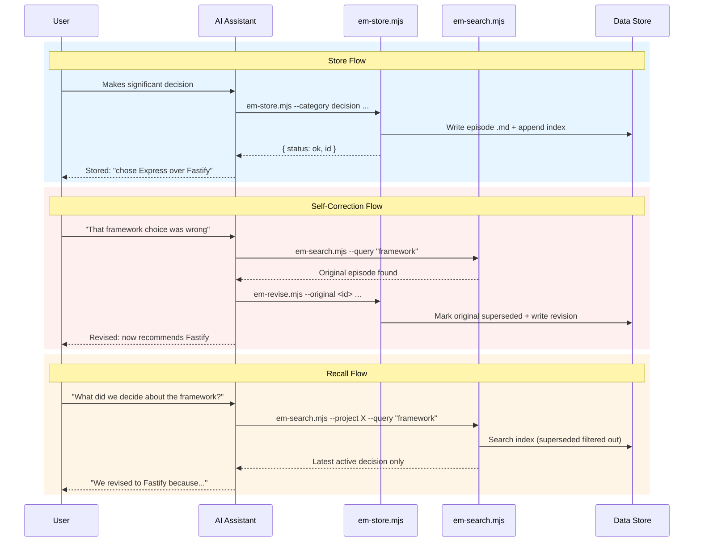

# episodic-memory

A **shared memory layer for AI coding agents**. Different agentic AI platforms — Claude Code, Cursor, Codex, OpenCode, Pi Agent, Windsurf — read and write to the *same* episodic store, so decisions, discoveries, and behavioral patterns persist across sessions *and* across tools.

Works with: **Claude Code**, **Cursor**, **Codex (OpenAI)**, **OpenCode**, **Pi Agent**, **Windsurf / Continue**

The design principles guiding the system are documented in [PRINCIPLES.md](PRINCIPLES.md); the capability families the substrate supports are charted in [CAPABILITIES.md](CAPABILITIES.md).

> ### 🏗️ Major re-architecture in progress (RFC-008)
>
> The enforcement layer (behavior-pattern gates/hooks) is being **decoupled from the memory substrate**, and the system is moving to a **typed plugin model** — `enforcement`, `recall-strategy`, `store-strategy`, and `learning` plugins, each a registered, schema-validated, **versioned** contract. The capability families and the rule for extending them are the guiding post in **[CAPABILITIES.md](CAPABILITIES.md)**; the full design is **[RFC-008](docs/rfcs/RFC-008-decouple-enforcement-from-substrate.md)** (accepted; building in phases — see the [RFC-008 phase index](docs/rfcs/RFC-008/README.md) for current status).
>
> **This does not break current usage.** The file-based store, the CLI, and the cross-tool behavior described below are unaffected today — the substrate (`em-store` / `em-recall` / `em-search`) stays a stable, zero-dependency store-and-recall API throughout the migration. Enforcement plugins beyond Claude Code arrive incrementally as later phases land.

## Table of Contents

- [Capabilities](#capabilities)
- [Agentic Coding Disciplines](#agentic-coding-disciplines)
- [How it works](#how-it-works)
- [Installation](#installation)
- [Supported Tools](#supported-tools)
- [Skills](#skills)
- [Episode Categories](#episode-categories)
- [Data Locations](#data-locations)
- [Self-Correction: Revision Chains](#self-correction-revision-chains)
- [Behavioral Patterns](#behavioral-patterns)
- [RFCs](#rfcs)
- [Scripts Reference](#scripts-reference)
- [License](#license)

## Capabilities

- **Cross-tool memory sharing** — A decision Claude Code made yesterday surfaces when Cursor or Codex starts working on the same project today. All four agents read/write the same episode files; no tool is siloed.
- **Two-tier memory: global + local**
  - **Global** (`~/.episodic-memory/`) — episodes shared across *every* project on your machine. Default write target. Use for: architectural lessons, tooling conventions, behavioral patterns.
  - **Local** (`<project>/.episodic-memory/`) — project-scoped episodes. Use for: project-specific decisions you don't want leaking into other repos.
  - Searches read **both** stores by default; pass `--scope global` or `--scope local` to narrow. On `em-store`, `--scope` selects the write target.
- **Behavioral patterns** — Reusable rules-of-thumb (currently 11, see [patterns table](#behavioral-patterns) below) that codify how AI agents *should* behave: when to checkpoint, when to push, when to log violations. Seeded into global memory so they surface during normal search and recall.
- **Self-correcting revision chains** — When a past decision proves wrong, the original is marked superseded and a corrected episode replaces it. Searches return only the latest active version.
- **Proactive recall** — On session start, agents pull recent decisions, lessons, and prior violations relevant to the current project as pre-flight context.
- **Violation tracking** — Structured records of behavioral-pattern violations, used to detect repeat offenses and escalate weak rules to mechanical enforcement (hooks).
- **Zero dependencies** — Plain markdown + JSONL on the local filesystem. Node.js stdlib only. No database, no daemon, no network.

## Agentic Coding Disciplines

This repo is built by AI agents, and it applies the same disciplines it ships to its own development. The practices below are not aspirational. Most are enforced mechanically by hooks in this repo, and the rest are encoded in the plan template that every non-trivial change follows.

- **Plan before code (Rule 18 workflow).** Non-trivial work runs a fixed sequence: plan, then an independent second-opinion review on the plan, then fix findings, then final plan and approval, then implement with tests written alongside the code, then code review, then fix, then an end-to-end test, then file every deferred finding. The `plan-gate` hook blocks repo-source writes until the plan is approved. Template: [docs/PLAN_TEMPLATE.md](docs/PLAN_TEMPLATE.md).
- **Enforcement is mechanical, not documentation (bp-010).** Documentation-tier rules fail under task-end momentum, so the most-violated ones escalate to PreToolUse and Stop hooks: `plan-gate`, `checkpoint-gate`, and `stop-gate`. A command classifier gates only repo-source writes. It never blocks episode writes, reads, or work outside the repo. Gates fail closed.
- **Verify by artifact, not narrative.** Every claim that something is done names the command and its output. Install, hook, and gate behavior is proven by an isolated-`HOME` mock-project test that drives the real deployed hook, never by reading the code and never by a stub. The plan template's falsifiable-verify rule requires every step's check to fail when the implementation is stubbed.
- **Adversarial, multi-layer review.** Changes pass through a pluggable [second-opinion harness](#second-opinion-review-harness) and adversarial subagents. Review runs in three layers, per-artifact, cross-file, and whole-PR, because each layer catches a different class of bug.
- **Self-correction over patching.** A wrong decision is superseded through a revision chain rather than edited away. Pattern violations are stored as evidence that escalates weak rules into hooks.
- **One concern per PR, deploy after merge.** Each PR covers a single concern and carries a required review trailer. After merge the running hooks are redeployed and audited with `tools/deploy-audit.mjs`, because a merge is not the same as deployed.

Governing docs: [PRINCIPLES.md](PRINCIPLES.md), [CAPABILITIES.md](CAPABILITIES.md), and [docs/PLAN_TEMPLATE.md](docs/PLAN_TEMPLATE.md).

## How it works

**Storage is entirely file-based** — no database required. Episodes are plain markdown files (`.md`) with YAML frontmatter, stored on your local filesystem. A JSONL text file serves as a lightweight index for fast filtering. Zero external dependencies beyond Node.js.

The AI assistant stores significant events during sessions and recalls relevant episodes when starting work or when asked.

When a decision proves wrong, the system creates a **revision chain** — the original is marked superseded and a new corrected episode takes its place. Future searches show only the latest active version.

### Episode Lifecycle



## Installation

```bash
# Clone the repo
git clone <repo-url> episodic-memory
cd episodic-memory

# Recommended: interactive guided setup (prereq checks, tool + project
# selection, optional hooks/backup, PATH shim, health verification)
node install.mjs --wizard

# Or non-interactive: install for a specific tool in a target project
node install.mjs --tool cursor --project /path/to/my-project

# Install for all bundled targets except OpenCode
node install.mjs --tool all --project /path/to/my-project
```

The wizard also handles **migrating to a new machine** (restore stores from an
em-backup repository via a dry-run-first `em-restore`) and **health-checking an
existing install** (`em doctor`, with optional automatic repair).

After install, the unified CLI is available (add `~/.episodic-memory/bin` to
your `PATH` — the wizard offers to do this for you):

```bash
em recall              # what does memory know about this project?
em search --query "atomic rename index"   # multi-term relevance search
em store --project myapp --category decision --summary "..." --body "..."
em doctor              # store + install health check; `em doctor --fix` repairs
em help                # full command table
```

The installer:
1. Copies scripts to `~/.episodic-memory/scripts/`
2. Copies `patterns/_index.json` to `~/.episodic-memory/patterns/` for global pattern validation
3. Creates `.episodic-memory/` in the target project for local episodes
4. Copies the appropriate instruction file for your tool
5. Copies `docs/EM_SCRIPTS_GUIDE.md` to `~/.episodic-memory/EM_SCRIPTS_GUIDE.md` (all tools)
6. With Claude Code hook flags (all registrations are per-project):

   > **Per-project layer — the headline.** Hooks, enforcement, and activation are three INDEPENDENT per-project opt-ins. Each one is scoped to the project you pass via `--project <path>`. A project with only `--install-hooks` has no gates; a project without `--install-enforcement` has no gates. None of these three layers ever writes to `~/.claude`, and removing or changing a layer in project A never touches project B or your global Claude Code setup. The one separate global write is `install.mjs --install-second-opinion`, which installs the second-opinion provider snapshot at `~/.claude/hooks/second-opinion-providers.json`; that flag is its own capability and is not part of the per-project layers above.

   - `--install-hooks` installs only the non-enforcement hooks under `<project>/.claude/`: `em-recall` and `session-handoff` at SessionStart, plus `em-session-end-prompt` at SessionEnd. It registers them in `<project>/.claude/settings.json`; it does not install gates or write to `~/.claude`.
   - `--install-enforcement` is the only flag that arms enforcement. It installs the four gates (`checkpoint-gate`, `plan-gate`, `preflight-gate`, `stop-gate`), their `hooks/lib` closure, and the enforce-contract config set under `<project>/.claude/`; registers them in `<project>/.claude/settings.json`; and seeds `<project>/.episodic-memory/enforce-config.json` if absent. Use `--uninstall-enforcement` to remove that project's enforcement files and registrations; add `--purge-config` to remove the operator-owned config too. Re-running either install warns about drift; `--install-hooks-force` accepts the repository copies.
   - `--install-activation` is the third independent per-project opt-in: it installs the advisory activation adapter (UserPromptSubmit + PreToolUse + SessionStart hooks) under `<project>/.claude/` and registers them in `<project>/.claude/settings.json`. It never writes to `~/.claude` and never blocks; reverse with `--uninstall-activation`.
7. Records what it installed (Layer 1 update distribution): a **version manifest** at each target root — `~/.episodic-memory/install-manifest.json` for the global set, `<project>/.episodic-memory-install.json` per project — with the source version (git SHA of the repo the installer ran from; content hash when git is unavailable), timestamp, tool, and per-file sha256 checksums; a **consumer registry** entry in `~/.episodic-memory/installs.json` (`{project_path, tool, version, enforcement_installed, last_install_ts}`, deduped per project+tool); and a **dist cache** of the current artifact payloads at `~/.episodic-memory/dist/<version>/` (copy source only — nothing is registered or executed from there).

For a fresh Claude Code session, `--bootstrap-last-prompt` writes a 60-second per-project sentinel from `CLAUDE_SESSION_ID`, giving the preflight gate first-prompt ground truth before UserPromptSubmit has fired.

**Keeping consuming projects up to date.** Copies used to fall behind silently on every repo update; now:

```bash
# Preview what would change across ALL registered projects (writes nothing)
node install.mjs --update-consumers --dry-run

# Refresh them: unmodified artifacts (on-disk sha256 == manifest checksum) are
# updated to the current repo version; locally MODIFIED files are skipped with
# a warning and never overwritten; vanished project paths are pruned
node install.mjs --update-consumers
```

The per-project SessionStart hook (Claude Code, installed with `--install-enforcement`) prints a one-line notice when the project's manifest version differs from the global one — e.g. `episodic-memory: project artifacts at 111111111111, global at ef0d77166644 — run: node <repo>/install.mjs --update-consumers` — and stays silent when current. Opt in per project with `"auto_update": true` in `<project>/.episodic-memory/enforce-config.json` (never enabled automatically) to have that drift auto-refreshed at session start from the dist cache via `em-sync-install`, same checksum guard, modified files still untouched and reported. The sweep and the auto-update only ever touch projects in the registry, and never install enforcement where the registry says `enforcement_installed: false`. `em doctor` reports per-project drift under the `installs-drift` check.

**Per-harness agent guides.** If you are an AI coding agent installing this for yourself, read the self-contained guide for your harness in [docs/install/](docs/install/) (one file each for Claude Code, Cursor, Codex, OpenCode, Pi Agent, Windsurf): exact commands, real expected output, artifact tables, and troubleshooting. The agent-facing per-script command reference is [docs/EM_SCRIPTS_GUIDE.md](docs/EM_SCRIPTS_GUIDE.md), also deployed to `~/.episodic-memory/EM_SCRIPTS_GUIDE.md` on every install.

**Per-project enforcement config (optional, RFC-008 P4).** With `--install-enforcement`, the installer **seeds** a default `<project>/.episodic-memory/enforce-config.json` = `{"active": true}` (create-if-absent, never overwriting your edits — a deliberate `{"active": false}` survives reinstalls, even with `--install-hooks-force`). Tune enforcement **per project** by editing it — no need to change the project's hook registrations:

- `{"active": false}` — layer-wide **kill switch**: silences *all* episodic-memory gates (checkpoint, plan, stop, preflight, second-opinion) for that project only; other repos keep their own project-local hooks (R5).
- `{"bp-001": {"plan_approval": "MEDIUM"}}` — relax an individual gate (clamps tier DOWN only; never raises).
- `{"auto_update": true}` — opt-in **session-start auto-update** (Layer 1): on version drift the SessionStart hook refreshes this project's unmodified installed artifacts from `~/.episodic-memory/dist/<version>/` instead of only printing the drift notice (locally modified files are always left untouched and reported). Never enabled automatically. Set it only after this project's deployed `enforce-config.schema.json` is current (an older deployed schema rejects the key, and validation failure fails closed to `{active: true}` — which would override a deliberate `"active": false`).

Fail-closed by design: a missing, empty, or malformed file leaves enforcement fully ON.

## Supported Tools

| Tool | Instruction file | Install location |
|------|-----------------|------------------|
| Claude Code | `SKILL.md` | `.claude/skills/episodic-memory/SKILL.md` |
| Cursor | `cursor.mdc` | `.cursor/rules/episodic-memory.mdc` |
| Codex | `SKILL.md` | `.agents/skills/episodic-memory/SKILL.md` |
| OpenCode | `SKILL.md` | `.opencode/skills/episodic-memory/SKILL.md` |
| Pi Agent | `SKILL.md` | `.agents/skills/episodic-memory/SKILL.md` |
| Windsurf | `windsurf.md` | `.windsurfrules` (appended if exists) |

OpenCode is explicit-only: run `node install.mjs --tool opencode --project <path>`. It is intentionally excluded from `--tool all` because current OpenCode discovery loads `.opencode/skills`, `.claude/skills`, and `.agents/skills`; a broad all-tools install can otherwise expose duplicate `episodic-memory` skills. This path contract is pinned to the current official OpenCode skill docs observed 2026-05-16: <https://opencode.ai/docs/skills>.

Pi Agent shares the `.agents/skills/episodic-memory/SKILL.md` destination with Codex. `--tool all` includes Pi Agent by reusing that shared destination.

Instruction-only support is deliberately modest for OpenCode and Pi Agent:

| Capability | OpenCode | Pi Agent |
|------------|----------|----------|
| Manual recall/search/store/revise via scripts | MEDIUM when shell/script execution is available; otherwise WEAK/manual | MEDIUM when shell/script execution is available; otherwise WEAK/manual |
| Proactive session-start recall | WEAK; depends on the agent loading/following the skill | WEAK; depends on the agent loading/following the skill |
| Enforcement/hooks | Unsupported in this installer slice | Unsupported in this installer slice |
| Live MCP tools | Deferred | Deferred |
| Cross-tool typed requests | Deferred except manual existing-script use | Deferred except manual existing-script use |

Future MCP support should be a thin wrapper around existing scripts (`recall`, `search`, `store`, `revise`) with no second store, no daemon, no polling, explicit activation, and reversible uninstall.

## Skills

This project ships two in-tree skills. Each is a self-contained SKILL.md the agent loads on demand.

| Skill | Location | What it does |
|---|---|---|
| `episodic-memory` | `instructions/SKILL.md` → installed to `.claude/skills/episodic-memory/`, `.agents/skills/episodic-memory/`, etc. (see [Supported Tools](#supported-tools)) | The main skill the agent reads at session start to learn how to recall, store, revise, and surface episodes. Wraps every `em-*` script. |
| `classify-correction` | `skills/classify-correction/SKILL.md` (PR [#327](https://github.com/lantisprime/episodic-memory/pull/327)) | Records a per-project override for the LLM checkpoint-gate classifier when a command was mislabeled (e.g. a read-only inspector blocked as `shared_write`). Writes to `<project>/.episodic-memory/classifier-overrides.jsonl`. |

Three additional SKILLs are invoked from `launchd` rather than the agent's session loop — see [Scheduled Routines](#scheduled-routines-launchd-macos): `episodic-memory-daily-mining`, `episodic-memory-weekly-digest`, `instruction-hygiene-maintenance`.

## Episode Categories

| Category | Use for |
|----------|---------|
| `decision` | Technology choices, architecture, trade-offs |
| `discovery` | Bug root causes, undocumented behavior, insights |
| `milestone` | Features shipped, migrations completed |
| `context` | Constraints, dependencies, environment quirks |
| `research` | Web research distilled for future reference |
| `lesson` | Consolidated lessons from multiple episodes |
| `violation` | Behavioral pattern violations with structured sequences |
| `workflow.lifecycle` | Event-plane records emitted by the behavior-pattern workflow layer |
| `workplan` | Active prioritized work queue, superseded via revision chains |
| `temporary` | Transient working episodes (review threads, scratch); `aggregate-then-prune` lifecycle |

The vocabulary is a closed set defined once in `categories.json` (RFC-009 R10b) and read by every
script through `scripts/lib/categories.mjs`. Filter by category with `em-search --category`
(index-backed via `category-index.json`); `em-rebuild-index --check` reports category drift.

## Data Locations

```
~/.episodic-memory/           # Global (cross-project)
├── scripts/                  # Installed scripts
├── episodes/                 # Global episode .md files
├── patterns/                 # Pattern registry (_index.json)
├── categories.json           # Category vocabulary (RFC-009 R10b)
├── activation-classes.json   # Activity-class vocabulary for lesson triggers (RFC-009 R1)
├── index.jsonl               # Global index
├── tags.json                 # Inverted tag index
├── category-index.json       # Category -> episode-ids index
└── trigger-index.json        # Derived lesson-activation index (RFC-009 R2, lazy-built)

<project>/.episodic-memory/   # Per-project (local)
├── episodes/                 # Project-local episode .md files
├── index.jsonl               # Project-local index
├── tags.json                 # Inverted tag index
├── category-index.json       # Category -> episode-ids index
├── trigger-index.json        # Derived lesson-activation index (RFC-009 R2, lazy-built)
├── activation-log.jsonl      # Append-only, 1 MiB-bounded injected-pointer telemetry (RFC-009 R6)
└── lesson-suppress.json      # Optional, hand-authored: mute lessons by id (RFC-009 R3, fail-open)

patterns/                     # Behavioral patterns (shipped with repo)
├── _index.json               # Machine-readable pattern registry
├── TEMPLATE.md               # Template for new patterns
└── *.md                      # Individual pattern files
```

All episodes go to the **global common store by default**, making them available across all projects. Use `--scope local` for decisions private to one project. Scripts search **both local and global** by default.

> **Worktrees:** scripts resolve the local `.episodic-memory/` via `git rev-parse --git-common-dir`, so all worktrees of the same repo share one local store (the one at the main checkout). Fixed in [#105](https://github.com/lantisprime/episodic-memory/pull/105).

## Self-Correction: Revision Chains

When a past decision proves wrong:

```bash
# Find the original decision
node ~/.episodic-memory/scripts/em-search.mjs --query "framework" --full

# Create a revision (original is auto-marked superseded)
# --scope defaults to "inherit" — revision lands in the same store as the
# original. Pass --scope local|global only to force a cross-store revision.
node ~/.episodic-memory/scripts/em-revise.mjs \
  --original <episode-id> \
  --summary "Switched from Express to Fastify" \
  --body "Express middleware overhead became a bottleneck..."

# View the full revision history
node ~/.episodic-memory/scripts/em-search.mjs --history <episode-id> --full
```

## Behavioral Patterns

The system ships with behavioral patterns — reusable lessons learned from real sessions that AI assistants can recall proactively.

| ID | Pattern |
|----|---------|
| bp-001 | Standard implementation workflow |
| bp-002 | Proactive milestone storage |
| bp-003 | Promote project-specific best practices to global memory |
| bp-004 | Machine-readable index for token efficiency |
| bp-005 | Enforcement lives in consuming repos, not rule repos |
| bp-006 | Push only after all verification steps complete |
| bp-008 | Redo properly instead of patching retroactively |
| bp-009 | Store rule violations as evidence for enforcement |
| bp-010 | Habits override knowledge — always add mechanical enforcement |
| bp-011 | Local files first, external actions only after confirmation |
| bp-012 | Complete session wrap-up — episodic memory, changes, handoff |

Patterns are seeded into the global episode store via `em-seed-patterns.mjs` so they surface during normal search and recall. See `patterns/TEMPLATE.md` to create new ones.

### Enforcement

Behavioral patterns are documentation by default — but the most-violated patterns get escalated to mechanical enforcement (see BP-1 Auto-Pilot below). The system provides two layers:

**Built-in (episodic-memory):**
- **Violation tracking** (`em-violation.mjs`) — structured storage with pattern linkage, searchable by `--category violation` and `--tag violated:<pattern_id>`
- **Session-end prompt** (`em-session-end-prompt.mjs`) — SessionEnd hook that asks about violations
- **Proactive recall** (`em-recall.mjs`) — surfaces past violations at session start as pre-flight warnings
- **Checkpoint enforcement gate** (RFC-002 Phase 3b, shipped + activated 2026-05-02 via [#78](https://github.com/lantisprime/episodic-memory/pull/78) and [#84](https://github.com/lantisprime/episodic-memory/pull/84)) — PreToolUse hook that blocks code edits until the implementation checkpoint is printed, and blocks pushes until E2E + bug logging are done. Opt in per project via `node install.mjs --tool claude-code --install-enforcement --project <path>`; the four enforcement gates are registered only in `<project>/.claude/settings.json`.
- **LLM intent classifier for the checkpoint gate** (Tier 2/3 shipped 2026-05-22 via [#326](https://github.com/lantisprime/episodic-memory/pull/326); replaced by agent-self-classify marker 2026-05-23 via [#331](https://github.com/lantisprime/episodic-memory/pull/331)) — when the Tier 1 heuristic table doesn't recognize a `Bash` command, the gate consults a per-session marker (`scripts/classifier-marker.mjs`) populated by the active agent's own reasoning, then falls through to the Tier 1 safe-default if no marker exists. Configuration loaded by `scripts/classifier-config-loader.mjs` from `<project>/.episodic-memory/classifier-config.json` (or the global file under `~/.episodic-memory/`); set `enabled: false` to disable LLM dispatch entirely and run on the Tier 1 heuristic alone. False-positives (read-only inspectors blocked as `shared_write`) are corrected via the `classify-correction` skill — see [Skills](#skills) below.
- **BP-1 Auto-Pilot** (RFC-004, M0 + M1 + M2 shipped 2026-05-06..23 via [#181](https://github.com/lantisprime/episodic-memory/pull/181), [#186](https://github.com/lantisprime/episodic-memory/pull/186), [#188](https://github.com/lantisprime/episodic-memory/pull/188), [#200](https://github.com/lantisprime/episodic-memory/pull/200), [#206](https://github.com/lantisprime/episodic-memory/pull/206), [#305](https://github.com/lantisprime/episodic-memory/pull/305), [#309](https://github.com/lantisprime/episodic-memory/pull/309), [#313](https://github.com/lantisprime/episodic-memory/pull/313), [#322](https://github.com/lantisprime/episodic-memory/pull/322)) — activation gate, deadline sweep, finalize-replay state machine, HMAC-signed run manifests, per-session preflight markers, and the M2 finish-line `bp1-flag-flip` cutover that mechanically enforce bp-001 (implementation workflow). Replaces documentation-only enforcement for the workflow lifecycle.

**External ([user-preferences](https://github.com/lantisprime/user-preferences)):**
- **Pre-tool hooks** (e.g., `plan-gate.sh`) that block writes during the planning phase
- **CI workflow templates** for status checks
- **PR templates** with checklists mapped to behavioral patterns

Episodic-memory and user-preferences are fully independent — install either or both.

## RFCs

| RFC | Title | Status |
|-----|-------|--------|
| [RFC-001](docs/rfcs/RFC-001-memory-improvements.md) | Intelligent Memory: Tag Index, Relevance Scoring, Proactive Recall, Semantic Consolidation | Accepted (Phases 1-3 shipped) |
| [RFC-002](docs/rfcs/RFC-002-learning-loop.md) | Learning Loop: Violation Tracking, Pattern Refinement, Actionable Recall | Accepted (Phases 1-3 + 3b shipped + runtime-deployed) |
| [RFC-003](docs/rfcs/RFC-003-pluggable-tool-adapters.md) | Pluggable Tool Adapters: Per-Platform Enforcement and Cross-Tool Messaging | Accepted (Phase 1 not yet started) |
| [RFC-004](docs/rfcs/RFC-004-bp1-auto-pilot.md) | BP-1 Auto-Pilot: Automated Rule-18 Implementation Workflow | Accepted (M0 + M1 + M2 shipped) |
| [RFC-005](docs/rfcs/RFC-005-em-move.md) | em-move — atomic episode relocation between scopes | Accepted |
| [RFC-006](docs/rfcs/RFC-006-codex-review-adapter.md) | Codex Review Adapter: Typed-Request Consumer with Failure Classification and Local Fallback | Withdrawn (the review harness shipped separately) |
| [RFC-007](docs/rfcs/RFC-007-graph-projection.md) | Graph Projection — first-class traversal over latent episode/rule edges | Draft |
| [RFC-008](docs/rfcs/RFC-008-decouple-enforcement-from-substrate.md) | Decoupling the Enforcement Layer from the Memory Substrate | Accepted |
| [RFC-009](docs/rfcs/RFC-009-lesson-activation.md) | Lesson Activation: Trigger-Bearing Lessons, Derived Trigger Index, and Bounded Advisory Recall | Accepted |
| [RFC-010](docs/rfcs/RFC-010-versioned-central-engine.md) | Version-pinned central enforcement engine with per-project shims | Draft |
| [RFC-011](docs/rfcs/RFC-011-playbook-activation-preferences.md) | Playbook Activation Preferences: Per-Project Session-Start and On-Demand Playbook Loading | Accepted |

## Scripts Reference

All scripts are zero-dependency `.mjs` files using Node.js stdlib only. They output JSON to stdout.

### Unified CLI
Every script below is also reachable through the `em` dispatcher (installed at `~/.episodic-memory/bin/em`): `em <command>` ≡ `node ~/.episodic-memory/scripts/em-<command>.mjs`. `em help` lists all commands; unknown commands get did-you-mean suggestions.
```bash
em store --project my-project --category decision --summary "..." --body "..."
em search --query "auth token refresh"
em doctor --fix
```

### Doctor
Health check + repair for stores and installation: index parse/drift, tags + category inverted-index consistency, dangling supersedes pointers, stale `.tmp`/`.lock` litter, installed-script drift against the repo checkout, consumer installs-drift (registered projects behind the global install version or with locally modified artifacts), backup config presence.
```bash
node ~/.episodic-memory/scripts/em-doctor.mjs            # report (exit 1 on errors)
node ~/.episodic-memory/scripts/em-doctor.mjs --fix      # rebuild indexes, clear litter
node ~/.episodic-memory/scripts/em-doctor.mjs --strict   # CI mode: warns also fail
node ~/.episodic-memory/scripts/em-doctor.mjs --verbose  # include affected ids/files in findings
node ~/.episodic-memory/scripts/em-doctor.mjs --all-projects        # + every registered project store
node ~/.episodic-memory/scripts/em-doctor.mjs --all-projects --fix  # repair each store in place
```

### Sync Install (per-project update from the dist cache)
Checksum-guarded refresh of one project's installed artifacts from `~/.episodic-memory/dist/<version>/` — the apply-side of the SessionStart drift notice (and of the opt-in `"auto_update": true` flow). Unmodified files (on-disk sha256 == install-manifest checksum) are updated; locally modified files are left untouched and reported; unregistered projects are never touched. Degrades to a status token with exit 0 when the manifest/cache/registry entry is missing.
```bash
node ~/.episodic-memory/scripts/em-sync-install.mjs --project /path/to/my-project
node ~/.episodic-memory/scripts/em-sync-install.mjs --dry-run   # current project, report only
```

### Store
```bash
node ~/.episodic-memory/scripts/em-store.mjs \
  --project my-project \
  --category decision \
  --tags "auth,security" \
  --summary "Chose JWT over session cookies" \
  --body "JWT simplifies our stateless API design..." \
  --scope global

# For long bodies (e.g. plan documents), use --body-file instead of --body (#196)
node ~/.episodic-memory/scripts/em-store.mjs \
  --project my-project --category decision --summary "..." \
  --body-file ./decision-body.md

# Lesson activation (RFC-009 R1, lesson-only): triggers + scoping + declared priority 1-7
# (8-9 is EARNED from linked violations, never declarable) + expiry + violation back-links
node ~/.episodic-memory/scripts/em-store.mjs \
  --project my-project --category lesson --summary "..." --body "..." \
  --trigger "second opinion" --trigger "activity:review" \
  --applies-to-project "*" --applies-to-tool claude-code \
  --priority 6 --review-by 2027-01-01 --evidence <violation-episode-id>
```

### Revise
```bash
node ~/.episodic-memory/scripts/em-revise.mjs \
  --original <episode-id> \
  --summary "Switched to session cookies" \
  --body "JWT token size became a problem..." \
  --tags "auth,security"

# --body-file is also supported (#196)
```

### Pin & Feedback
```bash
# Pin: never decays below 0.6 in scoring, never pruned. Revisions inherit it.
node ~/.episodic-memory/scripts/em-pin.mjs --id <episode-id>          # or --unpin
node ~/.episodic-memory/scripts/em-store.mjs ... --pin                # pin at creation

# Feedback: retrieval says an episode was SEEN; feedback says it HELPED.
# ±5% per point in ranking (clamped −30%/+50%), survives rebuilds.
node ~/.episodic-memory/scripts/em-feedback.mjs --id <episode-id> --useful   # or --noise
# Infer useful feedback from episode ids cited in a file; preview before writing.
node ~/.episodic-memory/scripts/em-feedback.mjs --scan-text <file> --dry-run
node ~/.episodic-memory/scripts/em-feedback.mjs --scan-text <file>
```

### Move (scope relocation, RFC-005)
```bash
# Demote a global episode that is really project-specific (or promote the reverse).
# Preserves id, chain, counters, pinning; updates all four indexes in both scopes;
# writes an audit episode. --dry-run previews; >10 episodes needs --confirm.
node ~/.episodic-memory/scripts/em-move.mjs --id <episode-id> --to local --reason "project-specific"
node ~/.episodic-memory/scripts/em-move.mjs --filter-tag leaked --to local --dry-run
```

### Stats
```bash
# Read-only analytics: totals, categories, projects, age buckets, tags,
# access/feedback aggregates, prunable estimate, index-file health.
node ~/.episodic-memory/scripts/em-stats.mjs --scope all
# One block per consumer-registry project store, on top of the --scope blocks:
node ~/.episodic-memory/scripts/em-stats.mjs --all-projects
```

### Semantic search (optional embeddings sidecar)
```bash
# 1. Build the sidecar. Default provider "hash" is built-in, offline, zero-dep
#    (IDF-weighted token-overlap similarity). Incremental on re-runs.
node ~/.episodic-memory/scripts/em-embed.mjs --scope all

# 2. Query by similarity (cosine × the standard decay/usage score).
node ~/.episodic-memory/scripts/em-semantic.mjs --query "auth token expiry"

# Real embedding models plug in via a command speaking {id,text} → {id,vector}
# JSONL — the substrate itself stays zero-dependency. Ready-made adapters ship
# in examples/embedders/ (Ollama + OpenAI-compatible, python3-stdlib only):
node ~/.episodic-memory/scripts/em-embed.mjs --scope all \
  --cmd "sh <clone>/examples/embedders/ollama-embed.sh" --model ollama-nomic
node ~/.episodic-memory/scripts/em-semantic.mjs --query "..." \
  --cmd "sh <clone>/examples/embedders/ollama-embed.sh" --model ollama-nomic
```

No flags needed once configured: the installer wizard's semantic-search step
(`node install.mjs --wizard` → built-in / claude / ollama / openai / custom)
writes `~/.episodic-memory/embed-config.json`, which `em embed` and
`em semantic` read automatically. Flags and `$EM_EMBED_CMD` still override it.

**Claude-powered semantics without an API key.** Anthropic has no embeddings
API, so Claude cannot generate the vectors — but it can do the semantic
judging. The wizard's `claude` option (or `rerank_cmd` in embed-config.json)
keeps the offline built-in vectors for cheap candidate retrieval and pipes
the top results through `claude -p` — your existing Claude Code login — to
re-order them by true semantic relevance:

```bash
node ~/.episodic-memory/scripts/em-semantic.mjs --query "when do login sessions go stale" \
  --rerank-cmd "sh <clone>/examples/rerankers/claude-rerank.sh"
```

A failing/unavailable reranker falls back to vector order with a warning;
`--no-rerank` skips a configured reranker for one call.

### Consolidate (store hygiene)
```bash
# Fold near-duplicate episodes into one digest episode per cluster.
# Dry-run by default; members become superseded_by the digest and stop
# surfacing in search while staying reachable via --history.
node ~/.episodic-memory/scripts/em-consolidate.mjs --scope local            # preview
node ~/.episodic-memory/scripts/em-consolidate.mjs --scope local --apply    # fold

# Clerk mode uses lesson-specific lexical signals (high-df-filtered tag Jaccard,
# summary Jaccard, shared triggers) to propose merge/dedupe/keep-distinct clusters.
node ~/.episodic-memory/scripts/em-consolidate.mjs --clerk --scope local
node ~/.episodic-memory/scripts/em-consolidate.mjs --clerk --apply --confirm --scope local
```

`--clerk` without `--apply` emits a read-only `clerk-report`: it writes no episodes or store indexes, although it may lazily build the derived `trigger-index.json`. Apply mode fails closed without `--confirm`; holds one blocking `.episodic-memory/clerk-apply.lock` for the entire apply (`--lock-timeout <s>`, default 30); and, for merges, writes the digest before flipping members to `superseded` (the members remain reversible via `em-revise`). Every apply writes exactly one `category: workflow.lifecycle`, `record_type: clerk-run` episode with a `clerk_cutover` stamp and reports crash orphans as benign or dangerous.

Human rejection is part of apply: `--reject-all` rejects every proposal, while repeatable `--reject-member <id>` rejects any cluster containing that member. Rejections are stored by fingerprint in the run record and are not proposed again while the store is unchanged.

```bash
# Archive long supersedes-chains (reversible move; terminal untouched), and
# the registry-wide form: every registered project store in one pass. A real
# multi-store run requires --confirm; unsafe store layouts are skipped.
node ~/.episodic-memory/scripts/em-consolidate.mjs --fold-superseded --dry-run
node ~/.episodic-memory/scripts/em-consolidate.mjs --fold-superseded --all-projects --dry-run
node ~/.episodic-memory/scripts/em-consolidate.mjs --fold-superseded --all-projects --confirm
```

### Promote (EXPERIMENTAL — cross-project recurring lessons)
```bash
# Detect lessons recurring independently across >=2 registered project stores
# and write ONE global lesson episode per recurrence with a ## Sources list.
# Dry-run by default; source stores are never written; re-runs are idempotent.
# Experimental tier: promote-or-remove decision 2026-10-08.
node ~/.episodic-memory/scripts/em-promote.mjs            # preview candidates
node ~/.episodic-memory/scripts/em-promote.mjs --apply    # write global lessons
```

### Web console (`em console`) and manager (`em manage`)
```bash
# Point-and-click view of the store: dashboard (stats + doctor), browse/search
# with history chains, recall preview, pending capture drafts, hygiene panel.
# Loopback-only with a per-launch token; read-only unless --allow-write; idles
# out after 30 minutes by default. Open the URL it prints.
node ~/.episodic-memory/scripts/em-console.mjs                  # read-only
node ~/.episodic-memory/scripts/em-console.mjs --allow-write    # + store/revise/pin/fix

# Guided day-2 maintenance without memorizing flags: status, hygiene
# (rebuild-index / fold / prune / doctor --fix, dry-run first), backup,
# capture drafts, routines, console launcher.
node ~/.episodic-memory/scripts/em-manage.mjs
```
Both are presentation layers over the same CLI contract: every button and menu
action spawns the corresponding `em-*` script and shows its JSON. Nothing is
decided in the UI, and no data leaves your machine.

### Graph traversal (`em graph`)
```bash
# What is connected to this episode? Lineage across supersedes/consolidates/
# evidence/body-citations; tags opt-in for cluster queries.
node ~/.episodic-memory/scripts/em-graph.mjs --from <episode-id> --depth 2
node ~/.episodic-memory/scripts/em-graph.mjs --orphans    # dead ends
node ~/.episodic-memory/scripts/em-graph.mjs --hubs       # load-bearing episodes
```

### Auto-capture (`em capture`)
```bash
# At session end (opt-in via the wizard or ~/.episodic-memory/capture-config.json),
# candidate episodes are DRAFTED from the session transcript; you confirm them
# later. Drafts are never stored without confirmation.
node ~/.episodic-memory/scripts/em-capture.mjs extract --session-id <id>   # draft (heuristic, zero-LLM)
node ~/.episodic-memory/scripts/em-capture.mjs list                        # pending drafts
node ~/.episodic-memory/scripts/em-capture.mjs review --draft <id> --accept-all
# LLM-drafted candidates via your Claude Code login (no API key):
#   capture-config.json {"mode":"cmd","cmd":"sh <repo>/examples/capturers/claude-capture.sh"}
```

### Scheduled maintenance (`em routines`)
```bash
# Adapted to the machine: launchd (macOS), systemd user timers (Linux), or a
# managed crontab block (fallback). Definitions live in ~/.episodic-memory/routines.json.
node ~/.episodic-memory/scripts/em-routines.mjs sync    # seed + schedule the defaults
node ~/.episodic-memory/scripts/em-routines.mjs list    # health: platform + last run + staleness
node ~/.episodic-memory/scripts/em-routines.mjs add --name my-job --cron "0 4 * * *" --cmd "..."
```

Defaults (all no-op when their feature isn't configured): daily `doctor`
auto-repair, daily `embed` sidecar refresh, daily `backup-sync`, weekly
read-only `hygiene-report`. Every run records state; `list` flags **stale**
routines (scheduled but silently not running) and exits 1. Wired into
installation via the wizard's routines step or `install.mjs
--install-routines`. (The old `install-launchd-routines.sh` is legacy —
maintainer-machine-specific claude-skill jobs only.)

### Search
```bash
node ~/.episodic-memory/scripts/em-search.mjs --project my-project
node ~/.episodic-memory/scripts/em-search.mjs --query "JWT" --full
node ~/.episodic-memory/scripts/em-search.mjs --tag auth --category decision --since 2026-01-01
node ~/.episodic-memory/scripts/em-search.mjs --history <id> --full
node ~/.episodic-memory/scripts/em-search.mjs --read <id>            # RFC-011 R7: tracked, bounded, single-episode read the playbook pointers name
node ~/.episodic-memory/scripts/em-search.mjs --include-superseded
node ~/.episodic-memory/scripts/em-search.mjs --warn-time-ms <n> --warn-count <n>  # tune performance-warning thresholds
```

`--read <id>` (RFC-011 R7) fetches exactly one episode by exact id (resolving
`episodes/` then `archived/`); an unknown or empty id is an error (never a search
fallthrough). The body is bound to serialized bytes (≤49152, with `body_truncated`/
`body_missing`); file frontmatter is merged over the index row, and the read tracks
`access_count` (unless `--no-track`). This is the tracked bounded read the playbook
pointers name.

`--query` uses tiered relevance matching: an exact summary match scores 1.0, a
contiguous summary substring 0.7, and a **multi-term query** matches when every
token lands somewhere in the summary, tags, or body (scored by field weight —
summary > tags > body — always below a contiguous match). `--query "index
atomic writes"` finds *"Use atomic rename for index writes"* even though the
words are scattered.

Searches are accelerated by a **token inverted index** (`tokens.json`,
maintained by the writers, rebuilt by `em-rebuild-index`) — results are
identical to a full scan; the index only prunes candidates, and episodes it
has never seen still take the full-scan path. When strict matches leave
`--limit` unfilled, a **partial tier** returns episodes matching at least half
the query tokens, marked `"match":"partial"` and always ranked below full
matches at equal freshness.

### List
```bash
node ~/.episodic-memory/scripts/em-list.mjs --project my-project --limit 5
```

### Check Stale
```bash
node ~/.episodic-memory/scripts/em-check-stale.mjs --project my-project
```

### Seed Patterns
```bash
node ~/.episodic-memory/scripts/em-seed-patterns.mjs
```

### Recall (Proactive)
```bash
node ~/.episodic-memory/scripts/em-recall.mjs
node ~/.episodic-memory/scripts/em-recall.mjs --project my-project --limit 5
node ~/.episodic-memory/scripts/em-recall.mjs --days 14 --no-track
node ~/.episodic-memory/scripts/em-recall.mjs --warn-time-ms <n> --warn-count <n>  # tune performance-warning thresholds
```

### Prune (Archive Stale Episodes)
```bash
node ~/.episodic-memory/scripts/em-prune.mjs --dry-run
node ~/.episodic-memory/scripts/em-prune.mjs --scope global --threshold 0.15
node ~/.episodic-memory/scripts/em-prune.mjs --check  # exit 1 if prunable episodes exist
# RFC-009 R6: evidence-linked violations, trigger-bearing lessons, consolidates
# members, and the latest clerk run record are never archived — see the
# protected / protected_episodes output fields in --dry-run.
# Clerk run records are produced by em-consolidate --clerk --apply.
# RFC-011 R5(b): playbook-referenced chains (declared in playbooks.json) are also
# protected (reason playbook-referenced / chain-member); a present-but-unparseable
# playbooks.json aborts archival exit 1 and archives nothing (fail-closed).
```

`--check` is the read-only CI gate: it exits 1 when prunable episodes exist and 0 when the store passes, without archiving anything.

### Backup (Mirror to Private Repo with Redaction)
```bash
# Scan all sources, report what would be redacted, no writes
node ~/.episodic-memory/scripts/em-backup.mjs --audit

# One-time setup: create the private GitHub repo + initial commit + push
node ~/.episodic-memory/scripts/em-backup.mjs --init

# Daily run: rsync sources, redact, commit, push
node ~/.episodic-memory/scripts/em-backup.mjs --sync

# Built-in redaction unit tests
node ~/.episodic-memory/scripts/em-backup.mjs --self-test

# Inspect resolved config (with secrets/PII masked)
node ~/.episodic-memory/scripts/em-backup.mjs --show-config
```

Mirrors `~/.episodic-memory/` (and any other configured sources) to a private GitHub repo, applying PII / secret redaction to the staging copy. Source files on disk are never modified. Config lives at `~/.config/em-backup/config.json` or `$EM_BACKUP_CONFIG`; see `examples/em-backup.config.example.json`. Refuses `--init` / `--sync` without a config to prevent shipping raw personal memory.

### Restore (Selective, from a Local Backup Repo)

```bash
# Dry-run (default): show what would happen, no disk writes
node ~/.episodic-memory/scripts/em-restore.mjs \
  --from /path/to/cloned-backup-repo \
  --source-map home-em=$HOME/.episodic-memory \
  --source-map project-em=./.episodic-memory \
  --tag workplan --from-date 2026-04-01

# Apply with full doc tree (MEMORY.md, feedback_*.md, knowledge_base/)
node ~/.episodic-memory/scripts/em-restore.mjs \
  --from /path/to/backup --source-map home-em=$HOME/.episodic-memory \
  --include-docs --apply

# Built-in tests
node ~/.episodic-memory/scripts/em-restore.mjs --self-test
```

**Lossy-data note.** em-backup applies content + path redaction. Restore CANNOT undo redaction — it materializes the backup as-is. Frame as "spin up a fresh machine from backup," not "recover the original." Files redacted via `extra_redact_strings` retain their `[REDACTED]` tokens; binary / oversized / symlinked files are absent and only summarized in the report.

**Filters.** `--from-date` / `--to-date` / `--tag` / `--category` / `--source` AND-compose; supersedes-chain ancestors are pulled in transitively so revision chains are intact.

**Conflicts.** Four-bucket classification (clean / identical / normalized-equal / overwrite). Default is fail-closed: existing target files are skipped and listed in the report. Override with `--force`, or write to side-by-side files with `--conflict-mode=sidecar` (writes `<filename>.from-backup`).

**Project `CLAUDE.md`** is git-tracked; restore refuses by default. Pass `--restore-claude-md` to override (or just use `git restore CLAUDE.md`). User-global `~/.claude/CLAUDE.md` follows the standard conflict model.

**Indexes.** `index.jsonl` and `tags.json` are merged (union by id, set-union per tag) — local-only entries at the target are preserved. `--rebuild-index` is on by default after `--apply` (pass `--no-rebuild-index` to skip).

Common modes: `--include-docs` (whole memory tree, atomic via staging dir), `--source LABEL` (narrow to one source), `--allow-duplicate-id` (cross-source same-id), `--allow-symlink-overwrite` (target-side).


### Violation Tracking
```bash
node ~/.episodic-memory/scripts/em-violation.mjs \
  --pattern bp-001-implementation-workflow \
  --summary "Skipped checkpoints" \
  --body "Details..." \
  --sequence "plan,code,push" \
  --correct "plan,checkpoint,code,review,push"

# --body-file is also supported (#196)
```

### Workflow Validation (Lifecycle Episode Chains)
```bash
# Validate the workflow.lifecycle chain for a task at a given gate
node ~/.episodic-memory/scripts/em-workflow-validate.mjs \
  --task <task-id> \
  --gate <pre-checkpoint|post-checkpoint|push-allowed> \
  [--pattern-id bp-001-implementation-workflow] \
  [--worktree <abs-path>] [--branch <name>] [--head <sha>] \
  [--scope local|global|all] [--strict]
```

Pure validator (no side effects) for RFC-002 Phase 3b-H1 hook gates. Checks that the required `workflow.lifecycle` episodes exist for the task and gate, and verifies context (worktree / branch / HEAD) when those args are passed. Exits 0 on pass, 1 on fail, 2 on usage/IO error; always emits JSON `{ status, valid, gate, task, missing[], errors[], warnings[], episodes[] }`. Hooks shell out to it and act on the result.

### Pattern Health
```bash
# Full report — per-pattern violation counts + classification
node ~/.episodic-memory/scripts/em-pattern-health.mjs

# CI/hook gate — exit 1 if any pattern needs attention
node ~/.episodic-memory/scripts/em-pattern-health.mjs --check

# Single pattern
node ~/.episodic-memory/scripts/em-pattern-health.mjs --pattern bp-001-implementation-workflow

# One-line summary
node ~/.episodic-memory/scripts/em-pattern-health.mjs --summary

# Tighter window + threshold (default: 30 days, 3 violations)
node ~/.episodic-memory/scripts/em-pattern-health.mjs --window-days 7 --min-violations 2

# Manual override when enforcement detection misses a hook
node ~/.episodic-memory/scripts/em-pattern-health.mjs --has-enforcement bp-006-push-after-verify

# Hermetic mode (RFC-009 R5a) — project-only reads, zero $HOME dependence
node ~/.episodic-memory/scripts/em-pattern-health.mjs --hermetic --check
```

Searches `~/.claude/hooks/`, `<project>/.claude/hooks/`, `<project>/.git/hooks/`, and `<project>/.github/workflows/` for `pattern_id` references to detect mechanical enforcement. Patterns flagged `needs-enforcement` are violated repeatedly with no hook to stop them; `needs-attention` means an enforcement file exists but violations still occur (escalate to a human).

### Second-Opinion Review Harness

Pluggable cross-tool review at `scripts/second-opinion.mjs` (RFC-006 implementation, shipped PR #222). One callable entry point handles em-store request → provider dispatch → preamble composition → reply parsing → consensus iteration. Replaces the manual em-store + `codex exec` + watcher + reply-episode recipe.

```bash
# Single-shot: write request → dispatch → write reply (synchronous)
node scripts/second-opinion.mjs request \
  --provider codex --project . --storage episodic \
  --body "review this diff..." --summary "diff review" --dispatch

# Consensus loop: dispatch → parse verdict → rebuttal-cb → next round
node scripts/second-opinion.mjs request \
  --provider codex --project . --storage episodic \
  --body-file plan.md --summary "plan review" \
  --consensus --max-rounds 5 --rebuttal-cb scripts/my-rebuttal.mjs
```

`--timeout <ms>` (integer >= 1000) bounds every provider dispatch round; on expiry the child is killed, the error envelope names `{round, timeoutMs}`, and partial stdout persists under `.review-store/forensics/` (never parsed as a verdict). Every dispatch also prepends up to 3 matched lesson pointers from the merged trigger index (RFC-009 R7: ~500-token bound, `activity:review` always queried, `--no-track`, fail-open toward the dispatch).

Providers: `codex`, `claude-subagent`, `gemini`, `opencode` (OpenCode CLI; DeepSeek v4-pro by default, overridable via `OPENCODE_MODEL`), `stub` (testing). Storage backends: `files` (`.review-store/`) or `episodic` (uses em-store; default for the cross-tool message bus). Preambles: per-provider defaults at `scripts/second-opinion/preambles/`, overridable via `--preamble <id>` or `<project>/.review-store/preambles/<provider>.md`.

Bootstrap (writes the install snapshot consumed by validators + the Claude Code PreToolUse gate hook):

```bash
node install.mjs --tool claude-code --install-second-opinion
```

The PreToolUse hook (`plugins/claude-code/hooks/second-opinion-gate.mjs`) blocks direct provider invocations (Bash + Agent variants) so reviews route through the harness. Fail-closed cases:

- Missing or malformed snapshot (parse error, missing `source_hash`).
- Invalid providers — empty `providers[]`, duplicate `id`, missing/non-compilable `cli_match` regex, missing `binary`, or non-array `agent_block_patterns` / `agent_allow_patterns`. Hook blocks with reason `snapshot-invalid-providers`.
- Validator lib unloadable (orphan hook without `~/.claude/hooks/lib/registry-validator.mjs`). Hook blocks with reason `snapshot-validator-load-failed`.

The shared `validateProviderRegistry` (`scripts/second-opinion/lib/registry-validator.mjs`) runs at install (Gate 1 + Gate 2), `readSnapshot`, and the hook — one contract, three enforcement points (PR #221 / #227).

`--install-second-opinion` is atomic across five failure paths. Gate 1 hard-stops before any file copy if the source registry is invalid. Beyond Gate 1, any failure — runtime-copy throw, validator-lib throw, Gate 2 throw, or `writeSnapshot` throw — renames any pre-existing `~/.claude/hooks/second-opinion-providers.json` to `second-opinion-providers.json.stale.<unix-ms>` so the hook keeps fail-closing rather than reading a stale snapshot against newly-updated source. Re-run the install command to recover.

### Codex Watcher

Underlying cursor mechanism for the harness's `episodic` storage backend, also usable standalone for the manual review fallback.

```bash
# Poll project-local memory for new Codex replies (default scope: local)
node ~/.episodic-memory/scripts/em-watch-codex.mjs

# Both stores with independent cursors
node ~/.episodic-memory/scripts/em-watch-codex.mjs --scope all

# Preview without advancing the cursor
node ~/.episodic-memory/scripts/em-watch-codex.mjs --no-update

# Replay from a specific episode id
node ~/.episodic-memory/scripts/em-watch-codex.mjs --since 20260501-073215-codex-review-of-em-watch-codex-mjs-plan-5420

# Override the project root (otherwise walks up from cwd to nearest .episodic-memory/index.jsonl)
node ~/.episodic-memory/scripts/em-watch-codex.mjs --project-root /path/to/repo
```

Returns Codex-authored episodes (tag `codex`, `codex-review`, or `codex-reply`) newer than the last seen id. Cursor lives at `<store>/state/codex-watcher.json` with independent per-scope keys. Episode ids are total-ordered (`YYYYMMDD-HHMMSS-<slug>-<hash>`), so the cursor is immune to clock skew across tools. Cursor advances only to the max id of *returned* episodes — partial-line writes during concurrent `em-store` appends are skipped and re-read on the next invocation.

### Session End Prompt
```bash
node ~/.episodic-memory/scripts/em-session-end-prompt.mjs
```

### Rebuild Index
```bash
node ~/.episodic-memory/scripts/em-rebuild-index.mjs --scope all
```

### Trigger Index (RFC-009 R2)
Derived lesson-activation index: one `trigger-index.json` per store, built lazily from
`status: active` lessons carrying `--trigger` frontmatter. Entries carry an explicit
`trigger_kind` (`phrase`|`tool`|`activity`) and a DERIVED `effective_priority` 1-9 —
the 8-9 critical band is earned from linked violations (`em-violation --lesson` /
`em-store --evidence`), never writer-declared. Freshness via an mtime+size+sha256
fingerprint of `index.jsonl`; the `session_start` section (critical band, static-score
top-10, `violated_pattern` preflight counts) is the artifact the P2 session-start hook reads.
```bash
node ~/.episodic-memory/scripts/em-trigger-index.mjs                     # build the local store's index
node ~/.episodic-memory/scripts/em-trigger-index.mjs --scope all         # build both stores
node ~/.episodic-memory/scripts/em-trigger-index.mjs --merged            # deduped local-precedence view
node ~/.episodic-memory/scripts/em-trigger-index.mjs --project /path/to/repo   # PATH binding to another project's store
node ~/.episodic-memory/scripts/em-trigger-index.mjs --with-pattern-health     # recompute + persist session_start.pattern_health (RFC-009 R5b)
```
The `activation-classes.json` vocabulary (deployed to `~/.episodic-memory/`) closes the
`activity:<class>` trigger set; `validate-rfc-009-contract-mirror.mjs` diffs the shipped
surfaces against `docs/rfcs/RFC-009-lesson-activation.contract.json` in CI.

**Playbooks (RFC-011 R1/R2):** an optional per-project `<project>/.episodic-memory/playbooks.json`
(schema-backed, ≤32 entries / 64 KiB) declares playbook lesson episodes to load at session
start or on demand; the build derives `session_start.playbooks` (capped at `bounds.max_playbooks`,
default 2) and `entry_class:"playbook"` trigger rows, resolving each declared id cross-store to
the terminal active revision. A `build_report.playbooks` declared/excluded audit +
`warnings.unpinned` list surface the active set; the index is now `schema_version: 3`. See
EM_SCRIPTS_GUIDE → `em-trigger-index`.

### Activation adapter (RFC-009 R3/R4, event plane)
The **advisory activation adapter** is the event-plane consumer of the trigger index
(Claude Code only, per-project, opt-in via `install.mjs --install-activation`). It installs
three thin hooks under `<project>/.claude/` — `activation-prompt` (UserPromptSubmit),
`activation-tool` (PreToolUse), and `activation-sessionstart` (SessionStart) — sharing one
`activation-hook-run.mjs` runner. They surface bounded lesson pointers as `additionalContext`:
prompt/tool events match the merged `trigger-index.json` against the event; session start
renders the precomputed `session_start` blend (tier-1 critical band + tier-2 static-score top
lessons + violation preflight). The adapter is **advisory-only** — every hook exits 0 and
emits no decision/block field — and reads ONLY the purpose-built derived indexes (never
`index.jsonl`, episode bodies, or environment). A per-project, hand-authored
`<project>/.episodic-memory/lesson-suppress.json` mutes lessons by episode id across all
bands; a missing or malformed file fails open (injection proceeds). An optional per-project
`playbooks.json` (RFC-011) extends the session-start blend and the on-demand matcher with
declared playbook pointers — one imperative line per playbook (`playbook (playbooks.json):
READ <id> before proceeding (...)`) pointing at a tracked bounded `em-search --read <id>`,
never a body; the `playbook (playbooks.json):` provenance prefix keeps declared injection
visible. Each activation hook appends injected lesson-pointer telemetry to the per-project
`activation-log.jsonl`; the event-plane log is append-only and capped at 1 MiB. It is the
raw input for the planned R6 conversion metric; the shipped clerk's cadence advisory is
computed from the trigger index, not this log. Reverse with `--uninstall-activation`. Enforcement is a separate, independently installed layer
(`--install-enforcement`).

### BP-1 Auto-Pilot (RFC-004)

The BP-1 Auto-Pilot suite mechanically enforces the bp-001 implementation workflow. These scripts are normally driven by `install.mjs --bp1` and the SessionStart hook — operators usually don't invoke them directly.

```bash
# Activation gate — every gated artifact reads via flag-check (RFC-004 §158-167)
node ~/.episodic-memory/scripts/bp1-flag-check.mjs --project <root>

# Build the runtime-artifact manifest (single source of truth, RFC-004 §107-152)
node ~/.episodic-memory/scripts/bp1-build-artifact-manifest.mjs [--project <root>] [--yaml]

# Canonicalize an episode for HMAC signing (debug/inspection)
node ~/.episodic-memory/scripts/bp1-canonicalize.mjs --episode <path> [--pretty]

# Path A + Path B fallback executor (auto-wired as SessionStart H2 hook)
node ~/.episodic-memory/scripts/bp1-deadline-sweep.mjs --once [--project <root>]

# Orchestrator subcommands (M1)
node ~/.episodic-memory/scripts/bp1-orchestrator.mjs init-run --project <root> --rfc-id <rfcId>
node ~/.episodic-memory/scripts/bp1-orchestrator.mjs finalize-run --project <root> --run-id <id>
node ~/.episodic-memory/scripts/bp1-orchestrator.mjs finalize-recover --project <root> --run-id <id>
# Further subcommands: detect-rfcs, record-classifier-dispatch-pre,
# record-classification, record-awaiting-approval, confirm-approval,
# check-deadlines, sweep-naked-entries.

# Marker validation — verify a run's checkpoint marker HMAC + shape (slice 2d-W, #305)
node ~/.episodic-memory/scripts/bp1-marker-validate.mjs --project <path> --run-id <id> [--skip-mtime-check]

# Crash-class classification for SessionStart resumption (slice 2e, #313)
node ~/.episodic-memory/scripts/bp1-crash-classify.mjs --project <root> --run-id <id> [--now <iso>]

# Emit a marker-invalid evidence episode (used by the deadline-firing path, #313)
node ~/.episodic-memory/scripts/bp1-emit-marker-invalid-evidence.mjs --project <path> --run-id <id> --reason <enum> --marker-path <path>

# M2 finish-line: only --disable is functional.
node ~/.episodic-memory/scripts/bp1-flag-flip.mjs --disable <projectRoot>
# --enable, --dry-run-on, and --dry-run-off are M5 stubs that exit 2.
```

The orchestrator also auto-stubs a missing run on first interaction via `scripts/bp1-auto-stub.mjs` — not normally invoked directly.

### Compliance Audit & Transcript Mining

```bash
# Measure rule-skip rates from Claude Code session JSONL transcripts
# (heuristic — false positives expected; useful for trend tracking)
node ~/.episodic-memory/scripts/em-audit-compliance.mjs \
  [--since <ISO>] [--slug <substr>] [--exclude-worktrees] [--format json|markdown]

# Surface decisions/lessons/violations buried in transcripts that were never
# captured as episodes; writes a staging file under .claude/scratch/, never
# calls em-store directly (cold-storage discipline)
node ~/.episodic-memory/scripts/em-mine-transcripts.mjs \
  [--since <ISO>] [--slug <substr>] [--output <path>] [--dry-run]
```

### Scheduled Routines — Legacy macOS launchd Bootstrap (maintainer-machine only)

> **Legacy, macOS-only, maintainer-machine claude-skill jobs.** This section is kept for the small set of `claude -p`-driven SKILL jobs that the maintainer machine still runs directly; it is NOT the general path. For normal scheduled maintenance (doctor repair, embed refresh, backup sync, hygiene reports) use **`em-routines.mjs`** — definitions live in `~/.episodic-memory/routines.json` and adapt to launchd on macOS, systemd user timers on Linux, or managed cron as the fallback. Install via the wizard, `install.mjs --install-routines`, or `node ~/.episodic-memory/scripts/em-routines.mjs sync`. See [USER_MANUAL Scenario 8c](docs/USER_MANUAL.md#scenario-8c-running-routines-on-a-schedule-cross-platform) for the full reference.

Bootstrap (`install-launchd-routines.sh`) installs four LaunchAgent plists so the recurring chores run without manual invocation:

| Plist label | Schedule | What runs |
|---|---|---|
| `com.charltonho.em-daily-mining` | daily 19:30 | `episodic-memory-daily-mining` SKILL — mines today's transcripts into a staging file under `.claude/scratch/` |
| `com.charltonho.em-weekly-digest` | Sunday 09:00 | `episodic-memory-weekly-digest` SKILL — writes the weekly digest episode |
| `com.charltonho.instruction-hygiene` | Sunday 11:00 | `instruction-hygiene-maintenance` SKILL — lesson-set audit |
| `com.charltonho.em-backup-sync` | daily 23:00 | `em-backup-sync-wrapper.sh` — pushes the em-backup repo to remote |

The three SKILL-driven jobs invoke through a rendered wrapper (`~/.claude/scheduled-tasks/em-skill-wrapper.sh`) that reads the SKILL.md body and passes it to `claude -p --`. The `--` separator is required because SKILL.md begins with YAML frontmatter (`---`) — without it, the arg parser treats the body as a long-option flag (PR #228).

```bash
bash install-launchd-routines.sh --dry-run     # preview, no writes
bash install-launchd-routines.sh               # install (no smoke test)
bash install-launchd-routines.sh --smoke       # install + kickstart daily-mining
bash install-launchd-routines.sh --uninstall   # bootout + delete plists (logs preserved)
```

Logs land at `~/Library/Logs/episodic-memory/<job>.log`. Each plist sets `CLAUDE_SCHEDULED_TASK=1` so the SessionStart handoff prompt self-suppresses; `WorkingDirectory` and the wrapper both pin the project root so cwd-sensitive resolvers don't drift under launchd.

### Review Request (Workflow Lifecycle Event)

Lifecycle event for the workflow audit trail — orthogonal to the second-opinion harness above. This script records that a review *happened* (with refs to plan/approval/checkpoints/tests/etc.); the harness *runs* the review.

```bash
# Build + store a workflow.lifecycle review-request event with full ref
# validation (plan, approval, pre/post-checkpoint, tests, code review,
# bug log, command inventory). RFC-002 Phase 3b-H1 PR-D (#118).
node ~/.episodic-memory/scripts/em-review-request.mjs \
  --task <id> \
  --plan-ref <episode:id|file:path|url> \
  --approval-ref <episode:id> \
  --pre-checkpoint-ref <episode:id> \
  --post-checkpoint-ref <episode:id> \
  --tests-ref <episode:id|file:path> \
  --code-review-ref <episode:id> \
  [--bug-log-ref <issue-url>]+ | [--no-new-bugs] \
  [--command-inventory-ref <ref>] [--dry-run]
```

### RFC Validation (Rule-14 CI Gates)

These are CI-only validators that diff prose-tier RFC content against the machine-readable source of truth. Per Rule 14 (machine-readable blocks for drift-prone state).

```bash
# Cross-check _index.json + RFC frontmatter + Active RFCs table in README.md
node ~/.episodic-memory/scripts/em-rfc-validate.mjs [--json]

# RFC-004 §107-152: artifact-manifest YAML block ↔ builder output parity
node ~/.episodic-memory/scripts/validate-rfc-artifact-manifest.mjs [--json]

# RFC-004 §689-719: canonical-fields spec ↔ bp1-canonicalize.mjs lib parity
node ~/.episodic-memory/scripts/validate-rfc-canonical-fields.mjs [--json]

# RFC-004 §1072: §11.5 failure-table prose markdown ↔ YAML mirror parity
node ~/.episodic-memory/scripts/validate-rfc-failure-table.mjs [--json]
```

## License

MIT
