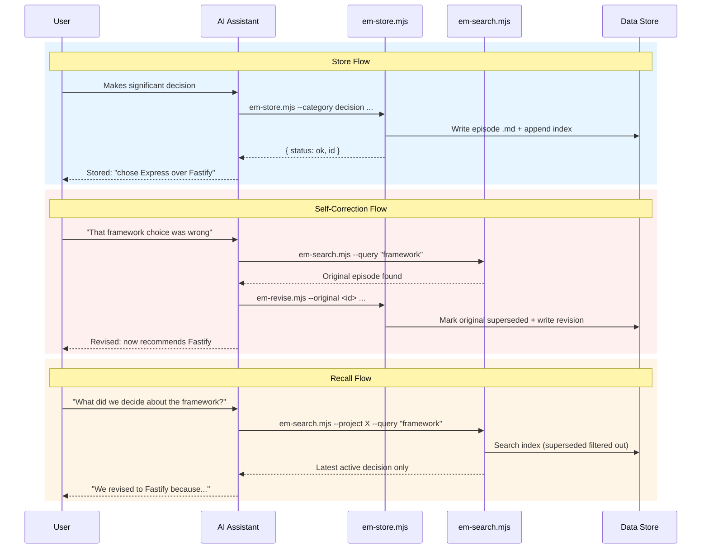

# episodic-memory

A cross-tool episodic memory system for AI coding assistants. Persistently stores decisions, discoveries, milestones, and context across sessions — with self-correcting revision chains.

Works with: **Claude Code**, **Cursor**, **Codex (OpenAI)**, **Windsurf / Continue**

## How it works

**Storage is entirely file-based** — no database required. Episodes are plain markdown files (`.md`) with YAML frontmatter, stored on your local filesystem. A JSONL text file serves as a lightweight index for fast filtering. Zero external dependencies beyond Node.js.

The AI assistant stores significant events during sessions and recalls relevant episodes when starting work or when asked.

When a decision proves wrong, the system creates a **revision chain** — the original is marked superseded and a new corrected episode takes its place. Future searches show only the latest active version.

### Episode Lifecycle



## Installation

```bash
# Clone the repo
git clone <repo-url> episodic-memory
cd episodic-memory

# Install for a specific tool in a target project
node install.mjs --tool cursor --project /path/to/my-project

# Install for all supported tools
node install.mjs --tool all --project /path/to/my-project
```

The installer:
1. Copies scripts to `~/.episodic-memory/scripts/`
2. Copies `patterns/_index.json` to `~/.episodic-memory/patterns/` for global pattern validation
3. Creates `.episodic-memory/` in the target project for local episodes
4. Copies the appropriate instruction file for your tool
5. With `--install-hooks`: registers SessionEnd + SessionStart hooks in `~/.claude/settings.json` (Claude Code only, opt-in)

## Supported Tools

| Tool | Instruction file | Install location |
|------|-----------------|------------------|
| Claude Code | `SKILL.md` | `.claude/skills/episodic-memory/SKILL.md` |
| Cursor | `cursor.mdc` | `.cursor/rules/episodic-memory.mdc` |
| Codex | `codex-skill.md` | `.agents/skills/episodic-memory/` |
| Windsurf | `windsurf.md` | `.windsurfrules` (appended if exists) |

## Episode Categories

| Category | Use for |
|----------|---------|
| `decision` | Technology choices, architecture, trade-offs |
| `discovery` | Bug root causes, undocumented behavior, insights |
| `milestone` | Features shipped, migrations completed |
| `context` | Constraints, dependencies, environment quirks |
| `research` | Web research distilled for future reference |
| `lesson` | Consolidated lessons from multiple episodes |
| `violation` | Behavioral pattern violations with structured sequences |

## Data Locations

```
~/.episodic-memory/           # Global (cross-project)
├── scripts/                  # Installed scripts
├── episodes/                 # Global episode .md files
├── patterns/                 # Pattern registry (_index.json)
├── index.jsonl               # Global index
└── tags.json                 # Inverted tag index

<project>/.episodic-memory/   # Per-project (local)
├── episodes/                 # Project-local episode .md files
├── index.jsonl               # Project-local index
└── tags.json                 # Inverted tag index

patterns/                     # Behavioral patterns (shipped with repo)
├── _index.json               # Machine-readable pattern registry
├── TEMPLATE.md               # Template for new patterns
└── *.md                      # Individual pattern files
```

All episodes go to the **global common store by default**, making them available across all projects. Use `--scope local` for decisions private to one project. Scripts search **both local and global** by default.

## Self-Correction: Revision Chains

When a past decision proves wrong:

```bash
# Find the original decision
node ~/.episodic-memory/scripts/em-search.mjs --query "framework" --full

# Create a revision (original is auto-marked superseded)
node ~/.episodic-memory/scripts/em-revise.mjs \
  --original <episode-id> \
  --summary "Switched from Express to Fastify" \
  --body "Express middleware overhead became a bottleneck..."

# View the full revision history
node ~/.episodic-memory/scripts/em-search.mjs --history <episode-id> --full
```

## Behavioral Patterns

The system ships with behavioral patterns — reusable lessons learned from real sessions that AI assistants can recall proactively.

| ID | Pattern |
|----|---------|
| bp-001 | Standard implementation workflow |
| bp-002 | Proactive milestone storage |
| bp-003 | Promote project-specific best practices to global memory |
| bp-004 | Machine-readable index for token efficiency |
| bp-005 | Enforcement lives in consuming repos, not rule repos |
| bp-006 | Push only after all verification steps complete |
| bp-008 | Redo properly instead of patching retroactively |
| bp-009 | Store rule violations as evidence for enforcement |
| bp-010 | Habits override knowledge — always add mechanical enforcement |
| bp-011 | Local files first, external actions only after confirmation |
| bp-012 | Complete session wrap-up — episodic memory, changes, handoff |

Patterns are seeded into the global episode store via `em-seed-patterns.mjs` so they surface during normal search and recall. See `patterns/TEMPLATE.md` to create new ones.

### Enforcement

Behavioral patterns are documentation — they tell AI assistants **what** to follow, but don't mechanically **prevent** violations. The system provides two layers of enforcement:

**Built-in (episodic-memory):**
- **Violation tracking** (`em-violation.mjs`) — structured storage with pattern linkage, searchable by `--category violation` and `--tag violated:<pattern_id>`
- **Session-end prompt** (`em-session-end-prompt.mjs`) — SessionEnd hook that asks about violations
- **Proactive recall** (`em-recall.mjs`) — surfaces past violations at session start as pre-flight warnings
- **Checkpoint enforcement gate** (RFC-002 Phase 3b, coming) — PreToolUse hook that blocks code edits until the implementation checkpoint is printed, and blocks pushes until E2E + bug logging are done

**External ([user-preferences](https://github.com/lantisprime/user-preferences)):**
- **Pre-tool hooks** (e.g., `plan-gate.sh`) that block writes during the planning phase
- **CI workflow templates** for status checks
- **PR templates** with checklists mapped to behavioral patterns

Episodic-memory and user-preferences are fully independent — install either or both.

## RFCs

| RFC | Title | Status |
|-----|-------|--------|
| [RFC-001](docs/rfcs/RFC-001-memory-improvements.md) | Intelligent Memory: Tag Index, Relevance Scoring, Proactive Recall, Semantic Consolidation | Accepted (Phases 1-3 shipped) |
| [RFC-002](docs/rfcs/RFC-002-learning-loop.md) | Learning Loop: Violation Tracking, Pattern Refinement, Actionable Recall | Accepted (Phases 1-2 shipped) |

## Scripts Reference

All scripts are zero-dependency `.mjs` files using Node.js stdlib only. They output JSON to stdout.

### Store
```bash
node ~/.episodic-memory/scripts/em-store.mjs \
  --project my-project \
  --category decision \
  --tags "auth,security" \
  --summary "Chose JWT over session cookies" \
  --body "JWT simplifies our stateless API design..." \
  --scope global
```

### Revise
```bash
node ~/.episodic-memory/scripts/em-revise.mjs \
  --original <episode-id> \
  --summary "Switched to session cookies" \
  --body "JWT token size became a problem..." \
  --tags "auth,security"
```

### Search
```bash
node ~/.episodic-memory/scripts/em-search.mjs --project my-project
node ~/.episodic-memory/scripts/em-search.mjs --query "JWT" --full
node ~/.episodic-memory/scripts/em-search.mjs --tag auth --category decision --since 2026-01-01
node ~/.episodic-memory/scripts/em-search.mjs --history <id> --full
node ~/.episodic-memory/scripts/em-search.mjs --include-superseded
```

### List
```bash
node ~/.episodic-memory/scripts/em-list.mjs --project my-project --limit 5
```

### Check Stale
```bash
node ~/.episodic-memory/scripts/em-check-stale.mjs --project my-project
```

### Seed Patterns
```bash
node ~/.episodic-memory/scripts/em-seed-patterns.mjs
```

### Recall (Proactive)
```bash
node ~/.episodic-memory/scripts/em-recall.mjs
node ~/.episodic-memory/scripts/em-recall.mjs --project my-project --limit 5
node ~/.episodic-memory/scripts/em-recall.mjs --days 14 --no-track
```

### Prune (Archive Stale Episodes)
```bash
node ~/.episodic-memory/scripts/em-prune.mjs --dry-run
node ~/.episodic-memory/scripts/em-prune.mjs --scope global --threshold 0.15
node ~/.episodic-memory/scripts/em-prune.mjs --check  # exit 1 if prunable episodes exist
```

### Violation Tracking
```bash
node ~/.episodic-memory/scripts/em-violation.mjs \
  --pattern bp-001-implementation-workflow \
  --summary "Skipped checkpoints" \
  --body "Details..." \
  --sequence "plan,code,push" \
  --correct "plan,checkpoint,code,review,push"
```

### Pattern Health
```bash
# Full report — per-pattern violation counts + classification
node ~/.episodic-memory/scripts/em-pattern-health.mjs

# CI/hook gate — exit 1 if any pattern needs attention
node ~/.episodic-memory/scripts/em-pattern-health.mjs --check

# Single pattern
node ~/.episodic-memory/scripts/em-pattern-health.mjs --pattern bp-001-implementation-workflow

# One-line summary
node ~/.episodic-memory/scripts/em-pattern-health.mjs --summary

# Tighter window + threshold (default: 30 days, 3 violations)
node ~/.episodic-memory/scripts/em-pattern-health.mjs --window-days 7 --min-violations 2

# Manual override when enforcement detection misses a hook
node ~/.episodic-memory/scripts/em-pattern-health.mjs --has-enforcement bp-006-push-after-verify
```

Searches `~/.claude/hooks/`, `<project>/.claude/hooks/`, `<project>/.git/hooks/`, and `<project>/.github/workflows/` for `pattern_id` references to detect mechanical enforcement. Patterns flagged `needs-enforcement` are violated repeatedly with no hook to stop them; `needs-attention` means an enforcement file exists but violations still occur (escalate to a human).

### Session End Prompt
```bash
node ~/.episodic-memory/scripts/em-session-end-prompt.mjs
```

### Rebuild Index
```bash
node ~/.episodic-memory/scripts/em-rebuild-index.mjs --scope all
```

## License

MIT
