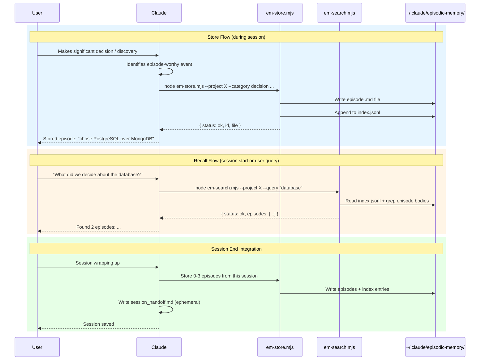

# episodic-memory

A Claude Code plugin that provides structured episodic memory — persistent, searchable recall of decisions, discoveries, milestones, and context across sessions.

## How it works

Episodes are markdown files with YAML frontmatter stored centrally at `~/.claude/episodic-memory/episodes/`. A JSONL index enables fast filtering. Claude automatically stores significant events during sessions and recalls relevant episodes when starting work on a project or when asked.

### Episode Lifecycle



## Installation

Install as a Claude Code plugin:

```bash
claude plugin add /path/to/episodic-memory
```

Or symlink into your plugins directory.

## Episode categories

| Category | Use for |
|----------|---------|
| `decision` | Technology choices, architecture approaches, trade-offs |
| `discovery` | Bug root causes, undocumented behavior, performance insights |
| `milestone` | Features shipped, migrations completed, PRs merged |
| `context` | Constraints, external dependencies, environment quirks |

## Scripts

All scripts are zero-dependency `.mjs` files using Node.js stdlib only. They output JSON to stdout.

### Store an episode

```bash
node skills/episodic-memory/scripts/em-store.mjs \
  --project my-project \
  --category decision \
  --tags "auth,security" \
  --summary "Chose JWT over session cookies" \
  --body "JWT simplifies our stateless API design..."
```

### Search episodes

```bash
# By project
node skills/episodic-memory/scripts/em-search.mjs --project my-project

# Full-text search with body content
node skills/episodic-memory/scripts/em-search.mjs --query "JWT" --full

# Filter by tag, category, and date
node skills/episodic-memory/scripts/em-search.mjs --tag auth --category decision --since 2026-01-01
```

### List recent episodes

```bash
node skills/episodic-memory/scripts/em-list.mjs --project my-project --limit 5
```

### Rebuild index

If `index.jsonl` becomes corrupted or out of sync:

```bash
node skills/episodic-memory/scripts/em-rebuild-index.mjs
```

## Data location

Episodes and index are stored at `~/.claude/episodic-memory/` (outside this repo):

```
~/.claude/episodic-memory/
├── episodes/          # Individual .md files
└── index.jsonl        # One JSON line per episode
```

## License

MIT
