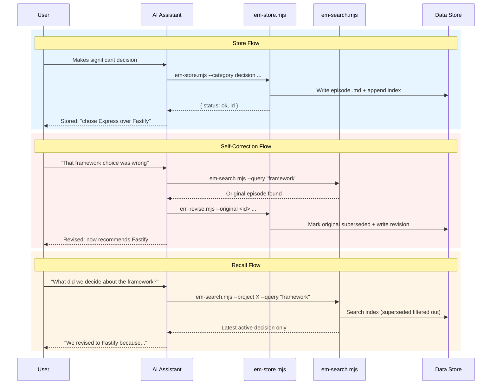

# episodic-memory

A **shared memory layer for AI coding agents**. Different agentic AI platforms — Claude Code, Cursor, Codex, Windsurf — read and write to the *same* episodic store, so decisions, discoveries, and behavioral patterns persist across sessions *and* across tools.

Works with: **Claude Code**, **Cursor**, **Codex (OpenAI)**, **Windsurf / Continue**

The design principles guiding the system are documented in [PRINCIPLES.md](PRINCIPLES.md).

## Capabilities

- **Cross-tool memory sharing** — A decision Claude Code made yesterday surfaces when Cursor or Codex starts working on the same project today. All four agents read/write the same episode files; no tool is siloed.
- **Two-tier memory: global + local**
  - **Global** (`~/.episodic-memory/`) — episodes shared across *every* project on your machine. Default write target. Use for: architectural lessons, tooling conventions, behavioral patterns.
  - **Local** (`<project>/.episodic-memory/`) — project-scoped episodes. Use for: project-specific decisions you don't want leaking into other repos.
  - Searches read **both** stores by default; pass `--scope global` or `--scope local` to narrow. On `em-store`, `--scope` selects the write target.
- **Behavioral patterns** — Reusable rules-of-thumb (currently 11, see [patterns table](#behavioral-patterns) below) that codify how AI agents *should* behave: when to checkpoint, when to push, when to log violations. Seeded into global memory so they surface during normal search and recall.
- **Self-correcting revision chains** — When a past decision proves wrong, the original is marked superseded and a corrected episode replaces it. Searches return only the latest active version.
- **Proactive recall** — On session start, agents pull recent decisions, lessons, and prior violations relevant to the current project as pre-flight context.
- **Violation tracking** — Structured records of behavioral-pattern violations, used to detect repeat offenses and escalate weak rules to mechanical enforcement (hooks).
- **Zero dependencies** — Plain markdown + JSONL on the local filesystem. Node.js stdlib only. No database, no daemon, no network.

## How it works

**Storage is entirely file-based** — no database required. Episodes are plain markdown files (`.md`) with YAML frontmatter, stored on your local filesystem. A JSONL text file serves as a lightweight index for fast filtering. Zero external dependencies beyond Node.js.

The AI assistant stores significant events during sessions and recalls relevant episodes when starting work or when asked.

When a decision proves wrong, the system creates a **revision chain** — the original is marked superseded and a new corrected episode takes its place. Future searches show only the latest active version.

### Episode Lifecycle



## Installation

```bash
# Clone the repo
git clone <repo-url> episodic-memory
cd episodic-memory

# Install for a specific tool in a target project
node install.mjs --tool cursor --project /path/to/my-project

# Install for all supported tools
node install.mjs --tool all --project /path/to/my-project
```

The installer:
1. Copies scripts to `~/.episodic-memory/scripts/`
2. Copies `patterns/_index.json` to `~/.episodic-memory/patterns/` for global pattern validation
3. Creates `.episodic-memory/` in the target project for local episodes
4. Copies the appropriate instruction file for your tool
5. With `--install-hooks`: copies `hooks/*.sh` into `~/.claude/hooks/` and `hooks/lib/*.sh` into `~/.claude/hooks/lib/`, then registers PreToolUse (checkpoint-gate + plan-gate + stop-gate, from `~/.claude/hooks/`), SessionStart (em-recall-sessionstart + BP-1 fallback sweep, from `~/.claude/hooks/`), and SessionEnd (em-session-end-prompt, run directly from `~/.episodic-memory/scripts/`) hooks in `~/.claude/settings.json` (Claude Code only, opt-in). Re-running the installer warns when an installed hook has drifted from the source-of-truth copy ([#201](https://github.com/lantisprime/episodic-memory/pull/201)). Use `--install-hooks-force` to overwrite locally edited hook files.

## Supported Tools

| Tool | Instruction file | Install location |
|------|-----------------|------------------|
| Claude Code | `SKILL.md` | `.claude/skills/episodic-memory/SKILL.md` |
| Cursor | `cursor.mdc` | `.cursor/rules/episodic-memory.mdc` |
| Codex | `codex-skill.md` | `.agents/skills/episodic-memory/` |
| Windsurf | `windsurf.md` | `.windsurfrules` (appended if exists) |

## Episode Categories

| Category | Use for |
|----------|---------|
| `decision` | Technology choices, architecture, trade-offs |
| `discovery` | Bug root causes, undocumented behavior, insights |
| `milestone` | Features shipped, migrations completed |
| `context` | Constraints, dependencies, environment quirks |
| `research` | Web research distilled for future reference |
| `lesson` | Consolidated lessons from multiple episodes |
| `violation` | Behavioral pattern violations with structured sequences |

## Data Locations

```
~/.episodic-memory/           # Global (cross-project)
├── scripts/                  # Installed scripts
├── episodes/                 # Global episode .md files
├── patterns/                 # Pattern registry (_index.json)
├── index.jsonl               # Global index
└── tags.json                 # Inverted tag index

<project>/.episodic-memory/   # Per-project (local)
├── episodes/                 # Project-local episode .md files
├── index.jsonl               # Project-local index
└── tags.json                 # Inverted tag index

patterns/                     # Behavioral patterns (shipped with repo)
├── _index.json               # Machine-readable pattern registry
├── TEMPLATE.md               # Template for new patterns
└── *.md                      # Individual pattern files
```

All episodes go to the **global common store by default**, making them available across all projects. Use `--scope local` for decisions private to one project. Scripts search **both local and global** by default.

> **Worktrees:** scripts resolve the local `.episodic-memory/` via `git rev-parse --git-common-dir`, so all worktrees of the same repo share one local store (the one at the main checkout). Fixed in [#105](https://github.com/lantisprime/episodic-memory/pull/105).

## Self-Correction: Revision Chains

When a past decision proves wrong:

```bash
# Find the original decision
node ~/.episodic-memory/scripts/em-search.mjs --query "framework" --full

# Create a revision (original is auto-marked superseded)
# --scope defaults to "inherit" — revision lands in the same store as the
# original. Pass --scope local|global only to force a cross-store revision.
node ~/.episodic-memory/scripts/em-revise.mjs \
  --original <episode-id> \
  --summary "Switched from Express to Fastify" \
  --body "Express middleware overhead became a bottleneck..."

# View the full revision history
node ~/.episodic-memory/scripts/em-search.mjs --history <episode-id> --full
```

## Behavioral Patterns

The system ships with behavioral patterns — reusable lessons learned from real sessions that AI assistants can recall proactively.

| ID | Pattern |
|----|---------|
| bp-001 | Standard implementation workflow |
| bp-002 | Proactive milestone storage |
| bp-003 | Promote project-specific best practices to global memory |
| bp-004 | Machine-readable index for token efficiency |
| bp-005 | Enforcement lives in consuming repos, not rule repos |
| bp-006 | Push only after all verification steps complete |
| bp-008 | Redo properly instead of patching retroactively |
| bp-009 | Store rule violations as evidence for enforcement |
| bp-010 | Habits override knowledge — always add mechanical enforcement |
| bp-011 | Local files first, external actions only after confirmation |
| bp-012 | Complete session wrap-up — episodic memory, changes, handoff |

Patterns are seeded into the global episode store via `em-seed-patterns.mjs` so they surface during normal search and recall. See `patterns/TEMPLATE.md` to create new ones.

### Enforcement

Behavioral patterns are documentation by default — but the most-violated patterns get escalated to mechanical enforcement (see BP-1 Auto-Pilot below). The system provides two layers:

**Built-in (episodic-memory):**
- **Violation tracking** (`em-violation.mjs`) — structured storage with pattern linkage, searchable by `--category violation` and `--tag violated:<pattern_id>`
- **Session-end prompt** (`em-session-end-prompt.mjs`) — SessionEnd hook that asks about violations
- **Proactive recall** (`em-recall.mjs`) — surfaces past violations at session start as pre-flight warnings
- **Checkpoint enforcement gate** (RFC-002 Phase 3b, shipped + activated 2026-05-02 via [#78](https://github.com/lantisprime/episodic-memory/pull/78) and [#84](https://github.com/lantisprime/episodic-memory/pull/84)) — PreToolUse hook that blocks code edits until the implementation checkpoint is printed, and blocks pushes until E2E + bug logging are done. Opt-in via `node install.mjs --tool claude-code --install-hooks --project <path>`; registers SessionStart + PreToolUse + SessionEnd hooks in `~/.claude/settings.json`.
- **BP-1 Auto-Pilot** (RFC-004, M0 + M1 shipped 2026-05-06..09 via [#181](https://github.com/lantisprime/episodic-memory/pull/181), [#186](https://github.com/lantisprime/episodic-memory/pull/186), [#188](https://github.com/lantisprime/episodic-memory/pull/188), [#200](https://github.com/lantisprime/episodic-memory/pull/200), [#206](https://github.com/lantisprime/episodic-memory/pull/206)) — activation gate, deadline sweep, finalize-replay state machine, and HMAC-signed run manifests that mechanically enforce bp-001 (implementation workflow). Replaces documentation-only enforcement for the workflow lifecycle.

**External ([user-preferences](https://github.com/lantisprime/user-preferences)):**
- **Pre-tool hooks** (e.g., `plan-gate.sh`) that block writes during the planning phase
- **CI workflow templates** for status checks
- **PR templates** with checklists mapped to behavioral patterns

Episodic-memory and user-preferences are fully independent — install either or both.

## RFCs

| RFC | Title | Status |
|-----|-------|--------|
| [RFC-001](docs/rfcs/RFC-001-memory-improvements.md) | Intelligent Memory: Tag Index, Relevance Scoring, Proactive Recall, Semantic Consolidation | Accepted (Phases 1-3 shipped) |
| [RFC-002](docs/rfcs/RFC-002-learning-loop.md) | Learning Loop: Violation Tracking, Pattern Refinement, Actionable Recall | Accepted (Phases 1-3 + 3b shipped + runtime-deployed) |
| [RFC-003](docs/rfcs/RFC-003-pluggable-tool-adapters.md) | Pluggable Tool Adapters: Per-Platform Enforcement and Cross-Tool Messaging | Accepted (Phase 1 not yet started) |
| [RFC-004](docs/rfcs/RFC-004-bp1-auto-pilot.md) | BP-1 Auto-Pilot: Automated Rule-18 Implementation Workflow | Accepted (M0 + M1 shipped) |
| [RFC-005](docs/rfcs/RFC-005-em-move.md) | em-move — atomic episode relocation between scopes | Draft |
| [RFC-006](docs/rfcs/RFC-006-codex-review-adapter.md) | Codex Review Adapter: Typed-Request Consumer with Failure Classification and Local Fallback | Accepted (harness shipped PR #222) |

## Scripts Reference

All scripts are zero-dependency `.mjs` files using Node.js stdlib only. They output JSON to stdout.

### Store
```bash
node ~/.episodic-memory/scripts/em-store.mjs \
  --project my-project \
  --category decision \
  --tags "auth,security" \
  --summary "Chose JWT over session cookies" \
  --body "JWT simplifies our stateless API design..." \
  --scope global

# For long bodies (e.g. plan documents), use --body-file instead of --body (#196)
node ~/.episodic-memory/scripts/em-store.mjs \
  --project my-project --category decision --summary "..." \
  --body-file ./decision-body.md
```

### Revise
```bash
node ~/.episodic-memory/scripts/em-revise.mjs \
  --original <episode-id> \
  --summary "Switched to session cookies" \
  --body "JWT token size became a problem..." \
  --tags "auth,security"

# --body-file is also supported (#196)
```

### Search
```bash
node ~/.episodic-memory/scripts/em-search.mjs --project my-project
node ~/.episodic-memory/scripts/em-search.mjs --query "JWT" --full
node ~/.episodic-memory/scripts/em-search.mjs --tag auth --category decision --since 2026-01-01
node ~/.episodic-memory/scripts/em-search.mjs --history <id> --full
node ~/.episodic-memory/scripts/em-search.mjs --include-superseded
```

### List
```bash
node ~/.episodic-memory/scripts/em-list.mjs --project my-project --limit 5
```

### Check Stale
```bash
node ~/.episodic-memory/scripts/em-check-stale.mjs --project my-project
```

### Seed Patterns
```bash
node ~/.episodic-memory/scripts/em-seed-patterns.mjs
```

### Recall (Proactive)
```bash
node ~/.episodic-memory/scripts/em-recall.mjs
node ~/.episodic-memory/scripts/em-recall.mjs --project my-project --limit 5
node ~/.episodic-memory/scripts/em-recall.mjs --days 14 --no-track
```

### Prune (Archive Stale Episodes)
```bash
node ~/.episodic-memory/scripts/em-prune.mjs --dry-run
node ~/.episodic-memory/scripts/em-prune.mjs --scope global --threshold 0.15
node ~/.episodic-memory/scripts/em-prune.mjs --check  # exit 1 if prunable episodes exist
```

### Backup (Mirror to Private Repo with Redaction)
```bash
# Scan all sources, report what would be redacted, no writes
node ~/.episodic-memory/scripts/em-backup.mjs --audit

# One-time setup: create the private GitHub repo + initial commit + push
node ~/.episodic-memory/scripts/em-backup.mjs --init

# Daily run: rsync sources, redact, commit, push
node ~/.episodic-memory/scripts/em-backup.mjs --sync

# Built-in redaction unit tests
node ~/.episodic-memory/scripts/em-backup.mjs --self-test

# Inspect resolved config (with secrets/PII masked)
node ~/.episodic-memory/scripts/em-backup.mjs --show-config
```

Mirrors `~/.episodic-memory/` (and any other configured sources) to a private GitHub repo, applying PII / secret redaction to the staging copy. Source files on disk are never modified. Config lives at `~/.config/em-backup/config.json` or `$EM_BACKUP_CONFIG`; see `examples/em-backup.config.example.json`. Refuses `--init` / `--sync` without a config to prevent shipping raw personal memory.

### Restore (Selective, from a Local Backup Repo)

```bash
# Dry-run (default): show what would happen, no disk writes
node ~/.episodic-memory/scripts/em-restore.mjs \
  --from /path/to/cloned-backup-repo \
  --source-map home-em=$HOME/.episodic-memory \
  --source-map project-em=./.episodic-memory \
  --tag workplan --from-date 2026-04-01

# Apply with full doc tree (MEMORY.md, feedback_*.md, knowledge_base/)
node ~/.episodic-memory/scripts/em-restore.mjs \
  --from /path/to/backup --source-map home-em=$HOME/.episodic-memory \
  --include-docs --apply

# Built-in tests
node ~/.episodic-memory/scripts/em-restore.mjs --self-test
```

**Lossy-data note.** em-backup applies content + path redaction. Restore CANNOT undo redaction — it materializes the backup as-is. Frame as "spin up a fresh machine from backup," not "recover the original." Files redacted via `extra_redact_strings` retain their `[REDACTED]` tokens; binary / oversized / symlinked files are absent and only summarized in the report.

**Filters.** `--from-date` / `--to-date` / `--tag` / `--category` / `--source` AND-compose; supersedes-chain ancestors are pulled in transitively so revision chains are intact.

**Conflicts.** Four-bucket classification (clean / identical / normalized-equal / overwrite). Default is fail-closed: existing target files are skipped and listed in the report. Override with `--force`, or write to side-by-side files with `--conflict-mode=sidecar` (writes `<filename>.from-backup`).

**Project `CLAUDE.md`** is git-tracked; restore refuses by default. Pass `--restore-claude-md` to override (or just use `git restore CLAUDE.md`). User-global `~/.claude/CLAUDE.md` follows the standard conflict model.

**Indexes.** `index.jsonl` and `tags.json` are merged (union by id, set-union per tag) — local-only entries at the target are preserved. `--rebuild-index` is on by default after `--apply` (pass `--no-rebuild-index` to skip).

Common modes: `--include-docs` (whole memory tree, atomic via staging dir), `--source LABEL` (narrow to one source), `--allow-duplicate-id` (cross-source same-id), `--allow-symlink-overwrite` (target-side).


### Violation Tracking
```bash
node ~/.episodic-memory/scripts/em-violation.mjs \
  --pattern bp-001-implementation-workflow \
  --summary "Skipped checkpoints" \
  --body "Details..." \
  --sequence "plan,code,push" \
  --correct "plan,checkpoint,code,review,push"

# --body-file is also supported (#196)
```

### Workflow Validation (Lifecycle Episode Chains)
```bash
# Validate the workflow.lifecycle chain for a task at a given gate
node ~/.episodic-memory/scripts/em-workflow-validate.mjs \
  --task <task-id> \
  --gate <pre-checkpoint|post-checkpoint|push-allowed> \
  [--pattern-id bp-001-implementation-workflow] \
  [--worktree <abs-path>] [--branch <name>] [--head <sha>] \
  [--scope local|global|all] [--strict]
```

Pure validator (no side effects) for RFC-002 Phase 3b-H1 hook gates. Checks that the required `workflow.lifecycle` episodes exist for the task and gate, and verifies context (worktree / branch / HEAD) when those args are passed. Exits 0 on pass, 1 on fail, 2 on usage/IO error; always emits JSON `{ status, valid, gate, task, missing[], errors[], warnings[], episodes[] }`. Hooks shell out to it and act on the result.

### Pattern Health
```bash
# Full report — per-pattern violation counts + classification
node ~/.episodic-memory/scripts/em-pattern-health.mjs

# CI/hook gate — exit 1 if any pattern needs attention
node ~/.episodic-memory/scripts/em-pattern-health.mjs --check

# Single pattern
node ~/.episodic-memory/scripts/em-pattern-health.mjs --pattern bp-001-implementation-workflow

# One-line summary
node ~/.episodic-memory/scripts/em-pattern-health.mjs --summary

# Tighter window + threshold (default: 30 days, 3 violations)
node ~/.episodic-memory/scripts/em-pattern-health.mjs --window-days 7 --min-violations 2

# Manual override when enforcement detection misses a hook
node ~/.episodic-memory/scripts/em-pattern-health.mjs --has-enforcement bp-006-push-after-verify
```

Searches `~/.claude/hooks/`, `<project>/.claude/hooks/`, `<project>/.git/hooks/`, and `<project>/.github/workflows/` for `pattern_id` references to detect mechanical enforcement. Patterns flagged `needs-enforcement` are violated repeatedly with no hook to stop them; `needs-attention` means an enforcement file exists but violations still occur (escalate to a human).

### Second-Opinion Review Harness

Pluggable cross-tool review at `scripts/second-opinion.mjs` (RFC-006 implementation, shipped PR #222). One callable entry point handles em-store request → provider dispatch → preamble composition → reply parsing → consensus iteration. Replaces the manual em-store + `codex exec` + watcher + reply-episode recipe.

```bash
# Single-shot: write request → dispatch → write reply (synchronous)
node scripts/second-opinion.mjs request \
  --provider codex --project . --storage episodic \
  --body "review this diff..." --summary "diff review" --dispatch

# Consensus loop: dispatch → parse verdict → rebuttal-cb → next round
node scripts/second-opinion.mjs request \
  --provider codex --project . --storage episodic \
  --body-file plan.md --summary "plan review" \
  --consensus --max-rounds 5 --rebuttal-cb scripts/my-rebuttal.mjs
```

Providers: `codex`, `claude-subagent`, `gemini`, `stub` (testing). Storage backends: `files` (`.review-store/`) or `episodic` (uses em-store; default for the cross-tool message bus). Preambles: per-provider defaults at `scripts/second-opinion/preambles/`, overridable via `--preamble <id>` or `<project>/.review-store/preambles/<provider>.md`.

Bootstrap (writes the install snapshot consumed by validators + the Claude Code PreToolUse gate hook):

```bash
node install.mjs --tool claude-code --install-second-opinion
```

The PreToolUse hook (`hooks/second-opinion-gate.mjs`) blocks direct provider invocations (Bash + Agent variants) so reviews route through the harness. Fail-closed cases:

- Missing or malformed snapshot (parse error, missing `source_hash`).
- Invalid providers — empty `providers[]`, duplicate `id`, missing/non-compilable `cli_match` regex, missing `binary`, or non-array `agent_block_patterns` / `agent_allow_patterns`. Hook blocks with reason `snapshot-invalid-providers`.
- Validator lib unloadable (orphan hook without `~/.claude/hooks/lib/registry-validator.mjs`). Hook blocks with reason `snapshot-validator-load-failed`.

The shared `validateProviderRegistry` (`scripts/second-opinion/lib/registry-validator.mjs`) runs at install (Gate 1 + Gate 2), `readSnapshot`, and the hook — one contract, three enforcement points (PR #221 / #227).

`--install-second-opinion` is atomic across five failure paths. Gate 1 hard-stops before any file copy if the source registry is invalid. Beyond Gate 1, any failure — runtime-copy throw, validator-lib throw, Gate 2 throw, or `writeSnapshot` throw — renames any pre-existing `~/.claude/hooks/second-opinion-providers.json` to `second-opinion-providers.json.stale.<unix-ms>` so the hook keeps fail-closing rather than reading a stale snapshot against newly-updated source. Re-run the install command to recover.

### Codex Watcher

Underlying cursor mechanism for the harness's `episodic` storage backend, also usable standalone for the manual review fallback.

```bash
# Poll project-local memory for new Codex replies (default scope: local)
node ~/.episodic-memory/scripts/em-watch-codex.mjs

# Both stores with independent cursors
node ~/.episodic-memory/scripts/em-watch-codex.mjs --scope all

# Preview without advancing the cursor
node ~/.episodic-memory/scripts/em-watch-codex.mjs --no-update

# Replay from a specific episode id
node ~/.episodic-memory/scripts/em-watch-codex.mjs --since 20260501-073215-codex-review-of-em-watch-codex-mjs-plan-5420

# Override the project root (otherwise walks up from cwd to nearest .episodic-memory/index.jsonl)
node ~/.episodic-memory/scripts/em-watch-codex.mjs --project-root /path/to/repo
```

Returns Codex-authored episodes (tag `codex`, `codex-review`, or `codex-reply`) newer than the last seen id. Cursor lives at `<store>/state/codex-watcher.json` with independent per-scope keys. Episode ids are total-ordered (`YYYYMMDD-HHMMSS-<slug>-<hash>`), so the cursor is immune to clock skew across tools. Cursor advances only to the max id of *returned* episodes — partial-line writes during concurrent `em-store` appends are skipped and re-read on the next invocation.

### Session End Prompt
```bash
node ~/.episodic-memory/scripts/em-session-end-prompt.mjs
```

### Rebuild Index
```bash
node ~/.episodic-memory/scripts/em-rebuild-index.mjs --scope all
```

### BP-1 Auto-Pilot (RFC-004)

The BP-1 Auto-Pilot suite mechanically enforces the bp-001 implementation workflow. These scripts are normally driven by `install.mjs --bp1` and the SessionStart hook — operators usually don't invoke them directly.

```bash
# Activation gate — every gated artifact reads via flag-check (RFC-004 §158-167)
node ~/.episodic-memory/scripts/bp1-flag-check.mjs --project <root>

# Build the runtime-artifact manifest (single source of truth, RFC-004 §107-152)
node ~/.episodic-memory/scripts/bp1-build-artifact-manifest.mjs [--project <root>] [--yaml]

# Canonicalize an episode for HMAC signing (debug/inspection)
node ~/.episodic-memory/scripts/bp1-canonicalize.mjs --episode <path> [--pretty]

# Path A + Path B fallback executor (auto-wired as SessionStart H2 hook)
node ~/.episodic-memory/scripts/bp1-deadline-sweep.mjs --once [--project <root>]

# Orchestrator subcommands: init-run, finalize-run, finalize-recover (M1)
node ~/.episodic-memory/scripts/bp1-orchestrator.mjs init-run --project <root>
node ~/.episodic-memory/scripts/bp1-orchestrator.mjs finalize-run --run-id <id>
node ~/.episodic-memory/scripts/bp1-orchestrator.mjs finalize-recover --run-id <id>
```

### Compliance Audit & Transcript Mining

```bash
# Measure rule-skip rates from Claude Code session JSONL transcripts
# (heuristic — false positives expected; useful for trend tracking)
node ~/.episodic-memory/scripts/em-audit-compliance.mjs \
  [--since <ISO>] [--slug <substr>] [--exclude-worktrees] [--format json|markdown]

# Surface decisions/lessons/violations buried in transcripts that were never
# captured as episodes; writes a staging file under .claude/scratch/, never
# calls em-store directly (cold-storage discipline)
node ~/.episodic-memory/scripts/em-mine-transcripts.mjs \
  [--since <ISO>] [--slug <substr>] [--output <path>] [--dry-run]
```

### Scheduled Routines (launchd, macOS)

Bootstrap (`install-launchd-routines.sh`) installs four LaunchAgent plists so the recurring chores run without manual invocation:

| Plist label | Schedule | What runs |
|---|---|---|
| `com.charltonho.em-daily-mining` | daily 19:30 | `episodic-memory-daily-mining` SKILL — mines today's transcripts into a staging file under `.claude/scratch/` |
| `com.charltonho.em-weekly-digest` | Sunday 09:00 | `episodic-memory-weekly-digest` SKILL — writes the weekly digest episode |
| `com.charltonho.instruction-hygiene` | Sunday 11:00 | `instruction-hygiene-maintenance` SKILL — lesson-set audit |
| `com.charltonho.em-backup-sync` | daily 23:00 | `em-backup-sync-wrapper.sh` — pushes the em-backup repo to remote |

The three SKILL-driven jobs invoke through a rendered wrapper (`~/.claude/scheduled-tasks/em-skill-wrapper.sh`) that reads the SKILL.md body and passes it to `claude -p --`. The `--` separator is required because SKILL.md begins with YAML frontmatter (`---`) — without it, the arg parser treats the body as a long-option flag (PR #228).

```bash
bash install-launchd-routines.sh --dry-run     # preview, no writes
bash install-launchd-routines.sh               # install (no smoke test)
bash install-launchd-routines.sh --smoke       # install + kickstart daily-mining
bash install-launchd-routines.sh --uninstall   # bootout + delete plists (logs preserved)
```

Logs land at `~/Library/Logs/episodic-memory/<job>.log`. Each plist sets `CLAUDE_SCHEDULED_TASK=1` so the SessionStart handoff prompt self-suppresses; `WorkingDirectory` and the wrapper both pin the project root so cwd-sensitive resolvers don't drift under launchd.

### Review Request (Workflow Lifecycle Event)

Lifecycle event for the workflow audit trail — orthogonal to the second-opinion harness above. This script records that a review *happened* (with refs to plan/approval/checkpoints/tests/etc.); the harness *runs* the review.

```bash
# Build + store a workflow.lifecycle review-request event with full ref
# validation (plan, approval, pre/post-checkpoint, tests, code review,
# bug log, command inventory). RFC-002 Phase 3b-H1 PR-D (#118).
node ~/.episodic-memory/scripts/em-review-request.mjs \
  --task <id> \
  --plan-ref <episode:id|file:path|url> \
  --approval-ref <episode:id> \
  --pre-checkpoint-ref <episode:id> \
  --post-checkpoint-ref <episode:id> \
  --tests-ref <episode:id|file:path> \
  --code-review-ref <episode:id> \
  [--bug-log-ref <issue-url>]+ | [--no-new-bugs] \
  [--command-inventory-ref <ref>] [--dry-run]
```

### RFC Validation (Rule-14 CI Gates)

These are CI-only validators that diff prose-tier RFC content against the machine-readable source of truth. Per Rule 14 (machine-readable blocks for drift-prone state).

```bash
# Cross-check _index.json + RFC frontmatter + Active RFCs table in README.md
node ~/.episodic-memory/scripts/em-rfc-validate.mjs [--json]

# RFC-004 §107-152: artifact-manifest YAML block ↔ builder output parity
node ~/.episodic-memory/scripts/validate-rfc-artifact-manifest.mjs [--json]

# RFC-004 §689-719: canonical-fields spec ↔ bp1-canonicalize.mjs lib parity
node ~/.episodic-memory/scripts/validate-rfc-canonical-fields.mjs [--json]

# RFC-004 §1072: §11.5 failure-table prose markdown ↔ YAML mirror parity
node ~/.episodic-memory/scripts/validate-rfc-failure-table.mjs [--json]
```

## License

MIT
