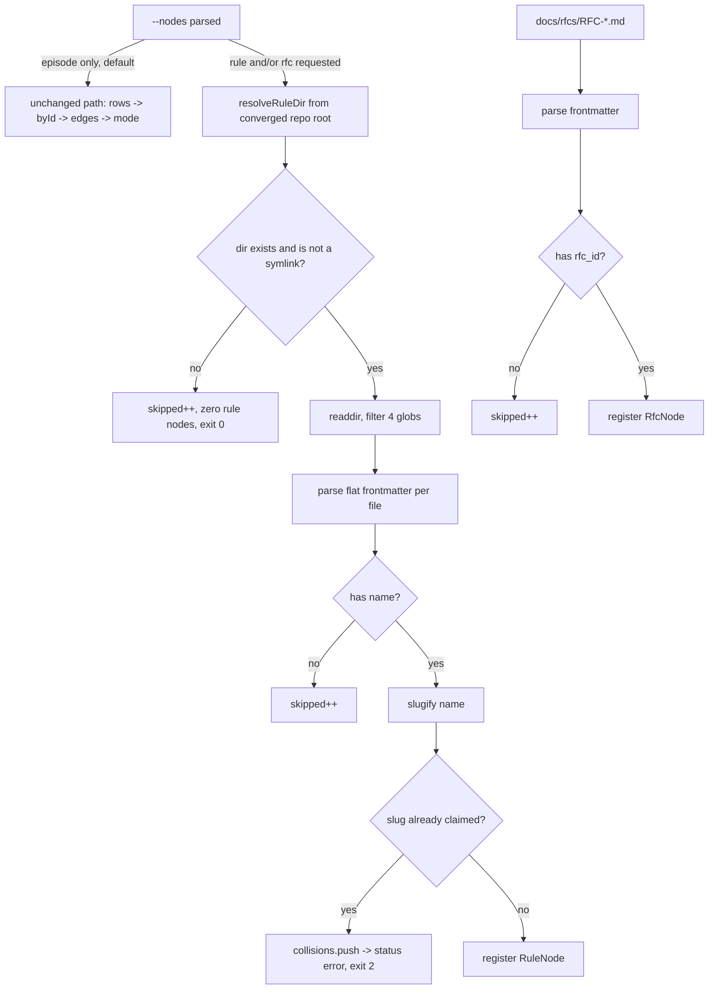

# RFC-007-P2 — `rule` + `rfc` node projection Plan

## §1 Status

`Planning only.` Do not implement until this plan and its adversarial review are accepted (Rule 18). Current stage: **review complete (round 4 ACCEPT-WITH-MODIFICATION, modifications applied) — awaiting operator approval to implement**.

**Review history.**

- **Round 1 — HOLD** (1 BLOCKER, 7 MAJOR, 3 MINOR, 4 NIT). All folded. The BLOCKER was that #588's unconditional "write the no-name policy into the RFC in the same PR" had been deferred to a follow-up; it is now REQ-17 + step S5.2.
- **Round 2 — HOLD** (2 MAJOR, 3 MINOR, 3 NIT). Freezing the verbatim code exposed the finding a prose plan would have shipped: **R2-1, the `--nodes` flag was a no-op.** `nodeOut` is reached only from `--orphans`/`--hubs` (which iterate `rows`, the episode index) and the traversal `visited` set (built from episode `adjacency`); rule/RFC ids were in neither, so the S3.4 branches were dead code, `skippedNodes` was computed and discarded, and the flag's only observable effect was the collision exit-2 path. **R2-2** compounded it: the test step was prose, so tests could have been written to unit-inspect `scanRuleNodes` and stay green over a dead feature.
- **Round 3 — HOLD** (1 BLOCKER, 1 MAJOR, 4 MINOR, 1 NIT), with the round-2 defects confirmed genuinely fixed: the reviewer states it could not make the suite green over a stubbed or unwired `--nodes`. Dispositions: **ACCEPT** the slugify NFC row (a `café` → `cafe` expectation would have forced a spec-violating diacritic-folding slugify — fixed, both NFC rows now expect `caf`); **ACCEPT** the S2 verify contradiction (the suite is half-red by design until S3/S6, so S2's verify is now `node --check` and §10 carries an explicit green-gate schedule); **ACCEPT** `em-graph.mjs` is 285 lines not 286; **ACCEPT** the `--hubs` diagnostic skew (§12 now states hubs emits none); **ACCEPT** the §4/§14 test-name remap; **ACCEPT** the vacuous `assert.equal(x, x)` line. **REJECT, with artifact:** the claim that the `tests.yml` anchor is at 403-404 — `grep -n "Run em-graph suite" .github/workflows/tests.yml` returns `401`, and `Run em-routines suite` returns `398`, so `:401` was correct as written.
- **Round 4 — ACCEPT-WITH-MODIFICATION.** The reviewer withdrew its round-3 `tests.yml` finding after re-running the grep, confirming `:401`. It independently re-verified that every S3 anchor is still verbatim-present, that the S2 suite actually runs (import paths resolve; `resolveRepoRoot()` falls back to cwd in a non-git tmpdir so fixtures land where the CLI looks), that `test-ci-suite-registration.mjs` would detect the new S4 step without a `KNOWN_UNWIRED` entry, and that **the suite cannot be made green over an unwired `--nodes`**. Four residual labeling findings (3 MINOR, 1 NIT), none STOP-blocking, all now applied: the redundant §12 diagnostics paragraph that still listed `--hubs` is deleted in favour of the table; REQ-4 cites real test names; the stale `t_rfc_id_format_rejected` and duplicate `t_single_rule_node_corpus` catalog rows are removed.
- **Round-2 fixes now in place:** new steps **S3.5** (append rule/rfc nodes to `--orphans` output), **S3.6** (documented no-change for `--hubs`, since `:223` requires `d > 0`), **S3.7** (`--from <rule-id>` resolves to a single node instead of exit 1), **S3.8** (thread `skipped_nodes` into the traversal response); full verbatim 28-case `tests/test-em-graph-nodes.mjs` written into S2 with every behavioral assertion against captured CLI output, including `t_orphans_surfaces_rule_nodes`. Minors folded: `lstat` guard added to `scanRfcNodes` (R2-3); `entry_point` now `/^true$/i` so YAML `True` cannot silently read false (R2-4); the rule-vs-RFC duplicate asymmetry is stated with its rationale and covered by EC16 (R2-5); the `local-dir.mjs` import is widened rather than duplicated (R2-6); `resolveRepoRoot()` is hoisted to one `REPO_ROOT` const (R2-7); §12 now states plainly that `'episode'` is an accepted-and-ignored marker (R2-8).

| Field | Value |
|---|---|
| RFC | `RFC-007` (`docs/rfcs/RFC-007-graph-projection.md`, `status: accepted`) |
| Parent requirements | Phase 2 row `:359`; node rows `:52-53`; node detail `:61`, `:63`; frontmatter convention `:244-254`; OQ-1 `:543`; sequencing `:376` |
| Issue | #588 |
| Workplan episode | `20260725-044413-workplan-v260-rfc-007-b-shipped-six-issu-5fea` |
| Target branch | `feat/rfc-007-p2-rule-rfc-nodes` |
| Executor altitude (§0.1) | **low** — pi/MiniMax-M3 builder seat, fresh context. Appendix A is the build path and is mandatory. |

## §2 Episode Search Summary

```bash
node scripts/em-search.mjs --tag workplan --category decision --limit 1 --scope all --full --no-score --no-track
```

- `20260725-044413-workplan-v260-…-5fea` — workplan v260, queue head #588. Constrains: this is the first RFC-007 implementation phase; no unbuilt scope may be deleted.
- `20260725-044450-handoff-85-…-9ace` — handoff 85. Constrains: five RFC-007 self-contradictions are open; this plan must not silently resolve any of them.

Verified live, not from memory: `node scripts/em-rfc-validate.mjs` exits 0 with "14 RFCs in _index.json, 14 canonical files, 14 README table rows"; `node tests/test-em-graph.mjs` prints `10 passed, 0 failed`.

## §3 Objective

`scripts/em-graph.mjs` gains two node types beyond `episode` and `tag`: `rule`, projected from Claude-Code memory files (`feedback_*.md`, `reference_*.md`, `MEMORY.md`, `MEMORY_*.md`) keyed by `slugify(frontmatter.name)`, and `rfc`, projected from `docs/rfcs/RFC-*.md` keyed by frontmatter `rfc_id`. Both carry an `entry_point` boolean read from frontmatter. Both are **opt-in** behind a new `--nodes` flag so every existing query returns byte-identical output. Provable by: a new CI-wired suite `tests/test-em-graph-nodes.mjs`, and `node tests/test-em-graph.mjs` still printing `10 passed, 0 failed` unchanged.

## §4 Requirements (Ground Truth)

| ID | Requirement (concrete, testable) | Parent R | Test(s) | Priority | Notes / edge cases |
|---|---|---|---|---|---|
| REQ-1 | A rule file with frontmatter `name:` projects exactly one node with `type: "rule"` and `id === slugify(name)` | `:61`, `:52` | `t_single_rule_node_corpus`, `t_orphans_surfaces_rule_nodes` (CLI) | MUST | Filename is never the slug source (`:133`) |
| REQ-2 | An RFC file with frontmatter `rfc_id:` projects exactly one node with `type: "rfc"` and `id === rfc_id` | `:63`, `:53` | `t_rfc_node_id_and_skips`, `t_rfc_nodes_surface_via_cli` (CLI) | MUST | |
| REQ-3 | `RFC-*.md` files WITHOUT `rfc_id:` are skipped, not projected | `:63` | `t_rfc_node_id_and_skips` | MUST | Live corpus has 2: `RFC-001-review.md`, `RFC-002-phase1-plan.md`. Matches `em-rfc-validate.mjs:99-100` |
| REQ-4 | Rule files WITHOUT frontmatter `name:` are skipped and counted in a `skipped` diagnostic; the run does not error | `:133` (silent) | `t_rule_no_name_skipped`, `t_orphans_surfaces_rule_nodes` (asserts `skipped_nodes` reaches the CLI response) | MUST | Live corpus has 7, all `MEMORY*`. See §17 D1 |
| REQ-5 | Two rule files whose `name:` values slugify identically produce `status: "error"` and exit code 2 | `:133`, `:571` | `t_default_mode_does_not_scan` (its second assertion is exactly this) | MUST | Query-time JSON error, never a gate/block (`CAPABILITIES.md:168-169`) |
| REQ-6 | `slugify()` implements exactly NFC → trim → lower → `[^a-z0-9]+`→`-` → collapse → strip, with **no truncation** | `:124-131`, `:562-572` | `t_slugify_spec_table` | MUST | 4-5 active repo slugifiers truncate at 40 (`em-store.mjs:288`, `em-revise.mjs:426`, `em-consolidate.mjs:833`, `em-review-request.mjs:227`); none normalizes NFC. None is reusable |
| REQ-7 | `entry_point: true` in rule frontmatter sets `entry_point: true` on the node; absence yields `false`; YAML `True` is also honored | `:252` | `t_entry_point_true_default_false_and_case` | MUST | Case-insensitive per R2-4 — `=== 'true'` would silently read `True` as false |
| REQ-8 | Without `--nodes`, output is byte-identical to pre-change for `--from`, `--orphans`, `--hubs` | issue #588 gate decision | `t_default_output_unchanged`, `manual: node tests/test-em-graph.mjs` | MUST | The regression guard. See §17 D2 |
| REQ-9 | `--nodes rule,rfc` (and `--nodes all`) project the new types **into output**; an unknown value exits 2 | mirrors `:81-82` `--edges` | `t_orphans_surfaces_rule_nodes`, `t_rfc_nodes_surface_via_cli`, `t_nodes_unknown_exit_2` | MUST | "Project" means visible in `nodes[]`, not merely present in an internal Map — the round-2 R2-1 defect |
| REQ-10 | The rule-corpus directory resolves from the **converged repo root**, identically across linked worktrees | not in RFC | `t_rule_dir_worktree_converged` | MUST | See §17 D3; `scripts/lib/local-dir.mjs:9-24` is the convergence precedent |
| REQ-11 | A missing rule-corpus directory yields zero rule nodes and exit 0, never an error | `PRINCIPLES.md:112` | `t_missing_rule_dir_graceful` | MUST | Non-Claude-Code installs must not break |
| REQ-12 | `nodeOut` emits `type: "rule"`/`"rfc"` and does NOT decorate them with episode-only fields | `:225` | `t_node_shape_no_episode_fields` | MUST | Scout risk #3 |
| REQ-13 | New suite `tests/test-em-graph-nodes.mjs` is wired into `.github/workflows/tests.yml` | `tests/test-ci-suite-registration.mjs:3-31` | `node tests/test-ci-suite-registration.mjs` (already CI-wired and automated; not a manual smoke) | MUST | Unwired suite fails the registration lint |
| REQ-14 | `em-graph.mjs` writes no file | `patterns/readonly-commands.json:25-28` | `t_no_writes` | MUST | Its readonly whitelisting must stay true |
| REQ-15 | RFC-007 node table `:52-53` and Phase 2 row `:359` flip to SHIPPED with `em-graph.mjs:<line>` anchors; ledger row added with `git log --follow` provenance | `:419-423` | `t_rfc_rows_flipped` (automated: asserts the node rows no longer contain `UNBUILT — next phase` and that the ledger row's SHA appears in `git log --follow -- scripts/em-graph.mjs`) | MUST | **`em-rfc-validate.mjs` does NOT prove this** — it checks only id/title/status/champion/file agreement and never reads the Phases table or the ledger. A manual smoke of it would be a hollow green |
| REQ-16 | `docs/EM_SCRIPTS_GUIDE.md` states rule nodes populate only where a Claude-Code memory directory exists | `PRINCIPLES.md:65-67` | `t_guide_states_claude_code_scope` (automated `grep -q` assertion inside the new suite) | MUST | Principle 5 honesty |
| REQ-17 | The no-`name:` → skip+count policy is written into RFC-007 **in this PR**, appended to the rule-node detail at `:61` | issue #588 "Unspecified in the RFC" | `t_rfc_states_no_name_policy` (automated: asserts the RFC text contains the policy sentence) | MUST | #588 makes this unconditional: "Whichever policy is chosen must be written into the RFC in the same PR." Not deferrable to a follow-up |
| REQ-18 | Default mode (no `--nodes`) does not read the rule corpus at all | §8.2 opt-in invariant | `t_default_mode_does_not_scan` | MUST | Discriminating probe, see §14. Without this the opt-in safety property is unguarded |
| REQ-19 | `scanRfcNodes` skips any `rfc_id` failing `/^RFC-(\d{3})$/` | mirrors `em-rfc-validate.mjs:72` | `t_rfc_node_id_and_skips` (third fixture asserts it) | SHOULD | Keeps the two RFC readers on one id grammar |
| REQ-20 | `--from <rule-id>` returns that node at depth 0 with `edges: []`; an id in neither registry still exits 1 | `:280` surface, R2-1 | `t_from_rule_id_returns_single_node`, `t_from_unknown_id_still_exits_1` | MUST | Without this the `nodeOut` rule branch is reachable from one site only |
| REQ-21 | `--hubs` never surfaces a degree-0 rule/rfc node | `em-graph.mjs:223` | `t_hubs_excludes_degree_zero_rule_nodes` | MUST | Self-resolves once Phase 3 adds edges |

## §5 Non-Goals

- Any edge to or from a `rule`/`rfc` node. `wiki-link` and `composes-with` are Phase 3 (#589); `trigger-phrase` is Phase 5 (#591). This slice ships **isolated nodes only**.
- `--graph-health`, `dangling[]`, `nodes_with_no_edges[]`, `entry_points[]` — Phase 4 (#590). This slice only *reads* `entry_point`; it emits no audit array.
- Extending `ID_RE` (`em-graph.mjs:155`) so episode bodies can cite rule slugs. Out of scope; belongs with Phase 3/5 edges.
- Resolving any of the five RFC-007 self-contradictions. They are #585's PR.
- Changing `scripts/em-console.mjs:169`'s episode-id-shaped `--from` validation. Filed as a follow-up, not fixed here (§17 D4).
- Any persisted cache of the rule/RFC scan.

## §6 Token Budget (Rule 12)

| File | `wc -l` | Reads (lines × ~5) | Writes | Notes |
|---|---|---|---|---|
| `scripts/em-graph.mjs` | 285 | ~1.4k | ~1.2k | The only edited script |
| `scripts/lib/rule-nodes.mjs` | 0 (new) | 0 | ~1.0k | New module |
| `tests/test-em-graph-nodes.mjs` | 0 (new) | 0 | ~1.6k | New suite |
| `tests/test-em-graph.mjs` | 170 | ~0.9k | 0 | Read-only reference |
| `.github/workflows/tests.yml` | 505 | ~0.3k (targeted) | ~0.05k | One step added |
| `docs/rfcs/RFC-007-graph-projection.md` | 712 | ~1.2k (targeted) | ~0.3k | Table rows + ledger |
| `docs/EM_SCRIPTS_GUIDE.md` | — | ~0.3k (targeted) | ~0.1k | Honesty caveat |

**Baseline (single session):** ~8.4k tokens. **Optimized:** ~8.4k; the slice is small enough for one session. Well under the 130k autocompact risk line.

## §7 Safety / Security

This slice adds a **new file-read surface outside the episode store**, which is a new data flow, so this section applies.

| Concern | Severity | Attack/abuse scenario | Mitigation | Test(s) (incl. ≥1 negative) |
|---|---|---|---|---|
| Path traversal via crafted `name:` | Med | A rule file's `name:` is `../../etc/passwd`; slug is used to build a path | Slugs are **never** used to construct a path. `slugify()` output `[a-z0-9-]` only; files are enumerated by `readdir`, never by slug lookup | `t_slugify_strips_path_chars`, `negative: t_name_with_dotdot_yields_safe_slug` |
| Symlinked rule directory redirects reads | Med | `~/.claude/projects/<slug>/memory` is a symlink to another user's tree | `lstat` the resolved directory before `readdir`; if it is a symlink, skip and count as skipped | `t_symlinked_rule_dir_skipped` (negative control: the guard goes RED when the lstat check is removed) |
| Unbounded read of a huge directory | Low | A memory directory with 100k files stalls every query | Only the four globs are read (`feedback_*`, `reference_*`, `MEMORY.md`, `MEMORY_*`). Note the per-file read is **whole-file** `readFileSync` followed by a frontmatter regex — it does not stream-stop at the closing `---`; the regex merely ignores content past it. Accepted because the corpus is user-owned and small (132 files, largest well under 100 KB). No size cap is added | `t_only_globbed_files_read` |
| Malformed frontmatter crashes the query | Med | A rule file has an unterminated `---` block | Parser returns `{}` on no-match; the file is skipped and counted, never thrown | `t_malformed_frontmatter_skipped` |
| Prototype pollution via `name:` | Med | `name: __proto__` or `constructor` becomes a Map key | Node registry is a `Map`, never a plain object — the same fix class as `#469` already covered by `tests/test-em-graph.mjs` case 8 | `t_proto_key_rule_name` |

**8-axis symlink matrix.** This plan resolves a directory path (`resolveRuleDir`), so the matrix is pre-enumerated: (1) plain dir — read; (2) dir is a symlink — **skip + count** (mitigation above); (3) a *file inside* is a symlink — read it, it cannot redirect authority because nothing is executed and no path is derived from content; (4) repo root itself symlinked — `resolveRuleDir` derives from the already-realpath'd converged root, so both sides are canonical; (5) missing dir — REQ-11 graceful zero; (6) dir exists but unreadable (EACCES) — skip + count, never throw; (7) `/var`→`/private/var` on macOS — the converged root comes from `resolveLocalDir()` which already realpaths, so shell `$PWD` vs Node realpath cannot diverge; (8) `.git/` carve-out — not applicable, no repo-source write detector here.

`negative-scenario-planner` dispatch: this slice is a **parser + new read surface**, which matches the planner's schema/validator trigger. Dispatched as part of the review round in §19 rather than pre-plan, because the adversarial reviewer seat covers the same matrix and this slice writes nothing.

## §8 Design

### 8.1 Key types

```js
/**
 * @typedef {Object} RuleNode
 * @property {string} id — slugify(frontmatter.name); [a-z0-9-]+ only
 * @property {'rule'} type
 * @property {boolean} entry_point — frontmatter entry_point === true, else false
 * @property {string} file — absolute path, for diagnostics only, never re-derived into a read
 */

/**
 * @typedef {Object} RfcNode
 * @property {string} id — frontmatter rfc_id verbatim, e.g. "RFC-007"
 * @property {'rfc'} type
 * @property {boolean} entry_point
 * @property {string} file
 */

/**
 * @typedef {Object} NodeScanResult
 * @property {Map<string, RuleNode>} ruleById — Map, never a plain object (prototype safety)
 * @property {Map<string, RfcNode>}  rfcById  — separate map; no cross-type key space
 * @property {number} skipped — files matched by glob but not projected
 * @property {string[]} collisions — slugs produced by more than one RULE file; non-empty => exit 2
 */
```

### 8.2 Key invariants

- **Separate registries, one per type.** Rule nodes and RFC nodes live in **two** `Map`s (`ruleById`, `rfcById`), neither merged into `byId` (the episode index map). Merging into `byId` would decorate them with episode-only fields via `nodeOut` (`em-graph.mjs:192-203`) and silently flood `--orphans` (`em-graph.mjs:220` iterates `rows`). Keeping rule and RFC separate from **each other** removes the cross-type collision question entirely (m1): a rule slug is `[a-z0-9-]+` and an `rfc_id` is `RFC-\d{3}` so they are case-distinct today, but relying on that is an unstated invariant. Two maps make it structural instead.
- **Opt-in.** With no `--nodes` flag, `scanRuleNodes`/`scanRfcNodes` are **never called**. Zero cost, zero behavior change.
- **No writes.** `em-graph.mjs` remains write-free (REQ-14).
- **Cross-platform:** all paths via `node:path`; the rule directory is built with `path.join`, never string concatenation with `/`; tests use `os.tmpdir()`; no GNU-only flags, no `sed -i`, no `readlink -f`.
- **Atomicity:** not applicable — nothing is written.

### 8.3 Resolution / flow



**Rule-directory resolution (REQ-10).** Claude Code names a project directory by replacing every `/` in the absolute project path with `-`. Verified live: `/Users/charltondho/Developer/projects/episodic-memory` ⇒ `~/.claude/projects/-Users-charltondho-Developer-projects-episodic-memory/memory/`.

The reused primitive is **`resolveRepoRoot(cwd)`**, exported at `scripts/lib/local-dir.mjs:43-67`. It is the function that walks to the main repo root via `git rev-parse --git-common-dir` so a linked worktree converges on the same root as the main checkout. Do **not** use `resolveLocalDir()` — that is `path.join(resolveRepoRoot(cwd), '.episodic-memory')` (`local-dir.mjs:69-71`) and returns the store directory, not the root you must slugify. Stripping `.episodic-memory` back off it is forbidden.

```js
export function resolveRuleDir(cwd = process.cwd()) {
  const root = resolveRepoRoot(cwd)                    // local-dir.mjs:43
  const slug = root.split(path.sep).join('-')          // '/a/b' -> '-a-b'
  return path.join(os.homedir(), '.claude', 'projects', slug, 'memory')
}
```

Deriving from `process.cwd()` instead would give each worktree a different (usually empty) rule set — scout risk #1.

**Documented fragility (n4).** The `/` → `-` mapping is a Claude Code convention observed live, not a contract Claude Code publishes. If that naming ever changes, `resolveRuleDir` silently returns a non-existent path and rule nodes go to zero without an error (REQ-11 swallows the missing dir by design). This is an accepted residual: the failure is a silent empty set, not corruption, and REQ-11's graceful-zero behavior is what a non-Claude-Code install needs anyway. Recorded here so it is a known limitation rather than a surprise.

## §9 Existing Hook Points

| Hook point | File:line | How this slice uses it |
|---|---|---|
| `nodeOut` type dispatch | `em-graph.mjs:189-204` | Extend the `tag:`-prefix if/else with rule/rfc branches keyed off the new registry |
| `EDGE_TYPES` / `DEFAULT_EDGES` opt-in pattern | `em-graph.mjs:81-92` | Copied verbatim in shape for `NODE_TYPES` / `DEFAULT_NODES` |
| `intFlag` / `flag` arg helpers | `em-graph.mjs:52-70` | Reused unchanged for `--nodes` |
| Flat frontmatter parser shape | `em-rfc-validate.mjs:73-91` | Copied as the basis for the new parser (rule files need only top-level `name` and `entry_point`; the nested `metadata:` block is not needed by this phase) |
| Converged repo root | `scripts/lib/local-dir.mjs:43-67` (`resolveRepoRoot`) | `resolveRuleDir` slugifies this function's return value. NOT `resolveLocalDir` (`:69-71`), which appends `.episodic-memory` |
| RFC id grammar | `scripts/em-rfc-validate.mjs:72` (`RFC_ID_RE = /^RFC-(\d{3})$/`), applied `:100` | Mirrored by `scanRfcNodes` (REQ-19) so both RFC readers share one grammar |
| Fixture-store test harness | `tests/test-em-graph.mjs:30-43` | Copied verbatim: two `mkdtempSync` dirs, `HOME` override, `spawnSync` + JSON parse |

## §10 Slice Ladder

| Slice | Deliverable | Files | Gate |
|---|---|---|---|
| S1 | `scripts/lib/rule-nodes.mjs` — `slugify`, `parseFlatFrontmatter`, `resolveRuleDir`, `scanRuleNodes`, `scanRfcNodes` | 1 new | `node --check scripts/lib/rule-nodes.mjs` |
| S2 | `tests/test-em-graph-nodes.mjs` — full 28-case verbatim suite | 1 new | `node --check tests/test-em-graph-nodes.mjs` (syntax only — the suite is **half red by design** until S3 wires the CLI and S6 lands the docs) |
| S3 | `em-graph.mjs` — `--nodes` flag, registry wiring, `nodeOut` branches, **and the S3.5-S3.8 emission steps** | 1 edit | `tests/test-em-graph.mjs` still 10/10 AND every new-suite case green except the three doc-asserting ones |
| S4 | CI wiring | `.github/workflows/tests.yml` | `node tests/test-ci-suite-registration.mjs` green |
| S5 | RFC edits: flip node rows `:52-53` + Phase 2 row `:359`, add ledger row, mark OQ-1 RESOLVED, **and append the no-`name:` skip policy to the rule-node detail at `:61` (REQ-17)** | `docs/rfcs/RFC-007-graph-projection.md` | `node scripts/em-rfc-validate.mjs` exit 0 AND `t_rfc_states_no_name_policy` green |
| S6 | Guide honesty caveat (REQ-16) | `docs/EM_SCRIPTS_GUIDE.md` | `node tests/test-em-graph-nodes.mjs` → `28 passed, 0 failed`. This is the first step at which full green is reachable |

## §11 Cut Order

If the slice must shrink: cut S5 docs last (they are REQ-15/16 MUSTs, so cutting means not merging). Cut nothing else — S1-S4 are indivisible; shipping the flag without the tests or without CI wiring is the exact failure class `tests/test-ci-suite-registration.mjs` exists to prevent.

## §12 Contracts

**`--nodes` flag.** Mirrors `--edges` exactly:

```
NODE_TYPES    = ['episode', 'rule', 'rfc']
DEFAULT_NODES = ['episode']
--nodes all      -> NODE_TYPES
--nodes rule,rfc -> ['rule','rfc']
(absent)         -> DEFAULT_NODES
unknown value    -> {"status":"error","message":"Unknown node type \"X\". Valid: episode, rule, rfc (or \"all\")."} exit 2
```

**`episode` is always projected (R2-8).** The episode graph is built from `rows` unconditionally; `nodeTypes` gates only the rule and RFC scans. So `'episode'` in `NODE_TYPES` is an accepted-and-ignored marker that keeps `--nodes all` meaningful and `--nodes episode` from erroring. Listing it has no effect and omitting it does not remove episodes. Stated explicitly because the flag's shape otherwise implies a symmetry it does not have.

**Where the new nodes actually surface.** This is the part that makes the flag observable rather than internal:

| Mode | Behavior with `--nodes rule,rfc` |
|---|---|
| `--orphans` | Rule/RFC nodes are appended to `nodes[]`. Phase 2 gives them no edges, so all are degree 0 and are orphans by the mode's own definition |
| `--hubs` | **Unchanged.** The hub filter at `em-graph.mjs:223` requires `d > 0`; degree-0 nodes are correctly excluded. They begin appearing automatically once Phase 3 (#589) supplies edges |
| `--from <rule-id>` | Resolves to that single node at depth 0 with `edges: []`, instead of the `not found` exit 1 it would otherwise hit |
| diagnostics | `skipped_nodes: <n>` appears in the `--orphans` and `--from` responses, and **only** when `--nodes` was passed — preserving REQ-8 byte-identity in default mode. `--hubs` emits **no** diagnostic, consistent with S3.6 leaving that mode untouched |

**Node output shape.** Rule/RFC nodes carry `id`, `type`, `distance`, `entry_point`, `file`. They carry **none** of `summary`, `category`, `project`, `status`, `date`, `source`, `pinned` (REQ-12).

(The diagnostics contract is the table row above; it is not restated here, to avoid the two drifting.)

## §13 Edge Cases

| # | Case | Expected |
|---|---|---|
| EC1 | Rule dir does not exist | 0 rule nodes, exit 0 (REQ-11) |
| EC2 | Rule dir is a symlink | skipped, exit 0 (§7) |
| EC3 | Rule file has no frontmatter at all (7 live: all `MEMORY*`) | skipped, counted (REQ-4) |
| EC4 | Rule file has frontmatter but no `name:` | skipped, counted (0 live, fixture-only) |
| EC5 | `name:` is empty string or whitespace-only | slug is empty ⇒ treat as no-name, skip + count. Never register an empty-string id (lesson `…7c11`, empty identity compares equal to itself) |
| EC6 | `name:` is 118 chars (longest live value) | full untruncated slug; no `.slice()` anywhere (REQ-6) |
| EC7 | Two files slugify identically | exit 2 (REQ-5). Live corpus: 0 collisions across 125 names, verified |
| EC8 | `name: __proto__` / `constructor` | registers safely in a `Map` (§7) |
| EC9 | `RFC-*.md` without `rfc_id` (2 live) | skipped (REQ-3) |
| EC10 | `docs/rfcs/` missing (running outside the repo) | 0 rfc nodes, exit 0 |
| EC11 | `--nodes rule` combined with `--from <episode-id>` | traversal root stays the episode; rule nodes are unreachable from it (no edges until Phase 3). Documented, not a bug |
| EC12 | `--nodes rule` with `--orphans` | rule nodes appear with degree 0 — the *requested* behavior when opted in, and the reason the default excludes them |
| EC13 | `--nodes rule` with `--hubs` | rule nodes do NOT appear; `em-graph.mjs:223` requires `d > 0`. Correct, and self-resolving once Phase 3 adds edges |
| EC14 | `--from <rule-slug>` with `--nodes rule` | single node at depth 0, `edges: []`, exit 0 |
| EC15 | `--from <rule-slug>` WITHOUT `--nodes rule` | exit 1 `not found` — the registry is empty because the scan never ran. Consistent with the opt-in contract |
| EC16 | Duplicate `rfc_id` across two RFC files | skipped + counted, not exit 2. Deliberate asymmetry with the rule-slug collision: `em-rfc-validate.mjs` already fails CI on `duplicate-id-across-files`, so that condition has an owner and the graph query degrades rather than breaking |
| EC17 | `docs/rfcs/` is a symlink | skipped + counted, same guard as the rule dir |

## §14 Test Case Catalog

New suite `tests/test-em-graph-nodes.mjs`, 28 cases, harness copied from `tests/test-em-graph.mjs:30-43`. **The authoritative list is the verbatim file in `RFC-007-P2-appendix-steps.md` step S2**; the table below is descriptive and its names match that file exactly. Where a row below names a behavior rather than a test, the covering test is named in the right-hand column.

| Test | Proves | Falsifiable because |
|---|---|---|
| `t_slugify_spec_table` | REQ-6 | Table of 12 (input, expected) pairs incl. NFC composed/decomposed é, 118-char input, leading/trailing punctuation. A truncating or non-NFC impl fails ≥3 rows |
| `t_slugify_strips_path_chars` | §7 | `../../etc/passwd` ⇒ `etc-passwd`; asserts no `.` and no `/` in output |
| `t_single_rule_node_corpus` | REQ-1 | Fixture `feedback_only.md` with `name: only one` ⇒ id `only-one`, NOT `feedback_only` |
| `t_rule_no_name_skipped` | REQ-4 | A `MEMORY.md` with no frontmatter plus a whitespace-only `name:` ⇒ both absent from nodes AND `skipped === 2` |
| `t_entry_point_true_default_false_and_case` | REQ-7 | Three fixtures: `entry_point: true`, key absent, and `entry_point: True` |
| `t_rfc_node_id_and_skips` | REQ-2, REQ-3, REQ-19 | Three fixtures in one: valid `RFC-099`, one with no `rfc_id`, one with malformed `RFC-97` ⇒ one node, `skipped === 2` |
| `t_default_output_unchanged` | REQ-8 | Captures full JSON of `--orphans` before and after adding rule fixtures **without** `--nodes`; asserts deep equality |
| `t_orphans_surfaces_rule_nodes` | REQ-9, REQ-1 | **The R2-1 integration test.** Spawns the CLI with `--orphans --nodes rule` and asserts a `type: "rule"` node with the right id and `entry_point` appears in `nodes[]`, and that `skipped_nodes` is a number. Fails against any implementation where the registry is populated but never emitted |
| `t_rfc_nodes_surface_via_cli` | REQ-2, REQ-9 | Same, for `--nodes rfc` |
| `t_from_rule_id_returns_single_node` / `t_from_unknown_id_still_exits_1` | REQ-20 | Traversal root resolution for a rule slug; unknown id still exits 1 |
| `t_hubs_excludes_degree_zero_rule_nodes` | REQ-21 | `--hubs --nodes rule` must NOT list a degree-0 rule node |
| `t_nodes_unknown_exit_2` | REQ-9 | `--nodes bogus` ⇒ exit 2, message names the bad value |
| `t_parse_flat_frontmatter_null_proto` | §7 | Parsed frontmatter object has a null prototype |
| `t_slugify_no_truncation` | REQ-6 | 60+60 char input ⇒ exact 121-char slug. Every existing repo slugifier truncates and fails this |
| `t_node_shape_no_episode_fields` | REQ-12 | Asserts `!('summary' in node)` and `!('category' in node)` |
| `t_rule_dir_worktree_converged` | REQ-10 | Builds a real git repo in `os.tmpdir()`, adds a linked worktree via `git worktree add`, places a **uniquely-named sentinel rule fixture** at the dir derived from the MAIN root, then runs from both the main checkout and the worktree. Asserts both id sets **contain the sentinel** and are equal. Asserting only "identical sets" would pass vacuously when both are `[]` — which is exactly what a stub that never resolves the dir returns (§A.9 discriminating sentinel, EC5 empty-identity) |
| `t_missing_rule_dir_graceful` | REQ-11 | Isolated `HOME` with no `.claude/` ⇒ exit 0, zero rule nodes. `resolveRuleDir` builds `<HOME>/.claude/projects/<slug>/memory`, so overriding `HOME` to an empty tmpdir does make the path absent |
| `t_default_mode_does_not_scan` | REQ-18 | **The opt-in probe.** Places TWO colliding rule fixtures (`name: A B` and `name: a-b`) at the resolved path, then runs `--orphans` with no `--nodes`. Asserts exit **0**. A builder who runs the scan unconditionally gets exit 2 (REQ-5) and this test goes RED. The same fixtures with `--nodes rule` must exit 2, proving the probe is live and not merely absent. This uses existing specified behavior as the sentinel, so no test-only seam is added to production code |
| `t_rule_dir_present_but_empty` | REQ-11, #588 test 6 | Rule dir exists, contains zero globbed files ⇒ 0 rule nodes, exit 0. Distinct from missing-dir |
| `t_guide_states_claude_code_scope` | REQ-16 | Automated `grep`-equivalent assertion that `docs/EM_SCRIPTS_GUIDE.md` contains the Claude-Code-scope sentence. Not a manual smoke |
| `t_rfc_states_no_name_policy` | REQ-17 | Automated assertion that `RFC-007-graph-projection.md` contains the no-`name:` skip policy sentence |
| `t_rfc_rows_flipped` | REQ-15 | Asserts the node rows at `:52-53` no longer contain `UNBUILT — next phase`, and that the SHA in the new ledger row appears in `git log --follow -- scripts/em-graph.mjs` output |
| `t_symlinked_rule_dir_skipped` | §7 | Negative control: symlink the dir, assert skip; the test also asserts the guard is reachable by asserting `skipped >= 1` |
| `t_malformed_frontmatter_skipped` | §7 | Unterminated `---` |
| `t_proto_key_rule_name` | §7, `#469` class | `name: constructor` |
| `t_only_globbed_files_read` | §7 | A `notes.txt` and a `random.md` in the dir are not projected |
| `t_no_writes` | REQ-14 | Snapshot `readdir` of cwd + HOME before/after; assert identical |

## §15 Verification Ledger (verify by artifact)

| Claim | Command | Expected observed output |
|---|---|---|
| New suite passes | `node tests/test-em-graph-nodes.mjs` | `N passed, 0 failed`, exit 0 |
| No regression | `node tests/test-em-graph.mjs` | `10 passed, 0 failed`, exit 0 |
| Suite is CI-wired | `node tests/test-ci-suite-registration.mjs` | passes; new file not in `KNOWN_UNWIRED` |
| RFC coherence intact | `node scripts/em-rfc-validate.mjs` | `✓ RFC registry consistent: 14 …`, exit 0 |
| Write-free | `grep -n "writeFileSync\|renameSync\|mkdirSync" scripts/em-graph.mjs` | no output |
| Ledger provenance | `git log --oneline --follow -- scripts/em-graph.mjs` | the real merge SHA, never copied from an adjacent RFC row |
| CI green | `gh pr checks <PR>` | all green — never claimed from a local run |

## §16 Risk Analysis

| Risk | Likelihood × blast | Mitigation |
|---|---|---|
| `--orphans` floods with degree-0 rule nodes | certain × medium | REQ-8 opt-in default; `t_default_output_unchanged` |
| `nodeOut` mislabels rule nodes as `episode` | med-high × med | Separate registry (§8.2) + REQ-12 |
| Worktree slug divergence | high × med-high | REQ-10 converged resolution |
| Slug collision breaks the query for everyone | low × high | 0 collisions across the 125 live names, verified; REQ-5 makes it a clean exit-2, not a crash |
| `em-console.mjs:169` rejects rule slugs on `--from` | certain × low | Out of scope, filed (§17 D4) — rule nodes have no edges this phase, so `--from <rule>` has no use yet |

## §17 Open Decisions

All four are **RESOLVED in this plan**. They are recorded because the RFC does not decide them, so a reviewer must be able to challenge the choice rather than discover it in the diff.

**D1 — rule files with no frontmatter `name:` are SKIPPED (not filename-slugged), and that policy is written into the RFC in this PR (REQ-17).** RFC `:133` is explicit: "Filename-derived slugs are NOT used". Seven live files hit this, all `MEMORY*`, including `MEMORY.md` — which RFC `:233` names as **one of** the canonical entry-point roots ("canonical roots (`MEMORY.md`, top-level index files) are entry points by design, not orphans"), in the DEFERRED Phase 6 orphan-allowlist section rather than in Phase 2. So a file the RFC calls a canonical root cannot be projected under the RFC's own slug rule. Resolution: obey the RFC in code (skip + count), and write the policy into the RFC text here rather than deferring it — #588 makes that unconditional.

*This plan adopts #588's proposed three-way reconciliation of the `entry_point` contradiction: Phase 2 owns the frontmatter **key definition and parsing** only; `--graph-health` consumption is Phase 4 (#590) and the persisted form is Phase 6 (#592).* Stated explicitly so the adoption is reviewable rather than implied by §5's Non-Goals.

**5-field DEFER for the residual contradiction** (that `MEMORY.md` is a named canonical root yet unprojectable):
1. *Run the scenario:* verified live — 7 of 132 globbed files have no frontmatter at all, `MEMORY.md` among them; under REQ-4 all 7 are skipped.
2. *Spec check:* RFC `:133` requires the skip; no RFC line requires `MEMORY.md` to be projectable in Phase 2. No spec violation in deferring.
3. *History check:* this is a sixth member of the `entry_point` contradiction family already filed as a comment on **#585** (`#issuecomment-5076978531`), which records `entry_point` claiming three phases (`:246`/`:359`, `:304`/`:361`, `:233-234`/`:363`). It is therefore **folded into #585's thread as a comment, not filed as a separate issue** — filing separately would fragment one class across two trackers.
4. *Same-class check:* the sibling `entry_point` contradictions are all deferred to #585 consistently; deferring this one matches. No sibling is left silently unhandled.
5. *Residual risk:* `MEMORY.md` and six `MEMORY_*` files are absent from the rule-node set. Graceful — they are counted in `skipped`, not dropped silently. Recovery is a one-line frontmatter addition to each file, or an RFC amendment permitting a filename fallback. Nothing corrupts.

**D2 — new node types are opt-in behind `--nodes`, default `episode` only.** #588's body flagged this as a decision. The RFC blessed exactly this shape for the noisiest edge type (`tags` sits outside `DEFAULT_EDGES`, `:81-82`). Opt-in gives a zero-regression merge; opt-out would change `--orphans` semantics for every existing caller in the same PR that introduces the nodes.

**D3 — the rule directory resolves from the converged repo root, not `cwd`.** Not in the RFC. Without it, two worktrees of one repo report different rule-node sets while reporting the same episodes, which contradicts the script's own "always current, no sidecar to drift" claim (`em-graph.mjs:29-31`).

**D4 — `em-console.mjs:169` is NOT changed here.** That line is the console's generic **id-kind** validator (`if (!/^[0-9]{8}-[0-9]{6}-[A-Za-z0-9-]{1,200}$/.test(s)) … 'is not an episode id'`, inside the `spec.kind === 'id'` branch); `--from` reaches it via a spec, so it is episode-id-shaped for `--from` in effect. It would reject a rule slug. Since rule nodes have no edges until Phase 3, `--from <rule-slug>` is not yet useful. This surface is genuinely pre-existing (not authored by this slice), so deferring it is a scope call, not a self-exemption. Filed as a follow-up rather than widened speculatively.

## §18 Done Criteria

- Every REQ row's tests green; §15 ledger filled with observed output, not prose.
- `node tests/test-em-graph.mjs` still `10 passed, 0 failed` — the regression proof.
- New suite CI-wired and `tests/test-ci-suite-registration.mjs` green.
- `node scripts/em-rfc-validate.mjs` exit 0.
- RFC node rows `:52-53` and Phase 2 row `:359` flipped with line anchors; ledger row added from `git log --follow`.
- OQ-1 (`:543`) marked RESOLVED.
- REQ-17 satisfied: the no-`name:` policy is IN the RFC in this PR, not deferred.
- **Step 9:** D1's residual contradiction posted as a comment on **#585** (folded into the existing `entry_point` class, per DEFER field 3), carrying all 5 fields. D4 filed as its own issue. Neither may live only in the PR body.
- Deploy leg: `scripts/` changed ⇒ `install.mjs --install-hooks-force` + DEPLOYED-copy grep + smoke + disk-scan consumer sweep, per the three-leg rule.

## §19 Review Consensus (Rule 18)

Plan review by the pi/GLM-5.2 seat on neuralwatt over Herdr before implementation; code review by the same seat on the real diff after. Findings dispositioned ACCEPT / ACCEPT-WITH-MOD / REJECT / DEFER / NEEDS-EVIDENCE with evidence, never reflex.

## §19.1 Pre-build deltas (orchestrator, from scout maps at `9cb9e8b`)

Recorded before builder dispatch. The plan froze its anchor set at `8808dd7`; HEAD is now
`9cb9e8b` (PRs #597 / #598 / #600 merged in between). Deltas are additive; no frozen step is
retracted.

**Δ1 — anchor set re-verified, no repair needed.** Every S3/S4/S5 anchor is still verbatim
present: `em-graph.mjs:39` (`resolveLocalDir` import), `:40` (`loadIndex` import), `:81`
(`EDGE_TYPES`), `:121` (`byId`), `:190` (`tag:` branch in `nodeOut`); `tests.yml:401`
(`Run em-graph suite …`); `RFC-007:52` and `:53` (both `UNBUILT — next phase` node rows).
`wc -l scripts/em-graph.mjs` = 285, confirming the round-3 correction over the original 286.
None of the three intervening PRs touched any file in the writable set.

**Δ2 — NEW STEP REQUIRED: `RFC-007:246` becomes self-refuting.** `:246` reads
"**Status: UNBUILT — next phase.** `entry_point` is not read by any shipped code
(`grep entry_point scripts/` is empty)." That sentence is TRUE today
(`grep -rn entry_point scripts/ tests/ docs/EM_SCRIPTS_GUIDE.md` returns nothing) and becomes
FALSE the moment S1 lands `scripts/lib/rule-nodes.mjs`, which parses the key. The frozen S5 set
(`:52-53`, `:61`, `:359`, ledger + OQ-1) does not touch `:246`, so the plan as reviewed would
ship an RFC whose own stated verification command refutes it. Added as **S5.5**. Full class from
`grep -rn entry_point docs/rfcs/RFC-007-graph-projection.md`: `:233`, `:234`, `:246`, `:252`,
`:304`, `:359`, `:361`, `:363`, `:454` — of these only `:246` becomes false; `:304` / `:361` /
`:363` correctly describe Phase 4 and Phase 6 work that stays unbuilt, and `:233` / `:234` /
`:252` are design text that remains accurate. This is the PR #598 "sweep was too narrow" class:
the fix is the whole class, verified by grep, not the one site that surfaced.

**Δ3 — grounding correction: RFC-007 has NO `R-` numbered requirements.** The document's formal
identifiers are invariants **I1-I6** (`:324-331`) and open questions **OQ-1 to OQ-6**
(`:541-548`); the "R1-R10" tokens at `:453-454` are a pre-acceptance review's own row labels, and
`R-186` (`:484`, `:498`) is a bug-class name. So this plan's `REQ-1 … REQ-21` are plan-local
labels, not RFC anchors, and the reviewer brief must ground findings in **I-numbers and OQ-1**,
not in nonexistent R-numbers. Phase 2's governing spec text is OQ-1 (`:543`, "DEFERRED to Phase
2"), the Phase 2 row (`:359`), and the node rows (`:52-53`). Invariant exposure: I1-I5 are all
DEFERRED to Phase 6 (persisted-`graph.json` fields) and Phase 2 adds no persisted artifact, so it
touches none. I6 (determinism / `--limit` truncation) was checked and is NOT engaged: `--orphans`
at `em-graph.mjs:220` applies neither a sort nor `--limit`, it emits in `rows` order, so S3.5's
append cannot perturb truncation. Determinism of the appended ids holds independently because the
frozen `scanRuleNodes` / `scanRfcNodes` sort their `readdirSync` results
(`RFC-007-P2-appendix-steps.md:122`, `:177`), which also settles the cross-platform readdir-order
axis.

**Δ4 — corpus empirics, and they sharpen D1 from an edge case to the common case.** Observed
today under the four Phase 2 globs at
`~/.claude/projects/-Users-charltondho-Developer-projects-episodic-memory/memory/`: **133 files**
(118 `feedback_*.md`, 6 `reference_*.md`, `MEMORY.md`, 8 `MEMORY_*.md`). The plan's §2 cites 132;
the corpus grew by one, which is drift in a live corpus, not a plan defect. The material finding
is which files lack `name:` —
`grep -L "^name:" …/feedback_*.md …/reference_*.md …/MEMORY.md …/MEMORY_*.md` returns exactly
**8 files, and they are all 9 members of the MEMORY glob minus `MEMORY_workplan_changelog.md`**:
`MEMORY.md`, `MEMORY_alwaystier_incidents.md`, `MEMORY_anchors.md`,
`MEMORY_incidents_2026-07-10.md`, `MEMORY_open_issues.md`, `MEMORY_pr_history.md`,
`MEMORY_seat_ops.md`, `MEMORY_tooling.md`. Every `feedback_*` and `reference_*` file carries
`name:`. Consequence under the adopted D1 / REQ-4 policy (no `name:` ⇒ SKIP): Phase 2 skips
**8 of the 9 MEMORY-glob members**, including `MEMORY.md` itself — the exact file `RFC-007:233`
names as a
canonical entry point ("canonical roots (`MEMORY.md`, top-level index files) are entry points by
design, not orphans"). So the `entry_point` key this phase ships is unreachable for the whole
class it was designed for: those files are skipped before the key is ever read. D1's DEFER stands
as dispositioned (obey `:133`, file the defect, do not deviate mid-slice), but the #585 comment
required by §18 step 9 MUST carry these observed numbers — 8 of the 9 MEMORY-glob members skipped,
`MEMORY.md` among them, the sole survivor being `MEMORY_workplan_changelog.md`
(`name: workplan-version-changelog-v50-v77`, so it projects as that id) — because a reader of the
prose alone would size this as a rare edge case. Test
`t_rule_no_name_skipped` already covers the mechanism; no frozen step changes.

**Scout correction worth recording:** the code-map scout reported that no rule-corpus files exist
anywhere on disk, having searched `~/.claude/` at top level only. The corpus is one level deeper,
at `~/.claude/projects/<mangled-repo-path>/memory/`, and the Δ4 counts above are from the real
directory. The scout's derived recommendation (build fixtures fresh in the suite rather than
assume repo content) is nonetheless what the frozen S2 already does, so it changes nothing.

## §20 Lessons Encoded

| Lesson | Where applied |
|---|---|
| behavior-simulation over static analysis | §2, §4 — every corpus count came from a real run, not a reading |
| verify-by-artifact | §15 ledger names commands and expected observed output |
| check actual CI | §15 last row: `gh pr checks`, never a local proxy |
| ledger provenance from `git log --follow` | §15, §18 — the #582 class |
| bp1 step-9 5-field DEFER | §18 — D1 and D4 filed, not PR-body'd |
| one-file-per-step | Appendix A |
| compound-bash gate | every verify is a single command |
| cross-platform always | §8.2 |
| empty-identity (`…7c11`) | EC5 — empty slug never registers |
| prototype-key (`#469`) | §7, `t_proto_key_rule_name` |
| unwired-suite class (#504/#575) | REQ-13, S4 |
| don't re-litigate locked spec | D1 obeys RFC `:133` and files the defect instead of deviating |

---

# Appendix A: Mechanical Execution Spec

## A.0 Target-toolchain instantiation

| Key | Value for this plan |
|---|---|
| Language / runtime | Node.js 20+, `.mjs` ESM, **zero deps** (verified: no `package.json`, no `node_modules`, every import is a Node builtin) |
| Runtime check | `node --version` → `v20` or higher |
| Test-runner shape | `node tests/test-em-graph-nodes.mjs` |
| New-function phrasing | `export function fnName(args)` |
| Portable break-input override | argv flag (`--break-x`), never a `VAR=x` shell prefix |
| Search tool for verifies | `grep -c` / `grep -n` from the repo root |
| Repo-specific done-commands | `node tests/test-ci-suite-registration.mjs`, `node scripts/em-rfc-validate.mjs` |

## A.2 Executor contract (copy verbatim into the handoff)

1. Do the steps in numeric order. Do not skip, reorder, or batch.
2. Each step names exactly one file, the exact change, and how to verify it.
3. **Make no design decisions.** If a step is ambiguous or an anchor is not found verbatim, **STOP and ask** (§A.3).
4. Run the verify after each step. If it fails, fix only that step.
5. **Edit exactly ONE file per step.** Read-only references: `scripts/em-graph.mjs` (until S3), `tests/test-em-graph.mjs`, `scripts/em-rfc-validate.mjs`, `scripts/lib/local-dir.mjs`.
6. Each verify is a **single command** — no `;`, `&&`, `||`, pipes, or subshells.
7. One slice = one commit, message `RFC-007-P2-<n>: <slice title>`.
8. Do not commit, push, or open a PR until §18 is green and the human has approved.
9. **No aspirational output.** Every printed line describing a check is backed by an assertion performing it.

## A.3 STOP-and-ask protocol

```text
STOP — step <n.m> blocked.
Reason: <anchor not found | ambiguous instruction | verify failed after fix>.
File: <path>
Expected anchor (verbatim): <text>
What I found instead: <actual surrounding text, ±3 lines>
```

## A.7 Steps

The per-step table with verbatim copy-pasteable code payloads is **frozen before review** at
`docs/plans/RFC-007-P2-appendix-steps.md`. It is part of the reviewed artifact, not authored at
build time — deferring it would leave the builder making the design decisions this appendix exists
to remove.

The anchor set the steps depend on, verified present at `8808dd7`:

| Anchor (verbatim) | File:line | Used by |
|---|---|---|
| `const EDGE_TYPES = ['supersedes', 'consolidates', 'evidence', 'cites', 'tags']` | `em-graph.mjs:81` | S3 — `NODE_TYPES` inserted immediately above |
| `function nodeOut(id, dist) {` | `em-graph.mjs:189` | S3 — rule/rfc branches inserted after the `tag:` branch |
| `if (id.startsWith('tag:')) return { id, type: 'tag', distance: dist }` | `em-graph.mjs:190` | S3 — insertion point |
| `      - name: Run em-graph suite (RFC-007 core + wave-6 hardening)` | `.github/workflows/tests.yml:401` | S4 — new step inserted after this pair |
| `| \`rule\` | UNBUILT — next phase |` | `RFC-007-graph-projection.md:52` | S5 |
| `| \`rfc\` | UNBUILT — next phase |` | `RFC-007-graph-projection.md:53` | S5 |
