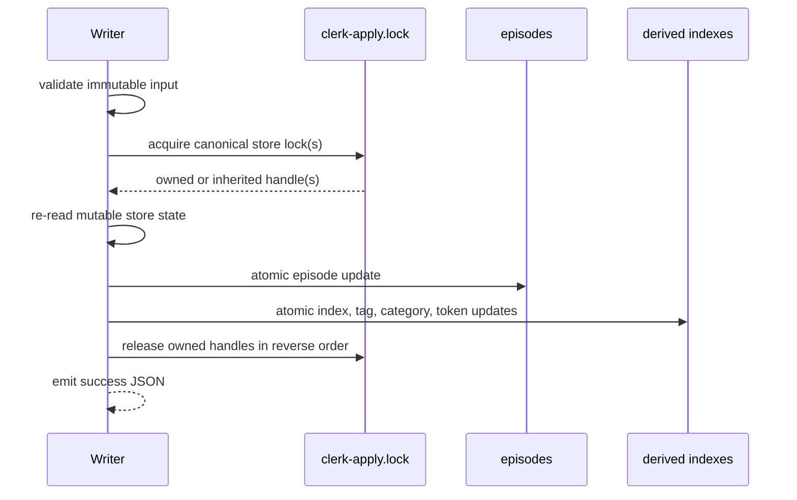

# Issue 546 Concurrent Store Writes Plan

## §1 Status

Current stage: **approved**. GLM-5.2 returned ACCEPT in round 2 after every round-1 HOLD
finding was dispositioned and the revised integration surface was re-audited.

| Field | Value |
|---|---|
| RFC | `n/a` |
| Parent requirements | `n/a`, issue-driven substrate integrity fix |
| Workplan episode | `20260722-123543-workplan-v231-prioritizes-issue-546-imme-2c29` |
| Target branch | `fix/issue-546-concurrent-writes` |
| Executor altitude | `high`, operator-authorized Kimi K3 integration builder |
| Executor authorization | active handoff authorizes Kimi K3 as the external builder fallback; this plan selects that fallback |

## §2 Episode Search Summary

Session recall and the trigger index were run before scouting. The active constraints are:

- `20260722-123543-workplan-v231-prioritizes-issue-546-imme-2c29`: fix #546 after NAPMEM-C and audit the complete fixed-temporary writer class.
- `20260722-123614-handoff-60-places-issue-546-immediately--d6cc`: the observed `em-feedback` failure extends the practical class beyond the original `em-store` report.
- `20260711-001343-multiagent-playbook-work-first-pipeline--a6c2`: scouts precede product reads and edits.
- `20260710-125133-session-grant-driven-seat-permissions-at-483d`: inspect driven-seat dialogs and grant only benign in-scope operations.

Current-main behavior was reproduced in an isolated non-git fixture. A 64-process
`em-store` run produced non-zero exits at the fixed temporary renames for `tags.json`,
`category-index.json`, and `tokens.json` after all episode files landed. Separate real
process runs reproduced fixed `index.jsonl.tmp` and `tags.json.tmp` failures in
`em-feedback` and `em-revise`. `em-rebuild-index` restored derived-index parity.

## §3 Objective

Serialize every in-scope store mutation that persists episodes and rewrites shared derived
indexes through the existing per-store `clerk-apply.lock`. Replace participating fixed
shared temporary basenames with same-directory collision-safe names. Prove with deterministic
external-holder tests and true concurrent processes that successful writers leave episode,
index, tag, category, and token state mutually consistent without temporary-file litter.

## §4 Requirements

| ID | Requirement | Parent | Test(s) | Priority |
|---|---|---|---|---|
| REQ-1 | A zero-dependency store-write helper reuses `scripts/lib/lock.mjs` and `<store>/clerk-apply.lock`; it exposes synchronous one-store and ordered multi-store acquisition, release, unique temporary paths, and atomic replacement. | P1, P5, P11 | `testHelperAcquireRelease`, `testUniqueTmpPaths`, `testAtomicReplace` | MUST |
| REQ-2 | A failed `tryAcquire` result may be inherited only when its live `heldBy` PID equals the current process or the current direct parent PID. Inherited handles are never released by the child. A null or malformed owner never inherits. This preserves `em-promote` parent-lock plus direct child `em-store` or `em-revise` serialization without deadlock. | P4, P11 | `testSameProcessInheritance`, `testParentHeldChildWrite`, `testMalformedLockTimesOut` | MUST |
| REQ-3 | Multi-store acquisition canonicalizes existing store directories, deduplicates aliases, sorts paths lexically, acquires in that order, and releases acquired handles in reverse order. | P5, P11 | `testMultiStoreOrder`, `testSymlinkAliasDedup`, `testPartialAcquireCleanup` | MUST |
| REQ-4 | `em-store` holds the canonical lock across episode persistence and all index, tag, category, and token updates. Validation remains before the first durable write. | P1, P4 | `testExternalHolderBlocksStore`, `testConcurrentStoreParity`, `testStoreTimeoutNoWrite` | MUST |
| REQ-5 | `em-revise` holds all required store locks across original supersession and successor persistence. Cross-scope revision uses REQ-3 ordering. | P1, P7 | `testExternalHolderBlocksRevise`, `testCrossStoreReviseParity` | MUST |
| REQ-6 | Both `em-feedback` modes and `em-pin` serialize their episode or index read-modify-write transactions. Their existing JSON success and error envelopes remain compatible. | P1, P11 | `testFeedbackWaits`, `testFeedbackConcurrentParity`, `testPinWaits`, `testPinParity` | MUST |
| REQ-7 | `em-rebuild-index` serializes each store rebuild. `writeBackAccessTracking` serializes each best-effort index rewrite and skips only that store on lock timeout. | P1, P4 | `testRebuildWaits`, `testSearchWritebackDoesNotDropAppend` | MUST |
| REQ-8 | `em-prune`, `em-move`, `em-seed-patterns`, `em-review-request`, the non-clerk legacy `em-consolidate --apply` path, and the full episode-plus-derived-index phase of `em-restore` use the canonical lock and collision-safe temporary names for shared store files. | P1, P4, P5 | `testCurationWriterAudit`, external-holder coverage, existing focused suites | MUST |
| REQ-9 | The already-locked clerk paths in `em-consolidate`, `em-promote`, and `store-identity` remain behaviorally unchanged. Regression tests prove no nested-lock timeout while the legacy non-clerk consolidate path adopts the shared helper. | P4, P11 | `testPromoteParentHeldChildWrite`, existing consolidate and identity suites | MUST |
| REQ-10 | Every changed shared derived-index replacement uses a unique same-directory path containing PID and cryptographic randomness, writes and fsyncs before rename, and removes its own temporary file on failure. | P5, P11 | `testUniqueTmpPaths`, `testAtomicReplaceCleanup`, `testNoTmpLitter` | MUST |
| REQ-11 | Lock timeout fails before the first transaction write, exits non-zero for command writers, names `store-write-lock-timeout`, and leaves the target store byte-unchanged. | P4, P11 | `testStoreTimeoutNoWrite`, `testReviseTimeoutNoWrite` | MUST |
| REQ-12 | One new true-process concurrency suite is wired into the `substrate` CI shard in the same slice that creates it and passes suite-registration lint. | P4, P6 | `test-ci-suite-registration.mjs`, workflow step | MUST |

## §5 Non-Goals

- Change episode IDs, schemas, categories, search ranking, or recall behavior.
- Introduce a global lock, daemon, dependency, database, or hook.
- Make multiple independent stores one atomic transaction.
- Change already-accepted `em-promote`, clerk, or identity business rules.
- Auto-merge the pull request.

## §6 Token Budget

`wc -l` was captured from `e6cba30` before planning.

| Group | Existing lines | Expected write delta | Notes |
|---|---:|---:|---|
| lock helper and core writers | 2,042 | 180-260 | helper plus six focused integrations |
| curation and specialized writers | 3,962 | 100-180 | anchored lock and atomic-replace wiring only |
| consolidate split surface | 2,088 | 35-70 | legacy apply path changes; clerk paths remain interaction-only |
| already-locked interaction surface | 1,195 | 0 | promote and identity review plus regression tests only |
| CI and registration | 1,014 | 3-8 | one substrate step, no new shard |
| new test suite | 0 | 300-450 | deterministic process harness and assertions |

Baseline single-seat reading exceeds 50k tokens. The optimized run uses sequenced ownership:
helper and tests, core writers, curation writers, then a frozen-diff reviewer. Each builder
receives only its slice files and shared contracts.

## §7 Safety and Negative Matrix

| Concern | Severity | Failure scenario | Mitigation | Negative test |
|---|---|---|---|---|
| Lost derived-index update | High | Two writers read one index and each rename a stale snapshot | Hold one per-store lock across the full read-modify-write transaction | External holder plus concurrent parity tests |
| Fixed temporary collision | High | Writer A renames the shared temp before writer B renames it | PID plus random same-directory temp path, `wx`, fsync, rename, owned cleanup | `testUniqueTmpPaths`, `testAtomicReplaceCleanup` |
| Parent-child self-deadlock | High | `em-promote` holds the lock and waits for a direct child that tries to reacquire | Inherit only a live `tryAcquire().heldBy` equal to current PID or current direct parent PID; inherited release is a no-op | `testParentHeldChildWrite` |
| Cross-store deadlock | High | Two movers or revisers acquire source and destination in opposite orders | Canonicalize, deduplicate, lexical sort, reverse release | `testMultiStoreOrder` |
| Partial lock acquisition | Medium | First lock succeeds and second times out | Release only handles acquired by this call before returning error | `testPartialAcquireCleanup` |
| Timeout after a write | High | Command mutates an episode before reporting lock timeout | Acquire after validation but before the first write | timeout byte-snapshot tests |
| Symlink alias | Medium | Two spellings of one store acquire different locks | Create the store directory, then use `realpathSync` for lock identity and dedupe | `testSymlinkAliasDedup` |
| Stale lock | Medium | Dead owner leaves `clerk-apply.lock` | Reuse `tryAcquire` stale-owner recovery | existing lock tests plus helper unit test |
| Malformed lock | Medium | Lock payload has no positive PID and cannot be reclaimed automatically | Never inherit; time out before mutation with `heldBy:null`; document manual removal after holder verification | `testMalformedLockTimesOut` |
| Independent stores over-serialize | Medium | A store A writer blocks unrelated store B | Lock identity remains per canonical store directory | `testIndependentStoresProceed` |
| Windows and macOS path behavior | Medium | temp file crosses devices or `/var` aliases diverge | temp lives beside final path; all path work uses Node `path` and `fs`; no shell-only path logic | CI plus symlink fixture |

## §8 Design

### 8.1 Key types

```js
/** @typedef {{lockFile:string,pid:number,inherited:boolean}} StoreWriteLockHandle */
/** @typedef {{ok:true,handles:StoreWriteLockHandle[],dirs:string[]}|{ok:false,code:'store-write-lock-timeout',heldBy:number|null}} StoreWriteLockResult */
```

### 8.2 Invariants

- Exactly one lock basename exists for a store: `clerk-apply.lock`.
- Lock identity is the real store directory, not the caller's spelling.
- Every acquired handle is released in reverse order; inherited handles are never released.
- Inheritance is evaluated only from a failed `tryAcquire` result with a positive live `heldBy`; malformed and null owners never inherit.
- Validation finishes before acquisition where it does not depend on mutable store state.
- Each writer re-reads the mutable rows and files it will modify after acquisition: collision state for store and seed/review writers, original status for revise, current counters for feedback, frontmatter and index rows for pin, current episode set for rebuild and prune, source/destination rows for move, source cluster rows for legacy consolidate, target indexes for restore, and index rows for relevance writeback.
- No transaction reports success until all in-scope derived indexes are updated.
- Temporary files stay in the destination directory and are unique per write.
- Cross-platform behavior uses Node standard-library APIs only.

### 8.3 Flow



## §9 Existing Hook Points and Disposition Sweep

| File | Current anchor | Disposition | Planned impact |
|---|---|---|---|
| `scripts/lib/lock.mjs` | `tryAcquire`, `release` | INTERACTS | primitive reused unchanged |
| `scripts/lib/store-write-lock.mjs` | new | CHANGED | shared synchronous store-lock and atomic-replace API |
| `scripts/em-store.mjs` | `// Write files` | CHANGED | one-store transaction and atomic replacements |
| `scripts/em-revise.mjs` | `// Mark original as superseded` | CHANGED | ordered store transaction(s) |
| `scripts/em-feedback.mjs` | `// Record: one +1 per resolved id` | CHANGED | lock both modes without changing envelopes |
| `scripts/em-pin.mjs` | `// --- frontmatter` | CHANGED | one-store episode and index transaction |
| `scripts/em-rebuild-index.mjs` | `function rebuildDir(dataDir, label)` | CHANGED | one-store rebuild transaction |
| `scripts/lib/relevance.mjs` | `writeBackAccessTracking`, `updateTokensIndex` | CHANGED | bounded best-effort lock plus atomic replacement |
| `scripts/em-prune.mjs` | `// Actual prune` | CHANGED | one-store archive and index transaction |
| `scripts/em-move.mjs` | source and destination rewrite helpers | CHANGED | ordered two-store transaction |
| `scripts/em-seed-patterns.mjs` | episode and derived-index write block | CHANGED | canonical global-store transaction |
| `scripts/em-review-request.mjs` | episode and tags write block | CHANGED | canonical resolved-store transaction |
| `scripts/em-restore.mjs` | episode apply plus per-target `mergeIndexes` loop | CHANGED | ordered target-store locks span episode persistence through derived-index merge; unique staging remains |
| `scripts/em-consolidate.mjs` | legacy `--apply` block and clerk paths | CHANGED / INTERACTS | legacy digest transaction adopts helper; already-locked clerk paths remain behaviorally unchanged |
| `scripts/em-promote.mjs` | local `withStoreLockSync` around child spawn | INTERACTS | no product change; parent inheritance regression coverage |
| `scripts/lib/store-identity.mjs` | local `withStoreLockSync` | INTERACTS | already serialized; no product change |
| all remaining `scripts/em-*.mjs` | read-only or unrelated state | UNCHANGED | no issue-546 store-index transaction |

## §10 Slice Ladder

| Slice | Objective | Primary files | Verification | Hard stop |
|---|---|---|---|---|
| 546-S1 | Shared lock, atomic-replace contract, and CI registration | new helper, new test suite, workflow | helper, negative lock tests, registration lint | no writer wiring |
| 546-S2 | Ordinary and hot writers | store, revise, feedback, pin, rebuild, relevance | deterministic holder, concurrency parity, promote parent-child | no curation writer |
| 546-S3 | Remaining unguarded shared-index writers | prune, move, seed, review-request, restore, legacy consolidate | focused existing suites and writer audit | no changes to already-locked clerk business logic |

Dependency: `S1 -> S2 -> S3`. Builders never commit. The orchestrator commits the final
accepted slice files only after frozen-diff review and independent verification.

## §11 Cut Order

If a review proves S3 too broad, cut only writers that the reviewer classifies as not sharing
the issue invariant and file the residual with all five defer fields. Do not cut REQ-1 through
REQ-7, REQ-9 through REQ-12, parent inheritance, deterministic negative tests, or CI wiring.

## §12 Contracts

### `acquireStoreWriteLocksSync(dataDirs, options)`

| State | Condition | Output | Side effect |
|---|---|---|---|
| owned | every lock acquired by caller | `{ok:true, handles, dirs}` | lock files created |
| inherited | failed `tryAcquire` reports a positive live `heldBy` equal to current PID or current direct parent PID | inherited handle in success result | no file change |
| timeout | a non-inherited owner, including `heldBy:null` from a malformed payload, remains through deadline | `{ok:false, code:'store-write-lock-timeout', heldBy}` | owned earlier handles released |
| invalid | empty or non-string store path | throws `TypeError('store directory must be a non-empty string')` | none |

### `releaseStoreWriteLocks(handles)`

Reverse-iterates handles. It calls `release` only for owned handles. Repeated calls are safe.

### `atomicReplaceFileSync(finalPath, data, options)`

Creates a same-directory `wx` temporary file containing PID plus eight random hex bytes,
writes the supplied bytes, fsyncs, closes, renames, and returns the final path. Any failure
closes the descriptor and removes only that invocation's temporary file before rethrowing.
An `EEXIST` from the random `wx` path fails loudly without deleting the existing path; the
caller may retry the whole operation after inspecting the collision.

## §13 Edge Cases

| ID | Scenario | Expected | Test |
|---|---|---|---|
| EC1 | empty store path | reject before filesystem access | helper invalid-input test |
| EC2 | symlink alias and canonical path name one store | one deduplicated lock | `testSymlinkAliasDedup` |
| EC3 | 16 concurrent store writers | all exit 0 and every derived index carries every successful ID | `testConcurrentStoreParity` |
| EC4 | atomic replacement throws before rename | prior final file survives and owned temp is removed | `testAtomicReplaceCleanup` |
| EC5 | direct child sees parent-owned lock | child proceeds; parent remains owner | `testParentHeldChildWrite` |
| EC6 | unrelated live owner holds lock past deadline | fail before transaction write | timeout snapshot tests |
| EC7 | revise source and target resolve to the same store | one lock acquired | multi-store dedupe test |
| EC8 | best-effort access tracking times out | search result still succeeds; that store's tracking write is skipped | writeback contention test |
| EC9 | already-locked promote or clerk path calls changed writer | no nested timeout and no duplicate record | existing focused suites |
| EC10 | malformed lock payload has no positive PID | timeout with `heldBy:null`; target bytes unchanged | `testMalformedLockTimesOut` |
| EC11 | store A is externally locked while store B writes | B completes before A releases | `testIndependentStoresProceed` |
| EC12 | restore spans two target stores while one is externally held | no episode or derived-index write occurs before all target locks are acquired | `testRestoreTransactionWaits` |
| EC13 | dry-run, help, or invalid input | no lock wait and no store mutation | `testNonWriterControls` |

## §14 Test Catalog

New suite: `tests/test-store-write-concurrency.mjs`.

- Helper: acquire, release, inherited handles, malformed-owner timeout, lexical ordering, symlink dedupe, partial cleanup, unique temporary paths, `wx` collision, and atomic replacement cleanup.
- Deterministic writer blocking: real external holder against store, revise, feedback, pin, rebuild, prune, move, seed, review-request, restore, and legacy consolidate.
- Concurrency parity: 16 real `em-store` processes with distinct sentinel tags and bodies.
- Cross-store revise: local original plus global successor with both stores consistent.
- Search writeback: concurrent append remains present after access tracking.
- Compatibility and false-positive controls: parent-held direct child write completes; independent stores proceed; read-only, help, dry-run, and invalid-input paths do not wait; promote, clerk consolidate, and identity focused suites remain green.
- Restore: an external holder blocks the full episode-plus-derived-index transaction; the existing restore self-test still proves `mergeIndexes` union and force-history cases.
- Curation audit: source scan proves every CHANGED writer routes shared replacements through the helper; focused behavior suites validate each command.
- Timeout: byte snapshots prove no mutation, including malformed lock payloads.

The negative control is deterministic: the suite first holds `clerk-apply.lock` in a live
external child. On unmodified main, the ordinary writer does not wait, so the observed
`writerExitedBeforeRelease` value is `true` instead of the required `false`.

## §15 Verification Ledger

| Claim | Command | Required observed artifact |
|---|---|---|
| New regression suite passes | `node tests/test-store-write-concurrency.mjs` | named pass count, zero failures |
| Suite is falsifiable on main | `node tests/test-store-write-concurrency.mjs --expect-main-red` before product edits | non-zero exit with `writerExitedBeforeRelease=true` |
| Store tag compatibility | `node tests/test-em-store-tag-flags.mjs` | zero failures |
| Feedback compatibility | `node tests/test-feedback-scan.mjs` | zero failures |
| Category compatibility | `node tests/test-category-index.mjs` | zero failures |
| Move compatibility | `node tests/test-em-move.mjs` | zero failures |
| Prune compatibility | `node tests/test-prune-lifecycle.mjs` | zero failures |
| Seed compatibility | `node tests/test-seed-patterns.mjs` | zero failures |
| Review-request compatibility | `node tests/test-workflow-validate.mjs` | zero failures |
| Restore compatibility | `node tests/test-em-restore.mjs` | reported self-test failure count is `0` |
| Relevance compatibility | `node tests/test-relevance.mjs` | zero failures |
| Legacy consolidate and clerk compatibility | `node tests/test-em-consolidate.mjs` | zero failures |
| Promote compatibility | `node tests/test-em-promote.mjs` | zero failures |
| Promote apply compatibility | `node tests/test-promote-apply.mjs` | zero failures |
| Identity compatibility | `node tests/test-store-identity.mjs` | zero failures |
| CI wiring is live | `node tests/test-ci-suite-registration.mjs` | zero unregistered new suites |
| Store integrity holds | concurrency suite's isolated-fixture doctor probe | zero errors and no drift |
| Diff whitespace is clean | `git diff --check` | no output and exit zero |
| Diff scope is clean | `git status --short` | only approved slice files |
| CI is green | `gh pr checks <PR>` | required `validate` and `p12-invariant-gate` pass |

## §16 Risk Analysis

| Risk | Severity | Likelihood | Mitigation |
|---|---|---|---|
| Parent inheritance accepts a wrong relationship | High | Low | evaluate only failed `tryAcquire().heldBy`; require a positive PID equal to current PID or current direct parent PID; malformed owners time out |
| Large-store write latency increases | Medium | Medium | lock only write transaction; keep reads and post-write reports outside; record timing |
| Broad writer audit causes scope creep | Medium | Medium | anchored per-file edits, three slices, frozen diff, independent review |
| Rebuild called from an already-held same-process path | High | Low | same-process inherited handle and no-op inherited release |
| Restore partially completes across independent stores | Medium | Existing | acquire all affected target-store locks in canonical order before episode writes; hold all through every derived merge; release the set in reverse order at transaction end; do not claim rollback across stores |

## §17 Open Decisions

No design decisions are delegated to builders. Review findings that remove a writer from S3
must include a real contention scenario, specification check, prior-review history, same-class
sweep, residual risk, and a tracking issue before the plan can be approved.

## §18 Done Criteria

- [ ] Every MUST row has a passing automated test.
- [ ] Deterministic main negative control is captured before the fix.
- [ ] All CHANGED writers, including legacy non-clerk consolidate and full restore episode application, use the canonical lock for their complete store transaction.
- [ ] All participating shared replacements use collision-safe same-directory temporary files.
- [ ] Promote parent-child, independent-store, malformed-lock, non-writer control, consolidate, restore, and store-identity regression suites pass.
- [ ] New suite is wired into `substrate` and suite-registration lint passes.
- [ ] Frozen-diff reviewer returns ACCEPT after every finding disposition.
- [ ] Independent verification reproduces the observable behavior, not only the unit suite.
- [ ] Every deferred finding has an issue, issue comment, or violation artifact.

## §19 Review Consensus

| Pass | Reviewer | Provider | Blockers | Verdict | Artifact |
|---|---|---|---:|---|---|
| 1 | `plan-review` Herdr seat | GLM-5.2 | 3 | HOLD | read-only source and test-inventory audit, final telemetry ↑171k / ↓27k / $0.528 / 7.7% context |
| 2 | `plan-review` Herdr seat | GLM-5.2 | 0 | ACCEPT | cumulative ↑186k / ↓39k / $0.771 / 7.6% context; round-2 delta ≈ ↑15k / ↓12k / $0.243 |

Findings are classified as ACCEPT, ACCEPT-WITH-MOD, REJECT, DEFER, or NEEDS-EVIDENCE.
At most two review rounds are permitted before changing the plan boundary.

Round-1 dispositions:

- F1 missing legacy consolidate writer: **ACCEPT**. Reclassify only the non-clerk `--apply` transaction as CHANGED; keep already-locked clerk paths interaction-only.
- F2 low-altitude appendix failure: **ACCEPT-WITH-MOD**. Select the operator-authorized Kimi K3 integration builder as the high-capability executor and remove Appendix A instead of mislabeling prose as a mechanical build path.
- F3 placeholder and omitted suites: **ACCEPT-WITH-MOD**. §15 now names the real seed, review-request, restore, relevance, consolidate, promote, and identity commands.
- F4 PID-reuse expansion: **REJECT**. The inheritance condition is the live owner returned by `tryAcquire` and the current direct parent relationship, so changing the shared lock payload is not justified by a reachable direct-child scenario. Malformed owner handling is **ACCEPT-WITH-MOD**: null owners never inherit and must time out before mutation with a byte-snapshot test and manual-recovery documentation.
- F5 delayed CI registration: **ACCEPT-WITH-MOD**. CI wiring moves into S1 with test creation.
- F6 restore hollow-green risk: **ACCEPT-WITH-MOD**. Existing self-tests cover `mergeIndexes`; the new suite must additionally hold an affected target lock around the full restore episode-plus-index transaction.
- F7 mutable-state revalidation: **ACCEPT-WITH-MOD**. §8.2 now enumerates the required per-writer in-lock rereads.
- F8 `wx` collision behavior: **ACCEPT-WITH-MOD**. `EEXIST` fails loudly, preserves both the final file and pre-existing collision path, and does not delete a path the call did not create.

## §20 Lessons Encoded

- Verify by artifact: deterministic external-holder and parity outputs back every claim.
- Complete bug class: review receives the invariant, full writer disposition, false-positive controls, and refactor boundary.
- Cross-platform always: only Node standard-library path and filesystem APIs.
- One command per verification call: no chained shell commands in build or verification steps.
- Step 9: every residual finding receives a durable tracking artifact before wrap-up.
- High-capability build route: the operator-authorized Kimi K3 integration builder receives the approved §1-§20 plan and bounded slice ownership; no mechanical appendix is claimed.
- Role lock: external builders write product files; the orchestrator verifies and commits.
