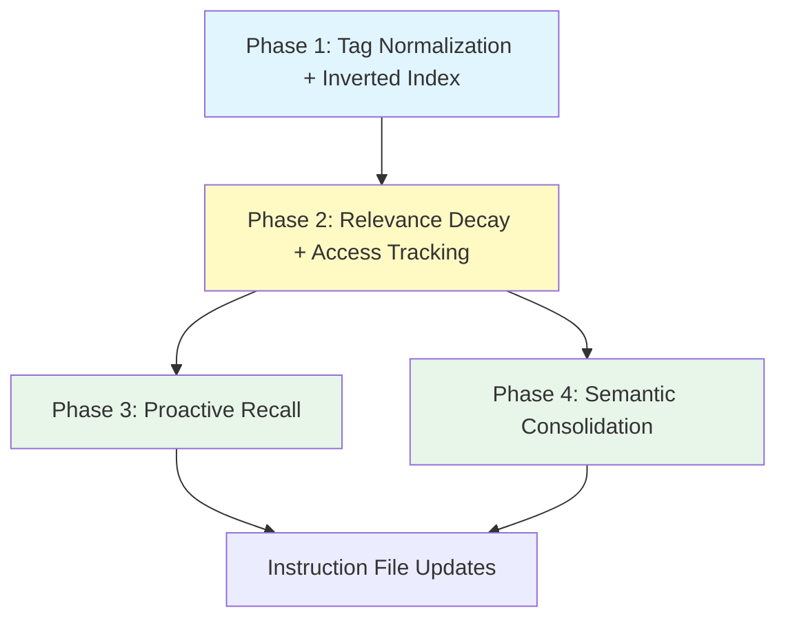

# RFC-001 — Intelligent Memory: Tag Index, Relevance Scoring, Proactive Recall, and Semantic Consolidation

## AI context

> This RFC adds four capabilities to make episodic memory smarter: tag normalization with inverted indexing, relevance decay with access tracking, proactive session-start recall, and episodic-to-semantic consolidation. The current system stores and retrieves well but lacks intelligent surfacing — memories are found only when explicitly searched. The key trade-off is keeping zero external dependencies while adding features that typically require vector databases or ML models.

---

## Problem

The episodic memory system currently stores and retrieves episodes reliably, but has no intelligence in how memories are surfaced:

1. **No proactive recall.** Memories are found only when the user or AI explicitly searches. At session start, there is no mechanism to surface relevant past decisions, bug fixes, or architectural context for the current project.

2. **No relevance ranking.** All search results are equal — a decision made yesterday and accessed frequently has the same weight as a one-off note from six months ago. There is no concept of memory freshness or importance decay.

3. **No knowledge consolidation.** When the same pattern or lesson appears across multiple episodes (e.g., "always use atomic writes for index files"), each instance remains a separate episode. There is no way to distill repeated patterns into reusable knowledge.

4. **Inefficient tag lookup.** Tags are case-sensitive and unnormalized (`React` vs `react` vs `REACT` are different tags). All searches are linear scans of the full index. There is no inverted index for fast tag-based retrieval.

---

## Proposal

Four phases, dependency-ordered. Each phase is independently shippable but builds on the previous.

### Phase 1: Tag Normalization + Inverted Index

**Tag normalization:**
- Add a `normalizeTags()` helper (inlined in each script, not a shared module — maintains zero-dep single-file scripts).
- Normalization: lowercase, trim, deduplicate, sort.
- Algorithm (pseudocode): `split(',') → trim each → lowercase each → filter empty → deduplicate (case-insensitive, first-wins) → sort (ASCII lexicographic)`
- Applied on store, revise, and rebuild (index only — `.md` frontmatter is not rewritten).

**Inverted index:**
- New `tags.json` secondary index alongside `index.jsonl` in each data store (`~/.episodic-memory/`, `.episodic-memory/`).
- Structure: `{ "tag-name": ["episode-id-1", "episode-id-2", ...] }`
- Updated atomically on store/revise; fully rebuilt by `em-rebuild-index.mjs`.
- `em-search.mjs` uses `tags.json` for tag-filtered queries instead of scanning all episodes.
- **Fallback:** If `tags.json` is missing, corrupt (invalid JSON), empty (`{}`), or does not contain the searched tag, fall back to linear scan of `index.jsonl` and emit a `"warning"` field suggesting `em-rebuild-index.mjs`. Never fail on a missing or incomplete secondary index. `tags.json` is a cache — correctness always comes from `index.jsonl`.
- **Manual edits:** Direct edits to `.md` frontmatter (outside `em-store`, `em-revise`, `em-rebuild`) do not update `tags.json`. Run `em-rebuild-index.mjs` to sync after manual edits.

**Supersession handling in `tags.json`:**
- `tags.json` includes ALL episode IDs, including superseded ones. This preserves completeness for `--history` and `--include-superseded` queries.
- Filtering of superseded episodes happens after lookup, using `index.jsonl` status fields — same as current behavior. `tags.json` is purely an ID lookup accelerator.
- On revise: the new (superseding) episode inherits the old episode's tags in `tags.json`; the old ID remains for history mode.

**Query normalization:**
- `em-search.mjs` normalizes `--tag` input using the same `normalizeTags()` logic before lookup. The script owns normalization — callers pass raw input.

**Files modified:**
- `scripts/em-store.mjs` — normalize tags before writing; update `tags.json`
- `scripts/em-revise.mjs` — normalize tags; update `tags.json` (keep superseded episode ID indexed, add new episode ID under its normalized tags)
- `scripts/em-search.mjs` — use `tags.json` for `--tag` queries
- `scripts/em-rebuild-index.mjs` — generate `tags.json` during rebuild

### Phase 2: Relevance Decay + Access Tracking

**New index fields (optional, backwards-compatible):**
- `access_count` (integer, default 0) — incremented each time an episode appears in search results
- `last_accessed` (ISO date string) — updated on search result inclusion

**Scored search (default-on, `--no-score` to disable):**
- Formula: `text_match * max(0.1, 1 - (days_since_creation / 365)) * (1 + log1p(access_count) * 0.1)`
- `text_match`: existing keyword match score (1.0 for exact, partial for substring)
- Time decay floors at 0.1 (memories never reach zero relevance)
- Access frequency provides a mild boost (logarithmic, prevents runaway)

**Access tracking write-back:**
- When `em-search.mjs` returns results, update `access_count` and `last_accessed` in `index.jsonl` for each returned episode.
- **Opt-out:** `--no-track` flag disables access tracking write-back entirely. Useful for read-only contexts, CI, hooks, and review workflows where search should remain side-effect-free.
- `--history` and `--include-superseded` queries do NOT trigger access tracking (these are investigative, not usage signals).
- **Write contention mitigation:** Use atomic write (temp file + rename) for index updates. Read-modify-write cycle: read current `index.jsonl`, apply increments, write to temp, rename. If the temp write fails (e.g., another process holds the file), skip the write-back silently — access tracking is best-effort, not critical. Concurrent searches may lose increments (last-writer-wins); this is acceptable for approximate usage signals. Note: `em-rebuild-index.mjs` preserves existing counts but cannot recover lost increments from concurrent writes.

**Date field migration:**
- Current `index.jsonl` entries store `date` and `time` as separate fields. Phase 2 adds `last_accessed` as an ISO 8601 string (`YYYY-MM-DDTHH:MM:SS`). The relevance formula computes `days_since_creation` from the existing `date` field. No migration needed — new fields are additive.

**Performance health check (built into `em-search.mjs` and `em-recall.mjs`):**
- After each search/recall, measure wall-clock time. If execution exceeds a threshold (default: 500ms), emit a `"warning"` field in the JSON output: `"warning": "Search took Nms across M episodes. Consider running em-prune.mjs to archive stale episodes."`
- Also warn if episode count exceeds a soft limit (default: 500): `"warning": "N episodes in index. Performance may degrade. Run em-prune.mjs --dry-run to check for prunable episodes."`
- Thresholds configurable via `--warn-time-ms` and `--warn-count` flags.
- Warnings are informational only — they never block execution.

**Pruning (`scripts/em-prune.mjs`, new file, ~100 lines):**
- Uses a query-independent **prune score**: `max(0.1, 1 - (days_since_creation / 365)) * (1 + log1p(access_count) * 0.1)`. This is the search relevance formula with `text_match` fixed at 1.0 (no query context). The time-decay floor of 0.1 means episodes only fall below the prune threshold (default: 0.15) if they are old AND rarely accessed.
- Archives episodes below the prune threshold (default: 0.15).
- Moves episode `.md` files to an `archived/` subdirectory within the data store.
- Removes from `index.jsonl` and `tags.json`; creates `archived-index.jsonl` for reference.
- `--dry-run` mode to preview what would be archived (shows count, total size, and per-episode scores).
- `--check` mode: only reports whether prunable episodes exist and how many, without listing details. Designed for use in hooks or session-start scripts.
- Outputs summary: `{ "pruned": N, "remaining": M, "freed_bytes": B }` (or dry-run equivalent).

**Files modified:**
- `scripts/em-search.mjs` — add scoring (default-on, `--no-score` opt-out), access tracking write-back, performance health check
- `scripts/em-rebuild-index.mjs` — preserve `access_count` and `last_accessed` during rebuild. Strategy: load old `index.jsonl` into a map keyed by episode ID before rebuilding; carry forward `access_count` and `last_accessed` for known IDs; default to `0` and `null` for new entries

**Files created:**
- `scripts/em-prune.mjs`

### Phase 3: Proactive Recall

**New script: `scripts/em-recall.mjs` (~100 lines)**

Multi-pass retrieval triggered at session start:
1. **Project match** — episodes whose `project` field matches the current project name (from `package.json` `name` field, git remote, or directory name). Uses the existing `project` field in `index.jsonl`, NOT tags — this is the authoritative source for project membership.
2. **Tag match** — episodes whose tags overlap with inferred context (git branch name split into tokens, directory path tokens).
3. **Recent cross-project** — high-relevance episodes from the last 7 days across all projects.

Uses Phase 1 inverted index for fast tag lookup. Uses Phase 2 scoring to rank results. Updates access tracking for surfaced episodes.

**Output:** JSON array of top-N episodes (default 5), sorted by relevance score. Includes the same performance health check warnings as `em-search.mjs` when thresholds are exceeded. If prunable episodes are detected (score below prune threshold), appends `"prune_suggestion": "N episodes below threshold. Run em-prune.mjs --dry-run to review."`

**Context inference:**
- `package.json` → project name, keywords
- `git branch --show-current` → branch name tokens
- `basename $(pwd)` → directory name
- Falls back gracefully if any source is unavailable.

**Token collision handling:**
- Short generic tokens (< 4 characters or in a stopword list: "fix", "feat", "user", "test", "app", "src", etc.) are excluded from tag matching to avoid false positives.
- Project-name match (pass 1) is weighted higher than inferred tag match (pass 2), so exact project episodes always rank above coincidental token overlaps.
- Tokens from different sources are not combined — each pass is independent, and results are merged by highest score, not additive.

**Files created:**
- `scripts/em-recall.mjs`

### Phase 4: Semantic Consolidation

**New script: `scripts/em-consolidate.mjs` (~150 lines)**

Identifies clusters of related episodes and generates consolidated "lesson" episodes.

**Clustering:**
- Tag overlap: Jaccard similarity >= 0.3
- Summary word overlap: Jaccard similarity >= 0.2 (after stopword removal)
- Minimum cluster size: 3 episodes

**Lesson generation:**
- New `lesson` category added to `VALID_CATEGORIES` in `em-store.mjs`
- `em-consolidate.mjs` writes lesson files directly (not via `em-store.mjs`) to include the `source_episodes` field in frontmatter. This avoids extending `em-store.mjs` with a consolidation-specific flag.
- Template-based summary: "Based on N episodes about [common tags]: [merged key points]"
- Frontmatter field: `source_episodes: [id1, id2, ...]` — links lesson to its source episodes. This field is also indexed in `index.jsonl` so lesson provenance is searchable without reading full files.
- `em-rebuild-index.mjs` updated to preserve `source_episodes` from frontmatter when rebuilding.
- Source episodes are NOT modified or superseded (lessons augment, not replace)

**Performance guard:**
- Consolidation is O(n^2) on episode count. If episode count exceeds 1,000, emit a warning and suggest running `em-prune.mjs` first to reduce the active set.
- `--max-episodes N` flag (default: 2,000) — hard cap; refuses to run above this limit with a clear error message directing the user to prune first.

**Auto-consolidation (session end):**
- At session end, run consolidation automatically via `em-consolidate.mjs --auto`.
- Only write lessons when more than 3 clusters are detected.
- If 3 or fewer clusters, skip silently (exit 0, no output) — not enough signal for meaningful lessons.
- Output includes count of lessons created so session-end hooks can log it.
- **Hook integration per tool:**
  - Claude Code: `SessionEnd` hook in `settings.json` runs `node ~/.episodic-memory/scripts/em-consolidate.mjs --auto`
  - Cursor/Windsurf/Continue: document as manual step in instruction files (no hook system)
  - Codex: run as final step in AGENTS.md session-end checklist

**Modes:**
- `--dry-run` — preview clusters and proposed lessons without writing
- `--auto` — auto-consolidation mode: write lessons only if clusters > 3, exit 0 silently otherwise
- `--min-cluster N` — override minimum cluster size (default 3)
- `--threshold N` — override Jaccard threshold (default 0.3)

**Files created:**
- `scripts/em-consolidate.mjs`

**Files modified:**
- `scripts/em-store.mjs` — add `lesson` to `VALID_CATEGORIES`

### Instruction file updates

Update instruction files incrementally as each phase ships (do not batch to the end):
- `instructions/SKILL.md`
- `instructions/cursor.mdc`
- `instructions/AGENTS.md`
- `instructions/windsurf.md`

### Scope

- **In scope:** tag normalization, inverted index (`tags.json`), access tracking fields, relevance scoring formula, proactive recall script, semantic consolidation via Jaccard similarity, archival pruning, `lesson` category, instruction file updates
- **Out of scope:** vector/semantic search (requires embeddings model), MCP server wrapper, contradiction detection between episodes, SQLite migration, cross-machine sync

---

## Alternatives considered

| Alternative | Why rejected |
|---|---|
| SQLite instead of JSONL + tags.json | Adds complexity; Node 22+ has built-in sqlite but not all environments use Node 22; JSONL + inverted index sufficient for foreseeable scale (thousands of episodes) |
| Vector embeddings for search | Requires external model or API call; violates zero-dependency constraint; defer to future RFC when local embeddings become more accessible |
| ML-based clustering for consolidation | Same zero-dep concern; Jaccard similarity on tags and words is good enough for identifying repeated patterns without ML |
| Mark source episodes as superseded after consolidation | Loses independent searchability; lessons should augment the knowledge base, not replace individual episodes which may have unique context |
| Shared `utils.mjs` module for `normalizeTags()` | Breaks the single-file-script convention; each script must be independently runnable with no imports beyond Node.js stdlib |
| Keep `--scored` as opt-in | Would require updating every tool's instruction file for adoption; score field is additive JSON so default-on is safe |

---

## Implementation plan

### Phase 1: Tag Normalization + Inverted Index — SHIPPED

**Files modified:** `em-store.mjs`, `em-revise.mjs`, `em-search.mjs`, `em-rebuild-index.mjs`
**Shipped:** PR #6, commit `0e45e4d`. Bugs #2–#5 found and fixed.

### Phase 2: Relevance Decay + Access Tracking — SHIPPED

**Files modified:**
- `em-search.mjs` (~227→~340 lines) — scoring formula, `text_match` tiers (1.0 exact/0.7 substring/0.4 body-only), access tracking write-back with dual-scope handling (local + global `index.jsonl` independently), `--no-score`/`--no-track`/`--warn-time-ms`/`--warn-count` flags, performance health check
- `em-rebuild-index.mjs` (~115→~140 lines) — load old index before rebuild, carry forward `access_count`/`last_accessed` for known IDs, default `0`/`null` for new

**Files created:**
- `em-prune.mjs` (~120 lines) — query-independent prune score, `--scope`/`--threshold`/`--dry-run`/`--check` flags, append to `archived-index.jsonl`, move `.md` to `archived/`

**Key design decisions:**
- `computeScore` defaults missing `access_count` to 0 (no `em-store.mjs` change needed)
- Write-back re-reads `index.jsonl` before writing to narrow race window with concurrent appends; documented as best-effort
- Score ALL results before applying `limit` (replaces date-based sort)
- Health check for `em-recall.mjs` deferred to Phase 3 (script doesn't exist yet)

**Detailed plan:** `docs/rfcs/archived/RFC-001-phase2-plan.md`

### Phase 3: Proactive Recall — IN PROGRESS

**Files created:** `em-recall.mjs` (~260 lines) — multi-pass retrieval (project match, tag match, recent cross-project), output as `{ "preflight_warnings": [], "episodes": [...] }` object wrapper (designed for RFC-002 Phase 3 extension)
**Depends on:** Phase 2 (scoring + access tracking)
**Detailed plan:** `docs/rfcs/archived/RFC-001-phase3-plan.md`

### Phase 4: Semantic Consolidation — NOT STARTED

**Files created:** `em-consolidate.mjs` (~150 lines) — Jaccard clustering, `lesson` category, `--auto`/`--dry-run`/`--max-episodes` modes
**Files modified:** `em-store.mjs` (add `lesson` to VALID_CATEGORIES — coordinate with RFC-002 `violation` addition)
**Depends on:** Phase 2 (scoring for cluster ranking)
**Deferred details:** Hook/config/instruction integration to be specified when Phase 4 begins

### Acceptance tests (per phase)

**Phase 1:**
- [x] store/revise normalize tags (case, trim, dedup, sort) and update `tags.json`
- [x] search `--tag` uses `tags.json` for lookup; normalizes input
- [x] search falls back to linear scan when `tags.json` is missing or invalid JSON
- [x] `tags.json` includes superseded episode IDs; filtering happens post-lookup
- [x] rebuild recreates both `index.jsonl` and `tags.json`

**Phase 2:**
- [x] search returns relevance scores by default (scoring is default-on)
- [x] `--no-score` suppresses relevance scores from output
- [x] access tracking increments `access_count` and updates `last_accessed` on search
- [x] `--no-track` disables access tracking write-back
- [x] `--history` and `--include-superseded` do not trigger access tracking
- [x] rebuild preserves `access_count` and `last_accessed` from old index
- [x] prune dry-run does not move files; outputs scores and counts
- [x] prune `--check` reports prunable count without details
- [x] performance warnings emitted when thresholds exceeded

**Phase 3:**
- [x] recall ranks `project`-field matches above incidental tag matches
- [x] recall excludes short/generic tokens from tag matching
- [x] recall falls back gracefully when `package.json`, git, or cwd is unavailable
- [x] recall updates access tracking for surfaced episodes

**Phase 4:**
- [ ] consolidate `--auto` with ≤3 clusters exits 0 silently, no lessons written
- [ ] consolidate `--auto` with >3 clusters writes lessons and updates index
- [ ] consolidate `--dry-run` produces deterministic clusters and writes nothing
- [ ] lesson files include `source_episodes` in frontmatter and `index.jsonl`
- [ ] source episodes are not modified after consolidation
- [ ] consolidate refuses to run above `--max-episodes` cap
- [ ] rebuild preserves `source_episodes` from frontmatter

### Sequencing

---

## Implementation

> Populate during build stage — mark each phase immediately after it ships.

| Phase | Files changed | Tests | Notes |
|---|---|---|---|
| Phase 1: Tag Normalization + Inverted Index | `em-store.mjs`, `em-revise.mjs`, `em-search.mjs`, `em-rebuild-index.mjs` | 16 E2E scenarios passed | Shipped in PR #6, commit `0e45e4d`. Bugs: #2 (P1), #3 (P2), #4 (P3), #5 (P1) — all fixed. |
| Phase 2: Relevance Decay + Access Tracking | `em-search.mjs`, `em-rebuild-index.mjs`, `em-prune.mjs` (new) | 24 Phase 2 tests + 15 existing = 39 passed | Shipped in PR #13. Scoring default-on, access tracking, pruning, performance health checks. BPs decoupled from user-preferences, bp-007 merged into bp-006, bp-011 added. |
| Phase 3: Proactive Recall | `em-recall.mjs` (new) | 20 Phase 3 tests + 31 existing = 51 passed | Multi-pass retrieval (project, tag, recent cross-project). Context inference from package.json, git remote, git branch, cwd. Drift detection for inlined functions. 2nd opinion review applied (8 findings). |

---

## Related RFCs

- RFC-002 — Learning Loop (Phase 3 extends `em-recall.mjs` built in this RFC's Phase 3)

---

## Second opinion

> Required before `status: accepted` can be set.

### Review 1 — Claude Opus 4.6
**Reviewer:** Claude Opus 4.6 (Explore subagent, independent context)
**Date:** 2026-04-30
**Findings:** Four gaps identified and addressed in revision: (1) no fallback behavior when `tags.json` is missing/corrupt — added graceful linear scan fallback; (2) tag normalization boundary unclear for search queries — clarified scripts own normalization, callers pass raw input; (3) context inference token collisions in Phase 3 — added stopword filtering for short generic tokens, independent pass scoring; (4) access tracking write contention in multi-tool scenarios — added atomic write with silent skip on failure. Minor notes: bloom filters as future micro-optimization, mtime tiebreaker — deferred as non-blocking.
**AI-slop check:** clean
**Decision:** proceed (after revision applied)

### Review 2 — OpenAI Codex
**Reviewer:** OpenAI Codex (independent session, reviewed codebase against RFC)
**Date:** 2026-04-30
**Full review:** `docs/rfcs/RFC-001-review.md`
**Findings:** Eight findings across P1/P2/P3 severity levels. All addressed in revision:
1. `index.json` vs `index.jsonl` naming mismatch — fixed (replaced all occurrences)
2. `tags.json` superseded episode handling unspecified — resolved (include all IDs, filter post-lookup)
3. Search write side effects undocumented — resolved (added `--no-track` flag, history/superseded exempt, concurrent last-writer-wins documented)
4. Prune threshold vs score floor math issue — resolved (query-independent prune score, `text_match` = 1.0, threshold raised to 0.15)
5. Rebuild erases access metadata — resolved (load old index, carry forward by episode ID)
6. Project recall uses tags instead of `project` field — resolved (pass 1 now uses `project` field from `index.jsonl`)
7. Consolidation lesson metadata writing unspecified — resolved (`em-consolidate.mjs` writes directly, `source_episodes` indexed)
8. No acceptance tests — resolved (test checklist added to implementation plan)
Four new open questions (OQ-4 through OQ-7) raised and resolved in the same revision.
**AI-slop check:** clean
**Decision:** proceed (after revision applied)

---

## Open questions

| # | Question | Owner | Status |
|---|---|---|---|
| OQ-1 | Should `em-search --scored` be the default, or opt-in? Default changes existing behavior for all integrations; opt-in requires each tool's instructions to be updated. | — | resolved — default-on with `--no-score` opt-out; score field is additive JSON so no breaking change |
| OQ-2 | Should consolidation run automatically at session end, or only manually? Auto-run risks creating low-quality lessons from insufficient data; manual requires user discipline. | — | resolved — auto-consolidate at session end when dry-run detects > 3 clusters; lessons written automatically, no user prompt needed |
| OQ-3 | Should tag normalization rewrite existing `.md` frontmatter during rebuild, or only normalize in the index? Rewriting keeps source files consistent but modifies user-authored content. | — | resolved — index only; `.md` frontmatter is user-authored source of truth and should not be rewritten |
| OQ-4 | Should access tracking be default-on, opt-in, or disabled in read-only contexts? Avoids surprising writes from search commands. | — | resolved — default-on with `--no-track` opt-out; history/superseded queries exempt |
| OQ-5 | Should `tags.json` include superseded episode IDs? Affects history mode and `--include-superseded` consistency. | — | resolved — yes, include all; filter post-lookup via `index.jsonl` |
| OQ-6 | Should `source_episodes` be indexed in `index.jsonl`? Determines whether lesson provenance is searchable without reading full files. | — | resolved — yes, indexed |
| OQ-7 | What score does pruning use when there is no query? Prevents prune from being a no-op or archiving the wrong episodes. | — | resolved — query-independent prune score with `text_match` fixed at 1.0; threshold raised to 0.15 |

---

## Deferral note

> Populate only if status changes to `deferred`.

---

## Withdrawal note

> Populate only if status changes to `withdrawn`.

---

## Supersession note

> Populate only if status changes to `superseded`.

Superseded by: `RFC-NNN-<new-slug>`
