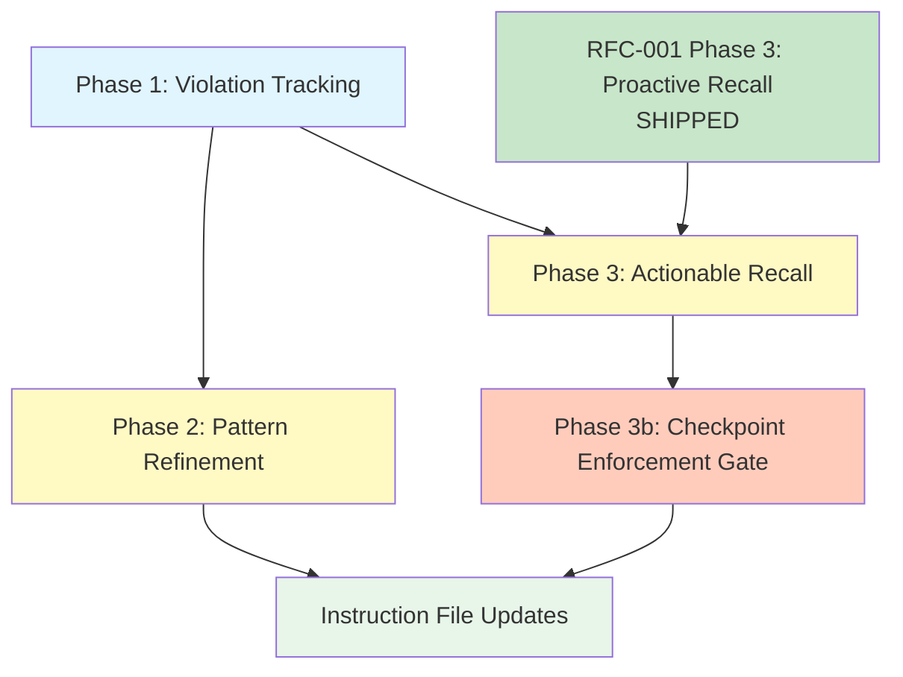

# RFC-002 — Learning Loop: Violation Tracking, Pattern Refinement, and Actionable Recall

## AI context

> This RFC adds a learning loop to episodic memory: structured violation tracking when behavioral patterns are broken, automatic detection of repeat failures to trigger pattern refinement, and actionable recall that surfaces relevant violations as pre-flight checks at session start. The current system stores and retrieves patterns but has no mechanism to learn from mistakes — violations are stored as ad-hoc episodes with no structure, no linking to the pattern that was violated, and no automatic surfacing when similar work begins.

---

## Problem

The episodic memory system can store behavioral patterns (bp-001 through bp-010) and recall them, but it cannot:

1. **Track violations structurally.** When a pattern is violated, the only option is to manually create a free-text episode. There is no `violation` category, no link to the violated pattern, no structured fields for what went wrong and what should have happened. This makes violations unsearchable as a class and unlinkable to their patterns.

2. **Detect repeat failures.** If bp-006 (push-after-verify) is violated three times across three sessions, the system doesn't notice. Each violation is an isolated episode. There is no aggregation, no threshold alerting, and no mechanism to suggest "this pattern needs stronger enforcement."

3. **Surface violations proactively.** At session start, `em-recall.mjs` (Phase 3 of RFC-001) will surface relevant past episodes. But it has no concept of "this user is about to do implementation work, and the last 3 implementation sessions violated the implementation workflow (bp-001) — show a warning." Violations should be surfaced as pre-flight checks, weighted higher than general context.

4. **Close the loop from violation to enforcement.** When a pattern is repeatedly violated, the system should suggest adding mechanical enforcement (CI, hook, PR template). Currently this connection is manual — the user has to notice the pattern of violations and decide to act.

---

## Proposal

Three phases, dependency-ordered. Each phase is independently shippable.

### Phase 1: Violation Tracking

**New category: `violation`**
- Add `violation` to `VALID_CATEGORIES` in `em-store.mjs`. Note: RFC-001 Phase 4 also adds `lesson` to the same array. Both additions are independent appends — order-safe, no coordination needed beyond avoiding merge conflicts on the same line.
- `violated_pattern` stored as a tag: `violated:bp-NNN-<slug>` — queryable via existing `tags.json`, no schema extension needed
- Structured fields (`violation_sequence`, `correct_sequence`) stored as markdown sections in the episode body, not indexed fields — they're for human reading, not querying

**Violation intake — user-flagged, not AI self-reported:**
- The primary intake mechanism is user-flagged: the user says "that was a violation of bp-006" or the AI offers "should I store this as a violation?"
- AI self-detection is unreliable — the 2026-05-01 session proved that AIs don't notice their own violations until caught. Self-reporting is aspirational, not required.
- `SessionEnd` hook prompts the user: "Were any behavioral patterns violated this session?" — user answers, AI stores if yes.

**bp-009 reconciliation:**
- Pattern bp-009 (store-violations-as-evidence) currently describes ad-hoc violation storage. Phase 1 updates bp-009 to reference the new `em-violation.mjs` script and structured fields, so the pattern and the tooling are aligned.

**New script: `scripts/em-violation.mjs` (~80 lines)**
- Convenience wrapper around `em-store.mjs` for structured violation storage
- Usage: `node em-violation.mjs --pattern <pattern_id> --summary "<what happened>" --body "<details>" [--sequence "<action1,action2>"] [--correct "<action1,action2>"]`
- Validates that `--pattern` exists in `patterns/_index.json` (checks `pattern_id` field in each entry). `tags.json` is the wrong source — a new pattern with zero violations would not appear there. On validation failure, lists all known pattern IDs in the error message.
- Auto-tags with: `violation`, `behavioral-pattern`, `violated:<pattern_id>` (e.g., `violated:bp-006-push-after-verify`)
- Outputs JSON: `{ status, id, violated_pattern, file }`

**Files modified:**
- `scripts/em-store.mjs` — add `violation` to `VALID_CATEGORIES`

**Files created:**
- `scripts/em-violation.mjs`
- `scripts/em-session-end-prompt.mjs` — SessionEnd hook script that prompts for violation flagging (so violations are capturable as soon as Phase 1 ships)

**Files modified:**
- `install.mjs` — copy `em-session-end-prompt.mjs` to `~/.episodic-memory/scripts/`. With `--install-hooks`: register as a `SessionEnd` hook in `~/.claude/settings.json` for Claude Code; document as manual step in instruction files for other tools. Hook registration requires explicit opt-in — installer never modifies `settings.json` without the flag.

### Phase 2: Pattern Refinement

**New script: `scripts/em-pattern-health.mjs` (~100 lines)**

Analyzes violation history per pattern and generates health reports.

- **Aggregation algorithm:** iterate `patterns/_index.json` entries. For each `pattern_id`, construct the tag `violated:<pattern_id>` and look it up in `tags.json` to get episode IDs. Filter those IDs by `category: violation` and date within the rolling window using `index.jsonl`. This is O(patterns × lookups), fine for ~10-20 patterns.
- For each behavioral pattern:
  - Flag patterns with 3+ violations in the last 30 days as "needs attention" (time-windowed threshold — a pattern violated 3 times in 3 years is healthy; 3 times in 30 days is alarm-worthy)
  - Flag patterns needing attention with no mechanical enforcement as "needs enforcement"
  - Threshold configurable via `--window-days` (default: 30) and `--min-violations` (default: 3)

**Health report output:**
```json
{
  "status": "ok",
  "patterns": [
    {
      "pattern_id": "bp-006-push-after-verify",
      "violations": 3,
      "last_violated": "2026-05-01",
      "days_since_created": 1,
      "has_enforcement": false,
      "recommendation": "needs-enforcement"
    }
  ],
  "summary": { "total": 10, "healthy": 8, "needs_attention": 1, "needs_enforcement": 1 }
}
```

**Enforcement detection:**
- Check if a pattern's `pattern_id` tag appears in any CI workflow file (`.github/workflows/*.yml`) or hook script (`~/.claude/hooks/*.sh`)
- Grep-based detection with heuristic: for each line containing the pattern_id, strip leading whitespace — if the line starts with `#` (YAML/shell comment), skip it. This is best-effort with known limitations: inline shell comments after code (`echo ok # bp-006`) would false-positive, and YAML anchors starting with `*` could false-negative. These edge cases are acceptable — the `--has-enforcement` override is the escape hatch.
- `has_enforcement: true` if found in at least one enforcement file in a code context
- Detection is best-effort — false negatives are acceptable (user can override with `--has-enforcement <pattern_id>`)

**Modes:**
- `--check` — exit 0 if all healthy, exit 1 if any need attention (for CI/hooks)
- `--pattern <id>` — report on a single pattern
- `--json` — full JSON output (default)
- `--summary` — one-line summary only

**Files created:**
- `scripts/em-pattern-health.mjs`

### Phase 3: Actionable Recall

**Modify `scripts/em-recall.mjs` (RFC-001 Phase 3, not yet built)**

**Schema note:** RFC-001 Phase 3 specifies recall output as a JSON array of episodes. This RFC wraps it in an object: `{ "preflight_warnings": [...], "episodes": [...] }`. RFC-001 Phase 3 should be implemented with this object wrapper from the start (adding `preflight_warnings` as an empty array) to avoid a breaking schema change later.

Add a violation-aware recall pass:

1. **Existing passes** (from RFC-001): project match, tag match, recent cross-project
2. **New pass: violation pre-flight** — Before the existing passes, check if any behavioral patterns relevant to the current task context have recent violations:
   - Infer task type from context (implementation → bp-001, bp-006; git push → bp-006; new rule → bp-010)
   - Search for violations of those patterns in the last 30 days
   - If found: prepend a `"preflight_warnings"` array to the recall output with violation summaries and pattern links

**Pre-flight output format:**
```json
{
  "preflight_warnings": [
    {
      "pattern_id": "bp-006-push-after-verify",
      "violations_last_30d": 3,
      "last_violation": "2026-05-01",
      "message": "bp-006 violated 3 times recently. Remember: complete all verification steps before pushing."
    }
  ],
  "episodes": [...]
}
```

**Task type inference:**
- Explicit: `--task-type <implementation|push|rule|general>` flag on recall — most reliable
- Automatic: keywords in git branch name (`git branch --show-current`, split on `/` and `-`)
- Mapping: `implement|build|feature|phase` → implementation patterns; `push|merge|pr` → push patterns; `rule|enforce|pattern` → meta patterns
- Falls back to **no pre-flight** when task type is unclear or unspecified — avoids false-positive warnings
- Pre-flight warnings are not suppressible in v1 (OQ-4 deferred — implement without `--no-preflight`, gather feedback first)

**Session-end violation prompt (hook-backed, not instruction-only):**
- `SessionEnd` hook calls a script that prompts: "Were any behavioral patterns violated this session?"
- If user confirms: AI stores a structured violation via `em-violation.mjs`
- If user declines or no response: skip — violations are user-flagged, not auto-detected
- This is NOT instruction-level behavior alone — a `SessionEnd` hook ensures the prompt happens mechanically, not by AI memory

**Files modified:**
- `scripts/em-recall.mjs` (RFC-001 Phase 3, shipped) — add pre-flight violation pass; automatically touch `.claude/.checkpoint-required` when bp-001 violations are detected (Phase 3b activation)

### Phase 3b: Checkpoint Enforcement Gate

**Motivation:** Across 3+ sessions, bp-001 was violated 6+ times despite documentation in CLAUDE.md, bp-001 v2.0.0, MEMORY.md, and session handoffs. The only mechanism that ever prevented a violation was `plan-gate.sh` (a PreToolUse hook). Documentation-based enforcement fails under momentum — only mechanical gates work (bp-010). Two distinct failure modes observed: (1) skipping the pre-implementation checkpoint before coding starts, and (2) skipping E2E testing + bug logging before pushing — steps 8 and 9 are skipped 100% of the time because they come after the work "feels done."

**New hook: `checkpoint-gate.sh`** — PreToolUse hook, follows `plan-gate.sh` architecture.

**Activation (mechanical, no AI judgment in activation path):**
- `em-recall.mjs` (Phase 3) detects recent bp-001 violations in pre-flight → automatically touches `.claude/.checkpoint-required`
- `em-recall.mjs` invoked mechanically via **SessionStart hook** (not instructions, not AI memory) to close the race condition where recall is never called
- Activation is fully script-driven — the AI does not decide whether to create the marker

**Gate behavior:**
- Blocks ALL write tools (Edit, Write, Bash) when `.checkpoint-required` exists AND `.pre-checkpoint-done` does NOT exist (or is empty)
- `.pre-checkpoint-done` must be **non-empty** (`[ -s "$MARKER" ]`) — the AI writes the Rule 18 checkpoint text into it, not just `touch`
- Allowlist: commands writing to `.pre-checkpoint-done` pass through the gate (prevents deadlock — same pattern as plan-gate.sh's `rm` allowlist)
- Error message is distinct from plan-gate.sh: "Checkpoint required. Print the Rule 18 pre-implementation checkpoint block to proceed."

**Push gate (post-implementation enforcement):**

Evidence from session 3: steps 8 (E2E) and 9 (bug logging) are skipped 100% of the time because they come **after the work feels done** — momentum carries the AI from "fix findings" straight to "commit and push." The checkpoint-gate catches the start of a task; the push-gate catches the end.

- `checkpoint-gate.sh` also blocks `git push` and `gh pr create` Bash commands when `.claude/.post-checkpoint-required` exists AND `.claude/.post-checkpoint-done` does not exist (or is empty)
- `.post-checkpoint-required` is touched by `checkpoint-gate.sh` on every allowed write (idempotent `touch`) — no "first edit" tracking needed. The marker's existence is what matters, not creation count.
- `.post-checkpoint-done` must be **non-empty** — AI writes the Rule 18 post-implementation checkpoint into it
- Allowlist: commands writing to `.post-checkpoint-done` pass through
- Error message: "Post-implementation checkpoint required. Complete E2E testing and bug logging, then print the Rule 18 post-implementation checkpoint block to proceed."
- Command matching for `git push` / `gh pr create`: match anywhere in the command string (not just start), since these are unlikely false positives in compound statements like `git push origin main && echo done`
- This enforces bp-006 (push-after-verify) mechanically — no push until E2E + bug logging + post-checkpoint are done

**Limitations:**
- The push-gate only works within Claude Code sessions (PreToolUse hook). Pushing from a separate terminal, Git GUI, or outside the session bypasses it. If true enforcement is needed, escalate to a Git pre-push hook or CI check — consistent with bp-010 philosophy.
- If `git push` fails after markers are cleaned (cleanup happens before push executes in PreToolUse), the gate is disarmed for the rest of the session. Accepted as pragmatic trade-off — push failure is rare and the alternative (PostToolUse cleanup) adds significant complexity for minimal benefit.

**State machine (4 markers):**
```
idle → .checkpoint-required (em-recall detects violations)
     → .pre-checkpoint-done (AI prints pre-checkpoint)
       + .post-checkpoint-required (touched on every allowed write)
     → .post-checkpoint-done (AI prints post-checkpoint)
     → idle (push allowed, all markers cleaned)
```
Orphaned states (e.g., `.post-checkpoint-required` without `.checkpoint-required`) are cleaned by SessionEnd sweep.

**Cleanup (two mechanisms):**
- `SessionEnd` hook removes all markers (`.checkpoint-required`, `.pre-checkpoint-done`, `.post-checkpoint-required`, `.post-checkpoint-done`) as end-of-session sweep. Extends `em-session-end-prompt.mjs` from Phase 1 (single script, multiple responsibilities: violation prompt + marker cleanup).
- `checkpoint-gate.sh` itself (PreToolUse) cleans up all markers when it detects and allows through a `git push` or `gh pr create` command (task completed). This is the same hook that does the gating — no additional PostToolUse hook needed.

**Interaction with plan-gate.sh:**
- Two independent PreToolUse hooks, compose correctly (both block independently)
- If both markers exist, user sees two distinct error messages
- Implementation may evaluate merging into a single `write-gate.sh` (F-10) — decide during implementation, document the rationale either way

**SessionStart hook for em-recall:**
- New or extended SessionStart hook: `node ~/.episodic-memory/scripts/em-recall.mjs --project <inferred> --limit 5`
- Output displayed to AI at session start — pre-flight warnings surface immediately
- If pre-flight detects bp-001 violations → `.checkpoint-required` created before any user interaction
- Registered via `install.mjs --install-hooks` (same opt-in pattern as SessionEnd)

**Files created:**
- `checkpoint-gate.sh` — PreToolUse hook (gating + push-triggered cleanup)
- `em-session-start-recall.mjs` — SessionStart hook script invoking `em-recall.mjs`

**Files modified:**
- `scripts/em-recall.mjs` — add `.checkpoint-required` marker creation when bp-001 violations detected
- `scripts/em-session-end-prompt.mjs` — extend with marker cleanup (all 4: `.checkpoint-required`, `.pre-checkpoint-done`, `.post-checkpoint-required`, `.post-checkpoint-done`)
- `install.mjs` — register checkpoint-gate (PreToolUse) + SessionStart hooks with `--install-hooks`
- `patterns/implementation-workflow.md` — add checkpoint-gate to bp-001 enforcement table (not a new pattern bp-012)

**Depends on:** Phase 3 (violation-aware recall output)

### Instruction file updates

Update instruction files incrementally as each phase ships (do not batch to the end):
- `instructions/SKILL.md` — violation tracking, pattern health, pre-flight recall
- `instructions/cursor.mdc`
- `instructions/AGENTS.md`
- `instructions/windsurf.md`

### Scope

- **In scope:** violation category, structured violation storage, pattern health reports, violation-aware recall, pre-flight warnings, checkpoint enforcement gate (mechanical hook blocking code edits until checkpoint printed), SessionStart hook for recall invocation, session-end violation prompt via `SessionEnd` hook, bp-009 reconciliation
- **Out of scope:** automatic violation detection (AI cannot reliably self-detect — see Problem section), punishment/penalty mechanisms, cross-user violation sharing, violation severity levels, automated pattern rewriting

---

## Alternatives considered

| Alternative | Why rejected |
|---|---|
| Automatic violation detection via code analysis | Requires understanding intent, not just actions — too complex for zero-dep scripts; 2026-05-01 session proved AIs don't reliably self-detect violations |
| AI self-reporting as primary intake | Unreliable — the whole problem is AIs don't notice their own violations until caught; user-flagged is the primary mechanism |
| Violation severity levels (minor/major/critical) | Over-engineering — binary "violated or not" is sufficient; frequency and recency already provide signal |
| Automated pattern rewriting when violations are frequent | Patterns should be refined by humans; automated rewriting risks weakening the pattern instead of strengthening enforcement |
| Store violations as unstructured free-text episodes with no tag conventions | Loses aggregation — without a `violated:<pattern_id>` tag convention, violations cannot be linked to patterns or counted by health checks; ad-hoc text makes pattern-level reporting impossible |
| Integrate with external incident tracking (Jira, Linear) | Violates zero-dep constraint; GitHub Issues is already the bug tracker |
| Penalty scoring (reduce AI confidence after violations) | Punitive mechanisms don't improve behavior; pre-flight warnings and enforcement suggestions are constructive alternatives |
| Fixed violation count threshold (3+, no time window) | A pattern violated 3 times in 3 years is healthy; 3 times in 30 days is alarm-worthy; time-windowed threshold is more meaningful |
| Instruction-only session-end prompt (no hook) | Unverifiable — without a hook, the prompt depends on AI memory which is unreliable; SessionEnd hook ensures it happens mechanically |

---

## Implementation plan

> Populate this section when the RFC moves to `accepted`.

### Acceptance tests (per phase)

**Phase 1:**
- [x] `violation` category accepted by `em-store.mjs`
- [x] `em-violation.mjs` stores structured violation with pattern linkage via `violated:<pattern_id>` tag
- [x] `em-violation.mjs` validates pattern exists in `patterns/_index.json` (not `tags.json`)
- [x] `em-violation.mjs` rejects unknown pattern_id with error listing known patterns
- [x] `em-violation.mjs` auto-tags with `violation`, `behavioral-pattern`, and `violated:<pattern_id>`
- [x] Violation episodes searchable by `--category violation` and `--tag violated:<pattern_id>`
- [x] bp-009 updated to reference `em-violation.mjs` and structured fields
- [x] `em-session-end-prompt.mjs` hook script created and functional

**Phase 2:**
- [ ] `em-pattern-health.mjs` counts violations per pattern within rolling time window
- [ ] `em-pattern-health.mjs` flags patterns with 3+ violations in last 30 days (configurable)
- [ ] `em-pattern-health.mjs` detects enforcement presence (skips comment lines starting with `#`)
- [ ] `--check` exits 1 when patterns need attention
- [ ] `--pattern <id>` reports on single pattern
- [ ] `--window-days` and `--min-violations` override defaults
- [ ] `--summary` outputs one-line summary
- [ ] `--has-enforcement <pattern_id>` override marks pattern as enforced regardless of detection
- [ ] "needs-enforcement" vs "needs-attention" distinction correct (attention + no enforcement = needs-enforcement)

**Phase 3:**
- [ ] Recall includes `preflight_warnings` when violations exist for task-relevant patterns
- [ ] Pre-flight surfaces violation count and last violation date
- [ ] No pre-flight when no violations exist or task type unclear (clean output)
- [ ] `--task-type` flag for explicit task context
- [ ] Keyword inference from git branch name as fallback (not "current file context" — CLI has no IDE context)
- [ ] SessionEnd hook prompts user for violation flagging (not instruction-only)
- [ ] `em-recall.mjs` automatically touches `.claude/.checkpoint-required` when bp-001 violations detected

**Phase 3b:**
- [ ] `checkpoint-gate.sh` blocks all write tools when `.checkpoint-required` exists and `.pre-checkpoint-done` is absent or empty
- [ ] Non-empty `.pre-checkpoint-done` unblocks writes
- [ ] Empty `.pre-checkpoint-done` (just `touch`) does NOT unblock
- [ ] Write command to `.pre-checkpoint-done` allowed through (no deadlock)
- [ ] SessionEnd hook cleans up all 4 markers
- [ ] No gate when `.checkpoint-required` absent
- [ ] Error message distinguishable from plan-gate.sh
- [ ] SessionStart hook invokes `em-recall.mjs` mechanically
- [ ] bp-001 enforcement table updated with checkpoint-gate
- [ ] `install.mjs --install-hooks` registers checkpoint-gate + SessionStart hooks
- [ ] Both plan-gate and checkpoint-gate active simultaneously — user sees two distinct error messages
- [ ] `em-session-end-prompt.mjs` cleans up all markers at session end (extends Phase 1 script)
- [ ] `.post-checkpoint-required` touched on every allowed write through pre-checkpoint gate (idempotent)
- [ ] `git push` blocked when `.post-checkpoint-required` exists and `.post-checkpoint-done` absent/empty
- [ ] Non-empty `.post-checkpoint-done` unblocks push
- [ ] Empty `.post-checkpoint-done` does NOT unblock push
- [ ] Write command to `.post-checkpoint-done` allowed through (no deadlock)
- [ ] `git push` / `gh pr create` allowed through cleans up all 4 markers
- [ ] Push-gate error message: mentions E2E, bug logging, and post-implementation checkpoint
- [ ] `gh pr create` also blocked by push-gate (not just `git push`)
- [ ] Push failure after marker cleanup does not re-engage gate (documented limitation)
- [ ] Orphaned markers (e.g., `.post-checkpoint-required` alone) cleaned by SessionEnd
- [ ] SessionStart hook produces `.checkpoint-required` before any user interaction (flow test)

### Sequencing



> **Hard dependency:** Phase 3 extends `em-recall.mjs` (RFC-001 Phase 3, now shipped). Phase 3b depends on Phase 3's pre-flight output. Phases 1 and 2 have no external blockers.

---

## Implementation

> Populate during build stage — mark each item immediately after it ships.

| PR/Commit | Files changed | Tests | Notes |
|---|---|---|---|
| Phase 1: Violation Tracking | `em-store.mjs`, `em-violation.mjs` (new), `em-session-end-prompt.mjs` (new), `install.mjs`, bp-009 | 17 Phase 1 tests + 51 existing = 68 passed | Shells out to em-store (no SYNC copies). execFileSync for safety. Scope validation. Pattern validation with global fallback. Bugs: #19 (cmd injection), #20 (usage msg). |

---

## Related RFCs

- RFC-001 — Memory Improvements (Phase 3: Proactive Recall is extended by this RFC's Phase 3)

---

## Second opinion

> Required before `status: accepted` can be set.

### Review 1 — Claude Opus 4.6
**Reviewer:** Claude Opus 4.6 (Explore subagent, independent context)
**Date:** 2026-05-01
**Findings:** Nine findings (3 P1, 3 P2, 3 P3). All addressed in revision:
1. (P1) Self-reporting contradiction — AI self-detection is unreliable; changed primary intake to user-flagged with SessionEnd hook prompt
2. (P1) Dependency on em-recall.mjs — added explicit hard blocker notation for RFC-001 Phase 3 in sequencing diagram
3. (P1) OQ-3 decided but listed as open — kept truly open with both options documented; marked as Phase 1 blocker
4. (P2) Enforcement detection too fragile — added code-context validation requirement
5. (P2) Task type inference fails silently — added explicit `--task-type` flag, default to no pre-flight when unclear
6. (P2) 3-violation threshold unjustified — changed to time-windowed (3+ in 30 days), configurable
7. (P3) Pre-flight suppressibility — deferred to post-Phase 3 feedback
8. (P3) Session-end self-reporting unverifiable — changed from instruction-only to SessionEnd hook-backed
9. (P3) bp-009 overlap — added reconciliation to Phase 1 acceptance tests
**AI-slop check:** clean
**Decision:** proceed (after revision applied)

### Review 2 — Claude Opus 4.6
**Reviewer:** Claude Opus 4.6 (independent context, general-purpose subagent)
**Date:** 2026-05-01
**Findings:** Thirteen findings (3 P1, 6 P2, 4 P3). All P1s and P2s addressed in revision:
1. (P1) VALID_CATEGORIES coordination with RFC-001 P4 — added note that both are independent appends, order-safe
2. (P1) Pattern validation against wrong source (`tags.json` → `patterns/_index.json`) — fixed; error message lists known patterns
3. (P1) Tag `violated:<id>` lookup algorithm unspecified for Phase 2 health — added: iterate `_index.json`, construct tag, look up in `tags.json`, filter by date
4. (P2) Enforcement detection heuristic undefined — specified: skip lines starting with `#` after whitespace strip; documented known limitations
5. (P2) RFC-001 P3 output schema incompatibility — added schema note: RFC-001 P3 should use object wrapper from the start
6. (P2) SessionEnd hook phase ambiguity — clarified: hook script created in Phase 1 (Files created)
7. (P2) Six acceptance test gaps — added tests for auto-tagging, `--summary`, `--has-enforcement`, needs-enforcement distinction, keyword inference, session-end hook
8. (P2) OQ-2 effectively resolved but marked open — resolved as on-demand
9. (P2) Alternatives table row contradicts adopted tag approach — rewritten for unstructured free-text alternative
P3s deferred to implementation (stored in episodic memory): F-9 (error UX), F-10 (markdown template), F-11 (data-driven task mapping), F-13 (dependency phrasing)
**AI-slop flag:** "current file context" in task inference was vague for a CLI script — replaced with git branch keyword inference only
**AI-slop check:** clean after revision
**Decision:** proceed (after revision applied)

### Review 3 — Claude Opus 4.6 (Phase 3b amendment)
**Reviewer:** Claude Opus 4.6 (Plan subagent, independent context)
**Date:** 2026-05-01
**Scope:** Phase 3b checkpoint-gate amendment review
**Findings:** Ten findings (3 P1, 5 P2, 2 P3). All P1s and P2s addressed in amendment:
1. (P1) Does not belong in Phase 3 proper — restructured as Phase 3b with own acceptance tests
2. (P1) Race condition if em-recall not invoked — added SessionStart hook for mechanical invocation
3. (P1) Marker creation must be script-driven not AI-driven — em-recall.mjs touches marker automatically
4. (P2) Hardcoded extensions miss .yml/.json — gate all write tools (like plan-gate)
5. (P2) Empty marker allows shortcutting — require non-empty `.pre-checkpoint-done`
6. (P2) Two hooks need distinct error messages — documented, distinct messages specified
7. (P2) Cleanup timing unspecified — SessionEnd + push-triggered cleanup
8. (P2) Deadlock risk — allowlist pattern from plan-gate.sh
9. (P3) Not a new pattern bp-012 — added to bp-001 enforcement table instead
10. (P3) Consider merging into single write-gate.sh — evaluate during implementation
**AI-slop check:** clean
**Decision:** proceed (after revision applied)

---

## Open questions

| # | Question | Owner | Status |
|---|---|---|---|
| OQ-1 | Should `em-violation.mjs` be a separate script or a `--violation` flag on `em-store.mjs`? | — | resolved — separate script; mirrors `em-revise.mjs` pattern, keeps `em-store.mjs` focused |
| OQ-2 | Should pattern health run automatically at session start, or only on demand? | — | resolved — on-demand with `--check` for CI/hooks; Phase 2 spec already implements this; session-end prompt covers the discipline gap |
| OQ-3 | How should `violated_pattern` be stored? Tags vs frontmatter field. | — | resolved — tag-based (e.g., `violated:bp-006-push-after-verify`); queryable via existing `tags.json`, no schema extension needed; structured fields like `violation_sequence` stored as markdown sections in episode body |
| OQ-4 | Should pre-flight warnings be suppressible? Deferred to after Phase 3 ships — implement without `--no-preflight` first, gather user feedback, add flag in a follow-up if needed. | — | open (deferred) |
| OQ-5 | Should the `SessionEnd` hook for violation prompting be part of the episodic-memory installer, or part of the user-preferences installer? | — | resolved — episodic-memory installer; the hook calls `em-violation.mjs` which is an episodic-memory script; aligns with bp-005 (enforcement lives in consuming repos) |

---

## Deferral note

> Populate only if status changes to `deferred`.

---

## Withdrawal note

> Populate only if status changes to `withdrawn`.

---

## Supersession note

> Populate only if status changes to `superseded`.

Superseded by: `RFC-NNN-<new-slug>`
