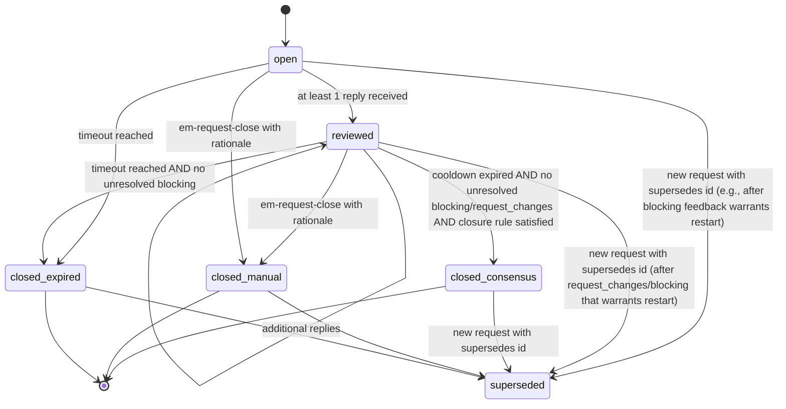
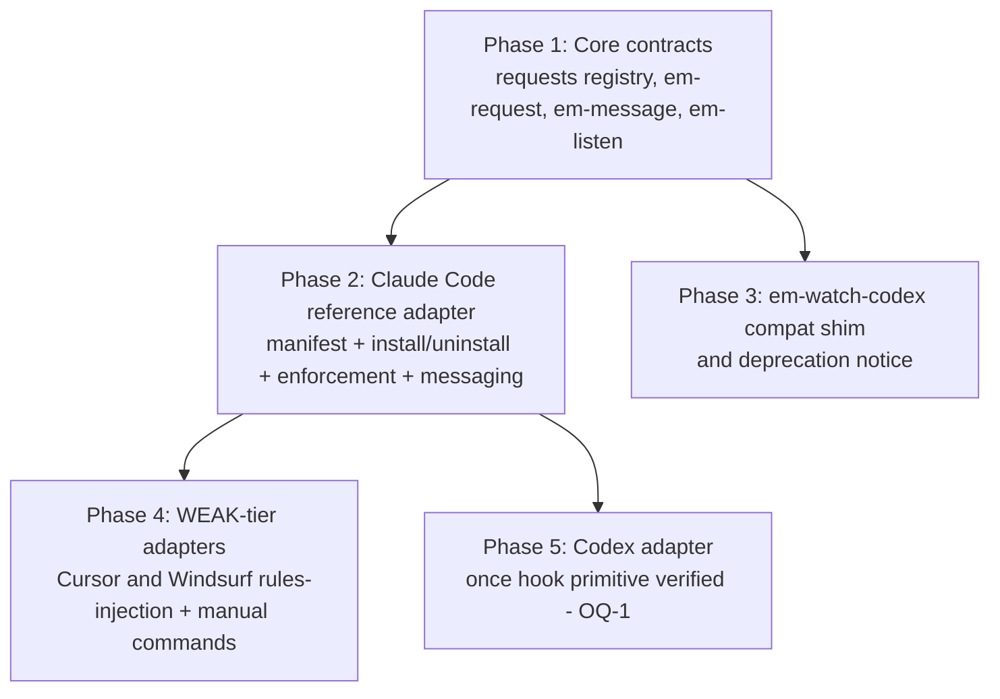

# RFC-003 — Pluggable Tool Adapters: Per-Platform Enforcement and Cross-Tool Messaging

## AI context

> This RFC introduces a pluggable adapter architecture so per-tool enforcement (Claude Code hooks, Codex hooks) and cross-tool messaging (Codex review requests, Cursor inbox reminders) become opt-in capabilities under a shared core contract — not features bolted into the core scripts. It supersedes the Claude-Code-specific runtime design of RFC-002 Phase 3b (which had quietly drifted away from the cross-tool pitch of this repo) and formalizes the previously informal pattern of using episodes as a cross-tool message bus. The one trade-off worth knowing: enforcement strength is unequal across tools (STRONG hooks vs WEAK rules injection), and the RFC codifies that asymmetry rather than papering over it.

---

## Problem

Three connected gaps in the existing design:

1. **RFC-002 Phase 3b is Claude-Code-specific.** The accepted spec assumes `~/.claude/settings.json`, `PreToolUse` hooks, and `~/.claude/hooks/*.sh`. None of that is portable to Codex, Cursor, or Windsurf. This contradicts the repo's stated cross-tool positioning ("scripts/ — Core .mjs scripts, tool-agnostic, zero deps") and forces an unwelcome choice: ship Phase 3b as an exception (bloating the cross-tool story) or block it (losing the only enforcement that has been shown to work for bp-001 violations).

2. **Cross-tool messaging is an informal pattern with no contract.** `em-watch-codex.mjs` polls the local episode store for episodes tagged `codex | codex-review | codex-reply`. The pattern works, but it is undocumented as a primitive, has no taxonomy of request types, no required-context validation (multi-worktree drift goes silent), no lifecycle (requests stay "open" indefinitely), and uses polling — which burns tokens on emptiness in violation of the "tokens are the budget" principle.

3. **Worktree drift is undetected at the receiver.** A reviewer running in the main repo can read stale or wrong files when the requester is in a worktree. Issue [#64](https://github.com/lantisprime/episodic-memory/issues/64) (filed during this RFC's review) is a concrete instance: the original review request for *this RFC* landed in a worktree's local store, invisible to a watcher rooted at the main repo. Without a structured envelope (worktree, branch, head) and reply-side echo, this class of bug is silent.

These three gaps share a common solution: a per-tool adapter contract that handles both enforcement and messaging, with a closed registry of request types, a structured envelope, and an event-driven (not polled) message delivery model.

---

## Proposal

### Scope

- **In scope:**
  - Adapter contract (manifest + capabilities + side effects + ownership)
  - Closed request taxonomy registry (`requests/<type>.json`)
  - Message envelope schema with reply chains and inspected-context echo
  - Event-driven messaging substrate (`fs.watch` for live wait; lifecycle hooks for resume notify)
  - Request lifecycle state machine (`open → reviewed → closed`) with strict closure semantics
  - Migration path: `em-watch-codex` → `em-listen` + session-start sweep
  - Claude Code as the reference adapter (subsuming the runtime portion of RFC-002 Phase 3b)
  - 2D capability matrix (enforcement × messaging) per tool

- **Out of scope:**
  - Generic IPC (sockets, message brokers, web servers)
  - Daemon orchestration or anything that runs continuously in the background
  - Tool automation that doesn't reduce to store / recall / react
  - User-facing UI for managing requests
  - Codex hook primitive verification — capability tier marked TBD/MEDIUM until proven (OQ-1)

### Principles reference

This RFC inherits and applies the principles in [PRINCIPLES.md](../../PRINCIPLES.md). The most load-bearing for this design:

- **P1 Memory is the substrate** — messaging uses episode primitives; no bespoke IPC
- **P2 Behavior definitions are data** — request types are JSON; adapter logic is `.mjs` behind a stable contract
- **P3 Detect automatically; activate explicitly** — adapter installation is opt-in with a consent prompt
- **P5 Cross-platform with honest capability labels** — capability matrix is the source of truth on per-tool tier
- **P6 Tokens are the budget; bounded background work** — `fs.watch` over polling; lifecycle-gated sweeps over timers
- **P7 State changes are episodes** — request lifecycle transitions recorded as episodes
- **P8 Messages carry their context and recipient** — review-class envelopes require `worktree+branch+head` and `recipient`
- **P9 Core never imports adapters** — one-way dependency
- **P10 Consent and reversibility** — install/uninstall driven by side-effect manifest
- **P11 Portable core contract** — decision logic in core; adapters translate

### Adapter contract

Each adapter is a directory under `adapters/<tool>/`:

```
adapters/<tool>/
  manifest.json              # capabilities + side effects + ownership
  install.mjs                # idempotent; writes only declared side effects
  uninstall.mjs              # removes only owned artifacts; fails loud on divergence
  capabilities/
    enforcement.mjs          # only present if enforcement capability declared
    messaging.mjs            # only present if messaging capability declared
```

Capabilities are **separate** under one manifest, not paired responsibilities. A tool may support inbox messaging at MEDIUM tier but only WEAK enforcement (Cursor), or vice versa.

#### Manifest schema (illustrative — Claude Code)

```json
{
  "tool": "claude-code",
  "version": "1.0.0",
  "compatible_tools": ["claude-code"],
  "requires": { "node": ">=18" },
  "capabilities": {
    "enforcement": { "tier": "strong", "status": "verified" },
    "messaging.live_wait": { "tier": "strong", "status": "verified" },
    "messaging.resume_notify": { "tier": "strong", "status": "verified" }
  },
  "lifecycle_hooks": ["SessionStart", "PreToolUse"],
  "side_effects": [
    {
      "ownership_id": "em-gate-hook",
      "type": "settings_write",
      "path": "~/.claude/settings.json",
      "section": "hooks.PreToolUse",
      "checksum": "<sha256-of-injected-block>",
      "backout_action": "remove_section"
    },
    {
      "ownership_id": "em-gate-script",
      "type": "file_create",
      "path": "~/.claude/hooks/em-gate.sh",
      "checksum": "<sha256-of-file>",
      "backout_action": "delete_file"
    }
  ],
  "installed_state": "~/.episodic-memory/adapters/claude-code.installed.json"
}
```

#### Capability tiers

| Tier | Meaning |
|---|---|
| `strong` | Hard mechanical enforcement (block-on-fail hooks) or real-time event delivery (`fs.watch`) |
| `medium` | Lifecycle-gated checks (e.g., session-start inbox sweep) or manual command (`/em-check`) |
| `weak` | Prompt-injection only (rules files), no programmatic enforcement |
| `tbd` | Capability is plausible but the underlying primitive has not been verified |

#### Capability status

| Status | Meaning |
|---|---|
| `verified` | Tested end-to-end against the real tool |
| `experimental` | Implemented but not yet verified in production |
| `manual` | User-driven (e.g., manual slash command); no programmatic activation |

#### Install / uninstall flow

The **core installer** (extension of `install.mjs`) drives both. Adapter scripts are invoked by the installer; they do not run standalone. This satisfies P10 by ensuring a uniform consent prompt across adapters.

1. `install.mjs --tool <name>` reads `adapters/<tool>/manifest.json`.
2. Presents `side_effects` as a confirmation prompt: *"Will write the following — confirm?"*
3. On confirm, runs `adapters/<tool>/install.mjs`, which writes the declared artifacts and computes/records checksums in `installed_state`.
4. Records an install **episode** (P7) with category `adapter.install` and the manifest version.

Uninstall is the reverse:

1. Reads `installed_state` for ownership IDs and recorded checksums.
2. For each side effect, verifies the artifact still matches the recorded checksum.
3. If matching, applies `backout_action`. If divergent, prints a diff and exits non-zero — does not silently overwrite user edits.
4. Records an uninstall episode.

This satisfies "consent and reversibility" honestly: we only undo what we own, and we fail loud when state has diverged.

### Request taxonomy registry

Closed registry under `requests/`. Typed dispatch (`em-request <type>`, `em-message <type>`) only accepts known types.

```
requests/
  _index.json
  review.code.json
  review.discovery.json
  review.security.json
  review.spec.json
  review.generic.json
  question.factual.json
  question.opinion.json
  ack.received.json
  ack.resolved.json
  notify.event.json
  coordinate.handoff.json
  coordinate.consensus.json
  status.update.json
  status.heartbeat.json
  decision.recorded.json
```

Each entry declares required envelope fields, reply schema (verdict enum, required echo fields), and closure rules.

#### Example: `requests/review.code.json`

```json
{
  "type": "review.code",
  "required_fields": ["worktree", "branch", "head", "target"],
  "reply_schema": {
    "required": ["verdict", "inspected.worktree", "inspected.head"],
    "verdict": ["approve", "comment", "request_changes", "blocking", "discuss"]
  },
  "closure": {
    "rule": "consensus",
    "consensus_verdict": "approve",
    "min_reviewers": 1,
    "cooldown": "24h",
    "blocked_by": ["blocking", "request_changes"]
  }
}
```

#### Validation boundary

| Command | Validation behavior |
|---|---|
| `em-store` (no `--type`) | No registry validation; stores plain episode; not auto-routed |
| `em-store --type <registered>` | Validates against registry schema; rejects on missing required fields |
| `em-store --type <unknown>` | Rejects with `unknown type X; known types: [...]` |
| `em-request <type>` / `em-message <type>` | Always validates and routes (purpose-built) |
| No `--type` at all | Stored as plain episode; not auto-routed by typed dispatch |

Validation logic lives in **core** request/message modules (P9 — core never imports adapters). Every tool sees identical schema behavior.

**Routing fields (`recipient`) are validated alongside context fields.** Typed requests must declare exactly one form of `recipient` (specific `tool`, `audience` list, `tier` selector, or `broadcast: true`); registry validation rejects requests with no recipient or multiple forms. Adapters use `recipient` to filter their inbox without scanning every episode (P6).

### Message envelope

Every typed request and reply carries a structured envelope. For review-class types, envelope fields are mandatory and validated at write time (P8).

```yaml
---
id: <auto-generated>
date: <ISO date>
project: <project name>
category: <discovery | context | ...>
type: review.code               # registry type — triggers validation
tags: [...]
---

# <Summary line>

requester:
  tool: claude-code
  agent: opus-4.7

recipient:                       # who the request is addressed to (exactly one form)
  tool: codex                    #   specific tool, OR
  # audience: [codex, cursor]    #   list of tools, OR
  # tier: strong                 #   any tool of given enforcement tier, OR
  # broadcast: true              #   all installed adapters

context:                         # required for review-class
  worktree: <absolute path>
  branch: <name>
  head: <short SHA>
  target: <PR# | files | ref..ref>

ask: <free text>

reply_to: <episode_id>          # for replies — references prior episode
inspected:                       # reply only — echoes what reviewer actually saw
  worktree: <absolute path>
  head: <short SHA>
  store: <main | worktree>      # which episode store the reviewer read from

verdict: approve | comment | request_changes | blocking | discuss   # reply only
```

**Drift detection.** When a reply arrives, the requester compares `inspected.worktree` and `inspected.head` against the request's `context`. Mismatch flags the reply as potentially confused. This is the receiver-side check that issue [#64](https://github.com/lantisprime/episodic-memory/issues/64) demonstrates is needed.

### Reply chains

- A reply references its target via `reply_to: <episode_id>`.
- Multiple replies to the same request are allowed (multi-reviewer scenario).
- Replies to closed requests are accepted but tagged `late: true`. They do not reopen the request.
- Reopening is **not** first-class. A new request that supersedes a closed one (`supersedes: <closed_id>`) is the recommended path. This keeps the audit trail clean (P7).

### Event-driven messaging

The substrate is files. Two delivery scenarios, two mechanisms.

| Scenario | Mechanism | Cost |
|---|---|---|
| **Live wait** — requester sent a message, waiting in-session for reply | `fs.watch` on the inbox dir, in-process; resolves when reply file lands or closure occurs | ~0 tokens; single short-lived watcher |
| **Resume notify** — replies arrived between sessions | Tool's lifecycle hook on session start checks inbox once; injects "N pending replies" | One inbox read per session start |

No daemon. No timer. No continuous polling (P6).

#### `fs.watch` reliability (specced, not deferred)

`fs.watch` on macOS has known issues with atomic-rename writes — and this repo uses temp + rename for episode writes. The implementation must:

1. **Watch the parent directory**, not the target file (file-level watches lose the rename).
2. **Re-watch on `rename` events** to handle the post-rename inode change.
3. **Fall back to a periodic rescan** (lifecycle-gated, e.g., on each session start) for environments where `fs.watch` is unreliable: remote dev containers, restricted shells, network filesystems.

#### Migration: `em-watch-codex` → `em-listen` + session-start sweep

`em-watch-codex.mjs` polls. Replace with:

- `em-listen.mjs` — `fs.watch`-based; exits when a matching reply arrives or timeout. Live-wait scenario.
- A session-start hook script (per-adapter) that runs one inbox sweep at session start. Resume-notify scenario.

`em-watch-codex.mjs` stays as a **one-release compatibility wrapper** with a deprecation banner, then is removed once `em-listen` proves reliable in practice. Adapters that still need polling (e.g., environments without `fs.watch`) can keep using it during the transition (OQ-2 — full deprecation timeline).

### Request lifecycle



Each transition is a separate episode (P7). The original request is never edited.

#### Closure semantics

- **Cooldown trigger:** `time-since-last-reply` (any reply, blocking or not, resets the clock).
- **Default cooldown:** 24h, configurable per request type in the registry.
- **Blocking detection:** Dedicated `verdict` field. Values: `approve | comment | request_changes | blocking | discuss`. No prose inference.
- **Auto-close conditions** (all must hold):
  1. Cooldown has expired.
  2. Zero unresolved `blocking` verdicts.
  3. Zero unresolved `request_changes` verdicts.
  4. Registry closure rule is satisfied (e.g., `min_reviewers: 1` with `consensus_verdict: approve`).
- **Auto-close trigger:** Lifecycle-gated sweep (session-start hook). Never timer-driven (P6).
- **Blocking arrival during cooldown:** State stays `reviewed`; sets `close_blocked=true` and `unresolved_count > 0`. Does **not** transition back to `open` — if the feedback warrants a restart, create a new request with `supersedes: <id>`. The original transitions to `superseded` directly from `reviewed`; no need to close first.
- **Manual close:** `em-request-close <id> --rationale "..."` records explicit closure with rationale. Allowed in any non-closed state.

Closure work runs as a **sweep** that checks all open/reviewed requests against their auto-close conditions and applies closure (or `close_blocked`/`unresolved_count` updates) where eligible. STRONG-tier adapters trigger the sweep automatically on lifecycle events (e.g., `SessionStart`). For installs with no STRONG-tier adapter active (e.g., Cursor- or Windsurf-only), the same sweep logic is exposed as a manual CLI command (`em-request-sweep` — runs once, applies any eligible transitions, exits). Users or shell hooks can invoke it on whatever cadence makes sense. The sweep logic itself lives in core (P9); adapters only choose when to invoke it. No daemons (P6).

### Capability matrix (current targets)

| Tool | Enforcement | Live wait | Resume notify |
|---|---|---|---|
| Claude Code | STRONG (verified — `PreToolUse` hooks) | STRONG (`fs.watch` in-process) | STRONG (`SessionStart` hook) |
| Codex | TBD/MEDIUM (manual until hook primitive verified — OQ-1) | STRONG (`fs.watch` in-process) | TBD (session-equivalent hook) |
| Cursor | WEAK (`.cursor/rules` injection) | MEDIUM (manual `/em-check` slash command — OQ-5) | MEDIUM (rules-injected reminder at convo start) |
| Windsurf | WEAK (`.windsurfrules`) | MEDIUM (manual command) | MEDIUM (rules-injected reminder) |

**This matrix is documentation, not a manifest field.** Each adapter manifest declares only its own capabilities (per the Claude Code example in [Adapter contract](#adapter-contract)). The aggregated matrix above is derived from all installed adapters' manifests for documentation and comparison purposes — it is not owned by any single adapter and never serializes back into a manifest. As Codex's hook primitive is verified or Cursor/Windsurf grow new surfaces, individual manifests update; this matrix is regenerated from them.

---

## Alternatives considered

| Alternative | Why rejected |
|---|---|
| **Status quo** — ship Phase 3b runtime in this repo as Claude-Code-specific | Violates the repo's "tool-agnostic, zero deps" convention. Cursor/Codex/Windsurf users get dead Claude-Code-only files. Conflates a memory product with personal workflow. |
| **Optional install flag** (`--with-claude-gates`) | The real problem isn't the flag itself — it's that Claude-Code-specific runtime would remain a first-class path in the core repo instead of becoming an opt-in adapter. The pluggable-adapter approach makes Claude Code one of N peers, not the privileged default. |
| **Sibling plugin repo** (`episodic-memory-claude-gates`) | Pragmatic and was the leading alternative. Rejected because it splits the cross-tool story and creates two-repo version-bump coordination overhead. The pluggable-adapter approach achieves the same isolation in one repo. |
| **Personal dotfiles only** | Phase 3b enforcement becomes the user's alone; nobody else benefits. Doesn't address the underlying need: cross-tool memory needs a cross-tool messaging contract regardless of who installs it. |
| **Generic memory→action interface, fully separate adapters with no shared installer** | Closest in spirit to this RFC. Effectively the same architecture, but with no shared install/uninstall infrastructure. Rejected because the consent/reversibility principle (P10) requires a unified installer that knows about side effects across adapters. |

---

## Implementation plan

> Populated post-acceptance. Phase ordering follows dependency: contract first, then reference adapter, then migration, then WEAK-tier and Codex adapters.

### Sequencing



### Phase 1: Core contracts (no adapters)

- `requests/_index.json` and per-type `requests/<type>.json` files
- `scripts/em-request.mjs` — typed request dispatch with envelope validation (context + recipient)
- `scripts/em-message.mjs` — typed message dispatch (non-request flows)
- `scripts/em-listen.mjs` — `fs.watch`-based live-wait with rename handling and rescan fallback
- `scripts/em-request-status.mjs` — lifecycle inspection + auto-close eligibility check
- `scripts/em-request-close.mjs` — explicit closure with rationale
- `scripts/em-request-sweep.mjs` — manual sweep so installs without a STRONG-tier adapter can manage lifecycle
- **Store-root resolution policy** for `em-store --scope local` (resolves issue [#64](https://github.com/lantisprime/episodic-memory/issues/64) — OQ-6). Decided in this phase because typed requests must land in a consistent store regardless of cwd; deferring would mean Phase 1 ships requests that still go invisible from worktrees.
- Validation logic in core (every tool sees same schema behavior — P9)
- Tests: registry validation, envelope round-trip with recipient routing, lifecycle transitions including `open → superseded` and `reviewed → superseded`, drift detection, `fs.watch` rename handling, store-root resolution from worktree cwd

### Phase 2: Claude Code reference adapter

- `adapters/claude-code/manifest.json`
- `adapters/claude-code/install.mjs` — idempotent; writes only declared side effects; records checksums
- `adapters/claude-code/uninstall.mjs` — fails loud on checksum divergence
- `adapters/claude-code/capabilities/enforcement.mjs` — wraps `em-recall --gate` for `PreToolUse` hooks
- `adapters/claude-code/capabilities/messaging.mjs` — `SessionStart` inbox sweep + `em-listen` integration
- `install.mjs` (root) — refactor to drive adapters generically; consent prompt; install episode

This phase **subsumes the runtime portion of RFC-002 Phase 3b**. Issue [#59](https://github.com/lantisprime/episodic-memory/issues/59) closes when Phase 2 lands. The Phase 3b *spec* (issue [#25](https://github.com/lantisprime/episodic-memory/issues/25)) remains valid as the conceptual basis for enforcement gates; this RFC generalizes its implementation surface.

### Phase 3: `em-watch-codex` migration

- Add deprecation banner to `em-watch-codex.mjs`
- Document `em-listen` + session-start sweep as the replacement
- Keep `em-watch-codex` functional for one release; remove in a later phase (OQ-2)

(Issue #64 cwd-resolution policy was originally scoped here; moved to Phase 1 because typed requests in Phase 1 inherit the bug if deferred.)

### Phase 4: WEAK-tier adapters (Cursor, Windsurf)

- Rules-injection templates for inbox-reminder
- Manual `/em-check` slash command (Claude Code skill) and shell alias for non-Claude tools (OQ-5)
- Honest capability declarations in their manifests

### Phase 5: Codex adapter (deferred)

- Verify Codex hook primitive (deferred until access available — OQ-1)
- Promote Codex capability tier from TBD/MEDIUM to STRONG once verified
- Implement `adapters/codex/` analogous to Claude Code

---

## Implementation

> Populate during build stage — mark each item immediately after it ships. Do not batch at the end.

| PR/Commit | Files changed | Tests | Notes |
|---|---|---|---|
| _pending_ | _pending_ | _pending_ | _pending_ |

---

## Related RFCs

- **Supersedes** the Claude-Code-specific runtime portion of RFC-002 Phase 3b (issue [#59](https://github.com/lantisprime/episodic-memory/issues/59) redirects here; Phase 2 of this RFC is the replacement). The Phase 3b *spec* (issue [#25](https://github.com/lantisprime/episodic-memory/issues/25)) remains valid as the conceptual basis for enforcement gates; this RFC generalizes its implementation surface.
- **Depends on** RFC-001 Phase 3 (`em-recall.mjs`) — enforcement adapters call `em-recall --gate` to consult memory before allowing tool actions.
- **Related to** RFC-002 Phase 1 (violation tracking) — adapter installs are recorded as episodes (P7), and adapter-level violations (e.g., uninstall divergence) can be logged as `bp-010` violations using the existing `em-violation.mjs` script.

---

## Second opinion

> Required before `status: accepted` can be set.

**Pre-draft review (2026-05-02):** Codex review across two episodes (`20260502-003340-codex-reply-rfc-003-cross-tool-adapter-p-2c6c` and `20260502-003745-codex-follow-up-rfc-003-principles-wordi-17cb`) plus follow-up confirmation in `20260502-005132-codex-reply-rfc-003-follow-up-semantics--4dac`. Findings incorporated into this draft:

- Principle 2 wording revised (was "Patterns are data, not code" — too absolute; now "Behavior definitions are data; execution belongs behind stable adapter contracts")
- Principle 3 wording revised (was "Opt-in by detection, not configuration" — implied silent activation; now "Detect capabilities automatically; activate adapters explicitly")
- Two new principles added (Consent and reversibility — P10; Portable core contract — P11)
- Adapter contract: enforcement and messaging declared as separate capabilities under one manifest, not paired responsibilities
- Codex tier marked TBD/MEDIUM until hook primitive verified
- Cursor/Windsurf get manual + lifecycle inbox checks (not "no messaging until they grow hooks")
- Lifecycle: `reviewed` state added before `closed`; closure requires zero unresolved `blocking` AND `request_changes` (stricter than initial proposal)
- Validation boundary: typed validation lives in core, not adapters (per P9)
- Manifest schema expanded: per-capability `tier + status`; `lifecycle_hooks`; `side_effects` with `ownership_id + checksum + backout_action`; `installed_state` for uninstall bookkeeping
- Uninstall: fails loud on owned-artifact divergence; does not silently overwrite user edits
- `fs.watch` moved from open question to implementation plan with concrete handling (parent-dir watch, rename re-watch, rescan fallback)

**AI-slop check:** clean — review surfaced real architectural changes, not cosmetic ones.

**Post-draft review (2026-05-02):** Codex review at `20260502-010948-codex-post-draft-review-rfc-003-principl-0175`. Verdict: `request_changes`. Four acceptance blockers identified, all addressed in this revision:

- Recipient/audience routing added to envelope, registry validation, and Principle 8 (was: context-only)
- State machine corrected to allow `open → superseded` and `reviewed → superseded` transitions
- Store-root resolution (issue #64 / OQ-6) moved from Phase 3 to Phase 1 — foundational
- Capability matrix re-described as derived documentation, not a manifest field

Other findings addressed:

- `em-request-sweep` CLI added in Phase 1 so non-STRONG installs can manage lifecycle (closure work no longer STRONG-only)
- OQ-4 closed with explicit `--type` as normative
- OQ-6 status updated (Phase 1 decision)
- Alternatives "optional install flag" rationale tightened

**AI-slop check:** clean per Codex; minor tightening applied to Alternatives.

**Decision:** revisions applied; second-pass review request to be sent. Acceptance pending Codex's confirmation that blockers are resolved.

---

## Open questions

| # | Question | Owner | Status |
|---|---|---|---|
| OQ-1 | Codex hook primitive — what API exists for `PreToolUse`-equivalent enforcement? Capability tier is TBD until answered. | Charlton Ho | open |
| OQ-2 | `em-watch-codex` — full deprecation timeline. One release after Phase 2 ships, but is there a hard remove date? | Charlton Ho | open |
| OQ-3 | Adapter manifest versioning — when an adapter changes its `side_effects` set across versions, does upgrade re-prompt for consent on the new entries only, or re-prompt for everything? Lean: new entries only, with old entries' checksums verified for ownership. | Charlton Ho | open |
| OQ-4 | `em-store --type` flag as the gate for typed validation | Charlton Ho | **resolved (2026-05-02)** — explicit `--type` confirmed normative in pre-acceptance review. Bare `em-store` remains generic for plain episodes. |
| OQ-5 | Cursor/Windsurf manual `/em-check` — implemented as a slash command (Claude Code style) or a documented shell alias? Different tools have different surfaces. | Charlton Ho | open |
| OQ-6 | Issue [#64](https://github.com/lantisprime/episodic-memory/issues/64) `em-store --scope local` cwd-resolution policy — three options (walk-to-`.git`, explicit `--project-root`, warn-on-worktree). | Charlton Ho | **open — to be decided in Phase 1** (moved earlier than original plan because typed requests inherit the bug if deferred) |
