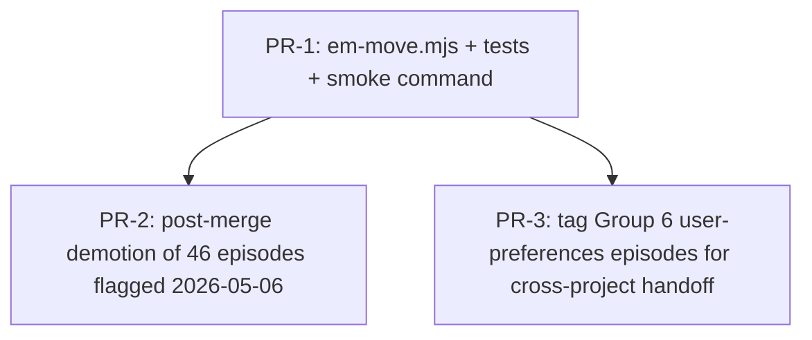

# RFC-005 — em-move: atomic episode relocation between scopes

## AI context

> (1) Adds `scripts/em-move.mjs` to relocate one or more episodes between `local` and `global` scopes while preserving IDs, supersedes chains, access counters, and tag indexes. (2) Today there is no programmatic way to demote/promote episodes once stored — operators fall back to `mv` + manual `em-rebuild-index`, which (a) does not preserve `access_count`/`last_accessed`, (b) leaves stale tag entries until rebuild, and (c) silently fails on macOS TCC-restricted paths from sandboxed sessions. (3) Key trade-off: the script is **deliberately scope-only**. It does not edit content, fork chains, or cross projects — those are out of scope to keep the failure surface narrow.

---

## Problem

Episodic memory has two storage scopes (`global` at `~/.episodic-memory/` and `local` at `<repo-root>/.episodic-memory/`), but no first-class operation to move an episode between them. This matters in three recurring scenarios:

1. **Demotion.** An episode that was stored at `--scope global` turns out to be project-specific. Today's only path is `mv <id>.md` + `em-rebuild-index --scope all`. Audit on 2026-05-06 found ~50 of 120 global episodes (40%) are project-specific contamination originating before the `em-store scope hygiene` rule landed; the manual workflow is what discouraged cleanup.
2. **Promotion.** A local lesson proves cross-project relevant and should live in global. The current promotion pattern reconstructs the episode via `em-store --scope global`, which **mints a new ID** and breaks supersedes chains pointing at the original. (See 2026-05-06 promotion of 10 Tier-A lessons — each one is now a duplicate, not a moved record.)
3. **Side-effects of manual `mv`:**
   - `index.jsonl` in source scope retains the entry until next rebuild — search returns stale results.
   - `tags.json` is not updated incrementally; stale tag → ID references can serve old paths.
   - `access_count` and `last_accessed` are preserved by `em-rebuild-index` only because it deliberately reads the old index; a naive `mv` + `em-rebuild-index --scope all` works, but the reverse-engineering required for an operator to know that is friction.
   - macOS TCC blocks `mv` from a worktree session into the main repo's `.episodic-memory/` (EPERM, even with `dangerouslyDisableSandbox: true`). A node script invoked from outside the sandbox surfaces this cleanly; a shell `mv` in a loop produces partial state.

**Observable evidence:**
- Promotion 2026-05-06: 10 episodes promoted to global as new IDs; no chain link to local originals. The "Promoted from local `<id>`" note in each body is documentation, not data.
- Demotion 2026-05-06: 46-episode demotion blocked by macOS TCC after `mv` succeeded for 0 of 46. Operator forced to either (a) run from outside the worktree, or (b) skip the cleanup.
- No audit trail when an episode changes scope. `git log` on the file is per-file but there is no canonical record of "this id was moved from global to local on date D".

---

## Proposal

Add `scripts/em-move.mjs`. Single-purpose CLI that relocates episodes between scopes atomically per-episode, with batch support and dry-run.

### Scope

- **In scope:**
  - Move one or more episode `.md` files between `local` and `global` scopes
  - Preserve episode ID, frontmatter, body, supersedes chain references
  - Preserve `access_count` and `last_accessed` from source `index.jsonl`
  - Update both source and destination `index.jsonl` files atomically (temp + rename)
  - Update both source and destination `tags.json` files atomically
  - Selection by explicit `--id`, `--ids`, or `--filter-tag <tag>`
  - `--dry-run` mode that prints the planned operation without modifying anything
  - JSON output for scriptability

- **Out of scope:**
  - Cross-project moves (e.g. moving a local episode from project A's `.episodic-memory/` to project B's). Local resolution stays repo-relative; cross-project would need a separate tool that takes both repo roots.
  - Editing episode content during the move (rename, retag, body rewrite). Those are `em-revise` territory.
  - Bypassing macOS TCC. The script returns clean errors if either scope's directory is unwritable from the calling context, instead of producing partial state.
  - Forking supersedes chains. If episode X supersedes Y, and Y is moved from global to local but X stays global, the chain still resolves correctly via `em-search --scope all`. No special handling needed.
  - Removing episodes (use `em-prune` for archival).

### CLI interface

```
node scripts/em-move.mjs --id <full-episode-id> --to local|global [--dry-run]
node scripts/em-move.mjs --ids <full-id-1>,<full-id-2>,... --to local|global [--dry-run]
node scripts/em-move.mjs --filter-tag <tag> --to local|global [--dry-run]
```

Required: exactly one of `--id` / `--ids` / `--filter-tag`, plus `--to`.

**ID format:** v1 accepts **full episode IDs only** (e.g. `20260430-100008-rfc-001-guided-entry-ingest-v1-shipped-a-5624`), not 4-hex suffixes. Suffix-prefix resolution is deferred — it requires collision detection across both scopes (suffix collisions become probable past ~10k episodes per the birthday paradox) and is its own RFC-shaped concern. Fold-in finding F1 (2026-05-06 adversarial review).

Optional flags:
- `--dry-run` — preview without writing. Re-validates per-id file existence (does NOT trust source `tags.json` for `--filter-tag` selection — see F2).
- `--confirm` — required when N > 10 episodes are about to move (safety gate)
- `--no-audit` — suppress the per-move audit episode (use only for bulk operations where audit episodes would be noise)
- `--reason "<text>"` — captured into the audit episode body (resolves OQ-5 to YES; needed to distinguish demote from promote intent in the audit corpus)
- `--break-anchors` — override the anchor pre-flight (see F6 below); refuses by default to move any ID hardcoded in a `MEMORY.md` anchor

### Algorithm

For each requested ID:

1. **Anchor pre-flight (F6).** Scan all known `MEMORY.md` files (start with `~/.claude/projects/*/memory/MEMORY.md`) for hardcoded `<scope>/episodes/<id>.md` paths. If the ID is anchored, refuse the move unless `--break-anchors` is passed. Closes the same blind spot Discipline #13 (semantic role audit) addresses: tier-3-anchored episodes have a different SEMANTIC ROLE than ordinary episodes — moving them silently invalidates a documented mental-model anchor.
2. **Resolve source scope** by locating `<scope>/episodes/<id>.md` in `global` and `local`.
   - If found in **neither** → error.
   - If found in **both** → enter recovery mode (F3): hash both files; if identical, treat as "src unlink pending from a prior partial move" and complete the move (continue from step 7 with src→cleanup orientation); if different, hard-error with both paths and the recommended manual reconciliation procedure.
3. **Validate target ≠ source.** If equal, mark as no-op in output. **No audit episode is emitted for no-op rows** (bonus finding from review).
4. **Read source frontmatter** to confirm ID matches filename (defensive check).
5. **Read source `index.jsonl`** to capture `access_count` and `last_accessed`.
6. **Move file atomically (per-episode, not per-batch)**:
   - **Same-filesystem case:** `fs.renameSync(src, dst)` — atomic; no orphan window.
   - **Cross-device case (F9):** `fs.copyFileSync(src, dst)` then `fs.unlinkSync(src)`. If unlink fails, attempt `fs.unlinkSync(dst)` to roll back; if rollback also fails, hard-error with BOTH paths in the message and recommend `em-rebuild-index --scope all` after manual reconciliation.
7. **Update `index.jsonl`** in both scopes:
   - Source: load → filter out `id` → atomic write (temp + rename, matching the existing pattern in [scripts/em-rebuild-index.mjs](scripts/em-rebuild-index.mjs)).
   - Destination: load → append entry (with preserved `access_count` / `last_accessed`) → atomic write.
8. **Update `tags.json`** in both scopes — per [scripts/em-store.mjs](scripts/em-store.mjs) `updateTagsIndex` pattern. **Edge cases (F5):**
   - **Source `tags.json` missing or unparseable:** warn (matching em-search's existing "tags index unreadable" warning text), continue without source tags-update; rebuild on next em-rebuild-index run.
   - **Source has no entry for a tag the episode claims:** warn (stale tags.json), continue.
   - **Destination `tags.json` missing:** create on first write (em-store's existing behavior).
   - **Episode has empty `tags: []` array:** skip tags-update entirely; no-op is correct.
9. **Emit per-move audit episode (F4 + F8 modified).** Audit is written **LAST**, conditional on all prior steps having succeeded for this ID. Audit destination is the **destination scope** of the move (co-located provenance), not unconditionally global. Audit body includes a per-step success bitmap so consumers can tell whether the audit attests to a fully-completed move:
   ```
   category: context
   tags: [em-move, audit, <src-scope>, <dst-scope>]
   summary: em-move: <id> moved from <src> to <dst>
   body:
     ts: ISO8601
     reason: "<--reason text or empty>"
     steps_succeeded: { preflight: yes, file_move: yes, src_index: yes, dst_index: yes, src_tags: yes, dst_tags: yes }
   ```
   Suppressed when `--no-audit` is passed OR when the move was a no-op (step 3).
10. **Output JSON**:
    ```json
    {
      "status": "ok",
      "moved": [{"id": "...", "from": "global", "to": "local", "audit_id": "..."}],
      "skipped": [{"id": "...", "reason": "same-scope-no-op"}],
      "errors": [{"id": "...", "step": "src_tags", "msg": "..."}]
    }
    ```

If any step fails for an episode, that episode's row is in `errors`; **already-completed episodes in the same batch are NOT rolled back** (atomicity is per-episode, not per-batch). This matches `em-store` and `em-revise` behavior.

### Recovery procedure (F3)

If em-move is interrupted (kill -9, OS crash, EPERM mid-batch), the canonical recovery is:

1. Run `node scripts/em-rebuild-index.mjs --scope all` — this rebuilds both `index.jsonl` files from current `.md` presence in each scope.
2. Run `em-search --tag em-move --scope all --limit 50 --no-track` and inspect the `steps_succeeded` bitmap of recent audit episodes. Any audit with `false` in the bitmap identifies an incomplete move.
3. For each incomplete move, re-run `em-move --id <id> --to <dst>` — step 2 (resolve source scope) will detect the dual-presence case and either complete the move (if hashes match) or surface the conflict.

This procedure is documented in `CLAUDE.md` Testing section once em-move ships.

### Concurrency (F7 — DEFERred)

em-move performs read-modify-write on both `index.jsonl` files. This race-class is shared with [scripts/em-search.mjs:107-126](scripts/em-search.mjs:107) (write-back access tracking, last-writer-wins) and [scripts/em-prune.mjs:150-152](scripts/em-prune.mjs:150) (archival index update, documented as "best-effort, maintenance operation").

**Residual risks under concurrent operation:**
- em-search write-back during em-move's index rewrite → either em-search's `access_count` increment is lost OR em-move's "filter out moved id" is lost (orphan index entry pointing at moved file).
- em-prune during em-move's `--filter-tag` resolution → tags.json may reference an ID whose .md was just archived (handled in step 2 via re-validation).
- em-backup `--sync` during em-move → backup may capture a half-moved state. Backup is read-only on this side and idempotent; next sync corrects.

**Recovery:** all of these resolve by `em-rebuild-index --scope all` (see Recovery procedure).

**Hot-path advisory:** RFC-004 BP-1 auto-pilot (which may automate em-move calls) MUST NOT invoke em-move during em-backup `--sync` windows or em-prune runs. Sequencing is the auto-pilot's responsibility, not em-move's.

A future RFC may introduce a project-wide em-* lock file. Out of scope here — this RFC documents the existing race-class without resolving it.

### Selection by `--filter-tag`

Resolves to the union of episode IDs present in the source-scope `tags.json` for that tag. Source scope is the OPPOSITE of `--to` (you can't filter at destination because the episodes aren't there yet). If multiple sources are possible (i.e. some episodes with that tag are in target already), filter only sees source-scope entries — destination ones are no-op anyway.

### Safety gates

- **N > 10 without `--confirm`** → error with the planned ID list. Operator re-runs with `--confirm` after reviewing.
- **`--dry-run`** prints all planned operations including derived target paths and tag delta counts; no writes.
- **Destination collision** (file already at `<dst>/episodes/<id>.md`) → error, abort that episode (not the batch).
- **Source still in destination's `index.jsonl`** (impossible if invariants hold, but check) → error, abort.

### Audit trail

Each move emits one episode of `category: context` to `~/.episodic-memory/` (always global, regardless of move direction) with:
- `summary: em-move: <id> moved from <src> to <dst>`
- `tags: [em-move, audit, <src-scope>, <dst-scope>]`
- `body: pointer to the moved episode + timestamp + caller-supplied --reason if any`

This makes scope changes searchable (`em-search --tag em-move`).

Optional `--no-audit` flag for bulk operations where the audit episodes would themselves be noise.

### File changes

- **New:** `scripts/em-move.mjs` (~250 lines, follows em-store.mjs structure)
- **New:** `tests/test-em-move.mjs` (~400 lines, 14 cases — see Implementation plan)
- **Modified:** `docs/rfcs/README.md` Active RFCs table (this RFC entry)
- **Modified:** `CLAUDE.md` Testing section (add em-move smoke command)
- **Modified:** `install.mjs` ONLY if global-script bundling needs em-move added (likely yes — confirm at impl time)
- **Modified:** `instructions/SKILL.md`, `instructions/cursor.mdc`, `instructions/AGENTS.md`, `instructions/windsurf.md` to mention em-move when explaining scope hygiene (light touch, not required for v1)

---

## Alternatives considered

| Alternative | Why rejected |
|---|---|
| Manual `mv` + `em-rebuild-index --scope all` (status quo) | Drops `access_count`/`last_accessed` if rebuild can't find them in the new scope's old index (it can't — they're in the OLD scope's old index, which gets rebuilt to no longer contain that ID). Also no audit trail, no atomicity, no batch UX, no dry-run. |
| Extend `em-revise` with a `--move-to <scope>` flag | Conflates content edit (revise) with location change (move). Revise creates a NEW id and supersedes link; move preserves id and chain. The semantics are opposite. Bundling would require an `--in-place` mode in revise that contradicts its core purpose. |
| Add a `--rebase-scope` flag to `em-rebuild-index` | Rebuild is read-only on .md content, write-only on indexes. Adding move means rebuild now mutates filesystem layout — surprising side effect for a tool whose job is "make indexes match files." |
| Re-store as new ID via `em-store --scope <new>` + delete old | Loses the original ID, breaking any references in supersedes chains, mental-model anchors (`MEMORY.md` pointers), or external citations. The 2026-05-06 promotion already exhibits this failure mode — 10 lessons now exist as global duplicates of local originals with no chain link. |
| Move via the backup repo (em-restore-style) | Backup is a redaction-aware mirror, not a move pipeline. Restoring a redacted version into the other scope would corrupt the episode. |
| Direct shell function in install.mjs | install.mjs is for bootstrapping, not ongoing CRUD. Adding move logic there mixes concerns and doesn't survive `install --reinstall`. |

---

## Implementation plan

> Populated since this RFC starts with a concrete plan. Will be refined when status moves to `accepted`.

### Sequencing



PR-1 is the only hard dependency; PR-2 and PR-3 are operational follow-ups that USE em-move.

### PR-1: em-move.mjs

| Item | Files | Tests |
|---|---|---|
| `scripts/em-move.mjs` skeleton + `--id` single-move global→local | scripts/em-move.mjs | T1 single move global→local, verify file/index/tags both sides |
| `--id` reverse direction | (same) | T2 single move local→global |
| `--ids` batch | (same) | T3 batch of 3 mixed direction |
| `--filter-tag` resolution | (same) | T4 filter by tag picks correct subset |
| `--dry-run` revalidates per-id (F2) | (same) | T5 dry-run produces no fs changes; T5b dry-run after pruning a tagged episode out from under tags.json detects and reports the discrepancy |
| Safety gate: N > 10 without `--confirm` | (same) | T6 batch of 11 errors without confirm; T7 same with confirm proceeds |
| Same-scope no-op + audit suppressed | (same) | T8 source==target produces skipped row, NO audit episode written |
| Missing ID error | (same) | T9 unknown id errors cleanly |
| Full ID required, suffix-prefix rejected (F1) | (same) | T9b passing `5624` (suffix only) errors with "full ID required" |
| Idempotency: re-run on already-moved errors | (same) | T10 second run of T1 errors with "source not found" |
| Destination collision | (same) | T11 pre-place dst .md (different content), verify hard-error + no source mutation |
| Dual-presence recovery (F3) | (same) | T11b pre-place dst .md (identical content), verify em-move completes cleanup of src |
| Preserves access_count + last_accessed | (same) | T12 increment access pre-move, verify post-move index entry has same value |
| Audit episode lands in dst scope, written LAST with success bitmap (F4 + F8 mod) | (same) | T13 verify audit episode is in `--scope <dst>` and body contains `steps_succeeded` bitmap with all true; T13b force tags-update failure mid-move and verify the audit row records the failed step |
| `--no-audit` suppresses audit | (same) | T14 audit episode NOT written when flag passed |
| Anchor pre-flight (F6) | (same) | T15 attempt to move an ID hardcoded in a fixture MEMORY.md → blocked; T15b same with `--break-anchors` proceeds |
| Cross-device fallback path (F9) | (same) | T16 mock `fs.renameSync` to throw EXDEV → verify code falls back to copyFileSync+unlinkSync; T16b mock unlinkSync to throw → verify rollback (dst removed) |
| Edge: missing/corrupt/empty/stale tags.json (F5) | (same) | T17 source tags.json missing → warns + completes; T18 source tags.json missing the tag entry the episode claims → warns + completes; T19 dst tags.json missing → created on first write; T20 episode has empty `tags: []` → tags-update step skipped |
| `--reason` captured into audit (resolves OQ-5 = YES) | (same) | T21 `--reason "demote contamination"` appears in audit body |

### PR-2: demote 46 episodes

After PR-1 ships:
```bash
# Read full IDs from the manifest (one per line; strips comments and blank lines)
ids=$(grep -v '^#' docs/rfcs/RFC-005-pr2-demote-list.txt | grep -v '^$' | paste -sd, -)
node scripts/em-move.mjs --ids "$ids" --to local --confirm --reason "demote project-specific contamination from global; flagged 2026-05-06 audit"
node scripts/em-rebuild-index.mjs --scope all  # belt-and-suspenders per Recovery procedure
node scripts/em-backup.mjs --sync
```

The full 46-ID manifest is checked in at [docs/rfcs/RFC-005-pr2-demote-list.txt](docs/rfcs/RFC-005-pr2-demote-list.txt) so the demotion is reviewable + replayable. Manifest header notes the audit run date and confirms no overlap with `MEMORY.md` tier-3 anchors (`1eaf, 09e5, 54ea, 7de4, 85a8, d179, 2e50, 9f6f, 8457, 90c7, f047`).

### PR-3: flag user-preferences cluster

Add `project-mismatch` tag to 9 episodes in Group 6 (operating-rules cluster from a different project). Decision on whether to delete or relocate to that project's local store is deferred to a future RFC; tagging surfaces them for filtering.

---

## Implementation

> Populate during build stage — mark each item immediately after it ships. Do not batch at the end.

| PR/Commit | Files changed | Tests | Notes |
|---|---|---|---|
| _pending_ | _pending_ | _pending_ | _pending_ |

---

## Related RFCs

- **RFC-001** — defines the `local` vs `global` scope dichotomy and `index.jsonl` / `tags.json` invariants this RFC must preserve
- **RFC-004** — BP-1 auto-pilot may eventually call em-move during automated cleanup; not a blocker for v1

---

## Second opinion

> Required before `status: accepted` can be set.

**Reviewer:** negative-scenario-planner subagent v2 (canonical episode `20260506-003453-...-d17e`)
**Date:** 2026-05-06
**Findings:** 9 — F1 unspecified `--ids` shape (PR-2 list unrunnable), F2 `--filter-tag` × concurrent em-prune, F3 orphan windows wider than spec, F4 audit-trail wrong sequence, F5 tags.json edge cases, F6 missing anchor pre-flight (Discipline #13), F7 concurrent index race (DEFER), F8 audit-destination prescription (TCC diagnosis was rejected — TCC blocks `~/Documents/...`, not `~/.episodic-memory/`; F8 prescription kept for co-location/symmetry, not TCC), F9 cross-device move rollback. Bonus: same-scope no-op should suppress audit.
**AI-slop check:** clean — review caught one factual error in its OWN diagnosis (F8 TCC scope) which was verified against actual bash output and rejected. Adversarial review prompt is being updated to require fact-verification of system-behavior claims so future runs catch this self-error class.
**Decision:** proceed — all 5 ACCEPT findings folded into the spec; 2 ACCEPT-WITH-MOD folded as modified; 1 DEFER documented in the new "Concurrency" section with residual + recovery; 0 pure REJECT (F8 partial reject is folded as the prescription-only side).
**Verdicts table:**

| Finding | Verdict | Folded? | Where |
|---|---|---|---|
| F1 — `--ids` shape | ACCEPT | yes | CLI interface ("ID format" paragraph) + PR-2 manifest file |
| F2 — `--filter-tag` × prune | ACCEPT | yes | Algorithm step 1 + CLI flag note for `--dry-run` |
| F3 — orphan windows | ACCEPT | yes | Algorithm step 2 (dual-presence recovery) + new Recovery procedure section |
| F4 — audit sequence | ACCEPT | yes | Algorithm step 9 (audit emitted last + success bitmap) |
| F5 — tags.json edges | ACCEPT-WITH-MOD | yes | Algorithm step 8 (4 enumerated edge cases) |
| F6 — anchor pre-flight | ACCEPT | yes | Algorithm step 1 (anchor pre-flight) + `--break-anchors` flag |
| F7 — concurrent index | DEFER (5-field) | yes | New Concurrency section with residual + recovery |
| F8 — audit destination | REJECT diagnosis (TCC scope error verified) / ACCEPT-WITH-MOD prescription | yes | Algorithm step 9 (dst-scope routing for co-location/symmetry, not TCC) |
| F9 — cross-device | ACCEPT | yes | Algorithm step 6 (rename-then-fallback) |
| Bonus — no-op no-audit | ACCEPT | yes | Algorithm step 3 + step 9 |

---

## Open questions

| # | Question | Owner | Status | Resolution |
|---|---|---|---|---|
| OQ-1 | Filter expression beyond single tag — should v1 support `--filter "category:milestone AND project:foo"`? Or strictly explicit IDs + single tag for safety? | Charlton | open | _pending_ — recommend strict (single tag + explicit IDs) for v1; expression filter is its own RFC |
| OQ-2 | N > 10 is the right confirm threshold? Some legitimate batches (cleanup from a multi-week corpus) will exceed it routinely. Could be tunable via env var. | Charlton | open | _pending_ — recommend `EM_MOVE_CONFIRM_THRESHOLD` env var, default 10 |
| OQ-3 | Should the audit episode itself be opt-IN (default no audit) or opt-OUT (default with audit, `--no-audit` suppresses)? Current proposal is opt-out. | Charlton | resolved | opt-out (audit by default) — consistent with em-violation default |
| OQ-4 | Does em-move need to update `state/` files (em-recall checkpoint markers, etc.) if it moves an episode referenced there? Initial scan suggests no — markers reference IDs not paths. Confirm at impl. | Charlton | open | _pending_ — confirm via grep on `state/` at PR-1 impl |
| OQ-5 | Should there be a `--reason "<text>"` flag captured into the audit episode body for institutional memory? | Charlton | resolved | YES — folded as `--reason` in CLI interface; ACCEPT from F-bonus |

---

## Deferral note

> Populate only if status changes to `deferred`.

---

## Withdrawal note

> Populate only if status changes to `withdrawn`.

---

## Supersession note

> Populate only if status changes to `superseded`.
