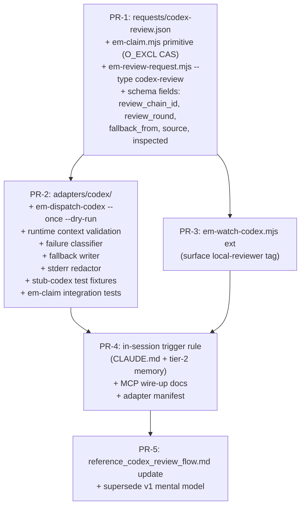

> **Status:** WITHDRAWN on 2026-05-14. The in-session use case is covered by the
> second-opinion harness shipped via PR #222 (`e3c8dc9`). The adapter/queue/claim
> architecture proposed below was never realized; the residual provider-hardening
> items are tracked as informal harness follow-ons, not under this RFC.
> See [Withdrawal note](#withdrawal-note) at the bottom for the full disposition.


# RFC-006 — Codex Review Adapter: Typed-Request Consumer with Failure Classification and Local Fallback

> **Note on numbering:** originally drafted as RFC-005; renumbered to RFC-006 after collision detected with [PR #175](https://github.com/lantisprime/episodic-memory/pull/175) (em-move episode relocation) which was opened ~6 hours earlier and holds the RFC-005 slot. Episode tags in the round-by-round audit trail below still read `rfc-005` — those are historical and intentionally not rewritten.

## AI context

> Adds a codex-review **typed request** to the RFC-003 request registry, plus a codex **adapter** that consumes that inbox via the RFC-003 event-driven substrate (`fs.watch` for live waits, session-start sweep for resume — never timers, never silent daemons). The adapter owns codex-CLI invocation, failure classification (auth, quota, network, binary-missing, unknown), and a fallback path to the local `negative-scenario-reviewer` agent when codex is unreachable. This RFC does **not** introduce a new bus — RFC-003 already provides the message envelope, lifecycle, and inspected-context echo. The one trade-off worth knowing: every cross-lane invocation is bounded by a `review_chain_id` counter (max two codex rounds per chain), and replies that originate from the local-fallback agent are tagged `review-source: local-fallback` so consumers can distinguish reduced-fidelity outage replies from real codex output.

---

## Problem

The episodic-memory project already has the pieces of a cross-tool review system:

- **RFC-003** (accepted) defines a typed-request registry, message envelope with reply chains, inspected-context echo, and an event-driven messaging substrate (`em-listen` via `fs.watch`, session-start resume sweep).
- `scripts/em-review-request.mjs` writes structured `category: workflow.lifecycle, event: review-request` episodes with `context: {worktree, branch, head}` payloads.
- `scripts/em-watch-codex.mjs` polls those episodes for replies and surfaces them to the assistant.
- The OpenAI codex plugin (`openai/codex-plugin-cc`, installed 2026-05-06) ships `/codex:review` and `codex` MCP-server transports.

Five concrete gaps remain:

1. **No typed-request entry for codex review.** `requests/codex-review.json` does not exist. Without it, RFC-003's validation, routing, and inbox semantics don't apply to codex reviews — every dispatcher has to re-invent context validation and reply schema.

2. **No adapter to invoke codex.** Nothing reads the inbox and actually runs `codex review`. Requests left untouched stay queued indefinitely; there is no SLA. The first draft of this RFC proposed a polling daemon, which violates [PRINCIPLES.md](../../PRINCIPLES.md) P6 ("no silent daemons") — see Round 1 codex review (Finding 1).

3. **No infrastructure-failure handling.** When codex is unavailable (binary missing, auth expired, OpenAI rate limit, network failure, internal panic, exit-0-with-stdout-notice), the project has no escalation path. Auth failures in particular are silent — the user only learns about them when reviews stop appearing.

4. **No loop guard for content-error escalation.** If codex returns a critical finding and the response is "run codex again with `--adversarial`," there is no counter to bound the cycle; counters at the request level (proposed in v1) reset across the fallback path and ignore the in-session lane (Round 1 planner Finding 1).

5. **No claim/lease on dispatch.** Two writers (assistant in-session via codex MCP, adapter in `--once` mode) can both pick up the same request and both write replies; an adapter crash between codex exit and reply-write doubles up on restart (Round 1 planner Finding 2).

---

## Proposal

The proposal has two layers, both under existing PRINCIPLES.md and RFC-003 contracts.

### Layer 1 — `requests/codex-review.json` typed-request entry (RFC-003 registry)

A new closed-vocabulary request type. Schema mirrors the RFC-003 envelope; schema details belong in PR-1 of the implementation plan, but the load-bearing fields are:

```json
{
  "type": "codex-review",
  "required_context": ["worktree", "branch", "head"],
  "required_routing": ["recipient: codex"],
  "review_chain_id": "<UUID>",
  "review_round": 1,
  "scope": "auto | working-tree | branch",
  "base_ref": "<git ref, optional>",
  "focus": "<free text, optional, only for adversarial follow-ups>"
}
```

- `review_chain_id` is propagated unchanged across **every** episode in the chain — the original request, all replies, fallback requests, content-escalation follow-ups. Generated once at chain origin (in-session call OR explicit `em-review-request --type codex-review`), never reused across chains.
- `review_round` increments only on content-escalation. Capped at 2; round 3 requests are rejected by the adapter and trigger a `category: violation` episode.

This entry registers with RFC-003's request-type registry, so RFC-003's validation and inbox machinery apply unchanged.

### Layer 2 — Codex adapter (`adapters/codex/`)

A new adapter under RFC-003's adapter contract. Three responsibilities:

#### 2a. Trigger surface (no daemon, per P6)

The adapter activates **only** on these triggers (declared in its manifest per P3/P10):

- **`em-listen`** (RFC-003's `fs.watch` substrate) — live wait when the assistant or another tool is actively running.
- **Session-start sweep** (RFC-003) — drain the inbox once when a session opens.
- **`em-dispatch-codex --once`** (manual / hook-invoked) — one-shot for a specific request id or for the entire open inbox.
- **User-turn boundary** in the assistant — checked once per turn-end, gated by the trigger rule below.

No timers, no polling, no long-lived process. `--once` exits after one pass.

#### 2b. Trigger rule for in-session lane

The assistant invokes this adapter (via codex MCP tool) at a user-turn boundary when **all** of the following hold — defined as a checklist, not "non-trivial":

| Check | Yes / No |
|---|---|
| 1. Files changed in this turn outside excluded globs (`**/*.md`, `.episodic-memory/**`, `memory/**`, `*.lock`, `snapshots/**`, `dist/**`, `node_modules/**`)? | required-yes |
| 2. Total non-excluded line delta ≥ 20 (sum of staged + unstaged + untracked) per `git diff --shortstat`? | required-yes |
| 3. Turn was a code change (not pure git mechanics: revert, cherry-pick without conflicts, mode-only, rename-only)? | required-yes |
| 4. No existing open `codex-review` request for this `(worktree, branch, head)` triple? | required-yes |
| 5. `em-claim` for `(request_id, review_round=1)` succeeds (exits 0)? | required-yes |

If all five are yes, the assistant writes a `codex-review` typed request and **first** acquires the claim via `em-claim` (item 5), **then** calls the codex MCP tool with the same payload. The MCP-tool call must abort if the claim acquisition reports `already-claimed` (the `--once` adapter or another assistant lane has the request). Both halves of the in-session lane are bound by `review_chain_id` and protected by the same O_EXCL primitive (see Concurrency and idempotency below).

#### 2b'. Runtime context validation (per P8 — messages carry their context)

Before invoking codex (in either lane), the worker MUST:

1. Set `cwd: request.context.worktree` on the `spawn` call (or set the codex MCP server's working directory accordingly).
2. Run `git rev-parse --show-toplevel`, `git rev-parse --abbrev-ref HEAD`, and `git rev-parse HEAD` from that cwd.
3. Compare against `request.context.{worktree, branch, head}`. **Any mismatch fails closed:** the worker writes `event: review-context-mismatch` under `category: workflow.lifecycle, severity: blocker` (referencing the request) and does NOT invoke codex. The claim is released by writing the next-generation claim file with `status: released` (see Concurrency and idempotency — em-claim handles release via the same generation-counter scheme). A future invocation in the correct cwd will observe the released claim, write `gen<N+1>` with status=active, and proceed.
4. After codex returns, the reply payload's `inspected: {worktree, branch, head, store_path}` field is computed from the actual cwd-resolved values at reply-write time — **not** copied from the request. This makes context drift detectable on inspection (consumer compares request.context with reply.inspected; mismatch is a violation).

#### 2c. Failure classification and fallback

The adapter `spawn`s `codex review` (or `codex exec` for adversarial follow-ups) per the Node-subprocess discipline below. Classification uses a multi-signal ladder (exit code → structured exit reason if codex provides one → stdout scan → stderr scan), failing **closed** to `unknown` on ambiguity.

| Class | Signals (in priority order) | Adapter response |
|---|---|---|
| `success` | exit 0, no `Please re-authenticate\|401\|402` in stdout, no failure markers | Write reply (event: `review-reply`, source: `codex`); done. |
| `content-escalation` | success-class, AND reply matches `/BLOCKER\|REJECT\|CRITICAL/` | Write reply; if `review_round < 2`, write follow-up `codex-review` request with `review_round: N+1`, same `review_chain_id`, and `--adversarial` framing; else write `category: violation, severity: blocker, summary: "max review rounds reached"`. |
| `binary-missing` | exit 127, ENOENT on spawn, `codex --version` fails | Fallback (see below); also write `event: capability-degraded` once per session. |
| `auth` | stderr matches `/auth\|login required\|unauthorized\|401/i`, OR stdout matches `/Please re-authenticate\|sign in/i`, OR exit 1 with token-expired patterns | Write `category: violation, severity: blocker, summary: "codex auth required — run \`codex login\`"`; fallback. |
| `quota` | stderr matches `/rate.?limit\|429\|quota\|402\|payment.required/i` | Backoff (1s, 4s, 16s); on third failure, fallback. |
| `network` | stderr matches `/timeout\|ECONN\|ENETUNREACH\|EAI_AGAIN/i`, OR child errored before exit | Backoff (5s, 30s); on second failure, fallback. |
| `unknown` | any other non-zero, OR ambiguous classification | Write `event: review-failure` (NOT `category: lesson` — see Finding 5 from Round 1 codex review) under `category: workflow.lifecycle`, with redacted excerpt of stderr; fallback. |

#### 2d. Fallback to local agent

When the adapter cannot reach codex, it writes a fallback request:

- `category: workflow.lifecycle`
- `event: review-request-fallback`
- Tags: `[workflow.lifecycle, review-request-fallback, task:..., local-reviewer]`
- Body: same payload as original request, same `review_chain_id`, with `fallback_from: <original-request-id>`.

`em-watch-codex` (which RFC-003 supersedes via `em-listen`) extends to surface `local-reviewer`-tagged requests to the assistant. The assistant invokes the existing `.claude/agents/negative-scenario-reviewer.md` subagent on the body, and writes the reply with:

- `event: review-reply`
- `source: local-fallback` (so consumers can distinguish reduced fidelity)
- `review_chain_id: <unchanged>`

The adapter does **not** spawn `claude -p` itself. Daemon-spawned Claude SDK subprocesses are a debugging nightmare and tie billing to dispatcher uptime; in-session pickup keeps the human (or assistant turn) in the loop for the costly path.

### Schema additions to RFC-003 envelope

Three additive fields on the request body (free-form metadata in RFC-003's envelope):

- `review_chain_id: <UUID>` — chain identity; propagated across all episodes in the chain.
- `review_round: <integer>` — content-escalation counter; defaults to 1.
- `fallback_from: <episode-id>` — set on fallback requests; null on originals.

One additive field on reply bodies:

- `source: codex | local-fallback` — distinguishes reviewer identity.

One new request type in the closed-vocabulary registry (per RFC-003): `codex-review`. One new tag for fallback routing: `local-reviewer`. No category changes; everything stays under `workflow.lifecycle` per existing convention (see `em-review-request.mjs:432-444`).

### Concurrency and idempotency

Per Round 1 planner Finding 2 and Round 2 codex findings N1, N2, N4, the adapter must guarantee that no request gets two replies and no in-flight invocation gets duplicated — across **both** the in-session MCP lane and the `--once` adapter lane.

**The current `em-revise.mjs` primitive is not CAS** (verified: `scripts/em-revise.mjs:82` performs a regex-replace + tmp+rename with no read-then-compare; two concurrent revisers both succeed in writing revision episodes). Therefore this RFC introduces one new core primitive.

#### New primitive: `scripts/em-claim.mjs` (atomic, content-addressed, O_EXCL, generation-counted)

`em-claim.mjs` writes a `workflow.lifecycle` episode at a **deterministic, generation-numbered** filename so the filesystem provides atomic CAS via `O_EXCL`. Generations make the same path scheme handle both fresh claims and recovery/release without path-reuse. It is a new core primitive — not an adapter — and lives alongside `em-store.mjs` and `em-revise.mjs`. The episode it writes is a regular `workflow.lifecycle` event (P1 substrate preserved).

**Path scheme:**

```
<store>/episodes/claim-<request-id>-r<round>-gen<N>.md   # claims, monotonic N starting at 0
<store>/episodes/reply-<request-id>-r<round>.md          # replies, single per round
<store>/episodes/reply-<request-id>-r<round>-superseded-<short-uuid>.md  # dedup audit
```

**Claim acquisition algorithm (single deterministic primitive for fresh, recovery, and release):**

```
acquire_claim(request_id, round):
  # 1. Discover highest existing generation for this (request_id, round).
  pattern = `claim-${request_id}-r${round}-gen*.md`
  max_gen = max(parsed_gen(f) for f in glob(pattern), default = -1)

  # 2. If max-gen claim is "live" (active + ttl in future), refuse.
  if max_gen >= 0:
    body = read(`claim-${request_id}-r${round}-gen${max_gen}.md`)
    if body.status == "active" AND body.claim_ttl > now:
      return { status: "already-claimed", claim: body }

  # 3. Try to write the next generation.
  target_gen = max_gen + 1
  target_path = `claim-${request_id}-r${round}-gen${target_gen}.md`
  body = { event: "review-request-claimed",
           request_ref: request_id,
           review_chain_id: <UUID>,
           review_round: round,
           generation: target_gen,
           claim_by: "<hostname>-<pid>-<session-id>",
           claim_ttl: <claim_created_at + invocation_timeout + 60s grace> }
  try:
    fs.writeFileSync(target_path, frontmatter + body, { flag: 'wx' })
  except EEXIST:
    return acquire_claim(request_id, round)  # retry; another writer raced us at gen target_gen
  update index.jsonl + tags.json (atomic via tmp+rename)
  return { status: "ok", claim: body, path: target_path }

invocation_gate(claim_result):
  # A worker may invoke codex iff it personally wrote the latest gen
  # AND the body it wrote has status=active AND ttl is still in the future.
  return claim_result.status == "ok" AND
         claim_result.claim.status == "active" AND
         claim_result.claim.claim_ttl > now
```

**Why the recursion terminates:** every iteration discovers a higher `max_gen` than the previous one (because the EEXIST winner already wrote `gen<target_gen>`). The number of contending workers is bounded; once each has written exactly one gen file, no further EEXIST can occur for them.

**Why "generation" closes Round 3 V1 + V2:**
- *Recovery (V1):* concurrent recoverers all observe the same stale max-gen and try to write `gen<max+1>`. Exactly one succeeds via O_EXCL — same atomicity as a fresh claim. No `-recovered-<uuid>` ambiguity. The losers retry; their next attempt observes the new winner as max-gen-active and exits with `already-claimed`.
- *Release (V2):* a worker that releases (e.g., on context-mismatch) writes `gen<N+1>` with `status: released` (and no codex invocation). Future workers observe max-gen as released, treat it as not-live, and write `gen<N+2>` to acquire. The original `gen0` and `gen<N+1>` files coexist on disk; only the highest-gen one is consulted.

**Stale claims (ttl expired):** indistinguishable from "released" for acquisition purposes — both are not-live. The previous (now-orphaned) codex process is best-effort killed via process-group on adapter cleanup. If it survived a host reboot, its eventual reply-write is rejected by reply-side O_EXCL.

**Clock-skew warning:** `claim_ttl` is checked by the worker that observes the claim, not the worker that wrote it. On a single host, monotonic. Cross-host workers must run NTP-synced clocks AND inflate the grace window to 120s (configurable). Multi-host operation is out-of-scope for the v1 implementation but the manifest declares this constraint.

#### Reply-side dedup with ownership verification

Reply-write requires the writer to **prove it still owns the canonical claim** at write time. Without this, a stale-but-survived claimant could race a freshly recovered worker to the single reply path and produce a canonical reply that does not correspond to the active claim (Round 4 finding).

**Reply-write algorithm:**

```
write_reply(request_id, round, my_claim):
  # 1. Re-verify ownership at the moment of reply.
  #    my_claim was returned by acquire_claim() earlier (with .generation, .path, .claim_by).
  pattern = `claim-${request_id}-r${round}-gen*.md`
  max_gen = max(parsed_gen(f) for f in glob(pattern))
  latest_claim = read(`claim-${request_id}-r${round}-gen${max_gen}.md`)
  if latest_claim.generation != my_claim.generation
     OR latest_claim.claim_by != my_claim.claim_by
     OR latest_claim.status != "active"
     OR latest_claim.claim_ttl <= now:
    # I am no longer the canonical claimant. Do NOT write the canonical reply.
    write `reply-${request_id}-r${round}-stale-${short_uuid}.md`
          with content = { event: "reply-from-stale-claimant",
                            stale_claim: my_claim, current_claim: latest_claim,
                            reply_body: <codex output> }  # body preserved for audit
    return { status: "rejected-stale" }

  # 2. Now attempt the canonical reply via O_EXCL.
  target = `reply-${request_id}-r${round}.md`
  body = { event: "review-reply",
           request_ref: request_id,
           review_chain_id: my_claim.review_chain_id,
           review_round: round,
           claim_ref: my_claim.path,        # links reply to specific claim generation
           source: "codex" | "local-fallback",
           inspected: { worktree, branch, head, store_path },  # from actual cwd
           verdict: <...>, findings: <...> }
  try:
    fs.writeFileSync(target, frontmatter + body, { flag: 'wx' })
  except EEXIST:
    write `reply-${request_id}-r${round}-superseded-${short_uuid}.md`
          with content = { event: "reply-superseded", losing_claim: my_claim, reply_body }
    return { status: "rejected-duplicate" }
  update index.jsonl + tags.json
  return { status: "ok", reply_path: target }
```

**Consumer-side defense in depth.** Reply readers (`em-watch-codex`, the assistant) MUST verify `reply.claim_ref` matches the highest-gen claim file's path. A reply whose `claim_ref` points to a non-latest generation is treated as `reply-from-stale-claimant` and ignored, even if it occupies the canonical path. This guards the residual TOCTOU window between the ownership re-verify (step 1) and the O_EXCL write (step 2): worst case a stale reply is written, but consumers reject it.

If the chain re-enters round 2 (content-escalation), the new reply lives at `reply-<R>-r2.md` with its own claim chain `claim-<R>-r2-gen*.md`. Round counter, not generation, scopes reply paths.

#### In-session MCP lane: same primitive

Round 2 codex N2: the in-session lane MUST acquire the same claim before invoking codex MCP. The trigger checklist's required-yes list (above) gains a fifth item:

| 5. `em-claim` for `(request_id, review_round=1)` succeeds (exits 0)? | required-yes |

If `em-claim` returns `already-claimed`, the assistant aborts the MCP invocation and instead surfaces the existing claim to the user. This collapses the cross-lane race: O_EXCL is process-and-host-atomic, so whether the assistant or the adapter calls first, only one wins.

#### TTL ↔ timeout coupling (closes OQ-4)

`claim_ttl = invocation_timeout + 60s grace`. With invocation_timeout = 600s, claim_ttl = 660s. This is enforced in `em-claim.mjs` itself by reading the configured timeout from the adapter manifest and refusing to write a claim with a smaller ttl. The grace window guarantees a hung codex always loses its claim before the next worker can recover it.

### Node subprocess discipline

Per Round 1 codex review Finding 4, the adapter wraps `codex` invocation in `child_process.spawn` (not `exec` or `execFile`) with these constraints:

- `detached: true` + own process group; cleanup via `process.kill(-pid, 'SIGTERM')` then `SIGKILL` after 5s.
- `AbortController` + 600s timeout per invocation.
- Bounded buffers: 2 MB cap per stream; on overflow, set `stdout_truncated: true` / `stderr_truncated: true` flags on the failure episode and stop reading further (do not buffer unboundedly).
- Always drain pipes via `'data'` events even if output is unused (avoid EPIPE on the child).
- Listen for **both** `'error'` and `'exit'` / `'close'`; the `'error'` event fires on spawn failure (binary missing) before any exit event.
- EPIPE handler on child stdin if stdin is used; fail-closed on broken pipe.
- Cleanup on every terminal path: success, error, timeout, abort, parent SIGINT.
- Tests use a stub-codex shim (a tiny shell script in `tests/fixtures/`) that simulates each classification class; concurrency tests use kill-9 mid-execution.

### Stderr redaction

Per Round 1 codex review Finding 5, raw stderr is **never** stored. Failure-class episodes go under `category: workflow.lifecycle, event: review-failure`, not `lesson`. Excerpt redaction strips:

- API tokens (`sk-[A-Za-z0-9]+`, `Bearer [^\s]+`, `apikey=\S+`)
- Email patterns (`[\w.+-]+@[\w.-]+`)
- Absolute paths under `$HOME` (replaced with `~`)
- Stack-trace addresses (hex pointers)

Excerpt cap: 1 KB. Lesson episodes are written only on systemic patterns — first occurrence of `unknown`, plus rate-limited at first occurrence per 24h for `auth`, `quota`, `network`. This resolves OQ-4 from v1.

### Consent and reversibility

Per P3 and P10, MCP wiring and adapter installation declare side effects in a manifest:

```yaml
side_effects:
  - type: mcp_server
    path: ~/.claude/settings.json
    ownership_id: codex-review-adapter
    backout_action: claude mcp remove codex
  - type: typed_request
    path: requests/codex-review.json
    ownership_id: codex-review-adapter
    backout_action: rm requests/codex-review.json
```

Install requires user consent with the side-effect list shown. Uninstall reverses each item; if a user has modified an owned artifact, uninstall fails loud with a diff.

### Scope

- **In scope:**
  - `requests/codex-review.json` typed-request entry (PR-1)
  - **`scripts/em-claim.mjs` new core primitive** — atomic O_EXCL claim/reply writer with deterministic content-addressed paths (PR-1)
  - `--type codex-review` mode added to `scripts/em-review-request.mjs` — injects `review_chain_id`, `review_round`, codex-routing tags onto the existing review-request lifecycle writer; preserves all current validation (PR-1)
  - `adapters/codex/` directory: manifest, adapter scripts, stub-codex test fixtures (PR-2)
  - `scripts/em-dispatch-codex.mjs --once` adapter entrypoint with `--dry-run` mode (PR-2)
  - Schema additions: `review_chain_id`, `review_round`, `fallback_from` (request body), `source` (reply body), `inspected.{worktree, branch, head, store_path}` (reply body — required, not optional) (PR-1)
  - Runtime context validation (cwd binding, `git rev-parse` cross-check, fail-closed on mismatch) (PR-2)
  - Failure classification ladder + fallback semantics (PR-2)
  - Stderr redaction module (PR-2)
  - One-flag extension to `em-watch-codex.mjs` to surface `local-reviewer` tag (PR-3)
  - In-session trigger checklist as a CLAUDE.md feedback rule + tier-2 memory file (PR-4)
  - Update to `memory/reference_codex_review_flow.md` mental-model anchor (PR-5)
  - `claude mcp add codex` setup documented in `docs/USER_MANUAL.md` with the adapter manifest pattern (PR-4)

- **Out of scope:**
  - Replacing `em-watch-codex.mjs` (kept as-is; tag-list extension only; full migration to `em-listen` belongs in RFC-003 implementation, not here)
  - Generalizing `em-claim.mjs` beyond claim/reply semantics for review chains; future request types using the primitive must demonstrate need in their own RFC.
  - CI integration (`codex review` in PR pipelines) — separate RFC if needed; the adapter contract supports it but the integration glue is not specified here
  - Multi-tenant / multi-project bus coordination (out of P1's substrate scope)
  - Multi-host concurrent operation (claim-TTL semantics assume single-host; cross-host requires NTP-synced clocks + 120s grace, declared as a manifest constraint and gated by config)
  - Custom review templates or scoring beyond what codex emits
  - Cron-driven background dispatch (rejected per P6)

---

## Alternatives considered

| Alternative | Why rejected |
|---|---|
| **Polling daemon (RFC-005 v1)** — long-running `em-dispatch-codex.mjs` that polls every N seconds | Violates P6 (no silent daemons; tokens are the budget; polling burns on emptiness). Round 1 codex review Finding 1. |
| **Plugin's built-in Stop hook** (`/codex:setup --enable-review-gate`) | Stacks with existing `stop-gate.sh`; project has prior hook-deadlock incidents (#146, #170). 900s timeout × every turn is unbounded cost. Triggers on trivial turns. |
| **Single lane: replace bus with MCP entirely** | MCP doesn't survive across sessions; queue-driven (workflow-validator, post-merge hook) requests have no transport. RFC-003's typed-request envelope is the durable layer. |
| **Single lane: keep bus, skip MCP** | In-session reviews then go through `--once` round-trip — slower, opaque (no structured tool surface in transcript), and harder to gate by permissions. MCP is the right transport for the in-session half only. |
| **Adapter spawns `claude -p` for fallback** | Debugging Claude subprocess chains is painful; ties adapter uptime to billing; concurrency with the user's active session is unclear. In-session pickup is cleaner. |
| **Auto-fallback to local agent on first 429** | Codex 429s usually clear in seconds. Skipping the retry wastes a fast recovery and yields lower-quality reviews. Backoff-first matches typical practice. |
| **No loop guard; let `--adversarial` re-fire indefinitely** | Cost runaway. Bounded escalation matches the 17-discipline review toolkit's HOLD-loop semantics (rounds are discrete, not infinite). |
| **Reuse plugin's `codex-rescue` agent for fallback** | Requires codex CLI to function; defeats the purpose of "fallback when codex is unreachable." |
| **Reuse `em-revise.mjs` supersedes-chain for atomic claim** (RFC-005 v2) | `em-revise.mjs:82` is regex-replace + tmp+rename, not CAS — verified empirically. Two concurrent revisers both succeed, both append revision episodes. P7 is preserved (state changes are episodes), but the atomicity assumption is wrong. Round 2 codex Finding N1. v3 introduces `em-claim.mjs` with O_EXCL-on-deterministic-path instead. |
| **Separate `review-claim` category instead of supersedes-chain revision** | Adds a new episode category for state that lifecycle revisions already model. Violates P1 (memory is the substrate; new categories must be load-bearing) and P7 (state changes are episodes via revision chains). |
| **flock or filesystem advisory locks on a sidecar file** | Sidecar files violate P1 (memory is the substrate). The atomic-claim episode IS the lock — it is a regular `workflow.lifecycle` episode, just with a deterministic filename for O_EXCL semantics. Same correctness, fewer artifact types. |
| **Per-request `review_round` counter without `review_chain_id`** (RFC-005 v1) | Counter resets across fallback path; doesn't bind in-session and adapter lanes; unbounded cycles. Round 1 planner Finding 1. |
| **Codex-specific bus, not RFC-003 typed-request** | Re-implements RFC-003's envelope, validation, and inbox semantics for one tool. Round 1 codex review Finding 6. |

---

## Implementation plan

> Populate this section when the RFC moves to `accepted`. Use phase or PR sub-headings as appropriate.

### Sequencing



**Hard deps:**
- PR-1 before PR-2 (adapter validates against typed-request entry)
- PR-1 before PR-3 (watcher tag-list extension reads the new schema fields)
- PR-2 before PR-4 (manifest references real adapter)

**Soft deps:**
- PR-3 → PR-4 ordering can swap; both must land before PR-5

**Ship-first prototype (per Round 1 codex review):**
PR-2 begins with `em-dispatch-codex --once --dry-run` that:
- Discovers eligible `category: workflow.lifecycle, event: review-request, tags: codex-review` episodes
- Validates `inspected.{worktree, branch, head}` against the request's context fields
- Prints the intended `spawn codex review` command + computed classification path
- Does not invoke codex, does not write any episode

This forces schema, routing, and the no-daemon contract concrete before any subprocess execution code is written.

---

## Implementation

> Populate during build stage — mark each item immediately after it ships. Do not batch at the end.

| PR/Commit | Files changed | Tests | Notes |
|---|---|---|---|
| _pending_ | _pending_ | _pending_ | _pending_ |

---

## Related RFCs

- **RFC-002** (Learning Loop): review-reply episodes feed the violation-tracking pipeline; `category: violation` writes from the auth-failure path use the same vocabulary.
- **RFC-003** (Pluggable Tool Adapters): RFC-005 plugs into RFC-003's typed-request registry, message envelope, and event-driven substrate. Without RFC-003, RFC-005 has no place to land.
- **RFC-004** (BP-1 Auto-Pilot): the in-session trigger rule is one of the gates BP-1 will eventually drive; this RFC defines the codex side, RFC-004 defines the orchestration.

---

## Second opinion

> Required before `status: accepted` can be set.

**Reviewer:** ensemble — `negative-scenario-planner` subagent + `codex exec` (gpt-5.5) over 5 rounds
**Date:** 2026-05-06
**Findings:** see per-round summaries below; all BLOCKER and MAJOR findings are RESOLVED in v5
**AI-slop check:** clean — design changes are grounded in concrete primitives (em-revise.mjs:82 verified non-CAS, em-claim.mjs introduced, generation-counter scheme verified by 5-round codex iteration)
**Decision:** proceed — codex Round 5 returned ACCEPT (`20260506-100321-rfc-005-v5-codex-round-5-accept-consensu-f785`). RFC ready for formal `status: accepted` promotion at champion's discretion.

### Round 5 (v5 — ACCEPT)

**Reviewer:** `codex exec` (gpt-5.5, session 019dfcbd-031b-7df0-ac51-9b4ec02510fc)
**Date:** 2026-05-06
**Episode:** `20260506-100321-rfc-005-v5-codex-round-5-accept-consensu-f785`
**Disposition:** Round 4 BLOCKER (stale-claimant reply ownership) RESOLVED at L224-264.
**Verdict:** ACCEPT.
**Justification (codex):** "Reply-write now re-reads the highest-gen claim and rejects writers whose generation, claim_by, status, or claim_ttl no longer prove active ownership. The canonical reply also records claim_ref, and consumers must ignore replies whose claim_ref does not match the latest claim path, covering the remaining verify-then-write TOCTOU window."

### Round 4 (v4 — superseded by v5 inline edits to Reply-side dedup)

**Reviewer:** `codex exec` (gpt-5.5, session 019dfcba-044e-7870-b5b8-34544a1c23dc)
**Date:** 2026-05-06
**Episode:** `20260506-100111-rfc-005-v4-codex-round-4-hold-v1-v2-reso-7f9f`
**Disposition of Round 3 findings:** V1 RESOLVED, V2 RESOLVED.
**New finding:** [BLOCKER] Stale claimant can still win the canonical reply path — reply-side O_EXCL only orders writers; it does not check whether the writer still owns the active claim.
**Verdict:** HOLD.

**v5 fix (this revision):**
- Reply-write now requires ownership verification: the writer reads the highest-gen claim file at reply time, compares `generation` and `claim_by`, and only proceeds with the canonical O_EXCL write if it still owns the active claim. If not, it writes a `reply-from-stale-claimant` audit episode and returns. Consumers (em-watch-codex / assistant) additionally verify `reply.claim_ref` matches the highest-gen claim — defense in depth against the residual TOCTOU window between verify and write.

### Round 3 (v3 — superseded by v4 inline edits to Concurrency section)

**Reviewer:** `codex exec` (gpt-5.5, session 019dfcb4-fef9-77b2-9921-01e06dee9f1a)
**Date:** 2026-05-06
**Episode:** `20260506-095628-rfc-005-v3-codex-round-3-hold-6-6-resolv-78e6`
**Disposition of Round 1+2 findings:** F2, F3, N1, N2, N3, N4 — **all 6 RESOLVED**.
**New findings:**
- V1 [MAJOR] Stale recovery is not exclusive — `-recovered-<uuid>` lets concurrent recoverers both succeed.
- V2 [MAJOR] Claim release does not free the deterministic path — original `claim-<R>-r<N>.md` still exists, EEXIST on retry.
**Verdict:** HOLD.

**v4 fixes (this revision):**
- V1 + V2 → both replaced by a single generation-counter scheme: `claim-<R>-r<N>-gen<G>.md`. Acquisition writes `gen<max_gen+1>` with O_EXCL. Recovery and release are not special cases — both write the next gen, with `status: active` or `status: released` respectively. No path-reuse, no UUID-suffix non-determinism.

### Round 2 (v2 — superseded by v3 inline edits)

**Reviewer:** `codex exec` (gpt-5.5)
**Date:** 2026-05-06
**Episode:** `20260506-094849-rfc-005-v2-codex-round-2-hold-4-resolved-4119`
**Disposition of Round 1 findings:** 4 RESOLVED (daemon governance, subprocess lifecycle, stderr secrets, alternatives), 2 PARTIAL (schema integration with em-review-request.mjs, runtime context validation).
**New findings:** N1 [BLOCKER] em-revise.mjs is not CAS — claim primitive is non-existent; N2 [BLOCKER] in-session MCP lane bypasses claim; N3 [MAJOR] TTL races invocation timeout; N4 [MAJOR] reply dedup is scan-then-write.
**Verdict:** HOLD.

**v3 fixes (this revision):**
- N1 → introduced new `em-claim.mjs` primitive with O_EXCL on deterministic content-addressed paths.
- N2 → in-session trigger checklist gains required-yes item 5 (em-claim must succeed before MCP call); MCP call aborts on `already-claimed`.
- N3 → `claim_ttl = invocation_timeout + 60s grace` enforced inside em-claim.mjs; OQ-4 closed.
- N4 → reply-write also uses em-claim against `reply-<R>-r<N>.md` deterministic path; supersession audit episode written on EEXIST.
- F2 partial → `em-review-request.mjs --type codex-review` mode brought in-scope (PR-1).
- F3 partial → §"Runtime context validation" added; cwd-binding + git rev-parse cross-check + reply.inspected derived from actual cwd at write time (not copied from request).

### Round 1 (v1 — superseded by this revision)

**Reviewer 1 (planner):** `negative-scenario-planner` subagent
**Date:** 2026-05-06
**Episode:** `20260506-093357-rfc-005-planner-second-opinion-hold-2-bl-de84`
**Verdict:** HOLD (2 BLOCKER, 3 MAJOR, 2 MINOR, 1 NIT)
**Key findings:** loop-guard counter doesn't span lanes; no claim/lease on dispatch; auth detection too narrow; fallback ≠ codex semantics; trigger rule edge cases.

**Reviewer 2 (codex CLI):** `codex exec` (gpt-5.5)
**Date:** 2026-05-06
**Episode:** `20260506-093727-rfc-005-codex-cli-second-opinion-hold-2--4a3f`
**Verdict:** HOLD (2 BLOCKER, 4 MAJOR)
**Key findings:** dispatcher violates P6 daemon governance; schema conflicts with existing `workflow.lifecycle` shape; review-context drift unresolved; Node subprocess lifecycle underspecified; raw stderr leaks secrets; alternatives table missed `--once` adapter and RFC-003 typed-request paths.

**Decision after Round 1:** revise (this document supersedes v1).

### Implementer second-order review (#17) — surface introduced by Round 1 fixes

Per the project's review-rigor toolkit discipline #17, every fix introduces new integration surface that must itself be reviewed before re-request. The fixes in this revision introduce:

| New surface | Scope | Persistence | Terminal | Cross-process | Rollback | Negative-test |
|---|---|---|---|---|---|---|
| `review_chain_id` field | request + reply body | as long as chain | none | propagated by writers | revision episode | collision (UUID v4 collision astronomically rare; truncation in copy-paste — guard with regex validation) |
| `review_round` field | request body | as long as chain | round 3 → violation | adapter enforces | revision episode | counter rollback if revision fails mid-write |
| `fallback_from` field | fallback request body | as long as chain | none | adapter writes | revision episode | original-request-deletion semantics |
| `source: local-fallback` | reply body | as long as reply | none | watcher reads | none | spoofing (writer asserts; consumers must not over-trust) |
| `event: review-request-claimed` | new episode at deterministic path `claim-<R>-r<N>.md` | claim_ttl window (= invocation_timeout + 60s grace) | claim expiry → recovery episode | atomic via O_EXCL on filename (em-claim.mjs) | recovery episode supersedes via em-revise (audit only; not load-bearing) | claim by killed pid ≠ live process (recovery covers); cross-host clock skew (manifest-gated to single-host v1) |
| `event: review-request-claim-released` | revision of claim | none | release | atomic via em-revise | none | only written on context-mismatch; not on success path |
| `em-claim.mjs` primitive | new core script (peer to em-store, em-revise) | repo lifetime | RFC supersession | git-tracked | git revert + index rebuild | O_EXCL behavior on macOS APFS / ext4 / btrfs — POSIX-spec compliant; verified by integration test in PR-1 |
| `event: review-failure` | new lifecycle event | per failure | none | adapter writes | revision episode | redaction bypass (test against fixture stderr w/ embedded secrets) |
| `event: review-reply-superseded` | dedup audit episode | as long as reply | none | adapter writes | none | dedup race window |
| `requests/codex-review.json` | RFC-003 registry entry | repo lifetime | RFC supersession | git-tracked | git revert | schema validation against malformed bodies |
| `adapters/codex/` directory | new adapter | repo lifetime | RFC supersession | git-tracked | uninstall via manifest | manifest checksum mismatch on uninstall |
| Stub-codex test fixture | test-only | test runtime | test end | none | test cleanup | fixture drift from real codex behavior |
| Process-group cleanup | adapter runtime | per invocation | always cleaned | impacts other procs in group? — adapter must be sole user | none | orphan child if cleanup throws before kill |

8-axis matrix on the new surface (Splice / Forge-Stale / Orphan / Empty / Wrong-shape / Wrong-semantic / Race-TOCTOU / Boundary):

- **Splice**: `review_chain_id` propagation across writers — mitigated by checklist in adapter unit tests.
- **Forge-Stale**: `claim_ttl` past expiry — handled by stale-claim recovery path.
- **Orphan**: process-group survives adapter exit — handled by SIGTERM-then-SIGKILL with 5s grace.
- **Empty**: empty stderr → fall-through to `unknown` → fallback (correct fail-closed).
- **Wrong-shape**: `requests/codex-review.json` schema enforced by RFC-003 validator at write-time.
- **Wrong-semantic**: fallback reply marked `source: local-fallback`; consumers must filter or annotate.
- **Race-TOCTOU**: claim revision is atomic via supersedes-chain (existing em-revise primitive).
- **Boundary**: `review_round = 2` → escalate; `= 3` → reject. Off-by-one tests required.

---

## Open questions

| # | Question | Owner | Status |
|---|---|---|---|
| OQ-1 | In-session trigger checklist precision: is the 20-line threshold per `git diff --shortstat` correct, or should it be a percentage of repo size? Threshold tuning belongs in initial telemetry. | Charlton | open |
| OQ-2 | Quota-fallback policy: 3-attempt exponential backoff (proposed) vs immediate fallback after first 429. Backoff handles transient rate limits but delays the queue. Recommend telemetry-driven tuning. | Charlton | open |
| OQ-3 | Should `review_chain_id` be UUID v4 (proposed) or a content-addressed hash of `(worktree, head, timestamp)`? UUID is simpler; content-hash gives deterministic chain ids if a request is replayed. Default to UUID for v1; revisit if replay becomes a use case. | Charlton | open |
| OQ-4 | _resolved in v3 (Concurrency section, "TTL ↔ timeout coupling"):_ `claim_ttl = invocation_timeout + 60s grace`. Enforced inside `em-claim.mjs`. | Charlton | resolved |
| OQ-5 | `local-fallback` reply: does it count toward `review_round`? Proposal: NO — round counts only codex content rounds; fallback is its own outcome class. Document explicitly. | Charlton | open (resolved-pending-confirmation) |
| OQ-6 | `em-claim.mjs` filename collision discipline: deterministic paths (`claim-<id>-r<N>.md`) ARE NOT timestamp-prefixed like normal episodes — does this confuse `em-search` / `em-list` filename parsers? Verify in PR-1. | Charlton | open |
| OQ-7 | _resolved in v3 (Concurrency section, generation-counter scheme):_ recovery and release both use `gen<N+1>` writes with O_EXCL; no UUID suffix, no path-reuse. Closes Round 3 V1 (recovery exclusivity) and V2 (release reacquisition). | Charlton | resolved |

---

## Deferral note

> Populate only if status changes to `deferred`.

---

## Withdrawal note

**Withdrawn on 2026-05-14** by Charlton Ho. Status went `draft` → `withdrawn` (no
intermediate `accepted` / `implemented` states).

### What changed between draft (2026-05-06) and withdrawal (2026-05-14)

The second-opinion harness shipped via [PR #222](https://github.com/lantisprime/episodic-memory/pull/222)
(commit `e3c8dc9`, 2026-05-10) covers the in-session review use case that
motivated this RFC, via a different architecture than the one proposed here.
The harness is a synchronous CLI (`scripts/second-opinion.mjs`) with pluggable
providers (`codex`, `claude-subagent`, `gemini`, `stub`) and storage backends
(`files`, `episodic`), composed preambles, an install-snapshot freshness gate
(I-27a), preamble-tamper detection (I-27b), and a `--consensus` loop with
verdict parsing. The Claude Code PreToolUse hook
(`hooks/second-opinion-gate.mjs`) routes direct codex invocations through the
harness, fail-closed on missing/malformed snapshot.

This design intentionally skips the queue-based architecture proposed below:
no typed-request inbox, no separate adapter process, no `--once` consumer, no
cross-lane claim primitive. In-session reviews are synchronous; the harness
runs in the foreground and returns the reply in the same invocation.

### Disposition of RFC-006's in-scope items

| RFC-006 item | Disposition under harness |
|---|---|
| `requests/codex-review.json` typed-request registry entry | Obsolete — harness uses synchronous CLI, not a queue |
| `scripts/em-claim.mjs` O_EXCL claim primitive | Obsolete — single-lane synchronous; no cross-lane race to arbitrate |
| `adapters/codex/` directory + manifest | Obsolete — provider lives at `scripts/second-opinion/providers/codex.mjs`, not as a separate adapter |
| `em-dispatch-codex --once --dry-run` entrypoint | Obsolete — harness `--dispatch` runs synchronously; `--dry-run` not needed for in-session use |
| Schema fields `review_chain_id`, `review_round`, `fallback_from` (request body); `source`, `inspected.*` (reply body) | Partially obsolete — `--consensus --max-rounds` covers within-invocation rounds; cross-invocation chain identity is unused. Reply `source` distinction is moot in single-provider invocations. |
| In-session trigger checklist (5-item gate) | Obsolete as designed — turn-end auto-dispatch is now gated by `hooks/second-opinion-gate.mjs` PreToolUse hook, a different mechanism with different semantics |
| `em-watch-codex.mjs` extension for `local-reviewer` tag | Obsolete — no fallback request stream to watch |
| Update to `memory/reference_codex_review_flow.md` | DONE under PR #222; see `memory/reference_second_opinion_harness.md` (the v9.4 toolkit + per-session pin in MEMORY.md) |

### Residual items kept as informal harness follow-ons (NOT RFC-tracked)

These four items from RFC-006's scope retain real value but don't share an
architectural premise — they're independent provider-hardening enhancements
against `scripts/second-opinion/providers/codex.mjs` (and peers). They will be
filed as GitHub issues when picked up, not under a new RFC.

1. **Runtime context validation (cwd binding + `git rev-parse` cross-check).**
   The harness composes from arbitrary `--project <absolute>`; the codex
   provider should `spawn` with `cwd: <project>` and verify
   `worktree/branch/head` match the request context before invoking. Fail-
   closed on mismatch with a `review-context-mismatch` event.
2. **Failure classification ladder (auth / quota / network / binary-missing /
   unknown).** Currently the harness bubbles raw `spawn` errors. The
   classification design from §"Failure classification and fallback" above
   is portable to the codex provider as-is — multi-signal ladder, fail-closed
   to `unknown` on ambiguity.
3. **Stderr redaction module.** Raw codex stderr can leak API tokens, email
   addresses, $HOME paths, stack-trace addresses. The redaction recipe from
   §"Stderr redaction" above is portable as a small module reused by all
   providers.
4. **Local-agent fallback path (`source: local-fallback`).** When codex is
   unreachable (auth expired, quota exhausted, binary missing), the harness
   should optionally fall back to invoking the local
   `.claude/agents/negative-scenario-reviewer.md` subagent and tag the reply
   `source: local-fallback`. Opt-in via a harness flag (`--fallback local`),
   off by default.

### Why not re-issue as RFC-006-v2 "Codex provider hardening"?

The four residual items don't share an architectural premise — they're
independent provider enhancements. Bundling them under one RFC adds ceremony
without coherence; the substrate (harness contract, provider plugin
interface, episode envelope) is already established and stable. Each
enhancement is a self-contained PR or pair of PRs.

If the queue-driven / async / cron-driven review use case ever emerges (e.g.,
CI bot reviews, post-merge automated audits), draft a fresh RFC at that time.
The harness's storage and provider plugin contracts will absorb that surface
cleanly — the typed-request envelope from this RFC is still the right shape
for a queue-driven design, but the surrounding architecture would be
re-derived against the harness as substrate, not built parallel to it as
proposed here.

### Open questions — resolution under withdrawal

- **OQ-1** (20-line trigger threshold): N/A — no auto-trigger; user invokes
  harness explicitly.
- **OQ-2** (quota backoff policy): folds into residual item 2 (failure
  classification).
- **OQ-3** (UUID vs content-hash for `review_chain_id`): N/A — chain identity
  is unused.
- **OQ-4** (TTL ↔ timeout coupling): N/A — no claim primitive.
- **OQ-5** (`local-fallback` reply counting toward `review_round`): folds into
  residual item 4 (fallback semantics).
- **OQ-6** (`em-claim` filename collisions with episode parsers): N/A — no
  claim primitive.
- **OQ-7** (recovery + release via generation counter): N/A — no claim primitive.

### Index updates accompanying this withdrawal

- `docs/rfcs/_index.json` — status flipped `draft` → `withdrawn`
- `docs/rfcs/README.md` — status column updated
- Workplan v64 → v65 (em-revise) — rank-9 marked closed

---

## Supersession note

> Populate only if status changes to `superseded`.
