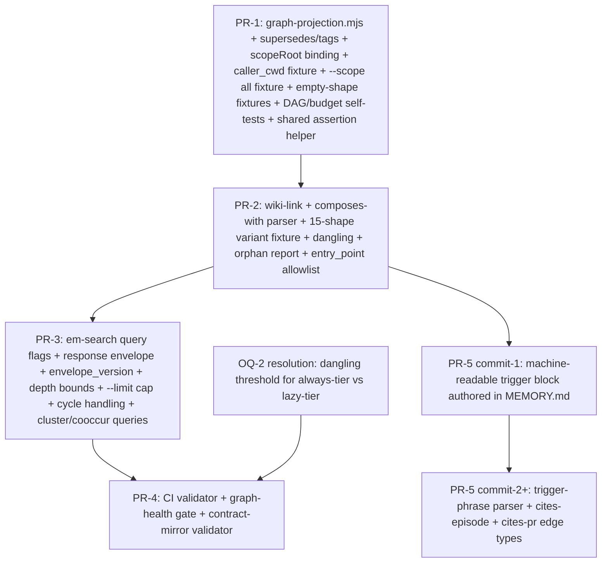

# RFC-007 — Graph Projection: first-class traversal over latent episode/rule edges

## AI context

> (1) Build an in-memory graph projection over the existing episode + rule-file corpus, persisted as a JSON sidecar to the index, exposing typed-edge traversal queries through `em-search`. (2) Solves the problem that graph-shaped edges (`supersedes`, `tags`, `[[name]]` links, "composes with") already exist in the data but are handled ad-hoc — linear walks in code, narrative-only in markdown, or not at all — so cluster, lineage, and link-rot queries require manual joins or grep. (3) Key trade-off: this is a **projection over file storage, not a graph DB** — Principle 1 ("memory is the substrate, avoid sidecar databases") rules out Neo4j/SQLite/Memgraph; rebuild-time freshness is acceptable because the corpus is small (low thousands of episodes) and the existing `em-rebuild-index.mjs` already walks every file.

---

## Problem

Graph-shaped edges live in episode + rule data today, but they aren't first-class. Observable consequences:

1. **Lineage queries are linear and one-shot.** `em-search --history <id>` walks only the `supersedes` chain via `scripts/em-search.mjs:175-192`. Real questions ("what canonical lesson does PR #309's review pattern descend from across categories?") cross supersedes branches, tags, and topic clusters — requiring multiple invocations and manual joins.

2. **`[[name]]` links rot silently.** Feedback files cross-link with `[[name]]` syntax (per CLAUDE.md auto-memory instructions). When a target is renamed or deleted, the link breaks with no detection — there's no index of who links to whom.

3. **"Composes with" is narrative-only.** `feedback_*.md` files list related rules under a `## Composes with` section as bullet lists of filenames. No way to query "what rules compose with `feedback_verify_by_artifact.md`?" without grep.

4. **Cluster queries require manual tag joins.** "All episodes tied to PR #291" is a tag-set intersection executed by reading individual results; co-occurrence (which tags appear together, which episodes form a cluster) is not a primitive.

5. **Trigger-phrase routing is hand-maintained.** The `MEMORY.md` trigger-phrase index is a flat markdown table; the reverse direction ("which trigger phrases route to `feedback_handoff_complete_bug_class.md`?") requires grepping the index manually.

6. **No detectable signal for orphans or hubs.** Episodes with zero inbound references (dead ends) and rule files with high inbound link counts (load-bearing hubs) are both interesting — neither is surfaced today.

The shared root: the data has graph structure, the access pattern doesn't. Every consumer reconstructs partial graphs in their head.

---

## Proposal

Build a **typed-edge graph projection** computed at `em-rebuild-index.mjs` time, persisted as a JSON sidecar, and exposed via new `em-search` flags. No new dependencies, no daemon, no sidecar DB.

### Node types

| Node type | Source | Identifier |
|---|---|---|
| `episode` | All episode files in local + global stores | Episode `id` |
| `rule` | `~/.claude/projects/.../memory/feedback_*.md`, `reference_*.md`, `MEMORY.md`, `MEMORY_*.md` | Filename (slug from frontmatter `name`) |
| `rfc` | `docs/rfcs/RFC-*.md` | `rfc_id` from frontmatter |

### Edge types

| Edge | Source | Direction | Notes |
|---|---|---|---|
| `supersedes` | Episode `supersedes` field | `new → old` | Existing field; just indexed |
| `tag` | Episode `tags[]` | `episode → tag` (tags are pseudo-nodes) | Enables co-occurrence queries |
| `wiki-link` | `[[name]]` matches in rule bodies | `source → target` | Resolved against rule slug index via `slugify()`; dangling links recorded as `wiki-link-dangling`; fenced code blocks + inline backticks skipped |
| `composes-with` | Top-level bullets under `## Composes with` heading in rule files | `source → target` | Markdown-list-item parsing; same `slugify()` resolution as wiki-link; nested bullets ignored |
| `trigger-phrase` | Machine-readable trigger block in `MEMORY.md` (added in PR-5) | `phrase → rule` | JSON-block parser; falls back to no-edges + stderr warning if block missing |
| `cites-episode` | Episode-id pattern (`\d{8}-\d{6}-[a-z0-9-]+-[a-f0-9]{4}`) in rule + episode bodies | `source → episode` | Lineage across categories; fenced code blocks + inline backticks skipped; self-reference filtered |
| `cites-pr` | `pr-\d+` tag (primary). `#NNN` body mention contributes ONLY when episode is also tagged `pr-NNN`. | `episode → pr` (pseudo-node) | Body-only mention without tag yields no edge — prevents meta-commentary false positives |

### Scope-root resolution (axis 9 binding)

`scopeRoot` is resolved identically to the existing logic in `scripts/em-rebuild-index.mjs` — never via `process.cwd()` in projection or query code paths:

```
scopeRoot(scope, project) =
  scope == 'local'  → resolveProject(project) + '/.episodic-memory'
  scope == 'global' → os.homedir() + '/.episodic-memory'
  scope == 'all'    → BOTH (build each separately; never merged on disk)
```

All file I/O — projection writes, query reads — uses `path.join(scopeRoot, 'graph.json')`. Subprocess invocations forward `cwd: scopeRoot`, not the caller's cwd.

**Required PR-1 fixture (axis 9):** `caller_cwd != target_project_root` — invoke `em-rebuild-index --scope local --project /tmp/target` from `/tmp/elsewhere`; assert `fs.existsSync('/tmp/target/.episodic-memory/graph.json') === true` AND `fs.existsSync('/tmp/elsewhere/.episodic-memory/graph.json') === false`. Same shape per new `em-search` query flag (PR-3) asserting the right `graph.json` is read.

**Required PR-1 fixture (axis 9, `--scope all` variant):** invoke `em-rebuild-index --scope all --project /tmp/target` from `/tmp/elsewhere`; assert BOTH `/tmp/target/.episodic-memory/graph.json` AND `<HOME>/.episodic-memory/graph.json` exist after the run, AND `/tmp/elsewhere/.episodic-memory/graph.json` does NOT exist. The union-write path must satisfy axis-9 binding at every disk location it writes.

**Shared assertion helper (required).** Signature: `assertGraphFileLocation({ scope, project, callerCwd, expectPresent: string[], expectAbsent: string[] })`. Both arrays asserted in a single call against `fs.existsSync`. New `--scope` values (or new CLI surfaces) extend `expectPresent` / `expectAbsent` at the call site; helper internals stay stable. This prevents axis-9-class bypass recurring as new surfaces are added (stop-rule from round-2 audit).

### slugify() — single source of truth

Both the `wiki-link`/`composes-with` parser and the dangling-link validator use one slug function:

```
slugify(name) =
  NFC normalize (Unicode)
  trim whitespace
  lowercase
  replace [^a-z0-9]+ with '-'  (ASCII-only after NFC; non-ASCII codepoints collapse to '-')
  collapse repeated '-'
  strip leading/trailing '-'
```

Rule-file slugs derive from frontmatter `name:`. Filename-derived slugs are NOT used (filenames may carry `.md`, version suffixes, etc.). Two rule files producing the same slug = build-time error. The ASCII-after-NFC policy guarantees reproducibility across consumers in other languages (Python/Rust/etc.) reading `graph.json` directly.

### Edge extraction rules

| Concern | Rule |
|---|---|
| Code-block exclusion | `wiki-link` and `cites-episode` extractors MUST skip text inside fenced code blocks (` ``` ` and `~~~ `) and inline backticks. Fixture coverage in PR-1 + PR-2. |
| `[[ ]]` shape variants | PR-2 ships a 15+ case fixture covering: `[[name]]`, `[[name\|alias]]`, `[[ name ]]`, `[[name.md]]` (extension stripped before slugify), `[[name#anchor]]` (anchor stripped), `[[name#anchor\|alias]]` (BOTH anchor AND alias — anchor stripped, alias dropped, target = slugify(`name`)), `[[Name]]` (case-folded), `[link](path.md)` (NOT a wiki-link), `[[]]` (empty — ignored), nested `[[[[x]]]]` (outermost only). Regex: `\[\[([^\]|#]+)(?:#[^\]|]*)?(?:\|[^\]]*)?\]\]` (capture 1 = name; anchor and alias are non-capturing optional groups, anchor-then-alias order). Each row asserts `(resolved, dangling, ignored)` classification. |
| `composes-with` parser | Bullets under `## Composes with` until next `## ` heading or EOF. Top-level only — nested bullets ignored. Markdown-link form `- [text](path.md)` resolved by file basename. Empty section yields zero edges and zero dangling entries. |
| Empty-shape handling | `tags: []` → 0 edges (not an error). `supersedes: ~` → 0 edges (never an edge to literal `"~"`). Empty `## Composes with` → 0 edges + 0 dangling. PR-1 fixtures cover each. |
| Cluster membership (`cites-pr`) | Tag-primacy: an episode belongs to PR-cluster `pr-NNN` iff it carries the `pr-NNN` tag. Body-only `#NNN` mention without tag does NOT create the edge. |
| Self-reference | An episode body that contains its own id MUST NOT create a `cites-episode` self-loop. |

### Concurrency semantics

Snapshot-at-start, last-writer-wins. Rebuild captures the episode-file set at pass start (single `readdir` per scope), then walks; episodes written mid-pass are deferred to the next rebuild. Concurrent rebuilds write to distinct temps (`graph.json.tmp.<pid>.<random>`) and atomic-rename to `graph.json`; second writer wins. Readers see a complete file via atomic rename — no advisory lock in v1. Failure mode is "slightly stale snapshot," not corruption. Documented + fixture in PR-1.

**ENOENT during pass = skip, don't fail.** If a file from the snapshot `readdir` is deleted before its `readFile` (e.g., concurrent `em-prune`), swallow the ENOENT and continue. The episode is simply absent from this projection; the next rebuild's `readdir` won't see it. Any non-ENOENT error during per-file read aborts the pass (and leaves the prior `graph.json` intact via temp+rename).

### Stale detection

At read time, `em-search` compares `graph.json.rebuilt_at` against the newest episode mtime under `scope_root`. If `newest_mtime > rebuilt_at`, emit stderr warning + set `source: "stale-projection"` in the response envelope. Threshold is "any new episode since rebuild" in v1 (configurable later). Consumers branch on `source` to decide whether to fall back to linear scan.

**mtime caveat:** `git checkout` of an older branch, file restores, and `chmod` touch mtime without semantic change. v1 accepts the false-positive rate (stderr warnings, not hard failures); a content-hash alternative (per-file SHA, stored in graph.json) is reserved for a future RFC if the noise proves painful. Documented limitation, not a v1 blocker.

### Query response envelope

All graph-query flags emit:

```json
{
  "envelope_version": "1.0.0",
  "source": "projection" | "fallback-linear" | "fallback-disabled" | "stale-projection",
  "rebuilt_at": "<iso>" | null,
  "scope": "local" | "global" | "all",
  "result_count": <int>,
  "truncated": false,
  "results": [ ... ]
}
```

Distinguishes "no edges" from "no projection." `fallback-linear` = `graph.json` missing, computed at query time. `fallback-disabled` = explicit `--no-graph` flag set by the caller. `stale-projection` = staleness check tripped. `envelope_version` is bumped whenever the schema changes; consumers MUST branch on it before reading `source`.

**Version policy.** Major bumps on field removal, field-semantic change, or envelope-shape change. Minor bumps on new fields or new `source` values (additive only). Patch bumps on documentation-only changes. Consumers MUST reject envelopes whose major version exceeds their compiled-in expectation.

### Depth bounds + cycle handling

`--depth` flag: default = 2, max = 10, negative values rejected with exit code 2. Traversal uses a visited-set keyed by node id; tag-edge cycles (episode → shared tag → other episode → shared tag) are common and would loop without it. PR-3 self-test covers `--depth 0`, `--depth -1`, `--depth 999`, empty corpus, single-node corpus, `--cluster <empty-tag>`, `--inbound <nonexistent>`.

**Result-set cap.** `--limit N` (default 1000) bounds the result-set size. High-fanout tag nodes (5000+ episodes sharing a popular tag) would otherwise emit MB-scale JSON envelopes. When the cap fires, the envelope sets `truncated: true` and `result_count` reflects total available (not just returned). Callers needing complete results raise `--limit` explicitly. Negative `--limit` rejected with exit code 2.

### Storage

- File: `path.join(scopeRoot, 'graph.json')` — one per scope, never merged on disk.
- Shape:
  ```json
  {
    "$schema_version": "1.0.0",
    "rebuilt_at": "2026-05-17T14:00:00Z",
    "scope_root": "/abs/path/to/scope",
    "node_count": 1247,
    "edge_count": 3891,
    "nodes": { "<id>": { "type": "episode|rule|rfc|tag|pr", "metadata": {...} } },
    "edges": [ { "from": "<id>", "to": "<id>", "type": "<edge_type>", "metadata": {...} } ],
    "dangling": [ { "source": "<id>", "ref": "<unresolved-slug>", "kind": "wiki-link|composes-with|trigger-phrase|cites-episode" } ],
    "nodes_with_no_edges": [ "<id>", ... ]
  }
  ```
- Atomic write via temp + rename (project convention). Temps named `graph.json.tmp.<pid>.<random>`.
- `nodes_with_no_edges[]` is distinct from `dangling[]`: dangling = edge with unresolved target; orphan = node with zero in+out edges.
- **Orphan allowlist.** A rule file may declare `entry_point: true` in frontmatter to suppress its presence in `nodes_with_no_edges[]` — canonical roots (`MEMORY.md`, top-level index files) are entry points by design, not orphans. The allowlist is the rule files' own frontmatter; no separate config file.
- **Entry-point auditability.** `--graph-health` emits `entry_points[]` as a separate array from `nodes_with_no_edges[]`. Rule files declaring `entry_point: true` appear in the former, not the latter, so reviewers can audit suppression decisions explicitly (self-attested metadata still needs a visible audit surface — see `#221` snapshot validator gap, same class).

### Rule-node frontmatter convention

Rule nodes (`feedback_*.md`, `reference_*.md`, `MEMORY.md`, `MEMORY_*.md`) may carry these optional frontmatter keys recognized by the projection (in addition to the existing `name`, `description`, `type` keys):

| Key | Type | Purpose |
|---|---|---|
| `entry_point` | boolean | When `true`, suppress this rule from `nodes_with_no_edges[]`; surface it in `entry_points[]` instead. Default: `false`. |

This is a query-time convention (consumed by `--graph-health`), not an edge-extraction convention — that's why it lives here and not in the machine-readable edge contract block.

### Query surface

New `em-search` flags, all read-only, all output JSON:

```bash
# Show all nodes connected to <id> up to depth N, optionally filtered by edge type.
em-search --related <id> --depth 2 [--edge-types tag,wiki-link]

# Show inbound references (who links to <id>?). Useful for hub detection.
em-search --inbound <id>

# Show the cluster around a tag or PR number.
em-search --cluster pr-291
em-search --cluster tag:bp1-auto-pilot

# Report dangling links and orphan nodes.
em-search --graph-health

# Co-occurrence: which tags appear together with <tag>?
em-search --tag-cooccur bp1-auto-pilot --top 10
```

### Rebuild integration

- `em-rebuild-index.mjs` invokes the projection pass after writing the existing index, forwarding the same `--scope` flag.
- Projection is **derivative**, not authoritative — if `graph.json` is missing or stale, queries fall back to linear scan with `source: "fallback-linear"` (or `"stale-projection"`) in the response envelope + stderr warning. Substrate (episode files) remains source of truth (Principle 1). The grep-based pathway used today by RFC-004's BP-1 auto-pilot survives indefinitely as the fallback.
- Rebuild cost: O(N) for node extraction; O(E) for edge resolution where E ≤ N × avg-links-per-file. Target: < 500ms for current corpus (~2k episodes + ~80 rule files). PR-1 self-test measures + asserts the budget.

### Scope

- **In scope:**
  - Node + edge extraction at `em-rebuild-index.mjs` time, per scope (`local`, `global`, `all`)
  - JSON-sidecar persistence per scope (never merged on disk; cross-scope reachable via read-time union with `--scope all`)
  - `scopeRoot` binding spec + caller-cwd-elsewhere fixture (axis 9)
  - `slugify()` as single source of truth for wiki/composes resolution
  - New `em-search` query flags (`--related`, `--inbound`, `--cluster`, `--graph-health`, `--tag-cooccur`) — all emit the response envelope
  - Dangling-link, orphan (`nodes_with_no_edges`), and stale-projection reporting
  - CI validator for graph-health regression (always-tier rule files: zero dangling links → hard fail; lazy-tier: warn — exact threshold per OQ-2)
  - Contract-mirror validator: `scripts/rfc-graph-contract-validate.mjs` diffs the RFC's machine-readable edge contract against `scripts/graph-projection.mjs` constants (per rule 14)

- **Out of scope:**
  - External graph DB (Neo4j, Memgraph, SQLite-with-graph) — violates Principle 1
  - Real-time edge updates (mutations land on rebuild, not on `em-store`)
  - Graph-mutation API (no `em-link --from X --to Y`; edges come from the data itself)
  - Visualization (JSON output is the deliverable)
  - On-disk cross-scope merge (read-time union via `--scope all` is in scope; merged file is not)
  - Embedding/semantic similarity (RFC-001 territory)
  - PR pseudo-node verification against GitHub (PR nodes are asserted from corpus content, not verified — documented limitation)
  - Advisory lockfile on rebuild (concurrent-rebuild semantics are last-writer-wins; lockfile reserved for a future RFC if collisions prove painful)

---

## Invariants

| # | Invariant | Verifier |
|---|---|---|
| I1 | `graph.json.edge_count == graph.json.edges.length` | PR-1 self-test |
| I2 | Every edge `from`/`to` resolves to a node in `nodes{}` OR appears in `dangling[]` | PR-2 validator |
| I3 | `supersedes` edges form a DAG (no cycles) | PR-1 self-test |
| I4 | `rebuilt_at` ≥ mtime of newest episode at pass start | PR-1 self-test |
| I5 | Per-scope `graph.json` references only nodes whose source files live under that scope's `scope_root` | PR-4 CI validator |
| I6 | Depth-bounded traversal output AND `--limit`-truncated output are deterministic. Truncation slices the result set sorted by node id ascending, then takes the first N. | PR-3 self-test |

---

## Alternatives considered

| Alternative | Why rejected |
|---|---|
| External graph DB (Neo4j, Memgraph) | Violates Principle 1 (single store, no sidecar databases). Installation stops being a single directory. |
| SQLite with recursive CTEs | Adds a binary dependency. Project pins to "zero deps, Node.js stdlib only" (CLAUDE.md). Equivalent expressiveness available with in-memory adjacency maps for our corpus size. |
| Real-time edge maintenance on every `em-store` | Increases write-path complexity for a read-heavy workload. Rebuild-time freshness is sufficient — index is already rebuilt frequently; piggyback. |
| Treat `[[name]]` as plain text, keep grep-only access | Doesn't solve link-rot or composes-with cluster queries. The data is structured; pretending it isn't loses leverage. |
| Generic property graph in JSON without typed edges | Loses query precision. "Find related" without edge-type filter returns supersedes + tags + citations mixed; user can't ask "only show me lineage edges, not tag co-occurrence." |
| Build into `em-search` only (no shared projection) | Forces every query to re-derive edges. Doesn't enable graph-health validator. Doesn't catch dangling-link regressions in CI. |
| Defer until corpus is larger | Link rot is already happening (rules reference renamed feedback files; no detection). Cost to build now is low; cost to fix rotted links retroactively grows with corpus. |

---

## Implementation plan

> Populate this section when the RFC moves to `accepted`. Use phase or PR sub-headings as appropriate.

### Sequencing (preview)



**PR-5 sequencing note:** PR-5's first commit authors the machine-readable trigger block in `MEMORY.md` (per rule 14); subsequent commits land the parser code. The parser is never merged ahead of the data it parses.

**PR-1 test plan (non-negotiable):**
1. `caller_cwd != target_project_root` fixture for `--scope local` — asserts `graph.json` lands under `--project` target, not caller cwd (axis 9).
2. `--scope all` fixture — asserts BOTH `<project>/.episodic-memory/graph.json` AND `<HOME>/.episodic-memory/graph.json` exist after the run, AND `<caller_cwd>/.episodic-memory/graph.json` does NOT exist.
3. Shared assertion helper — all axis-9 fixtures invoke `assertGraphFileLocation({ scope, project, callerCwd, expectPresent, expectAbsent })` (signature defined in "Scope-root resolution"); new flags reuse the helper.
4. Empty-shape fixtures per edge type — `tags: []`, `supersedes: ~`, `supersedes: ""` (empty string), `supersedes` field absent, empty `## Composes with` section.
5. ENOENT-during-pass fixture — delete a file from the snapshot mid-rebuild; assert pass completes and that episode is absent from the projection (not a hard failure).
6. DAG check on `supersedes` edges (I3).
7. Rebuild-cost budget assertion (< 500ms on representative corpus).
8. Atomic-write check — partial write does not leave a parseable `graph.json` (temp+rename).

**PR-2 test plan (non-negotiable):**
1. 15+ case wiki-link shape-variant fixture; each row asserts `(resolved | dangling | ignored)`.
2. Fenced-code-block + inline-backtick exclusion fixture for both `wiki-link` and `cites-episode`.
3. `composes-with` parser: nested bullets ignored; markdown-link form resolved by basename; empty section yields neither edge nor dangling entry.
4. Dangling-link buckets distinct from `nodes_with_no_edges[]`.

---

## Implementation

> Populate during build stage — mark each item immediately after it ships. Do not batch at the end.

| PR/Commit | Files changed | Tests | Notes |
|---|---|---|---|
| _pending_ | _pending_ | _pending_ | _pending_ |

---

## Related RFCs

- **RFC-001 — Intelligent Memory (accepted):** Builds the tag index this RFC traverses for co-occurrence. RFC-007 is structural-edge complement to RFC-001's relevance-scoring work — orthogonal axes.
- **RFC-002 — Learning Loop (accepted):** Violation episodes form citation chains. Graph-projection makes those chains queryable (`em-search --inbound <pattern-id>` → all violations of that pattern).
- **RFC-004 — BP-1 Auto-Pilot (accepted):** Auto-pilot consumes rule-file links to assemble per-step context. Today it greps; with graph-projection it can resolve `composes-with` deterministically. **The grep pathway survives indefinitely as fallback** — RFC-007 is additive. Per the response envelope's `source` field, callers can always detect "projection unavailable / stale" and degrade to the existing path (axis 2 stale-detection rule).

---

## Second opinion

> Required before `status: accepted` can be set.

**Reviewer:** `negative-scenario-planner` (plan-time 8-axis attack-class matrix, toolkit v9.4 + axis 9)
**Date:** 2026-05-17
**Final decision (round 4):** **ACCEPT** — consensus reached. No required edits remaining; reviewer explicitly states "the loop terminates."
**AI-slop check:** clean — concrete repros, line-anchored citations, fixed-point convergence demonstrated across 4 rounds.

### Audit-trail summary

| Round | Verdict | Findings |
|---|---|---|
| 1 | HOLD | 3 BLOCKERs (axis-9 scope-root binding; I5 per-scope containment; contract-mirror block) + 6 MAJORs + 6 MINORs |
| 2 | ACCEPT WITH MODIFICATION | All 3 BLOCKERs + 5/6 MAJORs RESOLVED; 1 MAJOR (R1: `--scope all` fixture) + 9 MINORs surfaced from round-1 fixes |
| 3 | ACCEPT WITH MODIFICATION | All R1-R10 RESOLVED; 4 MINORs (N1-N4) surfaced from round-2 fixes (entry_point auditability; truncation determinism; envelope version policy; helper signature) |
| 4 | **ACCEPT** | All N1-N4 RESOLVED; trajectory analysis confirms fixed point (substantive → documentation-quality findings); 2 optional nits applied for polish |

Detailed round-1 finding table preserved below for historical record.

---

### Round-1 detail (HOLD, preserved for record)

### Invariants (locally verifiable)

| # | Invariant | Locally verifiable? |
|---|---|---|
| I1 | `graph.json.edge_count == graph.json.edges.length` | YES |
| I2 | Every edge `from`/`to` resolves to a node in `nodes{}` OR is recorded in `dangling[]` | YES |
| I3 | `supersedes` edges form a DAG | YES |
| I4 | `rebuilt_at` ≥ mtime of newest episode at rebuild start | YES |
| I5 | Per-scope `graph.json` references only nodes whose source files live under that scope's root | **NO** (BLOCKER — no scopeRoot binding spec) |
| I6 | Depth-bounded traversal output is deterministic (stable node ordering) | YES |

### Contract-density assessment

7 edge types × 5 node types × 5 query flags × 2 scopes = **350-cell behavior matrix.** Densest contract surface in the project; spec-cycle oscillation near-certain without a contract-mirror block per rule 14.

### Project-root binding pre-check (axis 9)

- **Trigger A fires:** per-scope rebuild without specifying `--scope local|global|all` forwarding from `em-rebuild-index.mjs`.
- **Trigger D fires:** `<store>` at L67 is ambiguous between `process.cwd()/.episodic-memory/` and resolved scope root — PR-186-class bug surface.

### 8-axis coverage table

| Axis | Applies? | Verdict | Repro / coverage plan |
|---|---|---|---|
| **1 Splice** | YES | **GAP** | Episode body contains `20260507-033418-...-f994` inside a fenced code block (a sample). Projection extracts `cites-episode` edge as if real. Coverage: OQ-4 resolved to REQUIRED — skip fenced code blocks + inline backticks. |
| **2 Forge / Stale** | YES | **GAP** | `graph.json` exists with `rebuilt_at: 2026-05-01`; 50 `em-store` calls since; `--related <new-id>` returns stale data without warning (fallback gated on "missing", not "stale"). Coverage: stale-detection predicate (compare `rebuilt_at` vs newest episode mtime). |
| **3 Orphan** | YES | **ACCEPT WITH MODIFICATION** | True orphan (node with zero in+out edges) has no reporting field. `--graph-health` must enumerate `nodes_with_no_edges[]` distinct from `dangling[]`. |
| **4 Empty** | YES | **GAP** | (a) `tags: []` → 0 edges (valid, easy to miscount); (b) `supersedes: ~` must not yield edge to literal `"~"`; (c) empty `## Composes with` section must not yield dangling entry. Coverage: per-shape fixtures per edge type. |
| **5 Wrong-shape** | YES | **GAP** | `[[name\|alias]]`, `[[ name ]]`, `[[name.md]]`, `[[name#section]]`, `[name](path.md)` mistaken for wiki, composes-with `- file.md (deprecated)`, nested sublists. Coverage: 15+ shape-variant parser fixture. |
| **6 Wrong-semantic** | YES | **GAP** | Episode body says "PR #291 is the model for our approach" — extracted as `cites-pr 291` but episode is meta-commentary. Conversely: episode tagged `pr-291` but body discusses #309. Coverage: specify cluster-membership rule (tag-primacy OR body-primacy, not both). |
| **7 Race / TOCTOU** | YES | **GAP** | (a) two concurrent rebuilds — both temp-write, second `rename` may carry older snapshot; (b) reader mid-rebuild — atomic rename protects single file, but cross-scope (read global while local rebuilds) needs explicit policy; (c) episode added during projection pass — walked or not? Coverage: advisory `graph.json.lock` OR snapshot-at-start with last-writer-wins doc + fixture. |
| **8 Boundary** | YES | **GAP** | `--depth 0`, `--depth -1`, `--depth 999` (cycle in tag edges → infinite walk without visited-set), empty corpus, single-node corpus, `--cluster <tag>` for zero-member tag, `--inbound <non-existent-id>`. Coverage: boundary fixture matrix; specify default+max depth + cycle handling. |
| **9 Project-root binding** | YES | **BLOCKER** | `cd /tmp/empty && node scripts/em-rebuild-index.mjs --scope local --project /Users/x/real-project` — does `graph.json` land in `/tmp/empty/.episodic-memory/` (BUG) or `/Users/x/real-project/.episodic-memory/` (CORRECT)? Same for `em-search --related --project <X>` reading the right `graph.json`. Coverage: explicit "scopeRoot resolution" subsection + temp-dir caller-cwd-elsewhere fixture asserting file location on disk. |

### Cross-cutting concerns

- **C1 — Scope-merge ambiguity (axes 1, 2, 3, 9).** OQ-3 (merge vs per-scope) is implicitly answered by every query flag. Must be resolved before PR-3, not "deferred."
- **C2 — Wiki-link slug resolution is a chained contract (axes 3, 5, 6).** "Resolved against rule slug index" doesn't define the slug function. Specify `slugify(name) -> string` as single source of truth used by both parser and validator.
- **C3 — `MEMORY.md` trigger-phrase parser is brittle (axes 4, 5).** Schema stability of the prose table is not guaranteed (multiple addenda already split it). Needs adjacent machine-readable block per rule 14.
- **C4 — CI validator (PR-4) depends on OQ-2 resolution.** Mermaid graph should reflect that dependency.
- **C5 — Fallback semantics make graph silently optional (axes 2, 7).** `em-search --inbound X` returning `[]` is ambiguous between "no edges" and "projection missing." Recommend response envelope: `{ "source": "projection" | "fallback-linear" | "fallback-disabled", "results": [...] }`.
- **C6 — `cites-pr` pseudo-node has no source-of-truth (axes 5, 6).** Hub queries can show `pr-9999` (typo) with inbound edges. Either cross-check `gh pr view` cache or document "PR-node existence is asserted, not verified."

### Recommended RFC revisions (before `accepted`)

| # | Severity | Revision |
|---|---|---|
| 1 | **BLOCKER** (axis 9) | Add "Scope-root resolution" subsection: `scopeRoot` resolved identically to `em-rebuild-index.mjs`'s existing logic; all writes use `path.join(scopeRoot, 'graph.json')`; no `process.cwd()` reads in projection or query paths. |
| 2 | **BLOCKER** (I5) | Add invariant: per-scope `graph.json` contains only nodes whose source files live under that scope. Validator in PR-4. |
| 3 | **BLOCKER** (contract-density) | Embed machine-readable contract-mirror block (edge type → source-field → parser shape → slug-resolution → dangling-bucket → idempotency). Add `scripts/rfc-graph-contract-validate.mjs` diffing block against `graph-projection.mjs` constants. |
| 4 | BLOCKER (axis 1 + OQ-4) | Resolve OQ-4 to REQUIRED: `cites-episode` and `[[name]]` extraction MUST skip fenced code blocks and inline backticks. Move from OQ to Proposal. |
| 5 | BLOCKER (axis 9 fixture) | PR-1 test plan: `caller_cwd != target_project_root` fixture for `em-rebuild-index` + each new `em-search` flag. Assert `fs.existsSync` on disk. |
| 6 | MAJOR (C1) | Resolve OQ-3 before PR-3. Recommend per-scope projection + read-time union with explicit `--scope` flag, default = caller's resolved scope. |
| 7 | MAJOR (C2) | Define `slugify(name)` once in Proposal; cite from both `wiki-link` and `composes-with` rows. |
| 8 | MAJOR (C5) | Spec the query response envelope distinguishing projection/fallback. |
| 9 | MAJOR (axis 7) | Document concurrent-rebuild semantics: lockfile OR snapshot-at-start with last-writer-wins. Add fixture. |
| 10 | MAJOR (axis 8) | Specify `--depth` bounds: default = 2, max = 10, reject negatives. Specify cycle handling (visited-set). |
| 11 | MAJOR (C3) | Add machine-readable trigger-phrase block to `MEMORY.md` before PR-5; PR-5 parser reads the block, not the prose table. |
| 12 | MINOR (C6) | Document PR pseudo-nodes are asserted from corpus content, not verified against GitHub. |
| 13 | MINOR (axis 4) | Add empty-shape fixtures per edge type to PR-1 test plan. |
| 14 | MINOR (axis 5) | Add wiki-link parser shape-variant fixture (15+ cases) to PR-2. |
| 15 | MINOR (related RFCs) | Note RFC-007 PR-1 must not block RFC-004 BP-1 auto-pilot's existing grep pathway (must survive as fallback per axis 2). |

### Auditor verification + limitations

- Read RFC-007 in full (L1-223).
- Verified axis 9 triggers A + D fire; contract-density 350 > 4-surface threshold; no CLAUDE.md zero-deps/atomic-write violation in proposal text (risk lives in unstated cwd-binding).
- Canonical prompt: `20260507-033418-canonical-prompt-for-negative-scenario-p-f994` (v6.5, toolkit v9.4 + axis 9).
- **Limitation:** Step 2 feedback-file batch and Step 3 fresh corpus queries skipped per caller's "emit immediately" directive; prior-finding anchors are from canonical-prompt's reference set (PR #156, PR-186, D2/D6, T49/D8). Re-walk with fresh anchors available on request.
- **Limitation:** Audit not persisted as an `em-store` episode this turn (caller did not request); follow-up `em-store --scope local` recommended if RFC's Second Opinion section will cite the episode id.

---

## Open questions

| # | Question | Owner | Status |
|---|---|---|---|
| OQ-1 | Should rule files be first-class nodes in the projection? | Champion | **RESOLVED** — rule files ARE first-class nodes; enables hub + orphan detection (see Storage `nodes_with_no_edges[]`). |
| OQ-2 | How aggressively should dangling links fail CI? Always-tier hard fail vs lazy-tier warn — exact thresholds. | Champion | open — must close before PR-4 lands (mermaid dependency). |
| OQ-3 | Should the projection merge local + global scopes on disk, or stay per-scope? | Champion | **RESOLVED** — per-scope on disk; cross-scope reachable via read-time union with `--scope all` (see Scope-root resolution). |
| OQ-4 | Does `cites-episode` regex extraction risk false positives in code blocks? | Champion | **RESOLVED** — `wiki-link` and `cites-episode` extractors MUST skip fenced code blocks and inline backticks (see Edge extraction rules). |
| OQ-5 | What is the failure mode when `graph.json` is missing or stale? | Champion | **RESOLVED** — response envelope `source` field distinguishes `projection` / `fallback-linear` / `fallback-disabled` / `stale-projection`. Stale = any new episode since `rebuilt_at` (default threshold). |
| OQ-6 | Should this RFC ship a minimal visualization (Mermaid subgraph export)? | Champion | open — JSON-only is the current Proposal; visualization is a follow-up RFC. |

---

## Edge contract (machine-readable)

> Source of truth for `scripts/graph-projection.mjs` constants. Validated by `scripts/rfc-graph-contract-validate.mjs` (PR-4) — drift between this block and the implementation is a CI failure (per rule 14).

```json
{
  "$schema_version": "1.0.0",
  "slugify": {
    "unicode_normalize": "NFC",
    "trim": true,
    "case": "lower",
    "ascii_only": true,
    "non_alphanum_replace": "-",
    "collapse_repeated": "-",
    "strip_edges": "-",
    "collision_policy": "build-time-error"
  },
  "edge_types": [
    {
      "type": "supersedes",
      "source_node_type": "episode",
      "target_node_type": "episode",
      "source_field": "episode.supersedes",
      "parser": "string-id",
      "slug_resolver": null,
      "skip_when": ["null", "missing", "tilde", "empty-string"],
      "dangling_bucket": "wiki-link",
      "idempotent": true
    },
    {
      "type": "tag",
      "source_node_type": "episode",
      "target_node_type": "tag",
      "source_field": "episode.tags[]",
      "parser": "array-of-strings",
      "slug_resolver": "slugify",
      "skip_when": ["empty-array"],
      "dangling_bucket": null,
      "idempotent": true
    },
    {
      "type": "wiki-link",
      "source_node_type": "rule",
      "target_node_type": "rule",
      "source_field": "rule.body",
      "parser": "regex:\\[\\[([^\\]|#]+)([|#][^\\]]*)?\\]\\]",
      "slug_resolver": "slugify",
      "skip_when": ["inside-fenced-code-block", "inside-inline-backticks", "empty-name"],
      "dangling_bucket": "wiki-link",
      "idempotent": true
    },
    {
      "type": "composes-with",
      "source_node_type": "rule",
      "target_node_type": "rule",
      "source_field": "rule.body['## Composes with' section, top-level bullets only]",
      "parser": "markdown-list-item",
      "slug_resolver": "slugify",
      "skip_when": ["empty-section", "nested-bullet"],
      "dangling_bucket": "composes-with",
      "idempotent": true
    },
    {
      "type": "trigger-phrase",
      "source_node_type": "phrase",
      "target_node_type": "rule",
      "source_field": "MEMORY.md:machine-readable-trigger-block",
      "parser": "json-block",
      "slug_resolver": "slugify",
      "skip_when": ["block-missing"],
      "dangling_bucket": "trigger-phrase",
      "idempotent": true
    },
    {
      "type": "cites-episode",
      "source_node_type": "episode|rule",
      "target_node_type": "episode",
      "source_field": "<source>.body",
      "parser": "regex:\\d{8}-\\d{6}-[a-z0-9-]+-[a-f0-9]{4}",
      "slug_resolver": null,
      "skip_when": ["inside-fenced-code-block", "inside-inline-backticks", "self-reference"],
      "dangling_bucket": "cites-episode",
      "idempotent": true
    },
    {
      "type": "cites-pr",
      "source_node_type": "episode",
      "target_node_type": "pr",
      "source_field": "episode.tags[matching 'pr-\\d+']",
      "parser": "tag-prefix-match",
      "slug_resolver": null,
      "skip_when": ["no-pr-tag"],
      "dangling_bucket": null,
      "idempotent": true,
      "note": "Body-only `#NNN` mentions do NOT create edges unless the episode is also tagged `pr-NNN`. Prevents meta-commentary false positives. PR-node existence is asserted from corpus content, not verified against GitHub."
    }
  ]
}
```

---

## Deferral note

> Populate only if status changes to `deferred`.

---

## Withdrawal note

> Populate only if status changes to `withdrawn`.

---

## Supersession note

> Populate only if status changes to `superseded`.
