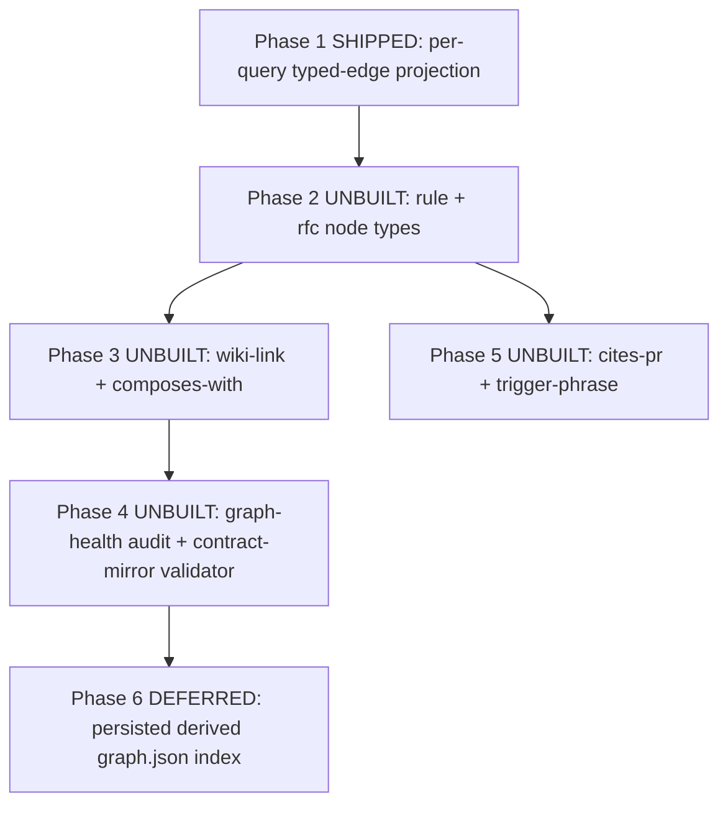

# RFC-007 — Graph Projection: first-class traversal over latent episode/rule edges

## AI context

> (1) Build a typed-edge graph projection over the existing episode corpus, exposing `--from` / `--orphans` / `--hubs` traversal queries from a standalone `scripts/em-graph.mjs`. (2) Solves the problem that graph-shaped edges (`supersedes`, `tags`, evidence links, body citations, consolidation membership) already exist in the data but are handled ad-hoc — linear walks in code, narrative-only in markdown, or not at all — so cluster, lineage, and link-rot queries require manual joins or grep. (3) v1 shipped as `scripts/em-graph.mjs`: a per-query projection with no persisted artifact (built fresh on every call from index rows plus one body pass when `cites` is selected). The persisted derived index is a deferred phase (see Storage section, Phase 6 of the Implementation plan). Key trade-off: this is a **projection over file storage, not a graph DB** — Principle 1 ("memory is the substrate, avoid sidecar databases") rules out Neo4j/SQLite/Memgraph; rebuild-time freshness is acceptable because the corpus is small (low thousands of episodes) and the existing `em-rebuild-index.mjs` already walks every file.

---

## Problem

Graph-shaped edges live in episode + rule data today, but they aren't first-class. Observable consequences:

1. **Lineage queries are linear and one-shot.** `em-search --history <id>` walks only the `supersedes` chain via `scripts/em-search.mjs:175-192`. Real questions ("what canonical lesson does PR #309's review pattern descend from across categories?") cross supersedes branches, tags, and topic clusters — requiring multiple invocations and manual joins.

2. **`[[name]]` links rot silently.** Feedback files cross-link with `[[name]]` syntax (per CLAUDE.md auto-memory instructions). When a target is renamed or deleted, the link breaks with no detection — there's no index of who links to whom.

3. **"Composes with" is narrative-only.** `feedback_*.md` files list related rules under a `## Composes with` section as bullet lists of filenames. No way to query "what rules compose with `feedback_verify_by_artifact.md`?" without grep.

4. **Cluster queries require manual tag joins.** "All episodes tied to PR #291" is a tag-set intersection executed by reading individual results; co-occurrence (which tags appear together, which episodes form a cluster) is not a primitive.

5. **Trigger-phrase routing is hand-maintained.** The `MEMORY.md` trigger-phrase index is a flat markdown table; the reverse direction ("which trigger phrases route to `feedback_handoff_complete_bug_class.md`?") requires grepping the index manually.

6. **No detectable signal for orphans or hubs.** Episodes with zero inbound references (dead ends) and rule files with high inbound link counts (load-bearing hubs) are both interesting — neither is surfaced today.

The shared root: the data has graph structure, the access pattern doesn't. Every consumer reconstructs partial graphs in their head.

---

## Proposal

Build a **typed-edge graph projection** computed at `em-rebuild-index.mjs` time, persisted as a JSON sidecar, and exposed via new `em-search` flags. No new dependencies, no daemon, no sidecar DB.

### Node types

| Node type | Status |
|---|---|
| `episode` | SHIPPED (`em-graph.mjs:194`) |
| `tag` (pseudo-node `tag:<name>`) | SHIPPED (`em-graph.mjs:190`), opt-in via `--edges tags` |
| `rule` | SHIPPED (`em-graph.mjs:227`), opt-in via `--nodes rule` |
| `rfc` | SHIPPED (`em-graph.mjs:231`), opt-in via `--nodes rfc` |

**Node type details (preserved for the unbuilt phase and the shipped ones).**

`episode` — all episode files in local + global stores; identifier = episode `id`.

`tag` — pseudo-node of the form `tag:<name>`; emitted only when `--edges tags` is requested (tag fan-out is the noisiest edge and is excluded from `DEFAULT_EDGES`).

`rule` — source would be `~/.claude/projects/.../memory/feedback_*.md`, `reference_*.md`, `MEMORY.md`, `MEMORY_*.md`; identifier = filename (slug from frontmatter `name`). Not projected by `scripts/em-graph.mjs`; belongs to the next phase.

A rule file with no frontmatter `name:` key has no identifier and is SKIPPED, counted in the
scan's `skipped` total, never projected under a filename-derived slug (which `:133` forbids).
As observed on 2026-07-25, eight files in the reference corpus are in this state and every one of
them is a `MEMORY*` file: `MEMORY.md`, `MEMORY_alwaystier_incidents.md`, `MEMORY_anchors.md`,
`MEMORY_incidents_2026-07-10.md`, `MEMORY_open_issues.md`, `MEMORY_pr_history.md`,
`MEMORY_seat_ops.md`, `MEMORY_tooling.md` — eight of the nine files matching the `MEMORY.md` plus
`MEMORY_*.md` globs, the exception being `MEMORY_workplan_changelog.md`. Note that `:233` names
`MEMORY.md` among the canonical entry-point roots, so a canonical root is currently
unprojectable. That tension is tracked on issue #585 with the other `entry_point` contradictions.

`rfc` — source would be `docs/rfcs/RFC-*.md`; identifier = `rfc_id` from frontmatter. Not projected by `scripts/em-graph.mjs`; belongs to the next phase.

### Edge types

| Edge | Status |
|---|---|
| `supersedes` | SHIPPED (`em-graph.mjs:171-172`) |
| `consolidates` | SHIPPED (`em-graph.mjs:174-176`) |
| `evidence` | SHIPPED (`em-graph.mjs:177-180`) |
| `cites` | SHIPPED (`em-graph.mjs:181-183`, `bodyCitations` at `:156-167`) |
| `tags` | SHIPPED (`em-graph.mjs:184-186`), opt-in |
| `wiki-link` | UNBUILT — Phase 3 |
| `composes-with` | UNBUILT — Phase 3 |
| `trigger-phrase` | UNBUILT — Phase 5 |
| `cites-pr` | UNBUILT — Phase 5 |

**Naming correction.** This RFC originally called the body-citation edge `cites-episode`. The shipped name is bare `cites`. The RFC adopts the shipped name throughout. `consolidates` and `evidence` were added during implementation and are recorded here for the first time; the pre-implementation RFC did not name them.

**Default edge set.** The shipped default is `supersedes, consolidates, evidence, cites`. `tags` must be requested explicitly (it is not in `DEFAULT_EDGES`, `em-graph.mjs:82`).

**Shipped edge details.**

- `supersedes` — episode `supersedes` field (and its `superseded_by` mirror), `new → old`. Emitted from `em-graph.mjs:171-172`.
- `consolidates` — digest → member; source is `episode.consolidates[]` index field, direction `digest → member`. Emitted from `em-graph.mjs:174-176`.
- `evidence` — lesson ↔ violation, sourced from `episode.evidence[]` and `episode.lessons[]` index fields. Emitted from `em-graph.mjs:177-180`.
- `cites` — episode → episode whose id appears in its BODY; fenced code blocks and inline backticks are skipped, self-references filtered. The regex is `\d{8}-\d{6}-[a-z0-9-]+-[a-f0-9]{4}` over the body (frontmatter ids are already first-class edges via `supersedes` / `consolidates` and are not rescanned). Emitted from `em-graph.mjs:181-183` via `bodyCitations` at `:156-167`.
- `tags` — episode → `tag:<name>` pseudo-node; the tag name is lowercased and trimmed. Opt-in via `--edges tags`; excluded from `DEFAULT_EDGES`. Emitted from `em-graph.mjs:184-186`.

**Unbuilt edge details (preserved verbatim from the original RFC).**

- `wiki-link` — `[[name]]` matches in rule bodies; `source → target`; resolved against rule slug index via `slugify()`; dangling links recorded as `wiki-link-dangling`; fenced code blocks + inline backticks skipped.
- `composes-with` — top-level bullets under `## Composes with` heading in rule files; `source → target`; markdown-list-item parsing; same `slugify()` resolution as wiki-link; nested bullets ignored.
- `trigger-phrase` — machine-readable trigger block in `MEMORY.md` (added in PR-5); `phrase → rule`; JSON-block parser; falls back to no-edges + stderr warning if block missing.
- `cites-pr` — `pr-\d+` tag (primary). `#NNN` body mention contributes ONLY when episode is also tagged `pr-NNN`. `episode → pr` (pseudo-node); body-only mention without tag yields no edge — prevents meta-commentary false positives.

### Scope-root resolution (axis 9 binding)

v1 has no persisted artifact, so the binding axis is **which stores are read**, not where a sidecar is written. Scope resolution is fixed:

```
scopeRoot(scope, project) =
  scope == 'local'  → resolveLocalDir()  (from scripts/lib/local-dir.mjs)
  scope == 'global' → path.join(os.homedir(), '.episodic-memory')
  scope == 'all'    → BOTH (read each separately; never merged on disk)
```

Concretely in the shipped code: `GLOBAL_DIR = path.join(os.homedir(), '.episodic-memory')` (`em-graph.mjs:42`); `LOCAL_DIR = resolveLocalDir()` (`em-graph.mjs:39,43`); `--scope` flag default `all` (`em-graph.mjs:76`, validated `:94-98`). Index rows load via `loadIndex` from `./lib/relevance.mjs` (`em-graph.mjs:40`). The `--scope all` path reads both stores and de-duplicates by id (local shadows global on collision, matching the readers); nothing is ever written to disk.

**Axis-9 fixtures for a WRITER path.** Because v1 does not write, the caller-cwd-elsewhere fixtures, the `--scope all` union-write fixture, and the shared `assertGraphFileLocation({ scope, project, callerCwd, expectPresent, expectAbsent })` helper described in earlier drafts of this RFC have nothing to assert against in v1. They are preserved verbatim below and move to Phase 6 (DEFERRED) where the persisted index returns — the moment a file is written, those fixtures and the helper become required, and the helper internals stay stable as new surfaces extend `expectPresent` / `expectAbsent` at the call site.

> **[DEFERRED to Phase 6]** **Required PR-1 fixture (axis 9):** `caller_cwd != target_project_root` — invoke `em-rebuild-index --scope local --project /tmp/target` from `/tmp/elsewhere`; assert `fs.existsSync('/tmp/target/.episodic-memory/graph.json') === true` AND `fs.existsSync('/tmp/elsewhere/.episodic-memory/graph.json') === false`. Same shape per new `em-search` query flag (PR-3) asserting the right `graph.json` is read.
>
> **[DEFERRED to Phase 6]** **Required PR-1 fixture (axis 9, `--scope all` variant):** invoke `em-rebuild-index --scope all --project /tmp/target` from `/tmp/elsewhere`; assert BOTH `/tmp/target/.episodic-memory/graph.json` AND `<HOME>/.episodic-memory/graph.json` exist after the run, AND `/tmp/elsewhere/.episodic-memory/graph.json` does NOT exist. The union-write path must satisfy axis-9 binding at every disk location it writes.
>
> **[DEFERRED to Phase 6]** **Shared assertion helper (required).** Signature: `assertGraphFileLocation({ scope, project, callerCwd, expectPresent: string[], expectAbsent: string[] })`. Both arrays asserted in a single call against `fs.existsSync`. New `--scope` values (or new CLI surfaces) extend `expectPresent` / `expectAbsent` at the call site; helper internals stay stable. This prevents axis-9-class bypass recurring as new surfaces are added (stop-rule from round-2 audit).

### slugify() — single source of truth

Both the `wiki-link`/`composes-with` parser and the dangling-link validator use one slug function:

```
slugify(name) =
  NFC normalize (Unicode)
  trim whitespace
  lowercase
  replace [^a-z0-9]+ with '-'  (ASCII-only after NFC; non-ASCII codepoints collapse to '-')
  collapse repeated '-'
  strip leading/trailing '-'
```

Rule-file slugs derive from frontmatter `name:`. Filename-derived slugs are NOT used (filenames may carry `.md`, version suffixes, etc.). Two rule files producing the same slug = build-time error. The ASCII-after-NFC policy guarantees reproducibility across consumers in other languages (Python/Rust/etc.) reading `graph.json` directly.

### Edge extraction rules

| Concern | Rule |
|---|---|
| Code-block exclusion | `wiki-link` and `cites` extractors MUST skip text inside fenced code blocks (` ``` ` and `~~~ `) and inline backticks. Fixture coverage in PR-1 + PR-2. |
| `[[ ]]` shape variants | PR-2 ships a 15+ case fixture covering: `[[name]]`, `[[name\|alias]]`, `[[ name ]]`, `[[name.md]]` (extension stripped before slugify), `[[name#anchor]]` (anchor stripped), `[[name#anchor\|alias]]` (BOTH anchor AND alias — anchor stripped, alias dropped, target = slugify(`name`)), `[[Name]]` (case-folded), `[link](path.md)` (NOT a wiki-link), `[[]]` (empty — ignored), nested `[[[[x]]]]` (outermost only). Regex: `\[\[([^\]|#]+)(?:#[^\]|]*)?(?:\|[^\]]*)?\]\]` (capture 1 = name; anchor and alias are non-capturing optional groups, anchor-then-alias order). Each row asserts `(resolved, dangling, ignored)` classification. |
| `composes-with` parser | Bullets under `## Composes with` until next `## ` heading or EOF. Top-level only — nested bullets ignored. Markdown-link form `- [text](path.md)` resolved by file basename. Empty section yields zero edges and zero dangling entries. |
| Empty-shape handling | `tags: []` → 0 edges (not an error). `supersedes: ~` → 0 edges (never an edge to literal `"~"`). Empty `## Composes with` → 0 edges + 0 dangling. PR-1 fixtures cover each. |
| Cluster membership (`cites-pr`) | Tag-primacy: an episode belongs to PR-cluster `pr-NNN` iff it carries the `pr-NNN` tag. Body-only `#NNN` mention without tag does NOT create the edge. |
| Self-reference | An episode body that contains its own id MUST NOT create a `cites` self-loop. |

### Concurrency semantics

v1 has no writer. Each invocation of `scripts/em-graph.mjs` is an independent read: it loads index rows for the selected scope(s), walks the projection in-memory, and returns JSON to stdout. There is no shared mutable artifact on disk and therefore no write-concurrency surface. The original snapshot-at-start / last-writer-wins / ENOENT semantics all describe writers of a shared file and move to Phase 6 (DEFERRED) as requirements that return when the index is persisted.

> **[DEFERRED to Phase 6]** **Snapshot-at-start, last-writer-wins.** Rebuild captures the episode-file set at pass start (single `readdir` per scope), then walks; episodes written mid-pass are deferred to the next rebuild. Concurrent rebuilds write to distinct temps (`graph.json.tmp.<pid>.<random>`) and atomic-rename to `graph.json`; second writer wins. Readers see a complete file via atomic rename — no advisory lock in v1. Failure mode is "slightly stale snapshot," not corruption. Documented + fixture in PR-1.
>
> **[DEFERRED to Phase 6]** **ENOENT during pass = skip, don't fail.** If a file from the snapshot `readdir` is deleted before its `readFile` (e.g., concurrent `em-prune`), swallow the ENOENT and continue. The episode is simply absent from this projection; the next rebuild's `readdir` won't see it. Any non-ENOENT error during per-file read aborts the pass (and leaves the prior `graph.json` intact via temp+rename).

### Stale detection

v1 rebuilds the projection on every call, so the projection is **always current** and has no staleness surface. The `rebuilt_at` comparison and the mtime caveat below describe a property of a persisted artifact and move to Phase 6 (DEFERRED); they return when the index is persisted.

> **[DEFERRED to Phase 6]** At read time, `em-search` compares `graph.json.rebuilt_at` against the newest episode mtime under `scope_root`. If `newest_mtime > rebuilt_at`, emit stderr warning + set `source: "stale-projection"` in the response envelope. Threshold is "any new episode since rebuild" in v1 (configurable later). Consumers branch on `source` to decide whether to fall back to linear scan.
>
> **[DEFERRED to Phase 6]** **mtime caveat:** `git checkout` of an older branch, file restores, and `chmod` touch mtime without semantic change. v1 accepts the false-positive rate (stderr warnings, not hard failures); a content-hash alternative (per-file SHA, stored in graph.json) is reserved for a future RFC if the noise proves painful. Documented limitation, not a v1 blocker.

### Query response envelope

The shipped code emits **three distinct response shapes** depending on the mode. `envelope_version` was specified in earlier drafts of this RFC and was **never implemented**; `grep -rn "envelope_version" scripts/` is empty. The `envelope_version` block and its version policy below are recorded here as unbuilt scope, not as a current contract.

**Traversal — `--from <id>`** (`em-graph.mjs:276-285`):

```json
{"status":"ok","root":"<id>","depth":2,"edge_types":["supersedes","consolidates","evidence","cites"],"count":21,"nodes":[...],"edges":[...],"truncated":true}
```

`truncated: true` is emitted only when the `--limit` cap is hit; the field is absent otherwise. `edge_types` carries the resolved edge set (default or as selected). `nodes` are sorted by `(distance asc, id asc)`; each carries `distance`, `type` (`episode` or `tag`), `summary`/`category`/`project`/`status`/`date`/`source` from the index row, and `pinned: true` when applicable. `edges` is a post-BFS sweep over the visited set, emitted once per `(from, to, type)` triple.

**Orphans — `--orphans`** (`em-graph.mjs:221`):

```json
{"status":"ok","mode":"orphans","count":N,"nodes":[...]}
```

`nodes` carries episodes (tag pseudo-nodes never appear here — `--orphans` counts degree over non-tag edges) with zero non-tag edges. This is the shipped analogue of the deferred-phase `nodes_with_no_edges[]` field, under a different name and shape.

**Hubs — `--hubs [--top N]`** (`em-graph.mjs:226`):

```json
{"status":"ok","mode":"hubs","count":N,"nodes":[...]}
```

`nodes` carries ranked, degree-positive episodes; each node carries `degree` (count of non-tag edges incident to it). Ordering is `(degree desc, id asc)`, then sliced to `--top` (default 10).

> **[UNBUILT — recorded here for completeness, not as a current contract]** The pre-implementation RFC specified an `envelope_version`-keyed envelope with `source`, `rebuilt_at`, `scope`, `result_count`, `truncated`, and `results` fields, distinguishing `projection` / `fallback-linear` / `fallback-disabled` / `stale-projection`. None of that machinery exists in v1 — there is no persisted index to be stale, no linear-fallback path, and no `envelope_version` field anywhere in the codebase. The `envelope_version` block, the `source` enum, and the major/minor/patch version policy that go with it are preserved below and return when (and only when) the persisted index lands in Phase 6.
>
> **[DEFERRED to Phase 6]** `envelope_version` is bumped whenever the schema changes; consumers MUST branch on it before reading `source`. Major bumps on field removal, field-semantic change, or envelope-shape change. Minor bumps on new fields or new `source` values (additive only). Patch bumps on documentation-only changes. Consumers MUST reject envelopes whose major version exceeds their compiled-in expectation.

### Depth bounds + cycle handling

`--depth` flag: default = **2**, **min = 0** (`em-graph.mjs:73` via `intFlag('--depth', 2, 0)`). The pre-implementation text described a `max = 10` cap and rejection of negatives; the shipped `intFlag` helper enforces **integer ≥ min** via regex match (`:60-67`) and rejects non-integer or below-minimum inputs with exit code 2 (`:65-67`). The pre-implementation text's `--depth 999` boundary was therefore replaced with the upper bound being implicit (the BFS simply does not expand at `dist >= depth`).

`--limit N` (default **50**, min **1**, `em-graph.mjs:74`). The pre-implementation text specified default 1000; the shipped default is 50. When the cap fires, the response sets `truncated: true` and `count` reflects the number of nodes actually returned (not the total available). Negative or non-integer `--limit` rejected with exit code 2.

**Cycle handling.** Traversal uses a visited-set keyed by node id; tag-edge cycles (episode → shared tag → other episode → shared tag) are common and would loop without it. The shipped traversal is **undirected** breadth-first from `--from` (`em-graph.mjs:27-33` comment); edges keep their true direction in the output but are walkable in either direction. Closest-first ordering is enforced by BFS distance, ties broken by id ascending. Edge emission is a post-BFS sweep over the visited set so boundary-to-boundary edges are not silently dropped (`em-graph.mjs:262-270`).

**Self-test coverage.** `tests/test-em-graph.mjs` (10 cases, CI-wired at `.github/workflows/tests.yml:401-402`) covers `--depth 0`, `--depth -1` (rejected with exit 2), `--limit` validation, empty corpus, single-node corpus, the `cites` code/backtick exclusion rule, the tag opt-in flag, and the default-vs-requested edge set.

### Storage

#### Part 1 — v1 as shipped

**No persisted artifact.** The projection is built fresh on every call from index rows plus one body pass when `cites` is selected (`em-graph.mjs` header design comment, runtime-verified). There is no `graph.json`, no atomic write, no temp+rename, no schema version. `grep -n "writeFile\|graph.json\|rename\|mkdir" scripts/em-graph.mjs` returns zero hits; `grep -rn "graph.json" scripts/ tests/` returns zero hits (the only occurrences repo-wide are inside this RFC itself). The shipped `--orphans` mode is the v1 analogue of the deferred-phase `nodes_with_no_edges[]` array, under a different name and shape (see Query response envelope).

**Comment-citation correction.** The header comment in `scripts/em-graph.mjs` formerly justified the per-query design with "Projection over file storage, not a graph DB (Principle 1): built fresh per query from index rows + one body pass when `cites` is selected — always current, no sidecar to drift." The citation over-reads `PRINCIPLES.md:13`: Principle 1 bars a **second store** ("No feature may introduce a second store (queue, socket, sidecar database)"). A rebuildable **derived index** is not a store. The repo already ships five rebuildable derived indexes — `index.jsonl`, `tags.json`, `tokens.json`, `category-index.json`, `trigger-index.json` — and `CAPABILITIES.md:43-46` explicitly sanctions a future derived **knowledge-graph index** as a legitimate family-1 memory-store concern ("A store strategy may, in future, maintain a derived knowledge-graph index or another derived index that makes recall richer"). `CAPABILITIES.md:48-52` places RFC-007 graph traversal in family 2 (recall strategy), which is exactly where the shipped per-query design sits. The honest v1 rationale is therefore the **freshness-versus-rebuild-cost** trade: a per-query projection is always current with zero staleness surface, at the cost of rebuilding on every call. The deferred persisted index below is **admissible** under Principle 1 and `CAPABILITIES.md` family 1; it is deferred because v1 did not need it, not because it is forbidden. **Correction applied.** The header comment in `scripts/em-graph.mjs` now states this rationale directly: it keeps the Principle-1 bar on an external graph DB, names the freshness-versus-rebuild-cost trade as the reason for the per-query build, and records that a persisted `graph.json` is an admissible rebuildable derived index deferred to Phase 6 rather than a forbidden second store. Issue #587 tracked that code-side fix.

#### Part 2 — DEFERRED: persisted derived graph index

When rebuild cost per query becomes the binding constraint, the following design is the persisted index that returns. Every element below is preserved verbatim from the original RFC; nothing is dropped.

- File: `path.join(scopeRoot, 'graph.json')` — one per scope, never merged on disk.
- Shape:
  ```json
  {
    "$schema_version": "1.0.0",
    "rebuilt_at": "2026-05-17T14:00:00Z",
    "scope_root": "/abs/path/to/scope",
    "node_count": 1247,
    "edge_count": 3891,
    "nodes": { "<id>": { "type": "episode|rule|rfc|tag|pr", "metadata": {...} } },
    "edges": [ { "from": "<id>", "to": "<id>", "type": "<edge_type>", "metadata": {...} } ],
    "dangling": [ { "source": "<id>", "ref": "<unresolved-slug>", "kind": "wiki-link|composes-with|trigger-phrase|cites" } ],
    "nodes_with_no_edges": [ "<id>", ... ]
  }
  ```
- Atomic write via temp + rename (project convention). Temps named `graph.json.tmp.<pid>.<random>`.
- `nodes_with_no_edges[]` is distinct from `dangling[]`: dangling = edge with unresolved target; orphan = node with zero in+out edges.
- **Orphan allowlist.** A rule file may declare `entry_point: true` in frontmatter to suppress its presence in `nodes_with_no_edges[]` — canonical roots (`MEMORY.md`, top-level index files) are entry points by design, not orphans. The allowlist is the rule files' own frontmatter; no separate config file.
- **Entry-point auditability.** `--graph-health` emits `entry_points[]` as a separate array from `nodes_with_no_edges[]`. Rule files declaring `entry_point: true` appear in the former, not the latter, so reviewers can audit suppression decisions explicitly (self-attested metadata still needs a visible audit surface — see `#221` snapshot validator gap, same class).

**Deferral rationale.**

- The persisted index is a **rebuildable derived index**, admissible under `PRINCIPLES.md:13` (which bars a second store, not a derived index) and explicitly sanctioned by `CAPABILITIES.md:43-46` as a family-1 memory-store concern. It is **not** a second store.
- v1 chose the per-query projection on a **freshness-versus-rebuild-cost** trade: always current, zero staleness surface, at the cost of rebuilding on every call. That is the honest reason, and it is the reason the deferred phase exists rather than being cancelled.
- A persisted index becomes worth building when **rebuild cost per query becomes the binding constraint**. Name that as the trigger condition.
- The header comment in `scripts/em-graph.mjs` formerly cited Principle 1 for the per-query choice, which over-read the principle (see Part 1). That comment has been corrected to state the freshness-versus-rebuild-cost rationale and the admissibility of a persisted derived index; issue #587 tracked the fix.
- The shipped `--orphans` mode is v1's analogue of `nodes_with_no_edges[]`, under a different name and shape.

### Rule-node frontmatter convention

**Status: PARTIAL — key parsed in Phase 2, consumed in Phase 4.** The key is read and carried on
`rule` nodes by `scripts/lib/rule-nodes.mjs` and surfaced as `entry_point` on projected rule nodes
(opt-in via `--nodes rule`). Its audit consumption — suppression from `nodes_with_no_edges[]` and
appearance in `entry_points[]` via `--graph-health` — remains Phase 4 (`:304`, `:361`), and its
persisted form inside `graph.json` remains Phase 6 (`:363`). This three-way split is the
reconciliation of the phase assignments that this section, `:304`, and `:363` previously gave
without narrating; adopted by the Phase 2 PR.

Rule nodes (`feedback_*.md`, `reference_*.md`, `MEMORY.md`, `MEMORY_*.md`) may carry these optional frontmatter keys recognized by the projection (in addition to the existing `name`, `description`, `type` keys):

| Key | Type | Purpose |
|---|---|---|
| `entry_point` | boolean | When `true`, suppress this rule from `nodes_with_no_edges[]`; surface it in `entry_points[]` instead. Default: `false`. The recognized spelling is `true`, case-insensitively (`true`, `True`, `TRUE`); YAML's other truthy spellings (`yes`, `on`, `1`) parse as `false`, so write `true`. |

This is a query-time convention (consumed by `--graph-health`), not an edge-extraction convention — that's why it lives here and not in the machine-readable edge contract block.

**A `name:` that slugifies to the empty string is skipped.** `slugify()` retains ASCII
alphanumerics only after NFC normalization, so a name composed entirely of non-ASCII characters
(Greek, Cyrillic, CJK) reduces to `""`. Such a file has no identifier, is skipped, and is counted
in the scan's `skipped` total on exactly the same footing as a file carrying no `name:` key at all
(`:133`). Diacritic folding is deliberately NOT performed — `café` slugifies to `caf`, not
`cafe` — because this RFC specifies no folding table, and inventing one at projection time would
put the identifier grammar somewhere other than this document.

### Query surface

The pre-implementation RFC specified new flags on `em-search`. What shipped is a **standalone** script `scripts/em-graph.mjs` with its own CLI. The full shipped surface (runtime-verified via `node scripts/em-graph.mjs --help`):

```
node em-graph.mjs (--from <id> [--depth <n>] [--edges supersedes,consolidates,evidence,cites,tags|all] [--limit <n>] | --orphans | --hubs [--top <n>]) [--scope local|global|all] [--include-superseded]
```

Flags (all read-only, all output JSON):

| Flag | Default | Min | Purpose |
|---|---|---|---|
| `--from <id>` | required (one of three modes) | — | Traversal root |
| `--depth <n>` | 2 (`em-graph.mjs:73`) | 0 | BFS depth from root |
| `--limit <n>` | 50 (`em-graph.mjs:74`) | 1 | Node cap; `truncated: true` when hit |
| `--top <n>` | 10 (`em-graph.mjs:75`) | 1 | Hub ranking cap |
| `--scope <scope>` | `all` (`em-graph.mjs:76`); validated `:94-98` | — | `local` / `global` / `all` |
| `--orphans` | (mode) | — | Episodes with zero non-tag edges |
| `--hubs` | (mode) | — | Highest-degree episodes; each node carries `degree` |
| `--include-superseded` | off | — | Include `status: superseded` rows in orphans/hubs reporting |
| `--edges <list>` | `supersedes,consolidates,evidence,cites` (`em-graph.mjs:82`) | — | Comma list of edge types, or `all` |

**Mode-exclusivity rule.** Exactly one of `--from <id>` / `--orphans` / `--hubs` is required (`em-graph.mjs:99-102`); other configurations exit 2 with an explanatory error.

> **[UNBUILT]** **Folding into `em-search`.** The pre-implementation RFC's `--related` / `--inbound` / `--cluster` / `--graph-health` / `--tag-cooccur` flags on `em-search` were not implemented. The standalone `scripts/em-graph.mjs` is the v1 surface; folding its modes back into `em-search` is unbuilt scope, not a deletion.

### Rebuild integration

No integration with `em-rebuild-index.mjs` exists or is needed in v1, because nothing is persisted. The shipped `scripts/em-graph.mjs` is a standalone read-side CLI; it does not participate in the rebuild pipeline. Projection **is** still derivative, not authoritative — the substrate (episode files) remains source of truth (Principle 1). The grep-based pathway used today by RFC-004's BP-1 auto-pilot survives indefinitely as the fallback.

**Rebuild cost.** O(N) for node extraction; O(E) for edge resolution where E ≤ N × avg-links-per-file. v1's per-query projection rebuilds on every call, so the budget assertion moves with the persisted index to Phase 6; for the per-query case the budget is bounded by the same numbers (target < 500ms for current corpus, ~2k episodes) and is exercised by the `tests/test-em-graph.mjs` suite.

**Naming correction.** The pre-implementation RFC referenced a contract-mirror validator `scripts/rfc-graph-contract-validate.mjs` and a projection script `scripts/graph-projection.mjs`. The shipped script is `scripts/em-graph.mjs`; the contract-mirror validator was never created (`ls scripts/ | grep graph` returns only `em-graph.mjs`). The validator is unbuilt scope (Phase 4) and is named explicitly below.

### Scope

- **In scope (v1, shipped):**
  - Typed-edge graph projection built fresh per query from index rows plus one body pass when `cites` is selected (`scripts/em-graph.mjs`)
  - Two node types: `episode` and `tag` (pseudo-node `tag:<name>`)
  - Five edge types: `supersedes`, `consolidates`, `evidence`, `cites`, `tags` (the last opt-in via `--edges tags`)
  - Three query modes: `--from <id> [--depth N] [--limit N] [--edges <list>]`, `--orphans`, `--hubs [--top N]`
  - Scope selection: `--scope local|global|all` (default `all`); `local` and `all` read `resolveLocalDir()`, `global` and `all` read `~/.episodic-memory`
  - `tests/test-em-graph.mjs`, 10 cases; CI-wired at `.github/workflows/tests.yml:401-402`
  - Documentation: `docs/EM_SCRIPTS_GUIDE.md:732-750` describes the shipped behavior

- **Unbuilt (recorded explicitly so it is enumerable, not deleted):**
  - `rule` + `rfc` node projection (the feedback corpus and the RFC set traversable) — Phase 2
  - `wiki-link` + `composes-with` edges with `slugify()` resolution and dangling tracking — Phase 3
  - `entry_point` frontmatter convention + `nodes_with_no_edges[]` + `entry_points[]` audit array — Phase 4
  - Graph-health audit surface (`--graph-health`, CI validator, contract-mirror validator `scripts/rfc-graph-contract-validate.mjs` — never created) — Phase 4
  - `cites-pr` edge; MEMORY.md machine-readable trigger block plus the `trigger-phrase` parser — Phase 5
  - Persisted derived `graph.json` index, `envelope_version` envelope, `source` fallback enum, stale-detection, dangling-link and orphan reporting, the `assertGraphFileLocation` axis-9 helper and its fixtures — Phase 6 (DEFERRED)
  - Folding the shipped modes back into `em-search` as `--related` / `--inbound` / `--cluster` / `--graph-health` / `--tag-cooccur` — unbuilt

- **Out of scope:**
  - External graph DB (Neo4j, Memgraph, SQLite-with-graph) — violates Principle 1
  - Real-time edge updates (mutations land on rebuild, not on `em-store`)
  - Graph-mutation API (no `em-link --from X --to Y`; edges come from the data itself)
  - Visualization (JSON output is the deliverable)
  - On-disk cross-scope merge (read-time union via `--scope all` is in scope; merged file is not)
  - Embedding/semantic similarity (RFC-001 territory)
  - PR pseudo-node verification against GitHub (PR nodes are asserted from corpus content, not verified — documented limitation)
  - Advisory lockfile on rebuild (concurrent-rebuild semantics are last-writer-wins; lockfile reserved for a future RFC if collisions prove painful)

---

## Invariants

| # | Invariant | Verifier | Status |
|---|---|---|---|
| I1 | `graph.json.edge_count == graph.json.edges.length` | PR-1 self-test | **DEFERRED to Phase 6** — depends on the persisted `graph.json`. The per-query shipped code maintains this trivially (`emittedEdges` is a set; `outEdges` is built from a post-BFS sweep with the duplicate-edge guard at `em-graph.mjs:266-268`, within the sweep loop at `em-graph.mjs:262-270`). |
| I2 | Every edge `from`/`to` resolves to a node in `nodes{}` OR appears in `dangling[]` | PR-2 validator | **DEFERRED to Phase 6** — `nodes_with_no_edges[]` / `dangling[]` are persisted-index fields. The shipped code guards every episode-to-episode `addEdge` call with `byId.has` at the emission site (`em-graph.mjs:171-185`); `tags` targets are created on the fly and therefore cannot dangle; the post-BFS sweep at `em-graph.mjs:264` drops any edge whose endpoint is not in `visited`. |
| I3 | `supersedes` edges form a DAG (no cycles) | PR-1 self-test | **DEFERRED to Phase 6.** The shipped code does not assert a DAG invariant; cycle prevention at traversal time is handled by the visited-set in undirected BFS. |
| I4 | `rebuilt_at` ≥ mtime of newest episode at pass start | PR-1 self-test | **DEFERRED to Phase 6** — `rebuilt_at` is a persisted-index field. The shipped code has no staleness surface (projection rebuilt on every call). |
| I5 | Per-scope `graph.json` references only nodes whose source files live under that scope's `scope_root` | PR-4 CI validator | **DEFERRED to Phase 6.** The shipped code already honors per-scope containment at the read site (`em-graph.mjs:107-117` loads local/global indices and de-duplicates by id with local shadowing global); the `graph.json`-on-disk form lands with Phase 6. |
| I6 | Depth-bounded traversal output AND `--limit`-truncated output are deterministic. Truncation slices the result set sorted by node id ascending, then takes the first N. | PR-3 self-test | **Holds in v1 with a correction.** Shipped ordering is `(distance asc, id asc)` for traversal nodes (`em-graph.mjs:273`) and `(degree desc, id asc)` for hubs (`em-graph.mjs:224`); truncation is closest-first BFS, not sort-by-id-first. The PR-3 self-test covers depth-0, depth-boundary, and limit-rejection cases (`tests/test-em-graph.mjs`). |

---

## Alternatives considered

| Alternative | Why rejected |
|---|---|
| External graph DB (Neo4j, Memgraph) | Violates Principle 1 (single store, no sidecar databases). Installation stops being a single directory. |
| SQLite with recursive CTEs | Adds a binary dependency. Project pins to "zero deps, Node.js stdlib only" (CLAUDE.md). Equivalent expressiveness available with in-memory adjacency maps for our corpus size. |
| Real-time edge maintenance on every `em-store` | Increases write-path complexity for a read-heavy workload. Rebuild-time freshness is sufficient — index is already rebuilt frequently; piggyback. |
| Treat `[[name]]` as plain text, keep grep-only access | Doesn't solve link-rot or composes-with cluster queries. The data is structured; pretending it isn't loses leverage. |
| Generic property graph in JSON without typed edges | Loses query precision. "Find related" without edge-type filter returns supersedes + tags + citations mixed; user can't ask "only show me lineage edges, not tag co-occurrence." |
| Build into `em-search` only (no shared projection) | Forces every query to re-derive edges. Doesn't enable graph-health validator. Doesn't catch dangling-link regressions in CI. |
| Defer until corpus is larger | Link rot is already happening (rules reference renamed feedback files; no detection). Cost to build now is low; cost to fix rotted links retroactively grows with corpus. |
| Persisted derived `graph.json` index as v1 | **DEFERRED, not rejected.** Admissible under `CAPABILITIES.md:43-46` (family-1 memory-store concern) and not barred by Principle 1 (which bars a second store, not a rebuildable derived index). v1 chose the per-query projection on a **freshness-versus-rebuild-cost** trade — always current, zero staleness surface, at the cost of rebuilding on every call. The persisted index lands in Phase 6 when rebuild cost per query becomes the binding constraint (see Storage, Part 2). |

---

## Implementation plan

> Populated at acceptance (2026-07-25). The shipped-versus-unbuilt split replaces the pre-implementation placeholder.

### Phases

| Phase | Status | Deliverables | Primary files | Tests |
|---|---|---|---|---|
| Phase 1 | **SHIPPED** | Per-query typed-edge projection: `episode` + `tag` nodes; `supersedes`, `consolidates`, `evidence`, `cites`, `tags` edges; `--from` / `--orphans` / `--hubs` modes; depth + limit bounds; scope selection. Delivered by PR #468, hardened by PR #472. | `scripts/em-graph.mjs` | `tests/test-em-graph.mjs` (10 cases; CI-wired at `.github/workflows/tests.yml:401-402`) |
| Phase 2 | **SHIPPED** | `rule` + `rfc` node projection (the feedback corpus and the RFC set become traversable); `entry_point` frontmatter convention. PR #604 (`df93920`). | `scripts/em-graph.mjs`; rule-file / RFC consumers | projection fixtures; entry-point allowlist fixture |
| Phase 3 | **UNBUILT** | `wiki-link` + `composes-with` edges; `slugify()` resolution; dangling tracking; 15-shape variant fixture. | `scripts/em-graph.mjs` | parser fixtures |
| Phase 4 | **UNBUILT** | Graph-health audit surface: `dangling[]`, `nodes_with_no_edges[]`, `entry_points[]`, `--graph-health`; CI validator; contract-mirror validator (`scripts/rfc-graph-contract-validate.mjs` — never created). | `scripts/em-graph.mjs`; new `scripts/rfc-graph-contract-validate.mjs`; CI wiring | audit matrix; OQ-2 threshold fixture |
| Phase 5 | **UNBUILT** | `cites-pr` edge; MEMORY.md machine-readable trigger block plus the `trigger-phrase` parser. | `MEMORY.md`; `scripts/em-graph.mjs` | parser fixtures; cluster-membership rule fixtures |
| Phase 6 | **DEFERRED** | Persisted derived graph index (all of Storage Part 2): `graph.json` with `$schema_version` / `rebuilt_at` / `scope_root` / `node_count` / `edge_count` / `nodes` / `edges` / `dangling[]` / `nodes_with_no_edges[]`; atomic temp+rename; `entry_point` orphan allowlist; `entry_points[]` audit array; the `assertGraphFileLocation` axis-9 helper and its caller-cwd-elsewhere fixtures; the `envelope_version` envelope and `source` fallback enum. Trigger condition: rebuild cost per query becomes the binding constraint. | `scripts/em-graph.mjs`; `scripts/em-rebuild-index.mjs` | persisted-index fixtures; envelope-version migration |

### Sequencing


```mermaid
graph TD
    P1[Phase 1 SHIPPED: per-query typed-edge projection]
    P2[Phase 2 UNBUILT: rule + rfc node types]
    P3[Phase 3 UNBUILT: wiki-link + composes-with]
    P4[Phase 4 UNBUILT: graph-health audit + contract-mirror validator]
    P5[Phase 5 UNBUILT: cites-pr + trigger-phrase]
    P6[Phase 6 DEFERRED: persisted derived graph.json index]

    P1 --> P2
    P2 --> P3
    P3 --> P4
    P2 --> P5
    P4 --> P6
```

**Phase 5 sequencing note:** Phase 5's first commit authors the machine-readable trigger block in `MEMORY.md` (per rule 14); subsequent commits land the parser code. The parser is never merged ahead of the data it parses.

**Phase 1 test plan (non-negotiable; landed):**
1. `--depth 0`, `--depth -1` (rejected exit 2), `--limit` validation (negative / non-integer rejected exit 2).
2. `--orphans` reports only episodes with zero non-tag edges (tag fan-in excluded from degree count).
3. `--hubs` ranks by `(degree desc, id asc)` and slices to `--top` (default 10).
4. Default edge set is `supersedes,consolidates,evidence,cites`; `--edges all` plus per-edge-type inclusion both work; unknown edge types rejected exit 2.
5. `--scope` defaults to `all`; `local` / `global` / `all` validated; `invalid` exits 1.
6. Mode-exclusivity: exactly one of `--from` / `--orphans` / `--hubs`; other configurations exit 2.
7. `cites` exclusion: fenced code blocks and inline backticks skipped; self-references filtered; frontmatter ids excluded (they are first-class via `supersedes` / `consolidates`).
8. `--include-superseded` toggles inclusion in orphans / hubs reporting.
9. Boundary coverage: empty corpus, single-node corpus, `--from` for an id not in the selected scope (exit 1).
10. Post-BFS edge sweep: edges between two boundary nodes at distance == depth are reported (`em-graph.mjs:262-270`).

**Phase 3 test plan (non-negotiable; lands with Phase 3):**
1. 15+ case wiki-link shape-variant fixture; each row asserts `(resolved | dangling | ignored)`.
2. Fenced-code-block + inline-backtick exclusion fixture for both `wiki-link` and `cites` (the latter already covered by Phase 1 test 7).
3. `composes-with` parser: nested bullets ignored; markdown-link form resolved by basename; empty section yields neither edge nor dangling entry.
4. Dangling-link buckets distinct from `nodes_with_no_edges[]`.

**Phase 6 test plan (non-negotiable; lands with Phase 6):**
1. `caller_cwd != target_project_root` fixture for `--scope local` — asserts `graph.json` lands under `--project` target, not caller cwd (axis 9).
2. `--scope all` fixture — asserts BOTH `<project>/.episodic-memory/graph.json` AND `<HOME>/.episodic-memory/graph.json` exist after the run, AND `<caller_cwd>/.episodic-memory/graph.json` does NOT exist.
3. Shared assertion helper — all axis-9 fixtures invoke `assertGraphFileLocation({ scope, project, callerCwd, expectPresent, expectAbsent })`; new flags reuse the helper.
4. ENOENT-during-pass fixture — delete a file from the snapshot mid-rebuild; assert pass completes and that episode is absent from the projection (not a hard failure).
5. DAG check on `supersedes` edges (I3).
6. Rebuild-cost budget assertion (< 500ms on representative corpus).
7. Atomic-write check — partial write does not leave a parseable `graph.json` (temp+rename).
8. Empty-shape fixtures per edge type (already covered by Phase 1 for shipped types; extended to `wiki-link` and `composes-with` once Phase 3 lands).

---

## Implementation

> Populate during build stage — mark each item immediately after it ships. Do not batch at the end.

| PR/Commit | Files changed | Tests | Notes |
|---|---|---|---|
| Phase 1 core — PR #468 (`28c8873`) | `scripts/em-graph.mjs` (new, 10473 bytes) + `scripts/em.mjs` registration + `docs/EM_SCRIPTS_GUIDE.md` | `tests/test-em-graph.mjs` (new, 114 lines) | PR title "em-graph: typed-edge traversal (RFC-007 core) + session auto-capture plan"; per-query typed-edge projection (`episode` + `tag` nodes; `supersedes`/`consolidates`/`evidence`/`cites`/`tags` edges; `--from`/`--orphans`/`--hubs` modes) |
| Phase 1 hardening — PR #472 (`ef0d771`) | `scripts/em-graph.mjs`, `tests/test-em-graph.mjs` | suite CI-wired at `.github/workflows/tests.yml:401-402`; 10 cases | raw-NUL fix, depth-boundary fix, strict NaN bounds; wave-6 hardening |
| Phase 2 — PR #604 (`df93920`) | `scripts/em-graph.mjs` (extend), `scripts/lib/rule-nodes.mjs` (new), `tests/test-em-graph-nodes.mjs` (new, 28 cases), `.github/workflows/tests.yml` (new CI step), `docs/EM_SCRIPTS_GUIDE.md` (honesty caveat) | suite CI-wired at `.github/workflows/tests.yml:404-405`; `tests/test-em-graph.mjs` still 10/10 unchanged | opt-in `--nodes rule,rfc` flag; `slugify` (no truncation, NFC); null-proto frontmatter parser; `scanRuleNodes`/`scanRfcNodes`; `nodeOut` rule/rfc branches; `--orphans` and `--from <rule-id>` emission; no-`name:` skip policy; partial-`entry_point` adoption (key parsed in Phase 2, consumed in Phase 4, persisted in Phase 6) |

---

## Related RFCs

- **RFC-001 — Intelligent Memory (accepted):** Builds the tag index this RFC traverses for co-occurrence. RFC-007 is structural-edge complement to RFC-001's relevance-scoring work — orthogonal axes.
- **RFC-002 — Learning Loop (accepted):** Violation episodes form citation chains. Graph-projection makes those chains queryable (`em-search --inbound <pattern-id>` → all violations of that pattern).
- **RFC-004 — BP-1 Auto-Pilot (accepted):** Auto-pilot consumes rule-file links to assemble per-step context. Today it greps; with graph-projection it can resolve `composes-with` deterministically. **The grep pathway survives indefinitely as fallback** — RFC-007 is additive. Per the response envelope's `source` field, callers can always detect "projection unavailable / stale" and degrade to the existing path (axis 2 stale-detection rule).

---

## Second opinion

> Required before `status: accepted` can be set.

**Reviewer (acceptance, draft → accepted):** `negative-scenario-planner` (plan-time 8-axis attack-class matrix, toolkit v9.4 + axis 9)
**Date:** 2026-05-17
**Final decision (round 4):** **ACCEPT** — consensus reached. No required edits remaining; reviewer explicitly states "the loop terminates."
**AI-slop check:** clean — concrete repros, line-anchored citations, fixed-point convergence demonstrated across 4 rounds.

**Reviewer (acceptance, draft → accepted — revision diff):** pi GLM-5.2 seat (neuralwatt), read-only adversarial review of the frozen revision diff, three rounds
**Date:** 2026-07-25
**Final decision (round 3):** **ACCEPT** — one BLOCKER and three lesser findings in round 1, all folded; round 3 was an independent re-audit of all 41 em-graph.mjs line citations (51 distinct range-checks) that found zero remaining wrong citations.
**Scope of the revision:** RFC text realigned to the shipped code (per-query projection, no persisted artifact, the five shipped edge types with `cites` and the late-added `consolidates` / `evidence` recorded here for the first time, the standalone `scripts/em-graph.mjs` CLI surface, the three shipped response shapes, and the corrected P1 citation in Storage Part 1). The P1 over-read correction (Storage Part 1) is a deliberate wording fix; the deferred-phase rationale (Storage Part 2) is the honest replacement. The contract-mirror "drift is a CI failure" claim is corrected to match today's reality (no validator wired; Phase 4 unbuilt scope).

### Audit-trail summary

| Round | Verdict | Findings |
|---|---|---|
| 1 | HOLD | 3 BLOCKERs (axis-9 scope-root binding; I5 per-scope containment; contract-mirror block) + 6 MAJORs + 6 MINORs |
| 2 | ACCEPT WITH MODIFICATION | All 3 BLOCKERs + 5/6 MAJORs RESOLVED; 1 MAJOR (R1: `--scope all` fixture) + 9 MINORs surfaced from round-1 fixes |
| 3 | ACCEPT WITH MODIFICATION | All R1-R10 RESOLVED; 4 MINORs (N1-N4) surfaced from round-2 fixes (entry_point auditability; truncation determinism; envelope version policy; helper signature) |
| 4 | **ACCEPT** | All N1-N4 RESOLVED; trajectory analysis confirms fixed point (substantive → documentation-quality findings); 2 optional nits applied for polish |
| 5 (revision r1) | HOLD-1 | 1 BLOCKER (Implementation ledger cited PR #466 556bf85, which is RFC-005 em-move and never touches scripts/em-graph.mjs; real provenance is PR #468 28c8873) + 2 MINORs (I2 and I6 line citations) + 1 NIT (edge-table phase labels) |
| 6 (revision r2) | ACCEPT | all four folded; orchestrator escalated the reviewer optional I1 note to in-scope and found the ledger blocker had a second uncorrected site at the Implementation plan Phase 1 row |
| 7 (revision r3) | **ACCEPT** | independent re-audit of the whole citation class after the builder self-audit; 41 citations and 51 range-checks re-derived from source; 4 wrong citations at RFC lines 196, 200, 395, 561 confirmed fixed; zero additional wrong found |

Detailed round-1 finding table preserved below for historical record.

---

### Round-1 detail (HOLD, preserved for record)

### Invariants (locally verifiable)

| # | Invariant | Locally verifiable? |
|---|---|---|
| I1 | `graph.json.edge_count == graph.json.edges.length` | YES |
| I2 | Every edge `from`/`to` resolves to a node in `nodes{}` OR is recorded in `dangling[]` | YES |
| I3 | `supersedes` edges form a DAG | YES |
| I4 | `rebuilt_at` ≥ mtime of newest episode at rebuild start | YES |
| I5 | Per-scope `graph.json` references only nodes whose source files live under that scope's root | **NO** (BLOCKER — no scopeRoot binding spec) |
| I6 | Depth-bounded traversal output is deterministic (stable node ordering) | YES |

### Contract-density assessment

7 edge types × 5 node types × 5 query flags × 2 scopes = **350-cell behavior matrix.** Densest contract surface in the project; spec-cycle oscillation near-certain without a contract-mirror block per rule 14.

### Project-root binding pre-check (axis 9)

- **Trigger A fires:** per-scope rebuild without specifying `--scope local|global|all` forwarding from `em-rebuild-index.mjs`.
- **Trigger D fires:** `<store>` at L67 is ambiguous between `process.cwd()/.episodic-memory/` and resolved scope root — PR-186-class bug surface.

### 8-axis coverage table

| Axis | Applies? | Verdict | Repro / coverage plan |
|---|---|---|---|
| **1 Splice** | YES | **GAP** | Episode body contains `20260507-033418-...-f994` inside a fenced code block (a sample). Projection extracts `cites-episode` edge as if real. Coverage: OQ-4 resolved to REQUIRED — skip fenced code blocks + inline backticks. |
| **2 Forge / Stale** | YES | **GAP** | `graph.json` exists with `rebuilt_at: 2026-05-01`; 50 `em-store` calls since; `--related <new-id>` returns stale data without warning (fallback gated on "missing", not "stale"). Coverage: stale-detection predicate (compare `rebuilt_at` vs newest episode mtime). |
| **3 Orphan** | YES | **ACCEPT WITH MODIFICATION** | True orphan (node with zero in+out edges) has no reporting field. `--graph-health` must enumerate `nodes_with_no_edges[]` distinct from `dangling[]`. |
| **4 Empty** | YES | **GAP** | (a) `tags: []` → 0 edges (valid, easy to miscount); (b) `supersedes: ~` must not yield edge to literal `"~"`; (c) empty `## Composes with` section must not yield dangling entry. Coverage: per-shape fixtures per edge type. |
| **5 Wrong-shape** | YES | **GAP** | `[[name\|alias]]`, `[[ name ]]`, `[[name.md]]`, `[[name#section]]`, `[name](path.md)` mistaken for wiki, composes-with `- file.md (deprecated)`, nested sublists. Coverage: 15+ shape-variant parser fixture. |
| **6 Wrong-semantic** | YES | **GAP** | Episode body says "PR #291 is the model for our approach" — extracted as `cites-pr 291` but episode is meta-commentary. Conversely: episode tagged `pr-291` but body discusses #309. Coverage: specify cluster-membership rule (tag-primacy OR body-primacy, not both). |
| **7 Race / TOCTOU** | YES | **GAP** | (a) two concurrent rebuilds — both temp-write, second `rename` may carry older snapshot; (b) reader mid-rebuild — atomic rename protects single file, but cross-scope (read global while local rebuilds) needs explicit policy; (c) episode added during projection pass — walked or not? Coverage: advisory `graph.json.lock` OR snapshot-at-start with last-writer-wins doc + fixture. |
| **8 Boundary** | YES | **GAP** | `--depth 0`, `--depth -1`, `--depth 999` (cycle in tag edges → infinite walk without visited-set), empty corpus, single-node corpus, `--cluster <tag>` for zero-member tag, `--inbound <non-existent-id>`. Coverage: boundary fixture matrix; specify default+max depth + cycle handling. |
| **9 Project-root binding** | YES | **BLOCKER** | `cd /tmp/empty && node scripts/em-rebuild-index.mjs --scope local --project /Users/x/real-project` — does `graph.json` land in `/tmp/empty/.episodic-memory/` (BUG) or `/Users/x/real-project/.episodic-memory/` (CORRECT)? Same for `em-search --related --project <X>` reading the right `graph.json`. Coverage: explicit "scopeRoot resolution" subsection + temp-dir caller-cwd-elsewhere fixture asserting file location on disk. |

### Cross-cutting concerns

- **C1 — Scope-merge ambiguity (axes 1, 2, 3, 9).** OQ-3 (merge vs per-scope) is implicitly answered by every query flag. Must be resolved before PR-3, not "deferred."
- **C2 — Wiki-link slug resolution is a chained contract (axes 3, 5, 6).** "Resolved against rule slug index" doesn't define the slug function. Specify `slugify(name) -> string` as single source of truth used by both parser and validator.
- **C3 — `MEMORY.md` trigger-phrase parser is brittle (axes 4, 5).** Schema stability of the prose table is not guaranteed (multiple addenda already split it). Needs adjacent machine-readable block per rule 14.
- **C4 — CI validator (PR-4) depends on OQ-2 resolution.** Mermaid graph should reflect that dependency.
- **C5 — Fallback semantics make graph silently optional (axes 2, 7).** `em-search --inbound X` returning `[]` is ambiguous between "no edges" and "projection missing." Recommend response envelope: `{ "source": "projection" | "fallback-linear" | "fallback-disabled", "results": [...] }`.
- **C6 — `cites-pr` pseudo-node has no source-of-truth (axes 5, 6).** Hub queries can show `pr-9999` (typo) with inbound edges. Either cross-check `gh pr view` cache or document "PR-node existence is asserted, not verified."

### Recommended RFC revisions (before `accepted`)

| # | Severity | Revision |
|---|---|---|
| 1 | **BLOCKER** (axis 9) | Add "Scope-root resolution" subsection: `scopeRoot` resolved identically to `em-rebuild-index.mjs`'s existing logic; all writes use `path.join(scopeRoot, 'graph.json')`; no `process.cwd()` reads in projection or query paths. |
| 2 | **BLOCKER** (I5) | Add invariant: per-scope `graph.json` contains only nodes whose source files live under that scope. Validator in PR-4. |
| 3 | **BLOCKER** (contract-density) | Embed machine-readable contract-mirror block (edge type → source-field → parser shape → slug-resolution → dangling-bucket → idempotency). Add `scripts/rfc-graph-contract-validate.mjs` diffing block against `graph-projection.mjs` constants. |
| 4 | BLOCKER (axis 1 + OQ-4) | Resolve OQ-4 to REQUIRED: `cites-episode` and `[[name]]` extraction MUST skip fenced code blocks and inline backticks. Move from OQ to Proposal. |
| 5 | BLOCKER (axis 9 fixture) | PR-1 test plan: `caller_cwd != target_project_root` fixture for `em-rebuild-index` + each new `em-search` flag. Assert `fs.existsSync` on disk. |
| 6 | MAJOR (C1) | Resolve OQ-3 before PR-3. Recommend per-scope projection + read-time union with explicit `--scope` flag, default = caller's resolved scope. |
| 7 | MAJOR (C2) | Define `slugify(name)` once in Proposal; cite from both `wiki-link` and `composes-with` rows. |
| 8 | MAJOR (C5) | Spec the query response envelope distinguishing projection/fallback. |
| 9 | MAJOR (axis 7) | Document concurrent-rebuild semantics: lockfile OR snapshot-at-start with last-writer-wins. Add fixture. |
| 10 | MAJOR (axis 8) | Specify `--depth` bounds: default = 2, max = 10, reject negatives. Specify cycle handling (visited-set). |
| 11 | MAJOR (C3) | Add machine-readable trigger-phrase block to `MEMORY.md` before PR-5; PR-5 parser reads the block, not the prose table. |
| 12 | MINOR (C6) | Document PR pseudo-nodes are asserted from corpus content, not verified against GitHub. |
| 13 | MINOR (axis 4) | Add empty-shape fixtures per edge type to PR-1 test plan. |
| 14 | MINOR (axis 5) | Add wiki-link parser shape-variant fixture (15+ cases) to PR-2. |
| 15 | MINOR (related RFCs) | Note RFC-007 PR-1 must not block RFC-004 BP-1 auto-pilot's existing grep pathway (must survive as fallback per axis 2). |

### Auditor verification + limitations

- Read RFC-007 in full (L1-223).
- Verified axis 9 triggers A + D fire; contract-density 350 > 4-surface threshold; no CLAUDE.md zero-deps/atomic-write violation in proposal text (risk lives in unstated cwd-binding).
- Canonical prompt: `20260507-033418-canonical-prompt-for-negative-scenario-p-f994` (v6.5, toolkit v9.4 + axis 9).
- **Limitation:** Step 2 feedback-file batch and Step 3 fresh corpus queries skipped per caller's "emit immediately" directive; prior-finding anchors are from canonical-prompt's reference set (PR #156, PR-186, D2/D6, T49/D8). Re-walk with fresh anchors available on request.
- **Limitation:** Audit not persisted as an `em-store` episode this turn (caller did not request); follow-up `em-store --scope local` recommended if RFC's Second Opinion section will cite the episode id.

---

## Open questions

| # | Question | Owner | Status |
|---|---|---|---|
| OQ-1 | Should rule files be first-class nodes in the projection? | Champion | **RESOLVED** — Phase 2 ships `rule` + `rfc` projection opt-in behind `--nodes rule,rfc`; v1 shipped `episode` + `tag` only. |
| OQ-2 | How aggressively should dangling links fail CI? Always-tier hard fail vs lazy-tier warn — exact thresholds. | Champion | **DEFERRED to Phase 4** — must close before the graph-health CI validator lands. |
| OQ-3 | Should the projection merge local + global scopes on disk, or stay per-scope? | Champion | **RESOLVED** — per-scope on disk; cross-scope reachable via read-time union with `--scope all` (see Scope-root resolution). In v1 there is no on-disk index; the resolution applies when Phase 6 lands. |
| OQ-4 | Does `cites-episode` regex extraction risk false positives in code blocks? | Champion | **RESOLVED in v1 as `cites`** — fenced code blocks and inline backticks are skipped; self-references filtered; frontmatter ids excluded (see Edge types and `em-graph.mjs:156-167`). |
| OQ-5 | What is the failure mode when `graph.json` is missing or stale? | Champion | **RESOLVED for v1, DEFERRED for Phase 6** — v1 has no `graph.json` so the question is moot today. When Phase 6 lands the response envelope's `source` field will distinguish `projection` / `fallback-linear` / `fallback-disabled` / `stale-projection` (see Query response envelope). |
| OQ-6 | Should this RFC ship a minimal visualization (Mermaid subgraph export)? | Champion | open — JSON-only is the current Proposal; visualization is a follow-up RFC. |

---

## Edge contract (machine-readable)

> Source of truth for the shipped script's constants. **The source of truth for v1 is `scripts/em-graph.mjs` (not `scripts/graph-projection.mjs` — that name never existed).** The contract-mirror validator `scripts/rfc-graph-contract-validate.mjs` referenced below was **never created** (`ls scripts/ | grep graph` returns only `em-graph.mjs`); it is Phase 4 unbuilt scope. The block below is currently maintained by hand; drift between this block and `scripts/em-graph.mjs` is **not** a CI failure today — there is no validator to enforce it. The "drift is a CI failure" claim from earlier drafts of this RFC was aspirational and is corrected here.

```json
{
  "$schema_version": "1.0.0",
  "_shipped_in": "scripts/em-graph.mjs",
  "_shipped_edge_types": ["supersedes", "consolidates", "evidence", "cites", "tags"],
  "_shipped_default_edges": ["supersedes", "consolidates", "evidence", "cites"],
  "slugify": {
    "_shipped_use": "not used by the shipped script — tag names are lowercased and trimmed inline (em-graph.mjs:185); slugify() becomes load-bearing in Phase 3 (wiki-link, composes-with)",
    "unicode_normalize": "NFC",
    "trim": true,
    "case": "lower",
    "ascii_only": true,
    "non_alphanum_replace": "-",
    "collapse_repeated": "-",
    "strip_edges": "-",
    "collision_policy": "build-time-error"
  },
  "edge_types": [
    {
      "type": "supersedes",
      "status": "SHIPPED",
      "source_node_type": "episode",
      "target_node_type": "episode",
      "source_field": "episode.supersedes (and episode.superseded_by mirror)",
      "parser": "string-id",
      "slug_resolver": null,
      "skip_when": ["null", "missing", "tilde", "empty-string", "target-id-not-in-scope"],
      "dangling_bucket": null,
      "idempotent": true,
      "shipped_at": "em-graph.mjs:171-172"
    },
    {
      "type": "consolidates",
      "status": "SHIPPED",
      "source_node_type": "episode",
      "target_node_type": "episode",
      "source_field": "episode.consolidates[]",
      "parser": "array-of-strings",
      "slug_resolver": null,
      "skip_when": ["empty-array", "target-id-not-in-scope"],
      "dangling_bucket": null,
      "idempotent": true,
      "shipped_at": "em-graph.mjs:174-176",
      "note": "Added during implementation; recorded here for the first time."
    },
    {
      "type": "evidence",
      "status": "SHIPPED",
      "source_node_type": "episode",
      "target_node_type": "episode",
      "source_field": "episode.evidence[] (forward direction) + episode.lessons[] (reverse direction; lesson→violation)",
      "parser": "array-of-strings",
      "slug_resolver": null,
      "skip_when": ["empty-array", "target-id-not-in-scope"],
      "dangling_bucket": null,
      "idempotent": true,
      "shipped_at": "em-graph.mjs:177-180",
      "note": "Added during implementation; recorded here for the first time."
    },
    {
      "type": "cites",
      "status": "SHIPPED",
      "source_node_type": "episode",
      "target_node_type": "episode",
      "source_field": "episode.body (frontmatter excluded; regex over body only)",
      "parser": "regex:\\d{8}-\\d{6}-[a-z0-9-]+-[a-f0-9]{4}",
      "slug_resolver": null,
      "skip_when": ["inside-fenced-code-block", "inside-inline-backticks", "self-reference", "target-id-not-in-scope", "no-body-file"],
      "dangling_bucket": null,
      "idempotent": true,
      "shipped_at": "em-graph.mjs:181-183 (parser bodyCitations at :156-167)",
      "note": "Originally called `cites-episode` in this RFC. The shipped name is bare `cites`; the RFC adopts the shipped name throughout."
    },
    {
      "type": "tags",
      "status": "SHIPPED (opt-in)",
      "source_node_type": "episode",
      "target_node_type": "tag",
      "source_field": "episode.tags[]",
      "parser": "array-of-strings (lowercased + trimmed)",
      "slug_resolver": "inline-lower-trim",
      "skip_when": ["empty-array"],
      "dangling_bucket": null,
      "idempotent": true,
      "shipped_at": "em-graph.mjs:184-186",
      "note": "Opt-in: not in DEFAULT_EDGES. Emitted only when --edges tags is requested."
    },
    {
      "type": "wiki-link",
      "status": "UNBUILT (Phase 3)",
      "source_node_type": "rule",
      "target_node_type": "rule",
      "source_field": "rule.body",
      "parser": "regex:\\[\\[([^\\]|#]+)([|#][^\\]]*)?\\]\\]",
      "slug_resolver": "slugify",
      "skip_when": ["inside-fenced-code-block", "inside-inline-backticks", "empty-name"],
      "dangling_bucket": "wiki-link",
      "idempotent": true
    },
    {
      "type": "composes-with",
      "status": "UNBUILT (Phase 3)",
      "source_node_type": "rule",
      "target_node_type": "rule",
      "source_field": "rule.body['## Composes with' section, top-level bullets only]",
      "parser": "markdown-list-item",
      "slug_resolver": "slugify",
      "skip_when": ["empty-section", "nested-bullet"],
      "dangling_bucket": "composes-with",
      "idempotent": true
    },
    {
      "type": "trigger-phrase",
      "status": "UNBUILT (Phase 5)",
      "source_node_type": "phrase",
      "target_node_type": "rule",
      "source_field": "MEMORY.md:machine-readable-trigger-block",
      "parser": "json-block",
      "slug_resolver": "slugify",
      "skip_when": ["block-missing"],
      "dangling_bucket": "trigger-phrase",
      "idempotent": true
    },
    {
      "type": "cites-pr",
      "status": "UNBUILT (Phase 5)",
      "source_node_type": "episode",
      "target_node_type": "pr",
      "source_field": "episode.tags[matching 'pr-\\d+']",
      "parser": "tag-prefix-match",
      "slug_resolver": null,
      "skip_when": ["no-pr-tag"],
      "dangling_bucket": null,
      "idempotent": true,
      "note": "Body-only `#NNN` mentions do NOT create edges unless the episode is also tagged `pr-NNN`. Prevents meta-commentary false positives. PR-node existence is asserted from corpus content, not verified against GitHub."
    }
  ]
}
```

---

## Deferral note

> Populate only if status changes to `deferred`.

---

## Withdrawal note

> Populate only if status changes to `withdrawn`.

---

## Supersession note

> Populate only if status changes to `superseded`.
