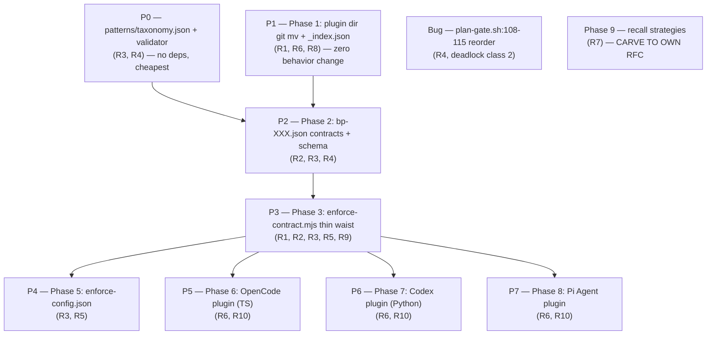

# RFC-008 — Decoupling the Enforcement Layer from the Memory Substrate

> **Source of truth.** This RFC is the committed form of consolidated rearchitecture
> **spec v8** (episode `20260527-081221-consolidated-rearchitecture-spec-v8-comp-000c`,
> supersedes chain v7 → v6 → v5 → v4 → v3). The parent-goal containment is recorded in
> `20260527-051225-decoupling-enforcement-from-memory-subst-c4af`. Every design element
> below maps to a requirement (R1–R10); no element exists without a requirement parent.

## Table of contents

- [AI context](#ai-context)
- [Requirements (R1–R10)](#requirements-r1r10)
- [Problem](#problem)
- [Proposal](#proposal)
  - [Architecture](#architecture-maps-to-r1-r2-r3-r6-r8-r9-r10)
  - [Canonical taxonomy](#canonical-taxonomy-maps-to-r3-r4)
  - [Events-and-action-semantics specification (v11)](#events-and-action-semantics-specification-v11--maps-to-r2-r3-r4-closes-event-vocabulary-gap-findings-f37f38)
  - [Validation-contract specification (v9)](#validation-contract-specification-v9--closes-round-1-review-hold-findings-f1f10)
  - [Plugin-manifest-validation-contract specification (v10)](#plugin-manifest-validation-contract-specification-v10--closes-p1-gap-findings-f11f20)
  - [Runtime-data-contract specification (v10)](#runtime-data-contract-specification-v10--closes-runtime-emission-gap-findings-f21f25)
  - [Plugin-testing-harness specification (v10)](#plugin-testing-harness-specification-v10--standardizes-plugin-tests-finding-f26)
  - [Capability-degradable enforcement](#capability-degradable-enforcement-maps-to-r3)
  - [Classifier activation gating](#classifier-activation-gating-maps-to-r5-r9)
  - [Recall strategies](#recall-strategies-maps-to-r7)
  - [Plugin registry](#plugin-registry-maps-to-r8)
  - [Contract boundary](#contract-boundary-maps-to-r2)
  - [Migration detection](#migration-detection-maps-to-r8)
  - [Implementation boundary](#implementation-boundary-maps-to-r9)
  - [Enforcement plugin runbooks — content specification](#enforcement-plugin-runbooks--content-specification-maps-to-r10)
  - [Plugin authoring skill + taxonomy conformance](#plugin-authoring-skill--taxonomy-conformance-maps-to-r3-r4-r6-r8-r10)
  - [Scope](#scope)
- [9 phases mapped to requirements](#9-phases-mapped-to-requirements)
  - [Build priority](#build-priority-maps-to-r1r10)
- [Requirement traceability matrix](#requirement-traceability-matrix)
- [Deadlock analysis](#deadlock-analysis-maps-to-taxonomy-r3-r4-r9)
- [Alternatives considered](#alternatives-considered)
- [Implementation plan](#implementation-plan)
  - [Sequencing](#sequencing)
- [Implementation](#implementation)
- [Related RFCs](#related-rfcs)
- [Second opinion](#second-opinion)
  - [Post-acceptance validation-layer review — consensus chain (2026-05-28)](#post-acceptance-validation-layer-review--consensus-chain-2026-05-28)
  - [Post-acceptance v10 plugin-layer review (2026-05-28)](#post-acceptance-v10-plugin-layer-review--pending-dispatch-2026-05-28)
  - [Post-acceptance v11 architectural corrections (2026-05-28)](#post-acceptance-v11-architectural-corrections-2026-05-28)
  - [v4 → v11 change log](#v4--v11-change-log-provenance-of-this-rfc)
- [Open questions](#open-questions)
- [Ground truth hierarchy](#ground-truth-hierarchy)

## AI context

> (1) This RFC decouples the enforcement layer (BP gates, classifiers, markers, contracts) from the memory substrate (`em-store` / `em-recall` / `em-search`), making enforcement a pluggable layer that *imports* the substrate rather than living inside it. (2) Today `em-recall.mjs` — nominally the memory recall core — is saturated with enforcement logic (`--gate stop`, checkpoint markers, carve-outs, the `.checkpoints/` migration), a soft P9/P1 violation that RFC-003 deferred by committing to "gate decision stays in core." (3) The key decision (**v11 correction**): episodic-memory *dictates the contract* (`patterns/bp-XXX.json` + `patterns/taxonomy.json` + `patterns/events.json` + `plugins/_index.json`); a thin waist (`enforce-contract.mjs`) reads the contract, **reads marker state via its own `scripts/lib/marker-state.mjs`**, and emits the block/allow/warn/inject decision; one plugin per harness adapts the contract to that harness's hook surface at its declared capability tier. **`em-recall.mjs` is NEVER called from the enforcement path** — it is pure recall, restored in P3 by deleting the `--gate` flag, the `stop-gate-helpers.mjs` import, and all marker reads.

---

## Requirements (R1–R10)

These are the anchors. Every architecture decision in this RFC maps to one or more of these requirements. **No design element exists without a requirement parent.**

### R1 — Memory is the substrate
Enforcement (BP gates, classifiers, markers, contracts) is decoupled from the memory substrate (em-store / em-recall / em-search). The substrate is pure store-and-recall. Enforcement is a separate layer that imports the substrate — never the reverse.

**v11 strong form (architectural correction):** `em-recall.mjs` MUST have ZERO enforcement code. P3 REMOVES from em-recall: (a) the `--gate` flag and its handler, (b) the `stop-gate-helpers.mjs` import, (c) every `.checkpoint-required` / `.post-checkpoint-required` / `.plan-approval-pending` marker read, (d) the `.checkpoints/` migration code. Net diff on em-recall: −LOC, fewer files imported, no new dependencies. The substrate's only enforcement-adjacent surface is `em-store` writing F3 structured-alert episodes for callers that happen to be the enforcement layer — and that is just `em-store` doing its normal job (append episode), not enforcement-aware behavior. Marker state reading lives in the enforcement layer's own `scripts/lib/marker-state.mjs`, owned by `enforce-contract.mjs`.

**v11.3 absolute-invariant statement (F60 — all three substrate scripts; R1 strong form):** the gate-unawareness invariant binds **all three substrate scripts equally — `em-store`, `em-recall`, `em-search` — none may contain ANY gate/marker/checkpoint logic.** Verified empirical baseline at the time of writing (`grep` over `scripts/`): `em-store.mjs` and `em-search.mjs` are **already** gate-clean (zero references to gate / checkpoint / marker / `--gate` / `.checkpoints` / `stop-gate-helpers`); `em-recall.mjs` is the **sole violator** (the `--gate` flag, the `stop-gate-helpers.mjs` import, marker reads, SessionStart bp-001 arming, and the `.checkpoints/` migration all live there) and is the only script P3 must purify. The invariant is therefore *maintenance-forward*: a future edit that adds a gate/marker read to `em-store` or `em-search` (or re-adds one to a purified `em-recall`) is an R1 violation. The ONE permitted substrate↔enforcement touch is `enforce-contract.mjs` calling `em-store` to append an F3-alert episode — and `em-store` MUST stay ignorant that the episode it is appending is an enforcement alert (it receives a category + tags + body like any other caller; it has no `alert`/`gate` codepath). A CI grep guard (P3) asserts the three substrate scripts contain none of the gate-vocabulary tokens, failing loud on regression.

**Governed by:** PRINCIPLES.md P9 (Core never imports adapters; adapters import core).

### R2 — Pluggable enforcement; episodic-memory dictates the contract
BP enforcements are plugins. Episodic-memory defines WHAT must be enforced (contracts in `patterns/bp-XXX.json`). Plugins implement HOW the agent harness executes the enforcement. The contract flows FROM episodic-memory TO plugins, not the other direction.
**Governed by:** PRINCIPLES.md P2 (Behavior definitions are data), P11 (Portable core contract).

### R3 — Capability mapping contract
Each enforcement plugin must map its harness capabilities into the episodic-memory contract schema. A plugin declares which capabilities its harness provides (`pre_tool_use`, `stop`, `session_start`, `session_end`) and at what tier (`STRONG`, `MEDIUM`, `WEAK`). The effective enforcement tier is the intersection of what the contract requires and what the harness provides, further clamped by per-project configuration.
**Governed by:** PRINCIPLES.md P5 (Cross-platform with honest capability labels).

### R4 — Default classifier; plugins may override
A default command classifier (`command-classifier.sh` → 7-label taxonomy) ships with episodic-memory. Each enforcement plugin MAY supply its own classifier override. Overrides are harness-specific (e.g., a Pi Agent plugin might classify `tool_call` verbs differently than the default Bash tokenizer). Two labels are NON-OVERRIDABLE: `unsafe_complex` (safety fail-closed) and `marker_write` (gate infrastructure deadlock-prevention).
**Governed by:** PRINCIPLES.md P4 (Cognitive load > lightweight), P2 (Behavior definitions are data).

### R5 — Classifier activation gating
The classifier (default or plugin override) only executes when at least one enforcement plugin is active for the current harness. If no enforcement plugin is installed or active, the classifier is silent — no hook spawns, no token cost, no latency. Activation is detected via the plugin registry and per-project `enforce-config.json`.
**Governed by:** PRINCIPLES.md P6 (Tokens are the budget; bounded background work).

### R6 — Plugin-to-harness binding
Each enforcement plugin is tied to exactly one agent harness: Pi Agent, OpenCode, Claude Code, Windsurf, Cursor, or Codex. A plugin is the bridge between episodic-memory's contracts and a specific harness's hook/event surface. One harness, one plugin directory. Shared logic lives in the enforcement thin waist (`enforce-contract.mjs`), not duplicated across plugins.
**Governed by:** PRINCIPLES.md P9 (Core never imports adapters), P11 (Portable core contract).

### R7 — Pluggable recall strategies
`em-recall.mjs` supports multiple recall strategies. The default is tag-based lexical recall (zero deps). Additional strategies — semantic (embeddings), knowledge graph (episode reference traversal), hybrid (RRF merge) — are opt-in plugins that register in `em-recall/strategies/`. Each strategy exports a `recall()` interface. Strategies that require embeddings declare `requiresEmbeddings: true` and remain inert when the embedding backend is absent.
**Governed by:** PRINCIPLES.md P6 (Tokens are the budget), P1 (Memory is the substrate).

### R8 — Plugin registry
All enforcement plugins and recall strategies MUST be registered in `plugins/_index.json`. The registry is the single source of truth for: which plugins exist, which harness they bind to, their capability declarations, and their classifier override status. Installers, the enforcement thin waist, and the classifier activation gate all consult the registry. Unregistered plugins are invisible to the system.
**Governed by:** PRINCIPLES.md P2 (Behavior definitions are data), Rule 14 (Machine-readable blocks for drift-prone state).

### R9 — No checkpoints during exploration, planning, or architecture design
The pre-checkpoint gate materializes ONLY at the IMPLEMENTATION boundary — the first repo-source file write. Nothing is armed during exploration, planning, discovery, architecture design, or code review. Bash is intentionally ungated from the pre-checkpoint gate so reviews, inspections, exploration, and architecture work never block and never create markers. The post-checkpoint, push-gate, and stop-gate lifecycle remains fully enforced once implementation begins.
**Governed by:** PRINCIPLES.md P4 (Cognitive load > lightweight), P6 (Tokens are the budget). **Implemented by:** planning-passive redesign in `checkpoint-gate.sh:1297-1317` (lazy-arm on first repo-source write, Bash ungated from pre-checkpoint, F1 RESIDUAL documented at lines 55-66).

### R10 — Enforcement plugin runbooks
Each enforcement plugin MUST include a runbook in `plugins/<harness>/runbooks/` with specified content per section. The runbook is injected on first invocation per session via content-addressed UX-marker (`.so-runbook-shown.<sha8>`). Runbook marker writes are exempt from checkpoint/plan gating. Session-start lifecycle clears all runbook markers. Content-addressed (sha8 = SHA256(full_runbook_content).hex.slice(0, 8)) — edits invalidate the marker, forcing re-injection.
**Governed by:** PRINCIPLES.md P4 (Cognitive load > lightweight — the runbook prevents the model from rediscovering the same lessons each session). **Precedent:** second-opinion harness runbook at `hooks/runbooks/second-opinion-harness.md` (118 lines, production since 2026-05-13).

---

## Problem

Ground this in observable behavior, not a proposed solution.

`em-recall.mjs` is nominally the memory **recall** core, but it is saturated with **enforcement** logic:

- `--gate stop` decision logic (lines 68 / 295)
- `.checkpoint-required` / `.post-checkpoint-required` marker handling
- the stop-gate carve-out and the plan-gate deadlock triangle
- the `.checkpoints/` dual-root migration
- it imports `stop-gate-helpers.mjs`

The memory substrate's recall script **is** the bp-001 enforcement engine. RFC-003:506 made this explicit and load-bearing: *"The block-or-allow decision lives in `scripts/em-recall.mjs` as `--gate stop` … the core `--gate` flag remains in core unchanged (P9)."* RFC-003 relocated only the shell wrapper to `adapters/claude-code/capabilities/enforcement.mjs`, never the decision logic.

This collapses **recall** and **react** into one script — arguably already a soft P1 violation that RFC-003 deferred, and a P9 tension because the substrate now contains adapter-shaped enforcement behavior. Cross-tool reach is also blocked: adding a harness today means re-deriving enforcement plumbing rather than declaring a capability mapping against a contract.

**RFC-008 reverses RFC-003:506 COMPLETELY (v11):** the gate decision AND the marker-state reads BOTH lift out of em-recall. RFC-003's incremental compromise (decision-in-core stays; only shell wrapper moves) is dropped. The substrate ends in a strictly purer state than RFC-003 left it: em-recall has no `--gate` flag, no marker reads, no `stop-gate-helpers.mjs` import. Phase 3 is a NET DELETION on em-recall, with the lifted code landing in `enforce-contract.mjs` + `scripts/lib/marker-state.mjs` under the enforcement layer.

---

## Proposal

What changes: episodic-memory becomes a contract authority (data files); a thin enforcement waist (`enforce-contract.mjs`) reads those contracts, reads marker state via its own `scripts/lib/marker-state.mjs`, and **owns** the block/allow/warn/inject decision — `em-recall` is **never** called from the enforcement path (v11 correction; the v10 "delegates to `em-recall --gate`" framing is reversed by F38); and each harness gets exactly one plugin directory that maps the contract onto its hook surface at an honestly-declared capability tier.

### Architecture (maps to R1, R2, R3, R6, R8, R9, R10)

```mermaid
graph TD
    subgraph EM["episodic-memory — dictates WHAT"]
        BP["patterns/bp-001.json<br/>(R2 — contract definitions)"]
        TAX["patterns/taxonomy.json<br/>(R4 — canonical 7-label set + per-gate allow/block)"]
        EVT["patterns/events.json<br/>(v11 — 5 events + per-tier action semantics)"]
        REG["plugins/_index.json<br/>(R8 — plugin registry)"]
    end

    EC["enforce-contract.mjs — thin waist<br/>(R1, R2, R3, R5, R9)<br/>contract validation + tier computation +<br/>implementation-boundary detection +<br/>block/allow/warn/inject decision"]
    MS["scripts/lib/marker-state.mjs<br/>(v11 — marker reads, owned by EC)"]

    subgraph CORE["substrate core (pure recall — v11)"]
        RECALL["em-recall.mjs<br/>(R1 — episode recall ONLY)<br/>NO --gate, NO marker reads"]
        STORE["em-store.mjs<br/>(pure append; called by EC for F3 alerts)"]
    end

    subgraph PLUG["plugins/&lt;harness&gt;/ — one dir per harness (R6)"]
        MAN["manifest.json<br/>(R3, R8 — capability declarations + event_translations)"]
        CAP["capabilities/enforcement.{mjs,ts,py}<br/>(R6 — harness adapter)"]
        CLS["classifier/command-classifier.{sh,ts,py}<br/>(R4 — optional override)"]
        RUN["runbooks/enforcement.md + .quickref.md<br/>(R10)"]
    end

    BP --> EC
    TAX --> EC
    EVT --> EC
    REG --> EC
    EC -->|owns marker IO| MS
    EC -->|plugin lookup via _index.json R8| PLUG
    EC -->|implementation-boundary detection R9| EC
    EC -->|classifier dispatch R4/R5<br/>override else default| CLS
    EC -->|effective_tier = min harness,contract,config R3| EC
    EC -->|gate action = contract.gates[gate].action_for label R3| EC
    EC -->|F3 alert episode — pure append| STORE
    RECALL -.->|NOT called from EC<br/>v11 architectural invariant| EC
```

**Decision flow (v11):**
1. Hook fires (harness-specific event: PreToolUse, Stop, SessionStart, SessionEnd, ToolResult).
2. Plugin adapter translates raw harness event into canonical event payload (validates against `schemas/events/event-<type>.schema.json`) and calls `enforce-contract.mjs` — the single thin waist.
3. `enforce-contract.mjs` consults `plugins/_index.json` → finds the active plugin for this harness (R8).
4. Detects implementation boundary: is this a repo-source write? If yes → lazy-arm `.checkpoint-required` via `lib/marker-state.mjs` (R9). If exploration/planning/architecture → silent, no markers.
5. First enforcement action per session: runbook gate checks `.so-runbook-shown.<sha8>` (R10). If absent → block with quickref injection + full runbook path. Model reads runbook, touches marker to acknowledge.
6. Computes `effective_tier = min(harness_cap, contract_tier, project_config)` (R3).
7. If `effective_tier < contract_tier`: degrade gracefully per `patterns/events.json` action semantics for this event (warn, inject, or pass — per-event, per-tier).
8. Dispatches classifier: plugin override if registered, else default (R4, R5).
9. Looks up `contract.gates[gate].action_for(label)` → `"allow"` or `"block"` (R3 — contract-driven).
10. Reads relevant marker state via `lib/marker-state.mjs` (`.checkpoint-required`, `.post-checkpoint-done`, etc.) — purely within the enforcement layer.
11. Combines `(action, effective_tier, marker_state)` → final outcome `{block, allow, warn, inject}` per `events.json` semantics.
12. **v11 architectural invariant:** `em-recall.mjs` is NEVER called from this flow. The enforcement layer owns the entire decision. The only substrate write is an `em-store` call for F3 structured-alert episodes when the classifier emits an out-of-vocabulary label — a pure append, no enforcement awareness on the substrate side.

### Canonical taxonomy (maps to R3, R4)

Single source of truth: `patterns/taxonomy.json`. Validated by `validate-bp-contract.mjs`. CI fails if any contract or classifier references a label not in this file (Rule 14).

```json
{
  "version": "1.0.0",
  "labels": [
    {
      "id": "read_only",
      "meaning": "Pure observation — ls, cat, git status, gh pr view, grep, find",
      "overridable": true,
      "gates": { "plan_approval": "allow", "pre_checkpoint": "allow", "post_checkpoint": "allow" }
    },
    {
      "id": "nonsrc_write",
      "meaning": "Writes but NOT repo source — .git internals, npm/yarn install, mkdir/rmdir, em-store episode writes",
      "overridable": true,
      "gates": { "plan_approval": "block", "pre_checkpoint": "allow", "post_checkpoint": "allow" }
    },
    {
      "id": "shared_write",
      "meaning": "Repo-source content write or cannot-tell — redirect-to-file, non-allowlisted node/python/ruby, cp/mv/dd, worktree-mutating git, curl -o, tee",
      "overridable": true,
      "gates": { "plan_approval": "block", "pre_checkpoint": "block", "post_checkpoint": "allow" }
    },
    {
      "id": "push_or_pr_create",
      "meaning": "Publishes/mutates shared external state — git push, gh pr create/merge/close, gh issue create/close, gh release, gh api POST/PUT/PATCH/DELETE",
      "overridable": true,
      "gates": { "plan_approval": "block", "pre_checkpoint": "allow", "post_checkpoint": "block" }
    },
    {
      "id": "marker_write",
      "meaning": "Gate-control deadlock-prevention — writes/removes .checkpoints/.* marker files at canonical paths",
      "overridable": false,
      "gates": { "plan_approval": "allow", "pre_checkpoint": "allow", "post_checkpoint": "allow" }
    },
    {
      "id": "unsafe_complex",
      "meaning": "Cannot tokenize safely — bash -c, eval, $(), backticks, unbalanced quotes, ambiguous heredoc",
      "overridable": false,
      "gates": { "plan_approval": "block", "pre_checkpoint": "block", "post_checkpoint": "block" }
    },
    {
      "id": "unknown",
      "meaning": "Parsed cleanly but unrecognized command shape — default_write or interpreter_other reason",
      "overridable": true,
      "gates": { "plan_approval": "block", "pre_checkpoint": "block", "post_checkpoint": "block" }
    }
  ],
  "non_overridable": ["unsafe_complex", "marker_write"],
  "non_overridable_rationale": {
    "unsafe_complex": "Safety fail-closed. A plugin that redefines unsafe_complex as read_only would allow eval/bash -c/subshells through the gate unexamined.",
    "marker_write": "Gate infrastructure deadlock-prevention. marker_write is the escape hatch that allows agents to write .pre-checkpoint-done / .post-checkpoint-done / .plan-approval-pending markers. A plugin that misclassifies a marker write as shared_write creates an unrecoverable deadlock (deadlock class 1)."
  }
}
```

#### Gate semantics — what each gate blocks (R3, R4)

| Gate | Event | Blocks labels where `gates[gate] == "block"` | Effect |
|------|-------|----------------------------------------------|--------|
| **Plan-approval** | PreToolUse (all write tools) | `shared_write`, `push_or_pr_create`, `nonsrc_write`, `unsafe_complex`, `unknown` | Write tools blocked while `.plan-approval-pending` exists. `read_only` + `marker_write` allowed (deadlock prevention). |
| **Pre-checkpoint** | PreToolUse (write tools, Bash) | `shared_write`, `unsafe_complex`, `unknown` | Repo-source writes blocked while `.checkpoint-required` armed + `.pre-checkpoint-done` absent. Only fires at the implementation boundary (R9). `nonsrc_write` + `push_or_pr_create` allowed. |
| **Post-checkpoint** | PreToolUse (Bash only) | `push_or_pr_create`, `unsafe_complex`, `unknown` | Push/PR-create blocked while `.post-checkpoint-required` armed + `.post-checkpoint-done` absent. |
| **Stop** | Stop / SubagentStop | (does not use command classification) | Blocked while `.checkpoint-required` armed + `.post-checkpoint-done` absent. Reads marker state, not command labels. |

#### Overridability rules (R4)

| Label | Overridable? | Rationale |
|-------|-------------|-----------|
| `read_only` | ✓ | Harness-specific read tools may differ |
| `nonsrc_write` | ✓ | Harness-specific non-source surfaces may differ (npm vs yarn vs pip) |
| `shared_write` | ✓ | Harness-specific write primitives may differ (Write vs Edit vs MultiEdit) |
| `push_or_pr_create` | ✓ | Harness-specific push/PR surfaces may differ |
| `marker_write` | **✗** | Gate infrastructure. Deadlock class 1: misclassification creates unrecoverable agent deadlock. Same safety tier as `unsafe_complex`. |
| `unsafe_complex` | **✗** | Safety fail-closed. Redefining as read_only bypasses all gates. |
| `unknown` | ✓ | Harness-specific unknown shapes may be classifiable |

#### Why `marker_write` is non-overridable (v4 fix)
`marker_write` is the deadlock-prevention escape hatch — how an agent writes `.pre-checkpoint-done` or `.plan-approval-pending` to unblock itself. If a plugin overrides `marker_write` and misclassifies a genuine marker write as `shared_write`, the gates deadlock: the agent is told "write the marker to unblock," but the gate blocks the marker write. This is the exact deadlock class that took 7 rounds of Codex review to close in `checkpoint-gate.sh`. Infrastructure labels are not opinions.

#### Why per-gate mapping replaces the single boolean (v4 fix)
The v3 taxonomy had `arms_pre_checkpoint: true/false`. This cannot express actual gate behavior because different gates block different label subsets:
- `push_or_pr_create` was `arms_pre_checkpoint: true` in v3, but it arms the *post-checkpoint* gate (`.post-checkpoint-required`), NOT the pre-checkpoint gate (`.checkpoint-required`). The v3 entry was factually wrong against the working `checkpoint-gate.sh`.
- `nonsrc_write` was `arms_pre_checkpoint: false` — correct for the pre-checkpoint gate, but incorrect for the plan-approval gate where it DOES block.
- A single boolean cannot express three gates with different subsets. The contract must be the source of truth; the enforcement layer reads the contract, never hardcodes the label→gate mapping.

#### Gate-action lookup (replaces hardcoded label set)
```
// BEFORE (v3): hardcoded in enforce-contract.mjs
if label in {shared_write, push_or_pr_create, unsafe_complex, unknown}:
    block

// AFTER (v4): contract-driven, reads taxonomy
action = taxonomy.gates[gate].action_for(label)
if action == "block" and effective_tier == STRONG:
    enforce-contract.mjs.block(label, reason)
```
The contract drives the behavior; the enforcement layer consults the contract. R2 satisfied.

### Events-and-action-semantics specification (v11 — maps to R2, R3, R4; closes event-vocabulary gap, findings F37–F38)

The taxonomy (labels + per-gate allow/block) is one half of the structural vocabulary. The other half is the **events vocabulary** — what events the enforcement layer reacts to, what each event's payload looks like, and what each capability tier means per event. Today RFC-008 names tiers (STRONG/MEDIUM/WEAK) without speccing what each tier DOES per event; plugins would each interpret. v11 closes that gap.

#### `patterns/events.json` — data file (P0)

Sibling to `taxonomy.json`, same authority, same hash-version pattern, same `validate-bp-contract.mjs` validator. Format:

```json
{
  "version": "1.0.0",
  "events": [
    {
      "id": "pre_tool_use",
      "fires_on": "About to invoke a tool (Bash/Edit/Write/etc.) — before side effects",
      "payload_schema": "schemas/events/event-pre-tool-use.schema.json",
      "actions": {
        "STRONG": { "id": "block",  "semantics": "Tool call refused. Harness returns non-zero exit from hook (Claude Code: exit 2; OpenCode: throw; Codex: dict {block:true})." },
        "MEDIUM": { "id": "warn",   "semantics": "Marker file written at canonical path; warning string surfaced via side-band log; tool call proceeds. Catches lifecycle-gated checks but cannot block real-time." },
        "WEAK":   { "id": "inject", "semantics": "Warning string injected into next model turn's system prompt (or harness equivalent). No programmatic effect this turn." }
      }
    },
    {
      "id": "tool_result",
      "fires_on": "Tool call completed; result available — before model sees it",
      "payload_schema": "schemas/events/event-tool-result.schema.json",
      "actions": {
        "STRONG": { "id": "modify", "semantics": "Result mutation/observation before model sees it. Harness returns modified result." },
        "MEDIUM": { "id": "observe", "semantics": "Async log only; result delivered unchanged." },
        "WEAK":   { "id": "unsupported", "semantics": "This event is not available at WEAK tier; declarations of WEAK on tool_result fail M4 capability key closure." }
      }
    },
    {
      "id": "stop",
      "fires_on": "Agent about to end a turn",
      "payload_schema": "schemas/events/event-stop.schema.json",
      "actions": {
        "STRONG": { "id": "refuse_stop", "semantics": "Stop refused until marker condition met. Harness re-enters the agent loop." },
        "MEDIUM": { "id": "warn",        "semantics": "Warning logged; stop proceeds. Useful for post-hoc lifecycle audit." },
        "WEAK":   { "id": "unsupported", "semantics": "stop at WEAK is not meaningful — by definition the harness has already decided to stop and there's no next turn to inject into." }
      }
    },
    {
      "id": "session_start",
      "fires_on": "New session beginning",
      "payload_schema": "schemas/events/event-session-start.schema.json",
      "actions": {
        "STRONG": { "id": "inject_context", "semantics": "Context (string/JSON) appended to system prompt; presence verifiable in transcript." },
        "MEDIUM": { "id": "inject_context", "semantics": "Best-effort inject; harness may or may not surface (no verification path)." },
        "WEAK":   { "id": "inject_static",  "semantics": "Inject via static rules/config file deployed at install time (Windsurf `.windsurf/rules/`). No dynamic per-session content. (Cursor is NOT WEAK — see F43 correction.)" }
      }
    },
    {
      "id": "session_end",
      "fires_on": "Session terminating",
      "payload_schema": "schemas/events/event-session-end.schema.json",
      "actions": {
        "STRONG": { "id": "write_artifact", "semantics": "Hook fires deterministically; can write final-state artifacts (handoff files, session summary episodes)." },
        "MEDIUM": { "id": "write_artifact", "semantics": "Best-effort fire; artifact may be missing on abnormal termination." },
        "WEAK":   { "id": "unsupported", "semantics": "Not available at WEAK." }
      }
    }
  ]
}
```

**`events_version`** = `"sha256:" + SHA256(JSON.stringify(eventsSortedById)).hex`. Carried by every `bp-XXX.json` and every plugin `manifest.json` analogous to `taxonomy_version` (F8 pattern). Stale hash = "built against stale events vocabulary" CI fail.

#### Five canonical event-payload schemas (P0)

Each event's `payload_schema` field points to a JSON Schema 2020-12 doc under `schemas/events/`. These define the **canonical post-translation payload shape** — the data the adapter MUST produce after translating its harness's raw event format.

`schemas/events/event-pre-tool-use.schema.json` (representative):

```json
{
  "$schema": "https://json-schema.org/draft/2020-12/schema",
  "type": "object",
  "additionalProperties": false,
  "required": ["tool", "tool_args", "cwd", "session_id", "turn_index", "timestamp_iso8601"],
  "properties": {
    "tool": { "type": "string", "minLength": 1 },
    "tool_args": { "type": ["object", "null"] },
    "tool_args_raw": { "type": "string", "description": "Original harness-format string for forensic re-translation" },
    "cwd": { "type": "string", "minLength": 1, "description": "canonicalized absolute, pwd -P equivalent" },
    "session_id": { "type": "string", "minLength": 1 },
    "turn_index": { "type": "integer", "minimum": 0 },
    "timestamp_iso8601": { "type": "string", "format": "date-time" }
  }
}
```

Analogous shapes for `tool_result`, `stop`, `session_start`, `session_end` — fields per event reflect what the enforcement layer needs to make a decision.

#### Translation contract — plugin manifest `event_translations` field (P0 schema, P1 data)

Each plugin manifest carries:

```json
"event_translations": {
  "pre_tool_use": {
    "source_format": "claude-code-pre-tool-use-stdin-json",
    "field_bindings": {
      "tool": "$.tool_name",
      "tool_args": "$.tool_input",
      "session_id": "$.session_id",
      "cwd": "$.cwd",
      "turn_index": "$.transcript.length",
      "timestamp_iso8601": "$$now"
    }
  },
  "stop": { "source_format": "...", "field_bindings": { ... } }
}
```

`manifest.schema.json` (P0) declares the shape of `event_translations`. `validate-plugin-registry.mjs` (P1) validates that the field bindings produce schema-valid canonical payloads when replayed against recorded fixture events. Catches "Codex plugin forgets to bind `cwd`" → "F25 authority-root will silently break in production" at PR-time, not at incident-time.

#### `validate-bp-contract.mjs` — additional assertions for events vocabulary

10. **Events meta-schema (F37):** `events.json` validates against `events.schema.json`.
11. **Events vocabulary closure (F37):** every event id referenced in any `bp-XXX.json`, every plugin manifest's `capabilities` keys, every plugin manifest's `event_translations` keys is ⊆ `events[].id`.
12. **Action enum closure (F37):** ∀ event, ∀ tier ∈ {STRONG, MEDIUM, WEAK}: `events[event].actions[tier].id` ∈ `{block, warn, inject, modify, observe, refuse_stop, inject_context, inject_static, write_artifact, unsupported}` (closed enum).
13. **Payload schema resolution (F37):** every event's `payload_schema` path resolves on disk + validates as JSON Schema 2020-12.
14. **Events stable-ID integrity (F37):** events may be ADDED but never REMOVED or RENAMED without major version bump (mirror of F7 for events).
15. **`events_version` binding (F37):** every `bp-XXX.json` + every `manifest.json` carries `events_version`; validator asserts equals current computed hash.

#### Why this lives in P0 (not P1)

The taxonomy defines structure. Events ARE structure — they're the data shapes the system exchanges at every interaction. Deferring them to P1 means P1 plugin implementations would have to invent the event payload shapes, then back-port them into spec, then re-validate every existing plugin. That's the same gap that hit the original taxonomy (v1→v3 took 8 revisions because vocabulary was implicit). Shipping events.json + 5 event-payload schemas in P0 closes the gap before any plugin code is written.

### Validation-contract specification (v9 — closes round-1 review HOLD, findings F1–F10)

Round-1 second-opinion (opencode/DeepSeek-v4-pro, episode `20260528-013519-reply-opencode-to-20260528-013221-second-36d9`) returned **HOLD**: the validators were specified by single-sentence anchors ("fail CI on any non-canonical label") covering ~10% of the contract. This section is the full, **normative** contract — `scripts/validate-bp-contract.mjs` MUST implement every assertion below; CI fails on any violation.

#### Gate cardinality — 3 classification gates + 1 marker-state gate (F2, F10)
The per-label `gates` object in `taxonomy.json` carries EXACTLY three classification gates: `plan_approval`, `pre_checkpoint`, `post_checkpoint`. The `stop` gate is NOT per-label — it reads marker state, not command labels (see §Gate semantics). `stop.tier` is **pattern-level metadata** at the ROOT of each `bp-XXX.json` (`{ "stop": { "tier": "STRONG" }, "gates": { … } }`), never per-label. `schema.json`'s per-label gate set is therefore `{plan_approval, pre_checkpoint, post_checkpoint}`; `stop.tier` is a root-level property. `enforce-contract.mjs` computes `effective_tier(stop) = min(harness_cap.stop, contract.stop.tier, project_config.stop.tier)` — no label term (F10).

#### Single source of truth for overridability (F9)
Per-label `overridable: boolean` is canonical. The top-level `non_overridable: [...]` array is DERIVED (`labels.filter(l => !l.overridable).map(l => l.id)`, sorted) — retained only as human-readable convenience + CI cross-check. `validate-bp-contract.mjs` asserts the stored array equals the derived set (bidirectional); drift is a CI failure (Rule 14).

#### `taxonomy_version` hash (F8)
`taxonomy_version = "sha256:" + SHA256(JSON.stringify(labelsSortedById)).hex`, where `labelsSortedById` is the `labels` array sorted by `id`. The hash covers ONLY the sorted labels array — not `version` / `non_overridable` / `non_overridable_rationale` — so editorial fields change without invalidating classification behavior. Every `bp-XXX.json` AND every plugin `manifest.json` carries `taxonomy_version`; `validate-bp-contract.mjs` and `validate-plugin-registry.mjs` assert it equals the current computed hash, else fail "built against stale taxonomy."

#### OQ-2 CLOSED — classifier sources the taxonomy at runtime (F4)
`command-classifier.sh` SOURCES its label set from `taxonomy.json` at startup via a zero-dep node helper (`node -e 'process.stdout.write(require("<taxonomy>").labels.map(l=>l.id).join(" "))'`) and fails closed if the resolved set ≠ its expectation. This eliminates label drift by construction (no hand-maintained bash label list). CI asserts the sourcing helper exists, is wired, and that the classifier's emitted-label set and `_priority` case-arm names equal `taxonomy.labels`. The CI-only alternative (parsing labels out of 3000+ lines of bash) is rejected as fragile.

#### Runtime out-of-vocabulary contract — HARD-REJECT, not coerce (F3)
The thin-waist runtime layer does NOT coerce an unrecognized classifier label to `unknown`. It HARD-REJECTS the transaction (fail-closed) and emits a structured alert (episode + stderr: plugin id, harness, emitted label, command text, timestamp). **Authority-root binding:** the alert episode MUST be written with the harness/git-resolved `project_root` bound as the subprocess `cwd` (or an explicit accepted root flag) — NEVER the inherited caller cwd. `em-store --project X --scope local` writes under the CALLER's `.episodic-memory` when cwd ≠ X (the PR #218 / #326 / #336 orphaned-write class). The alert reports `project_root`, `store_scope`, and `episode_file`; disk-location tests cover cwd-mismatch, nested cwd, linked worktree, and non-git cwd with explicit target. Author-time + CI already guarantee vocabulary closure; if a non-canonical label reaches runtime, something is catastrophically wrong, and silent coercion is a latent behavior-change landmine — a label later added to the taxonomy with `allow` semantics would silently flip prior blocks to allows. Coercion is prohibited.

#### `validate-bp-contract.mjs` — normative assertion checklist (F1, F5, F6, F7)
1. **Meta-schema (F5):** `taxonomy.json` validates against `patterns/taxonomy.schema.json` (JSON Schema 2020-12) — `version` semver string; `labels` non-empty array; each label requires `id` (non-empty string), `meaning` (string), `overridable` (boolean), `gates` (object); `non_overridable` array-of-strings; `non_overridable_rationale` object keyed by label ids. `schema.json` validates against the same draft.
2. **Gate-completeness (F1a):** ∀ label, ∀ gate ∈ {plan_approval, pre_checkpoint, post_checkpoint}: `label.gates[gate]` exists.
3. **No extra gate keys (F1e):** ∀ label: `keys(label.gates) ⊆ {plan_approval, pre_checkpoint, post_checkpoint}`.
4. **Action-enum closure (F1b):** ∀ label, ∀ gate: `label.gates[gate] ∈ {allow, block}`.
5. **Overridability equality (F1c, F9):** stored `non_overridable` (sorted) ≡ derived non-overridable set.
6. **No duplicate ids (F1d):** label ids are unique.
7. **Vocabulary closure — no dangling references (F6):** the label set referenced by every `bp-XXX.json`, every `manifest.classifier.emits_labels`, the classifier's emitted labels, and the classifier `_priority` case-arms is a SUBSET of `taxonomy.labels`. (`emits_labels ⊆ taxonomy.labels` is shared with `validate-plugin-registry.mjs`; BOTH validators carry it.)
8. **Stable-ID integrity (F7):** labels may be ADDED but never REMOVED or RENAMED without a major `version` bump. The validator diffs the previous `taxonomy.json` from git; if `|old_ids| == |new_ids|` and `old_ids ≠ new_ids`, fail "possible rename — add the new label + mark the old `deprecated: true`, never rename." `bp-XXX.json.taxonomy_version` mismatch (F8) is a hard fail.
9. **Golden tests (F5):** `validate-bp-contract.mjs` ships known-good + known-bad fixtures (missing gate, bad action value, overridability mismatch, duplicate id, extra gate key, dangling reference, rename) and asserts the expected pass/fail per fixture. The 10 round-1 negative scenarios map 1:1 to assertions 2–8 + the runtime hard-reject and form the golden-test corpus.

### Plugin-manifest-validation-contract specification (v10 — closes P1 gap, findings F11–F20)

The taxonomy got its full normative spec in v9 (F1–F10). The plugin manifest layer was left example-driven — the same thin-spec class. This section is the full normative contract for `plugins/_index.json`, `plugins/<harness>/manifest.json`, and `scripts/validate-plugin-registry.mjs`. CI fails on any violation.

#### Two meta-schemas (M1, M2)

- **`plugins/_index.schema.json`** — registry meta-schema. JSON Schema 2020-12. `additionalProperties: false` at every level. Closed enums for `harness` and `status`.
- **`plugins/manifest.schema.json`** — per-plugin manifest meta-schema. JSON Schema 2020-12. `additionalProperties: false` at every level. Closed enums for `harness`, event keys, capability tier values, classifier mode.

Both are themselves validated by `scripts/validate-schemas.mjs` against the JSON Schema 2020-12 meta-meta-schema (mirror of F5).

#### Harness-name stable-ID rules (M3)

- The `harness` enum is **closed**: `{claude-code, opencode, codex, pi-agent, cursor, windsurf}`. New harness = PR to episodic-memory adding the enum value. Plugins cannot self-register a new harness id.
- A harness name may be ADDED but never RENAMED or REMOVED without a major `_index.schema.json` `version` bump. Validator git-diffs the prior schema; same cardinality + different ids = fail "possible rename — add new + mark old `deprecated: true`, never rename." Mirror of F7.
- Per plugin entry: `id == harness` (rules out plugin-name drift from harness-name).

#### Capability declarations (M4)

- `capabilities` keys ⊆ closed event set: `{pre_tool_use, stop, session_start, session_end, tool_result}`. Extra keys = fail.
- Each value ∈ closed enum: `{STRONG, MEDIUM, WEAK, TBD}`.
- `TBD` allowed only with a sibling comment field pointing at an open issue URL (validator greps for the URL pattern).
- Missing capability for an event the plugin's adapter actually dispatches into = fail. Validator inspects `plugins/<harness>/capabilities/enforcement.{mjs,ts,py}` for hook-registration call sites and asserts each registered event appears in `capabilities`.
- **Invocation modality (M4b — v11.2 closes F48):** top-level `manifest.invocation_modality` REQUIRED, closed enum `{cli, agent, api, static-rules}`. Semantics — `cli`: harness invokes adapter as out-of-process subprocess (e.g. `python ~/.codex/hooks/checkpoint-gate.py`); `agent`: in-process harness hook API (e.g. Claude Code PreToolUse, OpenCode `tool_call` registration); `api`: network call to a separate process (HTTP/gRPC/IPC; REQUIRES `credentials` block per §9/F50); `static-rules`: no runtime adapter — install-time rules-file deploy only (e.g. Windsurf `.windsurf/rules/episodic-memory-enforcement.md`). M7d cross-checks runbook §8 == this field. Cross-platform: enum is OS-agnostic — `cli` on Windows shells via `cmd.exe`/PowerShell; exact lines in §9 `command_shapes`.
- **Capability honesty (M4a):** SELF-DECLARED, but `plugins/bypass_known.json` records the ceiling per `{harness, event}` pair. Any declared tier exceeding the known-bypass ceiling for that harness/event = fail. **F28 closure (v10 round 2):** the registry MUST contain one explicit record per `{harness, event}` covered by any installed plugin — either `{ ceiling: "<tier>", citation: "<episode-or-url>" }` (known bypass) or `{ no_known_bypass_evidence: true, last_audited_iso8601: "<date>", auditor: "<id>" }` (clean audit). Missing record for a declared `{harness, event}` = fail (vacuity prevention: an empty `bypass_known.json` no longer silently accepts any tier). P0 ships the file pre-populated with the known Codex `pre_tool_use: { ceiling: "MEDIUM", citation: "multi-edit bypass per RFC-008 §Per-harness capability declarations" }` record so P5–P7 plugins inherit the ceiling at install-time. **F34 closure (v10 round 3):** `plugins/bypass_known.schema.json` ships in P0 alongside the file itself; meta-schema is JSON Schema 2020-12 with `additionalProperties: false` at every level. Top-level shape: `{ "records": [ { "harness": <enum-from-M3>, "event": <enum-from-M4>, "ceiling": <enum-from-M4>, "citation": <string>, "last_audited_iso8601": <string>, "auditor": <string>, "no_known_bypass_evidence": <bool> } ] }` with `oneOf` discriminator on `ceiling` (known bypass) vs `no_known_bypass_evidence: true` (clean audit). Validator (assertion 7) asserts: schema validation passes; every `{harness, event}` pair that appears in any installed manifest has exactly one matching record; record record-validity (one of the two shapes, not both, not neither).

#### Classifier mode + emits_labels (M5 — extends F6)

- `classifier.mode` ∈ `{default, override}`.
- `classifier.emits_labels` ⊆ `taxonomy.labels[].id` (F6 vocabulary closure, extended from contracts to manifests).
- If `mode == override`:
  - `classifier.override_path` REQUIRED + file exists.
  - **Non-overridable preservation (M5a):** override MUST emit `marker_write` and `unsafe_complex` with canonical semantics. Validator runs golden-input commands (from `tests/fixtures/plugins/non-overridable-inputs.json`) through the override and checks emissions; if either non-overridable label is suppressed or remapped, fail.
  - **Drift prevention (M5b):** override file MUST declare the same `taxonomy_version` as the manifest's top-level value.
- If `mode == default`:
  - `override_path` MUST be absent.
  - `emits_labels` MUST equal the full canonical 7-label set (default classifier emits everything; manifest can't lie about it).

#### Event translations binding (M5c — v11.1 closes F42; extends F37)

`plugins/<harness>/manifest.json` MUST carry an `event_translations` object keyed by event id from `patterns/events.json`. Each entry is `{ source_format: string, field_bindings: object<string, string> }`. The `source_format` names the harness's raw event payload format (free-form string for documentation; not enforced); the `field_bindings` map declares how to project the raw harness event onto the canonical `schemas/events/event-<type>.schema.json` shape (JSONPath-style or `$$now`-style well-known macros).

**Constraints (validated by `validate-plugin-registry.mjs` assertion 18, v11.1):**
- Every key in `event_translations` ⊆ `events[].id` (vocabulary closure for events, mirror of F6/M5 for labels).
- Every key in `event_translations` MUST also appear in `manifest.capabilities` (a plugin can't declare a translation for an event it doesn't claim to handle).
- Conversely, every key in `manifest.capabilities` MUST appear in `event_translations` (no events handled without a declared translation).
- `field_bindings` MUST produce a schema-valid canonical payload when replayed against the fixture events at `tests/fixtures/harness-events/<harness>/` — this is the F39 Layer 1 synthetic event replay test (gauntlet step 8).
- `plugins/manifest.schema.json` declares the shape with `additionalProperties: false`.

WEAK-tier harnesses (e.g., Windsurf `session_start: inject_static`) still carry `event_translations` for that event; the `source_format` is `"static-rules-file-deploy"` and `field_bindings` may be empty (the translation is "deploy a file at install" rather than "bind raw event fields"). The field is REQUIRED for every declared capability regardless of tier.

#### Taxonomy binding (M6 — extends F8)

- `manifest.taxonomy_version == computeTaxonomyVersion(taxonomy.labels)`. Stale hash = "built against stale taxonomy" fail.
- `manifest.taxonomy_ref` is the literal constant `"patterns/taxonomy.json"` (not configurable).
- Every override classifier file MUST source its label set from `taxonomy.json` at startup (mirror of F4 / OQ-2-closed). Validator greps for the sourcing helper.

#### Runbook references (M7 — formalizes R10)

- `runbook.full` → `plugins/<harness>/runbooks/enforcement.md`. MUST: exist; size ≥ `MIN_RUNBOOK_BYTES` (1024); contain sentinel `## ⚠️ Self-trigger checklist` at column 1.
- `runbook.quickref` → `enforcement.quickref.md`. MUST: exist; size ≥ `MIN_QUICKREF_BYTES` (256).
- Runbook MUST contain all **ten** required section headers (R10 §"Ten required sections") — validator greps for each literal, §1–§10 individually (the v11.2 expansion added §7 Runtime resolution matrix, §8 Invocation modality, §9 Agent invocation manifest, §10 Configuration + taxonomies). A runbook missing any one of §7–§10 fails M7a even if §1–§6 are present.
- **COMMON-row drift (M7a):** the COMMON rows in §1 (Self-trigger checklist) and §5 (Trigger phrases) are scaffold-generated and MUST byte-match canonical templates at `scripts/scaffold-plugin/templates/common-rows.md`. Drift = fail.
- **F29 closure — path-authority containment (M7b):** every file path referenced from a manifest (`runbook.full`, `runbook.quickref`, `classifier.override_path`, any future path field) MUST satisfy `realpath(<plugin-dir>/<path>) startsWith realpath(<plugin-dir>) + "/"`. Path traversal (e.g. `runbook.full: "../other-plugin/runbooks/enforcement.md"`) fails even if the resolved file exists and passes size/sentinel checks. Containment is checked against the realpath of the plugin's own directory under `plugins/<harness>/` — symlinks within the plugin dir are allowed, but symlinks/relative paths that escape it are not. Golden corpus adds `bad-runbook-path-traversal.json` and `bad-override-path-traversal.json`.
- **F46 closure — runtime resolution matrix derivation (M7c, v11.2):** §7 of every runbook MUST contain two auto-generated tables (Table A: per-event capability declaration row from the harness matrix at RFC §"Per-harness capability declarations"; Table B: N×M label×gate→resolved-action grid after `effective_tier = min(harness_capability, contract_tier, project_config)` degradation). Validator regenerates both matrices from current `manifest.capabilities` + `patterns/taxonomy.json` + R3 ternary; byte-diffs against the embedded markdown tables; mismatch = fail (same enforcement boundary as M7a COMMON-row drift). Golden corpus adds `bad-runbook-stale-resolution-matrix.json`.
- **F48 closure — invocation modality consistency (M7d, v11.2):** §8 of every runbook MUST contain a single-line declaration `**Invocation modality:** {cli|agent|api|static-rules}` immediately under the section header. Validator regex-anchors that line, extracts the enum value, asserts byte-equality with `manifest.invocation_modality` (M4b). Drift = fail. Golden corpus adds `bad-runbook-modality-mismatch.json`.
- **F49 + F50 closure — agent invocation manifest (M7e, v11.2):** §9 of every runbook MUST contain the sentinel `## 🤖 Agent invocation manifest` at column 1, immediately followed (allowing blank lines) by a fenced ```json``` code block. Validator parses the block; validates against `schemas/runbook-agent-manifest.schema.json` (new P0 schema, JSON Schema 2020-12, `additionalProperties: false` at every level); asserts `invocation_modality` field byte-equals §8 declaration AND `manifest.invocation_modality`; if `invocation_modality == "api"`, asserts `credentials` object present with non-null `mechanism` from closed enum `{env_var, config_file, oauth2, secret_manager, none}`; if `modality != "api"`, asserts `credentials` either absent OR `mechanism: "none"`; asserts every `redaction_pattern` is a valid regex via try-compile; asserts every env-var name matches `^[A-Z_][A-Z0-9_]*$`; asserts every `posix-path`-typed field (e.g. `config_path`, `token_cache_path`) uses forward-slash separators (no backslashes — cross-platform invariant).
  - **F57 closure — redaction must be APPLIED, not merely declared (v11.3, R6, R10):** declaring a `redaction_pattern` is necessary but not sufficient. The contract adds a **runtime invariant** enforced at the thin waist (`enforce-contract.mjs`): no credential value may appear unredacted on ANY serialized surface — stderr/stdout logs, Contract 4 structured-alert episodes written via `em-store`, the auto-generated §7/§10 runbook tables, or `test-plugin.mjs` output. Every declared `redaction_pattern` MUST be applied to each such surface before write. Gauntlet step 9 (api modality) includes an **output-redaction assertion**: inject a fixture credential matching the pattern, exercise the invocation surface, and assert the value does not appear in any captured output/episode. `secret_manager.ref` is constrained to a provider **resource identifier** (e.g. `op://vault/item/field`, `arn:aws:secretsmanager:region:acct:secret:name`, `vault:secret/data/path#key`, `projects/p/secrets/s/versions/v`), NOT an inline secret value — the validator rejects refs that match common inline-secret shapes (high-entropy bare tokens, `sk-…`/`ghp_…`-style prefixes). Golden corpus adds `bad-runbook-credentials-inline-secret-ref.json` (a `secret_manager.ref` holding a literal token) + a runtime `bad-runbook-credential-leak-in-output` fixture (api plugin whose adapter emits the credential unredacted).
    - **F63 closure — adapter-owned surfaces bound too (v11.4, R6, R10):** the thin waist is not the only serialized surface — a plugin **adapter** can write its own log file or stderr before/around the thin-waist call. The invariant therefore binds the adapter, not just the waist: an api-modality plugin MUST either (a) route ALL logging through the shared redaction helper / thin waist (declared as `log_paths: []`), or (b) declare every adapter-local log path in the §9 `log_paths` field (a schema-declared top-level field per F64 — NOT smuggled into `env_requirements`) so gauntlet step 9 captures and scans those files for the injected fixture credential. `log_paths` is REQUIRED (possibly empty) for api modality; a plugin that writes to an undeclared sink fails capability/credential honesty. Golden corpus adds `bad-runbook-adapter-private-log-leak.json` (adapter logs the credential to an undeclared path) + `bad-runbook-api-missing-log-paths.json` (api plugin omits the required `log_paths` field).
  - **F58 closure — command-surface path typing (v11.3, R6, cross-platform):** `command_shapes` MUST be represented as **argv arrays** (e.g. `[["python", "{hook_path}", "--session-id", "{session_id}"]]`), not free strings, with each `{placeholder}` carrying a declared `type` from §9 `required_args`/`optional_args`. The forward-slash/`posix-path` invariant extends from the typed `config_path`/`token_cache_path` fields to **every path-bearing placeholder and every grounded path literal** in `command_shapes` and `dispatch_examples`: a backslash appearing in any `posix-path`-typed slot or grounded path literal = fail. This closes the gap where a Windows-authored manifest could put `C:\hooks\gate.py` in a free-string command shape and pass. Golden corpus adds `bad-runbook-command-shape-backslash-path.json` (argv array with a backslash path literal) — superseding the narrower `bad-runbook-windows-path-separator.json` framing.

  Golden corpus adds `bad-runbook-missing-agent-manifest.json`, `bad-runbook-credentials-modality-mismatch.json`, `bad-runbook-invalid-env-var-name.json`, `bad-runbook-command-shape-backslash-path.json`, `bad-runbook-credentials-malformed-regex.json`, `bad-runbook-credentials-inline-secret-ref.json`.
- **F51 closure — configuration + taxonomies cross-binding (M7f, v11.2):** §10 of every runbook MUST contain two sub-blocks. **10a (Configuration):** `enforce_config_keys` (closed list of `enforce-config.json` keys this plugin reads per R5; validator asserts each is a valid key in the per-project `enforce-config.json` schema); `per_plugin_config_path` (optional posix-path under `~/.<harness>/`); `per_plugin_config_schema` (inline JSON-Schema fragment; validator asserts schema parses); `install_time_config` (what `install.mjs` writes during deploy). **10b (Taxonomies):** `taxonomy_ref` (validator asserts literal `"patterns/taxonomy.json"`); `taxonomy_version` (validator asserts byte-equals `manifest.taxonomy_version`); `emits_labels` (validator asserts byte-equals `manifest.classifier.emits_labels`); `consumes_events` (validator asserts byte-equals keys of `manifest.capabilities`); `event_translations_summary` (validator asserts per-event `source_format` byte-equals `manifest.event_translations[event].source_format`). Drift on any field = fail. Golden corpus adds `bad-runbook-stale-taxonomy-version.json`, `bad-runbook-emits-labels-divergence.json`, `bad-runbook-undeclared-enforce-config-key.json`.

#### Bidirectional registry/disk consistency (M8)

- Every `plugins/<harness>/` directory on disk has an entry in `_index.json`; every entry has a directory.
- No duplicate `harness` bindings across `plugins[]` entries (one plugin per harness — R6).
- Every entry's `manifest` field resolves to a file that validates against `manifest.schema.json`.
- Cross-reference equality: registry's `id`/`harness` == manifest's `id`/`harness`.

#### Installed-state binding (M9 — composes with RFC-003)

- `installed_state.{installer_version, installed_at_iso8601, files[].{path, sha256}}` — schema only; the validator does NOT recompute hashes at CI time (deployed files live outside the repo).
- Migration detection: registry entry without an `installed_state` block = "registered, not deployed"; `~/.<tool>/hooks/` present with no registry entry = "deployed, not registered, offer migration" (RFC-003 §migration).

#### Golden test corpus (M10 — mirrors F5 / F1-corpus)

`tests/fixtures/plugins/` ships:

- `good-manifest.json` — fully valid claude-code-style.
- `bad-extra-field.json` — top-level field not in schema (catches `additionalProperties: false`).
- `bad-unknown-harness.json` — `harness: "vscode"` (not in enum).
- `bad-invalid-tier.json` — `capabilities.pre_tool_use: "MAYBE"`.
- `bad-dangling-label.json` — `emits_labels` references a label ∉ taxonomy.
- `bad-stale-taxonomy-version.json` — hash mismatch.
- `bad-override-suppresses-marker-write.json` — override remaps `marker_write` → `shared_write`.
- `bad-renamed-harness.json` — `claude-code` renamed to `claude` (stable-ID violation).
- `bad-missing-runbook.json` — manifest claims runbook path that doesn't exist.
- `bad-short-runbook.json` — runbook exists but below `MIN_RUNBOOK_BYTES`.
- `bad-default-mode-with-override-path.json` — `mode: default` but `override_path` present.
- `bad-capability-dishonest.json` — declared tier exceeds `bypass_known.json` ceiling.
- **F33 closure (v10 round 3) — four new fixtures absorbed from round-1 + round-2 closures:**
  - `bad-runbook-path-traversal.json` — `runbook.full: "../other-plugin/runbooks/enforcement.md"` (F29).
  - `bad-override-path-traversal.json` — `classifier.override_path: "../other-plugin/classifier/foo.mjs"` (F29).
  - `bad-override-emits-tsv.json` — plugin manifest with `mode: override`; override classifier file emits TSV at runtime (golden-input test catches it via thin-waist dispatch-context rule, F27+F35).
  - `bad-missing-bypass-record.json` — manifest declares `capabilities: { tool_result: STRONG }` for `harness: opencode` but `bypass_known.json` has no `{ harness: "opencode", event: "tool_result" }` record (F28).
- **Round-2 symlink fixture (F33 sweep):** `bad-runbook-symlink-escape.json` — `plugins/X/runbooks/enforcement.md` is a symlink whose `realpath` resolves OUTSIDE `plugins/X/` (M7b symlink-canonicalization edge case).

Each fixture maps 1:1 to one or more of assertions M3–M9 + scaffold-template equality (M7a). Corpus size: 16 fixtures (12 original + 4 closure additions + 1 symlink sweep = 17; net 16 after collapsing the symlink case into the existing path-traversal fixture if structurally equivalent — implementation chooses; CI asserts ≥16).

#### `validate-plugin-registry.mjs` — normative assertion checklist

1. **Meta-schema validation (M1, M2):** every `_index.json` and `manifest.json` validates against its `*.schema.json` (`additionalProperties: false` everywhere).
2. **Harness enum closure (M3):** every `harness` value ∈ closed enum.
3. **Harness stable-ID (M3):** git-diff prior `_index.schema.json` enum vs current; same cardinality + different ids = fail.
4. **id == harness (M3):** for every plugin entry.
5. **Capability key closure (M4):** `capabilities` keys ⊆ closed event set.
6. **Capability tier enum (M4):** each value ∈ `{STRONG, MEDIUM, WEAK, TBD}`; `TBD` requires sibling issue-URL comment.
7. **Capability honesty (M4a):** `bypass_known.json` validates against `bypass_known.schema.json` (F34); for every `{harness, event}` pair appearing in any installed manifest's `capabilities`, there MUST exist exactly one matching record (missing record = fail, F28 vacuity prevention); declared tier ≤ record's `ceiling` (or any tier OK if `no_known_bypass_evidence: true`).
8. **Vocabulary closure (M5, extends F6):** `emits_labels ⊆ taxonomy.labels`.
9. **Non-overridable preservation (M5a):** golden-input commands through override emit `marker_write` + `unsafe_complex` with canonical semantics.
10. **Mode/override consistency (M5):** `mode == override` ⇔ `override_path` set + file exists; `mode == default` ⇒ `emits_labels == canonical`.
11. **Taxonomy version binding (M6, extends F8):** `manifest.taxonomy_version == current_hash`.
12. **Override sources taxonomy at runtime (M6, extends F4):** validator greps override file for the sourcing helper.
13. **Runbook presence + sentinel + size (M7, R10):** full + quickref pass.
14. **Runbook sections + COMMON-row drift (M7a):** all **10** section headers present (§1–§10, each checked individually — golden corpus carries one `bad-runbook-missing-section-N.json` negative per N ∈ {7,8,9,10}); COMMON rows byte-match templates.
15. **Bidirectional registry/disk (M8):** dirs ↔ entries; no duplicate harness; manifest cross-references equal.
16. **Installed-state schema (M9):** if present, validates against `installed-state.schema.json`.
17. **Golden corpus (M10):** all 16 fixtures pass/fail as expected (v10 round-2 corpus: 12 original + 4 closure additions).
18. **F42 closure (v11.1) — event_translations vocabulary closure + capability mirror (M5c, R3, R6):** every key in `manifest.event_translations` ⊆ `events[].id`; `keys(manifest.event_translations) == keys(manifest.capabilities)` (bidirectional — no events declared without a translation; no translations declared without a capability); `field_bindings` produce schema-valid canonical payloads when replayed against `tests/fixtures/harness-events/<harness>/` (F39 Layer 1 synthetic test).

### Runtime-data-contract specification (v10 — closes runtime-emission gap, findings F21–F25)

Author-time (scaffold) + CI (validators) cover the static manifest layer. The runtime emission layer was implicit (TSV strings, ad-hoc `printf` lines today). This section is the full normative contract for the four wire formats the thin waist and plugins exchange at every hook fire. CI validates the schemas; the thin waist hard-rejects malformed emissions.

#### Contract 1 — Classifier output (per command) — `classifier-output.schema.json`

Every classifier invocation emits ONE NDJSON line on stdout:

```json
{
  "label": "shared_write",
  "target": "./scripts/foo.mjs",
  "reason": "default_write",
  "taxonomy_version": "sha256:e3d9e25…",
  "classifier_version": "1.0.0",
  "verdict_source": "override:claude-code"
}
```

| Field | Type | Required | Constraint |
|---|---|---|---|
| `label` | string | YES | **∈ `taxonomy.labels[].id`** (F3 hard-reject if violated) |
| `target` | string | YES (may be `""`) | path or URL the action targets; empty for stateless cmds |
| `reason` | string | YES | stable snake_case id; used as marker-cache key |
| `taxonomy_version` | string | YES | sha256 hash matching the loaded taxonomy (F8 drift check) |
| `classifier_version` | semver | YES | for cache invalidation + debug |
| `verdict_source` | string | YES | `default` \| `override:<harness>` \| `marker_cache:<sid>:<hash>` |

**Format rules:** NDJSON one line per emission. UTF-8. No trailing comma. No whitespace around the JSON object beyond the trailing `\n`. Multi-emission classifiers (segment chains in `unsafe_complex` detection) emit one line per segment.

**Legacy TSV format (bash default, deprecated):** emits `label\ttarget\treason\n`. **F35 closure (v10 round 3):** TSV source authority is the **thin-waist dispatch context** (`selectedClassifier == "default"`), NOT a field inspected on the classifier's stdout. TSV has no `verdict_source` field by definition; the thin waist knows which classifier it invoked (default vs override) and applies the format rule based on that dispatch decision before parsing. Implementers MUST NOT inspect TSV payload content to decide acceptance. Post-cutover (P4) only NDJSON. **F27 closure:** plugin override classifiers (any language, `mode == override`) MUST emit NDJSON regardless of burn-in state — TSV from an override is HARD-REJECTED by the thin waist (before parse) with a structured alert (Contract 4), preventing overrides from sidestepping required fields like `taxonomy_version` / `classifier_version` / `verdict_source` by emitting in legacy format. The TSV→NDJSON migration of the bash default itself is P4's responsibility (along with F4 runtime-sourcing). Golden corpus fixture `bad-override-emits-tsv.json` asserts the override path (including the adversarial case of TSV containing stringified NDJSON-looking fields — still rejected because the dispatch source, not the payload, is the authority).

#### Contract 2 — Adapter → thin waist call (per hook fire) — `adapter-call.schema.json`

```json
{
  "tool": "Bash",
  "command": "git push origin main",
  "tool_args": null,
  "session_id": "abc123",
  "project_root": "/Users/.../episodic-memory",
  "gate": "post_checkpoint",
  "event_id": "pre_tool_use",
  "events_version": "e3b0c44298fc1c14...",
  "harness": "claude-code",
  "timestamp_iso8601": "2026-05-28T16:30:00Z",
  "manifest_version": "1.0.0"
}
```

| Field | Type | Required | Constraint |
|---|---|---|---|
| `tool` | string | YES | harness-specific tool name (Bash, Edit, Write, MultiEdit, …) |
| `command` | string | YES for Bash | raw command text |
| `tool_args` | object\|null | YES for non-Bash | raw tool args (e.g. Edit: `{file_path, old_string, new_string}`) |
| `session_id` | string | YES | per-harness session identifier |
| `project_root` | string | YES | **canonicalized absolute** (`pwd -P` equivalent — see F25 + episodes `…5705` / `…33a2`) |
| `gate` | enum | YES | `plan_approval` \| `pre_checkpoint` \| `post_checkpoint` \| `stop` |
| `event_id` | string | YES | **F55/F44 closure (v11.3):** the harness event that fired; **∈ `events[].id`** (HARD-REJECT if violated — parallel to the `label` F3 check). Without this field the F44 runtime `event_id ∈ events.events` check has nothing to read. |
| `events_version` | string | YES | **F55/F44 closure (v11.3):** sha256 matching the loaded `events.json` (F44 drift check; parallel to `taxonomy_version`). Drift = HARD-REJECT. |
| `harness` | enum | YES | closed enum from M3 |
| `timestamp_iso8601` | string | YES | UTC, RFC 3339 |
| `manifest_version` | semver | YES | plugin manifest version |

#### Contract 3 — Thin waist → adapter response (per hook fire) — `adapter-response.schema.json`

```json
{
  "action": "block",
  "reason": "post_checkpoint armed; .post-checkpoint-done absent",
  "label": "push_or_pr_create",
  "effective_tier": "STRONG",
  "structured_alert_episode": null,
  "harness_format_hint": {
    "claude_code_decision": "block",
    "exit_code": 2
  }
}
```

| Field | Type | Required | Constraint |
|---|---|---|---|
| `action` | enum | YES | `block` \| `allow` \| `warn` |
| `reason` | string | YES | human-readable; shown to the agent |
| `label` | string | YES | the classifier's label; `"n/a"` for stop-gate (reads marker state, not commands) |
| `effective_tier` | enum | YES | `STRONG` \| `MEDIUM` \| `WEAK` |
| `structured_alert_episode` | string\|null | YES | episode id if F3 hard-reject fired, else `null` |
| `harness_format_hint` | object | optional | harness-specific translation aid (e.g. Claude Code's `{decision, exit_code}` shape) |

The adapter converts `harness_format_hint` (or builds from the canonical fields) into whatever the harness's hook API expects on stdout / exit code. The thin waist stays harness-agnostic.

#### Contract 4 — Structured alert (F3 hard-reject) — `structured-alert.schema.json`

Written via `em-store` when the classifier returns an out-of-vocabulary label:

```json
{
  "alert_type": "classifier_out_of_vocabulary",
  "plugin_id": "claude-code",
  "harness": "claude-code",
  "emitted_label": "totally_fake_label",
  "emitted_event_id": null,
  "events_version": null,
  "command": "git push origin main",
  "timestamp_iso8601": "2026-05-28T16:30:00Z",
  "project_root": "/Users/.../episodic-memory/.worktrees/feat-x",
  "store_root": "/Users/.../episodic-memory",
  "store_scope": "local",
  "episode_file": "/Users/.../episodic-memory/.episodic-memory/episodes/20260528-…-c4af.md"
}
```

(Example shows the linked-worktree case per F61: `project_root` is the worktree cwd, `store_root` = `resolveRepoRoot(project_root)` converges to the main checkout, and `episode_file` is the absolute path under `store_root`.)

| Field | Type | Required | Constraint |
|---|---|---|---|
| `alert_type` | enum | YES | `classifier_out_of_vocabulary` \| `event_out_of_vocabulary` (**F55/F44 closure, v11.3**); more types reserved |
| `plugin_id` | string | YES | from manifest |
| `harness` | enum | YES | closed enum (M3) |
| `emitted_label` | string\|null | YES (non-null) iff `alert_type == "classifier_out_of_vocabulary"`, else `null` | the rejected label literal |
| `emitted_event_id` | string\|null | YES (non-null) iff `alert_type == "event_out_of_vocabulary"`, else `null` | the rejected event id — **F55/F44 closure (v11.3)** |
| `events_version` | string\|null | YES (non-null) iff `alert_type == "event_out_of_vocabulary"`, else `null` | loaded `events.json` sha256 at rejection time |
| `command` | string | YES | raw command (may be empty for non-Bash) |
| `timestamp_iso8601` | string | YES | UTC, RFC 3339 |
| `project_root` | string | YES | canonicalized absolute (F25); the adapter's resolved repo identity (for a linked worktree this is the worktree path) |
| `store_root` | string | YES | **F61 closure (v11.4):** the resolved local-store root `resolveRepoRoot(project_root)` (`scripts/lib/local-dir.mjs`) — for a linked worktree this converges to the MAIN checkout; for a submodule, the submodule's own toplevel. `episode_file` is resolved relative to `store_root`, NOT to `project_root` |
| `store_scope` | enum | YES | `local` \| `global` |
| `episode_file` | string | YES | resolved absolute path to the written episode (under `store_root` for `local` scope) |

**F62 closure — conditional alert schema (v11.4, R3, R4):** `structured-alert.schema.json` MUST express the exactly-one relation as a JSON Schema conditional, not leave it to prose. Normative shape: a top-level `if/then/else` (or `oneOf` over two branches) keyed on `alert_type` — for `classifier_out_of_vocabulary`: `emitted_label` REQUIRED + non-null, and `emitted_event_id`/`events_version` MUST be `null`; for `event_out_of_vocabulary`: `emitted_event_id` + `events_version` REQUIRED + non-null, and `emitted_label` MUST be `null`. A both-null or both-set payload fails validation. Golden corpus adds `bad-alert-both-vocab-fields-set.json` + `bad-alert-no-vocab-field.json`.

**F60 note (R1 strong form):** this alert episode is written by the enforcement layer (`enforce-contract.mjs`) **through `em-store`'s ordinary append path** — `em-store` receives a category + tags + JSON body exactly like any other caller and has NO `alert_type`/`gate`-aware codepath. The structured-alert shape is an enforcement-layer convention serialized into an episode body, not an `em-store` feature.

**F61 closure — linked-worktree authority root (v11.4, R1, R3, R4):** the alert episode is written through `em-store`, whose local-store resolver (`resolveRepoRoot` in `scripts/lib/local-dir.mjs`) deliberately converges a **linked worktree onto the main checkout** (via `git rev-parse --git-common-dir`) and a **submodule onto its own toplevel**. The enforcement layer MUST use that SAME resolver to compute `store_root`, and the emitted Contract 4 record's `episode_file` MUST point at the actual on-disk location under `store_root` — never at `<project_root>/.episodic-memory/` when those differ. This closes the "final JSON says target while the artifact is written elsewhere" class (PR #218 / #326 / #336) for the worktree/submodule case specifically: `project_root`, `store_root`, `episode_file`, and the harness-binding acceptance assertions all agree on one resolved value. The episode is still written with `cwd: project_root` binding so `em-store`'s own resolver runs against the right git context. The alert MUST be findable via `em-search --tag classifier-alert --scope local` against `store_root`.

#### Per-plugin runtime validation matrix

| Check | Author-time | CI | Install | Runtime |
|---|:-:|:-:|:-:|:-:|
| Manifest schema valid | ✓ | ✓ | | |
| `emits_labels ⊆ taxonomy.labels` | ✓ | ✓ | | |
| `taxonomy_version` matches | | ✓ | | ✓ |
| Non-overridable preserved (M5a) | ✓ | ✓ (golden input) | | ✓ (per call) |
| Override file exists | | ✓ | ✓ | |
| Runbook complete + sentinel | ✓ | ✓ | | |
| `installed_state` sha256 | | | ✓ | |
| **Classifier output schema** | | | | **✓** |
| **`label ∈ taxonomy.labels` per call** | | | | **✓ (F3 hard-reject)** |
| **`taxonomy_version` per call matches loaded** | | | | **✓** |
| **Adapter call shape** | | | | **✓** |
| **Adapter response shape** | | | | **✓** |
| **Structured alert episode written w/ `project_root` cwd** | | | | **✓** |
| **F44 closure (v11.1) — `event_id ∈ events.events` per call (R3, R4)** | | | | **✓ (F3 hard-reject pattern for events)** |
| **F44 closure — `events_version` per call matches loaded** | | | | **✓** |

The runtime row is the F3 closure: silent coercion is prohibited (any drift fails LOUD with an episode + stderr), so the validation budget at every hook fire is small but non-zero. **F44 extends F3 from the label vocabulary to the events vocabulary** — same fail-loud pattern (`event_id` not in `events.events` → HARD-REJECT + Contract 4 structured alert with `alert_type: "event_out_of_vocabulary"`); same drift detection on `events_version`. Adapter that emits an unknown event id (typo, schema bump without re-deploy) is caught at the runtime boundary, not silently coerced.

### Plugin-testing-harness specification (v10 — standardizes plugin tests, finding F26)

The contracts above (taxonomy validator, plugin-manifest validator, four runtime wire schemas) collectively are the **test oracle**. The standard way to test a plugin is to pull it through the universal gauntlet — no bespoke per-plugin test scripts.

#### Canonical invocation

```bash
node scripts/test-plugin.mjs --plugin <id> --project <project-root>
```

Exit `0` = plugin passes the universal contract. Exit non-zero = specific assertion id printed (e.g., `FAIL M5a: override remaps marker_write`). Same exit-code semantics across all harnesses.

**F31 closure — project-root binding (v10 round 2):** `--project <root>` is REQUIRED. If omitted, the harness MUST discover via `git rev-parse --show-toplevel` against `process.cwd()` and fail with a clear error if that command exits non-zero (non-git cwd). The resolved root is canonicalized (`pwd -P` equivalent — composes with F25). **Every subprocess** the harness spawns — validator invocations, classifier golden-input replays, adapter round-trip drivers, and the F3 hard-reject simulator (step 6) — MUST be spawned with `cwd: projectRoot` AND with `EPISODIC_MEMORY_PROJECT_ROOT=<projectRoot>` exported. Structured-alert episodes written by step 6 MUST land under `<projectRoot>/.episodic-memory/` (composes with Contract 4 authority-root requirement and the PR #218 / #326 / #336 orphaned-write class). Running `test-plugin.mjs` from a different cwd MUST NOT cause registry reads or alert writes to bind to caller cwd.

**F36 closure — inherited-env conflict resolution (v10 round 3 FU, folded inline):** if an inherited `EPISODIC_MEMORY_PROJECT_ROOT=<other-root>` is already set in the calling shell and differs from `--project <root>`, **`--project` wins**: the harness MUST overwrite `EPISODIC_MEMORY_PROJECT_ROOT` in the subprocess env to match the resolved `projectRoot`, never inherit silently. P1 implementation MUST ship the following acceptance tests at `tests/test-plugin-harness-binding.mjs` (or equivalent):

1. **Inherited-env override:** invoke `node scripts/test-plugin.mjs --plugin <id> --project /A` with `EPISODIC_MEMORY_PROJECT_ROOT=/B` set in the calling env. Every subprocess spawned by the harness MUST inherit `EPISODIC_MEMORY_PROJECT_ROOT=/A` (asserted by a probe subprocess that prints its env). Structured-alert episodes from step 6 MUST land under `/A/.episodic-memory/`, not `/B/.episodic-memory/`.
2. **Non-git cwd without `--project`:** invoke without `--project` from a non-git cwd. Harness MUST exit non-zero with a clear error message naming `git rev-parse --show-toplevel` as the discovery mechanism that failed.
3. **`--project` overrides inherited env in disk artifacts:** structured-alert + any episode written by the harness MUST be findable via `em-search --project /A --scope local --tag classifier-alert` and MUST NOT appear under `/B`.
4. **Linked-worktree convergence (F61, v11.4):** invoke the harness from a linked worktree `/W` of main checkout `/M`. The structured-alert episode MUST land under `/M/.episodic-memory/` (the resolved `store_root` per `resolveRepoRoot`), and the emitted Contract 4 record's `episode_file` MUST point there — NOT under `/W/.episodic-memory/`. Assert `store_root == /M`, the on-disk file is under `/M`, and `em-search --scope local` from `/W` finds it (because the resolver converges). A submodule invocation MUST instead resolve to the submodule's own toplevel.

Originally tracked as issue #366; folded inline so the acceptance criterion is part of the spec, not a separate tracker. Issue #366 closed with reference to this paragraph.

#### Nine-step gauntlet (v11.2)

| Step | What | Source of truth |
|---|---|---|
| 1 | Manifest validates against `manifest.schema.json` | M1, M2 |
| 2 | All 17 assertions from §Plugin-manifest-validation-contract | M3–M10 |
| 3 | Runbook present + sentinel + COMMON-row byte-equality | M7, M7a |
| 4 | **Golden classifier inputs** → assert emitted labels match expected fixture (NDJSON shape per Contract 1) | M5a + Contract 1 |
| 5 | **Golden adapter call → response round-trip** through `enforce-contract.mjs` (Contracts 2 + 3) | Contracts 2 + 3 |
| 6 | F3 hard-reject simulation: inject out-of-vocab label, assert structured alert episode written with `project_root` cwd (Contract 4) | Contract 4 + F3 |
| 7 | Capability honesty: declared tier ≤ `bypass_known.json` ceiling for harness/event | M4a |
| **8** | **F39 closure (v11.1) — Synthetic event replay (R3, R6, R8):** for each fixture under `tests/fixtures/harness-events/<harness>/`, feed the raw recorded harness event through the plugin adapter; assert (a) the produced canonical payload validates against `schemas/events/event-<type>.schema.json`, (b) the field bindings declared in `manifest.event_translations[<event>].field_bindings` produced the expected values, (c) the subsequent classifier-call + thin-waist call+response flow produces the outcome declared in the plugin's `manifest.capabilities[<event>]` tier per `patterns/events.json` action semantics. Catches: translation drift (adapter forgets to bind a field), tier-vs-outcome mismatch (manifest claims STRONG but adapter returns warn), payload-schema drift after events.json bumps. Fixture corpus per harness ships in P1 with the plugin. **F56 modality carve-out (v11.3):** for `invocation_modality == "static-rules"` (no runtime adapter — e.g. Windsurf), step 8 has no raw-event→adapter replay to run; instead it asserts the declared `event_translations[<event>].source_format` is a recognized static-deploy descriptor (e.g. `"windsurf-rules-deploy"`) with empty `field_bindings`, and that the install-time rules artifact named in §10a `install_time_config` is generated/placed as declared. The step is conditioned on modality, not skipped. | **F39 (R3, R6, R8)** |
| **9** | **F47 closure (v11.2) — Runbook-derived invocation parity (R6, R10):** read `command_shapes` + `dispatch_examples` from the runbook §9 fenced JSON block (the sentinel-anchored `## 🤖 Agent invocation manifest` block, M7e); for each example, dispatch it through the plugin adapter; assert (a) the recorded outputs match the §9 `expected_outputs` shape declarations (NDJSON/JSON-object/exit-only as declared), (b) return code is in §9 `return_codes` closed map, (c) for `invocation_modality == "api"` plugins, the call exercises the §9 `credentials` mechanism (env-var presence / config-file load / oauth/secret-manager probe — fixture-mocked, no real network call). Catches: runbook drift where §9 lies about invocation surface (author edits adapter, forgets to re-scaffold §9); harness-agent reads stale §9, dispatches wrong shape, plugin misbehaves silently. **Runbook IS the test substrate; runbook drift = test failure.** Composes with M7e (runbook self-validation) at the runtime layer. **F56 modality carve-out (v11.3):** for `invocation_modality == "static-rules"`, there is no runtime adapter to dispatch through; §9 declares `command_shapes: []` plus a static-deploy descriptor, and step 9 instead asserts the install-time rule-file generation (the §10a `install_time_config` artifact) is produced and lands at the declared path — `dispatch_examples` are install-time deploy assertions, not adapter round-trips. Modality is read from §8 / `manifest.invocation_modality`; the step branches on it rather than failing the static-rules plugin. | **F47 (R6, R10)** |

CI runs `node scripts/test-plugin.mjs --plugin <id> --project "$GITHUB_WORKSPACE"` for every entry in `_index.json` on every PR (**F32 closure (v10 round 3):** `--project` is required in CI too — the round-2 fix earlier listed bare `--plugin <id>`, which reopened F31 via caller-cwd fallback). Authors run it locally with `--project "$(git rev-parse --show-toplevel)"` (the harness will also auto-discover if omitted, but explicit invocation is the documented form per F31).

#### What this eliminates

- **"Works on my machine" plugins.** The gauntlet runs identically anywhere.
- **Vibe-coded tests.** Authors don't write tests for the framework; they only write tests for harness-specific translation logic (the small surface that's actually unique per plugin).
- **Silent post-taxonomy-bump rot.** Step 4 catches a stale `taxonomy_version` immediately; CI fails on the next PR after a taxonomy edit until every plugin re-validates.
- **Override remaps non-overridable footguns.** Step 4's golden inputs include deadlock-class-1 commands; if the override emits anything other than canonical `marker_write` for those inputs, fail.
- **Inconsistent quality bars across plugins.** A Cursor plugin and a Codex plugin pass the same gauntlet or they don't ship.

#### Author surface reduction

After this lands, a new plugin author writes ~3 things, not ~30:

1. `manifest.json` (filled-in scaffold from `add-enforcement-plugin` skill).
2. `capabilities/enforcement.{mjs,ts,py}` — the adapter (harness-specific I/O translation, ~100 LOC).
3. **Harness-specific tests** — only for code paths the universal gauntlet can't cover (e.g., "does the Codex Python hook correctly read stdin when invoked from `~/.codex/hooks/`"). Anything cross-harness is covered by `test-plugin.mjs`.

Today, every gate-adjacent script ships its own 200–400 line bespoke test harness (`test-checkpoint-gate.sh` 343 cases, `test-command-classifier.sh` 428 cases, `test-classifier-marker.mjs` 30 cases, etc. — each reinvents fixture loading, assert helpers, and exit-code conventions). After this RFC ships: one harness, N plugins, deterministic.

#### Findings F21–F26 (continues F1–F20 numbering)

| # | Sev | Finding | Resolution |
|---|-----|---------|-----------|
| F11 | P1 | plugin manifest schema example-driven, not normative | §Plugin-manifest-validation-contract (closed schema + 17 assertions) |
| F12 | P1 | no meta-schema for `_index.json` | `_index.schema.json` (M1) |
| F13 | P1 | no meta-schema for `manifest.json` | `manifest.schema.json` (M2) |
| F14 | P1 | override may suppress non-overridable labels at runtime undetected | golden-input test (M5a / assertion 9) |
| F15 | P1 | harness enum open-ended in earlier examples | closed enum + stable-ID (M3) |
| F16 | P2 | capability honesty unenforced | `bypass_known.json` + assertion 7 |
| F17 | P2 | runbook COMMON-row drift between plugins | byte-match templates (M7a / assertion 14) |
| F18 | P2 | harness stable-ID rename undetected | git-diff schema enum (M3 / assertion 3) |
| F19 | P3 | override doesn't source taxonomy at runtime | grep sourcing helper (M6 / assertion 12) |
| F20 | P3 | `installed_state` schema unspecified | `installed-state.schema.json` + assertion 16 |
| F21 | P1 | classifier output schema undefined | §Runtime-data-contract Contract 1 (`classifier-output.schema.json`) |
| F22 | P1 | adapter call / response shape undefined | Contracts 2 + 3 |
| F23 | P1 | structured-alert schema + tagging convention undefined | Contract 4 (`structured-alert.schema.json`, tag `classifier-alert`) |
| F24 | P2 | emission format inconsistent between bash default + override languages | NDJSON canonical, TSV deprecated, migration in P4 |
| F25 | P2 | `project_root` canonicalization unspecified | `pwd -P` equivalent + cwd-mismatch test corpus (episodes `…5705` / `…33a2`) |
| F26 | P1 | per-plugin tests are bespoke "vibe-coded" scripts with inconsistent quality bars | §Plugin-testing-harness (`scripts/test-plugin.mjs --plugin <id>`, 7-step gauntlet, CI-mandatory) |
| F27 | P1 | TSV format allowed during burn-in without restricting it to bash default — override classifiers can emit TSV and bypass `taxonomy_version`/`classifier_version`/`verdict_source` | TSV ACCEPTED only when `verdict_source == "default"`; overrides NDJSON-only (hard-reject + alert); golden fixture `bad-override-emits-tsv.json` |
| F28 | P1 | `bypass_known.json` empty skeleton makes capability honesty vacuously pass | one explicit record per `{harness, event}` required (`ceiling` or `no_known_bypass_evidence`); P0 pre-populates Codex `pre_tool_use: { ceiling: "MEDIUM" }` |
| F29 | P1 | runbook/override path checks miss containment — `runbook.full: "../other-plugin/..."` resolves but escapes plugin dir | M7b realpath containment under `plugins/<harness>/`; golden fixtures `bad-runbook-path-traversal.json` + `bad-override-path-traversal.json` |
| F30 | P1 | `installed-state.schema.json` referenced by assertion 16 but absent from P0 schema list | P0 schema list expanded 6 → 7; includes `plugins/installed-state.schema.json` |
| F31 | P1 | `test-plugin.mjs` has no `--project`/root binding — caller-cwd binding can orphan alerts under wrong project | `--project <root>` REQUIRED (or git-root discovery); all subprocesses spawn with `cwd: projectRoot` + `EPISODIC_MEMORY_PROJECT_ROOT` env; alerts land under `<projectRoot>/.episodic-memory/` |
| F32 | P1 | round-1 fix listed CI invocation as bare `--plugin <id>`, reopening F31 via caller-cwd fallback | CI invocation updated to `--project "$GITHUB_WORKSPACE"`; local invocation uses `--project "$(git rev-parse --show-toplevel)"` |
| F33 | P1 | golden corpus + assertion 7 text didn't absorb round-1 closures | corpus expanded 12→16 (added `bad-runbook-path-traversal`, `bad-override-path-traversal`, `bad-override-emits-tsv`, `bad-missing-bypass-record`, optional `bad-runbook-symlink-escape`); assertion 7 made explicit on missing-record fail |
| F34 | P1 | `plugins/bypass_known.json` had no meta-schema; record shape not normative | `plugins/bypass_known.schema.json` added to P0 (JSON Schema 2020-12, `additionalProperties: false`); top-level `{records[]}` with `oneOf` discriminator on `ceiling` vs `no_known_bypass_evidence` |
| F35 | P2 | TSV acceptance keyed on `verdict_source` field that TSV doesn't have | source authority moved to thin-waist dispatch context (`selectedClassifier == "default"`); TSV payload content NOT inspected; override TSV w/ stringified NDJSON fields still hard-rejects |
| F36 | P2 | round-3 FU was tracked as issue #366 (separate tracker accretion) instead of being baked into the spec's P1 acceptance criteria | folded inline as F31-paragraph addendum: `--project` wins over inherited `EPISODIC_MEMORY_PROJECT_ROOT`; three explicit acceptance tests P1 MUST ship at `tests/test-plugin-harness-binding.mjs` (inherited-env override; non-git cwd discovery failure; on-disk artifact location). Issue #366 closed with backlink. |
| F37 | P1 | **[R2, R3, R4]** event-payload structures + per-event action semantics were deferred to P1; user correction: "the taxonomy defines the structure, so we need to define the structure in P0" | §Events-and-action-semantics specification (v11). P0 ships `patterns/events.json` (data, R2 — episodic-memory dictates the contract) + `patterns/events.schema.json` (meta) + five canonical `schemas/events/event-*.schema.json` payload schemas (R3 — events vocabulary makes capability mapping concrete; R4 — per-event action semantics complete the classifier-pluggable surface). `events_version` hash binding mirrors F8. `validate-bp-contract.mjs` gains assertions 10–15. |
| F38 | P1 | **[R1 strong form]** architecture had em-recall reading marker state, polluting the substrate with enforcement awareness; user correction: "em-recall should NOT know the marker state, the em-recall is part of the episodic memory and must not be polluted by gate marker logic" | R1 strengthened to v11 absolute form (em-recall ZERO enforcement code; substrate has no enforcement awareness whatsoever). Marker state reading lifted to new `scripts/lib/marker-state.mjs`, owned by enforce-contract.mjs (enforcement layer concern, not substrate concern). Phase 3 reworded as STRICT DELETION on em-recall (--gate flag, stop-gate-helpers import, all marker reads, .checkpoints/ migration all deleted). Architecture diagram redrawn — em-recall sits outside the enforcement path; only substrate touch from enforcement = em-store F3 alert episode append (pure substrate operation, not enforcement-aware). |
| F39 | P1 | **[R3, R6, R8]** §Plugin-testing-harness covered static conformance but no synthetic event replay — adapter could silently drift in field bindings or tier-vs-outcome semantics without CI catching it | step 8 added to the 7-step gauntlet: for each fixture under `tests/fixtures/harness-events/<harness>/`, feed raw recorded event through adapter; assert canonical-payload validity + `event_translations.field_bindings` correctness + tier-vs-outcome match per `events.json` action semantics. Fixture corpus ships in P1 alongside each plugin. **Note (per user scope):** Layer 2 (declared-tier empirical probes) and Layer 3 (live harness conformance) deferred — not landed in v11.1; F39 covers Layer 1 (synthetic replay) only. |
| F42 | P1 | **[R3, R6]** `event_translations` field was introduced in §Events-and-action-semantics but NOT specced in §Plugin-manifest-validation-contract; `plugins/manifest.schema.json` shape underspecified; no validator assertion exercising the field bindings | §Plugin-manifest-validation-contract gains M5c (event-translations binding) with: shape declared in `manifest.schema.json` (`additionalProperties: false`); keys ⊆ `events[].id` AND keys == `manifest.capabilities` keys (bidirectional mirror); `field_bindings` must produce schema-valid payloads when replayed against fixtures (composes with F39 Layer 1). Validator assertion 18 added. WEAK-tier harnesses still carry `event_translations` (e.g., `source_format: "static-rules-file-deploy"`, empty `field_bindings`); required for every declared capability. |
| F43 | P1 | **[R6, R8]** OQ-3 (Cursor/Windsurf WEAK tier — do they get plugin directories?) had been open since v8; v11.1 official-doc research changed the answer for Cursor | OQ-3 closed: YES both get plugin directories. Cursor v11.1 capability matrix CORRECTED — Cursor is NOT WEAK; it has 16+ programmatic hooks per `cursor.com/docs/agent/hooks` (cached at `memory/knowledge_base/cursor-hooks.md`, fetched 2026-05-28). Corrected row: pre_tool_use=STRONG, tool_result=MEDIUM, stop=MEDIUM, session_start=STRONG, session_end=STRONG. Cursor sits architecturally next to Claude Code, not next to Windsurf. Windsurf confirmed WEAK (no programmatic hooks per `docs.windsurf.com/.../memories`, cached at `memory/knowledge_base/windsurf-rules.md`) — only `session_start: inject_static` via rules file deploy. |
| F44 | P1 | **[R3, R4]** per-plugin runtime validation matrix had F3 hard-reject for label vocabulary but no parallel runtime check for event vocabulary — adapter emitting unknown event id (typo, schema bump without re-deploy) would be silently coerced | matrix extended with two runtime rows: `event_id ∈ events.events` per call (HARD-REJECT pattern, same as F3 for labels; `alert_type: "event_out_of_vocabulary"` in Contract 4 alert); `events_version` per call matches loaded (parallel to F8 `taxonomy_version`). Fail-loud, no silent coercion. |
| F45 | P1 | **[R1 strong form, R8]** Phase 3's em-recall purification changes the installer's deployment surface but §Migration detection didn't cover the installer-impact composition with RFC-003 `installed_state` field | §Migration detection extended with installer-impact subsection: install.mjs deploys new `lib/marker-state.mjs` + records in `installed_state.files[]` with sha256; verifies em-recall is v11-purified (no `--gate` handler, no `stop-gate-helpers.mjs` import) via grep/shasum vs expected-clean reference; stale-deploy detection (pre-v11 em-recall OR missing marker-state.mjs → clear error). P3 ships `tests/test-install-em-recall-purified.mjs` sentinel covering clean-install + upgrade-from-v10 paths. |
| F46 | P1 | **[R3, R4, R10]** runbook lacks the per-plugin runtime resolution matrix — operator must cross-walk manifest + taxonomy + RFC §"Gate semantics" to answer "what does this plugin actually do when an event fires?" | §"Six → Ten required sections" §7 (Runtime resolution matrix; HARNESS-SPECIFIC, AUTO-GENERATED). Two tables: Table A per-event capability declaration row from the harness matrix; Table B N×M label×gate→resolved-action grid after `effective_tier = min(harness_capability, contract_tier, project_config)` degradation. Re-derived at CI from `manifest.json` + `patterns/taxonomy.json` + R3 ternary; byte-diff = fail (M7c, same enforcement boundary as M7a COMMON-row drift). |
| F47 | P1 | **[R6, R10]** plugin-testing-harness invocation was authored as a hand-typed test fixture, decoupling it from the runbook's documented invocation surface — runbook drift could go undetected | Gauntlet extended 8 → 9 steps. Step 9 reads `command_shapes` + `dispatch_examples` from runbook §9 (the F49 fenced JSON block); dispatches each example through the plugin adapter; asserts produced outputs match §9 `expected_outputs` shape. Runbook IS the test substrate; runbook drift = test failure. Composes with M7e (runbook self-validation) at the runtime layer. |
| F48 | P1 | **[R6, R10]** runbook + manifest carry no declared invocation modality (CLI / agent / API / static-rules) — harness agent cannot disambiguate adapter calling conventions without inspecting source | §"Ten required sections" §8 (Invocation modality; closed enum `{cli, agent, api, static-rules}`). M4 manifest adds top-level `invocation_modality` field (same closed enum, REQUIRED). M7d enforces §8 == `manifest.invocation_modality` byte-equality. Cross-platform: enum semantics OS-agnostic; nothing about `cli` presumes POSIX shell. |
| F49 | P1 | **[R6, R10]** runbook is markdown-only prose — harness agents must either round-trip `--help` or human-parse the runbook to learn invocation surface; brittle + slow | §"Ten required sections" §9 (Agent invocation manifest; sentinel `## 🤖 Agent invocation manifest` at column 1 + fenced ```json``` block). New P0 schema `schemas/runbook-agent-manifest.schema.json` (P0 count 17 → 18). Required fields: `invocation_modality, command_shapes[], required_args, optional_args, expected_outputs, env_requirements, return_codes, dispatch_examples`. M7e validator: sentinel + JSON parse + schema validate + cross-field consistency. |
| F50 | P1 | **[R6, R10]** API-modality plugins have no normative credential-declaration surface — plugin authors invent ad-hoc env-var conventions, harness operators cannot tell what credentials a plugin needs | §9 sub-block: `credentials` object REQUIRED iff `invocation_modality == "api"`. Closed `mechanism` enum: `{env_var, config_file, oauth2, secret_manager, none}`. Per-mechanism typed shape: `env_var` → `{env_vars: [{name, required, redaction_pattern}]}`; `config_file` → `{config_path, schema_fragment, required_fields[]}`; `oauth2` → `{auth_endpoint, token_endpoint, scopes[], token_cache_path}`; `secret_manager` → `{provider: enum{1password, aws-secretsmanager, vault, gcp-secretmanager}, ref}`; `none` → explicit, no further fields (unauthenticated APIs). M7e cross-checks: presence-iff-api; redaction regex try-compile; env-var name `^[A-Z_][A-Z0-9_]*$`; all posix-path fields use forward-slash separators (cross-platform invariant). |
| F51 | P1 | **[R3, R4, R5, R10]** runbook declares no configuration surface and no taxonomy binding — operator must read three external files (manifest + enforce-config schema + taxonomy.json) to learn what to configure and which labels/events the plugin actually speaks | §"Ten required sections" §10 (Configuration + taxonomies; AUTO-GENERATED). 10a: `enforce_config_keys` (closed list of `enforce-config.json` keys consumed per R5), `per_plugin_config_path` + `per_plugin_config_schema` (inline JSON-Schema fragment), `install_time_config` (what `install.mjs` writes during deploy). 10b: `taxonomy_ref` + `taxonomy_version` (sha hash, mirrors M6) + `emits_labels` (subset of canonical 7, derived from `manifest.classifier.emits_labels`) + `consumes_events` (event ids from `manifest.capabilities` keys) + `event_translations_summary` (per-event `source_format` summary from `manifest.event_translations`). M7f cross-checks byte-equality of every value against derived source-of-truth (`manifest.json` + `enforce-config.json` + `patterns/{taxonomy,events}.json`). |
| F52 | P1 | **[R1]** stale v10 framing — Proposal said the thin waist "delegates the actual gate decision to the unchanged `em-recall --gate`" and the R1 traceability row said "enforce-contract.mjs delegates to em-recall"; both contradict R1 strong form + F38 (codex round-1) | Proposal reworded: `enforce-contract.mjs` **owns** the decision, reads markers via `lib/marker-state.mjs`, `em-recall` NEVER called from enforcement. R1 traceability row corrected. |
| F53 | P1 | **[R3, R6, R8]** F43 Cursor WEAK→STRONG correction not propagated — stale `Cursor \| WEAK` example row, `Cursor/Windsurf WEAK advisory` scope line, and Cursor `.rules` in the WEAK `inject_static` semantics example (codex round-1) | plan-approval example row corrected to `Cursor STRONG`; Cursor added to stop-gate example at MEDIUM; scope line splits Cursor (full adapter) from Windsurf (WEAK static-rules); WEAK semantics example de-references Cursor. |
| F54 | P1 | **[R6, R10]** v11.2 made runbooks ten sections but validator/scaffold text still said "all six"/"all 6" at four sites (codex round-1) — a runbook missing §§7–10 could pass the stale required-section check | §M7 / assertion 14 / scaffold text updated to **ten** sections, each §1–§10 checked individually; golden corpus gains `bad-runbook-missing-section-N.json` for N∈{7,8,9,10}. |
| F55 | P1 | **[R3, R4]** F44 runtime `event_id`/`events_version` checks not implementable — Contract 2 `adapter-call.schema.json` defined neither field; Contract 4 alert enum lacked `event_out_of_vocabulary` (codex round-1) | Contract 2 gains `event_id` (∈ `events[].id`, hard-reject) + `events_version` (sha256 drift); Contract 4 `alert_type` enum gains `event_out_of_vocabulary` + conditional `emitted_event_id`/`events_version` fields. |
| F56 | P1 | **[R6, R10]** static-rules harnesses (Windsurf, no runtime adapter) cannot satisfy gauntlet steps 8/9 as written — both dispatch through the (nonexistent) adapter (codex round-1) | steps 8 & 9 gain `invocation_modality == "static-rules"` carve-outs: step 8 validates the deploy artifact / `source_format`; step 9 validates install-time rule-file generation. Modality-conditional, not skipped. |
| F57 | P1 | **[R6, R10]** credential contract validated declaration shape only — `redaction_pattern` was compiled but never required to be APPLIED; `secret_manager.ref` unconstrained could itself be a secret (codex round-1) | M7e adds a runtime invariant: redaction applied to every serialized surface (logs, alert episodes, §7/§10 tables, test output); step-9 output-redaction assertion; `secret_manager.ref` constrained to provider resource identifiers; golden negatives for inline-secret ref + credential-leak-in-output. |
| F58 | P2 | **[R6, cross-platform]** `command_shapes`/`dispatch_examples` were free strings — a Windows-authored manifest could embed backslash paths and pass the posix-path invariant (codex round-1) | `command_shapes` MUST be argv arrays with typed `{placeholder}` slots; the forward-slash invariant extends to every path-bearing placeholder + grounded path literal; golden `bad-runbook-command-shape-backslash-path.json`. |
| F59 | P2 | **[R6, R8]** F43 cited `memory/knowledge_base/{cursor-hooks,windsurf-rules}.md` but those files were absent from the repo (session-local memory only) — capability correction not auditable from the PR (codex round-1) | both files committed into the repo at `memory/knowledge_base/` (+ `index.md`); `em-rfc-validate.mjs` gains a doc-evidence check failing on any cited-but-missing `memory/knowledge_base/*.md`. |
| F60 | P1 | **[R1 strong form]** user directive (2026-05-28): "em-recall, em-store, em-search should not be aware of gate logic" — R1 named only em-recall; the all-three invariant was implicit | R1 strong form adds an explicit all-three-substrate invariant + verified empirical baseline (em-store + em-search already gate-clean; em-recall sole violator), a maintenance-forward CI grep guard, and the clarification that the F3-alert write goes through `em-store`'s ordinary append path with no gate-aware codepath. |
| F61 | P1 | **[R1, R3, R4]** linked-worktree authority root ambiguous for alert episodes — `em-store`'s resolver converges a linked worktree onto the main checkout, but the spec didn't state which root `project_root`/`episode_file`/tests use; codex round-2 repro: `em-store` from a worktree wrote under the main checkout (the "JSON says target, artifact elsewhere" class) | Contract 4 gains `store_root = resolveRepoRoot(project_root)` (the same `local-dir.mjs` resolver — worktree→main, submodule→own toplevel); `episode_file` resolved under `store_root`; F61-closure paragraph + a linked-worktree harness-binding acceptance test (item 4). |
| F62 | P2 | **[R3, R4]** Contract 4 conditional alert fields under-specified for schema generation — `emitted_label`/`emitted_event_id`/`events_version` "YES iff" relation wasn't expressed as a JSON Schema conditional; a generated validator could accept both-null/both-set (codex round-2) | `structured-alert.schema.json` MUST express the exactly-one relation as `if/then/else` (or `oneOf`) keyed on `alert_type`; `emitted_label` retyped `string\|null`; golden negatives `bad-alert-both-vocab-fields-set.json` + `bad-alert-no-vocab-field.json`. |
| F63 | P2 | **[R6, R10]** redaction invariant bound only the thin waist — a plugin adapter writing its own log sink before/around the waist bypasses the choke point (codex round-2) | invariant extended to adapters: api plugins MUST route all logging through the redaction helper/waist OR declare every adapter-local log path in §9 so gauntlet step 9 captures + scans it; golden `bad-runbook-adapter-private-log-leak.json`. |
| F64 | P1 | **[R6, R10]** F63's `log_paths` was prose-only — never added to the §9 agent-manifest schema field set / M7e, so under `additionalProperties: false` an api plugin couldn't actually declare it; F63 was prose-closed, not contract-closed (codex round-3) | `log_paths` added as a declared top-level §9 field (OPTIONAL array of `posix-path`; REQUIRED-possibly-empty for api modality, where `[]` ≡ "all logging via the redaction helper"); M7e validates presence-for-api + posix-path typing; gauntlet step 9 scans each entry; golden `bad-runbook-api-missing-log-paths.json`. |
| F65 | P2 | **[R1, R3, R4]** Contract 4 JSON example went stale after F61 — omitted the now-required `store_root` and showed a relative `episode_file`, contradicting the field table (codex round-3) | example updated to the linked-worktree case: `project_root` = worktree cwd, `store_root` = resolved main checkout, `episode_file` = absolute path under `store_root`. |

### Capability-degradable enforcement (maps to R3)

#### Effective tier formula (ternary)
```
effective_tier(gate, harness) = min(
    harness_capability[gate.capability],   // R3: what the harness provides
    plugin_tier[pattern][gate],             // R2: what the contract requires
    project_config[gate]                    // R5: per-project clamp (LOWER only)
)
```

#### Per-harness capability declarations (R3, R6)

| Harness | pre_tool_use | tool_result | stop | session_start | session_end | R6 binding |
|---------|-------------|-------------|------|---------------|-------------|------------|
| Claude Code | STRONG | — | STRONG | STRONG | STRONG | `plugins/claude-code/` |
| OpenCode | STRONG | STRONG | MEDIUM | MEDIUM | — | `plugins/opencode/` |
| Pi Agent | STRONG | — | MEDIUM | STRONG | — | `plugins/pi-agent/` |
| Codex | **MEDIUM** | — | STRONG | STRONG | — | `plugins/codex/` |
| Cursor | **STRONG** | **MEDIUM** | **MEDIUM** | **STRONG** | **STRONG** | `plugins/cursor/` |
| Windsurf | — | — | — | **WEAK** | — | `plugins/windsurf/` |

**Codex pre_tool_use correction (R3 → P5):** declared MEDIUM, not STRONG. Codex PreToolUse is a guardrail with a known multi-edit bypass — "Hard mechanical enforcement (block-on-fail)" per P5 is not satisfied. Bypass documented in the manifest.

**Cursor v11.1 correction (R3, R6; F43/OQ-3 closure):** Cursor was previously listed as `WEAK` across all events. Official Cursor docs (cached at `memory/knowledge_base/cursor-hooks.md`, fetched 2026-05-28) confirm Cursor exposes a 16+ event programmatic hook system including blocking hooks (`preToolUse`, `beforeShellExecution`, `beforeMCPExecution`, `beforeReadFile`) that satisfy "Hard mechanical enforcement (block-on-fail)" via `permission: "deny"` + exit code `2`. Corrected matrix: pre_tool_use=STRONG (multiple blocking hooks), tool_result=MEDIUM (`postToolUse` can `updated_mcp_tool_output` + `additional_context` but not full result mutation), stop=MEDIUM (`stop` hook can trigger followup auto-submission via `followup_message` — re-enters loop rather than refuses stop cleanly, semantically MEDIUM), session_start=STRONG (`sessionStart` injects `additional_context` deterministically), session_end=STRONG (`sessionEnd` fires deterministically with audit payload). Cursor sits architecturally next to Claude Code / OpenCode, NOT next to Windsurf.

**Windsurf v11.1 confirmation (R3, R6; F43/OQ-3 closure):** Windsurf docs (cached at `memory/knowledge_base/windsurf-rules.md`, fetched 2026-05-28) confirm no programmatic hooks — only Rules `.md` files with frontmatter activation modes, AGENTS.md, Memories, Workflows, Skills (all file-based). Corrected matrix: only `session_start` supported, at WEAK tier with `inject_static` action (deploy `.windsurf/rules/episodic-memory-enforcement.md` at install time; Cascade reads per activation mode). NO `capabilities/enforcement.{mjs,ts,py}` runtime adapter needed — there are no events to intercept. Plugin = installer + static rules file + runbook only.

**OQ-3 closure (R6, R8):** YES, both Cursor and Windsurf get plugin directories. Cursor because its hook system is comparable to Claude Code (full adapter needed). Windsurf because it still ships an installer + static rules artifact + runbook + manifest declaring its WEAK-tier `session_start: inject_static` capability — even WEAK-tier harnesses participate in the registry to be queryable by `validate-plugin-registry.mjs` and to surface their capability honestly. Source-of-truth research is **committed in this repo** at `memory/knowledge_base/cursor-hooks.md` and `memory/knowledge_base/windsurf-rules.md` (with `fetched: 2026-05-28` frontmatter + source URLs), so the capability correction is locally auditable from the PR (**F59 closure, v11.3** — previously cited but uncommitted, present only in session-local memory). `em-rfc-validate.mjs` gains a doc-evidence check: every `memory/knowledge_base/<file>.md` cited from an RFC MUST exist on disk, else fail. Re-validate the live capability matrices against vendor docs before P5–P8 plugin implementation lands.

**Example — bp-001 plan-approval gate (R2, R3):**

| Harness | harness_cap | contract_tier | project_config | effective |
|---------|-------------|---------------|----------------|-----------|
| Claude Code | STRONG | STRONG | STRONG | **STRONG** |
| OpenCode | STRONG | STRONG | STRONG | **STRONG** |
| Pi Agent | STRONG | STRONG | STRONG | **STRONG** |
| Codex | MEDIUM | STRONG | STRONG | **MEDIUM** |
| Cursor | STRONG | STRONG | STRONG | **STRONG** |

(plan-approval gates at `pre_tool_use`; Cursor `pre_tool_use=STRONG` per F43 — `preToolUse`/`beforeShellExecution` blocking hooks. Windsurf has no `pre_tool_use` hook → no row here; plan-approval is `unsupported` at WEAK.)

**Example — bp-001 stop-gate (R2, R3):**

| Harness | harness_cap | contract_tier | project_config | effective |
|---------|-------------|---------------|----------------|-----------|
| Claude Code | STRONG | STRONG | STRONG | **STRONG** |
| OpenCode | MEDIUM | STRONG | STRONG | **MEDIUM** |
| Pi Agent | MEDIUM | STRONG | STRONG | **MEDIUM** |
| Codex | STRONG | STRONG | STRONG | **STRONG** |
| Cursor | MEDIUM | STRONG | STRONG | **MEDIUM** |

### Classifier activation gating (maps to R5, R9)

```
on_tool_call(tool, harness, gate):
    plugin = plugins/_index.json.lookup(harness)
    if plugin == null or enforce-config.json.active == false:
        return ALLOW  // R5: classifier silent, no hooks spawn

    // R9: implementation-boundary detection
    if is_exploration_or_planning(tool):
        return ALLOW  // no checkpoint, no friction during non-implementation work

    classifier = plugin.classifier == "override"
        ? plugins/<harness>/classifier/command-classifier
        : default command-classifier.sh          // R4: default fallback

    label = classifier.classify(tool.command, harness_context)

    // R3: contract-driven gate action — taxonomy is the source of truth
    action = taxonomy.gates[gate].action_for(label)  // "allow" | "block"
    if action == "allow":
        return ALLOW

    effective_tier = min(harness_cap, contract_tier, project_config)

    // R9: only STRONG tier blocks at implementation boundary
    if effective_tier == STRONG and is_implementation_boundary(tool):
        enforce-contract.mjs.block(label, reason)
    elif effective_tier == MEDIUM:
        enforce-contract.mjs.warn(label)  // lifecycle-gated check, not real-time block
    else:  // WEAK
        pass  // prompt-injection only, no programmatic enforcement
```

Key: the classifier (default or override) ONLY executes inside `enforce-contract.mjs`, which ONLY runs when a plugin is active (R5). No plugin → no classifier → no token cost → no latency. The gate action is read from the taxonomy contract — never hardcoded in the enforcement layer (R2, R3). Exploration/planning/architecture work passes through without arming checkpoints (R9).

### Recall strategies (maps to R7)

Registry: `em-recall/strategies/_index.json`

| Strategy | Module | Dependencies | Default? |
|----------|--------|--------------|----------|
| `lexical` | `strategies/lexical.mjs` | Zero deps | **Yes** |
| `semantic` | `strategies/semantic.mjs` | Embedding model | No |
| `graph` | `strategies/graph.mjs` | Zero deps | No |
| `hybrid` | `strategies/hybrid.mjs` | semantic + lexical | No |
| `structured` | `strategies/structured.mjs` | Zero deps | No |

CLI: `em-recall --strategy semantic|hybrid|graph|structured|lexical`. If `--strategy semantic` is requested but no embedding backend is configured, fall back to `lexical` with a warning.

### Plugin registry (maps to R8)

`plugins/_index.json` — single source of truth.

```json
{
  "plugins": [
    {
      "id": "claude-code",
      "harness": "claude-code",
      "directory": "plugins/claude-code",
      "capabilities": { "pre_tool_use": "STRONG", "stop": "STRONG", "session_start": "STRONG", "session_end": "STRONG" },
      "classifier": "default",
      "manifest": "plugins/claude-code/manifest.json",
      "status": "active"
    },
    {
      "id": "opencode",
      "harness": "opencode",
      "directory": "plugins/opencode",
      "capabilities": { "pre_tool_use": "STRONG", "tool_result": "STRONG", "session_start": "MEDIUM", "stop": "MEDIUM" },
      "classifier": "default",
      "manifest": "plugins/opencode/manifest.json",
      "status": "active"
    }
  ],
  "recall_strategies": [
    { "id": "lexical", "module": "em-recall/strategies/lexical.mjs", "requiresEmbeddings": false, "default": true },
    { "id": "semantic", "module": "em-recall/strategies/semantic.mjs", "requiresEmbeddings": true, "default": false },
    { "id": "graph", "module": "em-recall/strategies/graph.mjs", "requiresEmbeddings": false, "default": false },
    { "id": "hybrid", "module": "em-recall/strategies/hybrid.mjs", "requiresEmbeddings": true, "default": false }
  ]
}
```

**Validation (CI) — `scripts/validate-plugin-registry.mjs` checks:**
- Every `plugins/<harness>/` directory has an entry in `_index.json`
- Every entry in `_index.json` has a corresponding directory on disk
- No duplicate harness bindings (one plugin per harness)
- All capability tiers are valid (`STRONG`, `MEDIUM`, `WEAK`, `TBD`)
- Classifier field is `"default"` or `"override"`; if override, `plugins/<harness>/classifier/` must exist
- Manifest `classifier.emits_labels` is a subset of taxonomy canonical labels
- Manifest `taxonomy_version` hash matches current `patterns/taxonomy.json`
- `plugins/<harness>/runbooks/enforcement.md` exists, ≥ MIN_RUNBOOK_BYTES, contains RUNBOOK_SENTINEL (R10)
- `plugins/<harness>/runbooks/enforcement.quickref.md` exists, ≥ MIN_QUICKREF_BYTES (R10)

### Contract boundary (maps to R2)

- **Contracts** (BP definitions, RFCs, taxonomy, plugin registry): git-versioned repo files. If `git blame` is the right tool to understand history → it is a contract.
- **Episodes** (runtime lifecycle state, decisions, discoveries): stored in `.episodic-memory/`, immutable IDs, revised via supersedes chains (P7).
- R2: episodic-memory dictates contracts. Plugins follow them. Contracts flow FROM core TO plugins.

### Migration detection (maps to R8)

Pre-plugin install vs current install: distinguished by `plugins/_index.json` presence AND `~/.episodic-memory/adapters/<harness>.installed.json` (RFC-003 manifest `installed_state` field). If hooks exist at `~/.claude/hooks/` but no plugin registry entry exists for that harness → pre-plugin install → offer migration.

#### F45 closure (v11.1) — installer-impact for em-recall purification (R1 strong form, R8)

Phase 3's STRICT DELETION on em-recall + addition of `scripts/lib/marker-state.mjs` changes the installer's deployment surface. `install.mjs --tool claude-code --install-hooks` MUST: (a) deploy the new `~/.episodic-memory/scripts/lib/marker-state.mjs` AND record it in `installed_state.files[]` with sha256; (b) verify the deployed `~/.episodic-memory/scripts/em-recall.mjs` is the v11-purified version (no `--gate` handler, no `stop-gate-helpers.mjs` import, no marker reads) — installer-time invariant check via grep or shasum against expected-clean reference; (c) detect stale-deploy condition: if installed em-recall still has `--gate` flag (pre-v11) OR if `marker-state.mjs` is missing post-deploy, fail with a clear "stale install detected — re-run `install.mjs --install-hooks-force`" error. P3 implementation MUST ship a sentinel test (`tests/test-install-em-recall-purified.mjs`) asserting these install-time invariants — fixture covers both clean-from-scratch install and upgrade-from-v10 install paths. Composes with [[feedback_verify_by_artifact]] (shasum byte-equality is the artifact) and the PR #354 / #363 post-merge install-verify discipline.

### Implementation boundary (maps to R9)

The pre-checkpoint gate is inert during exploration, planning, discovery, architecture design, and code review. It materializes only when an agent crosses the implementation boundary — the first write to a repo-source file.

**What triggers the boundary (lazy-arm):**
- Any `Edit`/`Write`/`MultiEdit`/`NotebookEdit` targeting an in-repo, non-gitignored, non-`.review-store/`, non-`.checkpoints/` file path.
- Any `Bash` classified as `shared_write`/`unsafe_complex`/`unknown` (NOT `default_write`/`interpreter_other` — those are novel commands held for classification first per agent-classifier-first).

**What does NOT trigger the boundary:**
- Read-only tools (Read, Glob, Grep, Agent, WebFetch, Skill, etc.) — always allowed.
- Bash classified as `read_only`, `nonsrc_write`, `marker_write`, or unevaluated novel (`default_write`/`interpreter_other`).
- Write/Edit targeting off-repo paths (memory under `~/.claude/projects/`, skills, settings).
- Write/Edit targeting `.review-store/` (second-opinion artifacts).
- Write/Edit targeting `.checkpoints/` (gate infrastructure).
- Write/Edit targeting gitignored paths (`.episodic-memory/`, `scratch/`, `analysis/`, `node_modules/`).
- Write/Edit with a path verdict of `nonsrc_write`/`read_only` from the agent classifier.

**What remains enforced regardless:**
- The post-checkpoint + push-gate + stop-gate lifecycle: once `.checkpoint-required` is armed (implementation began), the full lifecycle tracks through `.pre-checkpoint-done` → `.post-checkpoint-required` → `.post-checkpoint-done` → push cleanup → stop satisfaction.
- Push self-arms `.post-checkpoint-required` independently ("push is an INDEPENDENT hard gate even when the pre-checkpoint was escaped").

**F1 RESIDUAL (documented, accepted):** Bash is intentionally ungated from pre-checkpoint (planning-passive redesign). A pure-Bash implementation (`sed -i`, `cat > file`, `git commit`, `node script-that-writes.mjs`) can mutate repo source without ever arming `.checkpoint-required`, bypassing the pre-checkpoint. This is a deliberate trade: gating all `shared_write` Bash reintroduced planning-time friction (read-only node/inspection commands mis-blocked). Clean closure depends on the PR-B2 agent-classifier verdict (`nonsrc_write`) distinguishing repo-source Bash writes from non-source Bash writes. Tracked as #351.

### Enforcement plugin runbooks — content specification (maps to R10)

#### Mechanism (from the existing second-opinion harness pattern)

| File | Purpose |
|------|---------|
| `plugins/<harness>/runbooks/enforcement.md` | Full operator checklist |
| `plugins/<harness>/runbooks/enforcement.quickref.md` | Short inline reference on first block per session |
| `plugins/<harness>/capabilities/enforcement.{mjs,ts,py}` | Runbook gate: detects first plugin invocation, blocks with quickref injection |
| `em-recall-sessionstart.sh` (or harness equivalent) | SessionStart glob-clear of all `.so-runbook-shown.*` |

**Lifecycle:**
1. SessionStart → clear all `.so-runbook-shown.*` markers at canonical repo root.
2. First enforcement action → gate detects, blocks with quickref + full runbook path.
3. Model `Read`s the full runbook, then `touch .checkpoints/.so-runbook-shown.<sha8>` to acknowledge.
4. Subsequent actions → marker exists → gate passes silently.
5. Runbook edited mid-session → sha8 changes → marker invalid → re-inject.
6. Next session → step 1 repeats.

**Content-addressed:** sha8 = SHA256(full_runbook_content).hex.slice(0, 8). Edits invalidate the marker, forcing re-injection. **Checkpoint-immune:** `.so-runbook-shown.*` is excluded from TASK_SIGNAL and CHECKPOINT_CLEANUP marker sets; runbook marker writes pass through even under armed gates.

#### Ten required sections (v11.2)

Each enforcement runbook has ten sections; COMMON rows ship in every plugin, HARNESS-SPECIFIC rows are added per plugin, AUTO-GENERATED sections are emitted by `scripts/scaffold-plugin.mjs` from `manifest.json` + `patterns/{taxonomy,events}.json` + `enforce-config.json` and CI-checked for drift (M7c–M7f).

**Section 1 — Self-trigger checklist** (table: Moment | habit | rule | self-check). COMMON rows cover: about to Edit/Write repo source; about to `git push`; Bash `sed -i`/`cat > file` redirect to repo source; returned HOLD from classifier (novel command); writing a marker file (must be nonempty, not `touch`); session end blocked by stop-gate; plan-pending blocks marker writes (escape hatch: `rm .checkpoints/.plan-approval-pending`). HARNESS-SPECIFIC rows: Claude Code (Bash 120s timeout → set `timeout: 600000`); OpenCode (`tool_call` vs `tool_result` dispatch); Pi Agent (`session_shutdown` advisory, MEDIUM); Codex (multi-edit bypass, PreToolUse MEDIUM).

**Section 2 — Canonical invocation** (HARNESS-SPECIFIC). Exact command shapes: classify a command; write the pre-implementation checkpoint (NONEMPTY content: what you will implement, plan ref, approval ref, tests alongside); write the post-implementation checkpoint (NONEMPTY: E2E results, bugs filed, command inventory); acknowledge the runbook (`touch .checkpoints/.so-runbook-shown.<sha8>` AFTER reading); harness-specific gotchas (Claude Code: Bash default timeout 120000ms → set 600000; session id from PreToolUse stdin `.session_id`; `run_in_background: true` bypasses PreToolUse — NEVER use for enforcement; hook order checkpoint-gate → plan-gate → second-opinion-gate → stop-gate).

**Section 3 — Failure mode → diagnosis cheat sheet** (table: Symptom | likely cause | verify | recovery). COMMON rows cover each block message: "Checkpoint required…"; "Post-implementation checkpoint required…"; "Plan approval pending"; the deadlock-class-1 marker_write misclassification; empty marker (`[ -s ]`); stop-gate blocks session end; wrong-root in a worktree; novel command held. HARNESS-SPECIFIC: Claude Code (hook not firing → `run_in_background`); OpenCode (PreToolUse event registration); Codex (multi-edit MEDIUM bypass).

**Section 4 — Anti-patterns this runbook exists to prevent** (COMMON + HARNESS-SPECIFIC). COMMON: writing repo source before the pre-checkpoint block; `touch` for marker content (0-byte → rejected); bypassing pre-checkpoint with pure Bash (F1 RESIDUAL, #351); writing markers to the wrong root in a worktree; ignoring the runbook re-injection; writing `.post-checkpoint-done` before `.pre-checkpoint-done`; `run_in_background: true` on enforcement commands.

**Section 5 — Trigger phrases** (COMMON). Prompt words meaning "the enforcement plugin activates now": `implement`, `write code`, `make changes`, `fix this bug`, `add feature`, `build`, `refactor`, `modify`, `create file`, `update the` → implementation boundary; `push`/`git push`, `PR`/`pull request`, `deploy`/`release` → post-checkpoint gate. Words that do NOT trigger enforcement (R9): `explore`, `plan`/`planning`, `architecture`, `review`, `discover`, `research`, `what does`, `how does`.

**Section 6 — Composes with** (COMMON). Cross-references every runbook must include: `patterns/taxonomy.json`, `patterns/events.json`, `patterns/bp-001.json`, `plugins/<harness>/manifest.json`, `plugins/_index.json`, `enforce-contract.mjs`, `scripts/lib/marker-state.mjs`, the deadlock-analysis episode, `PRINCIPLES.md` (P4/P5/P6/P9), `.episodic-memory/episodes/`.

**Section 7 — Runtime resolution matrix** (HARNESS-SPECIFIC, AUTO-GENERATED, F46 v11.2 — maps to R3, R4, R10). Two tables, both re-derived at scaffold + CI from `manifest.json` + `patterns/taxonomy.json` + R3 effective-tier ternary. **Table A — Per-event capability declaration:** this plugin's row from the harness matrix at RFC §"Per-harness capability declarations" — one column per event (`pre_tool_use, tool_result, stop, session_start, session_end`), cell = declared tier (`STRONG | MEDIUM | WEAK | —`). **Table B — Resolved gate × label action grid:** rows = labels from `classifier.emits_labels` (canonical 7 or override subset) × columns = gates (`plan_approval, pre_checkpoint, post_checkpoint, stop`); cells = resolved action after `effective_tier = min(harness_capability, contract_tier, project_config)` degradation. Example: Codex `pre_tool_use=MEDIUM` resolves `shared_write × pre_checkpoint` to **WARN**, not **BLOCK**. Non-overridable labels (`marker_write`, `unsafe_complex`) carry a footnote indicating their cells are immutable regardless of plugin. Validator M7c regenerates both tables and byte-diffs the embedded markdown; drift = fail. The operator sees, at a glance, what the plugin will *actually do* — no cross-walk required.

**Section 8 — Invocation modality** (HARNESS-SPECIFIC, AUTO-GENERATED, F48 v11.2 — maps to R6, R10). One-line declaration: `**Invocation modality:** {cli|agent|api|static-rules}`, taken from the closed enum. Semantics — `cli`: out-of-process subprocess invocation by the harness (e.g. `python ~/.codex/hooks/checkpoint-gate.py`); `agent`: in-process harness hook API (e.g. Claude Code PreToolUse Bash/Edit/Write hooks, OpenCode `tool_call` registration); `api`: network call to a separate process (HTTP/gRPC/IPC; e.g. hosted policy service); `static-rules`: no runtime adapter — install-time deploy of a rules artifact that the harness reads per its activation mode (e.g. Windsurf `.windsurf/rules/episodic-memory-enforcement.md`). MUST byte-equal `manifest.invocation_modality` (M4b); validator M7d enforces equality. Cross-platform: enum is OS-agnostic; nothing about `cli` presumes POSIX shell invocation. The exact command lines per platform live in §9's `command_shapes`.

**Section 9 — Agent invocation manifest** (HARNESS-SPECIFIC, AUTO-GENERATED, F49 + F50 v11.2 — maps to R6, R10). Machine-parseable block: a fenced ```json``` code block placed immediately under the sentinel `## 🤖 Agent invocation manifest` (column 1, exact byte match). Validates against `schemas/runbook-agent-manifest.schema.json` (new P0 schema doc — P0 count grows 17 → 18). **Required top-level fields:** `invocation_modality` (== §8 value, redundant by design for self-contained machine parsing); `command_shapes` (**argv arrays** with typed `{placeholder}` slots — e.g. `[["python", "{hook_path}", "--session-id", "{session_id}", "--tool", "{tool_name}"]]` — NOT free strings, per F58; for `invocation_modality == "static-rules"` this is `[]`); `required_args` + `optional_args` (each `{name, type: string|int|posix-path|enum<…>, description}`); `expected_outputs` (per-line shape descriptor — `ndjson-per-line` | `json-object` | `exit-code-only`, with optional `schema_ref` pointing at one of the runtime contract schemas); `env_requirements` (list `{name, required, redaction_pattern}`); `return_codes` (closed map `{0: "allow", 2: "block-quiet", ...}`); `dispatch_examples` (≥1 worked example per `command_shape`, fully ground — no `<…>` placeholders left; for static-rules these are install-time deploy assertions, not adapter round-trips, per F56); `log_paths` (**F64 closure, v11.4 — declared top-level field, not prose:** OPTIONAL array of `posix-path` naming adapter-local log sinks the plugin writes OUTSIDE the thin waist, per F63; REQUIRED to be present — possibly empty `[]` — for `invocation_modality == "api"` plugins, where empty asserts "this adapter routes all logging through the redaction helper / thin waist and owns no private sink"; each entry typed `posix-path` with the forward-slash invariant). Because the schema is `additionalProperties: false`, `log_paths` MUST be in the schema's declared property set for a plugin to declare it at all. Every `posix-path`-typed placeholder and grounded path literal in `command_shapes`/`dispatch_examples`/`log_paths` carries the forward-slash invariant (F58); any declared `redaction_pattern` MUST be applied to all serialized output, never merely declared (F57). **F50 closure — credentials sub-block** (REQUIRED iff `invocation_modality == "api"`; ABSENT or `mechanism: "none"` otherwise): `credentials` object with `mechanism: enum{env_var, config_file, oauth2, secret_manager, none}` + per-mechanism shape — `env_var`: `{env_vars: [{name, required, redaction_pattern}]}`; `config_file`: `{config_path: posix-path, schema_fragment: jsonschema-object, required_fields: [string]}`; `oauth2`: `{auth_endpoint, token_endpoint, scopes: [string], token_cache_path: posix-path}`; `secret_manager`: `{provider: enum{1password, aws-secretsmanager, vault, gcp-secretmanager}, ref: provider-specific-ref-string}`; `none`: explicit, no further fields. Validator M7e: sentinel + parse + schema + cross-field consistency + credentials-iff-api + redaction regex try-compile + env-var name regex + posix-path forward-slash invariant (cross-platform) + **`log_paths` presence-for-api + posix-path typing on each entry (F64)**. Gauntlet step 9 (api modality) captures + scans every declared `log_paths` entry, in addition to stdout/stderr/test-output, for the injected fixture credential (F63). Net: a harness agent reads `enforcement.md`, finds the sentinel, parses one JSON block, knows exactly how to invoke the plugin including credentials shape and where it logs — **zero `--help` round-trip**.

**Section 10 — Configuration + taxonomies** (HARNESS-SPECIFIC, AUTO-GENERATED, F51 v11.2 — maps to R3, R4, R5, R10). Two sub-blocks, both auto-derived from `manifest.json` + `enforce-config.json` schema + `patterns/{taxonomy,events}.json`. **10a — Configuration requirements:** `enforce_config_keys` (closed list of per-project `enforce-config.json` keys this plugin reads per R5 — e.g. `["bp-001.plan_approval", "bp-001.pre_checkpoint"]`; validator M7f asserts each is a valid key in the per-project schema); `per_plugin_config_path` (optional posix-path under `~/.<harness>/` if the plugin has runtime-tunable settings beyond the contract); `per_plugin_config_schema` (inline JSON-Schema fragment validating that file); `install_time_config` (what `install.mjs` writes during deploy — e.g. for Windsurf, the path of the deployed rules file). **10b — Taxonomies the plugin consumes/emits:** `taxonomy_ref` (literal `"patterns/taxonomy.json"`, mirrors M6); `taxonomy_version` (sha hash, mirrors M6, cross-checked against manifest); `emits_labels` (subset of canonical 7, derived from `manifest.classifier.emits_labels`); `consumes_events` (event ids from `patterns/events.json`, derived from `manifest.capabilities` keys); `event_translations_summary` (per-event one-liner naming the source raw-event format from `manifest.event_translations[event].source_format`). Validator M7f cross-checks byte-equality of every value against the derived source-of-truth. Net: operator sees, in one block, every external file this plugin's behavior depends on plus the exact labels and events it speaks — no manifest spelunking required.

#### Per-plugin runbook paths

| Plugin | Full runbook | Quickref | Deployed to |
|--------|-------------|----------|-------------|
| claude-code | `plugins/claude-code/runbooks/enforcement.md` | `enforcement.quickref.md` | `~/.claude/hooks/runbooks/claude-code-enforcement.md` |
| opencode | `plugins/opencode/runbooks/enforcement.md` | `enforcement.quickref.md` | `~/.opencode/runbooks/enforcement.md` |
| pi-agent | `plugins/pi-agent/runbooks/enforcement.md` | `enforcement.quickref.md` | `~/.pi-agent/runbooks/enforcement.md` |
| codex | `plugins/codex/runbooks/enforcement.md` | `enforcement.quickref.md` | `~/.codex/runbooks/enforcement.md` |
| second-opinion | `plugins/second-opinion/runbooks/harness.md` | `harness.quickref.md` | `~/.claude/hooks/runbooks/second-opinion-harness.md` (existing) |

#### Scaffold-generated runbook stub + CI validation
The `add-enforcement-plugin` skill (`scripts/scaffold-plugin.mjs`) generates `plugins/<harness>/runbooks/enforcement.md` with: all 10 section headers pre-populated; all COMMON rows filled from the taxonomy + deadlock analysis; HARNESS-SPECIFIC sections marked with `<!-- TODO -->` placeholders; the quickref generated from the full runbook; runbook sentinel `## ⚠️ Self-trigger checklist` (validated by the runbook gate). `scripts/validate-plugin-registry.mjs` checks: `enforcement.md` exists, ≥ MIN_RUNBOOK_BYTES (1024), contains the sentinel; `enforcement.quickref.md` exists, ≥ MIN_QUICKREF_BYTES (256). Missing/corrupt runbook → CI fail → plugin cannot ship.

### Plugin authoring skill + taxonomy conformance (maps to R3, R4, R6, R8, R10)

Because the contract is machine-readable, authoring a conformant plugin is **generated, not hand-rolled**. A scaffolding skill turns "add a harness = a plugin directory" into a guided flow and makes the canonical taxonomy (R4) impossible to violate by emitting it, CI-checking it, and runtime-rejecting any violation.

**Skill `add-enforcement-plugin`** is backed by a harness-agnostic generator `scripts/scaffold-plugin.mjs` (zero-dep, callable from any harness per R6); the Claude Code *skill* is a thin wrapper over it. Flow:
1. Prompt for harness name + capability tiers per event + classifier mode (`default` | `override`).
2. Read `patterns/taxonomy.json` and `patterns/schema.json` to drive prompts — always in sync with the current contract.
3. Scaffold `plugins/<harness>/` — `manifest.json`, `capabilities/enforcement.{mjs,ts,py}` stub wired to that harness's hook API, optional `classifier/` if override.
4. Scaffold `plugins/<harness>/runbooks/enforcement.md` — all 10 sections, COMMON rows pre-filled, HARNESS-SPECIFIC placeholders (§7–§10 auto-derived from manifest + taxonomy), quickref auto-derived, sentinel validated.
5. **Auto-register** in `plugins/_index.json` (R8) — the registry step cannot be forgotten.
6. Run `validate-plugin-registry.mjs` + `validate-bp-contract.mjs` → fail loud if non-conformant.

Net: **R3, R8, and R10 conformance-by-construction** — the author cannot produce a plugin that fails to map into the contract schema, is missing from the registry, or lacks a conformant runbook.

**Taxonomy conformance enforced at three layers (R4):**

| Layer | Mechanism | Catches |
|---|---|---|
| **Author-time (skill)** | Injects `LABELS` from `taxonomy.json`; writes `emits_labels` + `taxonomy_version` hash into the manifest; refuses to let an override remap/suppress `unsafe_complex` or `marker_write` | Author inventing a label by hand; overriding infrastructure labels |
| **CI (`validate-plugin-registry.mjs`)** | Asserts `manifest.classifier.emits_labels ⊆ taxonomy.labels`; asserts `taxonomy_version` == current hash else "built against stale taxonomy"; checks no non-overridable label is suppressed; runs the golden test; validates runbook (R10) | Drift after taxonomy changes; stale manifest; suppressed non-overridable; missing runbook |
| **Runtime (`enforce-contract.mjs`)** | Validates the classifier's return value against `taxonomy.json` — any label ∉ canonical set is HARD-REJECTED (fail-closed) with a structured alert (plugin id, harness, label, command, timestamp); coercion to `unknown` is PROHIBITED (F3 — silent coercion is a latent behavior-change landmine). Non-overridable labels always processed by core logic regardless of plugin output | A buggy/malicious override emitting garbage at runtime |

The runtime layer is the spine: the thin waist treats `taxonomy.json` as the **only** vocabulary it accepts, so the canonical 7 labels are the hard boundary of the whole system — even if author-time and CI were skipped.

**Generalization.** The same schema-driven generator backs three "new X" entry points — all are "fill a schema + register in an index + validate": `add-enforcement-plugin` (R6) — harness plugin + runbook stub (R10); `add-bp-contract` (R2) — new `patterns/bp-XXX.json`; `add-recall-strategy` (R7) — new `em-recall/strategies/<x>.mjs` + registry entry. The generator can also **regenerate the capability matrix** from all registered manifests, so the human-readable matrix is always derived, never hand-maintained.

### Scope

- **In scope:** the substrate↔enforcement boundary — `patterns/bp-XXX.json` contracts, `patterns/taxonomy.json` + validator, `plugins/_index.json` registry, `enforce-contract.mjs` thin waist, per-project `enforce-config.json`, capability-degradable `min()` formula, per-harness plugins (Claude Code, OpenCode, Codex, Pi Agent, Cursor — full adapters; Windsurf WEAK static-rules advisory only, per F43/OQ-3 closure), enforcement-plugin runbooks (R10), the plugin-authoring scaffold skill, and the real work — extracting `--gate`/markers/carve-outs OUT of `em-recall.mjs`.
- **Out of scope:** Phase 9 pluggable recall strategies (R7) — substrate side of the boundary, carved into its own RFC (folds into RFC-001 semantic + RFC-007 graph-projection). The semantic strategy's embedding dependency is in tension with P6 and must be decided there, not here.

---

## 9 phases mapped to requirements

| Phase | Name | New | Mod | Tokens | Deps | Maps to |
|-------|------|-----|-----|--------|------|---------|
| 1 | Plugin directory structure | 3 | 7 | ~25-30K | — | R1, R6, R8 |
| 2 | BP contract JSONs + taxonomy | 5 | 3 | ~35K | P1 | R2, R3, R4 |
| 3 | `enforce-contract.mjs` thin waist | 2 | 5 | ~55K | P1, P2 | R1, R2, R3, R5, R9 |
| 4 | Classifier schema extraction | 1 | 5 | ~30K | P2 | R4, R5 |
| 5 | Per-project `enforce-config.json` | 2 | 3 | ~25K | P3 | R3, R5 |
| 6 | OpenCode plugin (TS, STRONG) | 5 | 0 | ~45K | P3 | R6, R10 |
| 7 | Codex plugin (Python hooks) | 5 | 0 | ~40K | P3 | R6, R10 |
| 8 | Pi Agent plugin | 5 | 0 | ~35K | P3 | R6, R10 |
| 9 | Pluggable recall strategies | 5 | 1 | ~50K | — | R7 |

**Phase 1 → R1, R6, R8:** create `plugins/` with subdirectories per harness; `git mv hooks/` → `plugins/claude-code/hooks/` (zero behavior change, byte-identical); create `plugins/_index.json` skeleton; update `install.mjs` to deploy from `plugins/<harness>/hooks/`. ~25-30K (pure git mv + path-reference patching).

**Phase 2 → R2, R3, R4:** convert Markdown patterns to JSON contracts `patterns/bp-001.json`..`bp-012.json`; create `patterns/taxonomy.json` (canonical 7-label set with per-gate allow/block, R3/R4); create `patterns/schema.json` (contract schema) + `patterns/taxonomy.schema.json` (meta-schema, F5); create `scripts/validate-bp-contract.mjs` (implements the full normative §Validation-contract specification assertion checklist — gate-completeness, action-enum closure, overridability equality, vocabulary closure, stable-ID integrity, `taxonomy_version` binding, golden tests — NOT merely "non-canonical label" detection) + `scripts/validate-taxonomy-schema.mjs` (meta-validation, F5). Contract schema shape: `{ gates: { plan_approval: {tier}, pre_checkpoint: {tier}, post_checkpoint: {tier} }, stop: { tier }, taxonomy_ref: "patterns/taxonomy.json", taxonomy_version: "sha256:…" }` — the three classification gates are per-pattern; `stop` is a root-level marker-state gate (NOT per-label, F2/F10); `taxonomy_version` binds the contract to a taxonomy hash (F8).

**Phase 3 → R1, R2, R3, R5, R9 (v11 corrected):** `enforce-contract.mjs` + `scripts/lib/marker-state.mjs` — the thin waist + its marker-state companion. Validates against BP contracts; implementation-boundary detection (R9, lazy-arm on first repo-source write, silent during exploration/planning/architecture); ternary `min()` (R3); classifier dispatch (R4/R5); reads gate action from taxonomy (R3, contract-driven) + per-tier semantics from events.json (v11); reads marker state via `lib/marker-state.mjs` (v11 — was previously in em-recall, now lifted out). **v11 em-recall purification (load-bearing):** Phase 3 simultaneously DELETES from em-recall: the `--gate` flag + handler, the `stop-gate-helpers.mjs` import, all `.checkpoint-required` / `.post-checkpoint-required` / `.plan-approval-pending` marker reads, the `.checkpoints/` migration code. Net diff on em-recall is STRICT DELETION (negative LOC). em-recall returns to pure recall — no enforcement awareness. Two invocation modes for enforce-contract: plugin-native import (in-process, STRONG harnesses) + CLI spawn (degrade). Runtime out-of-vocabulary contract: labels not in the canonical set are HARD-REJECTED (fail-closed) with a structured alert — NOT coerced to `unknown` (F3; see §Validation-contract specification). The alert episode is written via `em-store` (pure append; the only substrate touch from enforcement) with `cwd: project_root` (F25 authority-root).

**Phase 4 → R4, R5:** extract the 7-label taxonomy into `patterns/taxonomy.json`; refactor `command-classifier.sh` to source the taxonomy from JSON at runtime (OQ-2 closed — runtime-source; the CI-only alternative is rejected), with CI validating the sourcing helper + label-set equality (F4); plugin classifier override interface; override registration in `plugins/_index.json`; non-overridable labels enforced at scaffold + CI + runtime.

**Phase 5 → R3, R5:** `enforce-config.json` per project (`{ "bp-001": { "plan_approval": "MEDIUM", ... } }`); can only LOWER effective tier (clamp down), never raise; controls classifier activation (`active`/`classifier`); if `active: false` for all plugins → classifier silent (R5).

**Phase 6 → R6, R10 (OpenCode):** `plugins/opencode/` TypeScript plugin wrapping `pre_tool_use` + `tool_result` + lifecycle hooks; manifest declares `pre_tool_use: STRONG, tool_result: STRONG, session_start: MEDIUM, stop: MEDIUM`; includes runbooks per R10.

**Phase 7 → R6, R10 (Codex):** `plugins/codex/` Python hooks for PreToolUse + Stop; `pre_tool_use` MEDIUM (multi-edit bypass documented), `stop: STRONG`, `session_start: STRONG`; includes runbooks per R10.

**Phase 8 → R6, R10 (Pi Agent):** `plugins/pi-agent/` wrapping `tool_call` + `session_shutdown`/`turn_end`; `pre_tool_use: STRONG`, `stop: MEDIUM`, `session_start: STRONG`; includes runbooks per R10.

**Phase 9 → R7:** pluggable recall strategies for `em-recall.mjs` (lexical default zero-dep; semantic opt-in `requiresEmbeddings: true`; graph zero-dep; hybrid RRF). Registry `em-recall/strategies/_index.json`. **Caveat:** the only FEATURE phase — carve into its own RFC (semantic's embedding dependency is in tension with P6).

### Build priority (maps to R1–R10)

| Priority | What | Maps to | Rationale |
|----------|------|---------|-----------|
| **P0** | `patterns/taxonomy.json` + `patterns/events.json` + validator + all v10/v11/v11.2 schema docs | R3, R4 + F11–F51 | Canonize the 7 labels with per-gate allow/block (taxonomy.json) AND the 5 events with per-tier action semantics (events.json — v11). Cheapest fix, prevents downstream label/event drift + hardcoded gate logic. **v11.2 P0 final shape — 18 schema-class docs (was 17 in v11.1, 8 in v10 round-3):** `patterns/taxonomy.json` + `taxonomy.schema.json` + `events.json` (v11) + `events.schema.json` (v11) + `schema.json` for bp-XXX, plugin layer `plugins/{manifest, _index, installed-state, bypass_known}.schema.json` + `bypass_known.json` (pre-populated with Codex `pre_tool_use: MEDIUM`), four runtime wire contracts `schemas/runtime/{classifier-output, adapter-call, adapter-response, structured-alert}.schema.json`, five canonical event-payload schemas `schemas/events/event-{pre-tool-use, tool-result, stop, session-start, session-end}.schema.json` (v11), and `schemas/runbook-agent-manifest.schema.json` (v11.2, F49 — defines fenced JSON block under `## 🤖 Agent invocation manifest` sentinel including credentials sub-block for `api` modality). Cheap to land together; lets P1 wire validators + plugin manifests + runbook agent-manifests against locked schemas with zero invention. |
| **P1** | Phase 1: Plugin directory structure | R1, R6, R8 | `git mv hooks/` → `plugins/claude-code/hooks/`; `plugins/_index.json` skeleton. Zero behavior change, ~25-30K. |
| **P2** | Phase 2: BP contract JSONs | R2, R3, R4 | `patterns/bp-001.json`..`bp-012.json`. Contract schema that Phase 3 validates against. `patterns/schema.json` for scaffold generator. |
| **P3** | Phase 3: `enforce-contract.mjs` + `scripts/lib/marker-state.mjs` + em-recall PURIFICATION | R1, R2, R3, R5, R9 + F38 | The thin waist. Validates against contracts, computes effective tier, implementation-boundary detection (R9), dispatches classifier, reads gate action from taxonomy + per-tier semantics from events.json. **v11 architectural correction:** P3 ALSO creates `scripts/lib/marker-state.mjs` (marker reads, owned by enforce-contract.mjs) AND simultaneously DELETES from `em-recall.mjs`: (a) the `--gate` flag + handler, (b) the `stop-gate-helpers.mjs` import, (c) all marker file reads, (d) the `.checkpoints/` migration code. Net diff on em-recall = STRICT DELETION; substrate restored to pure recall. `em-recall.mjs` is NEVER called from the enforcement path. Only substrate touch from enforcement = `em-store` writing F3 alert episodes (pure append). |
| **P4** | Phase 5: `enforce-config.json` | R3, R5 | Per-project config clamping. Classifier activation gating. Ternary `min()`. |
| **P5-P7** | Phase 6/7/8: Per-tool plugins | R6, R10 | OpenCode (TS), Codex (Python), Pi Agent. Each depends on P3. Each includes `runbooks/enforcement.md` per R10. |
| **—** | Phase 9: Recall strategies | R7 | Carve into own RFC. Semantic has embedding dependency against P6. |
| **Bug** | Fix `plan-gate.sh:108-115` ordering | R4 | Deadlock class 2 — F14 early-exit blocks the `marker_write` escape hatch. |
| **Follow** | Migrate second-opinion runbook to `plugins/second-opinion/runbooks/` | R10 | Post-Phase 1: `hooks/runbooks/` → `plugins/second-opinion/runbooks/`. |

---

## Requirement traceability matrix

| Requirement | Architecture section | Phase(s) | Principle(s) |
|-------------|---------------------|----------|--------------|
| R1 — Memory is substrate | North star, architecture diagram, enforce-contract.mjs owns the gate decision (em-recall NEVER called from enforcement); all three substrate scripts gate-clean (F60) | P1, P3 | P9 |
| R2 — Pluggable enforcement, episodic-memory dictates contract | Contract flow direction, BP contract JSONs, contract boundary, taxonomy as gate-action source of truth | P2, P3 | P2, P11 |
| R3 — Capability mapping contract | Effective tier formula, per-harness declarations, per-gate allow/block taxonomy | P2, P3, P5 | P5 |
| R4 — Default classifier, plugin override | Canonical taxonomy, non-overridable labels, classifier dispatch | P2, P4 | P2, P4 |
| R5 — Classifier activation gating | Classifier pseudocode, enforce-config.json `active` field | P3, P5 | P6 |
| R6 — Plugin-to-harness binding | plugins/<harness>/ structure, one-per-harness | P6, P7, P8 | P9, P11 |
| R7 — Pluggable recall strategies | Recall strategies registry, em-recall/strategies/ | P9 | P6, P1 |
| R8 — Plugin registry | plugins/_index.json, validation CI check | P1, all | P2, Rule 14 |
| R9 — No checkpoints during exploration | Implementation boundary detection, planning-passive redesign, classifier pseudocode guard | P3 | P4, P6 |
| R10 — Enforcement plugin runbooks | Runbook content spec, content-addressed UX-markers, checkpoint exemption, per-plugin paths, CI validation | P5-P7, scaffold | P4 |

---

## Deadlock analysis (maps to taxonomy, R3, R4, R9)

Full analysis: episode `20260527-073522-deadlock-analysis-7-classes-traced-again-2648`.

| Class | Deadlock? | Root cause | Fix |
|-------|-----------|------------|-----|
| 1 — marker_write misclassified | **TRUE** | Plugin overrides marker_write → gate blocks its own escape hatch | `marker_write: overridable: false` (v4+ taxonomy). Three-layer enforcement: author-time (scaffold), CI (validator), runtime (thin waist hard-rejects non-canonical labels; no coercion). |
| 2 — Invalid SID + plan pending | **TRUE (bug)** | `plan-gate.sh:108-115` F14 early-exit before `marker_write` dispatch at :136. The escape hatch that allows `rm .checkpoints/.plan-approval-pending` is unreachable because F14 exits first. | Reorder: check marker_write targeting plan-marker BEFORE the F14 block. |
| 3 — Empty marker | No (tax) | Agent writes 0-byte file with `touch()`; gate rejects it. Block message says "must be non-empty." | Already handled — block message at `checkpoint-gate.sh:533` is explicit. Two-step tax, not deadlock. |
| 4 — Wrong-root (worktree) | UX deadlock | Agent writes to worktree root; gate reads main repo | Message names canonical path. Agent re-reads and re-writes at the correct location. |
| 5 — Plan-pending blocks checkpoint | No (2-step) | Cross-gate invariant; escape hatch (rm plan marker) works | Escape hatch functional — remove plan marker, then write checkpoint. Two steps, resolvable. |
| 6 — Agent-classifier bootstrap | RESOLVED | Carve-out at `checkpoint-gate.sh:1159-1181` | In code — validates script path resolves to `~/.episodic-memory/scripts/` or repo `scripts/`. Security layered: env-prefix rejected upstream, plan-pending checked before carve-out. |
| 7 — `.checkpoints/` arms own gate | RESOLVED | Smart-arming carve-out at `checkpoint-gate.sh:868-872` | In code — `.checkpoints/*` paths excluded from `_tool_call_targets_repo_source`. Gate infrastructure carved out from own enforcement. |

**Key insight:** Class 1 is the only deadlock the taxonomy can prevent. Classes 6 and 7 prove the pattern — infrastructure carve-outs are necessary and already exist in the gate code. Class 2 is a genuine `plan-gate.sh` ordering bug requiring a separate code fix.

---

## Alternatives considered

| Alternative | Why rejected |
|---|---|
| Keep gate decision inside `em-recall.mjs` (RFC-003:506 stance) | Collapses recall+react into one script; soft P1 violation and P9 tension. Blocks cross-tool reach — each new harness re-derives plumbing instead of declaring a capability mapping. This RFC supersedes that commitment. |
| Single boolean `arms_pre_checkpoint` per label (v3 taxonomy) | Cannot express three gates with different label subsets. `push_or_pr_create` was factually wrong (arms post-checkpoint, not pre-checkpoint); `nonsrc_write` blocks plan-approval but not pre-checkpoint. Replaced by per-gate `gates: {plan_approval, pre_checkpoint, post_checkpoint}`. |
| Make all taxonomy labels overridable | A plugin could redefine `unsafe_complex` as `read_only` (bypass all gates) or misclassify `marker_write` as `shared_write` (unrecoverable deadlock class 1). `unsafe_complex` + `marker_write` are non-overridable. |
| Declare Codex `pre_tool_use` STRONG | Dishonest per P5 — Codex PreToolUse has a known multi-edit bypass. Declared MEDIUM with the bypass documented; push-gate + stop-gate are the hard enforcement for Codex. |
| Two node spawns in Phase 3 (validate, then delegate) | Doubles startup latency. Single node entry with two invocation modes (in-process import for STRONG harnesses; CLI spawn for degrade). |
| Include Phase 9 recall strategies in this RFC | Recall strategies are substrate-side, not enforcement. The semantic strategy's embedding dependency conflicts with P6 and must be decided in RFC-001/RFC-007. Carved out. |
| Gate during planning/exploration (pre-R9 behavior) | Reintroduced planning-time friction — read-only node/inspection commands mis-blocked. R9 makes the pre-checkpoint inert until the implementation boundary; F1 RESIDUAL (#351) is the accepted trade. |
| Hand-roll each harness plugin | Lets authors invent labels, skip registry registration, or ship without a runbook. Scaffold generator makes R3/R8/R10 conformance-by-construction. |

---

## Implementation plan

> Concrete PR/phase breakdown is populated as the RFC moves to `accepted`. Build priority P0–P9 above is the ordering; sequencing graph below shows the dependency layers.

### Sequencing



---

## Implementation

> Populate during build stage — mark each item immediately after it ships. Do not batch at the end.

| PR/Commit | Files changed | Tests | Notes |
|---|---|---|---|
| _pending_ | _pending_ | _pending_ | _pending_ |

---

## Related RFCs

- **RFC-003 — Pluggable Tool Adapters** (`accepted`). RFC-003 ⊂ this RFC. RFC-003's load-bearing commitment — *gate decision logic stays in `em-recall.mjs` core* (RFC-003:506) — is **partially superseded** by RFC-008: `--gate`, markers, carve-outs, and the classifier migrate OUT to the enforcement thin waist (`enforce-contract.mjs` + `patterns/*.json`), restoring `em-recall.mjs` to pure recall. RFC-003's adapter contract, `installed_state` manifest field, and cross-tool messaging remain in force; this RFC reuses `installed_state` + `plugins/_index.json` presence for migration detection (R8). RFC-003 frontmatter status is unchanged (it is shipped) — only the decision-in-core stance is annotated as superseded.
- **RFC-001 — Intelligent Memory** (`accepted`) and **RFC-007 — Graph Projection** (`draft`): Phase 9 (pluggable recall strategies, R7) is substrate-side and carves into these — semantic embeddings fold into RFC-001, graph traversal into RFC-007. Not in this RFC.

---

## Second opinion

> Required before `status: accepted` can be set. This RFC is the committed form of spec v8; the design review below was conducted on the converging spec (two reviewers — author self-review + OpenCode second-opinion in the `episodic-memory-bp-opt` checkout) across the v3 → v8 chain. All substantive findings were ACCEPTED and incorporated.

**Reviewer:** self-review + OpenCode second-opinion (cross-tool, `episodic-memory-bp-opt`)
**Date:** 2026-05-27
**AI-slop check:** clean — fixed in revision (every finding below was incorporated into v8 before this RFC was written)
**Decision:** proceed (7/7 ACCEPT). Champion sign-off flips `draft` → `accepted`.

| # | Finding | Resolution | Maps to |
|---|---------|------------|---------|
| 1 | Phase 3 double node spawn latency | Single node entry, two invocation modes (import vs CLI) | R1 |
| 2 | Phase 1 70K estimate inflated | Corrected to ~25-30K (git mv + path patching) | P1 |
| 3 | Phase 9 does not belong | Carve into own RFC; semantic has embedding dependency | R7 |
| 4 | Codex pre_tool_use: STRONG dishonest | Corrected to MEDIUM with bypass documented | R3 |
| 5 | Taxonomy drift | Canonical `patterns/taxonomy.json` + validator | R4 |
| 6 | BP contract: repo vs episode | Contracts = git-versioned files; episodes = runtime state | R2 |
| 7 | Effective-tier formula omits Phase 5 | Ternary `min(harness, contract, config)` | R3 |
| — | Migration detection broken | Use `installed_state` + `plugins/_index.json` presence | R8 |
| — | Deadlock class 1: marker_write misclassification | `marker_write: overridable: false` + three-layer enforcement | R4 |
| — | Deadlock class 2: plan-gate.sh F14 ordering bug | Reorder `plan-gate.sh:108-115` before marker_write dispatch at :136 | R4 |
| — | Runbook pattern generalized from second-opinion | 6-section spec, content-addressed UX-marker, session-scoped, checkpoint-immune | R10 |

### Post-acceptance validation-layer review — consensus chain (2026-05-28)

After acceptance, the champion flagged the validation/contract layer as thin. A focused second-opinion review was run on that layer and iterated to consensus across two providers.

- **Round 1 — opencode (DeepSeek-v4-pro)**, episode `20260528-013519-reply-opencode-to-20260528-013221-second-36d9`: **HOLD** — 10 findings (5×P1, 3×P2, 2×P3); validators were ~10% specified. All 10 incorporated into §Validation-contract specification (v9).
- **Round 2 — codex**, episode `20260528-015856-reply-codex-to-20260528-015614-second-op-a1d5`: **HOLD** — 3 P1 (Phase-3/Phase-4 text still contradicted the new hard-reject + OQ-2-closed spec; structured-alert episode had no authority root). Fixed.
- **Round 3 — codex**, episode `20260528-020158-reply-codex-to-20260528-020026-second-op-9d70`: **HOLD** — 1 P1 (residual "clamp to unknown" reference at the deadlock Class-1 row). Fixed (+ same-class sweep).
- **Round 4 — codex**, episode `20260528-020458-reply-codex-to-20260528-020303-second-op-b089`: **ACCEPT** — no findings; `em-rfc-validate` passed. Consensus reached.

| # | Sev | Finding | Resolution (v9) |
|---|-----|---------|-----------------|
| F1 | P1 | `validate-bp-contract.mjs` ~10% specified | Full normative assertion checklist (gate-completeness, action-enum closure, overridability equality, dup-id, extra-key, meta-schema) |
| F2 | P1 | `stop` in `schema.json` per-label but only 3 per-label gates | `stop` is root-level pattern metadata; per-label = 3 classification gates |
| F3 | P1 | runtime coerce→`unknown` is wrong | runtime HARD-REJECTS + structured alert; coercion prohibited |
| F4 | P1 | OQ-2 open blocks Phase 4 | OQ-2 closed — classifier runtime-sources the taxonomy |
| F5 | P1 | no meta-validation of validators | `taxonomy.schema.json` + `validate-taxonomy-schema.mjs` + golden tests |
| F6 | P2 | vocabulary-closure gap (dangling labels) | closure assertion across bp-XXX / manifest / classifier |
| F7 | P2 | stable-ID rename unprotected | add-never-rename git-diff assertion |
| F8 | P2 | `taxonomy_version` hash undefined | `sha256` over sorted labels array; carried by contracts + manifests |
| F9 | P3 | `overridable` double-sourced | per-label `overridable` canonical; `non_overridable` derived + CI-checked |
| F10 | P3 | `stop` tier computation source unspecified | `stop.tier` root-level; `min(harness, pattern, config)`, no label term |

### Post-acceptance v10 plugin-layer review — pending dispatch (2026-05-28)

After v9 closed the taxonomy/contract validator gap (F1–F10), the champion flagged a parallel gap at the plugin layer: the plugin manifest schema, the runtime emission contracts, and the per-plugin test path were all example-driven, not normatively specified. v10 adds three new normative sections (§Plugin-manifest-validation-contract / §Runtime-data-contract / §Plugin-testing-harness) closing findings F11–F26. A consolidated second-opinion review on the combined v10 + P0 implementation plan is dispatched concurrent with this commit.

- **Round 1 — codex**, episode `20260528-100613-reply-codex-to-20260528-100352-rfc-008-v-0f80`: **HOLD** — 5 P1 findings (F27–F31): override-classifier TSV bypass (F27), `bypass_known.json` vacuity (F28), runbook/override path-traversal (F29), missing `installed-state.schema.json` in P0 (F30), `test-plugin.mjs` cwd binding (F31). All 5 ACCEPT — concrete spec edits, no architectural pushback. Fixes folded inline (this commit). All P0 schema list expanded from six to seven. Going to round 2.
- **Round 2 — codex**, episode `20260528-101359-reply-codex-to-20260528-101123-rfc-008-v-3815`: **HOLD** — 4 new findings (F32–F35). F27/F29/F30 conceptually closed. F28/F31 needed coherence fixes (CI invocation reopened F31; bypass_known missing meta-schema; golden corpus didn't absorb new fixtures; TSV source authority wording needed dispatch-context, not stdout content). All 4 ACCEPT — small spec patches. Folded inline (this commit).
- **Round 3 — codex**, episode `20260528-102031-reply-codex-to-20260528-101837-rfc-008-v-9d42`: **ACCEPT-with-FU** — no blocking findings. F32–F35 all closed in the diff (per-finding line citations in the reply). One non-blocking FU originally filed as issue [#366](https://github.com/lantisprime/episodic-memory/issues/366) (test-plugin.mjs inherited-env conflict test). **Post-consensus**: per user direction "fold the FUs into the existing plan," the FU is now F36 — folded inline as an explicit P1 acceptance criterion under §Plugin-testing-harness rather than being tracked as a separate issue. Issue #366 closed with backlink to the spec paragraph. **Consensus reached in 3 rounds. P0 implementation can begin; P1 implementation has 3 mandatory acceptance tests baked into the spec.**

| # | Sev | Finding | Resolution (v10) |
|---|-----|---------|------------------|
| F11 | P1 | plugin manifest schema example-driven, not normative | §Plugin-manifest-validation-contract (closed schema + 17 assertions) |
| F12 | P1 | no meta-schema for `_index.json` | `_index.schema.json` (M1) |
| F13 | P1 | no meta-schema for `manifest.json` | `manifest.schema.json` (M2) |
| F14 | P1 | override may suppress non-overridable labels at runtime undetected | golden-input test through override (M5a / assertion 9) |
| F15 | P1 | harness enum open-ended in earlier examples | closed enum + stable-ID (M3) |
| F16 | P2 | capability honesty unenforced | `bypass_known.json` + assertion 7 |
| F17 | P2 | runbook COMMON-row drift between plugins | byte-match templates (M7a / assertion 14) |
| F18 | P2 | harness stable-ID rename undetected | git-diff schema enum (M3 / assertion 3) |
| F19 | P3 | override doesn't source taxonomy at runtime | grep sourcing helper (M6 / assertion 12) |
| F20 | P3 | `installed_state` schema unspecified | `installed-state.schema.json` + assertion 16 |
| F21 | P1 | classifier output schema undefined | §Runtime-data-contract Contract 1 (`classifier-output.schema.json`) |
| F22 | P1 | adapter call / response shape undefined | Contracts 2 + 3 |
| F23 | P1 | structured-alert schema + tagging convention undefined | Contract 4 (`structured-alert.schema.json`, tag `classifier-alert`) |
| F24 | P2 | emission format inconsistent between bash default + override languages | NDJSON canonical, TSV deprecated, migration in P4 |
| F25 | P2 | `project_root` canonicalization unspecified | `pwd -P` equivalent + cwd-mismatch test corpus (episodes `…5705` / `…33a2`) |
| F26 | P1 | per-plugin tests are bespoke "vibe-coded" scripts with inconsistent quality bars | §Plugin-testing-harness (`scripts/test-plugin.mjs --plugin <id>`, 7-step gauntlet, CI-mandatory) |
| F27 | P1 | TSV format allowed during burn-in without restricting it to bash default — override classifiers can emit TSV and bypass `taxonomy_version`/`classifier_version`/`verdict_source` | TSV ACCEPTED only when `verdict_source == "default"`; overrides NDJSON-only (hard-reject + alert); golden fixture `bad-override-emits-tsv.json` |
| F28 | P1 | `bypass_known.json` empty skeleton makes capability honesty vacuously pass | one explicit record per `{harness, event}` required (`ceiling` or `no_known_bypass_evidence`); P0 pre-populates Codex `pre_tool_use: { ceiling: "MEDIUM" }` |
| F29 | P1 | runbook/override path checks miss containment — `runbook.full: "../other-plugin/..."` resolves but escapes plugin dir | M7b realpath containment under `plugins/<harness>/`; golden fixtures `bad-runbook-path-traversal.json` + `bad-override-path-traversal.json` |
| F30 | P1 | `installed-state.schema.json` referenced by assertion 16 but absent from P0 schema list | P0 schema list expanded 6 → 7; includes `plugins/installed-state.schema.json` |
| F31 | P1 | `test-plugin.mjs` has no `--project`/root binding — caller-cwd binding can orphan alerts under wrong project | `--project <root>` REQUIRED (or git-root discovery); all subprocesses spawn with `cwd: projectRoot` + `EPISODIC_MEMORY_PROJECT_ROOT` env; alerts land under `<projectRoot>/.episodic-memory/` |
| F32 | P1 | round-1 fix listed CI invocation as bare `--plugin <id>`, reopening F31 via caller-cwd fallback | CI invocation updated to `--project "$GITHUB_WORKSPACE"`; local invocation uses `--project "$(git rev-parse --show-toplevel)"` |
| F33 | P1 | golden corpus + assertion 7 text didn't absorb round-1 closures | corpus expanded 12→16 (added `bad-runbook-path-traversal`, `bad-override-path-traversal`, `bad-override-emits-tsv`, `bad-missing-bypass-record`, optional `bad-runbook-symlink-escape`); assertion 7 made explicit on missing-record fail |
| F34 | P1 | `plugins/bypass_known.json` had no meta-schema; record shape not normative | `plugins/bypass_known.schema.json` added to P0 (JSON Schema 2020-12, `additionalProperties: false`); top-level `{records[]}` with `oneOf` discriminator on `ceiling` vs `no_known_bypass_evidence` |
| F35 | P2 | TSV acceptance keyed on `verdict_source` field that TSV doesn't have | source authority moved to thin-waist dispatch context (`selectedClassifier == "default"`); TSV payload content NOT inspected; override TSV w/ stringified NDJSON fields still hard-rejects |
| F36 | P2 | round-3 FU was tracked as issue #366 (separate tracker accretion) instead of being baked into the spec's P1 acceptance criteria | folded inline as F31-paragraph addendum: `--project` wins over inherited `EPISODIC_MEMORY_PROJECT_ROOT`; three explicit acceptance tests P1 MUST ship at `tests/test-plugin-harness-binding.mjs` (inherited-env override; non-git cwd discovery failure; on-disk artifact location). Issue #366 closed with backlink. |
| F37 | P1 | **[R2, R3, R4]** event-payload structures + per-event action semantics were deferred to P1; user correction: "the taxonomy defines the structure, so we need to define the structure in P0" | §Events-and-action-semantics specification (v11). P0 ships `patterns/events.json` (data, R2 — episodic-memory dictates the contract) + `patterns/events.schema.json` (meta) + five canonical `schemas/events/event-*.schema.json` payload schemas (R3 — events vocabulary makes capability mapping concrete; R4 — per-event action semantics complete the classifier-pluggable surface). `events_version` hash binding mirrors F8. `validate-bp-contract.mjs` gains assertions 10–15. |
| F38 | P1 | **[R1 strong form]** architecture had em-recall reading marker state, polluting the substrate with enforcement awareness; user correction: "em-recall should NOT know the marker state, the em-recall is part of the episodic memory and must not be polluted by gate marker logic" | R1 strengthened to v11 absolute form (em-recall ZERO enforcement code; substrate has no enforcement awareness whatsoever). Marker state reading lifted to new `scripts/lib/marker-state.mjs`, owned by enforce-contract.mjs (enforcement layer concern, not substrate concern). Phase 3 reworded as STRICT DELETION on em-recall (--gate flag, stop-gate-helpers import, all marker reads, .checkpoints/ migration all deleted). Architecture diagram redrawn — em-recall sits outside the enforcement path; only substrate touch from enforcement = em-store F3 alert episode append (pure substrate operation, not enforcement-aware). |
| F39 | P1 | **[R3, R6, R8]** §Plugin-testing-harness covered static conformance but no synthetic event replay — adapter could silently drift in field bindings or tier-vs-outcome semantics without CI catching it | step 8 added to the 7-step gauntlet: for each fixture under `tests/fixtures/harness-events/<harness>/`, feed raw recorded event through adapter; assert canonical-payload validity + `event_translations.field_bindings` correctness + tier-vs-outcome match per `events.json` action semantics. Fixture corpus ships in P1 alongside each plugin. **Note (per user scope):** Layer 2 (declared-tier empirical probes) and Layer 3 (live harness conformance) deferred — not landed in v11.1; F39 covers Layer 1 (synthetic replay) only. |
| F42 | P1 | **[R3, R6]** `event_translations` field was introduced in §Events-and-action-semantics but NOT specced in §Plugin-manifest-validation-contract; `plugins/manifest.schema.json` shape underspecified; no validator assertion exercising the field bindings | §Plugin-manifest-validation-contract gains M5c (event-translations binding) with: shape declared in `manifest.schema.json` (`additionalProperties: false`); keys ⊆ `events[].id` AND keys == `manifest.capabilities` keys (bidirectional mirror); `field_bindings` must produce schema-valid payloads when replayed against fixtures (composes with F39 Layer 1). Validator assertion 18 added. WEAK-tier harnesses still carry `event_translations` (e.g., `source_format: "static-rules-file-deploy"`, empty `field_bindings`); required for every declared capability. |
| F43 | P1 | **[R6, R8]** OQ-3 (Cursor/Windsurf WEAK tier — do they get plugin directories?) had been open since v8; v11.1 official-doc research changed the answer for Cursor | OQ-3 closed: YES both get plugin directories. Cursor v11.1 capability matrix CORRECTED — Cursor is NOT WEAK; it has 16+ programmatic hooks per `cursor.com/docs/agent/hooks` (cached at `memory/knowledge_base/cursor-hooks.md`, fetched 2026-05-28). Corrected row: pre_tool_use=STRONG, tool_result=MEDIUM, stop=MEDIUM, session_start=STRONG, session_end=STRONG. Cursor sits architecturally next to Claude Code, not next to Windsurf. Windsurf confirmed WEAK (no programmatic hooks per `docs.windsurf.com/.../memories`, cached at `memory/knowledge_base/windsurf-rules.md`) — only `session_start: inject_static` via rules file deploy. |
| F44 | P1 | **[R3, R4]** per-plugin runtime validation matrix had F3 hard-reject for label vocabulary but no parallel runtime check for event vocabulary — adapter emitting unknown event id (typo, schema bump without re-deploy) would be silently coerced | matrix extended with two runtime rows: `event_id ∈ events.events` per call (HARD-REJECT pattern, same as F3 for labels; `alert_type: "event_out_of_vocabulary"` in Contract 4 alert); `events_version` per call matches loaded (parallel to F8 `taxonomy_version`). Fail-loud, no silent coercion. |
| F45 | P1 | **[R1 strong form, R8]** Phase 3's em-recall purification changes the installer's deployment surface but §Migration detection didn't cover the installer-impact composition with RFC-003 `installed_state` field | §Migration detection extended with installer-impact subsection: install.mjs deploys new `lib/marker-state.mjs` + records in `installed_state.files[]` with sha256; verifies em-recall is v11-purified (no `--gate` handler, no `stop-gate-helpers.mjs` import) via grep/shasum vs expected-clean reference; stale-deploy detection (pre-v11 em-recall OR missing marker-state.mjs → clear error). P3 ships `tests/test-install-em-recall-purified.mjs` sentinel covering clean-install + upgrade-from-v10 paths. |

### Post-acceptance v11 architectural corrections (2026-05-28)

After v10 round-3 ACCEPT (consensus reached), the champion surfaced two architectural gaps via Q&A:

1. **Event-payload structures + per-event action semantics belong in P0, not P1.** Rationale: the taxonomy defines structure; events ARE structure; deferring them is exactly the "vocabulary implicit until rev N" gap that hit the taxonomy 8 revisions in a row before v9 closed it.
2. **`em-recall` must have ZERO enforcement code.** Rationale: R1 in its strong form. Reading marker state inside em-recall is still substrate-pollution. RFC-003:506 should be reversed COMPLETELY (both gate decision AND marker reads lift out), not incrementally cleaned.

Both corrections folded inline as v11 (this commit). Findings F37 (events vocabulary in P0) + F38 (em-recall purification) added. Architecture diagram redrawn. R1 text strengthened. Problem section updated to declare full RFC-003:506 reversal. Phase 3 reworded as STRICT DELETION on em-recall + addition of `scripts/lib/marker-state.mjs`. Build-priority P0 expanded from 8 → 17 schema-class docs (further to 18 in v11.2; see below).

### Post-acceptance v11.2 runbook-contract expansion (2026-05-28)

After v11.1 pre-dispatch folds (F39 + F42 + F43 + F44 + F45), the user surfaced six additional gaps in the runbook-as-plugin-contract surface during R0a dispatch prep:

1. **Runbook doesn't surface the taxonomy operationally (F46).** §6 cross-references `patterns/taxonomy.json` but never embeds the per-plugin resolved action grid; operator must cross-walk manifest + taxonomy + RFC §"Gate semantics" to answer "what does this plugin actually do?"
2. **Plugin-testing-harness is decoupled from the runbook (F47).** Test fixtures hand-typed; runbook-drift undetectable. The runbook tells how to invoke the plugin — it should also BE the test substrate.
3. **No invocation-modality declaration (F48).** CLI vs in-process agent-hook vs API-call vs static-rules-deploy is a load-bearing distinction, nowhere named.
4. **No machine-parseable invocation surface (F49).** Harness agents must `--help` round-trip or human-parse markdown prose to learn how to call the plugin.
5. **No credential-declaration contract for API-modality plugins (F50).** Authors invent ad-hoc env-var conventions; harness operators cannot tell what credentials a plugin needs.
6. **No configuration-surface declaration or taxonomy-binding block (F51).** Operator reads three external files (manifest + enforce-config schema + taxonomy.json) to learn what to configure and which labels/events the plugin actually speaks.

All six folded inline as v11.2 (this commit). Findings F46–F51 added. §"Six required sections" → "Ten required sections"; §M7 gains assertions M7c–M7f; §M4 gains `invocation_modality` field (M4b); §F26 gauntlet 8 → 9 steps (step 9 reads invocation FROM runbook §9); P0 schema count 17 → 18 (adds `schemas/runbook-agent-manifest.schema.json`).

### Post-acceptance v11 consolidated review — in progress (2026-05-28/29)

Consolidated second-opinion review of the v11 + v11.1 + v11.2 spec edits (13 findings F37–F51) on top of the v10 R3-accepted spec. Provider: codex. Storage: episodic. Round-cap 4; consensus mode. Dispatch body required R-parent citation per standing directive `feedback_ground_analysis_in_rfc_requirements`.

- **Round 1 — codex**, request `20260528-225907-rfc-008-consolidated-v11-v11-1-v11-2-spe-50fc`, reply `20260528-230126-reply-codex-to-20260528-225907-rfc-008-c-2c0e`: **HOLD** — 8 findings (6×P1, 2×P2), all R-anchored, all internal-consistency gaps in the v11 edits (no challenge to R1–R10). F52 (stale em-recall delegation, R1), F53 (Cursor WEAK not propagated, R3/R6/R8), F54 (six→ten section drift, R6/R10), F55 (adapter-call schema lacks event_id/events_version; alert enum lacks event_out_of_vocabulary, R3/R4), F56 (static-rules can't run gauntlet steps 8/9, R6/R10), F57 (redaction declared not applied; secret_manager.ref unconstrained, R6/R10), F58 (command_shapes free-string path leak, R6/cross-platform), F59 (cited research files absent from repo, R6/R8). **All 8 ACCEPT** — each verified against the file this session; concrete spec edits, no architectural pushback. Folded inline as v11.3 (this commit). Going to round 2.
- **F60 (user directive, folded with round 1):** "em-recall, em-store, em-search should not be aware of gate logic." R1 strong form generalized to all three substrate scripts + verified baseline (em-store/em-search already clean; em-recall sole violator) + maintenance-forward CI grep guard. R1.
- **Round 2 — codex**, request `20260528-231513-rfc-008-v11-3-round-2-post-hold-fix-f52--bb63`, reply `20260528-231947-reply-codex-to-20260528-231513-rfc-008-v-93fc`: **HOLD** — F52–F60 confirmed materially fixed + evidence files auditable in-repo; 3 new findings. F61 (P1, R1/R3/R4 — linked-worktree authority root ambiguous for alert episodes, codex ran a worktree→main-checkout repro), F62 (P2, R3/R4 — Contract 4 conditional fields not expressed as a JSON Schema conditional), F63 (P2, R6/R10 — redaction bound only the thin waist, not adapter-owned log sinks). **All 3 ACCEPT** — F61 grounded in `local-dir.mjs` convergence behavior; F62/F63 were pre-flagged in the round-2 second-order review. Folded inline as v11.4 (next commit). Going to round 3.
- **Round 3 — codex**, request `20260528-232246-rfc-008-v11-4-round-3-post-hold-fix-f61--771f`, reply `20260528-232447-reply-codex-to-20260528-232246-rfc-008-v-2a68`: **HOLD** — F61 + F62 confirmed materially closed (worktree behavior re-validated empirically); 2 new findings, both internal-consistency drift from the v11.4 edits themselves. F64 (P1, R6/R10 — `log_paths` prose-only, not in the §9 schema field set / M7e), F65 (P2, R1/R3/R4 — Contract 4 example went stale after F61's `store_root` addition). **Both ACCEPT.** Folded inline as v11.5 (next commit). Going to round 4 (final round of the cap).
- **Round 4 — pending dispatch (v11.5).** Same provider/cap/mode. Scope: F64–F65 fixes. **Round 4 of 4 — cap.** If this returns HOLD with NEW findings, the cap engages: stop iterating and consult the champion rather than spawning round 5. Reply will be appended.

### v4 → v11 change log (provenance of this RFC)

| # | Change | Version | Reason |
|---|--------|---------|--------|
| T1 | Replace `arms_pre_checkpoint: boolean` with per-label `gates: {plan_approval, pre_checkpoint, post_checkpoint}` | v4 | Single boolean cannot express 3 gates with different subsets. `push_or_pr_create` was factually wrong. Taxonomy must be the source of truth for gate logic. |
| T2 | `marker_write: overridable: false` | v4 | Gate infrastructure deadlock-prevention; same safety tier as `unsafe_complex`. |
| T3 | Added `non_overridable` array + rationale in taxonomy schema | v4 | Explicit declared set + reason; CI and author-time tooling check it. |
| T4 | Gate-action lookup changed from hardcoded set to `taxonomy.gates[gate].action_for(label)` | v4 | R2: contract drives behavior; enforcement layer consults taxonomy. |
| T5 | R9 added — no checkpoints during exploration/planning/architecture | v5 | Implementation boundary only. Planning-passive redesign. Bash ungated from pre-checkpoint. |
| T6 | Deadlock analysis section — 7 classes traced against checkpoint-gate.sh + plan-gate.sh | v5 | 3 true deadlocks, 2 resolved by carve-outs, 2 UX taxes. Class 2 documented. |
| T7 | Implementation boundary detection added to architecture + pseudocode | v5 | `is_exploration_or_planning()` guard before gate logic (R9). Lazy-arm on first repo-source write. |
| T8 | Build priority: bug fix row for plan-gate.sh:108-115 | v5 | Deadlock class 2 code fix. |
| T9 | R10 added — enforcement plugin runbooks, 6 required sections | v6 | Content-addressed UX-marker, session-scoped, checkpoint-immune. Generalized from the second-opinion harness. |
| T10 | Runbook section in build priority + traceability matrix | v6 | Deployment paths, CI validation, scaffold stubs. |
| T11 | Runbook content specification completed — all 6 sections, common + harness-specific | v7 | Self-trigger checklist, canonical invocation, failure-mode diagnosis, anti-patterns, trigger phrases, composes-with. |
| T12 | Complete combined v8 spec — all sections unified | v8 | v4 (base) + v5 (R9, boundary, deadlock) + v6 (R10 structure) + v7 (R10 content). Architecture, phases, traceability, build priority, review findings, ground truth all updated. |
| T13 | Validation-contract specification added — closes round-1 HOLD F1–F10 (normative assertion checklist, `stop` root-level, runtime hard-reject, OQ-2 closed, meta-validation, stable-ID integrity, `taxonomy_version` hash) | v9 | Champion flagged validators as thin; opencode/DeepSeek HOLD with 10 findings, all incorporated. |
| T14 | §Plugin-manifest-validation-contract specification added (F11–F20) | v10 | Plugin manifest layer was example-driven; needs same normative rigor as v9 gave the taxonomy. Closed enums, stable-ID for harness names, golden-input test for non-overridable preservation, `bypass_known.json` for capability honesty. |
| T15 | §Runtime-data-contract specification added (F21–F25) | v10 | Runtime emissions (classifier output, adapter call/response, structured alert) were implicit. Four wire schemas, NDJSON canonical, TSV deprecated during P4 burn-in, `project_root` canonicalization rule. |
| T16 | §Plugin-testing-harness specification added (F26) | v10 | Per-plugin tests today are bespoke scripts with inconsistent quality bars. `scripts/test-plugin.mjs --plugin <id>` 7-step gauntlet replaces N hand-rolled harnesses; authors only write harness-specific translation tests. |
| T17 | P0 build-priority expanded — runtime + manifest schema files ship as static JSON-Schema docs in P0 (validators still P1/P3) | v10 | Cheap to ship together; lets P1 immediately wire validators against locked schemas without bootstrap dependency on a future schema spec. |
| T18 | v10 round-2 fixes (F27–F31): TSV-restriction for overrides (Contract 1), `bypass_known.json` non-vacuity contract (M4a), path-traversal containment (M7b), P0 schema list 6→7 incl. `installed-state.schema.json`, `test-plugin.mjs --project` binding | v10 | Codex round-1 HOLD with 5 P1 findings, all ACCEPT. Folded inline in this commit; round 2 dispatched against the fixes. |
| T19 | v10 round-3 fixes (F32–F35): CI invocation `--project "$GITHUB_WORKSPACE"` (closes F31 reopening), golden corpus 12→16 + assertion 7 explicit (F33), `bypass_known.schema.json` added to P0 (8 schemas), TSV source authority = thin-waist dispatch context not stdout `verdict_source` field (F35) | v10 | Codex round-2 HOLD with 4 findings, all ACCEPT — small doc-only patches. Folded inline; round 3 dispatched. |
| T20 | v10 consensus reached — codex round-3 ACCEPT-with-FU; single non-blocking FU filed as issue #366 (test-plugin.mjs inherited-env conflict test, P1 scope). P0 implementation unblocked. | v10 | 3-round convergence: R1 HOLD (F27–F31) → R2 HOLD (F32–F35) → R3 ACCEPT. Total 9 P1/P2 findings, all resolved inline. Pattern matches v9 §Validation-contract spec consolidation (10 findings, 1 round to ACCEPT) at slightly higher round count because v10 covered three orthogonal layers (manifest + runtime + testing) instead of one. |
| T21 | F36 — round-3 FU folded inline as a P1 acceptance criterion under §Plugin-testing-harness (instead of remaining a separate tracker). Three explicit tests added: inherited-env override, non-git-cwd discovery failure, on-disk artifact location. Issue #366 closed with backlink. | v10 | User directive: "fold the FUs into the existing plan." Pattern: spec carries the contract; trackers accrete and rot. P1 implementation now CANNOT ship without these tests passing — the spec is the gate, not a checkbox in an issue. |
| T22 | v11 architectural corrections (F37 + F38) + TOC + AI-context fix: (a) `patterns/events.json` + 5 event-payload schemas moved to P0 (§Events-and-action-semantics specification); (b) em-recall purified to ZERO enforcement code (R1 strengthened; Phase 3 reworded as STRICT DELETION; architecture diagram redrawn; `scripts/lib/marker-state.mjs` introduced as new home for marker reads under enforce-contract); (c) TOC added at top of RFC for navigation; (d) AI-context fixed to remove the misleading "delegates to em-recall --gate" phrasing | v11 | User corrections: "the taxonomy defines the structure, so we need to define the structure in P0" + "em-recall should not know the marker state, em-recall is part of the episodic memory and must not be polluted by gate marker logic." Both substantive — closed v10 R3 ACCEPT verdict was structurally incomplete. v11 ships the corrections and goes back to second-opinion review for ACCEPT. |
| T23 | v11.1 pre-dispatch folds (F39 + F42 + F43 + F44 + F45) per user gap-disposition: (a) F39 step-8 synthetic event replay in §Plugin-testing-harness gauntlet (Layer 1 only per user scope; Layer 2/3 deferred); (b) F42 `event_translations` field specced in §Plugin-manifest-validation-contract (M5c, assertion 18); (c) F43 OQ-3 closed via official-doc research — Cursor capability matrix CORRECTED (NOT WEAK; 16+ hooks, pre_tool_use=STRONG / session_start=STRONG / session_end=STRONG / tool_result=MEDIUM / stop=MEDIUM), Windsurf confirmed WEAK; both get plugin directories; research cached at `memory/knowledge_base/{cursor-hooks, windsurf-rules}.md`; (d) F44 runtime matrix extended with event-id closure rows (parallel F3 hard-reject pattern); (e) F45 installer-impact subsection in §Migration detection covering em-recall purification deploy invariants + sentinel test | v11.1 | User gap disposition: "gap a, agree with f39 [Layer 1 only]" + "gap b, agree" + "Gap C, they need plugin directories, this needs a bit more research on their capabilities on their official documentations" + "gap d, agree" + "gap e, agree." Cursor doc research surfaced a factual error in the v8–v11 capability matrix; corrected with citation to cached research. Pre-dispatch fold so the upcoming v11 codex round-1 reviews the complete picture. |
| T24 | v11.2 pre-dispatch folds (F46 + F47 + F48 + F49 + F50 + F51) per user gap-disposition on runbook-as-plugin-contract surface: (a) §"Six required sections" → "Ten required sections" — adds §7 Runtime resolution matrix (auto-derived per-plugin label×gate action grid after `effective_tier` degradation, M7c byte-diff), §8 Invocation modality (closed enum `cli|agent|api|static-rules`, M7d equality with manifest), §9 Agent invocation manifest (sentinel `## 🤖 Agent invocation manifest` + fenced JSON block, schema-validated, harness agent reads instead of `--help`; for `api` modality REQUIRES `credentials` sub-block with closed mechanism enum `env_var|config_file|oauth2|secret_manager|none`, M7e), §10 Configuration + taxonomies (10a `enforce_config_keys` + per-plugin config path+schema; 10b `taxonomy_ref` + `taxonomy_version` + `emits_labels` + `consumes_events` + `event_translations_summary`, M7f); (b) §Plugin-manifest-validation-contract M4 adds `invocation_modality` field (M4b, closed enum, REQUIRED); (c) §F26 gauntlet extends 8 → 9 steps — step 9 reads `command_shapes` + `dispatch_examples` FROM runbook §9, dispatches through adapter, asserts output shape per §9 `expected_outputs` (runbook IS the test substrate; runbook drift = test failure); (d) P0 schema count 17 → 18 — adds `schemas/runbook-agent-manifest.schema.json`; (e) cross-platform invariant added to M7e (posix-path forward-slash separators rejected if backslashes appear — `cli` enum semantically OS-agnostic). | v11.2 | User pre-dispatch directives during R0a prep (2026-05-28): "runbook does not have the taxonomy, which will define how each plugin will be run"; "consider the validation contract on testing each plugin using the runbook, the runbook tells how to invoke the plugin"; "what type does the plugin support, like CLI, agent base, or API call"; "agent harness can parse to have a detailed knowledge on how to use the plugin, so agent harness wont need to do --help"; "how to define credentials for api based invocation"; "the runbook must also indicate what are the configuration that it needs to use, the taxonomies the plugin will use." Pre-dispatch fold pattern matches v11.1 — user expanded scope iteratively during prep, all folded inline before round-1 dispatch to avoid spawning a v11.3 round after R0a verdict. |
| T25 | v11.3 round-1 review fold (F52–F60): codex round-1 returned HOLD with 8 internal-consistency findings against the v11 edits (F52 stale em-recall delegation; F53 Cursor WEAK not propagated to 3 stale sites; F54 six→ten section drift at 4 validator/scaffold sites; F55 adapter-call schema + Contract 4 alert enum gaps blocking F44; F56 static-rules gauntlet steps 8/9; F57 redaction-applied + secret_manager.ref constraint; F58 command_shapes argv-array path typing; F59 cited research files committed into repo) — all ACCEPT, folded inline. F60 (user directive) generalizes R1 strong form to all three substrate scripts (em-store/em-recall/em-search) with verified baseline + CI grep guard. | v11.3 | codex round-1 (reply `…230126…2c0e`) + user directive 2026-05-28. v11.2's "avoid a v11.3 round" goal was not met — but round 1 surfaced NEW gaps (stale-text propagation + schema-implementability + modality-conditional gauntlet + credential-application), not the surface v11.2 pre-empted. Going to round 2 for ACCEPT. |
| T26 | v11.4 round-2 review fold (F61–F63): codex round-2 confirmed F52–F60 materially fixed + evidence files auditable, then HOLD with 3 new findings — F61 (linked-worktree authority root: `store_root = resolveRepoRoot(project_root)` added to Contract 4, worktree→main / submodule→own-toplevel, `episode_file` under `store_root`, + linked-worktree acceptance test), F62 (Contract 4 conditional alert schema as `if/then/else`/`oneOf` on `alert_type`, `emitted_label` retyped `string\|null`, +2 golden negatives), F63 (redaction invariant extended to adapter-owned log sinks: route through helper OR declare log paths for step-9 scan, +1 golden negative). All ACCEPT. | v11.4 | codex round-2 (reply `…231947…93fc`). F61 surfaced via a real worktree→main-checkout repro; grounded in `scripts/lib/local-dir.mjs` convergence. F62/F63 were pre-flagged in the round-2 second-order review table. Going to round 3 (of 4). |
| T27 | v11.5 round-3 review fold (F64–F65): codex round-3 confirmed F61+F62 closed, HOLD on 2 internal-consistency drifts from the v11.4 edits — F64 (`log_paths` was prose-only; now a declared top-level §9 schema field with M7e presence-for-api + posix-path typing + gauntlet step-9 scan + `bad-runbook-api-missing-log-paths.json`), F65 (Contract 4 JSON example refreshed to the linked-worktree case with `store_root` + absolute `episode_file`). Both ACCEPT. | v11.5 | codex round-3 (reply `…232447…2a68`). Both findings were the "added a field to the table/prose but not the schema/example" drift class, traceable to the immediately-prior v11.4 fold; F64 was pre-flagged in the round-3 second-order review. Round 4 of 4 next. |

---

## Open questions

| # | Question | Owner | Status |
|---|---|---|---|
| OQ-1 | Phase 9 (recall strategies, R7) destination: split between RFC-001 (semantic) and RFC-007 (graph), or a single new substrate RFC? | Charlton Ho | open |
| OQ-2 | Does `command-classifier.sh` source `taxonomy.json` at runtime, or is the match validated only at CI? | Charlton Ho | **closed (v9)** — runtime-source via zero-dep node helper; CI validates the sourcing helper + label-set equality. Drift eliminated by construction. See §Validation-contract specification (F4). |
| OQ-3 | Cursor/Windsurf are WEAK (prompt-injection advisory only) — do they get plugin directories at all, or only a rules-injection artifact? | Charlton Ho | **closed (v11.1, F43)** — YES both get plugin directories. Cursor is NOT WEAK — official-doc research at `memory/knowledge_base/cursor-hooks.md` (fetched 2026-05-28) shows Cursor exposes 16+ programmatic hooks; corrected capability matrix: pre_tool_use=STRONG, tool_result=MEDIUM, stop=MEDIUM, session_start=STRONG, session_end=STRONG. Windsurf confirmed WEAK at `memory/knowledge_base/windsurf-rules.md`; only `session_start: inject_static` via deployed `.windsurf/rules/` file; plugin is essentially installer + static rules file + runbook + manifest, no runtime adapter. See §Per-harness capability declarations for the corrected matrix. |

---

## Ground truth hierarchy

1. **PRINCIPLES.md** — governing principles; all design must conform.
2. **Code on disk** — what works today (`hooks/`, `scripts/`, `plugins/`, `patterns/`, `hooks/runbooks/`).
3. **Accepted RFCs** — RFC-003 (accepted), RFC-004 (accepted).
4. **This RFC (spec v8)** — requirements R1–R10 anchor all decisions.
5. **Deadlock analysis** — episode `20260527-073522-deadlock-analysis-7-classes-traced-again-2648`.
6. **Runbook analysis** — episode `20260527-080017-runbook-infrastructure-analysis-second-o-43d9`.
7. **Design review episodes** — second-opinion chain 2026-05-27 (v3 → v4 → v5 → v6 → v7 → v8).
8. **Global rearchitecture episodes** — design speculation 2026-05-26; informs but does not override accepted specs.
