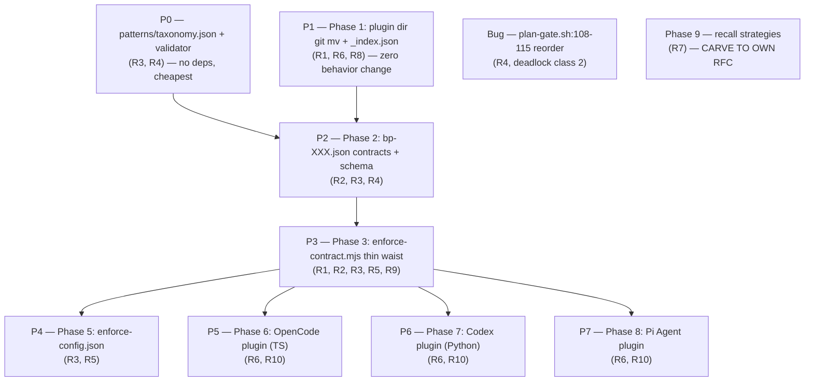

# RFC-008 — Decoupling the Enforcement Layer from the Memory Substrate

> **Source of truth.** This RFC is the committed form of consolidated rearchitecture
> **spec v8** (episode `20260527-081221-consolidated-rearchitecture-spec-v8-comp-000c`,
> supersedes chain v7 → v6 → v5 → v4 → v3). The parent-goal containment is recorded in
> `20260527-051225-decoupling-enforcement-from-memory-subst-c4af`. Every design element
> below maps to a requirement (R1–R10); no element exists without a requirement parent.

## AI context

> (1) This RFC decouples the enforcement layer (BP gates, classifiers, markers, contracts) from the memory substrate (`em-store` / `em-recall` / `em-search`), making enforcement a pluggable layer that *imports* the substrate rather than living inside it. (2) Today `em-recall.mjs` — nominally the memory recall core — is saturated with enforcement logic (`--gate stop`, checkpoint markers, carve-outs, the `.checkpoints/` migration), a soft P9/P1 violation that RFC-003 deferred by committing to "gate decision stays in core." (3) The key decision: episodic-memory *dictates the contract* (`patterns/bp-XXX.json` + `patterns/taxonomy.json` + `plugins/_index.json`); a thin waist (`enforce-contract.mjs`) reads the contract and delegates to `em-recall --gate`; one plugin per harness adapts the contract to that harness's hook surface at its declared capability tier — never the reverse.

---

## Requirements (R1–R10)

These are the anchors. Every architecture decision in this RFC maps to one or more of these requirements. **No design element exists without a requirement parent.**

### R1 — Memory is the substrate
Enforcement (BP gates, classifiers, markers, contracts) is decoupled from the memory substrate (em-store / em-recall / em-search). The substrate is pure store-and-recall. Enforcement is a separate layer that imports the substrate — never the reverse.
**Governed by:** PRINCIPLES.md P9 (Core never imports adapters; adapters import core).

### R2 — Pluggable enforcement; episodic-memory dictates the contract
BP enforcements are plugins. Episodic-memory defines WHAT must be enforced (contracts in `patterns/bp-XXX.json`). Plugins implement HOW the agent harness executes the enforcement. The contract flows FROM episodic-memory TO plugins, not the other direction.
**Governed by:** PRINCIPLES.md P2 (Behavior definitions are data), P11 (Portable core contract).

### R3 — Capability mapping contract
Each enforcement plugin must map its harness capabilities into the episodic-memory contract schema. A plugin declares which capabilities its harness provides (`pre_tool_use`, `stop`, `session_start`, `session_end`) and at what tier (`STRONG`, `MEDIUM`, `WEAK`). The effective enforcement tier is the intersection of what the contract requires and what the harness provides, further clamped by per-project configuration.
**Governed by:** PRINCIPLES.md P5 (Cross-platform with honest capability labels).

### R4 — Default classifier; plugins may override
A default command classifier (`command-classifier.sh` → 7-label taxonomy) ships with episodic-memory. Each enforcement plugin MAY supply its own classifier override. Overrides are harness-specific (e.g., a Pi Agent plugin might classify `tool_call` verbs differently than the default Bash tokenizer). Two labels are NON-OVERRIDABLE: `unsafe_complex` (safety fail-closed) and `marker_write` (gate infrastructure deadlock-prevention).
**Governed by:** PRINCIPLES.md P4 (Cognitive load > lightweight), P2 (Behavior definitions are data).

### R5 — Classifier activation gating
The classifier (default or plugin override) only executes when at least one enforcement plugin is active for the current harness. If no enforcement plugin is installed or active, the classifier is silent — no hook spawns, no token cost, no latency. Activation is detected via the plugin registry and per-project `enforce-config.json`.
**Governed by:** PRINCIPLES.md P6 (Tokens are the budget; bounded background work).

### R6 — Plugin-to-harness binding
Each enforcement plugin is tied to exactly one agent harness: Pi Agent, OpenCode, Claude Code, Windsurf, Cursor, or Codex. A plugin is the bridge between episodic-memory's contracts and a specific harness's hook/event surface. One harness, one plugin directory. Shared logic lives in the enforcement thin waist (`enforce-contract.mjs`), not duplicated across plugins.
**Governed by:** PRINCIPLES.md P9 (Core never imports adapters), P11 (Portable core contract).

### R7 — Pluggable recall strategies
`em-recall.mjs` supports multiple recall strategies. The default is tag-based lexical recall (zero deps). Additional strategies — semantic (embeddings), knowledge graph (episode reference traversal), hybrid (RRF merge) — are opt-in plugins that register in `em-recall/strategies/`. Each strategy exports a `recall()` interface. Strategies that require embeddings declare `requiresEmbeddings: true` and remain inert when the embedding backend is absent.
**Governed by:** PRINCIPLES.md P6 (Tokens are the budget), P1 (Memory is the substrate).

### R8 — Plugin registry
All enforcement plugins and recall strategies MUST be registered in `plugins/_index.json`. The registry is the single source of truth for: which plugins exist, which harness they bind to, their capability declarations, and their classifier override status. Installers, the enforcement thin waist, and the classifier activation gate all consult the registry. Unregistered plugins are invisible to the system.
**Governed by:** PRINCIPLES.md P2 (Behavior definitions are data), Rule 14 (Machine-readable blocks for drift-prone state).

### R9 — No checkpoints during exploration, planning, or architecture design
The pre-checkpoint gate materializes ONLY at the IMPLEMENTATION boundary — the first repo-source file write. Nothing is armed during exploration, planning, discovery, architecture design, or code review. Bash is intentionally ungated from the pre-checkpoint gate so reviews, inspections, exploration, and architecture work never block and never create markers. The post-checkpoint, push-gate, and stop-gate lifecycle remains fully enforced once implementation begins.
**Governed by:** PRINCIPLES.md P4 (Cognitive load > lightweight), P6 (Tokens are the budget). **Implemented by:** planning-passive redesign in `checkpoint-gate.sh:1297-1317` (lazy-arm on first repo-source write, Bash ungated from pre-checkpoint, F1 RESIDUAL documented at lines 55-66).

### R10 — Enforcement plugin runbooks
Each enforcement plugin MUST include a runbook in `plugins/<harness>/runbooks/` with specified content per section. The runbook is injected on first invocation per session via content-addressed UX-marker (`.so-runbook-shown.<sha8>`). Runbook marker writes are exempt from checkpoint/plan gating. Session-start lifecycle clears all runbook markers. Content-addressed (sha8 = SHA256(full_runbook_content).hex.slice(0, 8)) — edits invalidate the marker, forcing re-injection.
**Governed by:** PRINCIPLES.md P4 (Cognitive load > lightweight — the runbook prevents the model from rediscovering the same lessons each session). **Precedent:** second-opinion harness runbook at `hooks/runbooks/second-opinion-harness.md` (118 lines, production since 2026-05-13).

---

## Problem

Ground this in observable behavior, not a proposed solution.

`em-recall.mjs` is nominally the memory **recall** core, but it is saturated with **enforcement** logic:

- `--gate stop` decision logic (lines 68 / 295)
- `.checkpoint-required` / `.post-checkpoint-required` marker handling
- the stop-gate carve-out and the plan-gate deadlock triangle
- the `.checkpoints/` dual-root migration
- it imports `stop-gate-helpers.mjs`

The memory substrate's recall script **is** the bp-001 enforcement engine. RFC-003:506 made this explicit and load-bearing: *"The block-or-allow decision lives in `scripts/em-recall.mjs` as `--gate stop` … the core `--gate` flag remains in core unchanged (P9)."* RFC-003 relocated only the shell wrapper to `adapters/claude-code/capabilities/enforcement.mjs`, never the decision logic.

This collapses **recall** and **react** into one script — arguably already a soft P1 violation that RFC-003 deferred, and a P9 tension because the substrate now contains adapter-shaped enforcement behavior. Cross-tool reach is also blocked: adding a harness today means re-deriving enforcement plumbing rather than declaring a capability mapping against a contract.

---

## Proposal

What changes: episodic-memory becomes a contract authority (data files), a thin enforcement waist reads those contracts and delegates the actual gate decision to the unchanged `em-recall --gate` core, and each harness gets exactly one plugin directory that maps the contract onto its hook surface at an honestly-declared capability tier.

### Architecture (maps to R1, R2, R3, R6, R8, R9, R10)

```mermaid
graph TD
    subgraph EM["episodic-memory — dictates WHAT"]
        BP["patterns/bp-001.json<br/>(R2 — contract definitions)"]
        TAX["patterns/taxonomy.json<br/>(R4 — canonical 7-label set + per-gate allow/block)"]
        REG["plugins/_index.json<br/>(R8 — plugin registry)"]
    end

    EC["enforce-contract.mjs — thin waist<br/>(R1, R2, R3, R5, R9)<br/>contract validation + tier computation +<br/>implementation-boundary detection"]

    subgraph CORE["substrate core (unchanged)"]
        RECALL["em-recall.mjs --gate &lt;event&gt;<br/>(R1 — core decision engine)"]
    end

    subgraph PLUG["plugins/&lt;harness&gt;/ — one dir per harness (R6)"]
        MAN["manifest.json<br/>(R3, R8 — capability declarations)"]
        CAP["capabilities/enforcement.{mjs,ts,py}<br/>(R6 — harness adapter)"]
        CLS["classifier/command-classifier.{sh,ts,py}<br/>(R4 — optional override)"]
        RUN["runbooks/enforcement.md + .quickref.md<br/>(R10)"]
    end

    BP --> EC
    TAX --> EC
    REG --> EC
    EC -->|plugin lookup via _index.json R8| PLUG
    EC -->|implementation-boundary detection R9| EC
    EC -->|classifier dispatch R4/R5<br/>override else default| CLS
    EC -->|effective_tier = min harness,contract,config R3| EC
    EC -->|gate action = contract.gates[gate].action_for label R3| EC
    EC -->|delegate gate decision R1| RECALL
    RECALL -->|consults recall strategy R7| RECALL
```

**Decision flow:**
1. Hook fires (harness-specific event: PreToolUse, Stop, SessionStart).
2. Hook calls `enforce-contract.mjs` — the single thin waist.
3. `enforce-contract.mjs` consults `plugins/_index.json` → finds the active plugin for this harness (R8).
4. Detects implementation boundary: is this a repo-source write? If yes → lazy-arm `.checkpoint-required` (R9). If exploration/planning/architecture → silent, no markers.
5. First enforcement action per session: runbook gate checks `.so-runbook-shown.<sha8>` (R10). If absent → block with quickref injection + full runbook path. Model reads runbook, touches marker to acknowledge.
6. Computes `effective_tier = min(harness_cap, contract_tier, project_config)` (R3).
7. If `effective_tier < contract_tier`: degrade gracefully (warn, allow, or prompt — harness-specific).
8. Dispatches classifier: plugin override if registered, else default (R4, R5).
9. Looks up `contract.gates[gate].action_for(label)` → `"allow"` or `"block"` (R3 — contract-driven).
10. If `action == "block"` and `effective_tier == STRONG`: emit block decision.
11. If `action == "block"` and `effective_tier == MEDIUM`: warn (lifecycle-gated, not real-time block).
12. If `action == "block"` and `effective_tier == WEAK`: pass (prompt-injection only).
13. Delegates gate decision to `em-recall.mjs --gate <event>` (R1).
14. `em-recall.mjs` consults the recall strategy plugin (R7) and returns block/allow verdict.

### Canonical taxonomy (maps to R3, R4)

Single source of truth: `patterns/taxonomy.json`. Validated by `validate-bp-contract.mjs`. CI fails if any contract or classifier references a label not in this file (Rule 14).

```json
{
  "version": "1.0.0",
  "labels": [
    {
      "id": "read_only",
      "meaning": "Pure observation — ls, cat, git status, gh pr view, grep, find",
      "overridable": true,
      "gates": { "plan_approval": "allow", "pre_checkpoint": "allow", "post_checkpoint": "allow" }
    },
    {
      "id": "nonsrc_write",
      "meaning": "Writes but NOT repo source — .git internals, npm/yarn install, mkdir/rmdir, em-store episode writes",
      "overridable": true,
      "gates": { "plan_approval": "block", "pre_checkpoint": "allow", "post_checkpoint": "allow" }
    },
    {
      "id": "shared_write",
      "meaning": "Repo-source content write or cannot-tell — redirect-to-file, non-allowlisted node/python/ruby, cp/mv/dd, worktree-mutating git, curl -o, tee",
      "overridable": true,
      "gates": { "plan_approval": "block", "pre_checkpoint": "block", "post_checkpoint": "allow" }
    },
    {
      "id": "push_or_pr_create",
      "meaning": "Publishes/mutates shared external state — git push, gh pr create/merge/close, gh issue create/close, gh release, gh api POST/PUT/PATCH/DELETE",
      "overridable": true,
      "gates": { "plan_approval": "block", "pre_checkpoint": "allow", "post_checkpoint": "block" }
    },
    {
      "id": "marker_write",
      "meaning": "Gate-control deadlock-prevention — writes/removes .checkpoints/.* marker files at canonical paths",
      "overridable": false,
      "gates": { "plan_approval": "allow", "pre_checkpoint": "allow", "post_checkpoint": "allow" }
    },
    {
      "id": "unsafe_complex",
      "meaning": "Cannot tokenize safely — bash -c, eval, $(), backticks, unbalanced quotes, ambiguous heredoc",
      "overridable": false,
      "gates": { "plan_approval": "block", "pre_checkpoint": "block", "post_checkpoint": "block" }
    },
    {
      "id": "unknown",
      "meaning": "Parsed cleanly but unrecognized command shape — default_write or interpreter_other reason",
      "overridable": true,
      "gates": { "plan_approval": "block", "pre_checkpoint": "block", "post_checkpoint": "block" }
    }
  ],
  "non_overridable": ["unsafe_complex", "marker_write"],
  "non_overridable_rationale": {
    "unsafe_complex": "Safety fail-closed. A plugin that redefines unsafe_complex as read_only would allow eval/bash -c/subshells through the gate unexamined.",
    "marker_write": "Gate infrastructure deadlock-prevention. marker_write is the escape hatch that allows agents to write .pre-checkpoint-done / .post-checkpoint-done / .plan-approval-pending markers. A plugin that misclassifies a marker write as shared_write creates an unrecoverable deadlock (deadlock class 1)."
  }
}
```

#### Gate semantics — what each gate blocks (R3, R4)

| Gate | Event | Blocks labels where `gates[gate] == "block"` | Effect |
|------|-------|----------------------------------------------|--------|
| **Plan-approval** | PreToolUse (all write tools) | `shared_write`, `push_or_pr_create`, `nonsrc_write`, `unsafe_complex`, `unknown` | Write tools blocked while `.plan-approval-pending` exists. `read_only` + `marker_write` allowed (deadlock prevention). |
| **Pre-checkpoint** | PreToolUse (write tools, Bash) | `shared_write`, `unsafe_complex`, `unknown` | Repo-source writes blocked while `.checkpoint-required` armed + `.pre-checkpoint-done` absent. Only fires at the implementation boundary (R9). `nonsrc_write` + `push_or_pr_create` allowed. |
| **Post-checkpoint** | PreToolUse (Bash only) | `push_or_pr_create`, `unsafe_complex`, `unknown` | Push/PR-create blocked while `.post-checkpoint-required` armed + `.post-checkpoint-done` absent. |
| **Stop** | Stop / SubagentStop | (does not use command classification) | Blocked while `.checkpoint-required` armed + `.post-checkpoint-done` absent. Reads marker state, not command labels. |

#### Overridability rules (R4)

| Label | Overridable? | Rationale |
|-------|-------------|-----------|
| `read_only` | ✓ | Harness-specific read tools may differ |
| `nonsrc_write` | ✓ | Harness-specific non-source surfaces may differ (npm vs yarn vs pip) |
| `shared_write` | ✓ | Harness-specific write primitives may differ (Write vs Edit vs MultiEdit) |
| `push_or_pr_create` | ✓ | Harness-specific push/PR surfaces may differ |
| `marker_write` | **✗** | Gate infrastructure. Deadlock class 1: misclassification creates unrecoverable agent deadlock. Same safety tier as `unsafe_complex`. |
| `unsafe_complex` | **✗** | Safety fail-closed. Redefining as read_only bypasses all gates. |
| `unknown` | ✓ | Harness-specific unknown shapes may be classifiable |

#### Why `marker_write` is non-overridable (v4 fix)
`marker_write` is the deadlock-prevention escape hatch — how an agent writes `.pre-checkpoint-done` or `.plan-approval-pending` to unblock itself. If a plugin overrides `marker_write` and misclassifies a genuine marker write as `shared_write`, the gates deadlock: the agent is told "write the marker to unblock," but the gate blocks the marker write. This is the exact deadlock class that took 7 rounds of Codex review to close in `checkpoint-gate.sh`. Infrastructure labels are not opinions.

#### Why per-gate mapping replaces the single boolean (v4 fix)
The v3 taxonomy had `arms_pre_checkpoint: true/false`. This cannot express actual gate behavior because different gates block different label subsets:
- `push_or_pr_create` was `arms_pre_checkpoint: true` in v3, but it arms the *post-checkpoint* gate (`.post-checkpoint-required`), NOT the pre-checkpoint gate (`.checkpoint-required`). The v3 entry was factually wrong against the working `checkpoint-gate.sh`.
- `nonsrc_write` was `arms_pre_checkpoint: false` — correct for the pre-checkpoint gate, but incorrect for the plan-approval gate where it DOES block.
- A single boolean cannot express three gates with different subsets. The contract must be the source of truth; the enforcement layer reads the contract, never hardcodes the label→gate mapping.

#### Gate-action lookup (replaces hardcoded label set)
```
// BEFORE (v3): hardcoded in enforce-contract.mjs
if label in {shared_write, push_or_pr_create, unsafe_complex, unknown}:
    block

// AFTER (v4): contract-driven, reads taxonomy
action = taxonomy.gates[gate].action_for(label)
if action == "block" and effective_tier == STRONG:
    enforce-contract.mjs.block(label, reason)
```
The contract drives the behavior; the enforcement layer consults the contract. R2 satisfied.

### Validation-contract specification (v9 — closes round-1 review HOLD, findings F1–F10)

Round-1 second-opinion (opencode/DeepSeek-v4-pro, episode `20260528-013519-reply-opencode-to-20260528-013221-second-36d9`) returned **HOLD**: the validators were specified by single-sentence anchors ("fail CI on any non-canonical label") covering ~10% of the contract. This section is the full, **normative** contract — `scripts/validate-bp-contract.mjs` MUST implement every assertion below; CI fails on any violation.

#### Gate cardinality — 3 classification gates + 1 marker-state gate (F2, F10)
The per-label `gates` object in `taxonomy.json` carries EXACTLY three classification gates: `plan_approval`, `pre_checkpoint`, `post_checkpoint`. The `stop` gate is NOT per-label — it reads marker state, not command labels (see §Gate semantics). `stop.tier` is **pattern-level metadata** at the ROOT of each `bp-XXX.json` (`{ "stop": { "tier": "STRONG" }, "gates": { … } }`), never per-label. `schema.json`'s per-label gate set is therefore `{plan_approval, pre_checkpoint, post_checkpoint}`; `stop.tier` is a root-level property. `enforce-contract.mjs` computes `effective_tier(stop) = min(harness_cap.stop, contract.stop.tier, project_config.stop.tier)` — no label term (F10).

#### Single source of truth for overridability (F9)
Per-label `overridable: boolean` is canonical. The top-level `non_overridable: [...]` array is DERIVED (`labels.filter(l => !l.overridable).map(l => l.id)`, sorted) — retained only as human-readable convenience + CI cross-check. `validate-bp-contract.mjs` asserts the stored array equals the derived set (bidirectional); drift is a CI failure (Rule 14).

#### `taxonomy_version` hash (F8)
`taxonomy_version = "sha256:" + SHA256(JSON.stringify(labelsSortedById)).hex`, where `labelsSortedById` is the `labels` array sorted by `id`. The hash covers ONLY the sorted labels array — not `version` / `non_overridable` / `non_overridable_rationale` — so editorial fields change without invalidating classification behavior. Every `bp-XXX.json` AND every plugin `manifest.json` carries `taxonomy_version`; `validate-bp-contract.mjs` and `validate-plugin-registry.mjs` assert it equals the current computed hash, else fail "built against stale taxonomy."

#### OQ-2 CLOSED — classifier sources the taxonomy at runtime (F4)
`command-classifier.sh` SOURCES its label set from `taxonomy.json` at startup via a zero-dep node helper (`node -e 'process.stdout.write(require("<taxonomy>").labels.map(l=>l.id).join(" "))'`) and fails closed if the resolved set ≠ its expectation. This eliminates label drift by construction (no hand-maintained bash label list). CI asserts the sourcing helper exists, is wired, and that the classifier's emitted-label set and `_priority` case-arm names equal `taxonomy.labels`. The CI-only alternative (parsing labels out of 3000+ lines of bash) is rejected as fragile.

#### Runtime out-of-vocabulary contract — HARD-REJECT, not coerce (F3)
The thin-waist runtime layer does NOT coerce an unrecognized classifier label to `unknown`. It HARD-REJECTS the transaction (fail-closed) and emits a structured alert (episode + stderr: plugin id, harness, emitted label, command text, timestamp). **Authority-root binding:** the alert episode MUST be written with the harness/git-resolved `project_root` bound as the subprocess `cwd` (or an explicit accepted root flag) — NEVER the inherited caller cwd. `em-store --project X --scope local` writes under the CALLER's `.episodic-memory` when cwd ≠ X (the PR #218 / #326 / #336 orphaned-write class). The alert reports `project_root`, `store_scope`, and `episode_file`; disk-location tests cover cwd-mismatch, nested cwd, linked worktree, and non-git cwd with explicit target. Author-time + CI already guarantee vocabulary closure; if a non-canonical label reaches runtime, something is catastrophically wrong, and silent coercion is a latent behavior-change landmine — a label later added to the taxonomy with `allow` semantics would silently flip prior blocks to allows. Coercion is prohibited.

#### `validate-bp-contract.mjs` — normative assertion checklist (F1, F5, F6, F7)
1. **Meta-schema (F5):** `taxonomy.json` validates against `patterns/taxonomy.schema.json` (JSON Schema 2020-12) — `version` semver string; `labels` non-empty array; each label requires `id` (non-empty string), `meaning` (string), `overridable` (boolean), `gates` (object); `non_overridable` array-of-strings; `non_overridable_rationale` object keyed by label ids. `schema.json` validates against the same draft.
2. **Gate-completeness (F1a):** ∀ label, ∀ gate ∈ {plan_approval, pre_checkpoint, post_checkpoint}: `label.gates[gate]` exists.
3. **No extra gate keys (F1e):** ∀ label: `keys(label.gates) ⊆ {plan_approval, pre_checkpoint, post_checkpoint}`.
4. **Action-enum closure (F1b):** ∀ label, ∀ gate: `label.gates[gate] ∈ {allow, block}`.
5. **Overridability equality (F1c, F9):** stored `non_overridable` (sorted) ≡ derived non-overridable set.
6. **No duplicate ids (F1d):** label ids are unique.
7. **Vocabulary closure — no dangling references (F6):** the label set referenced by every `bp-XXX.json`, every `manifest.classifier.emits_labels`, the classifier's emitted labels, and the classifier `_priority` case-arms is a SUBSET of `taxonomy.labels`. (`emits_labels ⊆ taxonomy.labels` is shared with `validate-plugin-registry.mjs`; BOTH validators carry it.)
8. **Stable-ID integrity (F7):** labels may be ADDED but never REMOVED or RENAMED without a major `version` bump. The validator diffs the previous `taxonomy.json` from git; if `|old_ids| == |new_ids|` and `old_ids ≠ new_ids`, fail "possible rename — add the new label + mark the old `deprecated: true`, never rename." `bp-XXX.json.taxonomy_version` mismatch (F8) is a hard fail.
9. **Golden tests (F5):** `validate-bp-contract.mjs` ships known-good + known-bad fixtures (missing gate, bad action value, overridability mismatch, duplicate id, extra gate key, dangling reference, rename) and asserts the expected pass/fail per fixture. The 10 round-1 negative scenarios map 1:1 to assertions 2–8 + the runtime hard-reject and form the golden-test corpus.

### Plugin-manifest-validation-contract specification (v10 — closes P1 gap, findings F11–F20)

The taxonomy got its full normative spec in v9 (F1–F10). The plugin manifest layer was left example-driven — the same thin-spec class. This section is the full normative contract for `plugins/_index.json`, `plugins/<harness>/manifest.json`, and `scripts/validate-plugin-registry.mjs`. CI fails on any violation.

#### Two meta-schemas (M1, M2)

- **`plugins/_index.schema.json`** — registry meta-schema. JSON Schema 2020-12. `additionalProperties: false` at every level. Closed enums for `harness` and `status`.
- **`plugins/manifest.schema.json`** — per-plugin manifest meta-schema. JSON Schema 2020-12. `additionalProperties: false` at every level. Closed enums for `harness`, event keys, capability tier values, classifier mode.

Both are themselves validated by `scripts/validate-schemas.mjs` against the JSON Schema 2020-12 meta-meta-schema (mirror of F5).

#### Harness-name stable-ID rules (M3)

- The `harness` enum is **closed**: `{claude-code, opencode, codex, pi-agent, cursor, windsurf}`. New harness = PR to episodic-memory adding the enum value. Plugins cannot self-register a new harness id.
- A harness name may be ADDED but never RENAMED or REMOVED without a major `_index.schema.json` `version` bump. Validator git-diffs the prior schema; same cardinality + different ids = fail "possible rename — add new + mark old `deprecated: true`, never rename." Mirror of F7.
- Per plugin entry: `id == harness` (rules out plugin-name drift from harness-name).

#### Capability declarations (M4)

- `capabilities` keys ⊆ closed event set: `{pre_tool_use, stop, session_start, session_end, tool_result}`. Extra keys = fail.
- Each value ∈ closed enum: `{STRONG, MEDIUM, WEAK, TBD}`.
- `TBD` allowed only with a sibling comment field pointing at an open issue URL (validator greps for the URL pattern).
- Missing capability for an event the plugin's adapter actually dispatches into = fail. Validator inspects `plugins/<harness>/capabilities/enforcement.{mjs,ts,py}` for hook-registration call sites and asserts each registered event appears in `capabilities`.
- **Capability honesty (M4a):** SELF-DECLARED, but `plugins/bypass_known.json` records the ceiling per `{harness, event}` pair. Any declared tier exceeding the known-bypass ceiling for that harness/event = fail. **F28 closure (v10 round 2):** the registry MUST contain one explicit record per `{harness, event}` covered by any installed plugin — either `{ ceiling: "<tier>", citation: "<episode-or-url>" }` (known bypass) or `{ no_known_bypass_evidence: true, last_audited_iso8601: "<date>", auditor: "<id>" }` (clean audit). Missing record for a declared `{harness, event}` = fail (vacuity prevention: an empty `bypass_known.json` no longer silently accepts any tier). P0 ships the file pre-populated with the known Codex `pre_tool_use: { ceiling: "MEDIUM", citation: "multi-edit bypass per RFC-008 §Per-harness capability declarations" }` record so P5–P7 plugins inherit the ceiling at install-time. **F34 closure (v10 round 3):** `plugins/bypass_known.schema.json` ships in P0 alongside the file itself; meta-schema is JSON Schema 2020-12 with `additionalProperties: false` at every level. Top-level shape: `{ "records": [ { "harness": <enum-from-M3>, "event": <enum-from-M4>, "ceiling": <enum-from-M4>, "citation": <string>, "last_audited_iso8601": <string>, "auditor": <string>, "no_known_bypass_evidence": <bool> } ] }` with `oneOf` discriminator on `ceiling` (known bypass) vs `no_known_bypass_evidence: true` (clean audit). Validator (assertion 7) asserts: schema validation passes; every `{harness, event}` pair that appears in any installed manifest has exactly one matching record; record record-validity (one of the two shapes, not both, not neither).

#### Classifier mode + emits_labels (M5 — extends F6)

- `classifier.mode` ∈ `{default, override}`.
- `classifier.emits_labels` ⊆ `taxonomy.labels[].id` (F6 vocabulary closure, extended from contracts to manifests).
- If `mode == override`:
  - `classifier.override_path` REQUIRED + file exists.
  - **Non-overridable preservation (M5a):** override MUST emit `marker_write` and `unsafe_complex` with canonical semantics. Validator runs golden-input commands (from `tests/fixtures/plugins/non-overridable-inputs.json`) through the override and checks emissions; if either non-overridable label is suppressed or remapped, fail.
  - **Drift prevention (M5b):** override file MUST declare the same `taxonomy_version` as the manifest's top-level value.
- If `mode == default`:
  - `override_path` MUST be absent.
  - `emits_labels` MUST equal the full canonical 7-label set (default classifier emits everything; manifest can't lie about it).

#### Taxonomy binding (M6 — extends F8)

- `manifest.taxonomy_version == computeTaxonomyVersion(taxonomy.labels)`. Stale hash = "built against stale taxonomy" fail.
- `manifest.taxonomy_ref` is the literal constant `"patterns/taxonomy.json"` (not configurable).
- Every override classifier file MUST source its label set from `taxonomy.json` at startup (mirror of F4 / OQ-2-closed). Validator greps for the sourcing helper.

#### Runbook references (M7 — formalizes R10)

- `runbook.full` → `plugins/<harness>/runbooks/enforcement.md`. MUST: exist; size ≥ `MIN_RUNBOOK_BYTES` (1024); contain sentinel `## ⚠️ Self-trigger checklist` at column 1.
- `runbook.quickref` → `enforcement.quickref.md`. MUST: exist; size ≥ `MIN_QUICKREF_BYTES` (256).
- Runbook MUST contain all six required section headers (R10 §"Six required sections") — validator greps for each literal.
- **COMMON-row drift (M7a):** the COMMON rows in §1 (Self-trigger checklist) and §5 (Trigger phrases) are scaffold-generated and MUST byte-match canonical templates at `scripts/scaffold-plugin/templates/common-rows.md`. Drift = fail.
- **F29 closure — path-authority containment (M7b):** every file path referenced from a manifest (`runbook.full`, `runbook.quickref`, `classifier.override_path`, any future path field) MUST satisfy `realpath(<plugin-dir>/<path>) startsWith realpath(<plugin-dir>) + "/"`. Path traversal (e.g. `runbook.full: "../other-plugin/runbooks/enforcement.md"`) fails even if the resolved file exists and passes size/sentinel checks. Containment is checked against the realpath of the plugin's own directory under `plugins/<harness>/` — symlinks within the plugin dir are allowed, but symlinks/relative paths that escape it are not. Golden corpus adds `bad-runbook-path-traversal.json` and `bad-override-path-traversal.json`.

#### Bidirectional registry/disk consistency (M8)

- Every `plugins/<harness>/` directory on disk has an entry in `_index.json`; every entry has a directory.
- No duplicate `harness` bindings across `plugins[]` entries (one plugin per harness — R6).
- Every entry's `manifest` field resolves to a file that validates against `manifest.schema.json`.
- Cross-reference equality: registry's `id`/`harness` == manifest's `id`/`harness`.

#### Installed-state binding (M9 — composes with RFC-003)

- `installed_state.{installer_version, installed_at_iso8601, files[].{path, sha256}}` — schema only; the validator does NOT recompute hashes at CI time (deployed files live outside the repo).
- Migration detection: registry entry without an `installed_state` block = "registered, not deployed"; `~/.<tool>/hooks/` present with no registry entry = "deployed, not registered, offer migration" (RFC-003 §migration).

#### Golden test corpus (M10 — mirrors F5 / F1-corpus)

`tests/fixtures/plugins/` ships:

- `good-manifest.json` — fully valid claude-code-style.
- `bad-extra-field.json` — top-level field not in schema (catches `additionalProperties: false`).
- `bad-unknown-harness.json` — `harness: "vscode"` (not in enum).
- `bad-invalid-tier.json` — `capabilities.pre_tool_use: "MAYBE"`.
- `bad-dangling-label.json` — `emits_labels` references a label ∉ taxonomy.
- `bad-stale-taxonomy-version.json` — hash mismatch.
- `bad-override-suppresses-marker-write.json` — override remaps `marker_write` → `shared_write`.
- `bad-renamed-harness.json` — `claude-code` renamed to `claude` (stable-ID violation).
- `bad-missing-runbook.json` — manifest claims runbook path that doesn't exist.
- `bad-short-runbook.json` — runbook exists but below `MIN_RUNBOOK_BYTES`.
- `bad-default-mode-with-override-path.json` — `mode: default` but `override_path` present.
- `bad-capability-dishonest.json` — declared tier exceeds `bypass_known.json` ceiling.
- **F33 closure (v10 round 3) — four new fixtures absorbed from round-1 + round-2 closures:**
  - `bad-runbook-path-traversal.json` — `runbook.full: "../other-plugin/runbooks/enforcement.md"` (F29).
  - `bad-override-path-traversal.json` — `classifier.override_path: "../other-plugin/classifier/foo.mjs"` (F29).
  - `bad-override-emits-tsv.json` — plugin manifest with `mode: override`; override classifier file emits TSV at runtime (golden-input test catches it via thin-waist dispatch-context rule, F27+F35).
  - `bad-missing-bypass-record.json` — manifest declares `capabilities: { tool_result: STRONG }` for `harness: opencode` but `bypass_known.json` has no `{ harness: "opencode", event: "tool_result" }` record (F28).
- **Round-2 symlink fixture (F33 sweep):** `bad-runbook-symlink-escape.json` — `plugins/X/runbooks/enforcement.md` is a symlink whose `realpath` resolves OUTSIDE `plugins/X/` (M7b symlink-canonicalization edge case).

Each fixture maps 1:1 to one or more of assertions M3–M9 + scaffold-template equality (M7a). Corpus size: 16 fixtures (12 original + 4 closure additions + 1 symlink sweep = 17; net 16 after collapsing the symlink case into the existing path-traversal fixture if structurally equivalent — implementation chooses; CI asserts ≥16).

#### `validate-plugin-registry.mjs` — normative assertion checklist

1. **Meta-schema validation (M1, M2):** every `_index.json` and `manifest.json` validates against its `*.schema.json` (`additionalProperties: false` everywhere).
2. **Harness enum closure (M3):** every `harness` value ∈ closed enum.
3. **Harness stable-ID (M3):** git-diff prior `_index.schema.json` enum vs current; same cardinality + different ids = fail.
4. **id == harness (M3):** for every plugin entry.
5. **Capability key closure (M4):** `capabilities` keys ⊆ closed event set.
6. **Capability tier enum (M4):** each value ∈ `{STRONG, MEDIUM, WEAK, TBD}`; `TBD` requires sibling issue-URL comment.
7. **Capability honesty (M4a):** `bypass_known.json` validates against `bypass_known.schema.json` (F34); for every `{harness, event}` pair appearing in any installed manifest's `capabilities`, there MUST exist exactly one matching record (missing record = fail, F28 vacuity prevention); declared tier ≤ record's `ceiling` (or any tier OK if `no_known_bypass_evidence: true`).
8. **Vocabulary closure (M5, extends F6):** `emits_labels ⊆ taxonomy.labels`.
9. **Non-overridable preservation (M5a):** golden-input commands through override emit `marker_write` + `unsafe_complex` with canonical semantics.
10. **Mode/override consistency (M5):** `mode == override` ⇔ `override_path` set + file exists; `mode == default` ⇒ `emits_labels == canonical`.
11. **Taxonomy version binding (M6, extends F8):** `manifest.taxonomy_version == current_hash`.
12. **Override sources taxonomy at runtime (M6, extends F4):** validator greps override file for the sourcing helper.
13. **Runbook presence + sentinel + size (M7, R10):** full + quickref pass.
14. **Runbook sections + COMMON-row drift (M7a):** all 6 section headers present; COMMON rows byte-match templates.
15. **Bidirectional registry/disk (M8):** dirs ↔ entries; no duplicate harness; manifest cross-references equal.
16. **Installed-state schema (M9):** if present, validates against `installed-state.schema.json`.
17. **Golden corpus (M10):** all 12 fixtures pass/fail as expected.

### Runtime-data-contract specification (v10 — closes runtime-emission gap, findings F21–F25)

Author-time (scaffold) + CI (validators) cover the static manifest layer. The runtime emission layer was implicit (TSV strings, ad-hoc `printf` lines today). This section is the full normative contract for the four wire formats the thin waist and plugins exchange at every hook fire. CI validates the schemas; the thin waist hard-rejects malformed emissions.

#### Contract 1 — Classifier output (per command) — `classifier-output.schema.json`

Every classifier invocation emits ONE NDJSON line on stdout:

```json
{
  "label": "shared_write",
  "target": "./scripts/foo.mjs",
  "reason": "default_write",
  "taxonomy_version": "sha256:e3d9e25…",
  "classifier_version": "1.0.0",
  "verdict_source": "override:claude-code"
}
```

| Field | Type | Required | Constraint |
|---|---|---|---|
| `label` | string | YES | **∈ `taxonomy.labels[].id`** (F3 hard-reject if violated) |
| `target` | string | YES (may be `""`) | path or URL the action targets; empty for stateless cmds |
| `reason` | string | YES | stable snake_case id; used as marker-cache key |
| `taxonomy_version` | string | YES | sha256 hash matching the loaded taxonomy (F8 drift check) |
| `classifier_version` | semver | YES | for cache invalidation + debug |
| `verdict_source` | string | YES | `default` \| `override:<harness>` \| `marker_cache:<sid>:<hash>` |

**Format rules:** NDJSON one line per emission. UTF-8. No trailing comma. No whitespace around the JSON object beyond the trailing `\n`. Multi-emission classifiers (segment chains in `unsafe_complex` detection) emit one line per segment.

**Legacy TSV format (bash default, deprecated):** emits `label\ttarget\treason\n`. **F35 closure (v10 round 3):** TSV source authority is the **thin-waist dispatch context** (`selectedClassifier == "default"`), NOT a field inspected on the classifier's stdout. TSV has no `verdict_source` field by definition; the thin waist knows which classifier it invoked (default vs override) and applies the format rule based on that dispatch decision before parsing. Implementers MUST NOT inspect TSV payload content to decide acceptance. Post-cutover (P4) only NDJSON. **F27 closure:** plugin override classifiers (any language, `mode == override`) MUST emit NDJSON regardless of burn-in state — TSV from an override is HARD-REJECTED by the thin waist (before parse) with a structured alert (Contract 4), preventing overrides from sidestepping required fields like `taxonomy_version` / `classifier_version` / `verdict_source` by emitting in legacy format. The TSV→NDJSON migration of the bash default itself is P4's responsibility (along with F4 runtime-sourcing). Golden corpus fixture `bad-override-emits-tsv.json` asserts the override path (including the adversarial case of TSV containing stringified NDJSON-looking fields — still rejected because the dispatch source, not the payload, is the authority).

#### Contract 2 — Adapter → thin waist call (per hook fire) — `adapter-call.schema.json`

```json
{
  "tool": "Bash",
  "command": "git push origin main",
  "tool_args": null,
  "session_id": "abc123",
  "project_root": "/Users/.../episodic-memory",
  "gate": "post_checkpoint",
  "harness": "claude-code",
  "timestamp_iso8601": "2026-05-28T16:30:00Z",
  "manifest_version": "1.0.0"
}
```

| Field | Type | Required | Constraint |
|---|---|---|---|
| `tool` | string | YES | harness-specific tool name (Bash, Edit, Write, MultiEdit, …) |
| `command` | string | YES for Bash | raw command text |
| `tool_args` | object\|null | YES for non-Bash | raw tool args (e.g. Edit: `{file_path, old_string, new_string}`) |
| `session_id` | string | YES | per-harness session identifier |
| `project_root` | string | YES | **canonicalized absolute** (`pwd -P` equivalent — see F25 + episodes `…5705` / `…33a2`) |
| `gate` | enum | YES | `plan_approval` \| `pre_checkpoint` \| `post_checkpoint` \| `stop` |
| `harness` | enum | YES | closed enum from M3 |
| `timestamp_iso8601` | string | YES | UTC, RFC 3339 |
| `manifest_version` | semver | YES | plugin manifest version |

#### Contract 3 — Thin waist → adapter response (per hook fire) — `adapter-response.schema.json`

```json
{
  "action": "block",
  "reason": "post_checkpoint armed; .post-checkpoint-done absent",
  "label": "push_or_pr_create",
  "effective_tier": "STRONG",
  "structured_alert_episode": null,
  "harness_format_hint": {
    "claude_code_decision": "block",
    "exit_code": 2
  }
}
```

| Field | Type | Required | Constraint |
|---|---|---|---|
| `action` | enum | YES | `block` \| `allow` \| `warn` |
| `reason` | string | YES | human-readable; shown to the agent |
| `label` | string | YES | the classifier's label; `"n/a"` for stop-gate (reads marker state, not commands) |
| `effective_tier` | enum | YES | `STRONG` \| `MEDIUM` \| `WEAK` |
| `structured_alert_episode` | string\|null | YES | episode id if F3 hard-reject fired, else `null` |
| `harness_format_hint` | object | optional | harness-specific translation aid (e.g. Claude Code's `{decision, exit_code}` shape) |

The adapter converts `harness_format_hint` (or builds from the canonical fields) into whatever the harness's hook API expects on stdout / exit code. The thin waist stays harness-agnostic.

#### Contract 4 — Structured alert (F3 hard-reject) — `structured-alert.schema.json`

Written via `em-store` when the classifier returns an out-of-vocabulary label:

```json
{
  "alert_type": "classifier_out_of_vocabulary",
  "plugin_id": "claude-code",
  "harness": "claude-code",
  "emitted_label": "totally_fake_label",
  "command": "git push origin main",
  "timestamp_iso8601": "2026-05-28T16:30:00Z",
  "project_root": "/Users/.../episodic-memory",
  "store_scope": "local",
  "episode_file": ".episodic-memory/episodes/…"
}
```

| Field | Type | Required | Constraint |
|---|---|---|---|
| `alert_type` | enum | YES | `classifier_out_of_vocabulary` (more types reserved) |
| `plugin_id` | string | YES | from manifest |
| `harness` | enum | YES | closed enum (M3) |
| `emitted_label` | string | YES | the rejected label literal |
| `command` | string | YES | raw command (may be empty for non-Bash) |
| `timestamp_iso8601` | string | YES | UTC, RFC 3339 |
| `project_root` | string | YES | canonicalized absolute (F25) |
| `store_scope` | enum | YES | `local` \| `global` |
| `episode_file` | string | YES | resolved path to the written episode |

Written with `cwd: project_root` binding (F3 authority-root requirement — the PR #218 / #326 / #336 orphaned-write class). The alert episode MUST be findable via `em-search --tag classifier-alert --scope local`.

#### Per-plugin runtime validation matrix

| Check | Author-time | CI | Install | Runtime |
|---|:-:|:-:|:-:|:-:|
| Manifest schema valid | ✓ | ✓ | | |
| `emits_labels ⊆ taxonomy.labels` | ✓ | ✓ | | |
| `taxonomy_version` matches | | ✓ | | ✓ |
| Non-overridable preserved (M5a) | ✓ | ✓ (golden input) | | ✓ (per call) |
| Override file exists | | ✓ | ✓ | |
| Runbook complete + sentinel | ✓ | ✓ | | |
| `installed_state` sha256 | | | ✓ | |
| **Classifier output schema** | | | | **✓** |
| **`label ∈ taxonomy.labels` per call** | | | | **✓ (F3 hard-reject)** |
| **`taxonomy_version` per call matches loaded** | | | | **✓** |
| **Adapter call shape** | | | | **✓** |
| **Adapter response shape** | | | | **✓** |
| **Structured alert episode written w/ `project_root` cwd** | | | | **✓** |

The runtime row is the F3 closure: silent coercion is prohibited (any drift fails LOUD with an episode + stderr), so the validation budget at every hook fire is small but non-zero.

### Plugin-testing-harness specification (v10 — standardizes plugin tests, finding F26)

The contracts above (taxonomy validator, plugin-manifest validator, four runtime wire schemas) collectively are the **test oracle**. The standard way to test a plugin is to pull it through the universal gauntlet — no bespoke per-plugin test scripts.

#### Canonical invocation

```bash
node scripts/test-plugin.mjs --plugin <id> --project <project-root>
```

Exit `0` = plugin passes the universal contract. Exit non-zero = specific assertion id printed (e.g., `FAIL M5a: override remaps marker_write`). Same exit-code semantics across all harnesses.

**F31 closure — project-root binding (v10 round 2):** `--project <root>` is REQUIRED. If omitted, the harness MUST discover via `git rev-parse --show-toplevel` against `process.cwd()` and fail with a clear error if that command exits non-zero (non-git cwd). The resolved root is canonicalized (`pwd -P` equivalent — composes with F25). **Every subprocess** the harness spawns — validator invocations, classifier golden-input replays, adapter round-trip drivers, and the F3 hard-reject simulator (step 6) — MUST be spawned with `cwd: projectRoot` AND with `EPISODIC_MEMORY_PROJECT_ROOT=<projectRoot>` exported. Structured-alert episodes written by step 6 MUST land under `<projectRoot>/.episodic-memory/` (composes with Contract 4 authority-root requirement and the PR #218 / #326 / #336 orphaned-write class). Running `test-plugin.mjs` from a different cwd MUST NOT cause registry reads or alert writes to bind to caller cwd.

#### Seven-step gauntlet

| Step | What | Source of truth |
|---|---|---|
| 1 | Manifest validates against `manifest.schema.json` | M1, M2 |
| 2 | All 17 assertions from §Plugin-manifest-validation-contract | M3–M10 |
| 3 | Runbook present + sentinel + COMMON-row byte-equality | M7, M7a |
| 4 | **Golden classifier inputs** → assert emitted labels match expected fixture (NDJSON shape per Contract 1) | M5a + Contract 1 |
| 5 | **Golden adapter call → response round-trip** through `enforce-contract.mjs` (Contracts 2 + 3) | Contracts 2 + 3 |
| 6 | F3 hard-reject simulation: inject out-of-vocab label, assert structured alert episode written with `project_root` cwd (Contract 4) | Contract 4 + F3 |
| 7 | Capability honesty: declared tier ≤ `bypass_known.json` ceiling for harness/event | M4a |

CI runs `node scripts/test-plugin.mjs --plugin <id> --project "$GITHUB_WORKSPACE"` for every entry in `_index.json` on every PR (**F32 closure (v10 round 3):** `--project` is required in CI too — the round-2 fix earlier listed bare `--plugin <id>`, which reopened F31 via caller-cwd fallback). Authors run it locally with `--project "$(git rev-parse --show-toplevel)"` (the harness will also auto-discover if omitted, but explicit invocation is the documented form per F31).

#### What this eliminates

- **"Works on my machine" plugins.** The gauntlet runs identically anywhere.
- **Vibe-coded tests.** Authors don't write tests for the framework; they only write tests for harness-specific translation logic (the small surface that's actually unique per plugin).
- **Silent post-taxonomy-bump rot.** Step 4 catches a stale `taxonomy_version` immediately; CI fails on the next PR after a taxonomy edit until every plugin re-validates.
- **Override remaps non-overridable footguns.** Step 4's golden inputs include deadlock-class-1 commands; if the override emits anything other than canonical `marker_write` for those inputs, fail.
- **Inconsistent quality bars across plugins.** A Cursor plugin and a Codex plugin pass the same gauntlet or they don't ship.

#### Author surface reduction

After this lands, a new plugin author writes ~3 things, not ~30:

1. `manifest.json` (filled-in scaffold from `add-enforcement-plugin` skill).
2. `capabilities/enforcement.{mjs,ts,py}` — the adapter (harness-specific I/O translation, ~100 LOC).
3. **Harness-specific tests** — only for code paths the universal gauntlet can't cover (e.g., "does the Codex Python hook correctly read stdin when invoked from `~/.codex/hooks/`"). Anything cross-harness is covered by `test-plugin.mjs`.

Today, every gate-adjacent script ships its own 200–400 line bespoke test harness (`test-checkpoint-gate.sh` 343 cases, `test-command-classifier.sh` 428 cases, `test-classifier-marker.mjs` 30 cases, etc. — each reinvents fixture loading, assert helpers, and exit-code conventions). After this RFC ships: one harness, N plugins, deterministic.

#### Findings F21–F26 (continues F1–F20 numbering)

| # | Sev | Finding | Resolution |
|---|-----|---------|-----------|
| F11 | P1 | plugin manifest schema example-driven, not normative | §Plugin-manifest-validation-contract (closed schema + 17 assertions) |
| F12 | P1 | no meta-schema for `_index.json` | `_index.schema.json` (M1) |
| F13 | P1 | no meta-schema for `manifest.json` | `manifest.schema.json` (M2) |
| F14 | P1 | override may suppress non-overridable labels at runtime undetected | golden-input test (M5a / assertion 9) |
| F15 | P1 | harness enum open-ended in earlier examples | closed enum + stable-ID (M3) |
| F16 | P2 | capability honesty unenforced | `bypass_known.json` + assertion 7 |
| F17 | P2 | runbook COMMON-row drift between plugins | byte-match templates (M7a / assertion 14) |
| F18 | P2 | harness stable-ID rename undetected | git-diff schema enum (M3 / assertion 3) |
| F19 | P3 | override doesn't source taxonomy at runtime | grep sourcing helper (M6 / assertion 12) |
| F20 | P3 | `installed_state` schema unspecified | `installed-state.schema.json` + assertion 16 |
| F21 | P1 | classifier output schema undefined | §Runtime-data-contract Contract 1 (`classifier-output.schema.json`) |
| F22 | P1 | adapter call / response shape undefined | Contracts 2 + 3 |
| F23 | P1 | structured-alert schema + tagging convention undefined | Contract 4 (`structured-alert.schema.json`, tag `classifier-alert`) |
| F24 | P2 | emission format inconsistent between bash default + override languages | NDJSON canonical, TSV deprecated, migration in P4 |
| F25 | P2 | `project_root` canonicalization unspecified | `pwd -P` equivalent + cwd-mismatch test corpus (episodes `…5705` / `…33a2`) |
| F26 | P1 | per-plugin tests are bespoke "vibe-coded" scripts with inconsistent quality bars | §Plugin-testing-harness (`scripts/test-plugin.mjs --plugin <id>`, 7-step gauntlet, CI-mandatory) |
| F27 | P1 | TSV format allowed during burn-in without restricting it to bash default — override classifiers can emit TSV and bypass `taxonomy_version`/`classifier_version`/`verdict_source` | TSV ACCEPTED only when `verdict_source == "default"`; overrides NDJSON-only (hard-reject + alert); golden fixture `bad-override-emits-tsv.json` |
| F28 | P1 | `bypass_known.json` empty skeleton makes capability honesty vacuously pass | one explicit record per `{harness, event}` required (`ceiling` or `no_known_bypass_evidence`); P0 pre-populates Codex `pre_tool_use: { ceiling: "MEDIUM" }` |
| F29 | P1 | runbook/override path checks miss containment — `runbook.full: "../other-plugin/..."` resolves but escapes plugin dir | M7b realpath containment under `plugins/<harness>/`; golden fixtures `bad-runbook-path-traversal.json` + `bad-override-path-traversal.json` |
| F30 | P1 | `installed-state.schema.json` referenced by assertion 16 but absent from P0 schema list | P0 schema list expanded 6 → 7; includes `plugins/installed-state.schema.json` |
| F31 | P1 | `test-plugin.mjs` has no `--project`/root binding — caller-cwd binding can orphan alerts under wrong project | `--project <root>` REQUIRED (or git-root discovery); all subprocesses spawn with `cwd: projectRoot` + `EPISODIC_MEMORY_PROJECT_ROOT` env; alerts land under `<projectRoot>/.episodic-memory/` |
| F32 | P1 | round-1 fix listed CI invocation as bare `--plugin <id>`, reopening F31 via caller-cwd fallback | CI invocation updated to `--project "$GITHUB_WORKSPACE"`; local invocation uses `--project "$(git rev-parse --show-toplevel)"` |
| F33 | P1 | golden corpus + assertion 7 text didn't absorb round-1 closures | corpus expanded 12→16 (added `bad-runbook-path-traversal`, `bad-override-path-traversal`, `bad-override-emits-tsv`, `bad-missing-bypass-record`, optional `bad-runbook-symlink-escape`); assertion 7 made explicit on missing-record fail |
| F34 | P1 | `plugins/bypass_known.json` had no meta-schema; record shape not normative | `plugins/bypass_known.schema.json` added to P0 (JSON Schema 2020-12, `additionalProperties: false`); top-level `{records[]}` with `oneOf` discriminator on `ceiling` vs `no_known_bypass_evidence` |
| F35 | P2 | TSV acceptance keyed on `verdict_source` field that TSV doesn't have | source authority moved to thin-waist dispatch context (`selectedClassifier == "default"`); TSV payload content NOT inspected; override TSV w/ stringified NDJSON fields still hard-rejects |

### Capability-degradable enforcement (maps to R3)

#### Effective tier formula (ternary)
```
effective_tier(gate, harness) = min(
    harness_capability[gate.capability],   // R3: what the harness provides
    plugin_tier[pattern][gate],             // R2: what the contract requires
    project_config[gate]                    // R5: per-project clamp (LOWER only)
)
```

#### Per-harness capability declarations (R3, R6)

| Harness | pre_tool_use | stop | session_start | session_end | R6 binding |
|---------|-------------|------|---------------|-------------|------------|
| Claude Code | STRONG | STRONG | STRONG | STRONG | `plugins/claude-code/` |
| OpenCode | STRONG | MEDIUM | MEDIUM | — | `plugins/opencode/` |
| Pi Agent | STRONG | MEDIUM | STRONG | — | `plugins/pi-agent/` |
| Codex | **MEDIUM** | STRONG | STRONG | — | `plugins/codex/` |
| Cursor | WEAK | — | — | — | `plugins/cursor/` |
| Windsurf | WEAK | — | — | — | `plugins/windsurf/` |

**Codex pre_tool_use correction (R3 → P5):** declared MEDIUM, not STRONG. Codex PreToolUse is a guardrail with a known multi-edit bypass — "Hard mechanical enforcement (block-on-fail)" per P5 is not satisfied. Bypass documented in the manifest.

**Example — bp-001 plan-approval gate (R2, R3):**

| Harness | harness_cap | contract_tier | project_config | effective |
|---------|-------------|---------------|----------------|-----------|
| Claude Code | STRONG | STRONG | STRONG | **STRONG** |
| OpenCode | STRONG | STRONG | STRONG | **STRONG** |
| Pi Agent | STRONG | STRONG | STRONG | **STRONG** |
| Codex | MEDIUM | STRONG | STRONG | **MEDIUM** |
| Cursor | WEAK | STRONG | STRONG | **WEAK** |

**Example — bp-001 stop-gate (R2, R3):**

| Harness | harness_cap | contract_tier | project_config | effective |
|---------|-------------|---------------|----------------|-----------|
| Claude Code | STRONG | STRONG | STRONG | **STRONG** |
| OpenCode | MEDIUM | STRONG | STRONG | **MEDIUM** |
| Pi Agent | MEDIUM | STRONG | STRONG | **MEDIUM** |
| Codex | STRONG | STRONG | STRONG | **STRONG** |

### Classifier activation gating (maps to R5, R9)

```
on_tool_call(tool, harness, gate):
    plugin = plugins/_index.json.lookup(harness)
    if plugin == null or enforce-config.json.active == false:
        return ALLOW  // R5: classifier silent, no hooks spawn

    // R9: implementation-boundary detection
    if is_exploration_or_planning(tool):
        return ALLOW  // no checkpoint, no friction during non-implementation work

    classifier = plugin.classifier == "override"
        ? plugins/<harness>/classifier/command-classifier
        : default command-classifier.sh          // R4: default fallback

    label = classifier.classify(tool.command, harness_context)

    // R3: contract-driven gate action — taxonomy is the source of truth
    action = taxonomy.gates[gate].action_for(label)  // "allow" | "block"
    if action == "allow":
        return ALLOW

    effective_tier = min(harness_cap, contract_tier, project_config)

    // R9: only STRONG tier blocks at implementation boundary
    if effective_tier == STRONG and is_implementation_boundary(tool):
        enforce-contract.mjs.block(label, reason)
    elif effective_tier == MEDIUM:
        enforce-contract.mjs.warn(label)  // lifecycle-gated check, not real-time block
    else:  // WEAK
        pass  // prompt-injection only, no programmatic enforcement
```

Key: the classifier (default or override) ONLY executes inside `enforce-contract.mjs`, which ONLY runs when a plugin is active (R5). No plugin → no classifier → no token cost → no latency. The gate action is read from the taxonomy contract — never hardcoded in the enforcement layer (R2, R3). Exploration/planning/architecture work passes through without arming checkpoints (R9).

### Recall strategies (maps to R7)

Registry: `em-recall/strategies/_index.json`

| Strategy | Module | Dependencies | Default? |
|----------|--------|--------------|----------|
| `lexical` | `strategies/lexical.mjs` | Zero deps | **Yes** |
| `semantic` | `strategies/semantic.mjs` | Embedding model | No |
| `graph` | `strategies/graph.mjs` | Zero deps | No |
| `hybrid` | `strategies/hybrid.mjs` | semantic + lexical | No |
| `structured` | `strategies/structured.mjs` | Zero deps | No |

CLI: `em-recall --strategy semantic|hybrid|graph|structured|lexical`. If `--strategy semantic` is requested but no embedding backend is configured, fall back to `lexical` with a warning.

### Plugin registry (maps to R8)

`plugins/_index.json` — single source of truth.

```json
{
  "plugins": [
    {
      "id": "claude-code",
      "harness": "claude-code",
      "directory": "plugins/claude-code",
      "capabilities": { "pre_tool_use": "STRONG", "stop": "STRONG", "session_start": "STRONG", "session_end": "STRONG" },
      "classifier": "default",
      "manifest": "plugins/claude-code/manifest.json",
      "status": "active"
    },
    {
      "id": "opencode",
      "harness": "opencode",
      "directory": "plugins/opencode",
      "capabilities": { "pre_tool_use": "STRONG", "tool_result": "STRONG", "session_start": "MEDIUM", "stop": "MEDIUM" },
      "classifier": "default",
      "manifest": "plugins/opencode/manifest.json",
      "status": "active"
    }
  ],
  "recall_strategies": [
    { "id": "lexical", "module": "em-recall/strategies/lexical.mjs", "requiresEmbeddings": false, "default": true },
    { "id": "semantic", "module": "em-recall/strategies/semantic.mjs", "requiresEmbeddings": true, "default": false },
    { "id": "graph", "module": "em-recall/strategies/graph.mjs", "requiresEmbeddings": false, "default": false },
    { "id": "hybrid", "module": "em-recall/strategies/hybrid.mjs", "requiresEmbeddings": true, "default": false }
  ]
}
```

**Validation (CI) — `scripts/validate-plugin-registry.mjs` checks:**
- Every `plugins/<harness>/` directory has an entry in `_index.json`
- Every entry in `_index.json` has a corresponding directory on disk
- No duplicate harness bindings (one plugin per harness)
- All capability tiers are valid (`STRONG`, `MEDIUM`, `WEAK`, `TBD`)
- Classifier field is `"default"` or `"override"`; if override, `plugins/<harness>/classifier/` must exist
- Manifest `classifier.emits_labels` is a subset of taxonomy canonical labels
- Manifest `taxonomy_version` hash matches current `patterns/taxonomy.json`
- `plugins/<harness>/runbooks/enforcement.md` exists, ≥ MIN_RUNBOOK_BYTES, contains RUNBOOK_SENTINEL (R10)
- `plugins/<harness>/runbooks/enforcement.quickref.md` exists, ≥ MIN_QUICKREF_BYTES (R10)

### Contract boundary (maps to R2)

- **Contracts** (BP definitions, RFCs, taxonomy, plugin registry): git-versioned repo files. If `git blame` is the right tool to understand history → it is a contract.
- **Episodes** (runtime lifecycle state, decisions, discoveries): stored in `.episodic-memory/`, immutable IDs, revised via supersedes chains (P7).
- R2: episodic-memory dictates contracts. Plugins follow them. Contracts flow FROM core TO plugins.

### Migration detection (maps to R8)

Pre-plugin install vs current install: distinguished by `plugins/_index.json` presence AND `~/.episodic-memory/adapters/<harness>.installed.json` (RFC-003 manifest `installed_state` field). If hooks exist at `~/.claude/hooks/` but no plugin registry entry exists for that harness → pre-plugin install → offer migration.

### Implementation boundary (maps to R9)

The pre-checkpoint gate is inert during exploration, planning, discovery, architecture design, and code review. It materializes only when an agent crosses the implementation boundary — the first write to a repo-source file.

**What triggers the boundary (lazy-arm):**
- Any `Edit`/`Write`/`MultiEdit`/`NotebookEdit` targeting an in-repo, non-gitignored, non-`.review-store/`, non-`.checkpoints/` file path.
- Any `Bash` classified as `shared_write`/`unsafe_complex`/`unknown` (NOT `default_write`/`interpreter_other` — those are novel commands held for classification first per agent-classifier-first).

**What does NOT trigger the boundary:**
- Read-only tools (Read, Glob, Grep, Agent, WebFetch, Skill, etc.) — always allowed.
- Bash classified as `read_only`, `nonsrc_write`, `marker_write`, or unevaluated novel (`default_write`/`interpreter_other`).
- Write/Edit targeting off-repo paths (memory under `~/.claude/projects/`, skills, settings).
- Write/Edit targeting `.review-store/` (second-opinion artifacts).
- Write/Edit targeting `.checkpoints/` (gate infrastructure).
- Write/Edit targeting gitignored paths (`.episodic-memory/`, `scratch/`, `analysis/`, `node_modules/`).
- Write/Edit with a path verdict of `nonsrc_write`/`read_only` from the agent classifier.

**What remains enforced regardless:**
- The post-checkpoint + push-gate + stop-gate lifecycle: once `.checkpoint-required` is armed (implementation began), the full lifecycle tracks through `.pre-checkpoint-done` → `.post-checkpoint-required` → `.post-checkpoint-done` → push cleanup → stop satisfaction.
- Push self-arms `.post-checkpoint-required` independently ("push is an INDEPENDENT hard gate even when the pre-checkpoint was escaped").

**F1 RESIDUAL (documented, accepted):** Bash is intentionally ungated from pre-checkpoint (planning-passive redesign). A pure-Bash implementation (`sed -i`, `cat > file`, `git commit`, `node script-that-writes.mjs`) can mutate repo source without ever arming `.checkpoint-required`, bypassing the pre-checkpoint. This is a deliberate trade: gating all `shared_write` Bash reintroduced planning-time friction (read-only node/inspection commands mis-blocked). Clean closure depends on the PR-B2 agent-classifier verdict (`nonsrc_write`) distinguishing repo-source Bash writes from non-source Bash writes. Tracked as #351.

### Enforcement plugin runbooks — content specification (maps to R10)

#### Mechanism (from the existing second-opinion harness pattern)

| File | Purpose |
|------|---------|
| `plugins/<harness>/runbooks/enforcement.md` | Full operator checklist |
| `plugins/<harness>/runbooks/enforcement.quickref.md` | Short inline reference on first block per session |
| `plugins/<harness>/capabilities/enforcement.{mjs,ts,py}` | Runbook gate: detects first plugin invocation, blocks with quickref injection |
| `em-recall-sessionstart.sh` (or harness equivalent) | SessionStart glob-clear of all `.so-runbook-shown.*` |

**Lifecycle:**
1. SessionStart → clear all `.so-runbook-shown.*` markers at canonical repo root.
2. First enforcement action → gate detects, blocks with quickref + full runbook path.
3. Model `Read`s the full runbook, then `touch .checkpoints/.so-runbook-shown.<sha8>` to acknowledge.
4. Subsequent actions → marker exists → gate passes silently.
5. Runbook edited mid-session → sha8 changes → marker invalid → re-inject.
6. Next session → step 1 repeats.

**Content-addressed:** sha8 = SHA256(full_runbook_content).hex.slice(0, 8). Edits invalidate the marker, forcing re-injection. **Checkpoint-immune:** `.so-runbook-shown.*` is excluded from TASK_SIGNAL and CHECKPOINT_CLEANUP marker sets; runbook marker writes pass through even under armed gates.

#### Six required sections

Each enforcement runbook has six sections; COMMON rows ship in every plugin, HARNESS-SPECIFIC rows are added per plugin.

**Section 1 — Self-trigger checklist** (table: Moment | habit | rule | self-check). COMMON rows cover: about to Edit/Write repo source; about to `git push`; Bash `sed -i`/`cat > file` redirect to repo source; returned HOLD from classifier (novel command); writing a marker file (must be nonempty, not `touch`); session end blocked by stop-gate; plan-pending blocks marker writes (escape hatch: `rm .checkpoints/.plan-approval-pending`). HARNESS-SPECIFIC rows: Claude Code (Bash 120s timeout → set `timeout: 600000`); OpenCode (`tool_call` vs `tool_result` dispatch); Pi Agent (`session_shutdown` advisory, MEDIUM); Codex (multi-edit bypass, PreToolUse MEDIUM).

**Section 2 — Canonical invocation** (HARNESS-SPECIFIC). Exact command shapes: classify a command; write the pre-implementation checkpoint (NONEMPTY content: what you will implement, plan ref, approval ref, tests alongside); write the post-implementation checkpoint (NONEMPTY: E2E results, bugs filed, command inventory); acknowledge the runbook (`touch .checkpoints/.so-runbook-shown.<sha8>` AFTER reading); harness-specific gotchas (Claude Code: Bash default timeout 120000ms → set 600000; session id from PreToolUse stdin `.session_id`; `run_in_background: true` bypasses PreToolUse — NEVER use for enforcement; hook order checkpoint-gate → plan-gate → second-opinion-gate → stop-gate).

**Section 3 — Failure mode → diagnosis cheat sheet** (table: Symptom | likely cause | verify | recovery). COMMON rows cover each block message: "Checkpoint required…"; "Post-implementation checkpoint required…"; "Plan approval pending"; the deadlock-class-1 marker_write misclassification; empty marker (`[ -s ]`); stop-gate blocks session end; wrong-root in a worktree; novel command held. HARNESS-SPECIFIC: Claude Code (hook not firing → `run_in_background`); OpenCode (PreToolUse event registration); Codex (multi-edit MEDIUM bypass).

**Section 4 — Anti-patterns this runbook exists to prevent** (COMMON + HARNESS-SPECIFIC). COMMON: writing repo source before the pre-checkpoint block; `touch` for marker content (0-byte → rejected); bypassing pre-checkpoint with pure Bash (F1 RESIDUAL, #351); writing markers to the wrong root in a worktree; ignoring the runbook re-injection; writing `.post-checkpoint-done` before `.pre-checkpoint-done`; `run_in_background: true` on enforcement commands.

**Section 5 — Trigger phrases** (COMMON). Prompt words meaning "the enforcement plugin activates now": `implement`, `write code`, `make changes`, `fix this bug`, `add feature`, `build`, `refactor`, `modify`, `create file`, `update the` → implementation boundary; `push`/`git push`, `PR`/`pull request`, `deploy`/`release` → post-checkpoint gate. Words that do NOT trigger enforcement (R9): `explore`, `plan`/`planning`, `architecture`, `review`, `discover`, `research`, `what does`, `how does`.

**Section 6 — Composes with** (COMMON). Cross-references every runbook must include: `patterns/taxonomy.json`, `patterns/bp-001.json`, `plugins/<harness>/manifest.json`, `plugins/_index.json`, `enforce-contract.mjs`, the deadlock-analysis episode, `PRINCIPLES.md` (P4/P5/P6/P9), `.episodic-memory/episodes/`.

#### Per-plugin runbook paths

| Plugin | Full runbook | Quickref | Deployed to |
|--------|-------------|----------|-------------|
| claude-code | `plugins/claude-code/runbooks/enforcement.md` | `enforcement.quickref.md` | `~/.claude/hooks/runbooks/claude-code-enforcement.md` |
| opencode | `plugins/opencode/runbooks/enforcement.md` | `enforcement.quickref.md` | `~/.opencode/runbooks/enforcement.md` |
| pi-agent | `plugins/pi-agent/runbooks/enforcement.md` | `enforcement.quickref.md` | `~/.pi-agent/runbooks/enforcement.md` |
| codex | `plugins/codex/runbooks/enforcement.md` | `enforcement.quickref.md` | `~/.codex/runbooks/enforcement.md` |
| second-opinion | `plugins/second-opinion/runbooks/harness.md` | `harness.quickref.md` | `~/.claude/hooks/runbooks/second-opinion-harness.md` (existing) |

#### Scaffold-generated runbook stub + CI validation
The `add-enforcement-plugin` skill (`scripts/scaffold-plugin.mjs`) generates `plugins/<harness>/runbooks/enforcement.md` with: all 6 section headers pre-populated; all COMMON rows filled from the taxonomy + deadlock analysis; HARNESS-SPECIFIC sections marked with `<!-- TODO -->` placeholders; the quickref generated from the full runbook; runbook sentinel `## ⚠️ Self-trigger checklist` (validated by the runbook gate). `scripts/validate-plugin-registry.mjs` checks: `enforcement.md` exists, ≥ MIN_RUNBOOK_BYTES (1024), contains the sentinel; `enforcement.quickref.md` exists, ≥ MIN_QUICKREF_BYTES (256). Missing/corrupt runbook → CI fail → plugin cannot ship.

### Plugin authoring skill + taxonomy conformance (maps to R3, R4, R6, R8, R10)

Because the contract is machine-readable, authoring a conformant plugin is **generated, not hand-rolled**. A scaffolding skill turns "add a harness = a plugin directory" into a guided flow and makes the canonical taxonomy (R4) impossible to violate by emitting it, CI-checking it, and runtime-rejecting any violation.

**Skill `add-enforcement-plugin`** is backed by a harness-agnostic generator `scripts/scaffold-plugin.mjs` (zero-dep, callable from any harness per R6); the Claude Code *skill* is a thin wrapper over it. Flow:
1. Prompt for harness name + capability tiers per event + classifier mode (`default` | `override`).
2. Read `patterns/taxonomy.json` and `patterns/schema.json` to drive prompts — always in sync with the current contract.
3. Scaffold `plugins/<harness>/` — `manifest.json`, `capabilities/enforcement.{mjs,ts,py}` stub wired to that harness's hook API, optional `classifier/` if override.
4. Scaffold `plugins/<harness>/runbooks/enforcement.md` — all 6 sections, COMMON rows pre-filled, HARNESS-SPECIFIC placeholders, quickref auto-derived, sentinel validated.
5. **Auto-register** in `plugins/_index.json` (R8) — the registry step cannot be forgotten.
6. Run `validate-plugin-registry.mjs` + `validate-bp-contract.mjs` → fail loud if non-conformant.

Net: **R3, R8, and R10 conformance-by-construction** — the author cannot produce a plugin that fails to map into the contract schema, is missing from the registry, or lacks a conformant runbook.

**Taxonomy conformance enforced at three layers (R4):**

| Layer | Mechanism | Catches |
|---|---|---|
| **Author-time (skill)** | Injects `LABELS` from `taxonomy.json`; writes `emits_labels` + `taxonomy_version` hash into the manifest; refuses to let an override remap/suppress `unsafe_complex` or `marker_write` | Author inventing a label by hand; overriding infrastructure labels |
| **CI (`validate-plugin-registry.mjs`)** | Asserts `manifest.classifier.emits_labels ⊆ taxonomy.labels`; asserts `taxonomy_version` == current hash else "built against stale taxonomy"; checks no non-overridable label is suppressed; runs the golden test; validates runbook (R10) | Drift after taxonomy changes; stale manifest; suppressed non-overridable; missing runbook |
| **Runtime (`enforce-contract.mjs`)** | Validates the classifier's return value against `taxonomy.json` — any label ∉ canonical set is HARD-REJECTED (fail-closed) with a structured alert (plugin id, harness, label, command, timestamp); coercion to `unknown` is PROHIBITED (F3 — silent coercion is a latent behavior-change landmine). Non-overridable labels always processed by core logic regardless of plugin output | A buggy/malicious override emitting garbage at runtime |

The runtime layer is the spine: the thin waist treats `taxonomy.json` as the **only** vocabulary it accepts, so the canonical 7 labels are the hard boundary of the whole system — even if author-time and CI were skipped.

**Generalization.** The same schema-driven generator backs three "new X" entry points — all are "fill a schema + register in an index + validate": `add-enforcement-plugin` (R6) — harness plugin + runbook stub (R10); `add-bp-contract` (R2) — new `patterns/bp-XXX.json`; `add-recall-strategy` (R7) — new `em-recall/strategies/<x>.mjs` + registry entry. The generator can also **regenerate the capability matrix** from all registered manifests, so the human-readable matrix is always derived, never hand-maintained.

### Scope

- **In scope:** the substrate↔enforcement boundary — `patterns/bp-XXX.json` contracts, `patterns/taxonomy.json` + validator, `plugins/_index.json` registry, `enforce-contract.mjs` thin waist, per-project `enforce-config.json`, capability-degradable `min()` formula, per-harness plugins (Claude Code, OpenCode, Codex, Pi Agent; Cursor/Windsurf WEAK advisory), enforcement-plugin runbooks (R10), the plugin-authoring scaffold skill, and the real work — extracting `--gate`/markers/carve-outs OUT of `em-recall.mjs`.
- **Out of scope:** Phase 9 pluggable recall strategies (R7) — substrate side of the boundary, carved into its own RFC (folds into RFC-001 semantic + RFC-007 graph-projection). The semantic strategy's embedding dependency is in tension with P6 and must be decided there, not here.

---

## 9 phases mapped to requirements

| Phase | Name | New | Mod | Tokens | Deps | Maps to |
|-------|------|-----|-----|--------|------|---------|
| 1 | Plugin directory structure | 3 | 7 | ~25-30K | — | R1, R6, R8 |
| 2 | BP contract JSONs + taxonomy | 5 | 3 | ~35K | P1 | R2, R3, R4 |
| 3 | `enforce-contract.mjs` thin waist | 2 | 5 | ~55K | P1, P2 | R1, R2, R3, R5, R9 |
| 4 | Classifier schema extraction | 1 | 5 | ~30K | P2 | R4, R5 |
| 5 | Per-project `enforce-config.json` | 2 | 3 | ~25K | P3 | R3, R5 |
| 6 | OpenCode plugin (TS, STRONG) | 5 | 0 | ~45K | P3 | R6, R10 |
| 7 | Codex plugin (Python hooks) | 5 | 0 | ~40K | P3 | R6, R10 |
| 8 | Pi Agent plugin | 5 | 0 | ~35K | P3 | R6, R10 |
| 9 | Pluggable recall strategies | 5 | 1 | ~50K | — | R7 |

**Phase 1 → R1, R6, R8:** create `plugins/` with subdirectories per harness; `git mv hooks/` → `plugins/claude-code/hooks/` (zero behavior change, byte-identical); create `plugins/_index.json` skeleton; update `install.mjs` to deploy from `plugins/<harness>/hooks/`. ~25-30K (pure git mv + path-reference patching).

**Phase 2 → R2, R3, R4:** convert Markdown patterns to JSON contracts `patterns/bp-001.json`..`bp-012.json`; create `patterns/taxonomy.json` (canonical 7-label set with per-gate allow/block, R3/R4); create `patterns/schema.json` (contract schema) + `patterns/taxonomy.schema.json` (meta-schema, F5); create `scripts/validate-bp-contract.mjs` (implements the full normative §Validation-contract specification assertion checklist — gate-completeness, action-enum closure, overridability equality, vocabulary closure, stable-ID integrity, `taxonomy_version` binding, golden tests — NOT merely "non-canonical label" detection) + `scripts/validate-taxonomy-schema.mjs` (meta-validation, F5). Contract schema shape: `{ gates: { plan_approval: {tier}, pre_checkpoint: {tier}, post_checkpoint: {tier} }, stop: { tier }, taxonomy_ref: "patterns/taxonomy.json", taxonomy_version: "sha256:…" }` — the three classification gates are per-pattern; `stop` is a root-level marker-state gate (NOT per-label, F2/F10); `taxonomy_version` binds the contract to a taxonomy hash (F8).

**Phase 3 → R1, R2, R3, R5, R9:** `enforce-contract.mjs` — the thin waist. Validates against BP contracts; implementation-boundary detection (R9, lazy-arm on first repo-source write, silent during exploration/planning/architecture); ternary `min()` (R3); classifier dispatch (R4/R5); reads gate action from taxonomy (R3, contract-driven); delegates to `em-recall.mjs --gate` (R1). Two invocation modes: plugin-native import (in-process, STRONG harnesses) + CLI spawn (degrade). Runtime out-of-vocabulary contract: labels not in the canonical set are HARD-REJECTED (fail-closed) with a structured alert — NOT coerced to `unknown` (F3; see §Validation-contract specification). The alert episode is written with `cwd: project_root` (authority-root binding below).

**Phase 4 → R4, R5:** extract the 7-label taxonomy into `patterns/taxonomy.json`; refactor `command-classifier.sh` to source the taxonomy from JSON at runtime (OQ-2 closed — runtime-source; the CI-only alternative is rejected), with CI validating the sourcing helper + label-set equality (F4); plugin classifier override interface; override registration in `plugins/_index.json`; non-overridable labels enforced at scaffold + CI + runtime.

**Phase 5 → R3, R5:** `enforce-config.json` per project (`{ "bp-001": { "plan_approval": "MEDIUM", ... } }`); can only LOWER effective tier (clamp down), never raise; controls classifier activation (`active`/`classifier`); if `active: false` for all plugins → classifier silent (R5).

**Phase 6 → R6, R10 (OpenCode):** `plugins/opencode/` TypeScript plugin wrapping `pre_tool_use` + `tool_result` + lifecycle hooks; manifest declares `pre_tool_use: STRONG, tool_result: STRONG, session_start: MEDIUM, stop: MEDIUM`; includes runbooks per R10.

**Phase 7 → R6, R10 (Codex):** `plugins/codex/` Python hooks for PreToolUse + Stop; `pre_tool_use` MEDIUM (multi-edit bypass documented), `stop: STRONG`, `session_start: STRONG`; includes runbooks per R10.

**Phase 8 → R6, R10 (Pi Agent):** `plugins/pi-agent/` wrapping `tool_call` + `session_shutdown`/`turn_end`; `pre_tool_use: STRONG`, `stop: MEDIUM`, `session_start: STRONG`; includes runbooks per R10.

**Phase 9 → R7:** pluggable recall strategies for `em-recall.mjs` (lexical default zero-dep; semantic opt-in `requiresEmbeddings: true`; graph zero-dep; hybrid RRF). Registry `em-recall/strategies/_index.json`. **Caveat:** the only FEATURE phase — carve into its own RFC (semantic's embedding dependency is in tension with P6).

### Build priority (maps to R1–R10)

| Priority | What | Maps to | Rationale |
|----------|------|---------|-----------|
| **P0** | `patterns/taxonomy.json` + validator + all v10 schema docs | R3, R4 + F11–F35 | Canonize the 7 labels with per-gate allow/block. Cheapest fix, prevents downstream label drift + hardcoded gate logic. Labels already exist in `command-classifier.sh:13-28`. **v10 P0 expansion (round-3 corrected):** ship the **eight** static JSON-Schema docs — plugin manifest (`plugins/manifest.schema.json`, `plugins/_index.schema.json`, `plugins/installed-state.schema.json` — F30), `plugins/bypass_known.schema.json` (F34 — meta-schema for the honesty registry), four runtime wire contracts (`classifier-output.schema.json`, `adapter-call.schema.json`, `adapter-response.schema.json`, `structured-alert.schema.json`) — plus `plugins/bypass_known.json` **pre-populated** with the Codex `pre_tool_use: MEDIUM` ceiling record (F28, not empty skeleton). Cheap to land together, lets P1 wire validators against locked schemas. |
| **P1** | Phase 1: Plugin directory structure | R1, R6, R8 | `git mv hooks/` → `plugins/claude-code/hooks/`; `plugins/_index.json` skeleton. Zero behavior change, ~25-30K. |
| **P2** | Phase 2: BP contract JSONs | R2, R3, R4 | `patterns/bp-001.json`..`bp-012.json`. Contract schema that Phase 3 validates against. `patterns/schema.json` for scaffold generator. |
| **P3** | Phase 3: `enforce-contract.mjs` | R1, R2, R3, R5, R9 | The thin waist. Validates against contracts, computes effective tier, implementation-boundary detection (R9), dispatches classifier, reads gate action from taxonomy, delegates to core. |
| **P4** | Phase 5: `enforce-config.json` | R3, R5 | Per-project config clamping. Classifier activation gating. Ternary `min()`. |
| **P5-P7** | Phase 6/7/8: Per-tool plugins | R6, R10 | OpenCode (TS), Codex (Python), Pi Agent. Each depends on P3. Each includes `runbooks/enforcement.md` per R10. |
| **—** | Phase 9: Recall strategies | R7 | Carve into own RFC. Semantic has embedding dependency against P6. |
| **Bug** | Fix `plan-gate.sh:108-115` ordering | R4 | Deadlock class 2 — F14 early-exit blocks the `marker_write` escape hatch. |
| **Follow** | Migrate second-opinion runbook to `plugins/second-opinion/runbooks/` | R10 | Post-Phase 1: `hooks/runbooks/` → `plugins/second-opinion/runbooks/`. |

---

## Requirement traceability matrix

| Requirement | Architecture section | Phase(s) | Principle(s) |
|-------------|---------------------|----------|--------------|
| R1 — Memory is substrate | North star, architecture diagram, enforce-contract.mjs delegates to em-recall | P1, P3 | P9 |
| R2 — Pluggable enforcement, episodic-memory dictates contract | Contract flow direction, BP contract JSONs, contract boundary, taxonomy as gate-action source of truth | P2, P3 | P2, P11 |
| R3 — Capability mapping contract | Effective tier formula, per-harness declarations, per-gate allow/block taxonomy | P2, P3, P5 | P5 |
| R4 — Default classifier, plugin override | Canonical taxonomy, non-overridable labels, classifier dispatch | P2, P4 | P2, P4 |
| R5 — Classifier activation gating | Classifier pseudocode, enforce-config.json `active` field | P3, P5 | P6 |
| R6 — Plugin-to-harness binding | plugins/<harness>/ structure, one-per-harness | P6, P7, P8 | P9, P11 |
| R7 — Pluggable recall strategies | Recall strategies registry, em-recall/strategies/ | P9 | P6, P1 |
| R8 — Plugin registry | plugins/_index.json, validation CI check | P1, all | P2, Rule 14 |
| R9 — No checkpoints during exploration | Implementation boundary detection, planning-passive redesign, classifier pseudocode guard | P3 | P4, P6 |
| R10 — Enforcement plugin runbooks | Runbook content spec, content-addressed UX-markers, checkpoint exemption, per-plugin paths, CI validation | P5-P7, scaffold | P4 |

---

## Deadlock analysis (maps to taxonomy, R3, R4, R9)

Full analysis: episode `20260527-073522-deadlock-analysis-7-classes-traced-again-2648`.

| Class | Deadlock? | Root cause | Fix |
|-------|-----------|------------|-----|
| 1 — marker_write misclassified | **TRUE** | Plugin overrides marker_write → gate blocks its own escape hatch | `marker_write: overridable: false` (v4+ taxonomy). Three-layer enforcement: author-time (scaffold), CI (validator), runtime (thin waist hard-rejects non-canonical labels; no coercion). |
| 2 — Invalid SID + plan pending | **TRUE (bug)** | `plan-gate.sh:108-115` F14 early-exit before `marker_write` dispatch at :136. The escape hatch that allows `rm .checkpoints/.plan-approval-pending` is unreachable because F14 exits first. | Reorder: check marker_write targeting plan-marker BEFORE the F14 block. |
| 3 — Empty marker | No (tax) | Agent writes 0-byte file with `touch()`; gate rejects it. Block message says "must be non-empty." | Already handled — block message at `checkpoint-gate.sh:533` is explicit. Two-step tax, not deadlock. |
| 4 — Wrong-root (worktree) | UX deadlock | Agent writes to worktree root; gate reads main repo | Message names canonical path. Agent re-reads and re-writes at the correct location. |
| 5 — Plan-pending blocks checkpoint | No (2-step) | Cross-gate invariant; escape hatch (rm plan marker) works | Escape hatch functional — remove plan marker, then write checkpoint. Two steps, resolvable. |
| 6 — Agent-classifier bootstrap | RESOLVED | Carve-out at `checkpoint-gate.sh:1159-1181` | In code — validates script path resolves to `~/.episodic-memory/scripts/` or repo `scripts/`. Security layered: env-prefix rejected upstream, plan-pending checked before carve-out. |
| 7 — `.checkpoints/` arms own gate | RESOLVED | Smart-arming carve-out at `checkpoint-gate.sh:868-872` | In code — `.checkpoints/*` paths excluded from `_tool_call_targets_repo_source`. Gate infrastructure carved out from own enforcement. |

**Key insight:** Class 1 is the only deadlock the taxonomy can prevent. Classes 6 and 7 prove the pattern — infrastructure carve-outs are necessary and already exist in the gate code. Class 2 is a genuine `plan-gate.sh` ordering bug requiring a separate code fix.

---

## Alternatives considered

| Alternative | Why rejected |
|---|---|
| Keep gate decision inside `em-recall.mjs` (RFC-003:506 stance) | Collapses recall+react into one script; soft P1 violation and P9 tension. Blocks cross-tool reach — each new harness re-derives plumbing instead of declaring a capability mapping. This RFC supersedes that commitment. |
| Single boolean `arms_pre_checkpoint` per label (v3 taxonomy) | Cannot express three gates with different label subsets. `push_or_pr_create` was factually wrong (arms post-checkpoint, not pre-checkpoint); `nonsrc_write` blocks plan-approval but not pre-checkpoint. Replaced by per-gate `gates: {plan_approval, pre_checkpoint, post_checkpoint}`. |
| Make all taxonomy labels overridable | A plugin could redefine `unsafe_complex` as `read_only` (bypass all gates) or misclassify `marker_write` as `shared_write` (unrecoverable deadlock class 1). `unsafe_complex` + `marker_write` are non-overridable. |
| Declare Codex `pre_tool_use` STRONG | Dishonest per P5 — Codex PreToolUse has a known multi-edit bypass. Declared MEDIUM with the bypass documented; push-gate + stop-gate are the hard enforcement for Codex. |
| Two node spawns in Phase 3 (validate, then delegate) | Doubles startup latency. Single node entry with two invocation modes (in-process import for STRONG harnesses; CLI spawn for degrade). |
| Include Phase 9 recall strategies in this RFC | Recall strategies are substrate-side, not enforcement. The semantic strategy's embedding dependency conflicts with P6 and must be decided in RFC-001/RFC-007. Carved out. |
| Gate during planning/exploration (pre-R9 behavior) | Reintroduced planning-time friction — read-only node/inspection commands mis-blocked. R9 makes the pre-checkpoint inert until the implementation boundary; F1 RESIDUAL (#351) is the accepted trade. |
| Hand-roll each harness plugin | Lets authors invent labels, skip registry registration, or ship without a runbook. Scaffold generator makes R3/R8/R10 conformance-by-construction. |

---

## Implementation plan

> Concrete PR/phase breakdown is populated as the RFC moves to `accepted`. Build priority P0–P9 above is the ordering; sequencing graph below shows the dependency layers.

### Sequencing



---

## Implementation

> Populate during build stage — mark each item immediately after it ships. Do not batch at the end.

| PR/Commit | Files changed | Tests | Notes |
|---|---|---|---|
| _pending_ | _pending_ | _pending_ | _pending_ |

---

## Related RFCs

- **RFC-003 — Pluggable Tool Adapters** (`accepted`). RFC-003 ⊂ this RFC. RFC-003's load-bearing commitment — *gate decision logic stays in `em-recall.mjs` core* (RFC-003:506) — is **partially superseded** by RFC-008: `--gate`, markers, carve-outs, and the classifier migrate OUT to the enforcement thin waist (`enforce-contract.mjs` + `patterns/*.json`), restoring `em-recall.mjs` to pure recall. RFC-003's adapter contract, `installed_state` manifest field, and cross-tool messaging remain in force; this RFC reuses `installed_state` + `plugins/_index.json` presence for migration detection (R8). RFC-003 frontmatter status is unchanged (it is shipped) — only the decision-in-core stance is annotated as superseded.
- **RFC-001 — Intelligent Memory** (`accepted`) and **RFC-007 — Graph Projection** (`draft`): Phase 9 (pluggable recall strategies, R7) is substrate-side and carves into these — semantic embeddings fold into RFC-001, graph traversal into RFC-007. Not in this RFC.

---

## Second opinion

> Required before `status: accepted` can be set. This RFC is the committed form of spec v8; the design review below was conducted on the converging spec (two reviewers — author self-review + OpenCode second-opinion in the `episodic-memory-bp-opt` checkout) across the v3 → v8 chain. All substantive findings were ACCEPTED and incorporated.

**Reviewer:** self-review + OpenCode second-opinion (cross-tool, `episodic-memory-bp-opt`)
**Date:** 2026-05-27
**AI-slop check:** clean — fixed in revision (every finding below was incorporated into v8 before this RFC was written)
**Decision:** proceed (7/7 ACCEPT). Champion sign-off flips `draft` → `accepted`.

| # | Finding | Resolution | Maps to |
|---|---------|------------|---------|
| 1 | Phase 3 double node spawn latency | Single node entry, two invocation modes (import vs CLI) | R1 |
| 2 | Phase 1 70K estimate inflated | Corrected to ~25-30K (git mv + path patching) | P1 |
| 3 | Phase 9 does not belong | Carve into own RFC; semantic has embedding dependency | R7 |
| 4 | Codex pre_tool_use: STRONG dishonest | Corrected to MEDIUM with bypass documented | R3 |
| 5 | Taxonomy drift | Canonical `patterns/taxonomy.json` + validator | R4 |
| 6 | BP contract: repo vs episode | Contracts = git-versioned files; episodes = runtime state | R2 |
| 7 | Effective-tier formula omits Phase 5 | Ternary `min(harness, contract, config)` | R3 |
| — | Migration detection broken | Use `installed_state` + `plugins/_index.json` presence | R8 |
| — | Deadlock class 1: marker_write misclassification | `marker_write: overridable: false` + three-layer enforcement | R4 |
| — | Deadlock class 2: plan-gate.sh F14 ordering bug | Reorder `plan-gate.sh:108-115` before marker_write dispatch at :136 | R4 |
| — | Runbook pattern generalized from second-opinion | 6-section spec, content-addressed UX-marker, session-scoped, checkpoint-immune | R10 |

### Post-acceptance validation-layer review — consensus chain (2026-05-28)

After acceptance, the champion flagged the validation/contract layer as thin. A focused second-opinion review was run on that layer and iterated to consensus across two providers.

- **Round 1 — opencode (DeepSeek-v4-pro)**, episode `20260528-013519-reply-opencode-to-20260528-013221-second-36d9`: **HOLD** — 10 findings (5×P1, 3×P2, 2×P3); validators were ~10% specified. All 10 incorporated into §Validation-contract specification (v9).
- **Round 2 — codex**, episode `20260528-015856-reply-codex-to-20260528-015614-second-op-a1d5`: **HOLD** — 3 P1 (Phase-3/Phase-4 text still contradicted the new hard-reject + OQ-2-closed spec; structured-alert episode had no authority root). Fixed.
- **Round 3 — codex**, episode `20260528-020158-reply-codex-to-20260528-020026-second-op-9d70`: **HOLD** — 1 P1 (residual "clamp to unknown" reference at the deadlock Class-1 row). Fixed (+ same-class sweep).
- **Round 4 — codex**, episode `20260528-020458-reply-codex-to-20260528-020303-second-op-b089`: **ACCEPT** — no findings; `em-rfc-validate` passed. Consensus reached.

| # | Sev | Finding | Resolution (v9) |
|---|-----|---------|-----------------|
| F1 | P1 | `validate-bp-contract.mjs` ~10% specified | Full normative assertion checklist (gate-completeness, action-enum closure, overridability equality, dup-id, extra-key, meta-schema) |
| F2 | P1 | `stop` in `schema.json` per-label but only 3 per-label gates | `stop` is root-level pattern metadata; per-label = 3 classification gates |
| F3 | P1 | runtime coerce→`unknown` is wrong | runtime HARD-REJECTS + structured alert; coercion prohibited |
| F4 | P1 | OQ-2 open blocks Phase 4 | OQ-2 closed — classifier runtime-sources the taxonomy |
| F5 | P1 | no meta-validation of validators | `taxonomy.schema.json` + `validate-taxonomy-schema.mjs` + golden tests |
| F6 | P2 | vocabulary-closure gap (dangling labels) | closure assertion across bp-XXX / manifest / classifier |
| F7 | P2 | stable-ID rename unprotected | add-never-rename git-diff assertion |
| F8 | P2 | `taxonomy_version` hash undefined | `sha256` over sorted labels array; carried by contracts + manifests |
| F9 | P3 | `overridable` double-sourced | per-label `overridable` canonical; `non_overridable` derived + CI-checked |
| F10 | P3 | `stop` tier computation source unspecified | `stop.tier` root-level; `min(harness, pattern, config)`, no label term |

### Post-acceptance v10 plugin-layer review — pending dispatch (2026-05-28)

After v9 closed the taxonomy/contract validator gap (F1–F10), the champion flagged a parallel gap at the plugin layer: the plugin manifest schema, the runtime emission contracts, and the per-plugin test path were all example-driven, not normatively specified. v10 adds three new normative sections (§Plugin-manifest-validation-contract / §Runtime-data-contract / §Plugin-testing-harness) closing findings F11–F26. A consolidated second-opinion review on the combined v10 + P0 implementation plan is dispatched concurrent with this commit.

- **Round 1 — codex**, episode `20260528-100613-reply-codex-to-20260528-100352-rfc-008-v-0f80`: **HOLD** — 5 P1 findings (F27–F31): override-classifier TSV bypass (F27), `bypass_known.json` vacuity (F28), runbook/override path-traversal (F29), missing `installed-state.schema.json` in P0 (F30), `test-plugin.mjs` cwd binding (F31). All 5 ACCEPT — concrete spec edits, no architectural pushback. Fixes folded inline (this commit). All P0 schema list expanded from six to seven. Going to round 2.
- **Round 2 — codex**, episode `20260528-101359-reply-codex-to-20260528-101123-rfc-008-v-3815`: **HOLD** — 4 new findings (F32–F35). F27/F29/F30 conceptually closed. F28/F31 needed coherence fixes (CI invocation reopened F31; bypass_known missing meta-schema; golden corpus didn't absorb new fixtures; TSV source authority wording needed dispatch-context, not stdout content). All 4 ACCEPT — small spec patches. Folded inline (this commit).
- **Round 3 — pending dispatch** (post round-2 fixes; T19 changelog row).

| # | Sev | Finding | Resolution (v10) |
|---|-----|---------|------------------|
| F11 | P1 | plugin manifest schema example-driven, not normative | §Plugin-manifest-validation-contract (closed schema + 17 assertions) |
| F12 | P1 | no meta-schema for `_index.json` | `_index.schema.json` (M1) |
| F13 | P1 | no meta-schema for `manifest.json` | `manifest.schema.json` (M2) |
| F14 | P1 | override may suppress non-overridable labels at runtime undetected | golden-input test through override (M5a / assertion 9) |
| F15 | P1 | harness enum open-ended in earlier examples | closed enum + stable-ID (M3) |
| F16 | P2 | capability honesty unenforced | `bypass_known.json` + assertion 7 |
| F17 | P2 | runbook COMMON-row drift between plugins | byte-match templates (M7a / assertion 14) |
| F18 | P2 | harness stable-ID rename undetected | git-diff schema enum (M3 / assertion 3) |
| F19 | P3 | override doesn't source taxonomy at runtime | grep sourcing helper (M6 / assertion 12) |
| F20 | P3 | `installed_state` schema unspecified | `installed-state.schema.json` + assertion 16 |
| F21 | P1 | classifier output schema undefined | §Runtime-data-contract Contract 1 (`classifier-output.schema.json`) |
| F22 | P1 | adapter call / response shape undefined | Contracts 2 + 3 |
| F23 | P1 | structured-alert schema + tagging convention undefined | Contract 4 (`structured-alert.schema.json`, tag `classifier-alert`) |
| F24 | P2 | emission format inconsistent between bash default + override languages | NDJSON canonical, TSV deprecated, migration in P4 |
| F25 | P2 | `project_root` canonicalization unspecified | `pwd -P` equivalent + cwd-mismatch test corpus (episodes `…5705` / `…33a2`) |
| F26 | P1 | per-plugin tests are bespoke "vibe-coded" scripts with inconsistent quality bars | §Plugin-testing-harness (`scripts/test-plugin.mjs --plugin <id>`, 7-step gauntlet, CI-mandatory) |
| F27 | P1 | TSV format allowed during burn-in without restricting it to bash default — override classifiers can emit TSV and bypass `taxonomy_version`/`classifier_version`/`verdict_source` | TSV ACCEPTED only when `verdict_source == "default"`; overrides NDJSON-only (hard-reject + alert); golden fixture `bad-override-emits-tsv.json` |
| F28 | P1 | `bypass_known.json` empty skeleton makes capability honesty vacuously pass | one explicit record per `{harness, event}` required (`ceiling` or `no_known_bypass_evidence`); P0 pre-populates Codex `pre_tool_use: { ceiling: "MEDIUM" }` |
| F29 | P1 | runbook/override path checks miss containment — `runbook.full: "../other-plugin/..."` resolves but escapes plugin dir | M7b realpath containment under `plugins/<harness>/`; golden fixtures `bad-runbook-path-traversal.json` + `bad-override-path-traversal.json` |
| F30 | P1 | `installed-state.schema.json` referenced by assertion 16 but absent from P0 schema list | P0 schema list expanded 6 → 7; includes `plugins/installed-state.schema.json` |
| F31 | P1 | `test-plugin.mjs` has no `--project`/root binding — caller-cwd binding can orphan alerts under wrong project | `--project <root>` REQUIRED (or git-root discovery); all subprocesses spawn with `cwd: projectRoot` + `EPISODIC_MEMORY_PROJECT_ROOT` env; alerts land under `<projectRoot>/.episodic-memory/` |
| F32 | P1 | round-1 fix listed CI invocation as bare `--plugin <id>`, reopening F31 via caller-cwd fallback | CI invocation updated to `--project "$GITHUB_WORKSPACE"`; local invocation uses `--project "$(git rev-parse --show-toplevel)"` |
| F33 | P1 | golden corpus + assertion 7 text didn't absorb round-1 closures | corpus expanded 12→16 (added `bad-runbook-path-traversal`, `bad-override-path-traversal`, `bad-override-emits-tsv`, `bad-missing-bypass-record`, optional `bad-runbook-symlink-escape`); assertion 7 made explicit on missing-record fail |
| F34 | P1 | `plugins/bypass_known.json` had no meta-schema; record shape not normative | `plugins/bypass_known.schema.json` added to P0 (JSON Schema 2020-12, `additionalProperties: false`); top-level `{records[]}` with `oneOf` discriminator on `ceiling` vs `no_known_bypass_evidence` |
| F35 | P2 | TSV acceptance keyed on `verdict_source` field that TSV doesn't have | source authority moved to thin-waist dispatch context (`selectedClassifier == "default"`); TSV payload content NOT inspected; override TSV w/ stringified NDJSON fields still hard-rejects |

### v4 → v10 change log (provenance of this RFC)

| # | Change | Version | Reason |
|---|--------|---------|--------|
| T1 | Replace `arms_pre_checkpoint: boolean` with per-label `gates: {plan_approval, pre_checkpoint, post_checkpoint}` | v4 | Single boolean cannot express 3 gates with different subsets. `push_or_pr_create` was factually wrong. Taxonomy must be the source of truth for gate logic. |
| T2 | `marker_write: overridable: false` | v4 | Gate infrastructure deadlock-prevention; same safety tier as `unsafe_complex`. |
| T3 | Added `non_overridable` array + rationale in taxonomy schema | v4 | Explicit declared set + reason; CI and author-time tooling check it. |
| T4 | Gate-action lookup changed from hardcoded set to `taxonomy.gates[gate].action_for(label)` | v4 | R2: contract drives behavior; enforcement layer consults taxonomy. |
| T5 | R9 added — no checkpoints during exploration/planning/architecture | v5 | Implementation boundary only. Planning-passive redesign. Bash ungated from pre-checkpoint. |
| T6 | Deadlock analysis section — 7 classes traced against checkpoint-gate.sh + plan-gate.sh | v5 | 3 true deadlocks, 2 resolved by carve-outs, 2 UX taxes. Class 2 documented. |
| T7 | Implementation boundary detection added to architecture + pseudocode | v5 | `is_exploration_or_planning()` guard before gate logic (R9). Lazy-arm on first repo-source write. |
| T8 | Build priority: bug fix row for plan-gate.sh:108-115 | v5 | Deadlock class 2 code fix. |
| T9 | R10 added — enforcement plugin runbooks, 6 required sections | v6 | Content-addressed UX-marker, session-scoped, checkpoint-immune. Generalized from the second-opinion harness. |
| T10 | Runbook section in build priority + traceability matrix | v6 | Deployment paths, CI validation, scaffold stubs. |
| T11 | Runbook content specification completed — all 6 sections, common + harness-specific | v7 | Self-trigger checklist, canonical invocation, failure-mode diagnosis, anti-patterns, trigger phrases, composes-with. |
| T12 | Complete combined v8 spec — all sections unified | v8 | v4 (base) + v5 (R9, boundary, deadlock) + v6 (R10 structure) + v7 (R10 content). Architecture, phases, traceability, build priority, review findings, ground truth all updated. |
| T13 | Validation-contract specification added — closes round-1 HOLD F1–F10 (normative assertion checklist, `stop` root-level, runtime hard-reject, OQ-2 closed, meta-validation, stable-ID integrity, `taxonomy_version` hash) | v9 | Champion flagged validators as thin; opencode/DeepSeek HOLD with 10 findings, all incorporated. |
| T14 | §Plugin-manifest-validation-contract specification added (F11–F20) | v10 | Plugin manifest layer was example-driven; needs same normative rigor as v9 gave the taxonomy. Closed enums, stable-ID for harness names, golden-input test for non-overridable preservation, `bypass_known.json` for capability honesty. |
| T15 | §Runtime-data-contract specification added (F21–F25) | v10 | Runtime emissions (classifier output, adapter call/response, structured alert) were implicit. Four wire schemas, NDJSON canonical, TSV deprecated during P4 burn-in, `project_root` canonicalization rule. |
| T16 | §Plugin-testing-harness specification added (F26) | v10 | Per-plugin tests today are bespoke scripts with inconsistent quality bars. `scripts/test-plugin.mjs --plugin <id>` 7-step gauntlet replaces N hand-rolled harnesses; authors only write harness-specific translation tests. |
| T17 | P0 build-priority expanded — runtime + manifest schema files ship as static JSON-Schema docs in P0 (validators still P1/P3) | v10 | Cheap to ship together; lets P1 immediately wire validators against locked schemas without bootstrap dependency on a future schema spec. |
| T18 | v10 round-2 fixes (F27–F31): TSV-restriction for overrides (Contract 1), `bypass_known.json` non-vacuity contract (M4a), path-traversal containment (M7b), P0 schema list 6→7 incl. `installed-state.schema.json`, `test-plugin.mjs --project` binding | v10 | Codex round-1 HOLD with 5 P1 findings, all ACCEPT. Folded inline in this commit; round 2 dispatched against the fixes. |
| T19 | v10 round-3 fixes (F32–F35): CI invocation `--project "$GITHUB_WORKSPACE"` (closes F31 reopening), golden corpus 12→16 + assertion 7 explicit (F33), `bypass_known.schema.json` added to P0 (8 schemas), TSV source authority = thin-waist dispatch context not stdout `verdict_source` field (F35) | v10 | Codex round-2 HOLD with 4 findings, all ACCEPT — small doc-only patches. Folded inline; round 3 dispatched. |

---

## Open questions

| # | Question | Owner | Status |
|---|---|---|---|
| OQ-1 | Phase 9 (recall strategies, R7) destination: split between RFC-001 (semantic) and RFC-007 (graph), or a single new substrate RFC? | Charlton Ho | open |
| OQ-2 | Does `command-classifier.sh` source `taxonomy.json` at runtime, or is the match validated only at CI? | Charlton Ho | **closed (v9)** — runtime-source via zero-dep node helper; CI validates the sourcing helper + label-set equality. Drift eliminated by construction. See §Validation-contract specification (F4). |
| OQ-3 | Cursor/Windsurf are WEAK (prompt-injection advisory only) — do they get plugin directories at all, or only a rules-injection artifact? | — | open |

---

## Ground truth hierarchy

1. **PRINCIPLES.md** — governing principles; all design must conform.
2. **Code on disk** — what works today (`hooks/`, `scripts/`, `plugins/`, `patterns/`, `hooks/runbooks/`).
3. **Accepted RFCs** — RFC-003 (accepted), RFC-004 (accepted).
4. **This RFC (spec v8)** — requirements R1–R10 anchor all decisions.
5. **Deadlock analysis** — episode `20260527-073522-deadlock-analysis-7-classes-traced-again-2648`.
6. **Runbook analysis** — episode `20260527-080017-runbook-infrastructure-analysis-second-o-43d9`.
7. **Design review episodes** — second-opinion chain 2026-05-27 (v3 → v4 → v5 → v6 → v7 → v8).
8. **Global rearchitecture episodes** — design speculation 2026-05-26; informs but does not override accepted specs.
