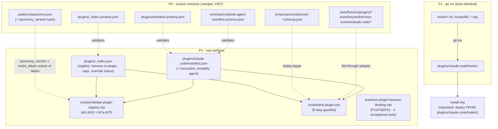
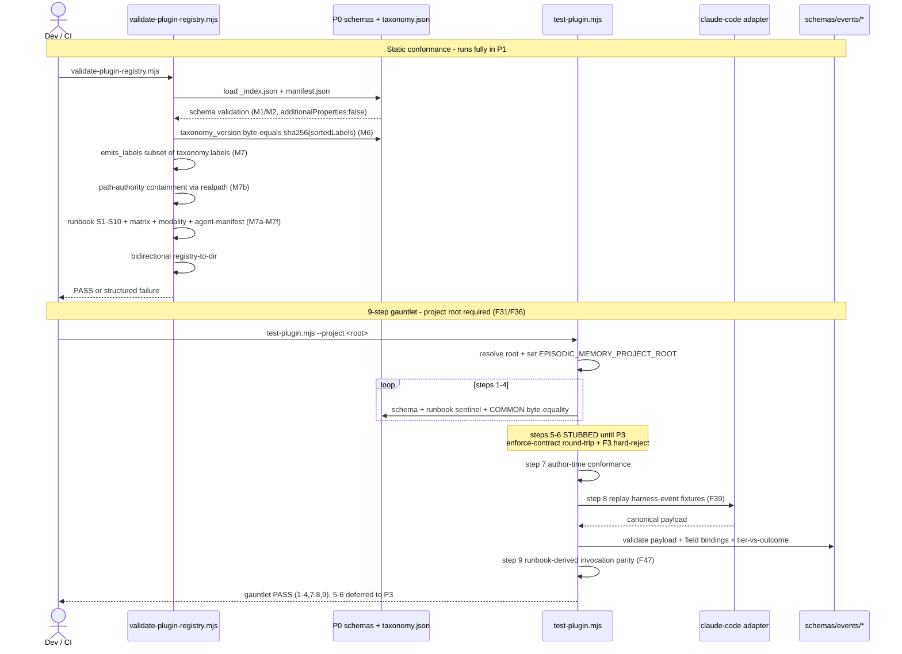

# P1 — Plugin directory + registry + test gauntlet

> Part of [RFC-008](../RFC-008-decouple-enforcement-from-substrate.md). Index:
> [RFC-008/README.md](README.md).

**Status:** **NEXT.** Rule-18 plan converged (codex ACCEPT-with-FU, 4 rounds) → awaiting approval → implement. Sliced into **4 PRs + a docs pre-step** (see [Build order](#build-order)).
**Serves:** R1 (memory is substrate), R6 (plugin-to-harness binding), R8 (plugin registry).
**Depends on:** P0 (met — PR #367) **+ R0b′** typed/versioned plugin registry (met — PR #370).
**Estimate:** **~84–104K across 4 PRs** (P1a/P1b/P1c + a post-P1 Follow) — ~2× the original single-PR estimate once the validator + runbook authoring + 9-step gauntlet + a **net-new `field_bindings` interpreter** are counted. The slicing is not optional; P1a (the byte-move) ships standalone first to de-risk.

## What P1 is

P1 is the **structural move** that turns `hooks/` (a Claude-Code-specific pile) into the
first entry of a **harness-agnostic plugin registry** — plus the two validators that make
"a plugin" a checkable contract rather than a convention. **Zero runtime behavior change:**
the hooks do exactly what they do now, just from a new path, registered and validated.

## Build order

Sliced into **4 PRs + a docs pre-step**. Round-1 review (3 reviewers) confirmed P1-as-specified is **~2× the original estimate** — the
slicing below is load-bearing, not cosmetic. Each slice is its own PR (≤ one comfortable session)
with its own review → E2E → bug-disposition cycle.

| Slice | Scope | Est. | Done-when |
|---|---|---|---|
| **P1-pre** | Sync this spec + the RFC body P1 row to the converged v4 plan (deps, estimate, `RESERVED_DIRS`, binding-test matrices, `field_bindings` scope, this build order). Docs only. | small | spec == plan v4; `em-rfc-validate` 8/8. |
| **P1a** | The move only: `git mv hooks/ → plugins/claude-code/hooks/` (link-text-identical) + repoint 2 symlinks + `install.mjs` (`REPO_HOOKS` :43, `repoRunbookSrc` :1407) + `scripts/lib/install-manifest.mjs` (:123/:133/:136) + **>100** repo-side test path-refs. **No new contracts.** | ~24–30K | every suite green from the new path; `test-migration-cutover.mjs` green; `install --install-hooks-force` byte-identical (shasum); live gate fires. |
| **P1b** | `plugins/_index.json` + `claude-code/manifest.json` (= the P0 `good-manifest.json`) + `validate-plugin-registry.mjs` (**M1–M6b + M-cross + M7/M7a/M7b + M8 `RESERVED_DIRS` + M9/M10** + typed/versioned `MAX_SUPPORTED` gate + the **6-axis validator project-root binding matrix**) + net-new `scripts/lib/json-instance-validate.mjs` (fail-closed closed-subset instance validator) + COMMON-rows template + enforcement runbook (**existence/byte-floor/sentinel/§-headers only**) + fixtures (version/symlink/F1 corpus remediation) + `bypass_known.json` claude-code records. **M7c–M7f + §7/§10 runbook content-derivation moved to P1c (F5 split).** | ~28–34K | validator PASS for claude-code; all fixtures behave per `detected_by` (fail at the *attributed* check); `claude-code-as-override.json` proves the override branch is live; `test-p0-schemas.mjs` green. |
| **P1c** | **M7c–M7f runbook content-derivation** (§7 Table A/B re-derived from capabilities+taxonomy+R3 ternary, §8 modality line, §9 agent-manifest sentinel+schema+cross-field, §10 config/taxonomy cross-binding — byte-coupled to runbook authoring) + `test-plugin.mjs` 9-step gauntlet (5/6 report *deferred-P3*, not pass) + **net-new `field_bindings` interpreter** + `test-plugin-harness-binding.mjs` (**F31/F36/F61**) + a P1-local structured-alert probe with a pinned output contract (`input_project_root` vs `store_root`). | ~34–44K | M7c–M7f byte-equality green; gauntlet steps 1–4,7,8,9 green; 4 binding tests pass. |
| **Follow** | `hooks/runbooks/ → plugins/second-opinion/runbooks/` (the second-opinion runbooks, kept out of P1a so the move stays single-destination; `second-opinion` is already in `RESERVED_DIRS`). | ~6–8K | runbooks deploy from the new path; M8 does not flag `second-opinion`. |

## Architecture



**How to read this — contract before code, top to bottom.** The diagram has three grouped
regions plus one free-standing node, and the *line style carries meaning*: a **dotted** edge
(`-. label .->`) is a **contract / validation** relationship ("this checks that"); a
**solid** edge is a **data-flow / production** relationship ("this feeds or becomes that").

- **Top region — `P0` (locked, merged in #367).** Everything here already exists on `main`
  before P1 starts; P1 *reads* it but never changes it. `IDXS` / `MANS` / `RAMS` are the
  three JSON-Schema 2020-12 documents defining the *shape* of a registry, a manifest, and a
  manifest's embedded §9 agent-manifest. `TAX` is `taxonomy.json` plus its `taxonomy_version`
  hash — the canonical 7-label vocabulary. `EVS` is the set of per-event payload schemas, and
  `FIX` is the committed fixture corpus (golden plugins + recorded claude-code harness
  events). These six are the fixed contract P1 is measured against.
- **Middle region — `P1NEW` (what this phase authors).** Two are *data*: `IDX`
  (`plugins/_index.json`, the harness→plugin registry) and `MAN`
  (`plugins/claude-code/manifest.json`, newly carrying `invocation_modality: agent`). Three
  are *code*: `VPR` (`validate-plugin-registry.mjs`, the static M1–M10 + M7a–M7f checker),
  `TP` (`test-plugin.mjs`, the 9-step gauntlet), and `HB` (the four F31/F36/F61 project-root
  binding acceptance tests).
- **Bottom region — `MOVE` (the structural `git mv`).** `OLD` (`hooks/*.sh`, `hooks/lib/`,
  `*.mjs`) moves byte-identically to `NEW` (`plugins/claude-code/hooks/`). That single solid
  `git mv` arrow *is* the behavioral promise of the phase: the bytes don't change, only the
  path.

**The edges are where the phase's safety argument lives:**

- The three dotted **`validates`** edges (`IDXS→IDX`, `MANS→MAN`, `RAMS→MAN`) mean **no P1
  artifact is trusted until it passes the P0 schema it was built against** —
  `additionalProperties:false` everywhere, so an unknown key *fails* rather than being
  silently ignored. `MAN` carries two incoming validate arrows because it is checked twice:
  by `MANS` for manifest shape and by `RAMS` for its embedded agent-manifest.
- The dotted **`TAX → VPR`** edge (`taxonomy_version + emits_labels ⊆ labels`) is the
  **staleness + vocabulary-closure gate**: `VPR` recomputes `sha256(sortedLabels)` and demands
  the manifest's stored `taxonomy_version` byte-match it (catches "built against stale
  taxonomy"), and demands every label the plugin claims to emit actually exists in the
  taxonomy (no dangling vocabulary).
- The solid **`IDX → VPR`** and **`MAN → VPR`** edges feed the registry + manifest *into* the
  validator as its inputs. `VPR` also enforces the **bidirectional** rule — every
  `plugins/<harness>/` dir has a registry entry and vice-versa — which is internal to `VPR`,
  so it has no separate incoming edge.
- The solid **`NEW → INSTALL`** edge is the **one real wiring change** outside the move:
  `install.mjs` repoints its deploy source to `plugins/claude-code/hooks/`. `INSTALL` floats
  free of the subgraphs because it is neither new code nor being moved — just an existing
  script getting a single path edit.
- The edges into **`TP`** are the gauntlet's inputs: `IDX` (solid — *which* plugin to test)
  plus three reference feeds — `EVS` (dotted "replay target": the schema each replayed event
  must validate against), `FIX` (dotted "fed through adapter": the recorded events to replay),
  and `MAN` (solid: the declared capabilities the replay outcomes are checked against).

**What the diagram deliberately does *not* show:** any edge from `P1NEW` into an enforcement
runtime. There is none yet — the decision engine (`enforce-contract.mjs`) doesn't exist until
P3, which is precisely why two of the gauntlet's nine steps are stubbed (see the sequence
below).

## Sequence — a conformance run

The `graph` above is the static wiring. This is what actually *happens* when the two new
validators run against the claude-code plugin: first static conformance
(`validate-plugin-registry.mjs`), then the `test-plugin.mjs` gauntlet — with the P3 stub
boundary (steps 5/6) made explicit.



**How to read this — two independent passes, one driver.** `Dev / CI` (the left-hand actor)
is the only initiator; everything else is a script or contract it calls. **Arrow vocabulary:**
a solid `->>` is a call / dispatch, a dashed `-->>` is a return, a **self-arrow** (a box
calling itself) is an internal check needing no collaborator, and the two **`Note over
CI,EVS`** bands split the run into its two passes. Those passes are *separately runnable* — CI
can run static conformance without the gauntlet and vice-versa; they're drawn in order because
that's the normal CI sequence, not because one feeds the other.

**Pass 1 — static conformance (`validate-plugin-registry.mjs`), runs fully in P1.** CI invokes
`VPR`. `VPR` calls `SCH` to load `_index.json` + the manifest and gets back the M1/M2
`additionalProperties:false` schema pass (dashed return). It makes a second `SCH` call for the
`taxonomy_version` byte-equality check (M6). The next four messages are **self-arrows** —
`emits_labels ⊆ taxonomy.labels` (M7), `realpath` path-authority containment (M7b), the
bundled runbook checks §1–§10 + resolution-matrix + modality + agent-manifest (M7a–M7f), and
the bidirectional registry↔dir check — because each is a computation `VPR` runs on data it
already holds, with no external collaborator. The dashed `VPR-->>CI` return carries a clean
PASS *or a structured failure* (which assertion, and why — never a bare exit code).

**Pass 2 — the 9-step gauntlet (`test-plugin.mjs`), `--project <root>` required.** The first
self-arrow is the F31/F36 binding: `TP` resolves the project root and sets
`EPISODIC_MEMORY_PROJECT_ROOT` so every subprocess it later spawns lands its artifacts under
the right repo. The **`loop steps 1-4`** frame runs those four checks (schema, runbook
sentinel, COMMON-row byte-equality) as a unit against `SCH`. The **`Note over TP: steps 5-6
STUBBED until P3`** is the load-bearing caveat of the entire phase, drawn explicitly: steps 5
and 6 are the round-trip through `enforce-contract.mjs` plus the F3 hard-reject simulator, and
that engine does not exist yet — so in P1 they are intentionally *inert, not failing*. Step 7
(author-time conformance) is another self-arrow. **Step 8 is the only true collaboration in the
gauntlet:** `TP` calls the **`ADP` (claude-code adapter)** to replay each recorded fixture
event; the adapter returns a *canonical payload* (dashed return), which `TP` then validates
against `EVS` — asserting the payload matches the event schema, the field bindings produced the
expected values, and the tier-vs-outcome matches the manifest's declared capabilities (F39).
Step 9 (runbook-derived invocation parity, F47) is a final self-arrow. The closing `TP-->>CI`
return states the honest result: steps 1–4, 7, 8, 9 PASS; 5–6 deferred to P3 — **green, but
green with a documented gap, not green-meaning-complete.**

**Why `ADP` is its own participant and the validators aren't:** the adapter is the one
component whose job is to *translate* (raw harness event → canonical payload), so it genuinely
receives a call and returns a transformed value. The M-checks and most gauntlet steps are
assertions over already-loaded data — which is why they read as self-arrows rather than
collaborations. The diagram is showing you where the real inter-component contracts are versus
where a single script is just doing its own bookkeeping.

## Ships

- `plugins/` with per-harness subdirectories
- `git mv hooks/` → `plugins/claude-code/hooks/` *(byte-identical; zero behavior change)*
- `plugins/_index.json` *(registry skeleton; validated against P0 `_index.schema.json`)*
- `plugins/claude-code/manifest.json` *(gains the `invocation_modality` field, M4b)*
- `install.mjs` updated to deploy from `plugins/<harness>/hooks/`
- `scripts/validate-plugin-registry.mjs` *(M1–M10 + M7a–M7f assertion checklist)*
- `scripts/test-plugin.mjs` *(the 9-step gauntlet)* + golden plugin/event fixtures
- `tests/test-plugin-harness-binding.mjs` *(F31/F36/F61 — 4 acceptance tests)*

## The two new scripts (the real work)

### `validate-plugin-registry.mjs` — static conformance

Walks every `_index.json` entry + `manifest.json` and asserts:

| Assertion | Check |
|---|---|
| **typed / versioned (R8)** | read `_index.schema_version`; missing → hard-reject. Forward gate on **(major, minor) only** (`const MAX_SUPPORTED` byte-equal'd to the oracle `current_schema_version`; PATCH > max still accepts): `major > MAX_major` or (`= major`, `minor > MAX_minor`) → fail-closed-forward. Per-entry `type` switch: `enforcement` → full checks; `recall-strategy`/`store-strategy`/`learning` → descriptor-only (gauntlet deferred); unknown/missing `type` → hard-reject. *(R0b′ merged the schema-layer fields in #370; this is their runtime enforcement.)* |
| **M1 / M2** | every `_index.json` and `manifest.json` validates against its P0 `*.schema.json` (`additionalProperties:false` everywhere) |
| **M6** | `manifest.taxonomy_version` byte-equals the live `sha256(sortedLabels)` hash → else "built against stale taxonomy" |
| **M7** | vocabulary closure — `emits_labels ⊆ taxonomy.labels`, no dangling references |
| **M7a** | runbook §1–§10 headers all present (each checked individually); COMMON rows byte-match `scripts/scaffold-plugin/templates/common-rows.md` |
| **M7b** | path-authority containment — every manifest-referenced path `realpath`-contained under `plugins/<harness>/` (the symlink-escape class) |
| **M7c** *(P1c)* | §7 resolution-matrix re-derived from `manifest.capabilities` + `taxonomy.json` + R3 ternary, byte-diffed against the embedded tables. **Deferred to P1c (F5 split) — byte-coupled to runbook content-authoring; P1b's M7 verifies §-header presence only.** |
| **M7d** *(P1c)* | §8 modality line byte-equals `manifest.invocation_modality` |
| **M7e** *(P1c)* | §9 agent-manifest sentinel + JSON parse + validate against `runbook-agent-manifest.schema.json` + cross-field consistency (credentials-iff-api, redaction regex compile, env-var name regex, posix-path forward-slash, `log_paths` presence-for-api) |
| **M7f** *(P1c)* | §10 config/taxonomy cross-binding — every value byte-equals its derived source-of-truth |
| **M8 (bidirectional)** | every `plugins/<harness>/` dir has a registry entry and vice-versa — **excluding a closed `RESERVED_DIRS = {episodic-memory, second-opinion}` allowlist**. `plugins/episodic-memory/` is Claude-Code plugin *packaging* (`.claude-plugin/`, `scripts/`, `skills/`) and already exists on `main`, so a naive check fails on today's tree; `second-opinion` is reserved for the post-P1 runbooks fork. Positive test: each reserved dir is skipped. Negative test: a non-reserved orphan dir still fails. |

**Validator project-root binding (its own surface, separate from the gauntlet's).**
`validate-plugin-registry.mjs` is itself cwd-sensitive: `--project` is **required** — the explicit
repo root, or `git rev-parse --show-toplevel` discovery failing clearly on a non-git cwd —
canonicalized via Node `fs.realpathSync`. **Every** registry read (`_index.json`, manifests, runbooks,
fixtures, schemas) resolves under that root, and the stdout JSON's `project_root` reports that same
resolved root, never the caller cwd. A read-path trace (the absolute paths opened) is emitted so tests
can assert each `startsWith realpath(projectRoot)+sep`. P1b ships the full **6-axis temp-dir matrix**:
caller-cwd ≠ `--project`; nested cwd inside target; non-git cwd *with* `--project` (succeeds); non-git
cwd *without* (fails clear); linked worktree; `HOME`/config elsewhere — plus the trace assertion on each.

### `test-plugin.mjs` — the 9-step gauntlet

The universal "does this plugin conform" oracle. **In P1, steps 5/6 are stubbed** — they
round-trip through `enforce-contract.mjs`, which does not exist until P3. What runs in P1:

| Step | Runs in P1? | Checks |
|------|:-----------:|--------|
| 1–4 | ✅ | schema validation, runbook present + sentinel + COMMON-row byte-equality |
| 5–6 | ⏸ P3 | thin-waist round-trip + F3 hard-reject simulator |
| 7 | ✅ | author-time conformance |
| 8 | ✅ | **synthetic event replay (F39)** — feed each `tests/fixtures/harness-events/claude-code/*` through the adapter; assert canonical payload validates against `schemas/events/*`, field bindings produced expected values, tier-vs-outcome matches `manifest.capabilities`. **The adapter requires a net-new `field_bindings` interpreter** (P1c) — `good-manifest.json` commits to a directive grammar (`$.path` dotted-JSONPath subset, `$.x.length`, `$$now`, `$$const:VALUE`) that no interpreter in the repo implements yet; it is specced as a closed set, unit-tested, then wired as the claude-code step-8 adapter. |
| 9 | ✅ | **runbook-derived invocation parity (F47)** — read `command_shapes` + `dispatch_examples` from runbook §9, dispatch each, assert output shape + return code |

**Project-root binding (F31/F36/F61).** `--project <root>` is **required** (or `git rev-parse
--show-toplevel` discovery, failing clearly on non-git cwd). Every spawned subprocess gets
`cwd: projectRoot` + `EPISODIC_MEMORY_PROJECT_ROOT=<projectRoot>`. **`--project` wins** over
an inherited `EPISODIC_MEMORY_PROJECT_ROOT`. Structured-alert episodes land under
`store_root/.episodic-memory/` where `store_root = resolveRepoRoot(projectRoot)`. Because the real
writer (step 6) is P3-stubbed, P1c ships a **minimal P1-local structured-alert probe** to exercise the
path-resolution logic, with a **pinned output contract**: it reports `input_project_root` (the
`--project`/discovered input) and `store_root` (where the alert actually lands — for a linked worktree,
this converges to the main checkout) as **two distinct fields, never conflated**. The 4 acceptance tests
in `tests/test-plugin-harness-binding.mjs` assert all three together — exit signal, the alert file
**exists** under the reported `store_root`, and is **absent** under `input_project_root`/caller-cwd when
convergence targets a different root: inherited-env override; non-git cwd discovery failure; on-disk
location == reported `store_root`; linked-worktree convergence.

## Hazards — where "byte-identical git mv" quietly isn't

These are verified against the current on-disk `hooks/` tree.

### Symlink depth breaks

`hooks/lib/` contains two **relative** symlinks:

```
hooks/lib/local-dir.mjs          -> ../../scripts/lib/local-dir.mjs
hooks/lib/registry-validator.mjs -> ../../scripts/second-opinion/lib/registry-validator.mjs
```

From `hooks/lib/`, `../../` is the repo root. From `plugins/claude-code/hooks/lib/`, `../../`
is `plugins/` — so both targets resolve to nonexistent paths after the move. `git mv`
preserves the link text verbatim, so the links must be **re-pointed** to
`../../../../scripts/...`. This is the single most likely thing to silently break the hooks,
and it also interacts with the symlink-rejection logic shipped in #363/#364 — re-pointed
links must still pass the marker substrate's `[ ! -L ]` / lstat predicates where relevant.

### The `runbooks/` fork

`hooks/runbooks/` holds the two **second-opinion** runbooks, not Claude-Code enforcement
runbooks. RFC line 1257 routes them to `plugins/second-opinion/runbooks/`, **not**
`plugins/claude-code/`. So the move splits:

- `hooks/*.sh` + `hooks/lib/` + `hooks/*.mjs` → `plugins/claude-code/hooks/`
- `hooks/runbooks/` → `plugins/second-opinion/runbooks/` *(the post-P1 follow-up; small)*

### Ordinary repointing

`install.mjs` deploy source; `.claude-plugin/plugin.json` hook paths; any repo-root-relative
path references inside the scripts. Internal `$(dirname "$0")/lib/...` references survive the
wholesale move; absolute or root-relative ones do not.

## Done when ✓

The `git mv` is byte-identical (existing hook behavior unchanged); `_index.json` + the
claude-code `manifest.json` validate against the P0 schemas; author-time + schema gauntlet
steps (1–4, 7, 8, 9) pass for claude-code. *(Steps 5/6 — the `enforce-contract.mjs`
round-trip — are exercised once P3 lands.)*

## Maps to

R1, R6, R8. Principle anchors: P9, P11, Rule 14.
