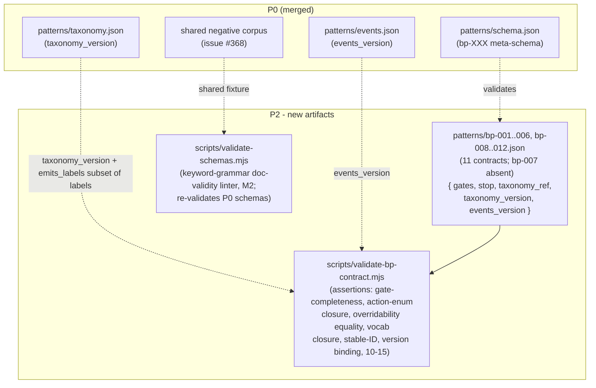

# P2 — BP contract instances + contract validators

> Part of [RFC-008](../RFC-008-decouple-enforcement-from-substrate.md). Index:
> [RFC-008/README.md](README.md).

**Status:** queued (parallelizable with P1 — both depend only on P0).
**Serves:** R2 (pluggable enforcement, episodic-memory dictates contract), R3, R4.
**Depends on:** P0 (met).
**Estimate:** ~35K.

## What P2 is

P2 ships the **contract DATA** (11 contracts — `bp-001..006`, `bp-008..012`; bp-007 absent) plus the validators that
enforce the §Validation-contract assertion checklist against it. This is where the
behavior-practice patterns become machine-readable contracts the thin waist (P3) reads.

## Architecture



## Ships

- `patterns/bp-001..006.json`, `patterns/bp-008..012.json` — 11 contract DATA files
  (**bp-007 absent**); each carries `taxonomy_version` + `events_version` bindings.
- `scripts/scaffold-bp.mjs` — derives the 11-id set from `patterns/_index.json` and emits
  contracts with live-computed hashes.
- `scripts/validate-bp-contract.mjs` — the full normative §Validation-contract assertion
  checklist: gate-completeness, action-enum closure, overridability equality, vocabulary
  closure, stable-ID integrity, version binding, events assertions 10–15.
- `scripts/validate-schemas.mjs` — keyword-grammar doc-validity linter (M2); re-validates
  P0 schemas. (F5 is owned by assertions 1 + 9 of `validate-bp-contract.mjs` plus this
  doc-validity linter — there is no separate `validate-taxonomy-schema.mjs`.)

## Contract shape

```json
{
  "gates": { "plan_approval": "...", "pre_checkpoint": "...", "post_checkpoint": "..." },
  "stop": { "tier": "..." },
  "taxonomy_ref": "patterns/taxonomy.json",
  "taxonomy_version": "sha256:…",
  "events_version": "sha256:…"
}
```

Three per-pattern classification gates; `stop` is a **root-level marker-state gate** (not
per-label, F2/F10).

## Implementation note — shared negative corpus (issue #368)

P2 lands the drift guard from P0's follow-up: the P0 linter
(`scripts/lib/mini-jsonschema.mjs`, promoted from `tests/lib/` in P2a with a re-export shim)
and P2's `scripts/validate-schemas.mjs` (the keyword-grammar doc-validity linter, M2 —
a zero-dep approximation of 2020-12 doc-validity, not published-meta-schema instance-validation)
**share one negative corpus** as a common conformance fixture, so the two hand-rolled
validators cannot drift (Rule 14). RFC line 1188.

## Done when ✓

Every `bp-XXX.json` validates against `patterns/schema.json` and passes
`validate-bp-contract.mjs` against the locked P0 schemas + golden corpus.

## Maps to

R2, R3, R4. Principle anchors: P2, P11.
