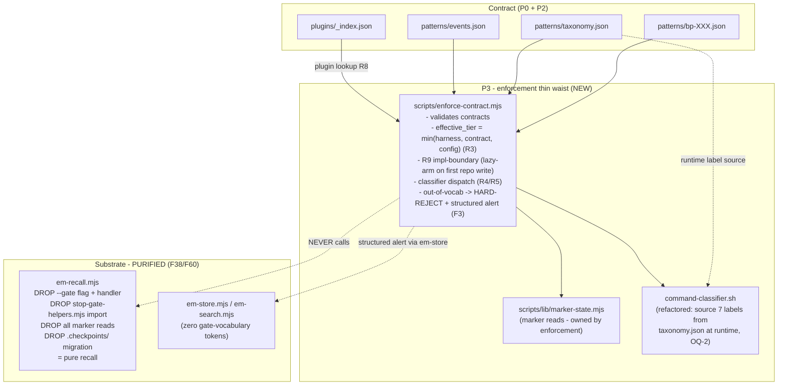

# P3 — Thin waist + classifier runtime-sourcing + em-recall purification

> Part of [RFC-008](../RFC-008-decouple-enforcement-from-substrate.md). Index:
> [RFC-008/README.md](README.md).

**Status:** queued.
**Serves:** R1, R2, R3, R4, R5, R9 (+ F38).
**Depends on:** P0 (met), P2.
**Estimate:** ~55K (the load-bearing phase).

## What P3 is

P3 is the **real decoupling**: it introduces `enforce-contract.mjs` (the thin waist that
owns the block/allow/warn/inject decision), gives the enforcement layer its own marker-state
reader, and — the negative-LOC payoff — **strips all gate logic out of `em-recall.mjs`**,
restoring the substrate to pure recall. After P3, `em-recall.mjs` is never on the
enforcement path.

## Architecture

## Ships

- `scripts/enforce-contract.mjs` — the thin waist. Validates contracts; computes the ternary
  `min()` effective tier (R3); R9 implementation-boundary detection (lazy-arm on first
  repo-source write, silent during exploration/planning); classifier dispatch (R4/R5); reads
  gate action from taxonomy + per-tier semantics from `events.json`; reads marker state via
  `marker-state.mjs`. **Two invocation modes** — in-process import for STRONG harnesses + CLI
  spawn for degrade. Out-of-vocab labels HARD-REJECTED with a structured alert via `em-store`
  (F3).
- `scripts/lib/marker-state.mjs` — marker reads, owned by the enforcement layer.
- **Classifier runtime-sourcing** (legacy "Phase 4", folded here): refactor
  `command-classifier.sh` to source the 7-label set from `taxonomy.json` at runtime (OQ-2
  closed); plugin classifier-override interface; override registration in `_index.json`;
  non-overridable labels enforced at scaffold + CI + runtime.
- **em-recall purification — STRICT DELETION (F38, F60):** remove from `em-recall.mjs` the
  `--gate` flag + handler, the `stop-gate-helpers.mjs` import, all marker reads, and the
  `.checkpoints/` migration code. *Net diff is negative LOC.*
- `install.mjs` deploys `lib/marker-state.mjs` + verifies em-recall is v11-purified (F45);
  `tests/test-install-em-recall-purified.mjs`.

## Done when ✓

`enforce-contract.mjs` passes contract validation + the **full 9-step gauntlet** against the
P1 plugins (this is where gauntlet steps 5/6 finally run); `em-recall.mjs` (and
`em-store.mjs` / `em-search.mjs`) contain **zero gate-vocabulary tokens** (F60 CI grep guard
green); the install-purification sentinel test passes.

## Maps to

R1, R2, R3, R4, R5, R9. Principle anchors: P4, P6.
