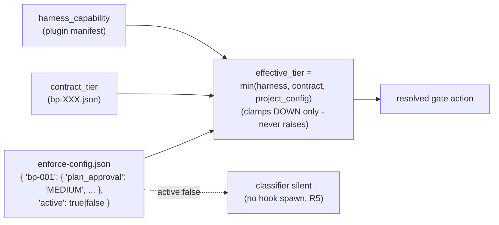

# P4 — Per-project `enforce-config.json`

> Part of [RFC-008](../RFC-008-decouple-enforcement-from-substrate.md). Index:
> [RFC-008/README.md](README.md).

**Status:** queued. *(Legacy "Phase 5".)*
**Serves:** R3, R5.
**Depends on:** P3.
**Estimate:** ~25K.

## What P4 is

P4 adds the **per-project tuning surface**: a single `enforce-config.json` that clamps
effective enforcement tier DOWN per project and can switch the classifier off entirely
(R5 — no hook spawn, no token cost when inactive).

## Architecture

## Ships

`enforce-config.json` per project — `{ "bp-001": { "plan_approval": "MEDIUM", ... },
"active": true/false }`.

## Done when ✓

The ternary `min()` clamps effective tier **DOWN only** (never raises); `active: false` for
all plugins makes the classifier silent (R5 — no hook spawn, no token cost).

## Maps to

R3, R5. Principle anchor: the project-config leg of the R3 effective-tier formula.
