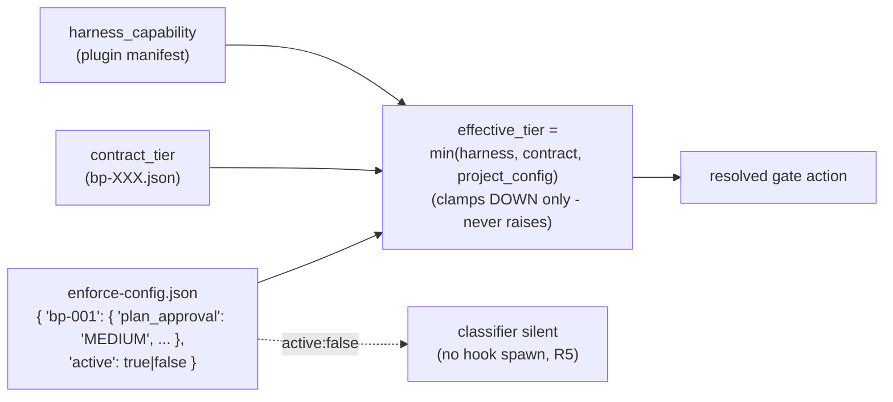

# P4 — Per-project `enforce-config.json`

> Part of [RFC-008](../RFC-008-decouple-enforcement-from-substrate.md). Index:
> [RFC-008/README.md](README.md).

**Status:** IN PROGRESS: schema landed P3b-2 #393; **P4a #397** (per-project loader, 3 pre_tool_use contract gates) + **P4c #398** (layer-wide `active:false` kill switch across preflight + second-opinion + SessionStart, R5) merged + deployed. **P4d** (per-project enforcement re-architecture, Principle 12) S1-S6 + ESC merged; S7-S8 open. Original P4b superseded by the P4d re-architecture. *(Legacy "Phase 5".)*
**Serves:** R3, R5.
**Depends on:** P3.
**Estimate:** ~25K.

## What P4 is

P4 adds the **per-project tuning surface**: a single `enforce-config.json` that clamps
effective enforcement tier DOWN per project and can switch the classifier off entirely
(R5 — no hook spawn, no token cost when inactive).

## Architecture

## Ships

`enforce-config.json` per project — `{ "bp-001": { "plan_approval": "MEDIUM", ... },
"active": true/false }`.

## Done when ✓

The ternary `min()` clamps effective tier **DOWN only** (never raises); `active: false` for
all plugins makes the classifier silent (R5 — no hook spawn, no token cost).

## Maps to

R3, R5. Principle anchor: the project-config leg of the R3 effective-tier formula.

## P4d: per-project enforcement re-architecture (Principle 12)

P4d decouples enforcement from the substrate: every enforcement artifact (gate `.sh`
hooks, the enforcement engine, the classifier, hook libs, the SessionEnd/SessionStart hook
scripts) installs under `<project>/.claude/` and registers only in
`<project>/.claude/settings.json`; the memory substrate stays global and hook-free. Each
project owns its own on/off switch (`<project>/.episodic-memory/enforce-config.json` `active`).

Slice status (phase index; full slice and PR detail live in the workplan episode):

| Slice | Concern | Status |
|---|---|---|
| S1-S4 | per-project install + scope + the 3 pre_tool_use gates | merged (#400 / #401 / #402) |
| ESC | gates block ONLY repo-source writes (R1-R3) | merged (#409) |
| S5 | `--uninstall-enforcement [--purge-config]` | merged (#416) |
| S6 | install seed matches `loadEnforceConfig` identity (coupling guard) | merged (#417) |
| S7 | this phase-index + Principle 12 docs refresh | in progress (closes #403) |
| S8 | the 3 P12 invariants as a required CI gate | open |
