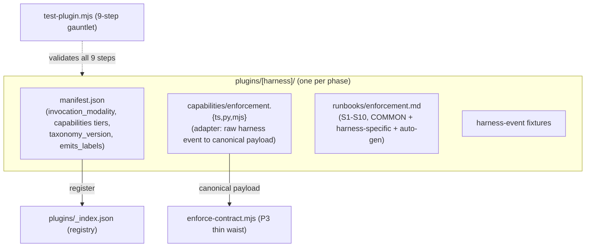

# P5–P7 — Per-tool plugins (OpenCode · Codex · Pi Agent)

> Part of [RFC-008](../RFC-008-decouple-enforcement-from-substrate.md). Index:
> [RFC-008/README.md](README.md).

**Status:** P5 **DONE** (OpenCode plugin #424 `f5dbaef`, doc fix #425 `a7f66c9`). **P6 DONE** (Codex plugin `plugins/codex/`, #431 `3b91f9b`). P7 queued. *(Legacy "Phase 6 / 7 / 8".)*
**Serves:** R6 (plugin-to-harness binding), R10 (enforcement runbooks).
**Depends on:** P3.
**Estimate:** P5 ~45K · P6 ~40K · P7 ~35K.

> These three phases are grouped here because they are the **same template instantiated
> three times** — each is a plugin directory built from the P1 scaffold + gauntlet at its
> own declared capability tiers. If a phase grows enough bespoke detail to warrant its own
> file, split it out then.

## What P5–P7 are

Each phase ships one harness plugin: `manifest.json` +
`capabilities/enforcement.{mjs,ts,py}` adapter + `runbooks/enforcement.md` (the 10 required
sections, R10) + harness-event fixtures. The universal `test-plugin.mjs` gauntlet (P1) is
the quality bar — no bespoke per-plugin test scripts.

## Architecture (shared shape)

## Ships (per phase)

| Phase | Dir | Language | Declared capabilities |
|-------|-----|----------|-----------------------|
| **P5** | `plugins/opencode/` | TypeScript | `pre_tool_use: STRONG, tool_result: MEDIUM` *(honesty downgrade, see note)*`, session_start: MEDIUM, stop: MEDIUM` |
| **P6** | `plugins/codex/` | node command hooks | `pre_tool_use: MEDIUM` *(mechanism STRONG; Bash-write lexing residual caps the tier — KB codex-hooks.md)*, `stop: STRONG, session_start: STRONG` |
| **P7** | `plugins/pi-agent/` | `tool_call` + `session_shutdown`/`turn_end` | `pre_tool_use: STRONG, stop: MEDIUM, session_start: STRONG` |

**Honesty note (P5 principle):** Codex `pre_tool_use` is declared **MEDIUM** (mechanism STRONG).
The empirical probe (codex 0.142.3, `memory/knowledge_base/codex-hooks.md`) blocked apply_patch + all
6 shell forms with no bypass reproduced, so the MECHANISM is STRONG and the prior multi-edit-bypass
rationale is refuted; the tier stays MEDIUM because the Bash-write lexing residual (unlexable forms
outside the bounded MUST-CATCH extractor scope) is a real known bypass (bypass_known MEDIUM ceiling,
not clean-audit). stop/session_start deferred (schema/binding gap).

**Honesty note (OpenCode `tool_result`):** declared **MEDIUM**, not STRONG. The installed
`tool.execute.after` hook output (`output.output`) IS mutable, so result rewrite is mechanically
possible — but that the OpenCode model actually re-reads the mutated output has not been
end-to-end proven, so MEDIUM (observe) is the honest ceiling pending that proof (P5 OD-1, round-1
B1). The adapter therefore observes `tool_result` without mutating. `bypass_known.json` records
the same rationale.

## Done when ✓

Each plugin passes the `test-plugin.mjs` 9-step gauntlet at its declared tiers.

## Maps to

R6, R10. Principle anchors: P9, P11 (binding); P4 (runbooks).
