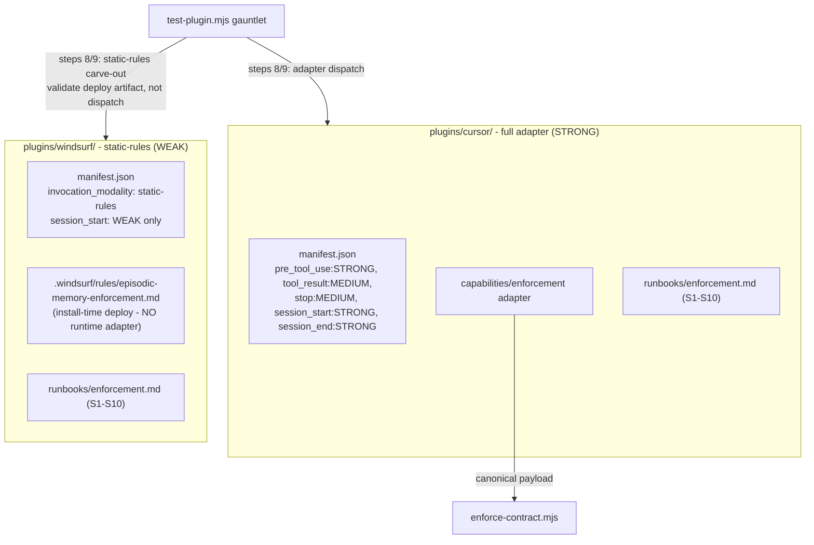

# P8 — Cursor (full adapter) + Windsurf (static-rules) plugins

> Part of [RFC-008](../RFC-008-decouple-enforcement-from-substrate.md). Index:
> [RFC-008/README.md](README.md).

**Status:** queued. *(Added per F43 / OQ-3 closure, v11.1.)*
**Serves:** R6, R10.
**Depends on:** P3.
**Estimate:** ~45K.

## What P8 is

P8 adds the two harnesses that don't fit the P5–P7 mold: **Cursor** is STRONG-capable (a
full adapter, *not* WEAK — the v8–v11 matrix had this wrong; corrected from official-doc
research), and **Windsurf** is WEAK static-rules only — no runtime adapter, just an
install-time rules artifact. Windsurf is the reason gauntlet steps 8/9 carry a
`static-rules` carve-out.

## Architecture

## Ships

- **`plugins/cursor/`** — full adapter (Cursor is STRONG-capable; see
  §Capability-degradable enforcement): `pre_tool_use: STRONG, tool_result: MEDIUM,
  stop: MEDIUM, session_start: STRONG, session_end: STRONG`.
- **`plugins/windsurf/`** — static-rules (WEAK): installer +
  `.windsurf/rules/episodic-memory-enforcement.md` + `runbooks/enforcement.md` + manifest
  declaring `session_start: WEAK` only; **NO runtime adapter**.

## Static-rules carve-out (F56)

For `invocation_modality == "static-rules"` there is no adapter to dispatch through, so the
gauntlet branches on modality rather than failing the plugin:

- **Step 8** asserts the declared `event_translations[<event>].source_format` is a recognized
  static-deploy descriptor (e.g. `"windsurf-rules-deploy"`) with empty `field_bindings`, and
  that the §10a `install_time_config` artifact is generated/placed as declared.
- **Step 9** asserts install-time rule-file generation lands at the declared path —
  `dispatch_examples` are deploy assertions, not adapter round-trips.

## Capability research provenance (F59)

Cursor + Windsurf capability matrices are backed by committed research at
`memory/knowledge_base/cursor-hooks.md` and `memory/knowledge_base/windsurf-rules.md`
(`fetched: 2026-05-28` + source URLs). `em-rfc-validate.mjs` asserts every cited
knowledge_base file exists on disk. Re-validate the live matrices against vendor docs before
implementation lands.

## Done when ✓

Cursor passes the full gauntlet; Windsurf passes the static-rules gauntlet carve-out
(steps 8/9 validate the deploy artifact, not adapter dispatch — F56).

## Maps to

R6, R10.
