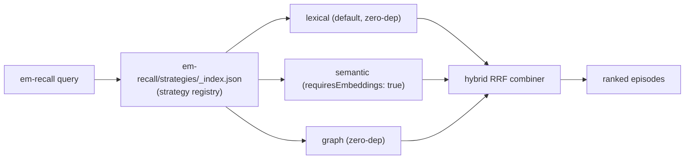

# P9 — Pluggable recall strategies

> Part of [RFC-008](../RFC-008-decouple-enforcement-from-substrate.md). Index:
> [RFC-008/README.md](README.md).

**Status:** **DEFERRED — carved to its own RFC.** Not implemented under RFC-008.
**Serves:** R7.
**Depends on:** — (no deps within this RFC).
**Estimate:** ~50K (when carved out).

## What P9 is — and why it's deferred

P9 is the only **feature** phase (everything else is the substrate↔enforcement
re-architecture). It would make `em-recall`'s ranking strategy pluggable: lexical (default,
zero-dep), semantic (opt-in, `requiresEmbeddings: true`), graph (zero-dep), and a hybrid RRF
combiner.

It is **deferred to its own RFC** because:

- Recall strategies are **substrate-side, not enforcement** — out of this RFC's scope.
- The semantic strategy's **embedding dependency conflicts with the zero-dep principle**, a
  trade-off that must be decided deliberately rather than smuggled into a re-architecture PR.

## Architecture (sketch — for the future RFC)

## Would ship (when carved out)

`em-recall/strategies/` (lexical default zero-dep; semantic opt-in `requiresEmbeddings:
true`; graph zero-dep; hybrid RRF) + `em-recall/strategies/_index.json`.

## Destination

Semantic embeddings fold into **RFC-001 — Intelligent Memory** (`accepted`); graph traversal
folds into **RFC-007 — Graph Projection** (`draft`). See the RFC
[Related RFCs](../RFC-008-decouple-enforcement-from-substrate.md#related-rfcs) section.

The recall-ACTIVATION half of this slot (wiring em-recall to session start, trigger-bearing
lessons, bounded advisory injection) is carved to **RFC-009 — Lesson Activation** (`draft`,
2026-07-04). The pluggable strategy REGISTRY sketched above remains deferred to
RFC-001/RFC-007.

## Maps to

R7. Principle anchors: P6, P1.
