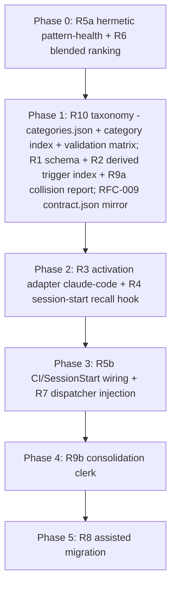

# RFC-009 — Lesson Activation: Trigger-Bearing Lessons, Derived Trigger Index, and Bounded Advisory Recall

## AI context

> This RFC makes stored lessons fire at the moment they are relevant: it adds optional activation fields to lesson episodes (triggers, applies_to, priority, expiry), a derived trigger index built by the substrate, and a per-project opt-in advisory hook that matches prompts against that index, plus it wires the already-built relevance recall (em-recall) and pattern-health check into real activation points, and pairs the amplified capture loop with an assisted lexical consolidation clerk (R9) so duplicate and related lessons are compacted instead of accumulating as recurring context bloat. It solves the measured reuse failure: lessons are captured richly but 55 percent of active global lessons (99 of 180) and 83 percent of local lessons have never been accessed, because the only automated surfacing is a recency-sorted top-10 at session start. The key design decision is a hard two-layer split: the substrate owns lesson data and the derived index (enforcement-free, Principle 1 / CAPABILITIES.md), while activation hooks are per-project opt-in enforcement-layer artifacts (Principle 12), and all injection is advisory and token-bounded (Principle 6). Activation also forces a taxonomy correction the substrate has needed independently (R10): category becomes the schema-backed closed routing and lifecycle axis (with a derived category index and drift handling), and tags become purely descriptive semantic signals that are never load-bearing — runtime behavior simulation on 2026-07-05 showed the two axes conflated (workplan routing riding on a tag, category enforcement asymmetric across write paths, lifecycle category-blind).

---

## Problem

The capture half of the learning loop works; the activation half leaks. Evidence gathered 2026-07-04, adversarially reviewed by codex (round 1 HOLD with 10 findings, round 2 ACCEPT; provenance: local milestone episode `20260704-055544-rfc-009-lesson-activation-drafted-status-1cf3` names the review artifacts).

1. **Lessons are written but not read.** Counting rows with `category == "lesson"` in `~/.episodic-memory/index.jsonl` and `<repo>/.episodic-memory/index.jsonl` (reproduce: one `node -e` pass over each file counting `access_count === 0` and `last_accessed`, filtered by `status`): all rows including superseded: 206 global lessons, 125 (61 percent) never accessed. Active-only denominator: 180 global lessons, 99 (55 percent) never accessed. Local store: 65 active lessons, 54 (83 percent) never accessed; the newest local lesson access is 2026-05-03. Measured 2026-07-04; the store moves, the ratio is the finding.
2. **The relevance engine is not activated.** `em-recall.mjs` implements multi-pass relevance ranking (project, tag, recency) and a task-type violation preflight, but no automated hook surfaces its output: `plugins/claude-code/hooks/em-recall-sessionstart.sh:12-15` documents that the recall body is discarded (issue #61). Instruction files direct agents to run it manually (`instructions/SKILL.md:37-43`).
3. **The one automated lesson surface is pure recency.** `plugins/claude-code/hooks/session-handoff-prompt.sh:197` loads lessons with `--no-score --limit 10`: the ten most recent, regardless of relevance, access history, or project match.
4. **No moment-of-relevance activation exists.** Nothing matches a user prompt or tool action against stored lessons. The de facto working mechanism is outside the substrate entirely: a hand-curated trigger-phrase table and feedback files in the operator's Claude auto-memory MEMORY.md, which is single-tool and hand-maintained. Artifact for the size failure mode: the 2026-07-04 SessionStart load emitted "WARNING: MEMORY.md is 24.8KB (limit: 24.4KB) ... Only part of it was loaded."
5. **Recorded signals go unused.** `last_accessed` is written by every search and read by nothing. `em-pattern-health.mjs --check` implements the 3-strikes needs-enforcement detector and is documented as a CI / SessionStart gate (`docs/USER_MANUAL.md:711-724`), but no workflow or hook runs it.
6. **A lesson episode is freeform.** No schema field says when a lesson applies, to which projects or tools, at what priority, or until when. A lesson's only activation surface is a human (or agent) happening to search for it.

What this RFC does NOT claim: that the loop never closed. Repeated bp-001 violations did motivate checkpoint-gate.sh (RFC-002 Phase 3b). That promotion was hand-designed and exercised once; the gap is that activation and promotion signals are not consumed mechanically.

---

## Proposal

Two layers with a hard boundary, per CAPABILITIES.md (learning/recall capabilities are substrate-side and enforcement-free) and Principle 12 (hooks are per-project enforcement artifacts).

Orthogonal to the layer split is a TIMING split — two planes, with the derived trigger index (R2) as the contract between them:

- **Aggregation plane (clerks — the memory aggregator).** The expensive curation: index build (R2), consolidation and enrichment (R9), migration (R8). Runs lifecycle-gated or on-demand, NEVER per-event and never on a timer (P6). Work here MAY be agentic (an LLM clerk aggregating and classifying memory) because it runs rarely; all its writes flow through the assisted `em-store`/`em-revise` path, and it registers no hooks and decides nothing (CAPABILITIES.md: recall/learning strategies use memory, they never enforce).
- **Event plane (hooks).** Per-project, opt-in, per the harness's declared capability tier (R3 tier table, P5; manifest in the RFC-008 R8 typed registry). Fires on UserPromptSubmit and tool events, and is MECHANICAL and cheap by contract: reads ONLY the derived indexes, never episode bodies, never invokes a model, always exits 0 with no decision field. Its writes are exactly two, both mechanical: the append-only, size-bounded telemetry line of R6 (fire-and-forget, never blocking, never fatal), and the **derived-index refresh carve-out** — when a consumer read finds a derived index stale (R2 lazy freshness), the event plane MAY perform the rebuild itself, because the rebuild is deterministic, model-free, reads only index.jsonl fields, and lands via atomic temp+rename. Index refresh is data plumbing, not aggregation-plane curation; without this carve-out R2's freshness contract and the plane boundary would contradict each other.

Clerks make the index smart; hooks make it fast. Model invocations per user prompt or per tool call are ruled out by construction, and enforcement cannot leak into the substrate because the only artifact crossing the boundary is data (the index), not behavior.

**The two-plane contract is NON-NEGOTIABLE within this RFC.** Implementations may improve either plane freely, but three moves are out of bounds without revising this RFC first (the PRINCIPLES.md revision rule: revised with rationale, never silently overridden): moving a model invocation into the event plane; giving the aggregation plane a hook registration or a decision channel; replacing the derived indexes as the sole artifacts crossing the boundary. The mechanical index-refresh carve-out above is part of the contract's definition, not an exception to it (it moves no model, no decision, and no non-derived write into the event plane); it applies identically to every derived index this RFC names (trigger index R2, category index R10c). The clerk's mandate is exactly three verbs — AGGREGATE, ENRICH, MANAGE memories — and never a fourth: it does not enforce, gate, block, or decide. Every clerk action is audited (R9 run-record episodes) and every clerk write is assisted-confirmed and revision-chained, so the clerk's influence on future injection is inspectable and reversible end to end.

### R1 — Lesson activation schema (substrate, data-only)

Extend lesson episode frontmatter with OPTIONAL fields; freeform lessons remain valid. The serialized shape is FLAT single-level keys with inline arrays, chosen because the existing rebuild parser handles only simple `^\w+:` keys and inline arrays (`scripts/em-rebuild-index.mjs:42-60`); no nested/dotted keys, so store, index, and rebuild round-trip with no parser change:

- `triggers: [second opinion, tool:Bash:git push\*, activity:plan]` — THREE trigger kinds: lowercase literal phrases, tool-target patterns, and activity classes (work modes; grammar and matching in R3). An `activity:<class>` value with a class outside the closed vocabulary is rejected at write time. All items serialized as UNQUOTED inline-array items (the rebuild parser splits on commas and trims without quote-stripping, `scripts/em-rebuild-index.mjs:51-58`; quoting would embed quote characters in the round-trip). Validation therefore REJECTS phrases containing `,`, `[`, `]`, or `"` at write time (error names the offending character); items are comma-separated, whitespace-trimmed. Lexical only in this RFC; no embeddings (zero-dep, Principle 6; semantic matching stays in RFC-001/RFC-007 territory). Matching semantics are closed in R3.
- `applies_to_projects: [episodic-memory, \*]` — project slugs or `\*`. A lesson with neither list matching never fires anywhere.
- `applies_to_tools: [claude-code, codex]` — tool ids from the fixed vocabulary (claude-code, codex, opencode, pi-agent, cursor, windsurf), each with an honest capability tier (Principle 5) per the R3 tier table.

The unquoted-inline-array serialization rule and its character restrictions (`,` `[` `]` `"` rejected at write time) apply to EVERY inline-array field this RFC introduces — `triggers`, `applies_to_projects`, `applies_to_tools`, `evidence`, the violation-side `lessons`, and R9's `consolidates` — as one class, so the round-trip guarantee holds for all of them with zero parser change.
- `priority: 5` — integer 1-7, agent-assigned at write time, default 5 when omitted; ordering key for bounded injection (R3 selects top-K by EFFECTIVE priority descending, then recency). The critical band 8-9 CANNOT be declared by any writer — it is EARNED mechanically, because criticality assignment must not become a human curation duty (Principle 4) and a declarable band inflates (every lesson feels critical to the agent that just got burned). Effective priority is computed at R2 build time from linked violation evidence: one linked violation escalates the entry to 8, two or more to 9; three or more is already the pattern-health needs-enforcement threshold (R5 / RFC-002), so declared priority, earned salience, and enforcement promotion form one gradient. Validation rejects non-integer values or values outside 1-7 at write time; the error explains the earned band.
- Violation linkage (the escalation signal, both directions, union-deduped at R2 build): `em-violation.mjs` gains a repeatable `--lesson <episode-id>` flag forward-linking a new violation to the lesson(s) whose surfacing failed (indexed as inline-array field `lessons`); `em-store`/`em-revise` gain a repeatable `--evidence <violation-episode-id>` flag back-linking a lesson to PRE-EXISTING violations (indexed as inline-array field `evidence`; needed by R8 migration, where the corpus's documented catches already exist as episodes). BOTH directions validate symmetrically at write time — `--evidence` requires an existing `category: violation` episode, `--lesson` requires an existing `category: lesson` episode (asymmetric validation across linkage directions is the forge path into the earned band; every linkage surface that feeds the band carries the same existence + category check, present and future). Relatedness cannot be proven mechanically, so gaming is made VISIBLE instead: the R9 clerk report surfaces every lesson that entered the earned band since the prior run, with its linked violations, for operator audit. The human never assigns a number in either direction. Boundary note (RFC-008 R1): the linkage and its consumption are DATA end to end — record (store), link (store), count (derive at R2 build), render louder (advisory wording, R3) — and no path acquires a gate, marker, or decision; where violation counts eventually meet real enforcement (pattern-health's needs-enforcement verdict gating a CI job, R5b; gate promotion, third arc) the acting artifact lives in the per-project enforcement layer, with the substrate only ever reporting.
- `review_by: 2026-12-31` — past-due lessons drop from the derived trigger index (they remain searchable episodes).
- Suppression: a per-project mute list (`<project>/.episodic-memory/lesson-suppress.json`) consulted by the activation layer, not stored in the episode. Contract: schema-backed (see Data-artifact contracts); a missing file means no suppression; a malformed file is ignored whole with one stderr note per event (fail-open — suppression is an advisory-layer convenience, and a broken mute list must never make injection fatal). Suppression applies to ALL bands including earned 8-9: it is the project owner's scope call ("this lesson does not apply HERE"), which is exactly what the earned band cannot know; content-wrong lessons are corrected by supersession (R2), not by mute.

Write surface: `em-store.mjs` and `em-revise.mjs` gain repeatable flags `--trigger <phrase>`, `--applies-to-project <slug>`, `--applies-to-tool <id>`, plus `--priority <int>` and `--review-by <YYYY-MM-DD>`, valid only with `--category lesson` (error otherwise). Validation failure behavior: the write is REJECTED with a message listing the offending field and the accepted shape (mirroring em-violation's unknown-pattern error style); no partial writes. Both index.jsonl records and `em-rebuild-index.mjs` carry the new fields; a store-then-rebuild round-trip preserving all five fields is an acceptance test.

### R2 — Derived trigger index (substrate, enforcement-free)

A new substrate script `em-trigger-index.mjs` builds ONE derived index PER STORE — `~/.episodic-memory/trigger-index.json` (global) and `<project>/.episodic-memory/trigger-index.json` (local) — from lesson episodes carrying `triggers`. Contract:

- Target-store binding (normative for EVERY new script this RFC introduces): stores resolve exactly like every existing em-* script — repo-root walk from `cwd` via `resolveLocalDir`, with an explicit `--project <root>` override — and any process that invokes the script on another project's behalf sets `cwd` to that project's root or passes `--project`. Fixture: an invocation whose caller cwd is OUTSIDE the target project (including a linked git worktree) writes the index under the TARGET's `.episodic-memory/`, asserted by file location on disk, not by output counters.
- Shape: `{ "schema_version": 1, "source": {"index_mtime_ms": N, "index_size": N, "index_sha256": "..."}, "entries": [{"phrase"|"tool_pattern", "episode_id", "summary", "effective_priority", "applies_to_projects", "applies_to_tools", "review_by"}] }`. The entry field is named `effective_priority`, never `priority`: the stored frontmatter field (declared 1-7) and the derived band (1-9) are different values with different writers, and one name for both is how consumers confuse them. Expired (`review_by` past) lessons are excluded at build time, and ONLY `status: active` lessons participate: superseded/retired lessons drop from the index, so correcting a wrong lesson via `em-revise` supersession stops the old version firing at the next activation event (the correction path for user-determined-wrong lessons; per-project suppression is for scope errors, not content errors).
- Build: lazy at first use; cache valid while `source.index_mtime_ms` + `index_size` + `index_sha256` all match the store's index.jsonl, and the fingerprint is computed FROM THE BYTES THE BUILD READ (stat, read, re-stat; on stat mismatch re-read once), closing both the TOCTOU window and the same-size same-mtime rewrite case that mtime granularity alone cannot see (codex round-2 preference: lazy build keeps the write path simple and substrate-pure). Freshness follows from the cache check running at every consumer read: a mid-session `em-store` changes index.jsonl's mtime/size, so the trigger index rebuilds at the NEXT activation event, not the next session — a lesson captured from a live incident participates in matching within the same session.
- Merge: consumers read BOTH indexes and dedupe by episode id with LOCAL precedence, mirroring em-search's local-priority dedup. (Resolves OQ-1: per-store files, read-time merge.)
- Effective priority (the R1 earned band, computed here): the build counts violation rows linked to each lesson (violation-side `lessons` array union lesson-side `evidence` array, deduped by violation id) and writes the entry's `effective_priority` — stored 1-7 with zero linked violations, 8 with one, 9 with two or more. Linkage is resolved through supersession chains in BOTH directions before counting: a violation whose `lessons` entry names a since-revised lesson counts toward that lesson's ACTIVE terminal revision, and a lesson whose `evidence` names a since-revised violation follows the chain to the violation's active terminal. Routine `em-revise` of either side therefore never silently demotes the band; what stops a violation counting is RETRACTION (its chain terminates in a non-violation or retracted episode) or the referencing lesson leaving active status. The same chain resolution feeds consolidation: R9's `evidence = union` merge rule carries the band across a merge. Stored frontmatter is never mutated; escalation is derived, index-only, and recomputed every build.
- Write: atomic temp+rename (repo convention). Malformed or unreadable index: rebuild once; if still malformed, the consumer proceeds with the other store's index and reports on stderr (never blocks).
- No hook registration, no gate logic (RFC-008 R1 boundary).

### R3 — Advisory activation adapter (per-project opt-in, full install contract)

A new ADAPTER CLASS, `activation`, registered as an additive plugin type in `plugins/_index.json` (RFC-008 R8 versioned-registry MINOR bump; a complete contract per the CAPABILITIES.md forward rule: registry sub-schema, manifest schema, runtime IO schema, conformance gauntlet). It is hook-shaped and therefore installs per-project by the P12 function test, but it is ADVISORY, never gating: its manifest declares `blocking: false` and the conformance gauntlet asserts exit 0 + no decision field on every path.

Install contract (P3, P10, P12): explicit opt-in flag `install.mjs --install-activation`; manifest declares side effects (hook file under `<project>/.claude/hooks/`, one `UserPromptSubmit` registration in `<project>/.claude/settings.json`, ownership ids + checksums); `--uninstall-activation` removes exactly the owned set; round-trip invariant tested like `test-uninstall-enforcement.mjs`. Never global (P12).

Runtime: on UserPromptSubmit, match the prompt against the merged trigger index (R2) and emit ADVISORY additionalContext: matched lesson ids + one-line summaries, never full bodies. Hard bounds (Principle 6): `max_matches` (default 3, top-K by `effective_priority` then recency) and `max_tokens` (default ~500). The hook reads only the derived index, never lesson bodies.

Matching spec (closed; fixtures required):
- Case-fold prompt and phrase; phrase matches on word boundaries (negative lookaround on `[\w-]`, the em-pattern-health regex convention); no substring-inside-word hits.
- `tool:` triggers use the grammar `tool:<ToolName>:<glob>` where `<glob>` supports `*` only; literal `:` or `*` in a phrase is escaped with `\`. `tool:` triggers are matched by tool-event adapters (below), not against prompt text.
- `activity:` triggers use the grammar `activity:<class>` with a CLOSED class vocabulary defined as data (Principle 2): a substrate JSON definition file maps each class to a maintained phrase/pattern set, and a prompt matches `activity:<class>` when it matches that class's set. Launch classes: `plan`, `design`, `review`, `troubleshoot`, `implement`, `push`, `rule`. The class vocabulary is a schema-backed, versioned data artifact like every closed vocabulary this RFC touches (Data-artifact contracts; members retire via `deprecated_for`, never deletion). The em-recall task-type mapping is normative: `implementation` → `implement`, `push` → `push`, `rule` → `rule`, and `general` maps to NO class (it means unclassified; no lesson may target it), so the RFC-002 violation preflight and activation share one classification. A trigger naming a class that is unknown or deprecated in the current vocabulary is excluded at R2 build time and counted in the build report (the drift surface), never silently matched or fatal. Two reasons this kind exists: (1) activity classes are SHARED phrase bundles — without them every discipline lesson duplicates the same "plan/design/rfc/architecture..." phrase list and the copies drift; (2) they express the lesson class that must fire when a WORK MODE begins, independent of topic wording ("when planning or reviewing in this repo, read PRINCIPLES.md and CAPABILITIES.md first"). Governing artifacts are not episodes; their consultation is expressed as activity-triggered POINTER lessons whose bodies direct the read. Empirical motivator, recorded 2026-07-05: the R1 priority-assigner design for this very RFC was discussed without consulting PRINCIPLES.md P4, and prior codex review dispatches shipped without principles/capabilities grounding requirements — an activity-class miss that no phrase trigger would have caught.
- Dedupe: one entry per episode id per event; identical phrases across stores collapse with local precedence (R2).
- Truncation: each summary line is capped; a single entry that would exceed `max_tokens` is dropped, not truncated mid-line.
- Malformed trigger entries are skipped and counted on stderr, never fatal.

Rendering contract (advisory phrasing is load-bearing; fixture-tested):
- Effective priority 8-9 (the earned critical band, R1/R2) renders as an imperative read directive naming the TRACKED read command: `READ <episode_id> before proceeding (em-search --history <episode_id> --full): 
`. Pointer injection only works if the agent follows the pointer; for critical lessons the injected line instructs the read explicitly instead of listing passively, and it names the tracked command because direct file opens and `--no-track` searches never touch access tracking and would be invisible to the R6 conversion metric. Because the band is earned (validated linked violations only, R1) and every band entry is audit-surfaced by the clerk, the imperative form's inflation resistance is enforced-and-audited, not assumed.
- Effective priority 7 and below renders as a plain listing: `lesson <episode_id>: 
`.
- Both forms count against the same `max_matches` / `max_tokens` bounds; the rendering contract changes wording, never volume, and emits no decision field (advisory invariant unchanged).
- Guard-type critical lessons (the "never do X at the tool moment" class) SHOULD carry both a phrase trigger and a `tool:` trigger on the same lesson, so the prompt moment and the tool moment are each covered; the schema (R1) already permits mixed trigger kinds on one lesson.

Per-tool tier table (Principle 5, honest): claude-code STRONG (UserPromptSubmit exists); codex and pi-agent MEDIUM (hook/extension surfaces exist, per-event mapping in their plugin dirs); cursor MEDIUM-TBD (hooks per KB probe); opencode MEDIUM (plugin events); windsurf WEAK (file-rules only: session-start surfacing, no per-prompt matching). Tiers recorded in each adapter manifest.

### R4 — Wire relevance recall at session start (closes #61) — NOT via the enforcement path

A separate NON-enforcement SessionStart context hook, shipped by the R3 activation adapter as a sibling settings entry, runs `em-recall` and surfaces its stdout as SessionStart additionalContext, token-bounded (same caps as R3), with a TWO-TIER selection order:

1. **Critical band first, deterministically.** Every effective-priority 8-9 lesson whose `applies_to` matches the project/tool loads at every session start, before any ranked content — this is the landing surface for R8 tier-(b) always-tier toolkit content, whose documented violation history places it in the earned band, and it removes the failure mode where "always-tier" silently degrades to "usually-ranked-high." If the critical band alone would exceed the token bound, entries load in priority-then-recency order and the overflow count is noted in the injected context (never silent truncation). Band GROWTH is governed, not open-ended: R8 deliberately back-links documented catches, so post-migration the band can hold dozens of entries, and a band larger than the session-start budget recreates the always-tier rotation failure R4 exists to remove. The governor is the clerk (aggregation plane, no new OQ): every R9 report lists band members whose linked violations are ALL superseded or older than the R6 staleness window as demotion-review candidates; the operator demotes by superseding the stale violation episodes (retraction through the normal revision chain, which the R2 chain-resolved count picks up at the next build) or keeps them with that decision recorded in the run record. Demotion is thus evidence-driven and human-confirmed, symmetric with how the band is earned.
2. **Blended top-N for the remainder:** relevance-ranked episodes plus the task-type violation preflight fill the remaining budget. Explicitly NOT a change to `em-recall-sessionstart.sh`: that hook is the enforcement path (`enforce-contract --session-start`) and RFC-008 removed `em-recall` from it deliberately (`RFC-008-decouple-enforcement-from-substrate.md`, P3d relocation; the hook's own header documents this). `em-recall.mjs` stays pure recall; the activation hook only surfaces its output. (Resolves OQ-4: sibling hook in the activation adapter; the enforcement hook is untouched.)

Additionally, the session-handoff lesson load drops `--no-score` in favor of a blended ranking (recency + relevance + access_count staleness, R6).

### R5 — Pattern-health activation, P12-clean (implements the documented integration)

Two steps, strictly ordered.

(a) Add `--hermetic` to `em-pattern-health.mjs`: reads ONLY `<project>/.episodic-memory/` (episodes + local patterns registry, falling back to the repo's `patterns/_index.json` for pattern definitions) and detects enforcement ONLY in project surfaces: `<project>/.claude/hooks/`, `<project>/.git/hooks/`, `<project>/.github/workflows/`. Zero `$HOME` reads under `--hermetic` (the existing `~/.claude/hooks` scan is P12-legacy and excluded; it remains available without the flag for interactive use). Same JSON output shape and exit-code contract (`--check` exits 1 on needs-attention/needs-enforcement). Acceptance test: run under an isolated empty `HOME` fixture and assert identical output to a populated `HOME`, proving no `$HOME` dependence.

(b) Only then wire `--hermetic --check` into a CI job and a one-line SessionStart advisory on exit 1 (advisory emitted by the R3/R4 activation adapter, not the enforcement hook). `docs/USER_MANUAL.md:711-724` already documents this integration; this ships it.

### R6 — Disposition last_accessed + measure activation conversion

Use `last_accessed`: fold its staleness into the blended ranking (R4) and into `em-prune` scoring, or stop writing it. Decision recorded here: use it in ranking.

Prune SCORING stays unchanged, but this RFC's linkages make the current score (age + access count, `em-prune.mjs:55-62`; zero-access episodes prunable at ~310 days) unsafe without a PROTECTION SET — mechanical, no human step (P4), extending the existing deliberate superseded-episodes-kept-for-provenance policy:

- **Never prunable while load-bearing:** (a) violation episodes referenced by any ACTIVE lesson's evidence linkage (either direction, R1) — pruning one silently demotes the lesson out of the earned band at the next R2 build; (b) ACTIVE trigger-bearing lessons — injection reads only the derived index and never bumps `access_count`, so a lesson in weekly active service is indistinguishable from a dead one by the current score; (c) members referenced by a `consolidates` array (provenance, same rationale as the existing superseded policy). Protection lapses naturally when the referencing lesson is superseded, expires, or is itself archived.
- **Run records are prunable** once their suppression content is carried forward: each new clerk run record carries the cumulative rejected-proposal set, so only the LATEST run record per store is load-bearing and older ones age out under the normal score.
- **Conversion data feeds pruning through the clerk, not the score:** persistent zero-conversion lessons surface in R9 reports as reword/demote/suppress candidates first — pruning knowledge because injection failed is the wrong first response to injection failing.

Additionally, R6 closes the measurement loop on this RFC's central bet — that advisory pointer injection converts stored lessons into read lessons. Without measurement, the 55 percent never-accessed finding cannot be re-run meaningfully after activation ships.

- **Telemetry (event plane).** Each injection event appends ONE line to a per-project, append-only, size-bounded log (`<project>/.episodic-memory/activation-log.jsonl`): event timestamp, injected episode ids, each entry's effective priority and rendered form (imperative or plain). Fire-and-forget: a failed log write is a stderr note, never a hook failure. Bound ownership and compaction are explicit so append-only is never breached: AT the size bound the HOOK drops the new line with a stderr note (dropping preserves append-only; truncating would not, and telemetry loss is acceptable by contract); the CLERK compacts by rotate-and-consume — atomically rename the log to a processing name, read and delete it — so compaction never rewrites a file that concurrent O_APPEND appends are landing in (appends after the rename land in a fresh log). Single-line appends rely on small-write O_APPEND atomicity; where that is weak (network filesystems), torn lines are tolerated: the clerk skips unparseable lines and counts the skips in its run record. This log is telemetry, not memory — working data the clerk consumes, not a second knowledge store (P1).
- **Conversion metric (aggregation plane).** The clerk computes conversion — injected episode ids subsequently accessed (per `last_accessed`/`access_count` deltas in index.jsonl) within the same session by default (window tunable) — per lesson and per band (imperative vs plain), records the numbers in its run-record episode, and prunes consumed telemetry lines. Attribution is honest-approximate (an access after injection is correlation, not proof of causation), and the DENOMINATOR's blind spots are stated per P5: `em-search --no-track` and `--include-superseded` skip access tracking entirely (`scripts/em-search.mjs:316-318`, and the repo's own recipes use `--no-track` pervasively), and a direct file read of the episode .md never touches tracking at all. This is why the R3 imperative rendering names the tracked command: it routes the read through the one surface the metric can see. Conversion is therefore a LOWER BOUND on real reads; the metric is directional, and stated as such — in particular, low conversion justifies clerk review (reword/demote/suppress candidates), and only imperative-band low conversion feeds the needs-enforcement judgment, both of which tolerate undercounting in the safe direction.
- **Consumers.** (1) The blended ranking already folds access staleness. (2) R9 clerk reports flag persistent zero-conversion lessons as rewording / demotion / suppression candidates — an injected-but-never-read lesson is failing at its whole job. (3) For the earned critical band specifically: low conversion on IMPERATIVE renderings is evidence that advisory surfacing has failed for that lesson, which is exactly the input the pattern-health needs-enforcement judgment (R5) and the promotion arc (out of scope, third arc) need to justify a gate. The gradient completes: declared priority → earned salience → measured conversion → enforcement promotion, each step evidence-fed.

### R7 — Dispatcher-side lesson injection for second-opinion reviews

Replace the manual reviewer-side lesson searches mandated by `scripts/second-opinion/preambles/fragments/review-ladder-v9.4.md:8-14` with dispatcher-side bounded injection: `second-opinion.mjs` queries the trigger index and relevance recall for the review scope and prepends matched lesson summaries (same bounds as R3), so review discipline stops depending on the reviewer obeying the preamble. Every dispatch additionally queries `activity:review` (R1/R3), so repo-level review-discipline pointer lessons — ground findings in PRINCIPLES.md / CAPABILITIES.md / the RFC's R-numbers — inject into every codex/subagent dispatch mechanically instead of depending on the operator or dispatching agent remembering them (the recorded 2026-07-05 miss).

### R8 — Migration path for the out-of-substrate feedback corpus

Provide a documented, assisted path (not automatic) to migrate operator MEMORY.md trigger-phrase entries and feedback files into global lesson episodes carrying `triggers` + `applies_to`. Conditions (codex finding 8): every migrated lesson populates `applies_to`; activation remains per-project/per-tool opt-in; a global lesson with no `applies_to` match never fires.

The migration classifies each corpus entry into one of three destination tiers before drafting the lesson (the operator's corpus mixes all three, and mis-tiering silently changes when a lesson fires):

- **(a) Trigger-phrase-table rows** (lazy-tier "when phrase X, load file Y") → R1 `triggers` phrase entries; fires per-prompt via R3.
- **(b) Always-tier session-start files** (loaded every session regardless of prompt content) → the R4 session-start surface's DETERMINISTIC critical-band tier, NOT `triggers`; no phrase reliably matches every prompt, so tiering these as triggers would demote always-on guidance to sometimes-on. Their documented violation history back-links via `--evidence` at migration, which is what places them in the earned band R4 loads unconditionally.
- **(c) Tool-moment guards** ("never `--approve` from the bot account" class) → `tool:` triggers, paired with phrase triggers per the R3 rendering contract. Where the source file documents prior catches (most guard files cite violation episode ids in their empirical sections), the migration back-links them via `--evidence`, so the lesson enters the earned critical band carrying its real history rather than a declared number.

The assisted flow records the assigned tier per migrated entry so the operator can audit the classification before confirming any store. Relational metadata in the source corpus ("Composes with" sections, `[[links]]`) is preserved as body prose — searchable, not structural; structural edges are RFC-007 territory.

**(d) Source retirement (closes the double-injection loop).** A migrated entry that keeps living in the source corpus injects twice forever: once via the legacy session-start load of the operator's MEMORY.md/feedback files, once via R4's critical band or R3's triggers. Once R6 telemetry shows a migrated lesson firing, the assisted flow proposes retiring the source entry (annotating or removing the MEMORY.md row / feedback file), operator-confirmed per entry like every other step. Migration is not complete for an entry until its source is retired or the operator has recorded keep-both with a reason.

### R9 — Consolidation clerk (assisted, lexical, compaction of the lesson corpus)

Activation makes redundancy expensive: a duplicate lesson used to sit unread, but under R3 it co-fires and crowds the bounded top-K with redundant entries, and R8 imports an entire operator corpus in one pass. The cost is paid in context tokens: every injection surface this RFC creates (R3 per-prompt, R4 session-start, R7 dispatcher preambles) has a fixed token budget, so each redundant entry displaces a distinct lesson inside that budget AND adds recurring context bloat across every session that matches it. A loop that raises capture volume without a compaction mechanism therefore degrades its own injection quality over time; the problem statement already contains the terminal state (item 4: the MEMORY.md corpus exceeded its size limit and was truncated at load). R9 is the counterweight, in two halves:

**(a) Preventive — write-time trigger-collision report (ships with Phase 1).** On any `em-store`/`em-revise` that writes a trigger-bearing lesson, report existing ACTIVE lessons sharing any of the new lesson's trigger phrases (read from the R2 index): ids + one-line summaries on stderr, informational only, the write always proceeds. This puts the add-vs-revise decision in front of the author at the only moment it is cheap.

**(b) Curative — `em-consolidate.mjs` (substrate, data-only, enforcement-free).** Charter position (CAPABILITIES.md): this is the LEARNING-STRATEGY family's first shipped implementation — it reads episodes and derived indexes and writes consolidated knowledge back as episodes via `em-store`, exactly the family-3 contract; it is opt-in (on-demand invocation, no hooks), enforcement-free (RFC-008 R1), and introduces no new plugin TYPE (the `learning` type already exists in the charter, so no R8 registry bump is required for R9). Detection is LEXICAL + signal-driven only; semantic/embedding clustering stays RFC-001 Phase 4 / RFC-007 (that deferral is about SYNTHESIS — deriving new lessons from raw episode clusters — and about embedding dependencies; neither applies to lexical compaction of existing lessons):

- Candidate signals: shared trigger phrases (R2 index); tag-set overlap (Jaccard, default threshold 0.5, with high-frequency tags downweighted — generic process tags like `reusable` dominate raw Jaccard, and revision-chain tag accumulation inflates set sizes asymmetrically; tags are one weak signal among several per the R10 tags contract, never the deciding one); case-folded summary token overlap within the same category; supersession-adjacency (multiple active lessons revising around the same root).
- Report mode (default): JSON cluster report — members (ids + summaries), the signals that grouped them, proposed action per cluster: `merge`, `dedupe`, or `keep-distinct`. Nothing is written.
- Apply mode is human-confirmed per cluster (mirrors R8's assisted flow; nothing auto-stored) and runs under `em-lock` — a confirmed merge is a multi-episode write (one consolidated store + N member supersessions) that must not interleave with a concurrent apply. A confirmed merge stores ONE consolidated lesson and marks each member superseded: the consolidated episode carries a new inline-array field `consolidates: [<member ids>]` (same unquoted-serialization class as the R1 fields); each member gets `status: superseded` + `superseded_by: <consolidated id>`. The existing single-valued `supersedes` field and `em-revise` chain semantics are untouched — many-to-one lives on the new field, so history walks keep working.
- Write order is normative (crash-safe by construction): (1) the consolidated lesson is stored FIRST; (2) member supersessions; (3) the run record last. A crash after (1) leaves a benign duplicate that the collision signals re-surface next run; a crash during (2) is detected at the next clerk start (members whose `superseded_by` names an episode with no completing run record) and reported for confirmation. Members are never superseded before their successor exists on disk, so consolidation cannot lose knowledge at any crash point. A crashed apply's lock is reclaimed under em-lock's existing stale-holder contract.
- Target-store binding (same clause as R2, restated because the clerk shells out): `em-consolidate.mjs` binds its store via cwd/`--project` like every em-* script, and EVERY subprocess it spawns (`em-store`, `em-revise`, `em-lock`) runs with `cwd` set to the target project root. Fixture: an apply invoked from a caller cwd outside the target project (including a linked git worktree) lands the consolidated episode, the supersessions, and the run record under the TARGET's `.episodic-memory/`, asserted by file location on disk.
- Merge rules: `triggers` = union (deduped); `applies_to_*` = union; `priority` = max of members' STORED values (the earned band is not merged, it is re-derived); `evidence` = union (deduped; with R2's chain-resolved counting this carries the earned band across a merge — consolidation must never strip earned criticality); `review_by` = latest of members or unset; `tags` = clerk-proposed curated set describing the consolidated body (default: union of members; the clerk MAY propose dropping generic or stale tags per the R10 tags contract), confirmed per cluster like every other proposal. Conservative direction: a merge never loses activation surface.
- Cadence: on-demand, plus a one-line advisory (via the R3/R4 adapter, never a gate) when the R2 build observes more than K entries sharing one phrase or the active-lesson count crosses N (defaults an OQ, tuned against the real store).

**Clerk audit trail (APPLY mode only — report mode writes nothing).** Report mode's output is its JSON report; the store stays byte-identical (this is the property that makes the clerk safe to run anywhere, and the acceptance test pins it). Every APPLY invocation writes ONE run-record episode to the store it operated on — per P7 (state changes are episodes) and P1 (no second store: no separate audit log file). Run-record shape contract: `category: workflow.lifecycle` with typed frontmatter `record_type: clerk-run` (a simple scalar key the existing rebuild parser carries; NOT a tag, because tags are never load-bearing, R10) — this is how em-prune's latest-run-record protection (R6) and later clerk runs LOCATE run records mechanically. The run record carries: mode, timestamp, source index fingerprint, proposals emitted, per-item outcomes (`confirmed` / `rejected` / `deferred` — rejection decisions exist only in apply's per-item confirmation, so apply is where they are recorded), the exact episode ids written or superseded, the lessons that entered the earned band since the prior run (the R1 escalation audit), and the CUMULATIVE rejected-proposal set carried forward from prior run records. Two consumers: (1) audit — every clerk influence on the corpus is inspectable after the fact and, via the revision chains it references, reversible; (2) re-proposal suppression — later runs consult the cumulative rejected set so a rejected merge or keep-distinct decision is not re-proposed (the operator's judgment persists as memory, same as everything else in this system); only the latest record per store is load-bearing and older ones age out under normal pruning (R6).

**(c) Enrichment — activation-field backfill for the existing corpus.** Problem item 6's flip side: the lessons already in the substrate (180 active global at measurement) carry no activation fields, and no other R gives them any — R8 covers only the out-of-substrate corpus. The clerk proposes activation fields per existing lesson: candidate `triggers` (extracted lexically from summary and tag lexemes), `applies_to_*` (from the episode's project and tool provenance), and `activity:` classes. The zero-dep core generates candidates lexically; an agentic aggregator MAY generate richer candidates as an opt-in recall/learning-strategy plugin (aggregation-plane work per the two-plane contract; algorithm belongs to RFC-001), but ALL candidates — lexical or agentic — flow through the same assisted per-item confirmation before any store, and the event plane is unaffected by which generator produced them (it reads only the index). Applied backfill writes via `em-revise` so the revision chain records the enrichment.

**(d) Clerk agent contract — the concrete system prompt.** Any AGENTIC clerk (Claude Code subagent, codex, pi — the prompt is harness-agnostic text, P11) runs under a system prompt shipped as versioned DATA with the clerk (P2; e.g. `scripts/em-consolidate/prompts/clerk.md`), never improvised per session. The shipped prompt MUST carry every clause below; the text is normative:

> You are the memory clerk for the episodic-memory substrate. You work on the AGGREGATION plane. Your mandate is exactly three verbs: AGGREGATE, ENRICH, and MANAGE memory episodes. You never enforce, gate, block, or decide workflow — those belong to a different layer that you do not touch.
>
> You PROPOSE; a human confirms. Nothing you output is applied without per-item confirmation. You have no write tools; your report is your only output, and writes happen in the assisted apply step outside you.
>
> Inputs: the store's index.jsonl rows (episode bodies on request), the derived trigger index, prior clerk run-record episodes, and the activation telemetry summary.
>
> Rules:
> 1. Ground every proposal in cited artifacts — episode ids, index fields, telemetry counts. A proposal without citations is invalid and will be discarded.
> 2. Never fabricate or stretch evidence links. An `--evidence` linkage may reference only a violation episode that exists AND describes the same failure the lesson addresses. When unsure, omit the link.
> 3. Prefer `keep-distinct` over `merge` when intent might differ: a wrong merge destroys knowledge, a kept duplicate only costs tokens. Give a one-or-two-line rationale per cluster either way.
> 4. Never widen scope: proposed `applies_to_*` values come only from the episode's own project and tool provenance, never from your judgment of where the lesson "should" apply.
> 5. Respect recorded human judgment: consult prior run-record episodes and do not re-propose a cluster or backfill that was rejected against an unchanged store.
> 6. Output ONLY the report JSON (the R9 report schema). No prose outside it. Every item carries: proposal, action, citations, rationale, confidence.
> 7. Do not ask the operator questions. Propose with defaults and mark low-confidence items `deferred` — the only cognitive load the operator carries is confirm/reject (Principle 4).
> 8. Surface, in every report: (a) each lesson that ENTERED the earned critical band since the prior run record, with its linked violations (the escalation audit); (b) each band member whose linked violations are all superseded or stale, as a demotion-review candidate; (c) each episode whose stored category is unknown or deprecated in the current vocabulary, with a recategorization proposal (the R10 drift queue).

Conformance: the acceptance gauntlet asserts the shipped prompt file exists and contains the load-bearing clauses (mandate verbs, never-enforce, propose-only, citation rule, no-fabricated-evidence, keep-distinct bias, no-questions), and schema-validates a sample clerk report; prompt changes ship via PR like any other data-definition change.

### R10 — Memory taxonomy: category vs tags (substrate, schema-backed)

Activation forces a correction the substrate has needed independently: episodes carry two orthogonal descriptor axes that are conflated today. **Category** is the closed routing and lifecycle vocabulary — what an episode IS and how the substrate treats it mechanically. **Tags** are an open descriptive vocabulary — what an episode RELATES TO, consumed as relevance evidence. Runtime behavior simulation (2026-07-05, evidence appendix below) showed the conflation live: workplan routing rides on a tag because no `workplan` category exists; the category vocabulary is enforced four inconsistent ways across write and read paths; lifecycle is category-blind; and `violated:bp-*` linkage rides on tags. R2/R3 need to know what an episode is (category, mechanical, event-plane-safe) separately from what it relates to (tags, semantic, clerk territory), so the disentanglement is in-scope here, not deferrable.

**(a) Tags: descriptive semantics only (normative).**

- **T1 — Open vocabulary, normalized, honest.** Tags accept any string, normalized at write (trim, lowercase, dedupe, sort — the existing behavior). There is no tag validation and no integrity guarantee, and the substrate says so (P5): anything requiring validation or integrity belongs in category, `triggers`, or a typed field, never in a tag.
- **T2 — The load-bearing invariant.** A tag is never load-bearing: no correctness property, routing decision, lifecycle transition, activation behavior, or enforcement behavior may depend on the presence, absence, or value of a tag.
- **T3 — Mechanical consumers are lexical.** `em-search --tag` and `em-restore --tag` remain exact-match lexical selection over the inverted index, documented as operator conveniences, not contracts. `em-recall` consumes tag overlap as a ranking signal (its existing 0.7-weight pass), never a hard gate. After the T6 migration, no mechanical script branches on a specific tag value.
- **T4 — Semantic interpretation is aggregation-plane only.** Agentic consumers (the R9 clerk, R9c enrichment, future recall-strategy plugins per CAPABILITIES) MAY interpret tags semantically: clustering signal (downweighted Jaccard, R9), trigger-candidate raw material (R9c), curation targets. The event plane never reads tag semantics; it reads only the derived indexes.
- **T5 — Revision and consolidation.** `em-revise` keeps its mechanical inherit-union (zero-dep, no interpretation, P6); accumulated tag drift is expected and is the clerk's curation problem — consolidation's `tags` merge rule (R9) and enrichment proposals (R9c) are where curation happens, human-confirmed. Runtime anchor: two routine revisions grew a fixture lesson's tag set from 2 to 6; a live canonical-prompt episode carries ~50 accumulated tags.
- **T6 — Migration of existing load-bearing tag conventions**, each with dual-read burn-in: `workplan` becomes `category: workplan` (the workplan-discovery recipe flips after burn-in); `violated:bp-*` linkage moves to the typed violation-linkage fields this RFC introduces (R1), with `em-recall`'s tag-membership preflight check retargeted to the typed field; operator lookup conventions (`agent-prompt`, `canonical-prompt`) are demoted to documented descriptive recipes — nothing mechanical branches on them, so they may remain as search habits.
- **T7 — The tag index is unchanged infrastructure.** `tags.json` stays a derived lexical index, append-only between rebuilds; staleness is tolerated and self-heals on rebuild; a confirmed consolidation apply is followed by a rebuild.

**(b) Category: schema-backed closed vocabulary (`categories.json`).** The vocabulary moves out of script source (today it is HARDCODED twice — `scripts/em-store.mjs:81` and em-restore's duplicate list, pinned in sync only by a test) into a versioned substrate data artifact validated by its own JSON Schema in CI (P2; the `patterns/taxonomy.json` + `taxonomy.schema.json` precedent). Each entry carries `name`, `description`, and `lifecycle` (`standard` | `aggregate-then-prune` | future members). New members at launch: `workplan` (routing home for the T6 migration) and `temporary` (transient working episodes: review threads, scratch context). Members are never deleted: a rename or removal sets `deprecated_for: <successor>`, and readers and index builds map deprecated names to their successor at read time — the vocabulary-level mirror of P7's revision chains, so stored episodes stay interpretable forever without rewriting their files. The vocabulary is GLOBAL, versioned, and changes by PR only (decided, not open: a locally-invented category stops meaning anything when an episode crosses stores or is backed up and restored elsewhere; per-project extension is rejected).

**(c) Per-surface validation matrix (normative — this replaces today's accidental four-way behavior):**

| Surface | Behavior |
|---|---|
| `em-store` / `em-revise` write | strict against current vocabulary (deprecated names rejected with the successor named) |
| `em-restore` write | strict against vocabulary INCLUDING deprecated names (older-vocab backups must restore); an unknown-to-any-version category gets the existing skip-and-surface treatment, never a silent write (today restore writes ANY category through — runtime-verified asymmetry with em-store) |
| `em-search` / `em-list` / `em-recall` read | tolerant, always: an unknown category never bricks recall (runtime-verified current behavior, kept deliberately) |
| R2 / R10c index build | tolerant plus counting: unknown and deprecated categories are indexed (deprecated under their successor) and counted in the build report — the drift surface |

**(d) Derived category index (`category-index.json`).** Category earns the same derived-index treatment tags have: per store, `{ "<canonical category>": ["<episode id>", ...] }`, built by `em-rebuild-index` (atomic temp+rename), incrementally updated by `em-store`/`em-revise`, same append-only-between-rebuilds staleness tolerance, same missing/corrupt fallback contract as `tags.json` (linear scan plus a rebuild warning, never fatal). Keys are canonical names (deprecated mapped at build; unknown indexed under their literal name AND counted — the index doubles as the drift detector's data structure). Consumers: `em-search --category` (with fallback), the clerk's temporary-class sweep, `em-prune`'s per-category policy; `em-restore` merges it on apply or triggers a rebuild (implementation's choice, pinned by a test). Event-plane readable under the same mechanical-refresh carve-out as the trigger index.

**(e) Temporary lifecycle: aggregate then prune.** `temporary`-category episodes are clerk-consolidation inputs (R9 generalized beyond lesson dedup: review threads and similar transients consolidate into durable knowledge episodes, P1/P7). `em-prune` reads per-category `lifecycle` policy from `categories.json` (never hardcoded names): `aggregate-then-prune` members become aggressively prunable ONLY once a consolidated successor exists (`superseded_by` set by a confirmed R9 apply); un-consolidated temporary episodes age under the standard score, and the R6 protection set applies unchanged (the consolidated successor is protected, the consumed members are not).

**(f) Drift handling: detection is mechanical, correction is agentic.** Detection: the index builds' unknown/deprecated counts plus `em-rebuild-index --check` listing each drifted episode (id + stored category). Correction: never automatic — the R9 clerk proposes recategorizations (drift queue, clerk prompt rule 8c), confirmed per item, applied via `em-revise` so the chain records who changed the taxonomy and why (P7). Semantic drift (valid but wrong category — a workplan stored as `decision` out of habit) is the same clerk proposal surface, honestly labeled advisory (P5: the substrate cannot prove intent). The existing corpus migrates through exactly this flow (one backfill-style assisted run covers the workplan-tagged decisions and review-thread contexts).

### Data-artifact contracts (completeness table — every data artifact this RFC touches)

Per the CAPABILITIES forward rule ("supported means schema-validated and test-covered, not merely present"), every data artifact carries the full contract: schema+validator, versioning+deprecation, all writers with validation symmetry, drift ownership, derived lookup, size bound owner, tests. Deferred issue #448 (writer-side index validation) is the index.jsonl row's open cell, linked rather than re-litigated.

| Artifact | Contract |
|---|---|
| `categories.json` (new) | schema-backed + CI-validated; versioned with `deprecated_for`; written by PR only; drift N/A (it IS the reference); consumed by store/revise/restore/prune/index builds; tests in R10 block |
| activity-class vocabulary (R3) | SAME contract as categories.json: schema-backed, versioned, `deprecated_for` retirement; R2 build excludes+counts unknown/deprecated classes |
| `category-index.json` (new) | shape above; writers: rebuild + store/revise incremental + restore merge; staleness self-heals; drift counts live here; tests in R10 block |
| `tags.json` | deliberately shapeless values (T1: open vocabulary, no integrity guarantee — stated, not silent); writers: store/revise incremental, rebuild, restore merge; append-only between rebuilds; unbounded key growth accepted (token cost noted) |
| `index.jsonl` | writers: store/revise/rebuild/restore/hand-written; validation symmetry is issue **#448** (open, linked); empirical anchor: hand-written episode crashed a consumer (#447); rebuild is the repair path |
| `trigger-index.json` (R2) | shape versioned (`schema_version`); fingerprint = mtime+size+sha256 (TOCTOU-closed); derived, restore staleness self-heals; event-plane refresh carve-out |
| `activation-log.jsonl` (R6) | telemetry, loss-OK; bound owner = hook (drop+stderr), compaction = clerk rotate-and-consume; torn lines skipped+counted |
| `lesson-suppress.json` (R1) | schema-backed; written by operator hand-edit; missing = no suppression, malformed = ignored whole + one stderr note (fail-open, advisory layer) |
| run-record episodes (R9) | `category: workflow.lifecycle` + typed `record_type: clerk-run` scalar (never a tag, T2); located mechanically by that field; latest-per-store protected (R6), older prunable |
| `archived-index.jsonl` (existing) | unchanged; relied on by R6 protection reasoning; read-merge-write append semantics as shipped |
| RFC-009 `contract.json` + mirror validator | implementation-phase deliverable following the RFC-004 precedent (`validate-rfc-contract-mirror.mjs` is RFC-004-specific): a `RFC-009-lesson-activation.contract.json` mirroring the shipped surfaces (vocab members, index shapes, validation matrix) diffed against code in CI; ships with Phase 1 |

### Runtime evidence appendix (2026-07-05 behavior simulation)

The taxonomy findings above are runtime-observed, not inferred (fixture store + probe runners in the session scratchpad; each claim had command output):

1. `--category decision` returned a workplan fixture and an unrelated API decision together; only `--tag workplan` isolated the workplan (routing rides on a tag).
2. Two routine `em-revise` calls grew a lesson's tag set 2 → 6 (union inheritance); a live canonical-prompt episode carries ~50 accumulated tags.
3. `em-prune --dry-run` scored decision, active lesson, superseded members, and review-thread context identically (0.999) — lifecycle is category-blind.
4. `em-store --category workplan` exits 1 (closed vocab enforced at the front door); `em-restore --apply` wrote the same category through without complaint and `em-search`/`em-list` then filtered and rendered it fine; `em-restore --category workplan` as a FILTER was refused by restore's duplicated hardcoded list. Four surfaces, four behaviors, one axis.
5. `em-backup --audit` planned an out-of-vocab-category store for mirroring wholesale (content-agnostic mirror confirmed) while redacting a planted token — backup is not a vocabulary surface.

### Substrate script coverage (disposition per em-* script)

Design-completeness check against the full substrate surface (the mental model: principles + capabilities + EVERY existing em-* script). All 21 scripts dispositioned; "interacts" rows carry normative content:

| Script | Disposition |
|---|---|
| `em-store` | CHANGED — R1 activation flags, R9a collision report; R10 category vocabulary read from `categories.json` (hardcoded list retired), category-index incremental update |
| `em-revise` | CHANGED — R1 flags; the R2 correction path; clerk backfill/merge/recategorization writes route through it; R10 vocabulary from data, category-index update |
| `em-violation` | CHANGED — R1 `--lesson` linkage flag with write-time validation (existence + `category: lesson`) |
| `em-rebuild-index` | CHANGED — carries the new inline-array fields (zero parser change, asserted by round-trip tests); builds the THIRD derived index (`category-index.json`, R10d) with deprecated-name mapping and unknown-category drift counts; `--check` lists drifted episodes |
| `em-recall` | CHANGED — R4 two-tier session-start selection, blended ranking; activity vocabulary shared with its task types; the `violated:bp-*` tag-membership preflight retargets to the typed linkage field (T6); tags stay ranking evidence only (T3) |
| `em-pattern-health` | CHANGED — R5 `--hermetic` |
| `em-prune` | CHANGED — R6 protection set; R10e per-category lifecycle policy read from `categories.json` (aggregate-then-prune applies only to members with a consolidated successor); locates run records by `record_type`, never by tag |
| `em-search` | CHANGED — `--history` walk gains `consolidates`/`superseded_by` (today it follows only single-valued `supersedes`, `scripts/em-search.mjs:175-203`; the R9 acceptance test is unimplementable without this); `--category` routes through `category-index.json` with the tags.json-style fallback; access tracking remains the R6 conversion denominator (blind spots stated in R6) |
| `em-lock` | INTERACTS — clerk APPLY mode runs under `em-lock` (a confirmed merge is a multi-episode write: one store + N supersessions; concurrent applies must not interleave; crashed-apply locks reclaim under the stale-holder contract). The R2/R10c index builds need NO lock: atomic temp+rename, idempotent, last-writer-wins and SELF-HEALING (racing builds may serialize different source states; the next read's freshness check repairs staleness). R6 telemetry appends are single-line `O_APPEND`, no lock |
| `em-backup` | INTERACTS — content-agnostic redacting mirror (runtime-verified: `--audit` plans an out-of-vocab-category store wholesale; redaction engine independent), so the new artifacts ride along. Declared semantics: `lesson-suppress.json` is operator KNOWLEDGE and must survive restore; `trigger-index.json`/`category-index.json` are DERIVED (staleness self-heals); `activation-log.jsonl` is TELEMETRY (loss acceptable) |
| `em-restore` | CHANGED — its `--category` filter hard-codes a duplicate of em-store's list today (runtime-verified refusal of new members): reads `categories.json` instead, accepting deprecated names; restore-WRITE gains vocabulary validation (today it writes any category through, runtime-verified — the asymmetric write path); chain expansion gains `consolidates`/`superseded_by` (same class as em-search's walk); merges or rebuilds `category-index.json` on apply |
| `em-mine-transcripts` | INTERACTS — aggregation-plane sibling: its cold-storage discipline (stages candidates, never auto-stores) is the same propose-confirm contract as R8/R9; mined lessons acquire activation fields via R9c enrichment after storage |
| `em-session-end-prompt` | INTERACTS — session end is a sanctioned lifecycle nudge point for the R9 cadence advisory (P6: lifecycle-gated, never timers) |
| `em-list` | UNCHANGED — new index fields and categories pass through (runtime-verified: renders unknown categories); no contract change |
| `em-check-stale` | UNCHANGED — research-URL staleness; `review_by` is the analogous lesson-side concept, no interaction |
| `em-audit-compliance` | UNCHANGED — transcript rule-skip rates; a future cross-check for R6 conversion, out of scope here |
| `em-seed-patterns` | UNCHANGED |
| `em-review-request` / `em-watch-codex` | UNCHANGED — R7 injection lives in the dispatcher (`second-opinion.mjs`); the episode-channel scripts are untouched |
| `em-rfc-validate` | UNCHANGED as a script, but its scope is stated honestly: it is a REGISTRY-consistency check (index/README/canonical-file parity), not a content validator — this draft passes it, which asserts registry consistency only. Content-level contract enforcement is the RFC-009 contract-mirror deliverable (Data-artifact contracts) |
| `em-workflow-validate` | UNCHANGED |

### Scope

- **In scope:** R1-R10 above; Claude Code as the first activation adapter; WEAK-tier documentation for tools without prompt hooks; lexical compaction of the lesson corpus (R9); the memory taxonomy correction with schema-backed category vocabulary, category index, and drift handling (R10).
- **Out of scope:** semantic/embedding or graph matching (RFC-001 Phase 4 algorithms, RFC-007) — including semantic clustering as a consolidation signal; pluggable recall strategy registry (the original RFC-008 P9 sketch; folds into RFC-001/RFC-007); the SYNTHESIS clerk that derives NEW lessons from clusters of raw episodes (RFC-001 Phase 4, next arc — distinct from R9's compaction of existing lessons); the promotion clerk that drafts new guards from needs-enforcement verdicts, RFC-002 Phase 4 counters, and Phase 3c clerk-model capture (third arc); any blocking behavior by the activation hook.

---

## Alternatives considered

| Alternative | Why rejected |
|---|---|
| Inject full lesson bodies at match time | Token blowup violates Principle 6; pointers + summaries let the agent pull bodies on demand |
| Semantic (embedding) trigger matching | Dependency conflicts with the zero-dep substrate; deliberate trade-off deferred to RFC-001/RFC-007 (same reasoning that deferred RFC-008 P9) |
| Activation hook inside the substrate (em-store/em-search register hooks) | Violates the CAPABILITIES.md boundary and RFC-008 R1: capabilities use memory, they never enforce or hook |
| Keep the MEMORY.md trigger table as the mechanism | Single-tool, hand-curated, already over its size limit and truncated; not portable to codex/opencode/pi/cursor/windsurf |
| Blocking activation (lesson match gates the tool call) | Lessons are advisory knowledge; enforcement is behavior patterns' job (bp-XXX + gates). Blocking would re-couple what RFC-008 decoupled |
| Automatic migration of MEMORY.md corpus | Operator-owned prose with mixed scopes; assisted clerk-style migration keeps the human as judge |
| Maintain trigger index incrementally on every em-store write | Adds write-path coupling for freshness nobody needs mid-session; lazy build with mtime/hash cache is simpler and P6-friendly (codex r2 preference) |
| Defer ALL consolidation to RFC-001 Phase 4 | Activation without compaction degrades its own injection quality: duplicates co-fire, displace distinct lessons inside the R3/R4/R7 token bounds, and add recurring context bloat; R8 imports a whole corpus in one pass. Lexical compaction needs no embeddings, so the zero-dep reason to defer applies only to semantic clustering and synthesis, which stay deferred |
| Fully automatic consolidation (no per-cluster confirmation) | Merging rewrites operator knowledge; a wrong merge silently destroys distinct lessons. Assisted flow keeps the human as judge (same reasoning as R8's assisted migration) |
| Declared or operator-curated critical band (writer sets 8-9, or human gatekeeps it) | Writer-declared inflates (the agent that just got burned rates everything critical) and operator curation shifts a standing cognitive-load duty onto the human (Principle 4). The earned band keeps the human's only act the natural one — catching the mistake — which the agent records as a violation episode anyway; the linkage makes that existing record the escalation signal |
| Separate audit log file for clerk actions | P1: no second store — episodes are the only data layer, and P7 already makes state changes episodes. A log file is a parallel store that can drift from the episode log; run-record episodes give audit + re-proposal suppression in one mechanism |
| Keep routing conventions in tags (status quo: `workplan`, `violated:bp-*`) | Runtime-verified conflation (R10 evidence appendix): routing-by-tag makes an open, unvalidated, accumulating vocabulary load-bearing; category exists precisely for routing and lifecycle, and the T2 invariant is unenforceable while contracts hide in tags |
| Per-project category vocabulary extensions | A locally-invented category stops meaning anything when an episode crosses stores or is backed up and restored elsewhere; the vocabulary is global, versioned, and changes by PR (decided in R10b, not an OQ) |
| Automatic recategorization of drifted episodes | The substrate cannot prove intent (P5); silent taxonomy rewrites are the same class as silent merges. Drift detection is mechanical, correction is clerk-proposed and human-confirmed via revision chains (P7) |
| Tags-as-identifiers with a reserved-tag list (keep some contract tags) | Two semantics under one field is the original defect; a reserved list institutionalizes it and every consumer must know the split. One axis per concern: contracts in category/typed fields, description in tags |

---

## Implementation plan

> Populate fully when the RFC moves to `accepted`. Anticipated sequencing:

R9b lands BEFORE R8: the bulk import runs against a store that already has collision reporting and a working consolidation path, so migration cannot pile a second corpus onto an uncompacted first one.

**Documentation deliverable (every phase, normative).** The repo `README.md`, `docs/EM_SCRIPTS_GUIDE.md`, the per-harness instruction files (`instructions/SKILL.md`, `cursor.mdc`, `AGENTS.md`, `windsurf.md`), and the `docs/install/` guides are updated in the SAME PR that ships each capability — cross-harness consumers (Cursor, Codex, Windsurf, pi) learn the substrate exclusively from these files, so a shipped-but-undocumented flag, script, or artifact is undelivered. Every new flag (`--trigger`, `--evidence`, `--lesson`, `--priority`, `--review-by`, `--project`), every new script (`em-trigger-index`, `em-consolidate`), every new artifact (`categories.json`, `category-index.json`, `trigger-index.json`, `activation-log.jsonl`, `lesson-suppress.json`), and the R10 category/tags semantics appear in the guide in the phase that ships them. Acceptance per phase: the conformance gauntlet greps the guide for the phase's new surfaces and fails on any missing one (docs drift is CI-caught, not review-caught).

---

## Acceptance tests (draft skeleton — expanded per phase at `accepted`)

**R1 schema:**
- [ ] `em-store --category lesson --trigger ... --applies-to-project ... --applies-to-tool ... --priority ... --review-by ...` writes all five fields; store → `em-rebuild-index` round-trip preserves them byte-equal in index.jsonl (ALL three array fields serialized unquoted; fixture includes a multi-word phrase and a multi-item applies_to list)
- [ ] Any item in any of the three array fields containing `,`, `[`, `]`, or `"` is rejected at write time naming the field and offending character
- [ ] Activation flags with any non-lesson category are rejected with a field-naming error; no partial write
- [ ] Malformed values (non-int priority, priority outside 1-7 — including an attempted `--priority 8`/`9`, rejected with the earned-band explanation — bad date, unknown tool id) rejected listing the accepted shape; omitted priority defaults to 5 in the index record
- [ ] `--evidence <id>` referencing a missing or non-violation episode is rejected naming the requirement; a valid violation id round-trips in the `evidence` inline array
- [ ] `em-violation --lesson <episode-id>` referencing a missing or non-lesson episode is rejected naming the requirement (validation symmetric with `--evidence`); a valid lesson id writes the `lessons` inline array and round-trips through `em-rebuild-index`
- [ ] Suppression file contract: missing `lesson-suppress.json` yields no suppression; a malformed file is ignored whole with one stderr note and injection proceeds; a valid entry mutes an effective-priority-9 lesson (suppression applies to all bands)
- [ ] Freeform lessons without activation fields still store, index, and rebuild unchanged

**R2 trigger index:**
- [ ] Lazy build produces per-store `trigger-index.json` with `schema_version`, source mtime/size; second call with unchanged source is a cache hit (no rewrite)
- [ ] Source index change invalidates the cache; expired `review_by` entries excluded at build
- [ ] Mid-session store: an `em-store --category lesson --trigger ...` followed by a consumer read rebuilds the index and the new lesson matches in the SAME session (freshness contract, R2)
- [ ] Correction path: `em-revise` superseding a trigger-bearing lesson removes the superseded entry from the index at next rebuild; the superseding lesson's triggers fire instead; a superseded-but-still-indexed entry is a test failure
- [ ] Effective-priority escalation: a lesson with zero linked violations indexes at its stored priority (entry field named `effective_priority`); one linked violation (either linkage direction) → 8; two → 9; forward `lessons` and back `evidence` links to the SAME violation dedupe to one; stored frontmatter byte-unchanged throughout
- [ ] Chain-resolved linkage: revising the LESSON keeps its violations counting toward the active terminal (band survives routine revision); revising the VIOLATION follows the chain to its terminal and still counts; a RETRACTED violation (chain terminates non-violation) stops counting; a consolidated lesson (R9 `evidence` union) carries the members' band
- [ ] Fingerprint: a same-size same-mtime rewrite of index.jsonl (planted content change within mtime granularity) invalidates the cache via `index_sha256`; second call with truly unchanged source is a cache hit
- [ ] Target-store binding: a build invoked with caller cwd OUTSIDE the target project (linked-worktree fixture included) writes `trigger-index.json` under the TARGET's `.episodic-memory/`, asserted on disk
- [ ] Merge dedupes by episode id with local precedence; malformed index falls back (rebuild once, then skip store with stderr note), never blocks

**R3 activation adapter:**
- [ ] Conformance gauntlet: every code path exits 0 and emits no decision field (advisory-only, never blocks)
- [ ] Bounds: never more than `max_matches` entries or `max_tokens` output; oversize single entry dropped whole
- [ ] Matching fixtures: word-boundary hit, substring-inside-word miss, case-fold hit, escaped `\*` literal, duplicate collapse, malformed-trigger skip
- [ ] Activity fixtures: a prompt matching the `plan` class's phrase set fires a lesson carrying `activity:plan`; the class definition is read from the substrate JSON data file (not hardcoded); `activity:<unknown-class>` is rejected at write time (R1); a review-scope `second-opinion.mjs` dispatch prepends `activity:review` pointer lessons (R7)
- [ ] Rendering fixtures: an effective-priority-8 match (stored 5 + one linked violation) emits the imperative form naming the tracked read command (`em-search --history <id> --full`); an effective-priority-7-or-below match emits the plain listing form; both stay within bounds and emit no decision field
- [ ] `applies_to_projects` mismatch produces zero matches in a foreign project; suppression list mutes a matched lesson
- [ ] `--install-activation` writes exactly the manifest-declared set into `<project>/.claude/`; `--uninstall-activation` round-trip restores the pre-install state; nothing lands in `~/.claude/` (P12 assert, mock-project E2E)

**R4 session-start recall:**
- [ ] The activation adapter's SessionStart hook surfaces em-recall output as additionalContext, token-bounded; `em-recall-sessionstart.sh` byte-unchanged by this RFC
- [ ] Two-tier selection: a critical-band lesson ranked LAST by blended score still loads at session start (determinism fixture); critical-band overflow loads priority-then-recency with an overflow note in the injected context, never silent truncation
- [ ] Session-handoff lesson load is score-ranked (no `--no-score`), blended with access staleness

**R6 conversion measurement:**
- [ ] An injection event appends exactly one telemetry line (ids, effective priorities, rendered forms); a write failure to the log leaves the hook's stdout and exit code unchanged
- [ ] The clerk computes per-band conversion from a fixture log plus index access deltas (3 injected, 1 accessed → 1/3), records it in the run-record episode, and consumes the log by rotate (atomic rename, then read+delete); appends landing DURING a rotate are never lost (they land in the fresh log)
- [ ] At the size bound the hook DROPS the new line with a stderr note; the log file is never truncated or rewritten by the hook; a planted torn line is skipped and counted in the clerk run record
- [ ] A lesson with N consecutive zero-conversion runs appears in the R9 report as a rewording/demotion/suppression candidate
- [ ] Prune protection: `em-prune` never archives an evidence-linked violation, an active trigger-bearing lesson, or a `consolidates` member (fixtures aged past the threshold assert all three survive); the same fixtures WITH the referencing lesson superseded become prunable again; the latest run record survives a prune while older run records age out

**R5 pattern-health:**
- [ ] `--hermetic` under an empty isolated `HOME` produces output identical to a populated `HOME` (zero `$HOME` reads)
- [ ] CI job runs `--hermetic --check` and fails on a fixture with 3+ recent violations and no project enforcement

**R7 dispatcher injection:**
- [ ] `second-opinion.mjs` prepends matched lesson summaries within the same bounds; zero matches prepends nothing

**R8 migration:**
- [ ] Assisted migration emits candidate lesson episodes with `applies_to_*` populated; nothing auto-stored without confirmation
- [ ] Each migration candidate carries an assigned destination tier (a/b/c per R8); an always-tier source file is classified to the R4 surface, not to `triggers`

**R9 consolidation:**
- [ ] Write-time collision report: `em-store` of a lesson whose trigger phrase is already carried by an active lesson emits the colliding ids + summaries on stderr; the write succeeds; stdout JSON unchanged
- [ ] Report mode groups two fixture lessons sharing a trigger phrase and tag overlap above threshold into one cluster with proposed action; lessons sharing neither signal stay `keep-distinct`; nothing is written (store byte-identical before/after)
- [ ] Confirmed merge: consolidated lesson carries `consolidates: [members]` (unquoted inline array, round-trips through `em-rebuild-index`), union triggers, max stored priority, union `evidence` (the consolidated entry's `effective_priority` equals the members' earned band), and the confirmed tag set; each member becomes `status: superseded` with `superseded_by` set; R2 rebuild drops the members and indexes the consolidated lesson only; the consolidated lesson is reachable via `em-search --tag` for every tag the confirmed proposal kept
- [ ] Crash ordering: killing the apply after the consolidated store but before member supersessions leaves a re-proposable duplicate and NO superseded member (knowledge-loss impossibility fixture); killing between supersessions and the run record is detected and reported at the next clerk start
- [ ] Target-store binding: an apply invoked from a caller cwd outside the target project (linked-worktree fixture) lands the consolidated episode, supersessions, and run record under the TARGET's `.episodic-memory/`, asserted on disk
- [ ] `em-search --history` on a member surfaces the consolidated successor; existing single-`supersedes` revision chains are unaffected
- [ ] No cluster is merged without per-cluster confirmation; unconfirmed clusters leave the store untouched
- [ ] Concurrency: two simultaneous clerk apply invocations serialize under `em-lock` (second blocks or times out with the em-lock error contract); a concurrent R2 build during an apply never produces a torn index (atomic rename)
- [ ] Enrichment backfill: report proposes candidate triggers/applies_to/activity classes for a fixture lesson with no activation fields; nothing is stored without per-item confirmation; a confirmed backfill lands via `em-revise` (revision chain records it) and the lesson then matches via the R2 index
- [ ] Audit trail: report mode writes NOTHING (store byte-identical before/after — this and the run-record test are consistent because run records are apply-only); every APPLY invocation writes exactly one run-record episode (`category: workflow.lifecycle`, `record_type: clerk-run`) carrying mode, source fingerprint, per-item outcomes, touched episode ids, band-entry audit, and the cumulative rejected set; a cluster rejected in apply run N is not re-proposed in run N+1 against an unchanged store; the run record's referenced revision chains reconstruct every clerk write
- [ ] Clerk prompt conformance: the shipped prompt file exists at its declared path and contains the load-bearing clauses (three-verb mandate, never-enforce, propose-only, citation rule, no-fabricated-evidence, keep-distinct bias, no-questions, rule-8 audit surfacing); a sample agentic clerk report validates against the R9 report schema

**R10 taxonomy:**
- [ ] `categories.json` validates against its schema in CI; `em-store`/`em-revise`/`em-restore` read the vocabulary from it (grep asserts no hardcoded category list survives in any script)
- [ ] Write matrix: `em-store --category <out-of-vocab>` rejected naming the vocabulary (the runner-3 leg-1 probe as a fixture); `em-store --category <deprecated>` rejected naming the successor; `em-restore --apply` of a backup containing an out-of-vocab category surfaces it (skip-and-surface) instead of writing it silently (the runner-2 probe scenario, inverted from today's behavior); restore of a DEPRECATED-name backup episode succeeds
- [ ] Read tolerance: an episode with an unknown category (planted by hand, the #447 class) never breaks `em-search`/`em-list`/`em-recall`; the next index build counts it in the drift report and `em-rebuild-index --check` lists it
- [ ] Category index: built per store with canonical keys; deprecated-name episode appears under its successor key; unknown-category episode appears under its literal key AND in the build report; `em-search --category` uses the index with linear-scan fallback + rebuild warning when missing/corrupt (symmetric with tags.json behavior); restore apply merges or rebuilds it
- [ ] Temporary lifecycle: an aged `temporary` episode WITHOUT a consolidated successor survives prune under the standard score; the same episode WITH `superseded_by` set by a confirmed R9 apply becomes prunable; the consolidated successor is protected (R6)
- [ ] T6 migration: workplan discovery works by `--category workplan` post-migration and by the legacy tag during burn-in (dual-read); `em-recall`'s violation preflight matches via the typed field, not the `violated:bp-*` tag
- [ ] T2 invariant guard: the conformance gauntlet greps shipped mechanical scripts for tag-value branching (no `tags.includes(<literal>)` outside the T6 burn-in shims); burn-in shims carry a sunset marker

---

## Implementation

> Populate during build stage — mark each item immediately after it ships. Do not batch at the end.

| PR/Commit | Files changed | Tests | Notes |
|---|---|---|---|
| _pending_ | _pending_ | _pending_ | _pending_ |

---

## Related RFCs

- RFC-001 — Intelligent Memory (`accepted`): Phase 3 proactive recall is what R4 activates; Phase 4 keeps the SYNTHESIS clerk (deriving new lessons from raw episode clusters) and semantic clustering — R9 ships the lexical compaction half here, because activation-induced context bloat cannot wait for the embedding arc.
- RFC-002 — Learning Loop (`accepted`): R5 activates its Phase 2 health check; Phase 3c (clerk capture) and Phase 4 (counters) are the third arc.
- RFC-007 — Graph Projection (`draft`): future structural-edge matching over the same lesson corpus.
- RFC-008 — Decoupling Enforcement from Substrate (`accepted`): supplies the layer boundary this RFC's two-layer design obeys; partially serves the deferred P9 slot (`RFC-008/P9-recall-strategies.md`) on the activation axis, while the pluggable strategy registry itself stays deferred to RFC-001/RFC-007.

---

## Second opinion

> Required before `status: accepted` can be set.

**Reviewer:** codex (gpt-5.5 high), interactive cmux session; upstream evaluation separately codex-reviewed same day (r1 HOLD 10 findings, r2 ACCEPT)
**Date:** 2026-07-04
**Findings:** r1 HOLD: 3 blockers (R1 lacked a storage/round-trip contract; R3 lacked the P3/P10/P12 + RFC-008 registry install contract; R4 risked re-coupling em-recall into the enforcement SessionStart path) plus 4 majors (trigger-index underspecification, open matching semantics, undefined hermetic mode, missing acceptance criteria) and evidence hygiene. r2 HOLD: blockers 2-3 and majors closed; remaining blocker narrowed to inline-array quote round-trip vs the rebuild parser. r3 HOLD: same class extended to the applies_to array fields. r4 ACCEPT after the unquoted-serialization rule was made class-wide across all three array fields. Review artifacts: rfc009-review-r1..r4.md (session scratchpad, 2026-07-04).
**AI-slop check:** fixed in revision — uncited counts got repro method + measured date; the MEMORY.md truncation claim now quotes the SessionStart warning verbatim; review provenance cites the milestone episode id.
**Decision:** proceed

---

## Open questions

| # | Question | Owner | Status |
|---|---|---|---|
| OQ-1 | Trigger index location. Decided in R2: one derived index per store, read-time merge with local precedence. | — | resolved |
| OQ-2 | Suppression UX: mute by lesson id only, or also by trigger phrase? | — | open |
| OQ-3 | Exact per-tool event mapping for the MEDIUM-tier adapters (codex, pi-agent, opencode, cursor); tier table in R3 is the frame, per-event mapping lands with each adapter | — | open |
| OQ-4 | R4 hook placement. Decided: sibling SessionStart entry shipped by the activation adapter; `em-recall-sessionstart.sh` (enforcement path) untouched. | — | resolved |
| OQ-5 | Trigger index build trigger: decided — lazy at first use with per-read mtime/size cache validation (codex r2; freshness contract sharpened in R2: mid-session stores are picked up at the next activation event). | — | resolved |
| OQ-6 | Critical-band overflow: when more than `max_matches` entries match and several are priority 9, should the cap flex (bounded overflow for the critical band) or does priority-descending selection within the fixed cap suffice? Fixed cap is the P6-conservative default; flexing needs a hard secondary bound. | — | open |
| OQ-7 | R9/R6 tunables: clustering thresholds (tag Jaccard default 0.5, the high-frequency-tag downweighting scheme, summary-overlap shingle size), the advisory-nudge thresholds (K same-phrase entries, N active lessons), the R6 conversion attribution window (default: same session), the R6 staleness window feeding band demotion review (R4), and the telemetry log size bound. Proposed defaults get tuned against the real store (180 active global lessons) before `accepted`; fixtures pin whatever lands. | — | open |

---

## Deferral note

> Populate only if status changes to `deferred`.

---

## Withdrawal note

> Populate only if status changes to `withdrawn`.

---

## Supersession note

> Populate only if status changes to `superseded`.
