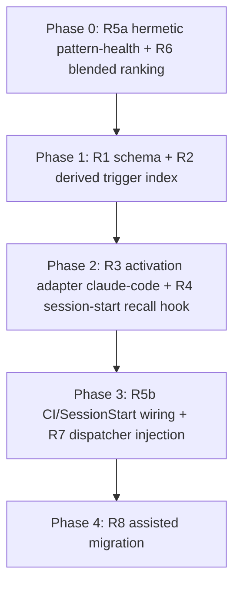

# RFC-009 — Lesson Activation: Trigger-Bearing Lessons, Derived Trigger Index, and Bounded Advisory Recall

## AI context

> This RFC makes stored lessons fire at the moment they are relevant: it adds optional activation fields to lesson episodes (triggers, applies_to, priority, expiry), a derived trigger index built by the substrate, and a per-project opt-in advisory hook that matches prompts against that index, plus it wires the already-built relevance recall (em-recall) and pattern-health check into real activation points. It solves the measured reuse failure: lessons are captured richly but 55 percent of active global lessons (99 of 180) and 83 percent of local lessons have never been accessed, because the only automated surfacing is a recency-sorted top-10 at session start. The key design decision is a hard two-layer split: the substrate owns lesson data and the derived index (enforcement-free, Principle 1 / CAPABILITIES.md), while activation hooks are per-project opt-in enforcement-layer artifacts (Principle 12), and all injection is advisory and token-bounded (Principle 6).

---

## Problem

The capture half of the learning loop works; the activation half leaks. Evidence gathered 2026-07-04, adversarially reviewed by codex (round 1 HOLD with 10 findings, round 2 ACCEPT; provenance: local milestone episode `20260704-055544-rfc-009-lesson-activation-drafted-status-1cf3` names the review artifacts).

1. **Lessons are written but not read.** Counting rows with `category == "lesson"` in `~/.episodic-memory/index.jsonl` and `<repo>/.episodic-memory/index.jsonl` (reproduce: one `node -e` pass over each file counting `access_count === 0` and `last_accessed`, filtered by `status`): all rows including superseded: 206 global lessons, 125 (61 percent) never accessed. Active-only denominator: 180 global lessons, 99 (55 percent) never accessed. Local store: 65 active lessons, 54 (83 percent) never accessed; the newest local lesson access is 2026-05-03. Measured 2026-07-04; the store moves, the ratio is the finding.
2. **The relevance engine is not activated.** `em-recall.mjs` implements multi-pass relevance ranking (project, tag, recency) and a task-type violation preflight, but no automated hook surfaces its output: `plugins/claude-code/hooks/em-recall-sessionstart.sh:12-15` documents that the recall body is discarded (issue #61). Instruction files direct agents to run it manually (`instructions/SKILL.md:37-43`).
3. **The one automated lesson surface is pure recency.** `plugins/claude-code/hooks/session-handoff-prompt.sh:197` loads lessons with `--no-score --limit 10`: the ten most recent, regardless of relevance, access history, or project match.
4. **No moment-of-relevance activation exists.** Nothing matches a user prompt or tool action against stored lessons. The de facto working mechanism is outside the substrate entirely: a hand-curated trigger-phrase table and feedback files in the operator's Claude auto-memory MEMORY.md, which is single-tool and hand-maintained. Artifact for the size failure mode: the 2026-07-04 SessionStart load emitted "WARNING: MEMORY.md is 24.8KB (limit: 24.4KB) ... Only part of it was loaded."
5. **Recorded signals go unused.** `last_accessed` is written by every search and read by nothing. `em-pattern-health.mjs --check` implements the 3-strikes needs-enforcement detector and is documented as a CI / SessionStart gate (`docs/USER_MANUAL.md:711-724`), but no workflow or hook runs it.
6. **A lesson episode is freeform.** No schema field says when a lesson applies, to which projects or tools, at what priority, or until when. A lesson's only activation surface is a human (or agent) happening to search for it.

What this RFC does NOT claim: that the loop never closed. Repeated bp-001 violations did motivate checkpoint-gate.sh (RFC-002 Phase 3b). That promotion was hand-designed and exercised once; the gap is that activation and promotion signals are not consumed mechanically.

---

## Proposal

Two layers with a hard boundary, per CAPABILITIES.md (learning/recall capabilities are substrate-side and enforcement-free) and Principle 12 (hooks are per-project enforcement artifacts).

### R1 — Lesson activation schema (substrate, data-only)

Extend lesson episode frontmatter with OPTIONAL fields; freeform lessons remain valid. The serialized shape is FLAT single-level keys with inline arrays, chosen because the existing rebuild parser handles only simple `^\w+:` keys and inline arrays (`scripts/em-rebuild-index.mjs:42-60`); no nested/dotted keys, so store, index, and rebuild round-trip with no parser change:

- `triggers: [second opinion, tool:Bash:git push\*]` — lowercase literal phrases and/or tool-target patterns, serialized as UNQUOTED inline-array items (the rebuild parser splits on commas and trims without quote-stripping, `scripts/em-rebuild-index.mjs:51-58`; quoting would embed quote characters in the round-trip). Validation therefore REJECTS phrases containing `,`, `[`, `]`, or `"` at write time (error names the offending character); items are comma-separated, whitespace-trimmed. Lexical only in this RFC; no embeddings (zero-dep, Principle 6; semantic matching stays in RFC-001/RFC-007 territory). Matching semantics are closed in R3.
- `applies_to_projects: [episodic-memory, \*]` — project slugs or `\*`. A lesson with neither list matching never fires anywhere.
- `applies_to_tools: [claude-code, codex]` — tool ids from the fixed vocabulary (claude-code, codex, opencode, pi-agent, cursor, windsurf), each with an honest capability tier (Principle 5) per the R3 tier table.

The unquoted-inline-array serialization rule and its character restrictions (`,` `[` `]` `"` rejected at write time) apply to EVERY inline-array field this RFC introduces — `triggers`, `applies_to_projects`, `applies_to_tools` — as one class, so the round-trip guarantee holds for all of them with zero parser change.
- `priority: 5` — integer, tie-break for bounded injection.
- `review_by: 2026-12-31` — past-due lessons drop from the derived trigger index (they remain searchable episodes).
- Suppression: a per-project mute list (`<project>/.episodic-memory/lesson-suppress.json`) consulted by the activation layer, not stored in the episode.

Write surface: `em-store.mjs` and `em-revise.mjs` gain repeatable flags `--trigger <phrase>`, `--applies-to-project <slug>`, `--applies-to-tool <id>`, plus `--priority <int>` and `--review-by <YYYY-MM-DD>`, valid only with `--category lesson` (error otherwise). Validation failure behavior: the write is REJECTED with a message listing the offending field and the accepted shape (mirroring em-violation's unknown-pattern error style); no partial writes. Both index.jsonl records and `em-rebuild-index.mjs` carry the new fields; a store-then-rebuild round-trip preserving all five fields is an acceptance test.

### R2 — Derived trigger index (substrate, enforcement-free)

A new substrate script `em-trigger-index.mjs` builds ONE derived index PER STORE — `~/.episodic-memory/trigger-index.json` (global) and `<project>/.episodic-memory/trigger-index.json` (local) — from lesson episodes carrying `triggers`. Contract:

- Shape: `{ "schema_version": 1, "source": {"index_mtime_ms": N, "index_size": N}, "entries": [{"phrase"|"tool_pattern", "episode_id", "summary", "priority", "applies_to_projects", "applies_to_tools", "review_by"}] }`. Expired (`review_by` past) lessons are excluded at build time.
- Build: lazy at first use per session; cache valid while `source.index_mtime_ms` + `index_size` match the store's index.jsonl (codex round-2 preference: lazy build keeps the write path simple and substrate-pure; freshness catches up next session).
- Merge: consumers read BOTH indexes and dedupe by episode id with LOCAL precedence, mirroring em-search's local-priority dedup. (Resolves OQ-1: per-store files, read-time merge.)
- Write: atomic temp+rename (repo convention). Malformed or unreadable index: rebuild once; if still malformed, the consumer proceeds with the other store's index and reports on stderr (never blocks).
- No hook registration, no gate logic (RFC-008 R1 boundary).

### R3 — Advisory activation adapter (per-project opt-in, full install contract)

A new ADAPTER CLASS, `activation`, registered as an additive plugin type in `plugins/_index.json` (RFC-008 R8 versioned-registry MINOR bump; a complete contract per the CAPABILITIES.md forward rule: registry sub-schema, manifest schema, runtime IO schema, conformance gauntlet). It is hook-shaped and therefore installs per-project by the P12 function test, but it is ADVISORY, never gating: its manifest declares `blocking: false` and the conformance gauntlet asserts exit 0 + no decision field on every path.

Install contract (P3, P10, P12): explicit opt-in flag `install.mjs --install-activation`; manifest declares side effects (hook file under `<project>/.claude/hooks/`, one `UserPromptSubmit` registration in `<project>/.claude/settings.json`, ownership ids + checksums); `--uninstall-activation` removes exactly the owned set; round-trip invariant tested like `test-uninstall-enforcement.mjs`. Never global (P12).

Runtime: on UserPromptSubmit, match the prompt against the merged trigger index (R2) and emit ADVISORY additionalContext: matched lesson ids + one-line summaries, never full bodies. Hard bounds (Principle 6): `max_matches` (default 3, top-K by priority then recency) and `max_tokens` (default ~500). The hook reads only the derived index, never lesson bodies.

Matching spec (closed; fixtures required):
- Case-fold prompt and phrase; phrase matches on word boundaries (negative lookaround on `[\w-]`, the em-pattern-health regex convention); no substring-inside-word hits.
- `tool:` triggers use the grammar `tool:<ToolName>:<glob>` where `<glob>` supports `*` only; literal `:` or `*` in a phrase is escaped with `\`. `tool:` triggers are matched by tool-event adapters (below), not against prompt text.
- Dedupe: one entry per episode id per event; identical phrases across stores collapse with local precedence (R2).
- Truncation: each summary line is capped; a single entry that would exceed `max_tokens` is dropped, not truncated mid-line.
- Malformed trigger entries are skipped and counted on stderr, never fatal.

Per-tool tier table (Principle 5, honest): claude-code STRONG (UserPromptSubmit exists); codex and pi-agent MEDIUM (hook/extension surfaces exist, per-event mapping in their plugin dirs); cursor MEDIUM-TBD (hooks per KB probe); opencode MEDIUM (plugin events); windsurf WEAK (file-rules only: session-start surfacing, no per-prompt matching). Tiers recorded in each adapter manifest.

### R4 — Wire relevance recall at session start (closes #61) — NOT via the enforcement path

A separate NON-enforcement SessionStart context hook, shipped by the R3 activation adapter as a sibling settings entry, runs `em-recall` and surfaces its stdout as SessionStart additionalContext: top-N relevance-ranked episodes plus the task-type violation preflight, token-bounded (same caps as R3). Explicitly NOT a change to `em-recall-sessionstart.sh`: that hook is the enforcement path (`enforce-contract --session-start`) and RFC-008 removed `em-recall` from it deliberately (`RFC-008-decouple-enforcement-from-substrate.md`, P3d relocation; the hook's own header documents this). `em-recall.mjs` stays pure recall; the activation hook only surfaces its output. (Resolves OQ-4: sibling hook in the activation adapter; the enforcement hook is untouched.)

Additionally, the session-handoff lesson load drops `--no-score` in favor of a blended ranking (recency + relevance + access_count staleness, R6).

### R5 — Pattern-health activation, P12-clean (implements the documented integration)

Two steps, strictly ordered.

(a) Add `--hermetic` to `em-pattern-health.mjs`: reads ONLY `<project>/.episodic-memory/` (episodes + local patterns registry, falling back to the repo's `patterns/_index.json` for pattern definitions) and detects enforcement ONLY in project surfaces: `<project>/.claude/hooks/`, `<project>/.git/hooks/`, `<project>/.github/workflows/`. Zero `$HOME` reads under `--hermetic` (the existing `~/.claude/hooks` scan is P12-legacy and excluded; it remains available without the flag for interactive use). Same JSON output shape and exit-code contract (`--check` exits 1 on needs-attention/needs-enforcement). Acceptance test: run under an isolated empty `HOME` fixture and assert identical output to a populated `HOME`, proving no `$HOME` dependence.

(b) Only then wire `--hermetic --check` into a CI job and a one-line SessionStart advisory on exit 1 (advisory emitted by the R3/R4 activation adapter, not the enforcement hook). `docs/USER_MANUAL.md:711-724` already documents this integration; this ships it.

### R6 — Disposition last_accessed

Use it: fold `last_accessed` staleness into the blended ranking (R4) and into `em-prune` scoring, or stop writing it. Decision recorded here: use it in ranking; prune semantics unchanged in this RFC.

### R7 — Dispatcher-side lesson injection for second-opinion reviews

Replace the manual reviewer-side lesson searches mandated by `scripts/second-opinion/preambles/fragments/review-ladder-v9.4.md:8-14` with dispatcher-side bounded injection: `second-opinion.mjs` queries the trigger index and relevance recall for the review scope and prepends matched lesson summaries (same bounds as R3), so review discipline stops depending on the reviewer obeying the preamble.

### R8 — Migration path for the out-of-substrate feedback corpus

Provide a documented, assisted path (not automatic) to migrate operator MEMORY.md trigger-phrase entries and feedback files into global lesson episodes carrying `triggers` + `applies_to`. Conditions (codex finding 8): every migrated lesson populates `applies_to`; activation remains per-project/per-tool opt-in; a global lesson with no `applies_to` match never fires.

### Scope

- **In scope:** R1-R8 above; Claude Code as the first activation adapter; WEAK-tier documentation for tools without prompt hooks.
- **Out of scope:** semantic/embedding or graph matching (RFC-001 Phase 4 algorithms, RFC-007); pluggable recall strategy registry (the original RFC-008 P9 sketch; folds into RFC-001/RFC-007); the consolidation clerk that DERIVES lessons from episode clusters (RFC-001 Phase 4, next arc); the promotion clerk that drafts new guards from needs-enforcement verdicts, RFC-002 Phase 4 counters, and Phase 3c clerk-model capture (third arc); any blocking behavior by the activation hook.

---

## Alternatives considered

| Alternative | Why rejected |
|---|---|
| Inject full lesson bodies at match time | Token blowup violates Principle 6; pointers + summaries let the agent pull bodies on demand |
| Semantic (embedding) trigger matching | Dependency conflicts with the zero-dep substrate; deliberate trade-off deferred to RFC-001/RFC-007 (same reasoning that deferred RFC-008 P9) |
| Activation hook inside the substrate (em-store/em-search register hooks) | Violates the CAPABILITIES.md boundary and RFC-008 R1: capabilities use memory, they never enforce or hook |
| Keep the MEMORY.md trigger table as the mechanism | Single-tool, hand-curated, already over its size limit and truncated; not portable to codex/opencode/pi/cursor/windsurf |
| Blocking activation (lesson match gates the tool call) | Lessons are advisory knowledge; enforcement is behavior patterns' job (bp-XXX + gates). Blocking would re-couple what RFC-008 decoupled |
| Automatic migration of MEMORY.md corpus | Operator-owned prose with mixed scopes; assisted clerk-style migration keeps the human as judge |
| Maintain trigger index incrementally on every em-store write | Adds write-path coupling for freshness nobody needs mid-session; lazy build with mtime/hash cache is simpler and P6-friendly (codex r2 preference) |

---

## Implementation plan

> Populate fully when the RFC moves to `accepted`. Anticipated sequencing:

---

## Acceptance tests (draft skeleton — expanded per phase at `accepted`)

**R1 schema:**
- [ ] `em-store --category lesson --trigger ... --applies-to-project ... --applies-to-tool ... --priority ... --review-by ...` writes all five fields; store → `em-rebuild-index` round-trip preserves them byte-equal in index.jsonl (ALL three array fields serialized unquoted; fixture includes a multi-word phrase and a multi-item applies_to list)
- [ ] Any item in any of the three array fields containing `,`, `[`, `]`, or `"` is rejected at write time naming the field and offending character
- [ ] Activation flags with any non-lesson category are rejected with a field-naming error; no partial write
- [ ] Malformed values (non-int priority, bad date, unknown tool id) rejected listing the accepted shape
- [ ] Freeform lessons without activation fields still store, index, and rebuild unchanged

**R2 trigger index:**
- [ ] Lazy build produces per-store `trigger-index.json` with `schema_version`, source mtime/size; second call with unchanged source is a cache hit (no rewrite)
- [ ] Source index change invalidates the cache; expired `review_by` entries excluded at build
- [ ] Merge dedupes by episode id with local precedence; malformed index falls back (rebuild once, then skip store with stderr note), never blocks

**R3 activation adapter:**
- [ ] Conformance gauntlet: every code path exits 0 and emits no decision field (advisory-only, never blocks)
- [ ] Bounds: never more than `max_matches` entries or `max_tokens` output; oversize single entry dropped whole
- [ ] Matching fixtures: word-boundary hit, substring-inside-word miss, case-fold hit, escaped `\*` literal, duplicate collapse, malformed-trigger skip
- [ ] `applies_to_projects` mismatch produces zero matches in a foreign project; suppression list mutes a matched lesson
- [ ] `--install-activation` writes exactly the manifest-declared set into `<project>/.claude/`; `--uninstall-activation` round-trip restores the pre-install state; nothing lands in `~/.claude/` (P12 assert, mock-project E2E)

**R4 session-start recall:**
- [ ] The activation adapter's SessionStart hook surfaces em-recall output as additionalContext, token-bounded; `em-recall-sessionstart.sh` byte-unchanged by this RFC
- [ ] Session-handoff lesson load is score-ranked (no `--no-score`), blended with access staleness

**R5 pattern-health:**
- [ ] `--hermetic` under an empty isolated `HOME` produces output identical to a populated `HOME` (zero `$HOME` reads)
- [ ] CI job runs `--hermetic --check` and fails on a fixture with 3+ recent violations and no project enforcement

**R7 dispatcher injection:**
- [ ] `second-opinion.mjs` prepends matched lesson summaries within the same bounds; zero matches prepends nothing

**R8 migration:**
- [ ] Assisted migration emits candidate lesson episodes with `applies_to_*` populated; nothing auto-stored without confirmation

---

## Implementation

> Populate during build stage — mark each item immediately after it ships. Do not batch at the end.

| PR/Commit | Files changed | Tests | Notes |
|---|---|---|---|
| _pending_ | _pending_ | _pending_ | _pending_ |

---

## Related RFCs

- RFC-001 — Intelligent Memory (`accepted`): Phase 3 proactive recall is what R4 activates; Phase 4 semantic consolidation is the next arc (lesson DERIVATION, distinct from this RFC's lesson ACTIVATION).
- RFC-002 — Learning Loop (`accepted`): R5 activates its Phase 2 health check; Phase 3c (clerk capture) and Phase 4 (counters) are the third arc.
- RFC-007 — Graph Projection (`draft`): future structural-edge matching over the same lesson corpus.
- RFC-008 — Decoupling Enforcement from Substrate (`accepted`): supplies the layer boundary this RFC's two-layer design obeys; partially serves the deferred P9 slot (`RFC-008/P9-recall-strategies.md`) on the activation axis, while the pluggable strategy registry itself stays deferred to RFC-001/RFC-007.

---

## Second opinion

> Required before `status: accepted` can be set.

**Reviewer:** codex (gpt-5.5 high), interactive cmux session; upstream evaluation separately codex-reviewed same day (r1 HOLD 10 findings, r2 ACCEPT)
**Date:** 2026-07-04
**Findings:** r1 HOLD: 3 blockers (R1 lacked a storage/round-trip contract; R3 lacked the P3/P10/P12 + RFC-008 registry install contract; R4 risked re-coupling em-recall into the enforcement SessionStart path) plus 4 majors (trigger-index underspecification, open matching semantics, undefined hermetic mode, missing acceptance criteria) and evidence hygiene. r2 HOLD: blockers 2-3 and majors closed; remaining blocker narrowed to inline-array quote round-trip vs the rebuild parser. r3 HOLD: same class extended to the applies_to array fields. r4 ACCEPT after the unquoted-serialization rule was made class-wide across all three array fields. Review artifacts: rfc009-review-r1..r4.md (session scratchpad, 2026-07-04).
**AI-slop check:** fixed in revision — uncited counts got repro method + measured date; the MEMORY.md truncation claim now quotes the SessionStart warning verbatim; review provenance cites the milestone episode id.
**Decision:** proceed

---

## Open questions

| # | Question | Owner | Status |
|---|---|---|---|
| OQ-1 | Trigger index location. Decided in R2: one derived index per store, read-time merge with local precedence. | — | resolved |
| OQ-2 | Suppression UX: mute by lesson id only, or also by trigger phrase? | — | open |
| OQ-3 | Exact per-tool event mapping for the MEDIUM-tier adapters (codex, pi-agent, opencode, cursor); tier table in R3 is the frame, per-event mapping lands with each adapter | — | open |
| OQ-4 | R4 hook placement. Decided: sibling SessionStart entry shipped by the activation adapter; `em-recall-sessionstart.sh` (enforcement path) untouched. | — | resolved |
| OQ-5 | Trigger index build trigger: decided — lazy at first use per session with mtime/hash cache (codex r2). Revisit only if staleness bites. | — | resolved |

---

## Deferral note

> Populate only if status changes to `deferred`.

---

## Withdrawal note

> Populate only if status changes to `withdrawn`.

---

## Supersession note

> Populate only if status changes to `superseded`.
