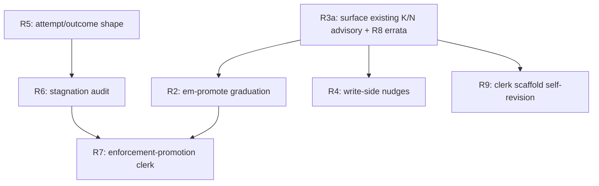

# RFC-012 — Promotion Arc: Evidence-Fed Knowledge Promotion, Advisory Cadence, and Stagnation Signals

## AI context

> This RFC defines the promotion arc: the contract for turning accumulated episodes (lessons, violations, attempts, telemetry) into promoted knowledge — graduated cross-store lesson promotion (`em-promote`), consolidation/promotion cadence surfaced through the RFC-009 activation plane, write-side capture nudges, a typed attempt/outcome shape, a read-only stagnation audit, clerk scaffold self-revision (the training-free AutoMem analog), and the RFC-009 "third arc" enforcement-promotion clerk (propose-only). It exists because the learning-strategy family currently has one EXPERIMENTAL member with a 2026-10-08 promote-or-remove deadline, RFC-009 R9's cadence advisory is computed but never surfaced, capture fires only at SessionEnd (exactly where momentum kills it), and the third arc was explicitly deferred with no owner. The key design decision: every mechanism in this arc is advisory and confirm-gated — the arc *proposes* knowledge and surfaces signals; it never auto-writes derived content without confirmation, never writes into a foreign project store, and never gates a tool call (RFC-008 R1 boundary holds throughout).

---

## Problem

The word "promotion" names three distinct mechanisms in this repo, and none of them is finished:

1. **Learning-strategy promotion** — `em-promote` detects cross-store recurring lessons and, on `--apply`, writes one derived global episode per recurrence (`scripts/em-promote.mjs:1-9`). It is EXPERIMENTAL with a promote-or-remove decision date of **2026-10-08** (`scripts/em-promote.mjs:62`, `CAPABILITIES.md:39`), and its provenance is carried entirely in-body as a freeform `## Sources` section plus a `promoted:<sha8>` identity tag and a `cross-project` sentinel in the open `project` field — all named by issue #478 as EXPERIMENTAL surface pending RFC-009 P1b typed linkage (`CAPABILITIES.md:68`).
2. **Enforcement promotion** — RFC-009 named "declared priority → earned salience → measured conversion → enforcement promotion" as one evidence gradient (RFC-009 R1, `docs/rfcs/RFC-009-lesson-activation.md:58-59`; R6, `:149`) and explicitly deferred "the promotion clerk that drafts new guards from needs-enforcement verdicts, RFC-002 Phase 4 counters, and Phase 3c clerk-model capture (third arc)" (`docs/rfcs/RFC-009-lesson-activation.md:313`). No RFC owns that third arc today.
3. **Scope-relocation promotion** — the historical local→global promotion pain that motivated `em-move` (RFC-005, `docs/rfcs/RFC-005-em-move.md:27`). Solved; named here only to keep the vocabulary honest.

Around those, four observable gaps:

- **Cadence is computed but invisible.** RFC-009 R9 requires "a one-line advisory (via the R3/R4 adapter, never a gate) when the R2 build observes K or more entries sharing one phrase (K=3) or the active-lesson count crosses N (N=200 per store)" (`docs/rfcs/RFC-009-lesson-activation.md:183`). The constants and the advisory string ship (`scripts/lib/activation-log.mjs:19-20`, `scripts/em-consolidate.mjs:473-484,585-591`) — but only inside `em-consolidate --clerk`'s own manual report. Neither `scripts/em-trigger-index.mjs` nor the activation hook runner references them: the operator who never runs the clerk never sees the advisory that tells them to run the clerk. There is also no "episodes since the last clerk run" delta and no last-consolidation timestamp anywhere the activation plane can read — the only run timestamp lives inside a clerk-run run-record's JSON body (`scripts/em-consolidate.mjs:1430`), unindexed.
- **Capture is write-side blind until SessionEnd.** The activation plane (RFC-009 R3/R4) is exclusively read-side: it surfaces lessons to *consult* at SessionStart / UserPromptSubmit / PreToolUse. The only write-side prompting is the SessionEnd violation prompt (`scripts/em-session-end-prompt.mjs:220-225`) and the opt-in SessionEnd draft extraction spawn (`scripts/em-session-end-prompt.mjs:195-218` → `scripts/em-capture.mjs`). Session-end is precisely where task-end momentum defeats capture — the failure mode bp-001 documents for this project's own operator. External corroboration: the CORAL framework (multi-institution, May 2026; reviewed via the swarm-research distillation, YouTube u-lMMDCfmSM) found agents systematically *forget to consult and contribute to shared persistent memory* and corrected it with three prompted reflection points — per-iteration note capture, periodic consolidation after N attempts, and stagnation-triggered redirection. Its consolidation trigger discipline (fire after a fixed number of attempts, not when a human remembers) is the direct inspiration for R3 below; its reflection and redirection heartbeats inspire R4 and R6 — translated from wall-clock timers to lifecycle-gated events, because timers violate Principle 6. A second corroboration: AutoMem (Stanford, July 2026, arXiv:2607.01224; reviewed via distillation of YouTube 1b-aZ8c0xJ8) lifted a frozen Qwen2.5-32B from 17% to ~51% on long-horizon agent benchmarks purely by improving memory management, and its two transferable properties require no training: the gains lived in the memory *scaffold* (file schemas, prompts, action vocabulary — data, not weights), and the memory work ran on a separate cheap specialist model while the task model stayed frozen. This substrate's scaffold is already data (the clerk prompt, capture heuristics, trigger definitions, categories.json), but nothing revises it from evidence today — it is hand-tuned only (R9 below).
- **Repeated failure without progress is invisible.** Nothing in the substrate measures "the same task attempted repeatedly with no recorded successful outcome." `em-pattern-health` counts violation density per behavior pattern (`scripts/em-pattern-health.mjs:257-289`) and its verdict already reaches `session_start.pattern_health` (`scripts/em-trigger-index.mjs:1031`), but attempts at ordinary work (not pattern violations) have no episode shape at all, so no audit can see them.
- **The charter and RFC-009 disagree.** RFC-009 R9(b) prose calls the consolidation clerk "the LEARNING-STRATEGY family's first shipped implementation" (`docs/rfcs/RFC-009-lesson-activation.md:175`), while `CAPABILITIES.md:39-40` files `em-consolidate` under curation (family 4) and names `em-promote` as the first learning-strategy (family 3) member. One of them is wrong; the drift is live in two governing documents.

---

## Proposal

Nine requirements. R1 fixes vocabulary; R2 graduates or removes `em-promote`; R3–R6 add the evidence-and-cadence plumbing (each independently shippable); R7 closes RFC-009's third arc; R8 reconciles the charter drift; R9 folds AutoMem's training-free parts into the clerk. A cross-cutting invariant block binds all of them.

### Boundary invariants (bind every requirement below)

- **B-1 Advisory, never enforcement.** No mechanism in this arc gates, blocks, or decides. Activation-plane surfacing keeps the R3/R4 contract: exit 0, `additionalContext` only, no decision field (RFC-008 R1, `docs/rfcs/RFC-008-decouple-enforcement-from-substrate.md:81-85`; activation IO schema `schemas/runtime/activation-io.schema.json`).
- **B-2 Confirm before store.** Every derived write flows through the assisted per-item confirmation path, matching `em-capture`'s "drafts are NEVER silently promoted" invariant (`scripts/em-capture.mjs:9-10`) and the clerk's `--apply --confirm` gate. No autonomous write path is created.
- **B-3 Global-only derived writes.** No capability writes derived content into a foreign project store; promotion writes global, consolidation folds in-store (class rule recorded on issue #480, citing `em-promote`'s existing boundary).
- **B-4 Token budget.** All new surfacing is lifecycle-gated (session start, prompt, tool event) or on-demand; no timers, no polling; bounds match R3's existing caps (Principle 6; RFC-009 R3, `docs/rfcs/RFC-009-lesson-activation.md:86`).
- **B-5 Definitions are data.** New thresholds, shapes, and verdict enums are JSON-registered (categories.json, plugin registry, schema files), interpreted by `.mjs` behind existing contracts (Principle 2).

### R1 — One promotion vocabulary

The arc adopts and documents three named senses — **learning-promotion** (cross-store lesson recurrence → derived global episode; `em-promote`), **enforcement-promotion** (lesson with proven conversion + needs-enforcement verdict → *proposed draft guard*; R7), and **scope-relocation** (episode moves between scopes; `em-move`, closed by RFC-005). Every later document must say which sense it means. Parent anchors: RFC-009 R1/R6 gradient (`docs/rfcs/RFC-009-lesson-activation.md:58-59,149`), RFC-005 problem statement (`docs/rfcs/RFC-005-em-move.md:27`).

### R2 — em-promote graduation contract (decide by 2026-10-08)

`em-promote` either graduates to a full learning-strategy capability or is removed, per the charter's experimental-tier rule (`CAPABILITIES.md:159-166`). Graduation requires, per the forward rule (`CAPABILITIES.md:138-157`):

- **R2a Typed provenance.** Replace in-body-only provenance with RFC-009 P1b typed linkage: promoted digests carry member episode ids in the indexed `evidence` array field (shipped P1b surface, `docs/rfcs/RFC-009-lesson-activation.contract.json:6-14`), retiring the `promoted:<sha8>` tag as identity and the `cross-project` sentinel in the open `project` field. Migration is one re-tag sweep (issue #478's own estimate). The in-body `## Sources` section remains as human-readable rendering, no longer machine-parsed identity.
- **R2b Registered plugin type.** Register under the existing `learning` type in `plugins/_index.json` (RFC-008 R8, `docs/rfcs/RFC-008-decouple-enforcement-from-substrate.md:116`) with descriptor, runtime IO schema, and a conformance gauntlet folding the existing 15-assertion suite (`tests/test-em-promote.mjs`).
- **R2c Deferred residuals resolved or re-filed.** The concurrent `--apply` TOCTOU and axis-conflation defers folded into #478 get an explicit disposition (fix, or re-file with the 5-field defer justification) at graduation time.

If the criteria are not met by 2026-10-08, `em-promote` is removed — the charter deadline is the contract, not a suggestion.

### R3 — Cadence reaches the activation plane

Close RFC-009 R9's unimplemented clause ("via the R3/R4 adapter", `docs/rfcs/RFC-009-lesson-activation.md:183`):

- **R3a Surface the existing K/N advisory.** The R2 trigger-index build computes the same two gauges `em-consolidate` computes today (phrase-sharing ≥ K=3, active lessons ≥ N=200; constants from `scripts/lib/activation-log.mjs:19-20`) and stamps a bounded one-line `cadence` advisory into the `session_start` section of `trigger-index.json`, which the SessionStart hook already renders. One line, session-start only, never per-prompt.
- **R3b Delta-since-last-run gauge.** Add a third gauge with CORAL's trigger discipline: episodes written since the last clerk run. Requires the clerk-run timestamp to become readable at build time — the build locates the latest `record_type: clerk-run` run-record (fields already carried by the index, `scripts/em-rebuild-index.mjs:218-219`) and counts active episodes newer than it; threshold `CADENCE_M_NEW_EPISODES` (default proposed: 50, tunable as data per B-5). No new store, no new file — the run-record episode is already the durable record (Principle 7).
- **R3c Same advisory for promotion.** When ≥ 2 registered stores exist, the same session-start advisory line may recommend an `em-promote` dry run when the cross-store lesson count has grown past its own threshold since the last promotion run-record. This makes learning-promotion self-announcing under the identical bounded contract. (Requires `em-promote` to write a run-record episode on `--apply`, mirroring the clerk's, which also closes its idempotency-observability gap.)

### R4 — Write-side advisory nudges (store-side activation)

Extend the activation plane from consult-side to contribute-side, keeping every existing bound:

- **R4a Capture nudge classes.** The activation adapter MAY emit, as part of its existing bounded `additionalContext`, a one-line write-side nudge when a registered nudge condition matches: (proposed initial set) a decision-shaped prompt with no episode written this session, and a session crossing a work-milestone tool event (merge/push class) with no capture draft pending. Nudge conditions are data (B-5), shipped with the adapter, matched at the same three events R3/R4 already binds — no new hooks, no new events.
- **R4b Confirm-before-store holds.** A nudge only ever suggests `em-store` / `em-capture` invocations; it writes nothing itself (B-2).
- **R4c Suppression.** Nudges respect the existing suppression mechanism and the R3 caps; a nudge line competes inside `max_tokens`, never extends it. Per-session nudge budget of 1 (a nudge that fired stays quiet for the rest of the session) so the reminder never becomes noise.

This is the CORAL per-iteration reflection heartbeat translated to lifecycle events: the trigger is a matched prompt/tool event, never a clock.

### R5 — Typed attempt/outcome shape

Give the substrate a first-class record of "tried X, outcome Y", following the two shipped typed-scalar precedents (`violated_pattern`: `scripts/em-violation.mjs:224`; `record_type`/`clerk_cutover`: `scripts/em-consolidate.mjs:1437-1449`):

- **R5a Category.** Add `attempt` to `categories.json` (closed-vocabulary MINOR bump per RFC-009 R10, `docs/rfcs/RFC-009-lesson-activation.md:223`), `machine_consumed: true`, lifecycle `aggregate-then-prune` (attempts are evidence, not permanent knowledge — the stagnation audit and promotion consume them, then they prune like `temporary`).
- **R5b Typed scalars.** `attempt_of: <stable-task-key>` (free-form task identity chosen by the writer) and `outcome: success | failure | abandoned | in-progress`, validated at write time (fail-closed writer path per `scripts/lib/categories.mjs` contract), carried through the rebuild whitelist and the `em-store`/`em-revise` `activationIndexFields` in lockstep (`scripts/em-rebuild-index.mjs:190-224`, `scripts/em-store.mjs:330`, `scripts/em-revise.mjs:395`).
- **R5c Writer.** A dedicated writer path mirroring `em-violation.mjs`'s shape (flag set on `em-store` or a thin `em-attempt` wrapper — implementation choice deferred to the plan). Tags never carry the identity (RFC-009 R10: tags are never load-bearing).

### R6 — Stagnation audit (read-only)

A windowed, read-only audit over R5 attempt episodes, structurally cloned from `em-pattern-health`:

- **R6a Verdict.** Per `attempt_of` key with ≥ `--min-attempts` (default 3) attempts in `--window-days` (default 14) and no `outcome: success`: verdict `stagnant`; otherwise `progressing` / `insufficient-data`. Closed verdict enum registered as data, mirroring `PATTERN_HEALTH_VERDICTS` (`scripts/em-trigger-index.mjs:1023-1024`).
- **R6b Surfacing.** The trigger-index build stamps the audit summary into `session_start` exactly the way `computePatternHealth` already does (`scripts/em-trigger-index.mjs:1031`) — one advisory line naming the stagnant task keys, bounded, informational (B-1, B-4).
- **R6c No steering.** The audit names the plateau; it never prescribes or gates the pivot. That keeps it on the capability side of the RFC-008 R1 line — surfacing a signal is using memory; forcing a redirection would be workflow enforcement. (CORAL's redirection heartbeat, minus its imperative half.)

### R7 — Enforcement-promotion clerk (closes RFC-009's third arc)

The deferred promotion clerk (`docs/rfcs/RFC-009-lesson-activation.md:313`) becomes a propose-only aggregation-plane clerk:

- **R7a Inputs.** `em-pattern-health` `needs-enforcement` verdicts (`scripts/em-pattern-health.mjs:366-369`), R6 conversion telemetry lower bounds (RFC-009 R6 surface), RFC-002 Phase 4 counters, and lesson `evidence`/`lessons` linkage — the full gradient RFC-009 R1 named.
- **R7b Output.** A *draft guard proposal* — a candidate `bp-XXX.json` body plus the evidence trail — written as a `workflow.lifecycle` proposal episode for human review. The clerk never writes into `patterns/`, never registers a hook, never activates anything (Principles 3, 12; B-1, B-2). Promotion of a draft into an active pattern remains a human PR.
- **R7c Cadence.** On-demand, plus at most the same session-start advisory line class as R3 when a pattern crosses the needs-enforcement threshold. Runs under the clerk lock discipline (`scripts/lib/lock.mjs`) and writes a run-record like the consolidation clerk (Principle 7).
- **R7d Aggregator dependency.** If implemented agentically, it consumes the RFC-009 R9d prompt-as-data convention — which requires the #531 installer/deploy-audit blindness fix to land first. The zero-dep lexical form has no such dependency and MAY ship first.

### R8 — Charter reconciliation

One-sentence errata to RFC-009 R9(b) prose (`docs/rfcs/RFC-009-lesson-activation.md:175`): the consolidation clerk is a **curation** clerk per the charter; the learning-strategy family's first member is `em-promote` (`CAPABILITIES.md:39-40`). Errata rides this RFC's acceptance PR (archive rule: errata permitted; RFC-008 amendment tier: clarification, intent unchanged).

### R9 — Clerk scaffold self-revision (AutoMem-cheap: data, selection, cheap seats — no training)

The training-free analog of AutoMem's two loops, scoped to the clerk:

- **R9a Definition-revision duty.** The aggregation-plane clerk MAY propose revisions to the data-tier scaffold — the clerk prompt (`scripts/em-consolidate/prompts/clerk.md`), capture heuristics, R4 nudge-condition definitions, and lesson trigger definitions — grounded in observed evidence: R6 conversion telemetry (injected-then-accessed lower bounds), `access_count` / `feedback` index fields, and clerk run-record history. Each proposal is (a) a `workflow.lifecycle` proposal episode citing the evidence rows and (b) a reviewable data diff; application is a human-confirmed PR or per-item confirm (B-2). Definitions remain data throughout (B-5, P2); no revision path may touch `.mjs` interpreters. This is AutoMem Loop 1 with the meta-LLM replaced by evidence plus confirmation.
- **R9b Cheap-seat clerking.** Agentic aggregation-plane work (the RFC-009 R9d prompt consumer, R7, R9a) runs on a designated low-cost model seat, declared per run in the run-record (model id plus approximate cost — P6 visibility); the primary session agent never performs aggregation-plane clerking inline (two-plane contract, `docs/rfcs/RFC-009-lesson-activation.md:42`). AutoMem's specialist/task split, applied at the harness tier.
- **R9c Exemplar selection, not generation.** The clerk MAY select high-conversion episodes (converted within the attribution window, per the R6 surface) as few-shot exemplar data shipped alongside the prompt-as-data directory. Exemplars are verbatim episode excerpts with cited ids — the clerk filters the corpus's own good decisions; it never synthesizes exemplar content (AutoMem's selection-not-generation property). Exemplar-set changes are data diffs under R9a's confirm path.

### Scope

- **In scope:** the contracts above (R1–R9); the graduation decision path for `em-promote`; additive activation-plane surfacing; the `attempt` category and stagnation audit contract; the propose-only enforcement-promotion clerk contract; the clerk scaffold self-revision contract (R9); the RFC-009/CAPABILITIES drift errata.
- **Out of scope:** all implementation (this RFC ships as `draft`; the implementation plan is populated at acceptance per template rule — explicitly held back by champion instruction 2026-07-14); the agentic aggregator runtime (blocked on #531; only R7d's dependency note touches it); any recall-algorithm change (RFC-001/RFC-007 territory); model-weight or RL optimization from the surveyed papers (out of substrate scope entirely); wall-clock heartbeat timers in any form (P6); auto-activation of proposed guards (P3/P12); cross-store foreign writes (B-3); em-consolidate `--help` discoverability (#527) and stdout truncation (#486) — pre-existing issues that ride their own fixes.

---

## Alternatives considered

| Alternative | Why rejected |
|---|---|
| Wall-clock heartbeat timers (CORAL's literal mechanism: 5-min reflection pings, daily consolidation) | Violates Principle 6 — a recurring timer is unbounded background spend; lifecycle-gated events (session start, prompt, tool) deliver the same reminder discipline at zero idle cost. |
| A separate counters/state file for cadence (last-run timestamp sidecar) | Second store, violates Principle 1; the clerk-run run-record episode already carries the timestamp durably (Principle 7) — R3b reads it at build time instead. |
| Tag-based attempt marking (`attempt:<key>` tags instead of typed scalars) | RFC-009 R10 closed this: tags are never load-bearing; typed scalar frontmatter fields are the shipped precedent (`violated_pattern`, `record_type`). |
| Auto-promote / auto-consolidate on threshold crossing (skip confirmation) | Breaks the confirm-before-store invariant (B-2) and Principle 3 (visible consent); an advisory that runs itself is enforcement wearing an advisory label. |
| Per-prompt cadence surfacing (advisory on every UserPromptSubmit) | Burns the R3 token bound on a signal that changes at most once per session; session-start-only matches the signal's actual rate of change (P6). |
| Extend `em-recall` into the hook path for stagnation/cadence | RFC-009 R4 deliberately removed `em-recall` from all hook paths (`docs/rfcs/RFC-009-lesson-activation.md:120-123`); the purpose-built derived index is the only hook-read surface. |
| Git worktrees / file-system-as-memory for the promotion arc (swarm-research paper's core mechanism) | Orchestration-layer concern, already practiced in the multi-agent playbook; as a substrate mechanism it is a second store (Principle 1). Episodes remain the only data layer. |
| Let `em-promote` stay EXPERIMENTAL past 2026-10-08 while the arc matures | The charter's experimental tier exists precisely to prevent permanent squatters (`CAPABILITIES.md:159-166`); R2 makes the deadline the contract. |
| Fold everything into RFC-009 as a P5 phase instead of a new RFC | RFC-009 is accepted and its scope statement explicitly ejected the third arc (`:313`); reopening an accepted RFC's scope for a multi-mechanism arc buries the vocabulary problem R1 exists to fix. |
| Stagnation audit prescribes redirection (full CORAL heartbeat 3) | Prescribing a pivot is workflow steering — behavior-pattern territory (RFC-008 R1); the capability boundary permits naming the signal only (R6c). |
| AutoMem's LoRA memory-specialist + meta-LLM training loops | Weight optimization is not substrate work (P1: episodes are the only data layer; the substrate is model-free). The training-free analog — evidence-fed data-tier scaffold revision (R9a), cheap specialist seats (R9b), selection of the corpus's own good decisions as exemplar data (R9c) — captures the transferable benefit at zero training cost. |

---

## Implementation plan

> Populate this section when the RFC moves to `accepted`. Per champion instruction (2026-07-14), no implementation begins from the draft; sequencing will be drafted at acceptance. Expected shape: R3a/R8 (smallest, zero new schema) → R2 (deadline-bound) → R5 → R6 → R4 → R7, each independently shippable.

### Sequencing

---

## Implementation

> Populate during build stage — mark each item immediately after it ships. Do not batch at the end.

| PR/Commit | Files changed | Tests | Notes |
|---|---|---|---|
| _pending_ | _pending_ | _pending_ | _pending_ |

---

## Related RFCs

- RFC-009 (Lesson Activation) — parent of the activation plane (R3/R4), the cadence clause (R9), the evidence gradient (R1/R6), P1b typed linkage, and the deferred third arc this RFC closes.
- RFC-008 (Decouple Enforcement from Substrate) — the R1 advisory/enforcement boundary and the R8 typed plugin registry every mechanism here registers under.
- RFC-002 (Learning Loop) — violation tracking and pattern refinement; its Phase 4 counters feed R7.
- RFC-005 (em-move) — closed the scope-relocation sense of promotion (R1 vocabulary).
- RFC-001 (Intelligent Memory) / RFC-007 (Graph Projection) — recall algorithms; any agentic candidate generation for R7 belongs to their lineage, not this contract.
- RFC-011 (Playbook Activation Preferences) — precedent for layering a new section onto the session_start surface without contract breakage.

---

## Second opinion

> Required before `status: accepted` can be set.

**Reviewer:** <!-- pending — pi/GLM-5.2 (neuralwatt) adversarial round on the frozen draft diff -->
**Date:** <!-- pending -->
**Findings:** <!-- pending -->
**AI-slop check:** <!-- pending -->
**Decision:** <!-- pending -->

---

## Open questions

| # | Question | Owner | Status |
|---|---|---|---|
| OQ-1 | R3b threshold `CADENCE_M_NEW_EPISODES` default: 50 proposed without telemetry; should the default be derived from observed per-session episode rates before acceptance? | Charlton Ho | open |
| OQ-2 | R5c writer: flags on `em-store` vs a dedicated `em-attempt` wrapper — which keeps the substrate surface smaller while preserving fail-closed validation? | Charlton Ho | open |
| OQ-3 | R5a lifecycle: is `aggregate-then-prune` right for attempts, or do successful-outcome attempts deserve promotion to `lesson` before pruning (and if so, whose job — R6 audit or R7 clerk)? | Charlton Ho | open |
| OQ-4 | R4a nudge condition set: are the two proposed initial conditions (decision-shaped prompt, milestone tool event) the right minimal set, and what is the false-positive tolerance before a nudge trains the operator to ignore it? | Charlton Ho | open |
| OQ-5 | R7 zero-dep lexical form vs agentic form: does the lexical form deliver enough candidate quality to ship first, or does R7 wait on the aggregator arc (#531) entirely? | Charlton Ho | open |
| OQ-6 | R2a migration: does retiring the `cross-project` project-field sentinel require an `em-move`-style sweep of existing promoted digests, and is that sweep in R2 scope or a follow-up? | Charlton Ho | open |
| OQ-7 | R9a revisable-set v1: clerk prompt + capture heuristics only, or also trigger definitions and nudge conditions? A smaller set is a safer burn-in. | Charlton Ho | open |
| OQ-8 | R9c exemplar placement: sibling data file under `scripts/em-consolidate/prompts/` (deploys with the #531 fix) vs global episodes tagged as exemplars? | Charlton Ho | open |

---

## Deferral note

> Populate only if status changes to `deferred`.

---

## Withdrawal note

> Populate only if status changes to `withdrawn`.

---

## Supersession note

> Populate only if status changes to `superseded`.
