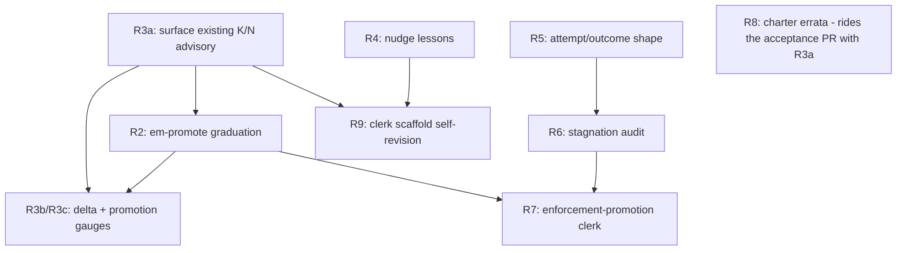

# RFC-012 — Promotion Arc: Evidence-Fed Knowledge Promotion, Advisory Cadence, and Stagnation Signals

## AI context

> This RFC defines the promotion arc: the contract for turning accumulated episodes (lessons, violations, attempts, telemetry) into promoted knowledge — graduated cross-store lesson promotion (`em-promote`), consolidation/promotion cadence surfaced through the RFC-009 activation plane, write-side capture nudges, a typed attempt/outcome shape, a read-only stagnation audit, clerk scaffold self-revision (the training-free AutoMem analog), and the RFC-009 "third arc" enforcement-promotion clerk (propose-only). It exists because the learning-strategy family currently has one EXPERIMENTAL member with a 2026-10-08 promote-or-remove deadline, RFC-009 R9's cadence advisory is computed but never surfaced, capture fires only at SessionEnd (exactly where momentum kills it), and the third arc was explicitly deferred with no owner. The key design decision: every mechanism in this arc is advisory and confirm-gated — the arc *proposes* knowledge and surfaces signals; it never auto-writes derived content without confirmation, never writes into a foreign project store, and never gates a tool call (RFC-008 R1 boundary holds throughout).

---

## Problem

The word "promotion" names three distinct mechanisms in this repo, and none of them is finished:

1. **Learning-strategy promotion** — `em-promote` detects cross-store recurring lessons and, on `--apply`, writes one derived global episode per recurrence (`scripts/em-promote.mjs:1-9`). It is EXPERIMENTAL with a promote-or-remove decision date of **2026-10-08** (`scripts/em-promote.mjs:62`, `CAPABILITIES.md:39`), and its provenance is carried entirely in-body as a freeform `## Sources` section plus a `promoted:<sha8>` identity tag and a `cross-project` sentinel in the open `project` field — all named by issue #478 as EXPERIMENTAL surface pending RFC-009 P1b typed linkage (`CAPABILITIES.md:68`).
2. **Enforcement promotion** — RFC-009 named "declared priority → earned salience → measured conversion → enforcement promotion" as one evidence gradient (RFC-009 R1, `docs/rfcs/RFC-009-lesson-activation.md:58-59`; R6, `:149`) and explicitly deferred "the promotion clerk that drafts new guards from needs-enforcement verdicts, RFC-002 Phase 4 counters, and Phase 3c clerk-model capture (third arc)" (`docs/rfcs/RFC-009-lesson-activation.md:313`). No RFC owns that third arc today.
3. **Scope-relocation promotion** — the historical local→global promotion pain that motivated `em-move` (RFC-005, `docs/rfcs/RFC-005-em-move.md:27`). Solved; named here only to keep the vocabulary honest.

Around those, four observable gaps:

- **Cadence is computed but invisible.** RFC-009 R9 requires "a one-line advisory (via the R3/R4 adapter, never a gate) when the R2 build observes K or more entries sharing one phrase (K=3) or the active-lesson count crosses N (N=200 per store)" (`docs/rfcs/RFC-009-lesson-activation.md:183`). The constants and the advisory string ship (`scripts/lib/activation-log.mjs:19-20`, `scripts/em-consolidate.mjs:473-484,585-591`) — but only inside `em-consolidate --clerk`'s own manual report. Neither `scripts/em-trigger-index.mjs` nor the activation hook runner references them: the operator who never runs the clerk never sees the advisory that tells them to run the clerk. There is also no "episodes since the last clerk run" delta gauge: the latest clerk run is locatable from the index (run-record episodes carry `record_type: clerk-run` plus indexed `date`/`time`, `scripts/em-rebuild-index.mjs:218-219`), but nothing computes episodes-written-since-it and the session_start surface never exposes any cadence signal.
- **Capture is write-side blind until SessionEnd.** The activation plane (RFC-009 R3/R4) is exclusively read-side: it surfaces lessons to *consult* at SessionStart / UserPromptSubmit / PreToolUse. The only write-side prompting is the SessionEnd violation prompt (`scripts/em-session-end-prompt.mjs:220-225`) and the opt-in SessionEnd draft extraction spawn (`scripts/em-session-end-prompt.mjs:195-218` → `scripts/em-capture.mjs`). Session-end is precisely where task-end momentum defeats capture — the failure mode bp-001 documents for this project's own operator. External corroboration: the CORAL framework (arXiv:2604.01658, Human-Agent-Society, April 2026; reviewed via the swarm-research video distillation, YouTube u-lMMDCfmSM; the swarm-research paper itself is arXiv:2607.02807) found agents systematically *forget to consult and contribute to shared persistent memory* and corrected it with three prompted reflection points — per-iteration note capture, periodic consolidation after N attempts, and stagnation-triggered redirection. Its consolidation trigger discipline (fire after a fixed number of attempts, not when a human remembers) is the direct inspiration for R3 below; its reflection and redirection heartbeats inspire R4 and R6 — translated from wall-clock timers to lifecycle-gated events, because timers violate Principle 6. A second corroboration: AutoMem (Stanford, July 2026, arXiv:2607.01224; reviewed via distillation of YouTube 1b-aZ8c0xJ8) reportedly lifted a frozen Qwen2.5-32B from 17% to ~51% on three procedurally generated game benchmarks by treating memory management as the optimization target — a combined result of scaffold revision (Loop 1) plus a LoRA-trained memory specialist (Loop 2), with no per-loop ablation — and two of its properties transfer here without adopting its training loops: the improvement surface included the memory *scaffold* (file schemas, prompts, action vocabulary — data revised by Loop 1, not weights), and the memory work ran on a separate specialist model while the task model stayed frozen (in AutoMem a LoRA-trained specialist; here a cheap untrained seat, R9b). This substrate's scaffold is mostly data already (the clerk prompt, trigger definitions, categories.json; the capture heuristics remain hardcoded pending the extraction R9a names), and nothing revises any of it from evidence — it is hand-tuned only (R9 below).
- **Repeated failure without progress is invisible.** Nothing in the substrate measures "the same task attempted repeatedly with no recorded successful outcome." `em-pattern-health` counts violation density per behavior pattern (`scripts/em-pattern-health.mjs:257-289`) and its verdict already reaches `session_start.pattern_health` (`scripts/em-trigger-index.mjs:1031`), but attempts at ordinary work (not pattern violations) have no episode shape at all, so no audit can see them.
- **The charter and RFC-009 disagree.** RFC-009 R9(b) prose calls the consolidation clerk "the LEARNING-STRATEGY family's first shipped implementation" (`docs/rfcs/RFC-009-lesson-activation.md:175`), while `CAPABILITIES.md:39-40` (family table; prose `:61-75`) files `em-consolidate` under curation (family 4) and names `em-promote` as the first learning-strategy (family 3) member. One of them is wrong; the drift is live in two governing documents.

---

## Proposal

Nine requirements. R1 fixes vocabulary; R2 graduates or removes `em-promote`; R3–R6 add the evidence-and-cadence plumbing (each independently shippable); R7 closes RFC-009's third arc; R8 reconciles the charter drift; R9 folds AutoMem's training-free parts into the clerk. A cross-cutting invariant block binds all of them.

### Boundary invariants (bind every requirement below)

- **B-1 Advisory, never enforcement.** No mechanism in this arc gates, blocks, or decides a tool call, workflow step, or enforcement outcome (fail-closed validation inside a proposal pipeline ahead of its confirmation set — R9a's weakening auto-reject — is data validation, not a workflow decision). Activation-plane surfacing keeps the RFC-009 R3/R4 contract: exit 0, `additionalContext` only, no decision field (RFC-008 R1, `docs/rfcs/RFC-008-decouple-enforcement-from-substrate.md:81-85`; activation IO schema `schemas/runtime/activation-io.schema.json`).
- **B-2 Confirm before store.** Every derived write flows through the assisted per-item confirmation path, matching `em-capture`'s "drafts are NEVER silently promoted" invariant (`scripts/em-capture.mjs:9-10`) and the clerk's `--apply --confirm` gate. No autonomous write path is created.
- **B-3 Global-only derived writes.** No capability writes derived content into a foreign project store; promotion writes global, consolidation folds in-store (class rule recorded on issue #480, citing `em-promote`'s existing boundary).
- **B-4 Token budget.** All new surfacing is lifecycle-gated (session start, prompt, tool event) or on-demand; no timers, no polling; bounds match R3's existing caps (Principle 6; RFC-009 R3, `docs/rfcs/RFC-009-lesson-activation.md:86`).
- **B-5 Definitions are data.** New thresholds, shapes, and verdict enums are JSON-registered (categories.json, plugin registry, schema files), interpreted by `.mjs` behind existing contracts (Principle 2).

### R1 — One promotion vocabulary

The arc adopts and documents three named senses — **learning-promotion** (cross-store lesson recurrence → derived global episode; `em-promote`), **enforcement-promotion** (lesson with proven conversion + needs-enforcement verdict → *evidence bundle recommending guard review*; R7), and **scope-relocation** (episode moves between scopes; `em-move`, closed by RFC-005). Every later document must say which sense it means. Parent anchors: RFC-009 R1/R6 gradient (`docs/rfcs/RFC-009-lesson-activation.md:58-59,149`), RFC-005 problem statement (`docs/rfcs/RFC-005-em-move.md:27`).

### R2 — em-promote graduation contract (decide by 2026-10-08)

`em-promote` either graduates to a full learning-strategy capability or is removed, per the charter's experimental-tier rule (`CAPABILITIES.md:159-166`). Graduation requires, per the forward rule (`CAPABILITIES.md:138-157`):

- **R2a Typed provenance.** Replace in-body-only provenance with a NEW typed field: promoted digests carry canonical source references in an indexed `promotion_sources` array — each reference is `{store_id, episode_id, content_sha256}`, where `content_sha256` hashes the canonical episode bytes — summary-hash member keys are insufficient because `em-promote` collapses rows sharing id and summary before reading the second body (`scripts/em-promote.mjs:118-133`), so same-id, same-summary, different-body sources would collide; replicas collapse only when content hashes match, and episode ids alone are not globally unique (`scripts/em-promote.mjs:19-29`). `store_id` is an opaque stable identifier minted once per store and carried by a reserved immutable identity EPISODE inside that store — P1: state reduces to episodes, and a sidecar identity file would be exactly the durable non-episode state this RFC rejects for cadence — where the identity chain's terminal revision supplies the ACTIVE `store_id` and every superseded revision's id remains resolvable as a retired alias owned uniquely by that store — an ordinary confirmed rebind creates a successor revision (P7 audit trail) so canonical references written before the rebind keep resolving; a clone rebind is an atomic confirmed transaction in the copy: it first writes an episode-level detach successor terminating the inherited chain — the detached terminal contributes no active id and no aliases in the copy, and the old id remains owned solely by the original store — then creates the fresh identity root, so the copy ends with exactly one active chain (P7: the detach is itself an episode transition, never a deletion). The identity episode's machine contract: category `context` with typed scalar `record_type: store-identity`; exactly one active identity chain per store (a second chain fails loud at build and at registration); the chain receives prune protection. Identity travels with the store directory across relocations because the episode does. The consumer registry mirrors the active id plus retired aliases derivationally (a distribution-layer mirror, never authoritative) via an additive schema-version bump to `plugins/consumer-registry.schema.json` — one store's identity copied across all of its (project_path, tool) rows (`scripts/lib/install-version.mjs:362-370`), existing rows backfilled deterministically by mint-on-next-registration, ambiguous alias ownership (one id claimed by two stores) failing loud — and identity is never a filesystem path, since the current realpath rule (`scripts/lib/registered-stores.mjs:11-21`) breaks on relocation and would embed absolute paths in global episodes. The global store carries the reserved id `global`. A copied store (one id observed at two paths) is rejected at registration pending an explicit rebind; a reference whose store_id matches neither an active id nor a registered alias resolves as a surfaced missing-source, never a silent drop. `content_sha256` is SHA-256 over the episode file's raw UTF-8 bytes with LF-normalized newlines, lowercase hex; both fields are exercised by the R2b fixtures. The array ships with its own writer flag, write-time validation, and store/rebuild lockstep entries — NOT the P1b `evidence` field, whose registered meaning is lesson→violation linkage feeding the earned-priority band and whose writer rejects non-violation ids (`scripts/em-store.mjs:187-198`; overloading it could forge earned priority). Retires the `promoted:<sha8>` tag as identity and the `cross-project` sentinel in the open `project` field. Migration is an assisted, lock-guarded revision migration, not a tag sweep: successor episodes carry the typed provenance and corrected project metadata, prior ids persist through supersession chains (P7), indexes rebuild, and a run-record captures per-item outcomes (owned by R2 graduation; closes OQ-6). The in-body `## Sources` section remains as human-readable rendering, no longer machine-parsed identity.
- **R2b Registered plugin type.** The `learning` value exists in the registry type enum but has no descriptor or registry slot yet (`plugins/_index.schema.json:31`); graduation ships the learning registry sub-schema plus descriptor schema as the additive-MINOR bump (RFC-008 R8 versioned-contract clause, `docs/rfcs/RFC-008-decouple-enforcement-from-substrate.md:116`) and then registers `em-promote` under it, with runtime IO schema and a conformance gauntlet folding the existing 15-test suite (`tests/test-em-promote.mjs`) plus new fixtures: same-id, same-summary, different-body sources stay distinct; a post-preview source substitution fails fingerprint revalidation; pre-rebind references keep resolving after an ordinary rebind; a cloned store completes clone-rebind with exactly one active chain, zero inherited aliases, and old-id resolution only to the original (asserted after rebuild and re-registration); a duplicate identity chain fails loud; an unresolved alias surfaces as missing-source.
- **R2c Deferred residuals resolved or re-filed.** The concurrent `--apply` TOCTOU and axis-conflation defers folded into #478 get an explicit disposition (fix, or re-file with the 5-field defer justification) at graduation time.
- **R2d Assisted apply + run-record.** `--apply` gains a per-recurrence confirm contract: preview each candidate with an immutable source fingerprint (the hash of the sorted canonical references — the same `{store_id, episode_id, content_sha256}` shape as `promotion_sources`, so any source, store, or content substitution changes the fingerprint), confirm explicitly per candidate, revalidate the fingerprint under the `em-lock` discipline before writing (closing the B-2 gap: today `scripts/em-promote.mjs:320-328` writes each promotion with no confirmation). Each apply run writes a run-record episode (`record_type: promote-run`) — operational metadata per Principle 7, exempt from per-item confirmation, giving R3c its delta source and closing the idempotency-observability gap; graduation adds the additive class-d protection arm reserving the latest promote-run per store (mirroring the clerk-run arm, `scripts/lib/protection.mjs:217-227`), without which the delta baseline would be prunable. Write matrix: content proposals = per-item confirm; apply writes = per-candidate confirm + fingerprint recheck; run-records = unconfirmed operational metadata, global-only (B-3).

If the criteria are not met by 2026-10-08, `em-promote` is removed — the charter deadline is the contract, not a suggestion.

### R3 — Cadence reaches the activation plane

Close RFC-009 R9's unimplemented clause ("via the R3/R4 adapter", `docs/rfcs/RFC-009-lesson-activation.md:183`):

- **R3a Surface the existing K/N advisory.** The RFC-009 R2 trigger-index build (`scripts/em-trigger-index.mjs`) computes the same two gauges `em-consolidate` computes today (phrase-sharing ≥ K=3, active lessons ≥ N=200; constants from `scripts/lib/activation-log.mjs:19-20`) and stamps a bounded one-line `cadence` advisory into the `session_start` section of `trigger-index.json`, which the SessionStart hook already renders. Gauges compute per store, from index rows only; the active-lesson gauge filters `category: lesson` (correcting today's count-all-eligible behavior, `scripts/em-consolidate.mjs:447-455`). One line, session-start only, never per-prompt. All RFC-012 session_start advisories (cadence R3, stagnation R6, promotion R3c, needs-enforcement R7c) are typed, stably keyed fields in the session_start section, rendered inside the existing envelope caps, at most one line each. Enablement flags are compiled into the session_start section at build time — the hook keeps reading only its RFC-009 allowed set. Rendering order is fixed (cadence, stagnation, promotion, needs-enforcement); advisories render after lesson pointers and truncate first on envelope overflow.
- **R3b Delta-since-last-run gauge.** Add a third gauge with CORAL's trigger discipline: episodes written since the last clerk run. The build locates the latest `record_type: clerk-run` run-record via the index (fields already carried, `scripts/em-rebuild-index.mjs:218-219`; the indexed `date`/`time` are the timestamp) and counts active episodes newer than it; threshold `CADENCE_M_NEW_EPISODES` (default proposed: 50, tunable as data per B-5). When no prior clerk-run exists the delta gauge is suppressed (no advisory) until the first run is recorded. No new store, no new file — the run-record episode is already the durable record (Principle 7).
- **R3c Same advisory for promotion.** When ≥ 2 registered stores exist, the same session-start advisory line may recommend an `em-promote` dry run when the cross-store lesson count has grown past its own threshold since the last promotion run-record. This makes learning-promotion self-announcing under the identical bounded contract. Defined index-only: the count of active `lesson` episodes across registered stores newer than the latest promote-run baseline (delta source: the R2d promote run-record; absent baseline suppresses the advisory). The em-promote clustering path (`scripts/em-promote.mjs:148-200`, quadratic and body-reading) never runs at build or event time — it stays an on-demand command.

### R4 — Write-side capture nudges as trigger-bearing lessons

The reflection-nudge idea lands with zero new mechanism: a capture nudge is an ordinary opt-in lesson episode, surfaced by the existing RFC-009 R3/R4 activation plane.

- **R4a Nudge lessons.** Ship a small curated set of project-local `lesson` episodes, written into the opting project's store by the explicit opt-in install step (P3) with manifest-declared ownership and clean uninstall (P10); the nudge set is never installed globally and `applies_to_projects: [*]` is prohibited for it, so one project's opt-in can never surface nudges in another. Their RFC-009 R2 triggers match decision-language phrase classes and milestone tool events (merge/push class), and their one-line summaries prompt an `em-store`/`em-capture` invocation. Uninstall follows P10 ownership: a checksum-unmodified seed episode is removed outright with an index rebuild (the narrow installer-owned-artifact exception to P7's revise-not-delete rule); a seed the user has revised fails loud and stays. The plane surfaces them exactly like any lesson: same matcher machinery, same `max_matches`/`max_tokens` caps, same per-episode-id suppression — no new hooks, no new events, no new read surface, no session state. RFC-009's event-plane read set stays untouched (trigger-index.json + category-index.json only, `docs/rfcs/RFC-009-lesson-activation.md:43`).
- **R4b Confirm-before-store holds.** A nudge only ever suggests `em-store` / `em-capture` invocations; nothing writes automatically (B-2).
- **R4c Frequency control.** Repeat-surfacing is governed by the existing suppression and cap mechanics — a nudge lesson has an episode id, so the shipped lesson-suppress path applies verbatim. Tuning nudge trigger phrases against false-positive fatigue is R9a's evidence-fed revision duty (OQ-4).

This is a capture *nudge*, not capture itself: the SessionEnd draft extraction stays the only automatic capture path (`scripts/em-session-end-prompt.mjs:195-218`) — R4 mitigates the momentum gap rather than closing it (OQ-9). CORAL's reflection heartbeat translated to lifecycle events: the trigger is a matched prompt/tool event, never a clock. Because the nudge is substrate DATA consumed by the existing advisory plane, no workflow-discipline logic enters the substrate (RFC-008 R1): the lesson states what is worth doing; nothing checks whether the agent complied.

### R5 — Typed attempt/outcome shape

Give the substrate a first-class record of "tried X, outcome Y", following the two shipped typed-scalar precedents (`violated_pattern`: `scripts/em-violation.mjs:224`; `record_type`/`clerk_cutover`: `scripts/em-consolidate.mjs:1437-1449`):

- **R5a Category.** Add `attempt` to `categories.json` (closed-vocabulary MINOR bump per RFC-009 R10, `docs/rfcs/RFC-009-lesson-activation.md:223`), `machine_consumed: true`, lifecycle `aggregate-then-prune` (attempts are evidence, not permanent knowledge — the stagnation audit and promotion consume them, then they prune like `temporary`).
- **R5b Typed scalars.** `attempt_of: <project-scoped stable task key>` (schema'd `<project>/<key>` shape — the key is writer-chosen, the project namespace is mandatory) and `outcome: success | failure | abandoned | in-progress`, validated at write time (fail-closed writer path per `scripts/lib/categories.mjs` contract), carried through the rebuild whitelist and the `em-store`/`em-revise` `activationIndexFields` in lockstep (`scripts/em-rebuild-index.mjs:190-224`, `scripts/em-store.mjs:330`, `scripts/em-revise.mjs:395`).
- **R5c Writer.** A dedicated writer path mirroring `em-violation.mjs`'s shape (flag set on `em-store` or a thin `em-attempt` wrapper — implementation choice deferred to the plan). Tags never carry the identity (RFC-009 R10: tags are never load-bearing).

### R6 — Stagnation audit (read-only)

A windowed, read-only audit over R5 attempt episodes, structurally cloned from `em-pattern-health`:

- **R6a Verdict.** Per `attempt_of` key: count only terminal non-success outcomes (`failure`, `abandoned`; `in-progress` never counts), over active-terminal revisions (supersedes chains resolve to their terminal), within `--window-days` (default 14). Counting starts strictly after the latest `success` on the key: ≥ `--min-attempts` (default 3) post-success terminal non-success attempts in the window yield `stagnant` — one old success inside the window never masks a renewed plateau; fewer with a prior success yield `progressing`; no attempts meeting the threshold and no success yields `insufficient-data`. Closed verdict enum registered as data, mirroring `PATTERN_HEALTH_VERDICTS` (`scripts/em-trigger-index.mjs:1023-1024`).
- **R6b Surfacing.** The trigger-index build stamps the audit summary into `session_start` exactly the way pattern health already does (compute `scripts/em-trigger-index.mjs:1031`, session_start stamp `:743-756`) — one advisory line naming the stagnant task keys, bounded, informational (B-1, B-4).
- **R6c No steering.** The audit names the plateau; it never prescribes or gates the pivot. That keeps it on the capability side of the RFC-008 R1 line — surfacing a signal is using memory; forcing a redirection would be workflow enforcement. (CORAL's redirection heartbeat, minus its imperative half.)

### R7 — Enforcement-promotion clerk (closes RFC-009's third arc)

The deferred promotion clerk (`docs/rfcs/RFC-009-lesson-activation.md:313`) becomes a propose-only aggregation-plane clerk:

- **R7a Inputs.** `em-pattern-health` `needs-enforcement` verdicts (`scripts/em-pattern-health.mjs:366-369`), RFC-009 R6 conversion telemetry lower bounds, RFC-002 Phase 4 counters, and lesson `evidence`/`lessons` linkage — the full gradient RFC-009 R1 named.
- **R7b Output.** An *evidence bundle*, not a guard: a proposal episode under the new `proposal` category (a `categories.json` MINOR addition carrying the complete member contract the schema requires, `schemas/categories.schema.json:31-53`: name `proposal`, description "Clerk-emitted proposal awaiting human confirmation: guard-review evidence bundles, scaffold-revision diffs, exemplar-set selections", `lifecycle: standard`, `machine_consumed: true`. Ordinary score-based archival is accepted deliberately: an unactioned proposal ages out like any episode (`scripts/em-prune.mjs:116-140`), archival is reversible via `em-restore`, and no new protection class is added. Typed frontmatter fields, write-time validated and carried in store/rebuild lockstep: `proposal_kind: guard-review | scaffold-revision | exemplar-set`, `proposal_sources` (array in the R2a canonical-reference shape), and `selection_evidence`, a discriminated object array with an explicit `kind` discriminator: `{kind: "episode", source: <canonical R2a reference>}` or `{kind: "telemetry", run_record: <canonical R2a reference>, metric_key: <JSON pointer into that run-record's metrics object>}`; unknown kinds and unresolvable pointers are rejected at write time, and raw activation-log lines are unkeyed (`scripts/lib/activation-log.mjs:31-52`) so they are never cited directly. Every proposal carries an explicit `target_store` field (a `store_id`), write-time validated: `guard-review` defaults to the store of the project whose pattern it concerns and targets `global` for global or cross-project patterns; `scaffold-revision` targets the store of the project that owns the revised data file (repo-shipped scaffold data such as the clerk prompt targets the repo project's own store); evidence spanning other stores is carried as canonical references, never by relocating the proposal; `exemplar-set` targets `global` and may reference only global episodes (B-3); corrected via revision chains per P7, confirm path per the R2d write matrix — NOT `workflow.lifecycle`, whose registered meaning is behavior-pattern event records, `categories.json:41-45`) carrying the full evidence trail and a "guard review recommended" statement (`proposal_kind: guard-review`). The clerk never authors `bp-XXX.json` bodies — generating enforcement definitions is workflow-definition logic that belongs to the enforcement layer (RFC-008 R1; CAPABILITIES.md enforcement boundary); a human or an enforcement-layer tool turns the bundle into a guard in a separately consented PR. The clerk never writes into `patterns/`, never registers a hook, never activates anything (Principles 3, 12; B-1, B-2).
- **R7c Cadence.** On-demand, plus at most the same session-start advisory line class as R3 when a pattern crosses the needs-enforcement threshold. Runs under the clerk lock discipline (`scripts/lib/lock.mjs`) and writes a run-record like the consolidation clerk (Principle 7).
- **R7d Aggregator dependency.** If implemented agentically (the R7 or R9 backends), it consumes the RFC-009 R9d prompt-as-data convention — which requires the #531 installer/deploy-audit blindness fix to land first. The zero-dep lexical form has no such dependency and MAY ship first.

### R8 — Charter reconciliation

One-sentence errata to RFC-009 R9(b) prose (`docs/rfcs/RFC-009-lesson-activation.md:175`): the consolidation clerk is a **curation** clerk per the charter; the learning-strategy family's first member is `em-promote` (`CAPABILITIES.md:39-40` (family table; prose `:61-75`)). Errata rides this RFC's acceptance PR (archive rule: errata permitted; RFC-008 amendment tier: clarification, intent unchanged).

### R9 — Clerk scaffold self-revision (AutoMem-cheap: data, selection, cheap seats — no training)

The training-free analog of AutoMem's two loops, scoped to the clerk:

- **R9a Definition-revision duty.** The aggregation-plane clerk MAY propose revisions to the data-tier scaffold — the clerk prompt (`scripts/em-consolidate/prompts/clerk.md`), capture heuristics, and lesson trigger definitions (including the R4 nudge lessons' triggers) — grounded in observed evidence: RFC-009 R6 conversion telemetry (injected-then-accessed lower bounds), `access_count` / `feedback` index fields, and clerk run-record history. Each proposal is (a) a `proposal` episode (`proposal_kind: scaffold-revision`, R7b category) citing the evidence rows and (b) a reviewable data diff; application is a human-confirmed PR or per-item confirm (B-2). Definitions remain data throughout (B-5, P2); no revision path may touch `.mjs` interpreters. The current capture heuristics are hardcoded (`scripts/em-capture.mjs:108-121`); extracting them to a data file is a named prerequisite of the revisable set. Conversion telemetry is an exposure correlation and a lower bound (RFC-009 R6), never task-outcome quality: a revision or exemplar proposal MUST NOT cite conversion as its sole justification — minimum-exposure thresholds plus at least one independent signal (R5 outcome evidence, `feedback` counters, or a human-declared objective) are required. Self-revision invariants (closing OQ-10): the B-1..B-5 invariants and this paragraph's own evidence and confirmation constraints are immutable to the revising clerk — they sit outside the revisable set; a proposed revision is evaluated on lagged or held-out runs against a fixed baseline before confirmation; and any proposal that weakens citation, confirmation, exposure, or evaluation constraints is auto-rejected. This is AutoMem Loop 1 with the meta-LLM replaced by evidence plus confirmation.
- **R9b Agentic clerking as an opt-in backend.** Agentic aggregation-plane work (the RFC-009 R9d prompt consumer, R7, R9a) is an optional registered backend: explicit per-project opt-in (P3), an up-front declared budget (model/provider id, max rounds, max tokens/USD, bounded lifetime — P6's consented-spend rule, not after-the-fact logging), a zero-agent lexical fallback keeping every capability functional without it, and an honest per-harness tier table (P5). Preference, not mandate: a low-cost specialist seat clerks while the primary session agent stays on task (AutoMem's specialist/task split at the harness tier; two-plane contract, `docs/rfcs/RFC-009-lesson-activation.md:42`); each run's actual spend lands in the run-record.
- **R9c Exemplar selection, not generation.** The clerk MAY select episodes as exemplars, but what persists is only canonical episode references plus selection metadata, stored as `proposal` episodes (`proposal_kind: exemplar-set`; P1: no second canonical copy of episode content ships as a prompt asset). Excerpts resolve verbatim at dispatch time from the permitted store, with scope checks so local or private content never enters a globally deployed artifact (B-3, P10); any cache is a mechanically rebuildable derived artifact carrying source fingerprints. An emitted excerpt MUST pass a verbatim-match audit against the cited episode body — a mismatch rejects the exemplar and logs a synthesis-leak note in the run-record. Selection follows R9a's evidence rules (never conversion alone). Inspired by AutoMem's training-data selection, which selects verbatim traces for LoRA training rather than inference-time few-shot use — a new hypothesis here, not a ported result. Exemplar-set changes are data diffs under R9a's confirm path.

### Scope

- **In scope:** the contracts above (R1–R9); the graduation decision path for `em-promote`; additive activation-plane surfacing; the `attempt` category and the R7b proposal category (both `categories.json` MINOR additions) and the stagnation audit contract; the propose-only enforcement-promotion clerk contract; the clerk scaffold self-revision contract (R9); the RFC-009/CAPABILITIES drift errata.
- **Out of scope:** all implementation (this RFC ships as `draft`; the implementation plan is populated at acceptance per template rule — explicitly held back by champion instruction 2026-07-14); the agentic aggregator runtime (blocked on #531; only R7d's dependency note touches it); any recall-algorithm change (RFC-001/RFC-007 territory); model-weight or RL optimization from the surveyed papers (out of substrate scope entirely); wall-clock heartbeat timers in any form (P6); auto-activation of proposed guards (P3/P12); cross-store foreign writes (B-3); em-consolidate `--help` discoverability (#527) and stdout truncation (#486) — pre-existing issues that ride their own fixes.

---

## Alternatives considered

| Alternative | Why rejected |
|---|---|
| Wall-clock heartbeat timers (CORAL's mechanism; the 3-second/5-minute/daily intervals are the video narration's examples, not the paper's spec) | Violates Principle 6 — a recurring timer is unbounded background spend; lifecycle-gated events (session start, prompt, tool) deliver the same reminder discipline at zero idle cost. |
| A separate counters/state file for cadence (last-run timestamp sidecar) | Second store, violates Principle 1; the clerk-run run-record episode already carries the timestamp durably (Principle 7) — R3b reads it at build time instead. |
| Tag-based attempt marking (`attempt:<key>` tags instead of typed scalars) | RFC-009 R10 closed this: tags are never load-bearing; typed scalar frontmatter fields are the shipped precedent (`violated_pattern`, `record_type`). |
| Auto-promote / auto-consolidate on threshold crossing (skip confirmation) | Breaks the confirm-before-store invariant (B-2) and Principle 3 (visible consent); an advisory that runs itself is enforcement wearing an advisory label. |
| Per-prompt cadence surfacing (advisory on every UserPromptSubmit) | Burns the R3 token bound on a signal that changes at most once per session; session-start-only matches the signal's actual rate of change (P6). |
| Extend `em-recall` into the hook path for stagnation/cadence | RFC-009 R4 deliberately removed `em-recall` from all hook paths (`docs/rfcs/RFC-009-lesson-activation.md:120-123`); the purpose-built derived index is the only hook-read surface. |
| Git worktrees / file-system-as-memory for the promotion arc (swarm-research paper's core mechanism) | Orchestration-layer concern, already practiced in the multi-agent playbook; as a substrate mechanism it is a second store (Principle 1). Episodes remain the only data layer. |
| Let `em-promote` stay EXPERIMENTAL past 2026-10-08 while the arc matures | The charter's experimental tier exists precisely to prevent permanent squatters (`CAPABILITIES.md:159-166`); R2 makes the deadline the contract. |
| Fold everything into RFC-009 as a P5 phase instead of a new RFC | RFC-009 is accepted and its scope statement explicitly ejected the third arc (`:313`); reopening an accepted RFC's scope for a multi-mechanism arc buries the vocabulary problem R1 exists to fix. |
| Stagnation audit prescribes redirection (full CORAL heartbeat 3) | Prescribing a pivot is workflow steering — behavior-pattern territory (RFC-008 R1); the capability boundary permits naming the signal only (R6c). |
| No promotion clerk at all (enforcement guards stay human-authored; ship no aggregation clerk) | The third arc was deferred with named evidence inputs (RFC-009:313), not abandoned; purely hand-authored guards discard the conversion/verdict evidence gradient RFC-009 R1/R6 built precisely to feed it. R7 keeps the human as the confirming author (B-2); the clerk only assembles the evidence. |
| AutoMem's LoRA memory-specialist + meta-LLM training loops | Weight optimization is not substrate work (P1: episodes are the only data layer; the substrate is model-free). The training-free analog — evidence-fed data-tier scaffold revision (R9a), cheap specialist seats (R9b), selection of corpus episodes as exemplar references (R9c, labeled a new hypothesis) — adapts the transferable pattern at zero training cost. |

---

## Implementation plan

> Populate this section when the RFC moves to `accepted`. Per champion instruction (2026-07-14), no implementation begins from the draft; sequencing will be drafted at acceptance. Expected shape: R3a/R8 (smallest, zero new schema) → R2 (deadline-bound) → R3b/R3c → R5 → R6 → R4 → R9 → R7, each independently shippable. The mermaid graph records hard dependencies only; the arrow order in this note is expected shipping order, not a dependency chain. R2 → R7 because R7's proposal episodes cite the typed evidence linkage and the learning-type registry slot that R2a/R2b stabilize.

### Sequencing

---

## Implementation

> Populate during build stage — mark each item immediately after it ships. Do not batch at the end.

| PR/Commit | Files changed | Tests | Notes |
|---|---|---|---|
| _pending_ | _pending_ | _pending_ | _pending_ |

---

## Related RFCs

- RFC-009 (Lesson Activation) — parent of the activation plane (R3/R4), the cadence clause (R9), the evidence gradient (R1/R6), P1b typed linkage, and the deferred third arc this RFC closes.
- RFC-008 (Decouple Enforcement from Substrate) — the R1 advisory/enforcement boundary and the R8 typed plugin registry every mechanism here registers under.
- RFC-002 (Learning Loop) — violation tracking and pattern refinement; its Phase 4 counters feed R7.
- RFC-005 (em-move) — closed the scope-relocation sense of promotion (R1 vocabulary).
- RFC-001 (Intelligent Memory) / RFC-007 (Graph Projection) — recall algorithms; any agentic candidate generation for R7 belongs to their lineage, not this contract.
- RFC-011 (Playbook Activation Preferences) — precedent for layering a new section onto the session_start surface without contract breakage.
- RFC-010 (Versioned Central Engine) — adjacent, no dependency: guards authored by humans from R7 evidence bundles activate only through the per-project enforcement install path; if RFC-010's central-engine model ships, those guards target its versioned payloads.

---

## Second opinion

> Required before `status: accepted` can be set.

**Reviewer:** Claude Sonnet verification agents (2x, parallel: coherence + prior-art fact-check)
**Date:** 2026-07-14
**Findings:** amendment citations and document coherence clean, both validators green, zero build-commitment phrasing; one prior-art overclaim (AutoMem specialist framed as training-free when the source trains it via Loop 2 LoRA) and one cross-RFC naming ambiguity (bare "R9d").
**AI-slop check:** fixed in revision (overclaim corrected in `16e1ad9`, qualifier in `4ededf9`)
**Decision:** revise first — both fixes applied same day.

**Reviewer:** pi/GLM-5.2 (neuralwatt), adversarial round 1, six duties (citation audit, P/C/R grounding, boundary attack, behavior-claim verification, completeness, AI-slop)
**Date:** 2026-07-14
**Findings:** HOLD-5 (1 P1: Problem called the clerk-run timestamp "unindexed" while R3b relied on the indexed fields — contradiction; 4 P2: em-promote `--apply` violated the B-2 confirm invariant with no graduation fix, R4 session-state home and matcher unspecified, R4 over-claimed solving SessionEnd capture blindness, CORAL cited without a primary source; 6 P3: DAG missing R8 + unjustified R2→R7, bare RFC-009 R-number collisions, unowned promote run-record, R2b registry-slot precision, R3b first-run behavior, missing no-clerk alternative + RFC-010 cross-ref). Boundary analysis clean: no RFC-008 R1 crossing, no P6 violation, no foreign-store writes; charter drift (R8) independently confirmed real.
**AI-slop check:** concerns: [unverifiable external authority] — resolved with primary citations (CORAL arXiv:2604.01658, SwarmResearch arXiv:2607.02807)
**Decision:** revise first — all 11 findings ACCEPTED (2 with modification) and fixed; round 2 dispatched on the fix commit.

**Reviewer:** pi/GLM-5.2 (neuralwatt), round 2 (fix verification + R9 new surface)
**Date:** 2026-07-14
**Findings:** HOLD-2. All 11 round-1 findings verified RESOLVED on disk; document coherence confirmed clean. New: 2 P2 (the R4c session-budget check read `activation-log.jsonl` at hook time, violating RFC-009's non-negotiable event-plane read set, RFC-009:43-47; promote-run records were absent from the prune-protection class-d set, making R2d's clerk-mirror claim false and the R3c baseline prunable) plus 3 P3 (exemplar verbatim-match audit missing, no self-drift OQ for R9a, AutoMem numbers distillation-sourced).
**AI-slop check:** clean (near-slop flagged on the unfalsifiable exemplar invariant — made testable in revision)
**Decision:** revise first — all 5 accepted and folded together with the codex round below.

**Reviewer:** codex gpt-5.6-sol (high reasoning), independent parallel round 1 on frozen `16e1ad9` (later concurrent commits excluded by the reviewer)
**Date:** 2026-07-14
**Findings:** HOLD-12. 5 P1: R2a overloaded the P1b `evidence` field whose writer rejects non-violation ids (`em-store.mjs:187-198`); B-2 false for `em-promote --apply`; R4's prompt-classification-plus-compliance-check shape crossed into workflow-discipline logic with an illegal event-plane state model; R7 generated `bp-XXX.json` bodies inside the substrate and misused `workflow.lifecycle`; R9c's exemplar file created a second knowledge store with a scope-leak risk. 7 P2: advisory envelope/suppression identity, R3 gauge semantics (lesson filtering, no clustering at event time, undefined baselines), R5/R6 task-identity rigor, the R9a Goodhart loop on conversion telemetry, R9b consent and up-front budget, B-5 vs hardcoded capture heuristics plus DAG gaps, prior-art overclaims. 1 P3: citation drift.
**AI-slop check:** concerns: [prior-art overclaims] — corrected (reportedly-hedge, combined-pipeline framing, narration-example labeling, R9c relabeled a new hypothesis)
**Decision:** revise first — all 13 accepted (R4 restructured to trigger-bearing nudge lessons; R7b to evidence-bundle only under a new proposal category; R9c to ids-only dispatch-time resolution; R2a to a new `promotion_sources` field; R2d enriched with fingerprint-confirm and the protection arm). Round 3 dispatched to both providers on the combined fold commit.

**Reviewer:** pi/GLM-5.2 (neuralwatt), round 3 (combined-fold verification + restructure review)
**Date:** 2026-07-14
**Findings:** ACCEPT. All 5 round-2 findings verified RESOLVED; every codex-driven restructure judged boundary-clean and grounded (all new-surface citations re-verified, no drift, no fabrication). Three P3 coherence notes: R9a proposals rode `workflow.lifecycle` while R7b rejected it (now both use the R7b proposal category); vestigial "nudge-condition definitions" wording after the R4 restructure (aligned); Scope omitted the R7b category addition (added).
**AI-slop check:** clean
**Decision:** proceed — P3 notes folded in the same revision.

**Reviewer:** codex gpt-5.6-sol (high reasoning), round 2 on frozen `7dd80ba`
**Date:** 2026-07-14
**Findings:** HOLD-7. 11 of 13 round-1 findings verified RESOLVED. New: N1 P1 (`promotion_sources` and the R2d fingerprint used bare episode ids, which em-promote itself documents as non-unique — canonical {member_key, store_set} references required); N2-N7 P2 (global nudge lessons vs per-project consent; OQ-10 needed closing as invariants; reset-on-success masked renewed stagnation; advisory enablement needed compiling into the trigger index with deterministic ordering; the proposal category needed a name and schema; the migration was not a tag sweep); N8 P3 (stale pre-restructure prose in R1, Related RFCs, Problem, Alternatives).
**AI-slop check:** clean
**Decision:** revise first — all 8 accepted and folded (canonical source references, project-local nudge set, R9a self-revision invariants closing OQ-10, post-success stagnation counting, build-compiled advisory flags with fixed ordering, named `proposal` category with `proposal_kind` enum, assisted revision migration closing OQ-6, prose alignment). Round 3 dispatched.

**Reviewer:** codex gpt-5.6-sol (high reasoning), round 3 on frozen `023589d`
**Date:** 2026-07-14
**Findings:** HOLD-2. Six of eight round-2 findings verified RESOLVED. N1 refined (P1: the member key bound id + summary hash while `em-promote` collapses replicas before reading bodies, `scripts/em-promote.mjs:118-133` — identity must bind content: `{store_id, episode_id, content_sha256}`); N6 refined (P2: the `proposal` category needed the complete schema member contract — description, lifecycle, typed field schemas with lockstep, per-kind destination scope, `schemas/categories.schema.json:31-53`). Two new P3: seed-episode uninstall semantics (P7 vs P10) unstated; B-1's absolute "decides" wording vs R9a's auto-reject. Validators re-run green by the reviewer; prior-art wording confirmed clean.
**AI-slop check:** clean
**Decision:** revise first — all 4 accepted and folded (content-bound canonical references + two new conformance fixtures; complete `proposal` member contract with per-kind scopes; P10 uninstall exception stated with fail-loud on modified seeds; B-1 narrowed to workflow/enforcement decisions). Round 4 dispatched.

**Reviewer:** codex gpt-5.6-sol (high reasoning), round 4 on frozen `1108287` (ran the em-promote suite 15/15 and both registry validators as part of verification)
**Date:** 2026-07-14
**Findings:** HOLD-2. N1 and both P3s RESOLVED. N6 refined (P2: the "lifecycle: standard = prune protection" rationale was false — standard episodes score-prune, `scripts/em-prune.mjs:116-140`, and no proposal protection class exists; the description literal and the selection-metadata field were missing; multi-store placement was singular). New P2: `store_id` undefined while the only existing store identity is realpath-based (`scripts/lib/registered-stores.mjs:11-21`), which breaks on relocation and would embed absolute paths in global episodes; `content_sha256` lacked a byte-normalization rule.
**AI-slop check:** clean
**Decision:** revise first — both accepted and folded (ordinary archival accepted explicitly for proposals with the false claim removed; description literal and `selection_evidence` field supplied; per-kind multi-store placement defined; `store_id` specified as an opaque registry-minted identifier with reserved `global`, relocation re-binding, collision rejection, and surfaced missing-source resolution; `content_sha256` specified as SHA-256 over LF-normalized UTF-8 bytes, lowercase hex; both fields added to the R2b fixtures). Round 5 dispatched.

**Reviewer:** codex gpt-5.6-sol (high reasoning), round 5 on frozen `b025305`
**Date:** 2026-07-14
**Findings:** HOLD-2, final narrowing of the same two threads. The archival correction, description, and hash spec verified RESOLVED. Residual 1: `selection_evidence` permitted bare episode ids (non-unique by R2a's own premise) and "telemetry record keys" that do not exist — activation-log lines are unkeyed JSONL (`scripts/lib/activation-log.mjs:31-52`); scaffold placement by file "ownership" was undefined for repo-shipped data. Residual 2: the consumer registry named as the `store_id` carrier is a closed versioned schema keyed by (project_path, tool) with row replacement on upsert and pruning of missing paths (`plugins/consumer-registry.schema.json:3-26`, `scripts/lib/install-version.mjs:362-370,458-470`), so relocation re-binding had no authority.
**AI-slop check:** clean
**Decision:** revise first — both accepted and folded (`selection_evidence` became a discriminated object array citing canonical references and durable run-record metrics only; proposals gained an explicit validated `target_store` field with per-kind defaults; `store_id` identity now persists inside the store itself and travels with the directory, the registry mirrors it via an additive schema-version bump with deterministic backfill, copied stores are rejected pending explicit rebind). Round 6 dispatched.

**Reviewer:** codex gpt-5.6-sol (high reasoning), round 6 on frozen `84b1978`
**Date:** 2026-07-14
**Findings:** HOLD-1. Selection evidence and target placement verified RESOLVED. The store-identity residual was ELEVATED to a P1 on the repo's own principles: a store-carried identity *file* is authoritative substrate state outside episodes, violating P1's one-data-layer rule — the RFC itself rejects a durable cadence sidecar on the same basis in its Alternatives table — and explicit rebind would mutate it outside P7's episode audit trail. One new P3: the `selection_evidence` discriminator and metric-key grammar were unnamed.
**AI-slop check:** clean
**Decision:** revise first — both accepted and folded (`store_id` is now carried by a reserved immutable identity EPISODE whose terminal revision supplies the current id, rebind creates a confirmed successor revision, the chain is prune-protected, and the registry stays a derived mirror; the evidence union is pinned as `{kind: "episode"|"telemetry", ...}` with write-time rejection of unknown kinds and unresolvable pointers). Round 7 dispatched to codex and the post-ACCEPT confirmation pass to GLM, both on the same frozen commit.

**Reviewer:** codex gpt-5.6-sol (high reasoning), round 7 on frozen `5f3f08e`
**Date:** 2026-07-14
**Findings:** HOLD-1. Both round-6 findings verified RESOLVED (the identity-episode design passed its P1/P7 attack; the evidence union grammar verified). One new P2, a consequence traced through the accepted design: a sanctioned rebind changes the active id, orphaning canonical references written before it; the identity episode also lacked its exact category/record-type and single-chain discovery invariant.
**AI-slop check:** clean
**Decision:** revise first — accepted and folded (active-id-plus-retired-aliases model: superseded revisions' ids stay resolvable as store-owned aliases, ordinary rebinds preserve continuity, clones mint fresh chains with no alias inheritance; machine contract pinned as category `context` + `record_type: store-identity` with fail-loud duplicate-chain and ambiguous-alias handling; four continuity fixtures added to the R2b gauntlet). Round 8 dispatched.

**Reviewer:** codex gpt-5.6-sol (high reasoning), round 8 on frozen `685fecf` (self-reported review telemetry per playbook v4: 26m01s elapsed on this round's session)
**Date:** 2026-07-14
**Findings:** HOLD-1. The round-7 continuity model verified RESOLVED (active ids, aliases, machine contract, all four fixtures present). One new P2, the final state transition: copying a store copies its ACTIVE identity chain, so clone-rebind "minting a fresh chain" would create two active chains and trip the single-chain fail-loud invariant, while silently dropping the inherited chain would violate P7's episode-based transitions.
**AI-slop check:** clean
**Decision:** revise first — accepted and folded (clone-rebind is now an atomic confirmed transaction: episode-level detach successor terminates the inherited chain contributing no active id or aliases in the copy, then the fresh identity root is created; the clone fixture now asserts exactly one active chain, zero inherited aliases, and old-id resolution only to the original after rebuild and re-registration). Round 9 dispatched.

---

## Open questions

| # | Question | Owner | Status |
|---|---|---|---|
| OQ-1 | R3b threshold `CADENCE_M_NEW_EPISODES` default: 50 proposed without telemetry; should the default be derived from observed per-session episode rates before acceptance? | Charlton Ho | open |
| OQ-2 | R5c writer: flags on `em-store` vs a dedicated `em-attempt` wrapper — which keeps the substrate surface smaller while preserving fail-closed validation? | Charlton Ho | open |
| OQ-3 | R5a lifecycle: is `aggregate-then-prune` right for attempts, or do successful-outcome attempts deserve promotion to `lesson` before pruning (and if so, whose job — R6 audit or R7 clerk)? | Charlton Ho | open |
| OQ-4 | R4a nudge lesson triggers: are the two proposed initial trigger classes (decision-language phrases, milestone tool events) the right minimal set, and what is the false-positive tolerance before a nudge trains the operator to ignore it? | Charlton Ho | open |
| OQ-5 | R7 zero-dep lexical form vs agentic form: does the lexical form deliver enough candidate quality to ship first, or does R7 wait on the aggregator arc (#531) entirely? | Charlton Ho | open |
| OQ-6 | R2a migration — resolved: R2a specifies an assisted, lock-guarded revision migration owned by R2 graduation (codex round-2 N7). | Charlton Ho | closed |
| OQ-7 | R9a revisable-set v1: clerk prompt + capture heuristics only, or also lesson trigger definitions (including nudge lesson triggers)? A smaller set is a safer burn-in. | Charlton Ho | open |
| OQ-8 | R9c exemplar placement — resolved by the R9c revision: ids + selection metadata persist as episodes; excerpts resolve at dispatch (codex round-1 finding 8). | Charlton Ho | closed |
| OQ-9 | Does closing the SessionEnd capture-blindness gap require a true mid-session capture path (drafts written during the session), or is the R4 nudge mitigation sufficient? R4 v1 ships the nudge only; SessionEnd stays the only automatic draft path. | Charlton Ho | open |
| OQ-10 | R9a drift — resolved in R9a: immutable constraint set outside the revisable surface, lagged/held-out evaluation against a fixed baseline, auto-reject on constraint weakening (codex round-2 N3). | Charlton Ho | closed |

---

## Deferral note

> Populate only if status changes to `deferred`.

---

## Withdrawal note

> Populate only if status changes to `withdrawn`.

---

## Supersession note

> Populate only if status changes to `superseded`.
