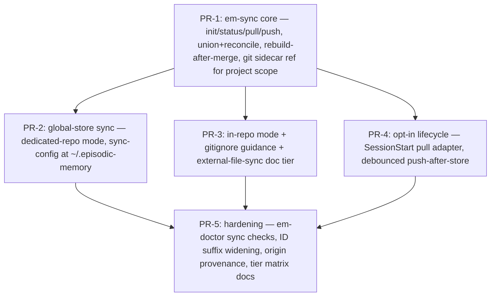

# RFC-013 — Episode Sync: Cross-Host Replication of Project and Global Episode Stores

## AI context

> This RFC adds `em-sync` — opt-in, transport-pluggable replication of episode stores across hosts, so every coding-harness instance working on the same repo (and every machine sharing one user's global store) sees the same episodes. It solves the problem that both store scopes are strictly host-local today: a fresh clone or a second machine starts blind, workplan discovery fails, and lessons learned on one host never reach another. The key design decision is that only durable episode content replicates (episode files + archive); every derived index and every usage counter stays host-local and is rebuilt after merge, which reduces sync to a near-trivial file union plus a small deterministic reconcile step — no server, no daemon, no second data layer (Principles 1, 6).

---

## Problem

Both episode stores are directories on one machine's disk and nothing else:

- **Project scope** — `<repo>/.episodic-memory/` is resolved per working copy (`lib/local-dir.mjs`). It is not committed, not pushed, and not part of any distribution path. Two harnesses working the same repository from different hosts (a laptop, a CI runner, a Claude Code on the Web container, a teammate's machine) each accrete a private, divergent store. A fresh remote container clones the repo and finds **no episodes at all**: the session-start workplan discovery documented in `CLAUDE.md` (`em-search --tag workplan --category decision …`) returns empty on every host that did not author the workplan.
- **Global scope** — `~/.episodic-memory/` holds cross-project lessons, playbooks, and promoted knowledge (RFC-012), all trapped on the machine that learned them. A user working from two machines maintains two disjoint "global" memories.

Observable consequences today:

1. A decision stored on host A is invisible to the harness on host B doing the same work an hour later; B re-litigates or contradicts it.
2. Revision chains fork: B, unaware of A's episode, stores a fresh (unlinked) episode instead of revising, so the supersedes chain no longer identifies a single current truth.
3. RFC-009 lesson activation and RFC-012 promotion only ever see one host's evidence, undercounting recurrence.

There is no supported mechanism — documented or scripted — to move a store between hosts other than hand-copying the directory, which also copies host-local artifacts (`index.jsonl` usage counters, locks) that must not be shared and conflict when they are.

---

## Proposal

Add a **replication capability** for episode stores: a zero-dependency `scripts/em-sync.mjs` CLI operating per store (project or global), a per-store `sync-config.json` written only by explicit `em-sync init` consent, and a pluggable transport layer whose reference implementation is git (already present on every host this project targets). No daemon, no server, no new data layer: sync is an operation *over episode files*, and everything else in the store is rebuilt locally after a merge.

### 1. The replication model: synced set vs host-local set

The store partitions cleanly (verified by runtime probes, §"Runtime evidence"):

| Store artifact | Class | Sync? | Why |
|---|---|---|---|
| `episodes/*.md` | durable content | **yes** | the substrate itself |
| `archived/*.md`, `archived-index.jsonl` | durable content | **yes** | archival is a curation outcome, not host state |
| `index.jsonl` | derived + host telemetry | no | rebuilt by `em-rebuild-index`; carries `access_count` / `last_accessed` / `feedback`, which are per-host usage signals |
| `tags.json`, `category-index.json`, `tokens.json` | derived | no | fully rebuilt from episode files |
| locks, `installs.json`, `dist/`, enforcement config | host/distribution state | never | meaningless or harmful on another host |

Because the synced set is (a) append-mostly and (b) sufficient to regenerate everything else, **sync = union of episode files + local `em-rebuild-index`**. The probe in §"Runtime evidence" demonstrates exact convergence: copying only `episodes/*.md` from replica A into replica B and rebuilding makes both episodes searchable on B with correct metadata, no index file ever traveling.

Usage counters deliberately stay host-local in v1: they are relevance telemetry about *this host's* sessions, they merge poorly (sums need CRDT bookkeeping), and losing them costs only ranking nuance. OQ-3 tracks a future merge rule.

### 2. Merge semantics: union + deterministic reconcile

Episode IDs are immutable and corrections are revision chains (Principle 7), so the store is *nearly* a grow-only set — but runtime probing shows three real mutation classes that a naive "immutable files, pure union" design would corrupt. The reconcile step handles each deterministically:

| Divergence on the same episode ID | Cause | Reconcile rule |
|---|---|---|
| `status: active` vs `status: superseded` in frontmatter | `em-revise` flips the *original* file's status in place (probe-verified, §"Runtime evidence") | **Recompute, don't choose:** after union, `status` is derivable — an episode is `superseded` iff any episode in the merged set carries `supersedes: <id>`. Reconcile recomputes status from the supersedes graph; both replicas converge regardless of merge order. |
| `pinned: true` vs absent/false | `em-pin` / `--pin` writes frontmatter + index | **Pin wins.** Not derivable, so a conservative monotone rule: protection is never lost by syncing. A deliberate unpin propagates by running `em-pin --unpin` *after* a sync round (documented; OQ-1 revisits if this bites). |
| present in `episodes/` on one replica, `archived/` on the other | `em-prune` moves files | **Archived wins** when the transport preserves moves (git does: the move is a tracked delete+add and merges as such). Dumb file-sync transports can resurrect archived episodes on union — an honest, documented WEAK-tier caveat (Principle 5), detectable by `em-doctor` (same ID present in both directories). |
| any other byte difference | should never happen (bodies are immutable by convention) | **Quarantine, never overwrite:** the losing variant is preserved at `<store>/sync/conflicts/<id>.<replica>.md`, `em-sync status` and `em-doctor` flag it, and resolution is a human/agent decision — mirroring `em-move`'s found-in-both-scopes hard-error stance (RFC-005 F3). |

After every merge: acquire the store lock (`lib/lock.mjs`), run reconcile, run `em-rebuild-index --scope <s>` (atomic temp+rename already), release. Sync never edits an episode body and never mints an ID.

Note the common case is trivial: a file changed on **one** replica only (every new episode, every revision made on a single host) unions/merges cleanly with no reconcile decision at all. The rules above cover the rare concurrent-touch cases.

### 3. `em-sync.mjs` — the CLI contract

Zero external dependencies, JSON to stdout, degrades gracefully (missing config → `{"status":"not-configured"}`, exit 0 on status/read paths).

```
node scripts/em-sync.mjs init   [--scope local|global] [--transport git] [--mode sidecar|in-repo|repo <url>] [--remote <name|url>]
node scripts/em-sync.mjs status [--scope local|global|all]      # ahead/behind/conflicts, never writes
node scripts/em-sync.mjs pull   [--scope ...]                   # fetch → union+reconcile → rebuild index
node scripts/em-sync.mjs push   [--scope ...]                   # publish local episodes (fetch-merge-retry loop on races)
node scripts/em-sync.mjs sync   [--scope ...]                   # pull then push
node scripts/em-sync.mjs disable [--scope ...] [--purge-remote-config]
```

Per-store config at `<store>/sync-config.json` (project) and `~/.episodic-memory/sync-config.json` (global):

```json
{
  "transport": "git",
  "mode": "sidecar",
  "remote": "origin",
  "ref": "refs/em/sync",
  "auto_pull_on_session_start": false,
  "auto_push_after_store": false,
  "replica_id": "<hostname>-<8hex>"
}
```

`sync-config.json` is host-local (never synced) and exists only after explicit `em-sync init` consent. No config → every subcommand is a no-op with a status token, so sync-unaware hosts are unaffected.

### 4. Transports and modes (with honest capability tiers)

The transport is a plugin seam (`sync-transport` plugin type, experimental tier per CAPABILITIES.md); git ships as the reference implementation because it is already installed on every host running a coding harness, solves auth/transport/history for free, and adds zero dependencies.

| Mode | Scope | Mechanism | Tier | Trade-off |
|---|---|---|---|---|
| **git sidecar ref** (default) | project | episodes live on a dedicated ref (`refs/em/sync`, materialized in a hidden worktree or via plumbing) pushed/fetched over the repo's **existing** `origin` | STRONG | memory rides the remote the team already shares — any host that can clone the repo can sync episodes — without polluting code branches or the working tree |
| **git in-repo** | project | `.episodic-memory/episodes/` + `archived/` committed on normal branches; derived indexes gitignored | MEDIUM | simplest possible ("memory arrives with `git pull`"), and team-visible by design — but couples memory history to code history, needs team consent, and parallel sessions create merge commits in the code repo |
| **git dedicated repo** | project or global | a separate (typically private) repository holds the synced set; global default: `~/.episodic-memory` synced set tracks e.g. `git@…:me/em-global-store.git` | STRONG | full isolation from the code repo; one more remote to provision |
| **external file-sync** (Syncthing/Dropbox/rsync) | either | user syncs *only* the synced-set directories | WEAK | works *because* derived indexes are host-local, but move/archive semantics degrade (resurrection caveat, §2) and conflict copies need `em-doctor` cleanup |

Project-scope `.gitignore` guidance ships with `init`: in every mode, `index.jsonl`, `tags.json`, `category-index.json`, `tokens.json`, locks, and `sync-config.json` are ignored; only the synced set is ever tracked.

Multi-writer races (two hosts pushing concurrently) are handled the boring way: `push` runs a bounded fetch→merge→retry loop; since merges are unions plus deterministic reconcile, retries always converge.

### 5. Activation lifecycle — no daemons (Principle 6)

- **Default:** manual. `em-sync pull` at session start and `em-sync push` when done are the documented workflow; the skill/instructions files gain one line each.
- **Opt-in session-start pull:** mirrors the existing `auto_update` pattern (`em-sync-install.mjs` + SessionStart hook): one bounded pull attempt per session start, single-line `notice` in session output, degrade-to-token on any failure, never blocks a session. Per-project registration only (Principle 12) for project scope.
- **Opt-in push-after-store:** a debounced push (fire at session end or N minutes after the last `em-store`, whichever first) — declared trigger, declared cost, off by default.
- Explicitly rejected: any polling daemon, watcher service, or background timer not user-started and bounded.

### 6. Consent, privacy, reversibility (Principles 3, 10)

- `em-sync init` declares its side effects before writing anything: config file created, refs/remotes touched, gitignore lines proposed, and — most important — **"pushing publishes these episodes to `<remote>`; anyone with read access to that remote can read them."** Project episodes routinely contain repo-internal reasoning; the default posture is the repo's own remote (same audience as the code) or a private dedicated repo, and the warning is unconditional.
- `em-sync disable` removes the config and (optionally) the local sidecar plumbing; it never deletes episodes, local or remote. Round-trip restores the pre-init state.
- Sync never activates enforcement, and enforcement never depends on sync (Principle 12 I-4: the substrate — now including its replication — stays hook-free at core; the optional SessionStart pull is an adapter, registered per-project).

### 7. Identity and provenance across hosts

- Episode IDs (`<ts>-<slug>-<4 hex>`) are minted independently per host. Same-second, same-slug, same-2-byte-suffix collisions are now possible across replicas (~1/65536 given identical second+slug). Two hardening steps: (a) `em-store` widens the random suffix to 4 bytes (backward-compatible: IDs only ever grow, existing IDs untouched); (b) sync treats same-ID-different-body as a quarantine conflict (§2), so even a collision cannot silently overwrite.
- New episodes written in a sync-enabled store carry an `origin: <replica_id>` frontmatter field — pure provenance (debugging "where did this decision come from", RFC-012 recurrence counting across hosts), never used for ranking.

### 8. Where this sits in the architecture

By the CAPABILITIES.md test — *"if it operates ON episodes it belongs to a capability family"* — sync is a substrate capability, not distribution (distribution "moves artifacts, it never touches episodes"). It joins the **curation strategy** family: it maintains the corpus across replicas, derives no new knowledge, changes no ranking, enforces nothing, and honors the family invariant of reversibility (quarantine over overwrite, disable over delete). The transport seam registers as a new **experimental-tier plugin type `sync-transport`** (RFC-008 R8 additive MINOR bump), with `git` as the default member and the promote-or-remove decision date set at acceptance.

### Scope

- **In scope:** `em-sync.mjs` (init/status/pull/push/sync/disable); union+reconcile merge; git transport (sidecar-ref, in-repo, dedicated-repo modes); global-store sync; opt-in session-start pull / push-after-store; `em-doctor` sync checks; ID-suffix widening + `origin` provenance; docs/tier matrix.
- **Out of scope:** real-time sync or daemons; syncing usage counters (`access_count`/`feedback` — OQ-3); syncing derived indexes, locks, registry, dist cache, or enforcement config; multi-user permission models beyond what the remote's ACL provides; conflict *resolution* UI (quarantine + doctor flag only); non-git transports beyond the documented external-file-sync guidance.

---

## Alternatives considered

| Alternative | Why rejected |
|---|---|
| Central sync server / API (self-hosted or SaaS) | Second store + background service: violates Principle 1 (episodes stop being the only data layer) and Principle 6 (long-lived process); adds auth/ops burden the git remote already solves. |
| Sync the whole store directory (including `index.jsonl`, `tags.json`, …) | Derived indexes conflict on every concurrent session (append-ordered `index.jsonl`, whole-file JSON rewrites) and carry host telemetry; syncing them buys nothing since `em-rebuild-index` regenerates them from the synced set — probe-verified. |
| CRDT database / sidecar (e.g. Automerge store) | The episode model is *already* a natural grow-mostly set with revision chains; a CRDT engine imports a dependency and a second data representation for a problem three reconcile rules solve. Principle 1 trigger without the "cannot be expressed as episodes" condition being met. |
| In-repo commit as the *only* mode | Forces memory into code history and requires team-wide consent as a precondition for any sync at all; sidecar ref gives the same reach (same remote, same credentials) without the coupling. Kept as an explicit mode, not the default. |
| Documentation-only answer ("rsync/Syncthing the directory yourself") | Hand-syncing the full directory corrupts host-local state (counters, locks) and silently resurrects archived episodes; without the synced/host-local partition and reconcile rules there is no correct directory set to point a file-syncer at. Retained only as the documented WEAK tier over the *synced set*. |
| Object storage transport (S3 etc.) as reference implementation | New credentials + SDK or hand-rolled signing; git is universally present on target hosts and gives history/audit for free. Admissible later as a `sync-transport` plugin. |

---

## Implementation plan

> To be finalized when the RFC moves to `accepted`; proposed phasing below.

### Sequencing



---

## Implementation

| PR/Commit | Files changed | Tests | Notes |
|---|---|---|---|
| _pending_ | _pending_ | _pending_ | _pending_ |

---

## Runtime evidence

Per the repo convention (behavior simulation before design claims), the load-bearing claims were probed against isolated fixture stores (non-git scratch dirs, `--scope local`, explicit `cwd`), 2026-07-14:

1. **Union + rebuild converges; derived indexes never travel.** Two replicas each stored one episode; copying only `episodes/*.md` from A into B and running `em-rebuild-index --scope local` on B yielded `{"status":"ok","rebuilt":[{"scope":"local","count":2,…}]}` and `em-search` on B returned both episodes with correct tags/category/status — no index file was copied.
2. **Cross-replica revision chains resolve.** `em-revise` on B against the A-authored ID returned `{"status":"ok","id":"20260714-224110-revised-on-host-b-e810","supersedes":"20260714-224042-episode-written-on-host-a-ace2",…}` and `em-search --history` showed the full two-link chain with the original `status: superseded`.
3. **Episode files are not byte-immutable — reconcile is required.** After the revision on B, `diff` of the *original* episode file across replicas showed exactly one line: `status: active` (A) vs `status: superseded` (B). This is the concrete basis for the recompute-status reconcile rule (§2) and the reason pure "immutable union" designs are wrong for this store.

---

## Related RFCs

- **RFC-005 (em-move)** — establishes ID-preserving relocation and the found-in-both-places hard-error stance that §2's quarantine rule mirrors; scope moves are a mutation class sync must survive.
- **RFC-008 (decoupled enforcement)** — sync is substrate-side and hook-free at core; the optional SessionStart pull follows RFC-008's per-project adapter discipline and the `sync-transport` plugin type rides its plugin registry (R8).
- **RFC-009 / RFC-012 (lesson activation, promotion arc)** — direct beneficiaries: cross-host recurrence becomes visible to promotion, and lessons activate on every replica, not just the authoring host.

---

## Second opinion

> Required before `status: accepted` can be set.

**Reviewer:** <!-- name or "self-review" -->
**Date:** <!-- YYYY-MM-DD -->
**Findings:** <!-- gaps surfaced, alternatives missed, risks not captured — or "no gaps found" -->
**AI-slop check:** <!-- clean | fixed in revision | concerns:[<list>] -->
**Decision:** <!-- proceed | revise first -->

---

## Open questions

| # | Question | Owner | Status |
|---|---|---|---|
| OQ-1 | Is monotone pin-wins acceptable, or does concurrent unpin-vs-pin need a timestamped rule? | — | open |
| OQ-2 | Sidecar ref materialization: hidden linked worktree vs pure plumbing (`git hash-object`/`mktree`/`commit-tree`)? Worktree is simpler; plumbing avoids any on-disk checkout of episode history. | — | open |
| OQ-3 | Should `feedback`/`access_count` eventually merge (e.g. per-replica counters summed at read time)? Host-local in v1. | — | open |
| OQ-4 | Team semantics for project scope: is the sidecar ref shared by all collaborators of the remote by default, and does that need a partition (per-user namespaces under `refs/em/`)? | — | open |
| OQ-5 | Does `em-move` (local↔global) need sync-awareness, e.g. a tombstone in the source scope so a move isn't undone by a stale replica's push? | — | open |

---

## Deferral note

> Populate only if status changes to `deferred`.

---

## Withdrawal note

> Populate only if status changes to `withdrawn`.

---

## Supersession note

> Populate only if status changes to `superseded`.
