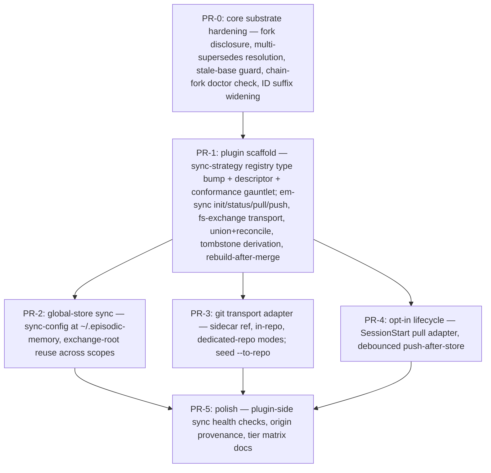

# RFC-013 — Episode Sync: Cross-Host Replication of Project and Global Episode Stores

## AI context

> This RFC adds `em-sync` — opt-in, transport-pluggable replication of episode stores across hosts, so every coding-harness instance working on the same repo (and every machine sharing one user's global store) sees the same episodes. It solves the problem that both store scopes are strictly host-local today: a fresh clone or a second machine starts blind, workplan discovery fails, and lessons learned on one host never reach another. The key design decision is twofold: only durable episode content replicates (derived indexes and usage counters stay host-local and are rebuilt after merge, reducing sync to file union plus a small deterministic reconcile), and the reference transport is a **plain-filesystem exchange directory driven by Node stdlib only** — no server, no daemon, no second data layer, and no external binary; git is an optional transport adapter, honestly labeled as the dependency it is (Principles 1, 5, 6). The whole capability ships as an **opt-in plugin** (`plugins/episode-sync/`, new `sync-strategy` plugin type): users who don't want distributed memory never see a single sync surface, and only probe-justified single-host bug fixes (fork disclosure, stale-base guard) land in core.

---

## Problem

Both episode stores are directories on one machine's disk and nothing else:

- **Project scope** — `<repo>/.episodic-memory/` is resolved per working copy (`lib/local-dir.mjs`). It is not committed, not pushed, and not part of any distribution path. Two harnesses working the same repository from different hosts (a laptop, a CI runner, a Claude Code on the Web container, a teammate's machine) each accrete a private, divergent store. A fresh remote container clones the repo and finds **no episodes at all**: the session-start workplan discovery documented in `CLAUDE.md` (`em-search --tag workplan --category decision …`) returns empty on every host that did not author the workplan.
- **Global scope** — `~/.episodic-memory/` holds cross-project lessons, playbooks, and promoted knowledge (RFC-012), all trapped on the machine that learned them. A user working from two machines maintains two disjoint "global" memories.

Observable consequences today:

1. A decision stored on host A is invisible to the harness on host B doing the same work an hour later; B re-litigates or contradicts it.
2. Revision chains fork: B, unaware of A's episode, stores a fresh (unlinked) episode instead of revising, so the supersedes chain no longer identifies a single current truth.
3. RFC-009 lesson activation and RFC-012 promotion only ever see one host's evidence, undercounting recurrence.

There is no supported mechanism — documented or scripted — to move a store between hosts other than hand-copying the directory, which also copies host-local artifacts (`index.jsonl` usage counters, locks) that must not be shared and conflict when they are.

---

## Proposal

Add a **replication capability** for episode stores — packaged as an **opt-in plugin, not core**. Not every user wants distributed episodic memory, and they should never see it: a default install carries zero sync code, zero sync config surface, zero new commands. The capability ships as plugin `plugins/episode-sync/` under a new plugin type (§8); installing the plugin *is* the consent act (Principle 3), and uninstalling it removes every artifact (Principle 10). What lands in core is only the substrate hardening this work surfaced — fork disclosure, multi-`supersedes` resolution, the stale-base guard, ID-suffix widening — each justified by single-host defects the probes demonstrated *without* any sync involved (§"Runtime evidence" 4–6: a lone host can mint a forked chain today).

The plugin provides: a zero-dependency `em-sync.mjs` CLI operating per store (project or global), a per-store `sync-config.json` written only by explicit `em-sync init` consent, and a pluggable transport layer. The **reference transport is `fs-exchange`**: a shared exchange directory on any medium the user already has (a Syncthing/Dropbox/OneDrive-synced folder, an NFS/SMB mount, a cloud-drive mount, a USB stick), driven entirely by Node `fs`/`crypto` stdlib. Git is **not required**; it is available as an opt-in transport plugin for users whose only shared endpoint is their repo's remote — declared honestly as an external-binary dependency (Principle 5), never as "zero-dep". No daemon, no server, no new data layer: sync is an operation *over episode files*, and everything else in the store is rebuilt locally after a merge.

### 1. The replication model: synced set vs host-local set

The store partitions cleanly (verified by runtime probes, §"Runtime evidence"):

| Store artifact | Class | Sync? | Why |
|---|---|---|---|
| `episodes/*.md` | durable content | **yes** | the substrate itself |
| `archived/*.md`, `archived-index.jsonl` | durable content | **yes** | archival is a curation outcome, not host state |
| `index.jsonl` | derived + host telemetry | no | rebuilt by `em-rebuild-index`; carries `access_count` / `last_accessed` / `feedback`, which are per-host usage signals |
| `tags.json`, `category-index.json`, `tokens.json` | derived | no | fully rebuilt from episode files |
| locks, `installs.json`, `dist/`, enforcement config | host/distribution state | never | meaningless or harmful on another host |

Because the synced set is (a) append-mostly and (b) sufficient to regenerate everything else, **sync = union of episode files + local `em-rebuild-index`**. The probe in §"Runtime evidence" demonstrates exact convergence: copying only `episodes/*.md` from replica A into replica B and rebuilding makes both episodes searchable on B with correct metadata, no index file ever traveling.

**Backfill is by construction, not a migration step.** The synced set is the *entire current store* — every past episode already accumulated (design decisions, workplans, violations, lessons) — never a from-now-on stream. A replica's first `push` publishes its full corpus; a brand-new host's first `pull` receives all of it. There is no separate import/export tool and no cutover date: the existing store on the machine that has been accreting this project's memory *is* the seed, and enabling sync on it makes the whole history the payload. This matters because the accumulated corpus — not future episodes — is what agents joining the project are currently blind to.

Usage counters deliberately stay host-local in v1: they are relevance telemetry about *this host's* sessions, they merge poorly (sums need CRDT bookkeeping), and losing them costs only ranking nuance. OQ-3 tracks a future merge rule.

### 2. Merge semantics: union + deterministic reconcile

**Invariant — episode identity is global.** An episode's ID is minted exactly once, at first store, on the authoring host, and is byte-identical on every replica forever: sync never mints, renames, renumbers, or re-slugs an ID, in any direction, under any conflict rule (the quarantine path preserves both *contents* but never forks the *ID*). This is load-bearing, not cosmetic — `supersedes` chains, `--evidence`/`--lesson` linkage, MEMORY.md anchors, and RFC-012 provenance are all ID references, and they must resolve identically on whichever host they are read. It extends RFC-005's ID-preserving discipline (built for local↔global moves) across the host boundary.

Episode IDs are immutable and corrections are revision chains (Principle 7), so the store is *nearly* a grow-only set — but runtime probing shows three real mutation classes that a naive "immutable files, pure union" design would corrupt. The reconcile step handles each deterministically:

| Divergence on the same episode ID | Cause | Reconcile rule |
|---|---|---|
| `status: active` vs `status: superseded` in frontmatter | `em-revise` flips the *original* file's status in place (probe-verified, §"Runtime evidence") | **Recompute, don't choose:** after union, `status` is derivable — an episode is `superseded` iff any episode in the merged set carries `supersedes: <id>`. Reconcile recomputes status from the supersedes graph; both replicas converge regardless of merge order. |
| `pinned: true` vs absent/false | `em-pin` / `--pin` writes frontmatter + index | **Pin wins.** Not derivable, so a conservative monotone rule: protection is never lost by syncing. A deliberate unpin propagates by running `em-pin --unpin` *after* a sync round (documented; OQ-1 revisits if this bites). |
| present in `episodes/` on one replica, `archived/` on the other | `em-prune` moves files | **Archived wins, carried by tombstones** (§4): every em-sync transport records the archive-move as an explicit tombstone entry, so no replica can resurrect a pruned episode by re-offering the pre-move file. (Pointing a raw file-sync tool at the store *without* em-sync lacks tombstones and can resurrect — the documented WEAK caveat, Principle 5, detectable by `em-doctor`.) |
| any other byte difference | should never happen (bodies are immutable by convention) | **Quarantine, never overwrite:** the losing variant is preserved at `<store>/sync/conflicts/<id>.<replica>.md`, `em-sync status` and `em-doctor` flag it, and resolution is a human/agent decision — mirroring `em-move`'s found-in-both-scopes hard-error stance (RFC-005 F3). |

After every merge: acquire the store lock (`lib/lock.mjs`), run reconcile, run `em-rebuild-index --scope <s>` (atomic temp+rename already), release. Sync never edits an episode body and never mints an ID.

Note the common case is trivial: a file changed on **one** replica only (every new episode, every revision made on a single host) unions cleanly with no reconcile decision at all. The rules above cover the rare concurrent-touch cases.

#### 2.1 Concurrent supersession across the network: forks are first-class, not edge cases

The scenario: agent A revises decision E on one host while agent B revises the *same* E on another, before either syncs. After merge, every replica legitimately contains E (`superseded`) plus **two active heads** with contradictory content, both carrying `supersedes: E`. Runtime probes (§"Runtime evidence" 4–6) show the substrate's current behavior is *silence in three places*: plain search returns both heads as `active` with no conflict signal; `em-search --history` silently walks **one** branch and presents a clean linear chain (an agent asking "what is current?" gets a confident wrong answer); `em-revise` happily accepts an already-superseded original and mints a third head; and `em-doctor` has no multi-head check (only a dangling-pointer warn). The fork itself is legitimate concurrency — the defect is that nothing discloses it. Five design rules:

- **D-1 Detection is free at merge time.** Reconcile already builds the supersedes graph to recompute `status` (§2); a fork is simply >1 non-superseded episode referencing the same ancestor. `em-sync pull`/`status` output gains `forks: [{root, heads: [...]}]`, and `em-doctor` gains the same graph check as a standing `chain-fork` warning.
- **D-2 Read surfaces disclose, always.** `em-search --history` walks **all** branches and emits `forked: true` with every head; plain search marks each head `fork_of: <root>`. An agent can no longer read a linearized lie.
- **D-3 Resolution is an episode, not an edit (P7).** `em-revise` accepts repeated `--original`: the resolution episode carries `supersedes: [headA, headB]` and closes the fork the same way every correction has ever worked — by superseding. The graph-based status recompute needs zero changes (an episode is superseded iff *any* supersedes edge references it); frontmatter readers accept scalar or list (OQ-6).
- **D-4 Nothing auto-resolves.** The heads differ in *content* — picking one is a decision, and the substrate never decides (P11). The advisory plane (RFC-009 activation; RFC-014 M2 feed) surfaces "decision X has 2 active heads" as a bounded pointer to the agent or human who owns the call. Until resolved, heads render in deterministic (lexicographic-ID) order so all replicas at least *display* identically — explicitly a presentation rule, never a truth rule.
- **D-5 Prevention is a freshness race, so make staleness loud.** `em-revise` gains a stale-base guard: revising an episode the local index already shows as superseded errors with the current head's ID (`--allow-fork` overrides for a deliberate branch). Its cross-host effectiveness equals the host's freshness — which is precisely what RFC-014's live feed buys: the fork window shrinks from "until next pull" to seconds. It never reaches zero; D-1–D-4 are the backstop, not the feed.

### 3. `em-sync.mjs` — the CLI contract

Zero external dependencies — Node stdlib only, including the reference transport. JSON to stdout, degrades gracefully (missing config → `{"status":"not-configured"}`, exit 0 on status/read paths).

```
node plugins/episode-sync/em-sync.mjs init   [--scope local|global] [--transport fs-exchange|git] [--exchange-root <dir>] [git transport: --mode sidecar|in-repo|repo <url>]
node plugins/episode-sync/em-sync.mjs status [--scope local|global|all]   # ahead/behind/conflicts, never writes
node plugins/episode-sync/em-sync.mjs pull   [--scope ...]                # ingest foreign replicas → union+reconcile → rebuild index
node plugins/episode-sync/em-sync.mjs push   [--scope ...]                # refresh this replica's published subtree
node plugins/episode-sync/em-sync.mjs sync   [--scope ...]                # pull then push
node plugins/episode-sync/em-sync.mjs live   [--scope ...]                # session-scoped realtime client (mode: realtime, §5)
node plugins/episode-sync/em-sync.mjs disable [--scope ...]
```

(The `em sync <cmd>` umbrella alias registers only while the plugin is installed; on a plugin-free install the subcommand does not exist.) The plugin imports core libs (`lib/lock.mjs`, `lib/local-dir.mjs`, spawns `em-rebuild-index`); nothing in `scripts/` references the plugin (Principle 9). Tombstones honor the same direction: core `em-prune`/`em-move` emit **nothing** — the plugin *derives* tombstones at push time by diffing the store against its own last-published manifest (an ID that was under `episodes/` and is now under `archived/` ⇒ archive tombstone), so core scripts stay sync-unaware.

Per-store config at `<store>/sync-config.json` (project) and `~/.episodic-memory/sync-config.json` (global):

```json
{
  "transport": "fs-exchange",
  "exchange_root": "/path/to/shared/em-exchange",
  "mode": "manual",
  "replica_id": "<hostname>-<8hex>"
}
```

`sync-config.json` is host-local (never synced) and exists only after explicit `em-sync init` consent. No config → every subcommand is a no-op with a status token, so sync-unaware hosts are unaffected.

### 4. Transports — reference implementation is plain filesystem, stdlib-only

#### 4.1 `fs-exchange` (default, core)

The "remote" is nothing but a directory all replicas can reach — *how* it is shared is the user's business (Syncthing, Dropbox, OneDrive, iCloud, an NFS/SMB mount, a cloud-drive FUSE mount, a USB stick carried between machines). em-sync itself performs only local `fs` operations against it:

```
<exchange-root>/
  em-exchange.json                    # format marker: { format: "em-exchange", version: 1 }
  replicas/
    <replica_id>/
      manifest.json                   # the COMMIT POINT: { seq, written_at, files: { "<relpath>": "<sha256>" } }
      episodes/<id>.md                # full mirror of this replica's synced set
      archived/<id>.md
      archived-index.jsonl
      tombstones.jsonl                # append-only: { id, action: "archived"|"moved-scope", ts, replica }
```

Three rules give dumb storage strong semantics:

- **Single writer per subtree.** A replica writes *only* `replicas/<own-id>/` and reads all others. There is no cross-host write contention anywhere on the shared medium — no locking protocol, no push races, no retry loop. Team/multi-agent use is namespaced by construction.
- **Manifest is the commit point.** `push` writes content files first (temp + rename), the manifest last; `pull` verifies each foreign subtree against its manifest checksums and, on any mismatch (the underlying medium propagated a partial state), skips that replica *this round* and reports it — degrade and retry later, never ingest a torn write.
- **Tombstones make moves first-class.** `em-prune` archival and `em-move` scope relocation publish explicit tombstone entries, so a stale replica's re-offer of the pre-move file loses deterministically (§2). This is what raw folder-syncing of the store could never express — and it is transport-independent, so *every* em-sync transport inherits it.

`pull` = for each foreign subtree with a consistent manifest: union episode files, apply tombstones, reconcile (§2), rebuild index. `push` = refresh own subtree to mirror the local synced set (incremental via manifest checksum diff). Storage cost is `replicas × synced-set size` — markdown-cheap; a replica may compact its own subtree at will (it is its only writer). OQ-2 tracks delta bundles if mirrors ever get heavy.

#### 4.2 Transport plugins (opt-in, honestly labeled)

Transports are adapters *inside* the episode-sync plugin, declared in its manifest — not separate registry entries. `fs-exchange` is the plugin's built-in default; the others trade the "any shared folder" requirement for other reach, and each declares its true dependencies:

| Transport | Scope | Mechanism | Dependencies | Tier |
|---|---|---|---|---|
| **fs-exchange** (default) | both | exchange directory on any user-shared medium | Node stdlib only | STRONG semantics; propagation latency is the medium's |
| **git plugin** — sidecar ref / in-repo / dedicated repo | project or global | exchange payload carried on a dedicated ref (`refs/em/sync`) of the repo's existing `origin`, committed in-repo, or in a separate private repo | **external `git` binary** + a reachable remote | STRONG; the honest fit for hosts whose *only* shared endpoint is the repo remote (CI runners, ephemeral web containers) |
| **https-exchange plugin** | both | same exchange format over WebDAV / S3-compatible storage via stdlib `fetch` + `crypto` signing | stdlib + a provisioned endpoint & credentials | MEDIUM until proven |
| raw file-sync of the store, no em-sync | either | pointing a sync tool directly at `episodes/` | — | WEAK: no tombstones (resurrection), no reconcile (conflict copies), documented for what it is |

#### 4.3 Transfer granularity: file-based delta, deliberately not block-based

Incremental transfer is rsync-*like* at **file granularity**: `push`/`pull` diff manifest sha256 maps and move only files whose checksum differs — after the first backfill, a sync round transfers exactly the episodes that changed, typically a handful of small markdown files. **Block-based** delta (rsync's rolling-checksum algorithm, which ships changed byte ranges *within* a file) is deliberately rejected: it earns its complexity on large files that mutate internally, and this corpus is the opposite shape — thousands of small (~KB) write-once files whose only in-place mutations are one-line frontmatter flips (§2). The break-even is never reached; whole-file transfer of a changed episode costs less than computing its rolling checksums. If replica mirrors ever get heavy the pressure shows up as *storage*, not transfer, and the remedy is content-addressing across subtrees (identical episodes stored once, manifests pointing at blobs) — tracked in OQ-2, still file-granular.

#### 4.4 Day-zero seeding: the repo working tree as a read-complete replica

Every transport above assumes the participating host can reach *some* medium. But for **project scope** there is one medium every agent already holds before any sync machinery exists: **the repository clone itself**. `em-sync seed --to-repo` copies the synced set (episodes + archived + tombstones — never indexes, counters, locks, or `sync-config.json`) into the version-controlled `.episodic-memory/` of the working tree, with the host-local set gitignored. From then on **every clone is a read-complete replica at clone time**: session start runs `em-rebuild-index` (cheap, local) and the entire accumulated corpus — past design decisions, workplans, lessons — is searchable with zero transports configured, zero dependencies, zero reachability requirements. This is the fix for the observed day-zero failure (this RFC was itself authored in an ephemeral container where `CLAUDE.md`'s session-start workplan discovery returned empty, because the corpus existed only on the maintainer's machine).

Two honest boundaries (Principle 5): seeding is **team-visible by design** — the corpus enters the repository and its access control becomes the repo's — so `seed` is a consent-gated, explicit act with the same unconditional publish warning as any push; and the seeded copy is a **read tier** — an agent's *new* episodes land as untracked files in the seeded directory, and write-back travels by whatever path the agent's work already travels (committed alongside its changes — memory riding the same PR as the code it explains — or any §4 transport). Seed + fs-exchange compose cleanly: seed answers "can a fresh host read the past *right now*"; transports answer "how do hosts continuously exchange the present".

One deployment reality stated plainly (Principle 5): the fs-exchange medium must be reachable by every participating host. A laptop fleet shares a Syncthing folder trivially; an **ephemeral CI or remote-web container usually cannot mount one** — its only pre-provisioned shared endpoint is the repo's git remote. For those hosts the git plugin (or an https-exchange endpoint) is the practical medium; that is a deployment constraint of such hosts, not a git requirement in the design.

### 5. Sync modes — latency is a per-store choice, not a fixed posture (Principle 6)

One store, three named modes in `sync-config.json` (`"mode"`); hosts choose independently and interoperate freely, because every mode reduces to the same exchange operations — a `realtime` host and a `manual` host converge exactly like any two replicas.

| Mode | Inbound | Outbound | Convergence latency | Requires | Idle cost |
|---|---|---|---|---|---|
| **`manual`** (default) | `em-sync pull` when invoked | `em-sync push` when invoked | next explicit invocation | any transport | zero — nothing runs, ever |
| **`session`** | one bounded pull at session start (the `auto_update` hook pattern: single attempt, one-line `notice`, degrade-to-token, never blocks; per-project registration only, P12) | debounced push — session end or N minutes after the last store, whichever first | one session boundary | any transport | zero between sessions; two bounded actions per session |
| **`realtime`** | standing SSE subscription to `em-serve` (RFC-014 M2), events ingested as they arrive | immediate push-on-store | seconds, end to end | the server component + `em-sync live` running | one parked socket + one `fs.watch`, session-scoped; zero tokens while quiet |

**`em-sync live` — the realtime client, session-scoped by construction.** One process in the `em-console` mold: started at session start (explicitly, or by the consented SessionStart adapter when `mode: "realtime"`, OQ-9), prints its single startup JSON line, and exits with the session (idle-timeout as backstop). It does two things: holds the M2 SSE subscription and ingests events per the delivery contract (idempotent by ID, dangling-tolerant, body fetched on demand); and watches the local `episodes/` directory with `fs.watch` — the mechanism P6 *names as the preferred listener* — pushing each new episode file as it lands, no debounce, no polling. Core stays untouched: `em-store` doesn't know it's being watched (P9); the watcher observes the filesystem, exactly like tombstone derivation observes manifests.

**Degradation ladder, stated:** `realtime` with the server unreachable behaves as `session` (the client retries the subscription with backoff, syncs on session boundaries regardless, and says so in `em-sync status`); `session` with the medium unreachable behaves as `manual` (the hook degrades to its status token). No mode ever blocks a write or a session — writes are always local-first in every mode.

Explicitly rejected still: any process that outlives sessions without being a user-installed service (that is `em-serve`'s consented territory, RFC-014 §6), any polling loop against the medium in any mode, and any watcher on the *exchange root* (inbound realtime goes through the server's push channel precisely so no client ever polls a shared folder).

### 6. Consent, privacy, reversibility (Principles 3, 10)

- `em-sync init` declares its side effects before writing anything: config file created, exchange subtree created, and — most important — **"pushing publishes these episodes to `<exchange-root|remote>`; anyone with read access to that location can read them."** Project episodes routinely contain repo-internal reasoning; the warning is unconditional, whatever the transport.
- `em-sync disable` removes the config; it never deletes episodes, local or remote (the replica's published subtree is left for other replicas unless `--purge-published` is passed explicitly). Round-trip restores the pre-init state.
- Sync never activates enforcement, and enforcement never depends on sync (Principle 12 I-4: the substrate — now including its replication — stays hook-free at core; the optional SessionStart pull is an adapter, registered per-project).

### 7. Identity and provenance across hosts

- Episode IDs (`<ts>-<slug>-<4 hex>`) are minted independently per host. Same-second, same-slug, same-2-byte-suffix collisions are now possible across replicas (~1/65536 given identical second+slug). Two hardening steps: (a) `em-store` widens the random suffix to 4 bytes (backward-compatible: IDs only ever grow, existing IDs untouched); (b) sync treats same-ID-different-body as a quarantine conflict (§2), so even a collision cannot silently overwrite.
- New episodes written in a sync-enabled store carry an `origin: <replica_id>` frontmatter field — pure provenance (debugging "where did this decision come from", RFC-012 recurrence counting across hosts), never used for ranking.

### 8. Where this sits in the architecture

By the CAPABILITIES.md test — *"if it operates ON episodes it belongs to a capability family"* — sync is a substrate capability (curation-family behavior: maintains the corpus across replicas, derives no new knowledge, changes no ranking, enforces nothing, reversibility as invariant). But **capability family ≠ core packaging**: not all users want distributed episodic memory, so the capability ships as a **plugin**, exactly the pattern the registry already reserves for substrate capabilities (`recall-strategy`/`store-strategy`/`learning` in the closed type enum, each "added as an additive-MINOR superset bump that ships its own registry sub-schema, descriptor schema, runtime-IO schema, and conformance gauntlet").

Concretely: a new plugin type **`sync-strategy`** enters `plugins/_index.schema.json`'s type enum (additive-MINOR `schema_version` bump per RFC-008 R8, with descriptor + conformance gauntlet like every type before it); its first member is **`plugins/episode-sync/`** at the **experimental tier** (CAPABILITIES.md: declared side effects, honest EXPERIMENTAL label, promote-or-remove decision date set at acceptance). The plugin contains `em-sync.mjs`, all transports (fs-exchange built-in; git and https-exchange as internal adapters with declared external dependencies), the exchange-format library, and `em-serve` (RFC-014) as a separately-consented component. The division of labor is strict:

| Lands in **core** (justified without sync) | Lands in the **plugin** (the distributed capability) |
|---|---|
| fork disclosure in `em-search --history` / search (`forked`, `fork_of`) — a lone host can fork today (probe 5) | `em-sync.mjs`, `sync-config.json`, all transports |
| multi-`--original` resolution revisions in `em-revise` + scalar-or-list `supersedes` readers | exchange format, manifests, tombstone derivation |
| stale-base guard in `em-revise` | seeding (`seed --to-repo`), session-start pull adapter, push-after-store |
| `chain-fork` check in `em-doctor` | `em-serve` (RFC-014), replica provenance (`origin` field is written only in sync-enabled stores) |
| ID-suffix widening in `em-store` (strictly reduces collision odds; benefits single-host too) | sync checks in `em-doctor` land as plugin-registered checks, not core edits |

### Scope

- **In scope — core substrate hardening** (ships regardless of the plugin; each item justified by single-host behavior): fork disclosure in read surfaces, multi-`--original` resolution revisions + scalar-or-list `supersedes` parsing, stale-base guard in `em-revise`, `chain-fork` check in `em-doctor`, ID-suffix widening.
- **In scope — the `episode-sync` plugin** (opt-in; new `sync-strategy` plugin type): `em-sync.mjs` (init/status/pull/push/sync/disable/seed); union+reconcile merge; tombstone derivation; backfill-by-construction; day-zero repo seeding (`seed --to-repo`); the `fs-exchange` reference transport; git transport adapter (sidecar-ref, in-repo, dedicated-repo modes); global-store sync; the three-mode system (`manual`/`session`/`realtime`) incl. `em-sync live`; plugin-side sync health checks; `origin` provenance; registry type bump + descriptor + conformance gauntlet; docs/tier matrix. The global episode-ID identity invariant governs both halves.
- **Out of scope:** real-time sync or daemons; syncing usage counters (`access_count`/`feedback` — OQ-3); syncing derived indexes, locks, registry, dist cache, or enforcement config; multi-user permission models beyond what the shared medium's ACL provides; conflict *resolution* UI (quarantine + doctor flag only); the https-exchange plugin implementation (format is specified; plugin ships separately).

---

## Scenario matrix — happy and negative paths

Every scenario the design must survive, not just the ones it enjoys. "Probe n" references §"Runtime evidence".

| # | Scenario | Class | Outcome under this design | Grounding |
|---|---|---|---|---|
| S1 | A stores an episode; B pulls | happy | union + local rebuild; converges exactly | probe 1 |
| S2 | A revises an A-authored episode; B pulls | happy | chain resolves on B; original's status recomputed from graph | probes 2–3 |
| S3 | A and B concurrently revise the same episode (fork) | negative | detected at merge (D-1), disclosed on every read surface (D-2), closed by a multi-`supersedes` resolution episode (D-3); never auto-picked (D-4) | probes 4–6: today all three read surfaces are silent |
| S4 | Agent revises a stale base (already-superseded original) | negative | `em-revise` errors with the current head's ID; `--allow-fork` for deliberate branches (D-5) | probe 5: accepted silently today |
| S5 | Revision arrives before its ancestor (out-of-order) | negative | only reachable via the live feed — full pulls are manifest-atomic; dangling `supersedes` is tolerated (existing `em-doctor` warn semantics) and heals at next pull | `em-doctor` `supersedes-links` check |
| S6 | A archives E while B revises E | negative | B's head is a *new* episode and survives; the tombstone keeps E archived; `em-doctor` flags active-head-with-archived-root for curation | §2 tombstone rule |
| S7 | A moves E local↔global while B revises the local copy | negative | scope-move tombstone + RFC-005's stance (chain split across scopes resolves via `--scope all`); cross-scope pointer tracked in OQ-5 | RFC-005 F3 |
| S8 | Two hosts mint the same ID (same second, slug, suffix) | negative | widened 4-byte suffix (~1/4.3B) + same-ID-different-body quarantine; a collision can never silently overwrite | §2, §7 |
| S9 | Two agents store the *same decision* independently (different IDs — semantic duplicate) | negative | **not solvable by sync mechanics** — no shared ID exists; this is `em-consolidate`'s job, and the live feed shrinks the window in which it happens. Stated honestly rather than hand-waved | Principle 5 |
| S10 | Torn push on a dumb medium (partial propagation) | negative | manifest-as-commit-point: pull verifies checksums, skips the inconsistent subtree this round, retries later | §4.1 |
| S11 | Buggy or malicious replica publishes forged tombstones | adversarial | tombstones are auditable (`replica`, `ts` fields; `em-doctor` lists per-replica) and **reversible** — archival moves files, never deletes, so a forged tombstone displaces, never destroys; scope-move tombstones validate target presence | §2, §4.1 |
| S12 | Manifest/content mismatch (corruption or tamper) | adversarial | passive medium: checksum verification skips the subtree; server transport: the commit is rejected server-side before other replicas can see it | §4.1; RFC-014 M1 |
| S13 | Clock skew between hosts | negative | reconcile never reads a wall clock: status comes from the graph, pin is monotone, archival comes from tombstones. The ID's timestamp prefix is a naming convention, never an ordering oracle | §2 |
| S14 | Poisoned episodes entering via a seeded repo PR | adversarial | seeded episodes ride the same review gate as code — same-ID tampering is a visible diff; on merge, quarantine rules still apply | §4.4 |

---

## Alternatives considered

| Alternative | Why rejected |
|---|---|
| **Git as the reference transport** (this RFC's own first draft) | Demoted, not deleted: spawning the `git` binary is an external runtime dependency, and "zero-dep" in this project means Node stdlib only — claiming git "adds zero dependencies" was dishonest labeling (Principle 5). The correctness machinery never needed git; `fs-exchange` + tombstones achieves the same semantics over media users already have. Git remains an opt-in plugin because for some hosts (CI, ephemeral containers) the repo remote is the only shared endpoint that exists. |
| Central sync server / API (self-hosted or SaaS) | Second store + background service: violates Principle 1 (episodes stop being the only data layer) and Principle 6 (long-lived process); adds auth/ops burden a shared folder or existing remote already solves. |
| Sync the whole store directory (including `index.jsonl`, `tags.json`, …) | Derived indexes conflict on every concurrent session (append-ordered `index.jsonl`, whole-file JSON rewrites) and carry host telemetry; syncing them buys nothing since `em-rebuild-index` regenerates them from the synced set — probe-verified. |
| CRDT database / sidecar (e.g. Automerge store) | The episode model is *already* a natural grow-mostly set with revision chains; a CRDT engine imports a dependency and a second data representation for a problem three reconcile rules and a tombstone log solve. Principle 1 trigger without the "cannot be expressed as episodes" condition being met. |
| Documentation-only answer ("rsync/Syncthing the directory yourself") | Hand-syncing the full directory corrupts host-local state (counters, locks), silently resurrects archived episodes, and leaves same-ID conflicts as tool-specific "conflicted copy" litter. The synced/host-local partition, tombstones, and reconcile rules are exactly the parts documentation alone cannot supply. Retained only as the documented WEAK tier. |
| Peer-to-peer transport built into em-sync (sockets, mDNS discovery) | A listening process is a daemon by another name (Principle 6) and stdlib networking would still need discovery, auth, and NAT answers; a user-chosen shared medium already solves all three. |
| Block-based (rolling-checksum) delta transfer inside files | Pays off on large internally-mutating files; the corpus is thousands of small write-once markdown files whose only in-place edits are one-line frontmatter flips. File-granular manifest diff already ships only what changed; block math would cost more than it saves (§4.3). |
| Treating sync as future-episodes-only (a stream with a start date) | The accumulated corpus is the value — past decisions, workplans, lessons are exactly what joining agents are blind to. Backfill-by-construction (§1) and day-zero repo seeding (§4.4) make the existing store the payload, not an afterthought needing a separate migration tool. |
| Shipping `em-sync` in core `scripts/` | Not all users want distributed episodic memory, and the local-only default must stay exactly as small as it is today: zero sync commands, zero config surface, zero code paths. Plugin packaging makes install the consent act (P3), uninstall complete (P10), and keeps core one-way-clean (P9). Only the single-host bug fixes the probes exposed belong in core (§8). |

---

## Implementation plan

> To be finalized when the RFC moves to `accepted`; proposed phasing below.

### Sequencing



---

## Implementation

| PR/Commit | Files changed | Tests | Notes |
|---|---|---|---|
| _pending_ | _pending_ | _pending_ | _pending_ |

---

## Runtime evidence

Per the repo convention (behavior simulation before design claims), the load-bearing claims were probed against isolated fixture stores (non-git scratch dirs, `--scope local`, explicit `cwd`), 2026-07-14:

1. **Union + rebuild converges; derived indexes never travel.** Two replicas each stored one episode; copying only `episodes/*.md` from A into B and running `em-rebuild-index --scope local` on B yielded `{"status":"ok","rebuilt":[{"scope":"local","count":2,…}]}` and `em-search` on B returned both episodes with correct tags/category/status — no index file was copied. This is also the existence proof for the fs-exchange transport: the entire merge is expressible as local file operations.
2. **Cross-replica revision chains resolve.** `em-revise` on B against the A-authored ID returned `{"status":"ok","id":"20260714-224110-revised-on-host-b-e810","supersedes":"20260714-224042-episode-written-on-host-a-ace2",…}` and `em-search --history` showed the full two-link chain with the original `status: superseded`.
3. **Episode files are not byte-immutable — reconcile is required.** After the revision on B, `diff` of the *original* episode file across replicas showed exactly one line: `status: active` (A) vs `status: superseded` (B). This is the concrete basis for the recompute-status reconcile rule (§2) and the reason pure "immutable union" designs are wrong for this store.
4. **A merged fork is silent on every read surface.** Two replicas concurrently revised the same decision episode ("switch to gRPC" on C, "switch to GraphQL" on D, both `supersedes: 20260714-234655-use-rest-for-the-api-70a8`); after union+rebuild, plain search returned **both heads as `status: active`** with no conflict marker, while `em-search --history` on the same store returned `{"count":2, "chain":[original, gRPC-head]}` — the GraphQL head **absent**, the fork presented as a clean linear chain. The two read surfaces disagree and neither warns (basis for D-1/D-2).
5. **Stale-base revision is accepted silently.** `em-revise --original <already-superseded-id>` on the merged store returned `{"status":"ok", "id":"20260714-234801-third-head-…", "supersedes":"…-70a8"}` — a third active head, no warning (basis for D-5).
6. **No existing check catches forks.** `em-doctor` on the forked store: `{"summary":{"ok":25,"warn":1,"error":0}}` with no chain/multi-head check present (source-confirmed: only `supersedes-links` dangling-pointer warnings exist). Meta-observation from the same working session: the repo's own `negative-scenario-planner` agent **could not run** in the authoring container because its canonical prompt lives as a *global episode* on one maintainer machine — `em-rebuild-index --scope global` reported `count: 0`. The tooling that audits this RFC is itself blocked by the problem this RFC solves.

---

## Related RFCs

- **RFC-005 (em-move)** — establishes ID-preserving relocation and the found-in-both-places hard-error stance that §2's quarantine rule mirrors; scope moves are a mutation class sync must survive (tombstoned, OQ-5).
- **RFC-008 (decoupled enforcement)** — sync is substrate-side and hook-free at core; the optional SessionStart pull follows RFC-008's per-project adapter discipline, and the `sync-strategy` plugin type enters the typed, versioned registry exactly via its R8 additive-MINOR mechanism.
- **RFC-009 / RFC-012 (lesson activation, promotion arc)** — direct beneficiaries: cross-host recurrence becomes visible to promotion, and lessons activate on every replica, not just the authoring host.

---

## Second opinion

> Required before `status: accepted` can be set.

**Reviewer:** <!-- name or "self-review" -->
**Date:** <!-- YYYY-MM-DD -->
**Findings:** <!-- gaps surfaced, alternatives missed, risks not captured — or "no gaps found" -->
**AI-slop check:** <!-- clean | fixed in revision | concerns:[<list>] -->
**Decision:** <!-- proceed | revise first -->

---

## Open questions

| # | Question | Owner | Status |
|---|---|---|---|
| OQ-1 | Is monotone pin-wins acceptable, or does concurrent unpin-vs-pin need a timestamped rule? | — | open |
| OQ-2 | fs-exchange mirrors are full copies per replica; do large stores need delta bundles / content-addressed sharing across subtrees? | — | open |
| OQ-3 | Should `feedback`/`access_count` eventually merge (e.g. per-replica counters summed at read time)? Host-local in v1. | — | open |
| OQ-4 | Team semantics: per-replica subtrees namespace writers by construction, but does read access need partitioning too (per-user exchange roots vs one shared root)? | — | open |
| OQ-5 | Does `em-move` (local↔global) need more than a tombstone — e.g. a cross-scope pointer so a chain split across scopes stays discoverable from either exchange? | — | open |
| OQ-6 | Multi-`supersedes` frontmatter shape for fork resolutions (D-3): YAML list vs repeated scalar key — and the compatibility rule for pre-RFC-013 readers that assume a scalar. | — | open |
| OQ-7 | Should the stale-base guard (D-5) consult only the local index, or also the last-seen exchange manifests, so a host that synced recently gets a stronger check without a network round-trip? | — | open |
| OQ-8 | Plugin-registered `em-doctor` checks need a check-registration seam in core doctor (P9-clean: doctor discovers plugin checks via the registry, never imports the plugin). Does that seam ship in PR-0 or does the plugin carry its own `em-sync doctor` subcommand until doctor grows the seam? | — | open |
| OQ-9 | May the SessionStart adapter auto-start `em-sync live` when `mode: "realtime"` (consented once at mode selection), or must each session start it explicitly? Auto-start is one process per session, session-scoped — but it is still a process the user didn't type. | — | open |

---

## Deferral note

> Populate only if status changes to `deferred`.

---

## Withdrawal note

> Populate only if status changes to `withdrawn`.

---

## Supersession note

> Populate only if status changes to `superseded`.
