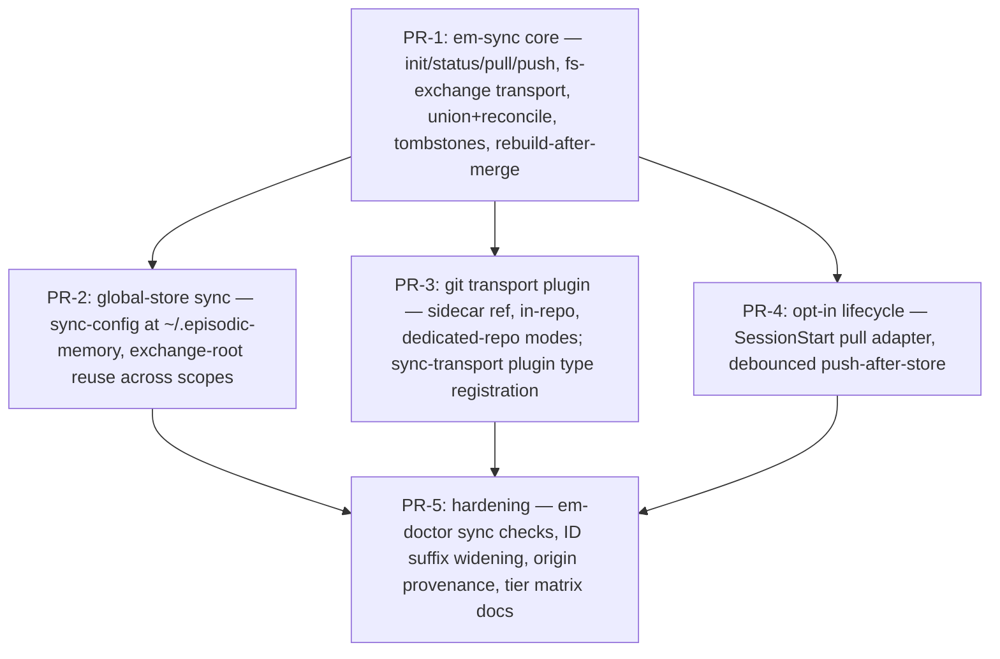

# RFC-013 — Episode Sync: Cross-Host Replication of Project and Global Episode Stores

## AI context

> This RFC adds `em-sync` — opt-in, transport-pluggable replication of episode stores across hosts, so every coding-harness instance working on the same repo (and every machine sharing one user's global store) sees the same episodes. It solves the problem that both store scopes are strictly host-local today: a fresh clone or a second machine starts blind, workplan discovery fails, and lessons learned on one host never reach another. The key design decision is twofold: only durable episode content replicates (derived indexes and usage counters stay host-local and are rebuilt after merge, reducing sync to file union plus a small deterministic reconcile), and the reference transport is a **plain-filesystem exchange directory driven by Node stdlib only** — no server, no daemon, no second data layer, and no external binary; git is an optional transport *plugin*, honestly labeled as the dependency it is (Principles 1, 5, 6).

---

## Problem

Both episode stores are directories on one machine's disk and nothing else:

- **Project scope** — `<repo>/.episodic-memory/` is resolved per working copy (`lib/local-dir.mjs`). It is not committed, not pushed, and not part of any distribution path. Two harnesses working the same repository from different hosts (a laptop, a CI runner, a Claude Code on the Web container, a teammate's machine) each accrete a private, divergent store. A fresh remote container clones the repo and finds **no episodes at all**: the session-start workplan discovery documented in `CLAUDE.md` (`em-search --tag workplan --category decision …`) returns empty on every host that did not author the workplan.
- **Global scope** — `~/.episodic-memory/` holds cross-project lessons, playbooks, and promoted knowledge (RFC-012), all trapped on the machine that learned them. A user working from two machines maintains two disjoint "global" memories.

Observable consequences today:

1. A decision stored on host A is invisible to the harness on host B doing the same work an hour later; B re-litigates or contradicts it.
2. Revision chains fork: B, unaware of A's episode, stores a fresh (unlinked) episode instead of revising, so the supersedes chain no longer identifies a single current truth.
3. RFC-009 lesson activation and RFC-012 promotion only ever see one host's evidence, undercounting recurrence.

There is no supported mechanism — documented or scripted — to move a store between hosts other than hand-copying the directory, which also copies host-local artifacts (`index.jsonl` usage counters, locks) that must not be shared and conflict when they are.

---

## Proposal

Add a **replication capability** for episode stores: a zero-dependency `scripts/em-sync.mjs` CLI operating per store (project or global), a per-store `sync-config.json` written only by explicit `em-sync init` consent, and a pluggable transport layer. The **reference transport is `fs-exchange`**: a shared exchange directory on any medium the user already has (a Syncthing/Dropbox/OneDrive-synced folder, an NFS/SMB mount, a cloud-drive mount, a USB stick), driven entirely by Node `fs`/`crypto` stdlib. Git is **not required**; it is available as an opt-in transport plugin for users whose only shared endpoint is their repo's remote — declared honestly as an external-binary dependency (Principle 5), never as "zero-dep". No daemon, no server, no new data layer: sync is an operation *over episode files*, and everything else in the store is rebuilt locally after a merge.

### 1. The replication model: synced set vs host-local set

The store partitions cleanly (verified by runtime probes, §"Runtime evidence"):

| Store artifact | Class | Sync? | Why |
|---|---|---|---|
| `episodes/*.md` | durable content | **yes** | the substrate itself |
| `archived/*.md`, `archived-index.jsonl` | durable content | **yes** | archival is a curation outcome, not host state |
| `index.jsonl` | derived + host telemetry | no | rebuilt by `em-rebuild-index`; carries `access_count` / `last_accessed` / `feedback`, which are per-host usage signals |
| `tags.json`, `category-index.json`, `tokens.json` | derived | no | fully rebuilt from episode files |
| locks, `installs.json`, `dist/`, enforcement config | host/distribution state | never | meaningless or harmful on another host |

Because the synced set is (a) append-mostly and (b) sufficient to regenerate everything else, **sync = union of episode files + local `em-rebuild-index`**. The probe in §"Runtime evidence" demonstrates exact convergence: copying only `episodes/*.md` from replica A into replica B and rebuilding makes both episodes searchable on B with correct metadata, no index file ever traveling.

**Backfill is by construction, not a migration step.** The synced set is the *entire current store* — every past episode already accumulated (design decisions, workplans, violations, lessons) — never a from-now-on stream. A replica's first `push` publishes its full corpus; a brand-new host's first `pull` receives all of it. There is no separate import/export tool and no cutover date: the existing store on the machine that has been accreting this project's memory *is* the seed, and enabling sync on it makes the whole history the payload. This matters because the accumulated corpus — not future episodes — is what agents joining the project are currently blind to.

Usage counters deliberately stay host-local in v1: they are relevance telemetry about *this host's* sessions, they merge poorly (sums need CRDT bookkeeping), and losing them costs only ranking nuance. OQ-3 tracks a future merge rule.

### 2. Merge semantics: union + deterministic reconcile

**Invariant — episode identity is global.** An episode's ID is minted exactly once, at first store, on the authoring host, and is byte-identical on every replica forever: sync never mints, renames, renumbers, or re-slugs an ID, in any direction, under any conflict rule (the quarantine path preserves both *contents* but never forks the *ID*). This is load-bearing, not cosmetic — `supersedes` chains, `--evidence`/`--lesson` linkage, MEMORY.md anchors, and RFC-012 provenance are all ID references, and they must resolve identically on whichever host they are read. It extends RFC-005's ID-preserving discipline (built for local↔global moves) across the host boundary.

Episode IDs are immutable and corrections are revision chains (Principle 7), so the store is *nearly* a grow-only set — but runtime probing shows three real mutation classes that a naive "immutable files, pure union" design would corrupt. The reconcile step handles each deterministically:

| Divergence on the same episode ID | Cause | Reconcile rule |
|---|---|---|
| `status: active` vs `status: superseded` in frontmatter | `em-revise` flips the *original* file's status in place (probe-verified, §"Runtime evidence") | **Recompute, don't choose:** after union, `status` is derivable — an episode is `superseded` iff any episode in the merged set carries `supersedes: <id>`. Reconcile recomputes status from the supersedes graph; both replicas converge regardless of merge order. |
| `pinned: true` vs absent/false | `em-pin` / `--pin` writes frontmatter + index | **Pin wins.** Not derivable, so a conservative monotone rule: protection is never lost by syncing. A deliberate unpin propagates by running `em-pin --unpin` *after* a sync round (documented; OQ-1 revisits if this bites). |
| present in `episodes/` on one replica, `archived/` on the other | `em-prune` moves files | **Archived wins, carried by tombstones** (§4): every em-sync transport records the archive-move as an explicit tombstone entry, so no replica can resurrect a pruned episode by re-offering the pre-move file. (Pointing a raw file-sync tool at the store *without* em-sync lacks tombstones and can resurrect — the documented WEAK caveat, Principle 5, detectable by `em-doctor`.) |
| any other byte difference | should never happen (bodies are immutable by convention) | **Quarantine, never overwrite:** the losing variant is preserved at `<store>/sync/conflicts/<id>.<replica>.md`, `em-sync status` and `em-doctor` flag it, and resolution is a human/agent decision — mirroring `em-move`'s found-in-both-scopes hard-error stance (RFC-005 F3). |

After every merge: acquire the store lock (`lib/lock.mjs`), run reconcile, run `em-rebuild-index --scope <s>` (atomic temp+rename already), release. Sync never edits an episode body and never mints an ID.

Note the common case is trivial: a file changed on **one** replica only (every new episode, every revision made on a single host) unions cleanly with no reconcile decision at all. The rules above cover the rare concurrent-touch cases.

### 3. `em-sync.mjs` — the CLI contract

Zero external dependencies — Node stdlib only, including the reference transport. JSON to stdout, degrades gracefully (missing config → `{"status":"not-configured"}`, exit 0 on status/read paths).

```
node scripts/em-sync.mjs init   [--scope local|global] [--transport fs-exchange|git] [--exchange-root <dir>] [git plugin: --mode sidecar|in-repo|repo <url>]
node scripts/em-sync.mjs status [--scope local|global|all]      # ahead/behind/conflicts, never writes
node scripts/em-sync.mjs pull   [--scope ...]                   # ingest foreign replicas → union+reconcile → rebuild index
node scripts/em-sync.mjs push   [--scope ...]                   # refresh this replica's published subtree
node scripts/em-sync.mjs sync   [--scope ...]                   # pull then push
node scripts/em-sync.mjs disable [--scope ...]
```

Per-store config at `<store>/sync-config.json` (project) and `~/.episodic-memory/sync-config.json` (global):

```json
{
  "transport": "fs-exchange",
  "exchange_root": "/path/to/shared/em-exchange",
  "auto_pull_on_session_start": false,
  "auto_push_after_store": false,
  "replica_id": "<hostname>-<8hex>"
}
```

`sync-config.json` is host-local (never synced) and exists only after explicit `em-sync init` consent. No config → every subcommand is a no-op with a status token, so sync-unaware hosts are unaffected.

### 4. Transports — reference implementation is plain filesystem, stdlib-only

#### 4.1 `fs-exchange` (default, core)

The "remote" is nothing but a directory all replicas can reach — *how* it is shared is the user's business (Syncthing, Dropbox, OneDrive, iCloud, an NFS/SMB mount, a cloud-drive FUSE mount, a USB stick carried between machines). em-sync itself performs only local `fs` operations against it:

```
<exchange-root>/
  em-exchange.json                    # format marker: { format: "em-exchange", version: 1 }
  replicas/
    <replica_id>/
      manifest.json                   # the COMMIT POINT: { seq, written_at, files: { "<relpath>": "<sha256>" } }
      episodes/<id>.md                # full mirror of this replica's synced set
      archived/<id>.md
      archived-index.jsonl
      tombstones.jsonl                # append-only: { id, action: "archived"|"moved-scope", ts, replica }
```

Three rules give dumb storage strong semantics:

- **Single writer per subtree.** A replica writes *only* `replicas/<own-id>/` and reads all others. There is no cross-host write contention anywhere on the shared medium — no locking protocol, no push races, no retry loop. Team/multi-agent use is namespaced by construction.
- **Manifest is the commit point.** `push` writes content files first (temp + rename), the manifest last; `pull` verifies each foreign subtree against its manifest checksums and, on any mismatch (the underlying medium propagated a partial state), skips that replica *this round* and reports it — degrade and retry later, never ingest a torn write.
- **Tombstones make moves first-class.** `em-prune` archival and `em-move` scope relocation publish explicit tombstone entries, so a stale replica's re-offer of the pre-move file loses deterministically (§2). This is what raw folder-syncing of the store could never express — and it is transport-independent, so *every* em-sync transport inherits it.

`pull` = for each foreign subtree with a consistent manifest: union episode files, apply tombstones, reconcile (§2), rebuild index. `push` = refresh own subtree to mirror the local synced set (incremental via manifest checksum diff). Storage cost is `replicas × synced-set size` — markdown-cheap; a replica may compact its own subtree at will (it is its only writer). OQ-2 tracks delta bundles if mirrors ever get heavy.

#### 4.2 Transport plugins (opt-in, honestly labeled)

The transport seam registers as a `sync-transport` plugin type (experimental tier per CAPABILITIES.md). `fs-exchange` is the built-in default; plugins trade the "any shared folder" requirement for other reach, and each declares its true dependencies:

| Transport | Scope | Mechanism | Dependencies | Tier |
|---|---|---|---|---|
| **fs-exchange** (default) | both | exchange directory on any user-shared medium | Node stdlib only | STRONG semantics; propagation latency is the medium's |
| **git plugin** — sidecar ref / in-repo / dedicated repo | project or global | exchange payload carried on a dedicated ref (`refs/em/sync`) of the repo's existing `origin`, committed in-repo, or in a separate private repo | **external `git` binary** + a reachable remote | STRONG; the honest fit for hosts whose *only* shared endpoint is the repo remote (CI runners, ephemeral web containers) |
| **https-exchange plugin** | both | same exchange format over WebDAV / S3-compatible storage via stdlib `fetch` + `crypto` signing | stdlib + a provisioned endpoint & credentials | MEDIUM until proven |
| raw file-sync of the store, no em-sync | either | pointing a sync tool directly at `episodes/` | — | WEAK: no tombstones (resurrection), no reconcile (conflict copies), documented for what it is |

#### 4.3 Transfer granularity: file-based delta, deliberately not block-based

Incremental transfer is rsync-*like* at **file granularity**: `push`/`pull` diff manifest sha256 maps and move only files whose checksum differs — after the first backfill, a sync round transfers exactly the episodes that changed, typically a handful of small markdown files. **Block-based** delta (rsync's rolling-checksum algorithm, which ships changed byte ranges *within* a file) is deliberately rejected: it earns its complexity on large files that mutate internally, and this corpus is the opposite shape — thousands of small (~KB) write-once files whose only in-place mutations are one-line frontmatter flips (§2). The break-even is never reached; whole-file transfer of a changed episode costs less than computing its rolling checksums. If replica mirrors ever get heavy the pressure shows up as *storage*, not transfer, and the remedy is content-addressing across subtrees (identical episodes stored once, manifests pointing at blobs) — tracked in OQ-2, still file-granular.

#### 4.4 Day-zero seeding: the repo working tree as a read-complete replica

Every transport above assumes the participating host can reach *some* medium. But for **project scope** there is one medium every agent already holds before any sync machinery exists: **the repository clone itself**. `em-sync seed --to-repo` copies the synced set (episodes + archived + tombstones — never indexes, counters, locks, or `sync-config.json`) into the version-controlled `.episodic-memory/` of the working tree, with the host-local set gitignored. From then on **every clone is a read-complete replica at clone time**: session start runs `em-rebuild-index` (cheap, local) and the entire accumulated corpus — past design decisions, workplans, lessons — is searchable with zero transports configured, zero dependencies, zero reachability requirements. This is the fix for the observed day-zero failure (this RFC was itself authored in an ephemeral container where `CLAUDE.md`'s session-start workplan discovery returned empty, because the corpus existed only on the maintainer's machine).

Two honest boundaries (Principle 5): seeding is **team-visible by design** — the corpus enters the repository and its access control becomes the repo's — so `seed` is a consent-gated, explicit act with the same unconditional publish warning as any push; and the seeded copy is a **read tier** — an agent's *new* episodes land as untracked files in the seeded directory, and write-back travels by whatever path the agent's work already travels (committed alongside its changes — memory riding the same PR as the code it explains — or any §4 transport). Seed + fs-exchange compose cleanly: seed answers "can a fresh host read the past *right now*"; transports answer "how do hosts continuously exchange the present".

One deployment reality stated plainly (Principle 5): the fs-exchange medium must be reachable by every participating host. A laptop fleet shares a Syncthing folder trivially; an **ephemeral CI or remote-web container usually cannot mount one** — its only pre-provisioned shared endpoint is the repo's git remote. For those hosts the git plugin (or an https-exchange endpoint) is the practical medium; that is a deployment constraint of such hosts, not a git requirement in the design.

### 5. Activation lifecycle — no daemons (Principle 6)

- **Default:** manual. `em-sync pull` at session start and `em-sync push` when done are the documented workflow; the skill/instructions files gain one line each.
- **Opt-in session-start pull:** mirrors the existing `auto_update` pattern (`em-sync-install.mjs` + SessionStart hook): one bounded pull attempt per session start, single-line `notice` in session output, degrade-to-token on any failure, never blocks a session. Per-project registration only (Principle 12) for project scope.
- **Opt-in push-after-store:** a debounced push (fire at session end or N minutes after the last `em-store`, whichever first) — declared trigger, declared cost, off by default.
- Explicitly rejected: any polling daemon, watcher service, or background timer not user-started and bounded. (An `fs.watch` on the exchange root would be cheap but is still a standing watcher; it stays out of core and out of v1.)

### 6. Consent, privacy, reversibility (Principles 3, 10)

- `em-sync init` declares its side effects before writing anything: config file created, exchange subtree created, and — most important — **"pushing publishes these episodes to `<exchange-root|remote>`; anyone with read access to that location can read them."** Project episodes routinely contain repo-internal reasoning; the warning is unconditional, whatever the transport.
- `em-sync disable` removes the config; it never deletes episodes, local or remote (the replica's published subtree is left for other replicas unless `--purge-published` is passed explicitly). Round-trip restores the pre-init state.
- Sync never activates enforcement, and enforcement never depends on sync (Principle 12 I-4: the substrate — now including its replication — stays hook-free at core; the optional SessionStart pull is an adapter, registered per-project).

### 7. Identity and provenance across hosts

- Episode IDs (`<ts>-<slug>-<4 hex>`) are minted independently per host. Same-second, same-slug, same-2-byte-suffix collisions are now possible across replicas (~1/65536 given identical second+slug). Two hardening steps: (a) `em-store` widens the random suffix to 4 bytes (backward-compatible: IDs only ever grow, existing IDs untouched); (b) sync treats same-ID-different-body as a quarantine conflict (§2), so even a collision cannot silently overwrite.
- New episodes written in a sync-enabled store carry an `origin: <replica_id>` frontmatter field — pure provenance (debugging "where did this decision come from", RFC-012 recurrence counting across hosts), never used for ranking.

### 8. Where this sits in the architecture

By the CAPABILITIES.md test — *"if it operates ON episodes it belongs to a capability family"* — sync is a substrate capability, not distribution (distribution "moves artifacts, it never touches episodes"). It joins the **curation strategy** family: it maintains the corpus across replicas, derives no new knowledge, changes no ranking, enforces nothing, and honors the family invariant of reversibility (quarantine over overwrite, disable over delete). The transport seam registers as a new **experimental-tier plugin type `sync-transport`** (RFC-008 R8 additive MINOR bump): `fs-exchange` is the stdlib-only built-in; `git` and `https-exchange` are plugin members with declared external dependencies, and the promote-or-remove decision date is set at acceptance.

### Scope

- **In scope:** `em-sync.mjs` (init/status/pull/push/sync/disable/seed); union+reconcile merge; tombstones; global episode-ID identity invariant; backfill-by-construction; day-zero repo seeding (`seed --to-repo`); the `fs-exchange` reference transport; the git transport plugin (sidecar-ref, in-repo, dedicated-repo modes); global-store sync; opt-in session-start pull / push-after-store; `em-doctor` sync checks; ID-suffix widening + `origin` provenance; docs/tier matrix.
- **Out of scope:** real-time sync or daemons; syncing usage counters (`access_count`/`feedback` — OQ-3); syncing derived indexes, locks, registry, dist cache, or enforcement config; multi-user permission models beyond what the shared medium's ACL provides; conflict *resolution* UI (quarantine + doctor flag only); the https-exchange plugin implementation (format is specified; plugin ships separately).

---

## Alternatives considered

| Alternative | Why rejected |
|---|---|
| **Git as the reference transport** (this RFC's own first draft) | Demoted, not deleted: spawning the `git` binary is an external runtime dependency, and "zero-dep" in this project means Node stdlib only — claiming git "adds zero dependencies" was dishonest labeling (Principle 5). The correctness machinery never needed git; `fs-exchange` + tombstones achieves the same semantics over media users already have. Git remains an opt-in plugin because for some hosts (CI, ephemeral containers) the repo remote is the only shared endpoint that exists. |
| Central sync server / API (self-hosted or SaaS) | Second store + background service: violates Principle 1 (episodes stop being the only data layer) and Principle 6 (long-lived process); adds auth/ops burden a shared folder or existing remote already solves. |
| Sync the whole store directory (including `index.jsonl`, `tags.json`, …) | Derived indexes conflict on every concurrent session (append-ordered `index.jsonl`, whole-file JSON rewrites) and carry host telemetry; syncing them buys nothing since `em-rebuild-index` regenerates them from the synced set — probe-verified. |
| CRDT database / sidecar (e.g. Automerge store) | The episode model is *already* a natural grow-mostly set with revision chains; a CRDT engine imports a dependency and a second data representation for a problem three reconcile rules and a tombstone log solve. Principle 1 trigger without the "cannot be expressed as episodes" condition being met. |
| Documentation-only answer ("rsync/Syncthing the directory yourself") | Hand-syncing the full directory corrupts host-local state (counters, locks), silently resurrects archived episodes, and leaves same-ID conflicts as tool-specific "conflicted copy" litter. The synced/host-local partition, tombstones, and reconcile rules are exactly the parts documentation alone cannot supply. Retained only as the documented WEAK tier. |
| Peer-to-peer transport built into em-sync (sockets, mDNS discovery) | A listening process is a daemon by another name (Principle 6) and stdlib networking would still need discovery, auth, and NAT answers; a user-chosen shared medium already solves all three. |
| Block-based (rolling-checksum) delta transfer inside files | Pays off on large internally-mutating files; the corpus is thousands of small write-once markdown files whose only in-place edits are one-line frontmatter flips. File-granular manifest diff already ships only what changed; block math would cost more than it saves (§4.3). |
| Treating sync as future-episodes-only (a stream with a start date) | The accumulated corpus is the value — past decisions, workplans, lessons are exactly what joining agents are blind to. Backfill-by-construction (§1) and day-zero repo seeding (§4.4) make the existing store the payload, not an afterthought needing a separate migration tool. |

---

## Implementation plan

> To be finalized when the RFC moves to `accepted`; proposed phasing below.

### Sequencing



---

## Implementation

| PR/Commit | Files changed | Tests | Notes |
|---|---|---|---|
| _pending_ | _pending_ | _pending_ | _pending_ |

---

## Runtime evidence

Per the repo convention (behavior simulation before design claims), the load-bearing claims were probed against isolated fixture stores (non-git scratch dirs, `--scope local`, explicit `cwd`), 2026-07-14:

1. **Union + rebuild converges; derived indexes never travel.** Two replicas each stored one episode; copying only `episodes/*.md` from A into B and running `em-rebuild-index --scope local` on B yielded `{"status":"ok","rebuilt":[{"scope":"local","count":2,…}]}` and `em-search` on B returned both episodes with correct tags/category/status — no index file was copied. This is also the existence proof for the fs-exchange transport: the entire merge is expressible as local file operations.
2. **Cross-replica revision chains resolve.** `em-revise` on B against the A-authored ID returned `{"status":"ok","id":"20260714-224110-revised-on-host-b-e810","supersedes":"20260714-224042-episode-written-on-host-a-ace2",…}` and `em-search --history` showed the full two-link chain with the original `status: superseded`.
3. **Episode files are not byte-immutable — reconcile is required.** After the revision on B, `diff` of the *original* episode file across replicas showed exactly one line: `status: active` (A) vs `status: superseded` (B). This is the concrete basis for the recompute-status reconcile rule (§2) and the reason pure "immutable union" designs are wrong for this store.

---

## Related RFCs

- **RFC-005 (em-move)** — establishes ID-preserving relocation and the found-in-both-places hard-error stance that §2's quarantine rule mirrors; scope moves are a mutation class sync must survive (tombstoned, OQ-5).
- **RFC-008 (decoupled enforcement)** — sync is substrate-side and hook-free at core; the optional SessionStart pull follows RFC-008's per-project adapter discipline and the `sync-transport` plugin type rides its plugin registry (R8).
- **RFC-009 / RFC-012 (lesson activation, promotion arc)** — direct beneficiaries: cross-host recurrence becomes visible to promotion, and lessons activate on every replica, not just the authoring host.

---

## Second opinion

> Required before `status: accepted` can be set.

**Reviewer:** <!-- name or "self-review" -->
**Date:** <!-- YYYY-MM-DD -->
**Findings:** <!-- gaps surfaced, alternatives missed, risks not captured — or "no gaps found" -->
**AI-slop check:** <!-- clean | fixed in revision | concerns:[<list>] -->
**Decision:** <!-- proceed | revise first -->

---

## Open questions

| # | Question | Owner | Status |
|---|---|---|---|
| OQ-1 | Is monotone pin-wins acceptable, or does concurrent unpin-vs-pin need a timestamped rule? | — | open |
| OQ-2 | fs-exchange mirrors are full copies per replica; do large stores need delta bundles / content-addressed sharing across subtrees? | — | open |
| OQ-3 | Should `feedback`/`access_count` eventually merge (e.g. per-replica counters summed at read time)? Host-local in v1. | — | open |
| OQ-4 | Team semantics: per-replica subtrees namespace writers by construction, but does read access need partitioning too (per-user exchange roots vs one shared root)? | — | open |
| OQ-5 | Does `em-move` (local↔global) need more than a tombstone — e.g. a cross-scope pointer so a chain split across scopes stays discoverable from either exchange? | — | open |

---

## Deferral note

> Populate only if status changes to `deferred`.

---

## Withdrawal note

> Populate only if status changes to `withdrawn`.

---

## Supersession note

> Populate only if status changes to `superseded`.
