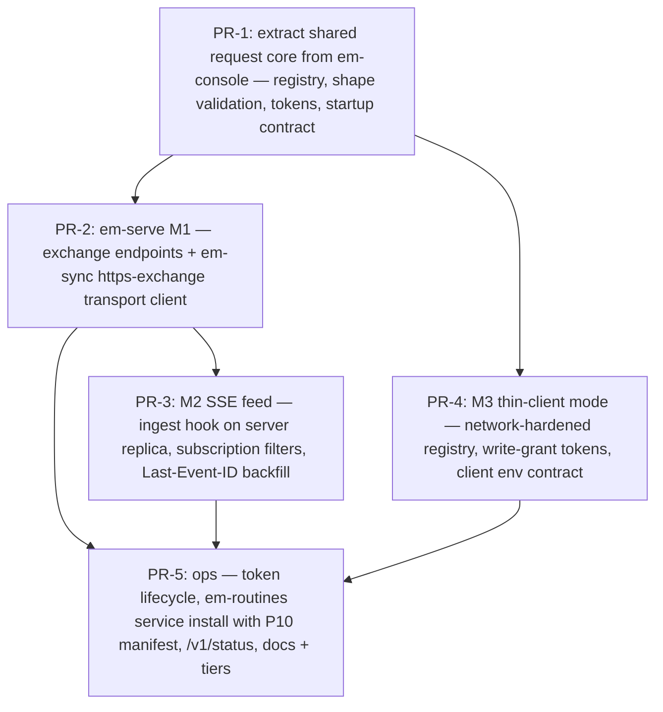

# RFC-014 — em-serve — Episode Server: Rendezvous Sync, Live Episode Feed, and Remote Recall over the CLI Contract

## AI context

> This RFC adds `em-serve` — an optional, user-started episode server: a Node-stdlib HTTP process fronting an ordinary episode store, giving RFC-013 sync an always-reachable rendezvous, harnesses a live cross-host episode feed (SSE), and storeless ephemeral hosts a thin-client store/recall path. It solves what passive replication cannot: hosts with no mutually reachable shared folder (CI runners, web containers), and the latency gap where a decision on host A is invisible on host B until B happens to pull. The key design decision is that the server is an **adjacent-layer adapter, not a second data layer**: its store is a normal on-disk episode store operated through the same CLI contract (the `em-console` architecture generalized), it is a *peer*, never a master — every harness with a local store stays offline-first, and losing the server degrades to plain RFC-013 sync latency, never to blindness.

---

## Problem

RFC-013 makes episode stores replicable, but replication over a passive medium has three structural gaps:

1. **No rendezvous for ephemeral hosts.** The `fs-exchange` medium must be a directory every replica can reach. A laptop fleet has one (a synced folder); a CI runner or a Claude-Code-on-the-Web container does not — its only pre-provisioned endpoint is the repo's git remote, which drags the git dependency back in through the side door. There is no first-party, stdlib-only endpoint a user can stand up once and point every host at.
2. **No liveness.** Sync is pull-based. Two harnesses working the same repo concurrently on different hosts only converge at the next pull; a decision stored on host A mid-session is invisible to host B *during* the session — precisely when contradicting it is most likely. RFC-003's cross-tool messaging and RFC-009's advisory activation stop at the machine boundary for the same reason: nothing can tell a remote harness "a new episode relevant to you just landed."
3. **No path for storeless hosts.** A short-lived container may not want a store replica at all (nothing durable survives it). It needs to *use* memory — store a decision, recall context — without owning a copy. Today that host simply has no memory.

The reflex answer — "run a server" — has been repeatedly rejected in this project's history, but the rejections were of specific shapes (silent daemons, sidecar databases), not of servers as such. The box needs to be reopened deliberately, against the principles, rather than assumed shut.

---

## Why a server is admissible (the principles, re-read)

- **Principle 1 forbids a second *data layer*, not a second *process*.** `em-serve`'s store is a normal `~/.episodic-memory`-shaped directory: markdown episodes, rebuildable indexes, operated by the same `em-*` scripts. You can ssh into the server host and run `em-search` against it directly. No database, no queue, no state that is not episodes. What is new is transport and presentation — and CAPABILITIES.md already names **Distribution** and **Presentation** as sanctioned adjacent layers that "consume the substrate and never extend the data layer."
- **Principle 6 forbids silent unbounded background *spend*, not the mechanism** — verbatim: *"an explicitly launched local console qualifies; a silent polling daemon never does."* An idle HTTP server spends zero tokens: it is event-driven (requests arrive; between them it does nothing), user-started, visible, and declared. The admissibility checklist P6 states — user-started, visible while running, bounded, near-zero cost when idle, trigger and cost declared up front — is satisfiable and is made a hard requirement below (§6).
- **Precedent already ships.** `em-console.mjs` is a stdlib `http` server over the CLI contract: user-started, loopback, per-launch token, idle-timeout, a CLOSED command registry, read-only unless `--allow-write`, and it validates request *shape* while the spawned script decides everything (Principle 11). `em-serve` is that architecture generalized — different bind scope, longer lifetime, more endpoints — not a new species.
- **Principle 9/11 hold by construction:** the server imports core scripts, never the reverse; it translates HTTP to the JSON-and-CLI contract and adds no decision logic.

What remains genuinely forbidden, and stays forbidden here: making the server *required* (the substrate must work with zero adapters, P9), making it the *only* copy (a partition must never blind a harness), and any client-side polling loop against it (liveness is push/SSE, not poll, P6).

---

## Proposal

`scripts/em-serve.mjs` — one stdlib-only process (`node:http`/`https`, `crypto`, `fs`), refactored to share its request core with `em-console` (closed command registry, shape validation, token auth, single-JSON-startup-line). Four modes, independently enableable in `serve-config.json`; everything is off by default.

### 1. M1 — Rendezvous sync (the server side of RFC-013)

The server fronts an ordinary **fs-exchange root** (RFC-013 §4.1) over HTTP — it *is* the `https-exchange` transport RFC-013 specified but left unimplemented:

```
GET  /v1/exchange/replicas                          → list replica ids + manifest checksums
GET  /v1/exchange/replicas/<id>/manifest.json       → manifest (the commit point)
GET  /v1/exchange/replicas/<id>/files/<relpath>     → content file
PUT  /v1/exchange/replicas/<self>/files/<relpath>   → upload (own subtree only, token-bound)
PUT  /v1/exchange/replicas/<self>/manifest.json     → commit (validated: checksums must match uploads)
```

The exchange invariants carry over unchanged: single writer per subtree (enforced now by auth — a replica's token can only write its own subtree), manifest-as-commit-point (the server rejects a manifest referencing missing/mismatched files, so torn pushes are impossible, strengthening the passive-medium guarantee), tombstones as specified. The server host itself typically also runs a replica, making it an always-on peer whose subtree is the freshest view for newcomers. `em-sync` gains `--transport https-exchange`; **merge logic does not move** — clients still union+reconcile locally exactly as in RFC-013.

### 2. M2 — Live episode feed (SSE)

```
GET /v1/events?project=<p>&tags=<t1,t2>&categories=<c1,c2>   (Accept: text/event-stream)
```

When the server's replica ingests an episode (its own store or a pushed subtree), it emits the episode's **index row** (small JSON, P6) to matching subscribers. Server-Sent Events over stdlib `http` — no WebSocket dependency, auto-reconnect with `Last-Event-ID` backfill from `index.jsonl` order so brief disconnects lose nothing. This is push, not poll: an idle subscription costs one parked socket and zero tokens on both sides.

What it unlocks: a harness on host B learns *mid-session* that host A stored a decision touching its current work (surfaced through the RFC-009 advisory plane — bounded pointer, never enforcement); RFC-003 typed requests (`recipient`/`audience` routing, P8) finally cross the machine boundary — a review request stored on A can wake the consumer on B without either side polling.

**Delivery semantics — stated, not implied.** The near-realtime scenario ("A stores a design decision, B must pick it up mid-session") only works if the failure modes are contractual:

- **At-least-once, idempotent by ID.** Events may be delivered twice (reconnect races); consumers ingest by episode ID and duplicates are no-ops. The global-ID invariant (RFC-013 §2) is what makes idempotence free.
- **No cross-episode ordering guarantee.** A revision's event can arrive before its ancestor has synced. The consumer tolerates a dangling `supersedes` (the substrate already treats these as warn-not-error in `em-doctor`) and it heals at the next pull. Full pulls remain manifest-atomic; only the feed can produce this state.
- **The event is a hint, not the payload.** An event carries the episode's index row plus `replica` + `relpath`; the body may not have reached B's replica yet. The consumer fetches the body through the M1 exchange endpoints (or M3 `em-search --full`), falling back to a targeted `em-sync pull` — never blocking on it.
- **Disconnection loses nothing.** `Last-Event-ID` reconnect backfills from index order; a dead feed degrades to RFC-013's pull cadence, never below it. Heartbeat comments every ~30s keep intermediaries from silently killing idle streams.
- **The window is seconds, never zero — and nothing may pretend otherwise.** If A and B cross inside the propagation gap, the result is a supersession fork, handled by RFC-013 §2.1 (detected at merge, disclosed on read, resolved by a multi-`supersedes` episode). The feed is what makes RFC-013's stale-base guard (D-5) effective across hosts; it is never a freshness guarantee, so no enforcement gate may key off it (RFC-008 discipline).

### 3. M3 — Thin-client store/recall for storeless hosts

```
POST /v1/run   { "command": "em-store", "flags": { ... } }     # em-console's registry, network-hardened
```

The `em-console` pattern verbatim: a CLOSED registry of `em-*` commands, shape-validated, spawned against the server's store, JSON returned untouched. A CI container gets `EM_SERVER_URL` + a token and can store the decision it just made and recall the workplan — no local store, no git, no exchange folder. Honest label (P5): this mode is availability-coupled — server unreachable means no memory for that host — which is why it is reserved for hosts that *have* no store, never a replacement for local stores on durable hosts. Write commands require a token minted with `--allow-write`, mirroring the console's read-only default.

### 4. M4 — Recall-as-a-service (later phase, separate consent)

The substrate already carries optional heavier recall (`em-embed`, `em-semantic`). One beefy host can maintain the embedding index for a shared store and expose `em-recall --strategy semantic` through the M3 registry; thin hosts get semantic recall without shipping models or indexes anywhere. Nothing new architecturally — it is M3 with a different registry entry — but split out because its cost profile (embedding maintenance) deserves its own declared budget and opt-in.

### 5. Topology and the offline-first invariant

- The server is **a peer with a good address**, not a master. Harnesses with local stores read locally, write locally, and sync — M1/M2 only shortens convergence latency. Server loss degrades to RFC-013's pull cadence; it never blinds a harness or blocks a write.
- The server's store is disposable in the same sense as any replica: rebuildable from any other replica's subtree via a plain `em-sync pull`. Backup is `em-backup` on the server host — no special machinery.
- Deployment targets, in increasing ambition: same-LAN box / home NAS (plain HTTP, LAN-only bind, documented as such), a VPN/tailnet address (recommended default posture), an internet-facing host behind a TLS reverse proxy (documented; `em-serve` itself does TLS only via `--tls-cert/--tls-key` passthrough to `node:https`, no ACME machinery in core).

### 6. Lifecycle, consent, auth (Principles 3, 6, 10)

- **Start:** `node scripts/em-serve.mjs --config <path>` prints one JSON line (`{status, url, modes, pid, idle_timeout…}`) exactly like `em-console`. Persistent operation is installed only through the existing consent surface — `em-routines.mjs` (systemd user units / launchd / cron fallback) — with the P10 side-effect manifest listing the unit file, config, and backout action. Uninstall is first-class and restores pre-install state.
- **P6 checklist as hard requirements:** user-started (never auto-spawned by any hook or session event); visible (`/v1/status` + a `serving` status token in `em-sync status` on clients); near-zero idle cost (event-driven; the only timer is an optional idle-timeout for casually launched instances; routine-installed instances declare "long-lived, zero idle token spend" in the manifest); declared trigger and cost up front at install.
- **Auth:** per-replica/per-user bearer tokens minted by `em-serve token issue` (stored hashed server-side; revocable). M1 tokens bind to a replica id (own-subtree writes only); M3 write access is a separate grant. No anonymous writes in any mode; anonymous reads only if explicitly configured (`--public-read`, discouraged).
- **Privacy warning is unconditional at token issue and client init:** anything synced or stored through the server is readable by every credential-holder of that server.

### Scope

- **In scope:** `em-serve.mjs` + shared request core with `em-console`; M1 https-exchange endpoints + `em-sync --transport https-exchange`; M2 SSE feed with Last-Event-ID backfill; M3 network-hardened command registry; token issue/revoke; `em-routines` service installation with P10 manifest; tier/topology docs.
- **Out of scope:** M4 implementation (specified, ships behind its own consent later); ACME/LetsEncrypt automation; multi-tenant SaaS concerns (quotas, billing, org ACLs — the ACL is the token set); federation between servers (two servers sync as ordinary RFC-013 peers, which already works); any client-side polling fallback.

---

## Alternatives considered

| Alternative | Why rejected |
|---|---|
| Keep RFC-013 passive media as the only option | Leaves ephemeral hosts dependent on the git plugin (external binary) and leaves cross-host awareness at pull latency; both gaps are the observed pain, not hypotheticals. |
| Database-backed server (SQLite/Postgres + API) | The classic P1 violation: a second data representation that can drift from the episode log, plus a real dependency. The store-on-disk-behind-CLI design keeps the server auditable with the same tools as every other store. |
| Hosted SaaS memory service | Third-party custody of episode content, credentials, and availability; nothing in the capability needs more than a user-owned process over user-owned files. |
| Peer-to-peer mesh (mDNS/WebRTC/libp2p) | Discovery, NAT traversal, and trust bootstrapping are exactly the problems a user-designated rendezvous host dissolves; every P2P answer imports dependencies and a daemon on *every* host instead of one consented process on one host. |
| WebSockets for liveness | SSE does the job over plain `node:http` with free reconnect/backfill semantics; WebSocket adds protocol surface for bidirectionality M2 does not need (client→server is ordinary HTTP). |
| Exposing the server as an MCP server instead of HTTP+CLI registry | Attractive as an *additional* presentation adapter (harnesses could mount remote memory as tools), but MCP as the base protocol couples the server to harness-side protocol churn and bypasses the stable JSON-and-CLI contract (P11). Revisit as an adapter atop M3 once M3 is real. |
| Making the server the primary store (clients as caches) | Violates offline-first and P9 (substrate must work with zero adapters); a partition would blind every harness. The server is a peer, full stop. |

---

## Implementation plan

> To be finalized when the RFC moves to `accepted`; proposed phasing below.

### Sequencing



---

## Implementation

| PR/Commit | Files changed | Tests | Notes |
|---|---|---|---|
| _pending_ | _pending_ | _pending_ | _pending_ |

---

## Related RFCs

- **RFC-013 (episode sync)** — em-serve M1 is the server side of RFC-013's specified-but-unshipped `https-exchange` transport; all merge semantics (union, reconcile, tombstones) are RFC-013's and run client-side unchanged. RFC-013 remains fully usable with no server.
- **RFC-003 (pluggable tool adapters / cross-tool messaging)** — M2 carries typed requests across the machine boundary using the same `recipient`/`audience` routing (Principle 8); adapters subscribe instead of scanning.
- **RFC-009 (lesson activation)** — M2 events feed the advisory plane so lessons stored on one host can activate on another mid-session, bounded as ever.
- **RFC-012 (promotion arc)** — a shared server store makes cross-host and cross-user recurrence visible to promotion.

---

## Second opinion

> Required before `status: accepted` can be set.

**Reviewer:** <!-- name or "self-review" -->
**Date:** <!-- YYYY-MM-DD -->
**Findings:** <!-- gaps surfaced, alternatives missed, risks not captured — or "no gaps found" -->
**AI-slop check:** <!-- clean | fixed in revision | concerns:[<list>] -->
**Decision:** <!-- proceed | revise first -->

---

## Open questions

| # | Question | Owner | Status |
|---|---|---|---|
| OQ-1 | Token lifecycle: expiry/rotation policy, and whether replica tokens should be derivable from `replica_id` + a server secret instead of a stored table. | — | open |
| OQ-2 | M2 event granularity: index-row only (current design) vs optional body-on-request — does any consumer need bodies pushed, and is that compatible with P6 small-JSON defaults? | — | open |
| OQ-3 | Should the server enforce project-level namespaces (one token sees only some projects) or is per-server scoping (one server per audience) the simpler honest answer? | — | open |
| OQ-4 | Idle-timeout default for routine-installed instances: none (true service) vs a long timeout with socket-activation-style restart via em-routines. | — | open |
| OQ-5 | Does M3 need write-rate limiting to keep a runaway agent from flooding a shared store, and where does that sit relative to "adapters never decide"? | — | open |

---

## Deferral note

> Populate only if status changes to `deferred`.

---

## Withdrawal note

> Populate only if status changes to `withdrawn`.

---

## Supersession note

> Populate only if status changes to `superseded`.
