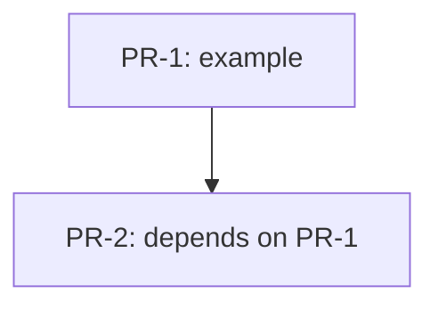

# RFC-NNN — <RFC Title>

## AI context

> Three sentences for fast context loading. (1) What this RFC does. (2) What problem it solves and why the existing approach was insufficient. (3) The one key trade-off or design decision that future readers and AI sessions need to know.

---

## Problem

What is broken, missing, or painful? Ground this in observable behavior. Do not propose a solution here.

---

## Proposal

What exactly changes? Be specific: which files are created or modified, what new behavior is introduced, what old behavior is removed. Use sub-sections if the change has multiple parts.

### Scope

- **In scope:** what this RFC covers
- **Out of scope:** what this RFC explicitly does not address (reduces scope creep in implementation)

---

## Alternatives considered

Document every alternative that was seriously considered and explain concisely why it was rejected.

| Alternative | Why rejected |
|---|---|
| _example_ | _reason_ |

---

## Implementation plan

> Populate this section when the RFC moves to `accepted`. Use phase or PR sub-headings as appropriate.

### Sequencing

---

## Implementation

> Populate during build stage — mark each item immediately after it ships. Do not batch at the end.

| PR/Commit | Files changed | Tests | Notes |
|---|---|---|---|
| _pending_ | _pending_ | _pending_ | _pending_ |

---

## Related RFCs

- _none yet_

---

## Second opinion

> Required before `status: accepted` can be set.

**Reviewer:** <!-- name or "self-review" -->
**Date:** <!-- YYYY-MM-DD -->
**Findings:** <!-- gaps surfaced, alternatives missed, risks not captured — or "no gaps found" -->
**AI-slop check:** <!-- clean | fixed in revision | concerns:[<list>] -->
**Decision:** <!-- proceed | revise first -->

---

## Open questions

| # | Question | Owner | Status |
|---|---|---|---|
| OQ-1 | _example question_ | — | open |

---

## Deferral note

> Populate only if status changes to `deferred`.

---

## Withdrawal note

> Populate only if status changes to `withdrawn`.

---

## Supersession note

> Populate only if status changes to `superseded`.

Superseded by: `RFC-NNN-<new-slug>`
